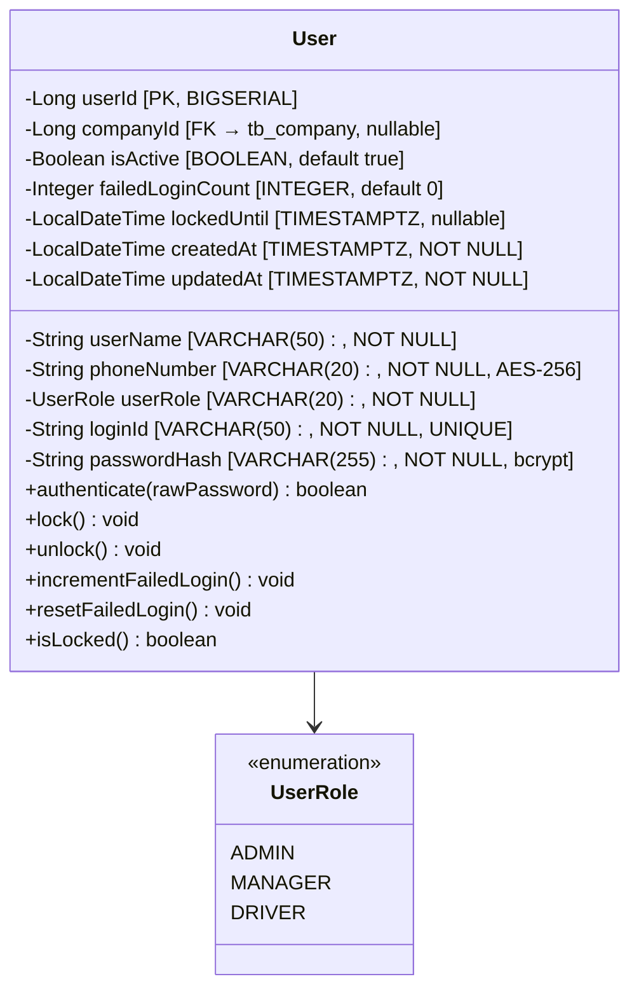
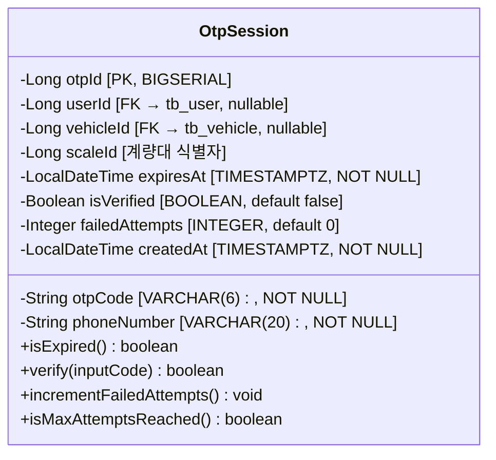
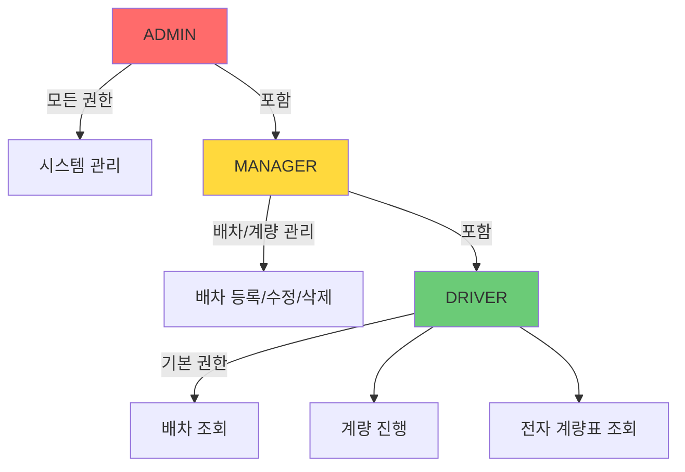
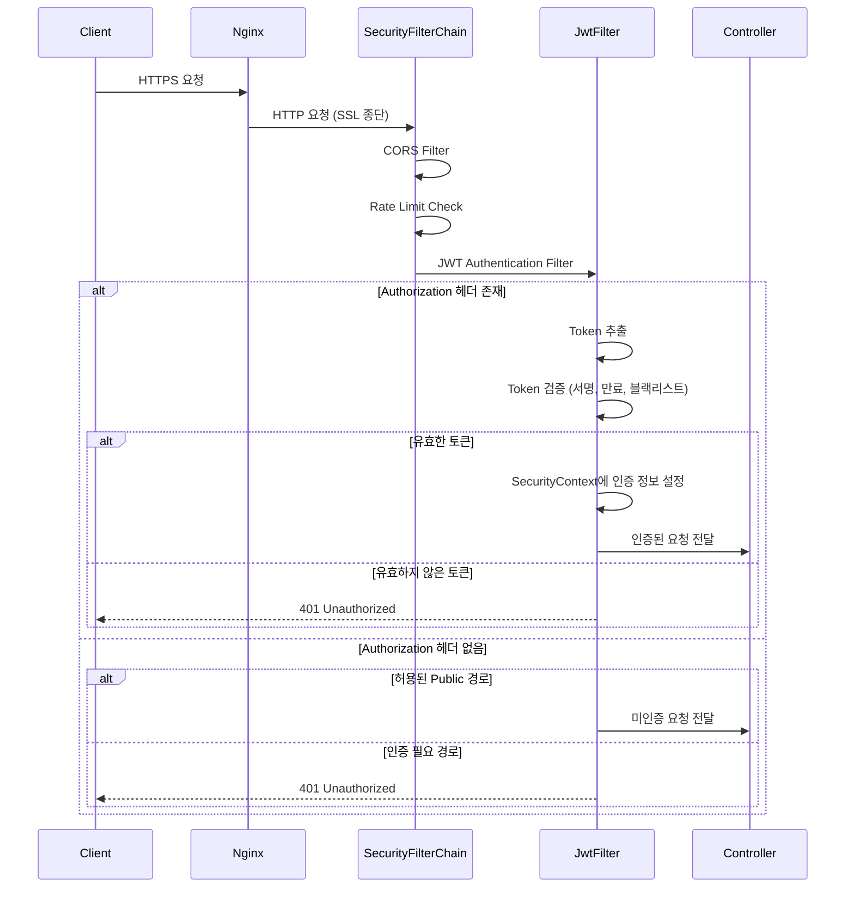
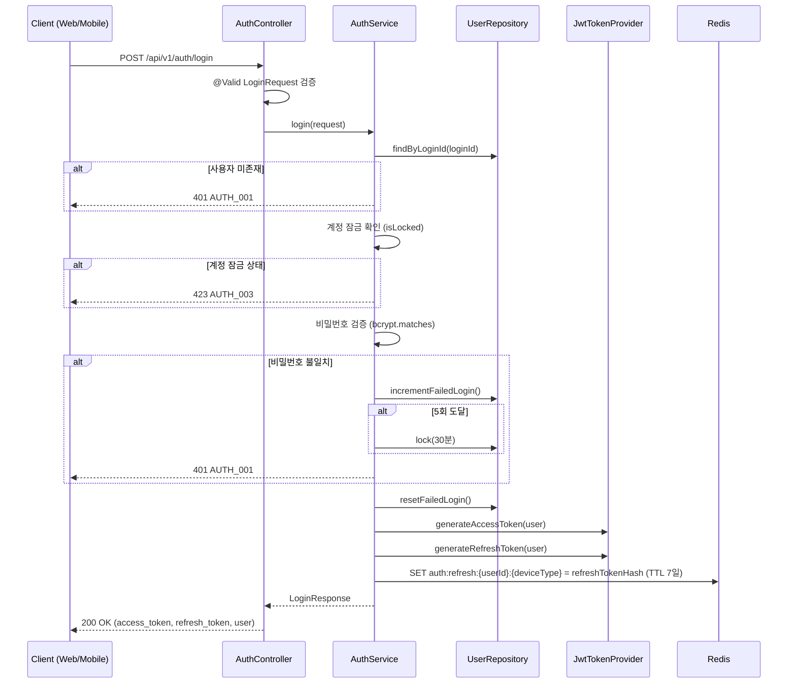
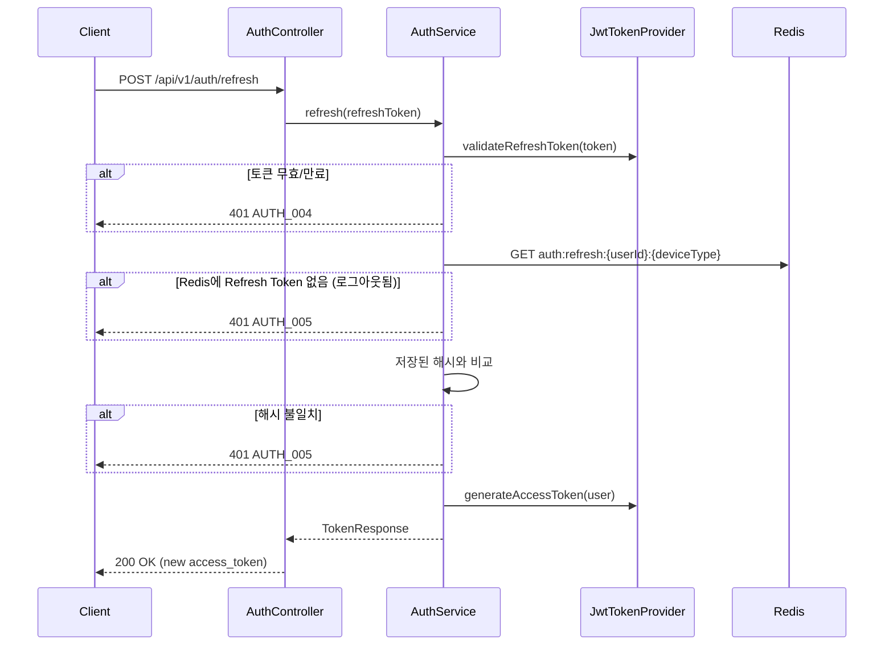
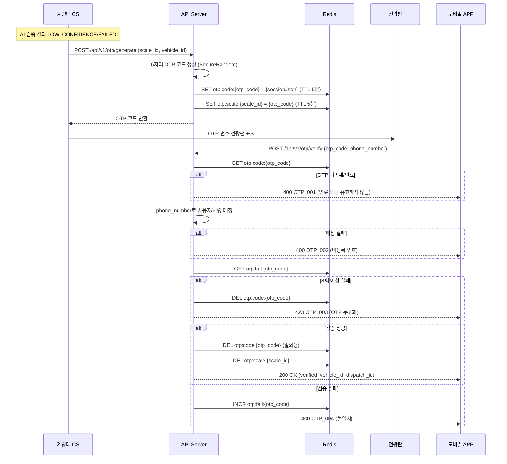
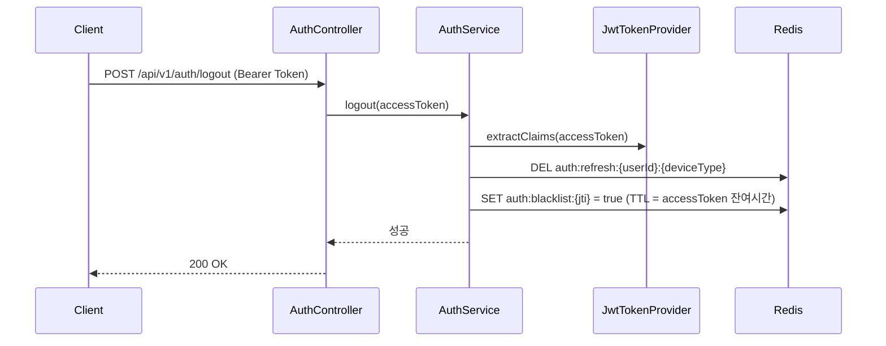
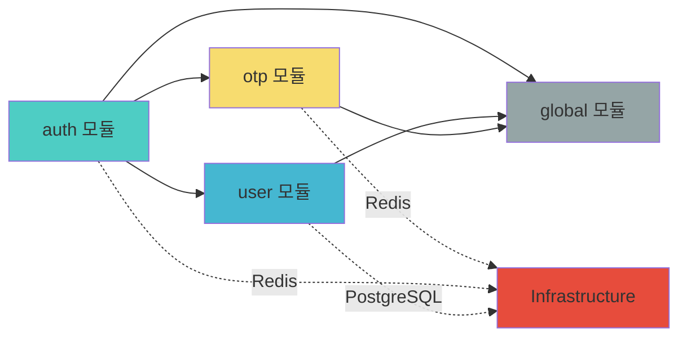

# Auth 모듈 기본설계서

**버전**: 1.0
**작성일**: 2026-01-27
**기반 문서**: PRD-20260127-154446, TRD-20260127-155235, FUNC-SPEC v1.0
**모듈**: 인증/사용자 관리 (Authentication & User Management)
**상태**: Draft

---

## 1. 모듈 개요

### 1.1 목적
부산 스마트 계량 시스템의 인증/사용자 관리 모듈은 웹(React), 모바일(Flutter), 계량대 CS(C#) 클라이언트에 대해 통합 인증 서비스를 제공한다. JWT 기반 Stateless 인증, RBAC 권한 관리, OTP 보안 계량 인증을 핵심으로 한다.

### 1.2 기능 범위

| 기능 | FUNC-SPEC 매핑 | 우선순위 |
|------|---------------|---------|
| ID/PW 로그인 | FUNC-017, FUNC-025-API | HIGH |
| OTP 기반 로그인 (모바일 안전 로그인) | FUNC-017, FUNC-025-API | HIGH |
| Access Token 갱신 | FUNC-025-API | HIGH |
| 로그아웃 | FUNC-025-API | HIGH |
| OTP 생성 (계량대 보안 계량) | FUNC-004 | HIGH |
| OTP 검증 (모바일 입력) | FUNC-004, FUNC-020 | HIGH |
| 사용자 RBAC 권한 관리 | 전체 모듈 공통 | HIGH |

### 1.3 대상 클라이언트

| 클라이언트 | 인증 방식 | 역할 |
|-----------|----------|------|
| React Web | ID/PW → JWT | ADMIN, MANAGER |
| Flutter Mobile | ID/PW or OTP → JWT | MANAGER, DRIVER |
| C# 계량대 CS | API Key or ID/PW → JWT | SYSTEM (내부 서비스) |

---

## 2. 프로젝트 패키지 구조

### 2.1 레이어 아키텍처

```
┌─────────────────────────────────────────────────┐
│                  Presentation Layer              │
│         (Controller, DTO, Exception Handler)     │
├─────────────────────────────────────────────────┤
│                  Application Layer               │
│              (Service, Use Case)                 │
├─────────────────────────────────────────────────┤
│                   Domain Layer                   │
│         (Entity, Repository Interface,           │
│          Domain Service, Enum, Event)            │
├─────────────────────────────────────────────────┤
│                Infrastructure Layer              │
│     (JPA Repository Impl, Redis, Security,       │
│      External Service Client)                    │
└─────────────────────────────────────────────────┘
```

### 2.2 패키지 구조

```
com.dongkuk.weighing
├── WeighingApplication.java
├── global/                          # 공통 모듈
│   ├── config/                      # 설정
│   │   ├── SecurityConfig.java      # Spring Security 설정
│   │   ├── JwtConfig.java           # JWT 관련 설정
│   │   ├── RedisConfig.java         # Redis 연결 설정
│   │   ├── CorsConfig.java          # CORS 정책 설정
│   │   └── WebConfig.java           # 웹 MVC 설정
│   ├── security/                    # 보안 인프라
│   │   ├── jwt/
│   │   │   ├── JwtTokenProvider.java    # JWT 토큰 생성/검증
│   │   │   ├── JwtAuthenticationFilter.java  # JWT 인증 필터
│   │   │   └── JwtProperties.java       # JWT 설정 프로퍼티
│   │   ├── UserPrincipal.java           # 인증 사용자 정보
│   │   └── CustomUserDetailsService.java # UserDetailsService 구현
│   ├── common/                      # 공통 유틸
│   │   ├── dto/
│   │   │   ├── ApiResponse.java         # 공통 응답 DTO
│   │   │   └── PageResponse.java        # 페이징 응답 DTO
│   │   ├── exception/
│   │   │   ├── GlobalExceptionHandler.java  # 전역 예외 처리
│   │   │   ├── BusinessException.java       # 비즈니스 예외
│   │   │   └── ErrorCode.java               # 에러 코드 정의
│   │   └── util/
│   │       ├── EncryptionUtil.java       # AES-256 암호화
│   │       └── MaskingUtil.java          # 개인정보 마스킹
│   └── audit/
│       └── AuditEntity.java             # 생성일/수정일 자동 관리
│
├── auth/                            # 인증 모듈
│   ├── controller/
│   │   └── AuthController.java          # 인증 API 엔드포인트
│   ├── dto/
│   │   ├── request/
│   │   │   ├── LoginRequest.java        # 로그인 요청
│   │   │   ├── OtpLoginRequest.java     # OTP 로그인 요청
│   │   │   └── TokenRefreshRequest.java # 토큰 갱신 요청
│   │   └── response/
│   │       ├── LoginResponse.java       # 로그인 응답
│   │       └── TokenResponse.java       # 토큰 응답
│   └── service/
│       └── AuthService.java             # 인증 비즈니스 로직
│
├── user/                            # 사용자 모듈
│   ├── controller/
│   │   └── UserController.java          # 사용자 관리 API
│   ├── dto/
│   │   ├── request/
│   │   │   └── UserCreateRequest.java   # 사용자 생성 요청
│   │   └── response/
│   │       └── UserResponse.java        # 사용자 정보 응답
│   ├── domain/
│   │   ├── User.java                    # 사용자 엔티티
│   │   ├── UserRole.java                # 역할 Enum
│   │   └── UserRepository.java          # 리포지토리 인터페이스
│   └── service/
│       └── UserService.java             # 사용자 비즈니스 로직
│
└── otp/                             # OTP 모듈
    ├── controller/
    │   └── OtpController.java           # OTP API 엔드포인트
    ├── dto/
    │   ├── request/
    │   │   ├── OtpGenerateRequest.java  # OTP 생성 요청
    │   │   └── OtpVerifyRequest.java    # OTP 검증 요청
    │   └── response/
    │       ├── OtpGenerateResponse.java # OTP 생성 응답
    │       └── OtpVerifyResponse.java   # OTP 검증 응답
    ├── domain/
    │   ├── OtpSession.java              # OTP 세션 엔티티
    │   └── OtpSessionRepository.java    # 리포지토리 인터페이스
    └── service/
        └── OtpService.java             # OTP 비즈니스 로직
```

---

## 3. 도메인 모델 설계

### 3.1 User 엔티티 (tb_user)



**설계 결정사항**:
- `failedLoginCount`, `lockedUntil` 추가: FUNC-017 BR-017-5 "비밀번호 5회 실패 시 계정 잠금" 구현
- `phoneNumber`은 AES-256 암호화 저장 (TRD 5.2 데이터 보안)
- JPA `@ColumnTransformer`로 DB 레벨 투명 암호화/복호화

### 3.2 OTP 세션 (tb_otp_session + Redis)



**Redis 키 설계**:
```
# OTP 코드 → 세션 매핑 (조회용)
otp:code:{otp_code} → {otpSessionJson}     TTL: 300s (5분)

# 계량대별 활성 OTP
otp:scale:{scale_id} → {otp_code}          TTL: 300s (5분)

# OTP 실패 횟수 추적
otp:fail:{otp_code} → {count}              TTL: 300s (5분)
```

**설계 결정사항**:
- OTP는 Redis를 Primary 저장소로 사용 (TTL 자동 만료)
- DB(tb_otp_session)는 감사 로그 용도로 병행 저장
- `failedAttempts` 추가: BR-004-4 "3회 검증 실패 → OTP 무효화"
- `scaleId` 추가: BR-004-2 "해당 계량대의 전광판에 표시"

### 3.3 Refresh Token (Redis)

```
# Refresh Token 저장
auth:refresh:{userId}:{deviceType} → {refreshTokenHash}  TTL: 604800s (7일)

# 블랙리스트 (로그아웃된 Access Token)
auth:blacklist:{jti} → true                              TTL: AccessToken 잔여시간
```

---

## 4. API 설계

### 4.1 인증 API 엔드포인트

| Method | Endpoint | 설명 | 인증 | 역할 |
|--------|----------|------|------|------|
| POST | `/api/v1/auth/login` | ID/PW 로그인 | Not Required | ALL |
| POST | `/api/v1/auth/login/otp` | OTP 기반 로그인 (모바일) | Not Required | ALL |
| POST | `/api/v1/auth/refresh` | Access Token 갱신 | Refresh Token | ALL |
| POST | `/api/v1/auth/logout` | 로그아웃 | Required | ALL |

### 4.2 OTP API 엔드포인트

| Method | Endpoint | 설명 | 인증 | 역할 |
|--------|----------|------|------|------|
| POST | `/api/v1/otp/generate` | OTP 생성 (계량대 → 전광판) | Internal (API Key) | SYSTEM |
| POST | `/api/v1/otp/verify` | OTP 검증 (모바일 입력) | Not Required | ALL |

### 4.3 API 요청/응답 상세

#### POST /api/v1/auth/login

**Request**:
```json
{
  "login_id": "string (required, 3~50자)",
  "password": "string (required, 8~100자)",
  "device_type": "WEB | MOBILE (required)"
}
```

**Response (200 OK)**:
```json
{
  "success": true,
  "data": {
    "access_token": "eyJhbGciOiJIUzI1NiIs...",
    "refresh_token": "dGhpcyBpcyBhIHJlZnJlc2g...",
    "token_type": "Bearer",
    "expires_in": 1800,
    "user": {
      "user_id": 1,
      "user_name": "홍길동",
      "user_role": "DRIVER",
      "company_name": "ABC운수"
    }
  },
  "timestamp": "2026-01-27T15:00:00+09:00"
}
```

**Error Responses**:
| HTTP Status | Error Code | 설명 |
|------------|-----------|------|
| 401 | AUTH_001 | 로그인 ID 또는 비밀번호 불일치 |
| 401 | AUTH_002 | 비활성화된 계정 |
| 423 | AUTH_003 | 계정 잠금 (5회 실패) |

#### POST /api/v1/auth/login/otp

**Request**:
```json
{
  "phone_number": "string (required, 010-XXXX-XXXX)",
  "auth_code": "string (required, 6자리 숫자)",
  "device_type": "MOBILE (required)"
}
```

**Response**: 로그인 응답과 동일

#### POST /api/v1/auth/refresh

**Request**:
```json
{
  "refresh_token": "string (required)"
}
```

**Response (200 OK)**:
```json
{
  "success": true,
  "data": {
    "access_token": "eyJhbGciOiJIUzI1NiIs...",
    "token_type": "Bearer",
    "expires_in": 1800
  },
  "timestamp": "2026-01-27T15:00:00+09:00"
}
```

#### POST /api/v1/auth/logout

**Request**: Body 없음 (Authorization 헤더의 JWT로 식별)

**Response (200 OK)**:
```json
{
  "success": true,
  "data": null,
  "message": "로그아웃 완료",
  "timestamp": "2026-01-27T15:00:00+09:00"
}
```

#### POST /api/v1/otp/generate

**Request**:
```json
{
  "scale_id": 1,
  "vehicle_id": 1,
  "plate_number": "12가3456"
}
```

**Response (200 OK)**:
```json
{
  "success": true,
  "data": {
    "otp_code": "482951",
    "expires_at": "2026-01-27T15:05:00+09:00",
    "ttl_seconds": 300
  },
  "timestamp": "2026-01-27T15:00:00+09:00"
}
```

#### POST /api/v1/otp/verify

**Request**:
```json
{
  "otp_code": "482951",
  "phone_number": "010-1234-5678"
}
```

**Response (200 OK)**:
```json
{
  "success": true,
  "data": {
    "verified": true,
    "vehicle_id": 1,
    "plate_number": "12가3456",
    "dispatch_id": 5
  },
  "timestamp": "2026-01-27T15:00:30+09:00"
}
```

---

## 5. 보안 아키텍처 설계

### 5.1 JWT 토큰 구조

#### Access Token Payload
```json
{
  "sub": "1",
  "login_id": "hong",
  "role": "DRIVER",
  "company_id": 10,
  "device_type": "MOBILE",
  "iat": 1737957600,
  "exp": 1737959400,
  "jti": "uuid-v4"
}
```

#### 토큰 설정
| 항목 | 값 | 근거 |
|------|---|------|
| 알고리즘 | HS256 | 단일 서버 환경, 서버 간 공유 비밀키 |
| Access Token TTL | 30분 (1800s) | TRD 5.1 |
| Refresh Token TTL | 7일 (604800s) | TRD 5.1 |
| Secret Key | 환경변수 관리 (256bit 이상) | TRD 5.2 |

### 5.2 RBAC 권한 체계



#### 역할별 API 접근 권한

| API | ADMIN | MANAGER | DRIVER | 미인증 |
|-----|-------|---------|--------|-------|
| POST /auth/login | O | O | O | O |
| POST /auth/login/otp | O | O | O | O |
| POST /auth/refresh | O | O | O | - |
| POST /auth/logout | O | O | O | - |
| POST /otp/generate | - | - | - | Internal |
| POST /otp/verify | O | O | O | O |
| GET /dispatches | O | O | - | - |
| POST /dispatches | O | O | - | - |
| DELETE /dispatches/{id} | O | - | - | - |
| GET /dispatches/my | - | - | O | - |
| GET /master/** | O | O | O | - |
| POST /master/** | O | - | - | - |

### 5.3 인증 필터 체인



### 5.4 비밀번호 정책
| 항목 | 정책 |
|------|------|
| 해싱 | bcrypt (cost factor 12) |
| 최소 길이 | 8자 |
| 복잡도 | 영문+숫자 필수, 특수문자 권장 |
| 실패 잠금 | 5회 연속 실패 → 30분 잠금 |
| 잠금 해제 | 30분 자동 해제 또는 ADMIN 수동 해제 |

---

## 6. 핵심 플로우 시퀀스 다이어그램

### 6.1 ID/PW 로그인 플로우



### 6.2 Token 갱신 플로우



### 6.3 OTP 보안 계량 플로우



### 6.4 로그아웃 플로우



---

## 7. 에러 코드 체계

### 7.1 인증 에러 코드

| 코드 | HTTP Status | 설명 |
|------|------------|------|
| AUTH_001 | 401 | 로그인 ID 또는 비밀번호가 일치하지 않습니다 |
| AUTH_002 | 401 | 비활성화된 계정입니다. 관리자에게 문의하세요 |
| AUTH_003 | 423 | 계정이 잠겨있습니다. {minutes}분 후 다시 시도하세요 |
| AUTH_004 | 401 | Refresh Token이 만료되었습니다. 다시 로그인하세요 |
| AUTH_005 | 401 | 유효하지 않은 Refresh Token입니다 |
| AUTH_006 | 401 | Access Token이 만료되었습니다 |
| AUTH_007 | 403 | 접근 권한이 없습니다 |

### 7.2 OTP 에러 코드

| 코드 | HTTP Status | 설명 |
|------|------------|------|
| OTP_001 | 400 | OTP가 만료되었거나 유효하지 않습니다 |
| OTP_002 | 400 | 등록되지 않은 전화번호입니다 |
| OTP_003 | 423 | OTP 검증 실패 횟수 초과로 무효화되었습니다 |
| OTP_004 | 400 | OTP 코드가 일치하지 않습니다 |

### 7.3 사용자 에러 코드

| 코드 | HTTP Status | 설명 |
|------|------------|------|
| USER_001 | 404 | 사용자를 찾을 수 없습니다 |
| USER_002 | 409 | 이미 등록된 로그인 ID입니다 |
| USER_003 | 400 | 유효하지 않은 사용자 정보입니다 |

---

## 8. Spring Security 필터 체인 설계

### 8.1 Public 경로 (인증 불필요)

```
/api/v1/auth/login          - ID/PW 로그인
/api/v1/auth/login/otp      - OTP 기반 로그인
/api/v1/auth/refresh        - Token 갱신
/api/v1/otp/verify           - OTP 검증 (모바일)
/actuator/health             - 헬스체크
/v3/api-docs/**              - API 문서
/swagger-ui/**               - Swagger UI
```

### 8.2 Internal 경로 (API Key 인증)

```
/api/v1/otp/generate         - OTP 생성 (계량대 CS → API Server)
```

### 8.3 Protected 경로 (JWT 인증 필수)

```
/api/v1/**                   - 기본적으로 모든 API 인증 필요
```

### 8.4 역할 기반 접근 제어

```
ADMIN       → /api/v1/master/** (POST, PUT, DELETE)
              /api/v1/dispatches/** (DELETE)
              /api/v1/admin/**

MANAGER     → /api/v1/dispatches/** (POST, PUT)
              /api/v1/gate-passes/** (POST, PUT)
              /api/v1/weighings/**

DRIVER      → /api/v1/dispatches/my (GET)
              /api/v1/slips/** (GET)
              /api/v1/notifications/** (GET)
```

---

## 9. 기술 선정 요약

| 구분 | 기술 | 버전 | 용도 |
|------|------|------|------|
| Framework | Spring Boot | 3.2.x | 애플리케이션 프레임워크 |
| Security | Spring Security | 6.x | 인증/인가 프레임워크 |
| JWT | jjwt (io.jsonwebtoken) | 0.12.x | JWT 토큰 처리 |
| Password | Spring Security Crypto | 6.x | bcrypt 해싱 |
| Encryption | javax.crypto | - | AES-256 암호화 |
| Validation | Jakarta Validation | 3.x | 요청 DTO 검증 |
| ORM | Spring Data JPA | 3.2.x | DB 접근 |
| Cache | Spring Data Redis | 3.2.x | OTP/세션/블랙리스트 |
| API Doc | SpringDoc OpenAPI | 2.x | Swagger 문서 |

---

## 10. 의존성 및 제약사항

### 10.1 모듈 의존성



### 10.2 외부 의존성

| 의존성 | 용도 | 필수 여부 |
|--------|------|----------|
| PostgreSQL 16 | 사용자/OTP 세션 영구 저장 | 필수 |
| Redis 7 | OTP 캐시, Refresh Token, 블랙리스트 | 필수 |
| Nginx | SSL 종단, Rate Limiting | 필수 |

### 10.3 설계 제약사항

1. **Stateless 인증**: 서버 세션 미사용, JWT 기반 Stateless 설계 (수평 확장 대비)
2. **단일 디바이스 타입별 세션**: 동일 사용자의 동일 device_type은 하나의 Refresh Token만 유지
3. **OTP 일회용**: 검증 성공 즉시 Redis에서 삭제
4. **시간대**: 모든 시간은 UTC+9 (Asia/Seoul) 기준 TIMESTAMPTZ 저장

---

## 11. 용어 정의

| 용어 | 정의 |
|------|------|
| Access Token | 단기 JWT 토큰 (30분), API 인증에 사용 |
| Refresh Token | 장기 토큰 (7일), Access Token 갱신에 사용 |
| JTI | JWT Token ID, 토큰 고유 식별자 (블랙리스트용) |
| RBAC | Role-Based Access Control, 역할 기반 접근 제어 |
| OTP | One-Time Password, 계량대 보안 인증용 일회용 비밀번호 |
| bcrypt | 비밀번호 단방향 해싱 알고리즘 |
| AES-256 | 양방향 대칭키 암호화 (개인정보 암호화) |

---

*이 문서는 PRD, TRD, FUNC-SPEC을 기반으로 작성된 Auth 모듈 기본설계서입니다.*
*상세설계서에서 클래스 다이어그램, DTO 상세, DDL, 설정 파일 등을 구체화합니다.*
