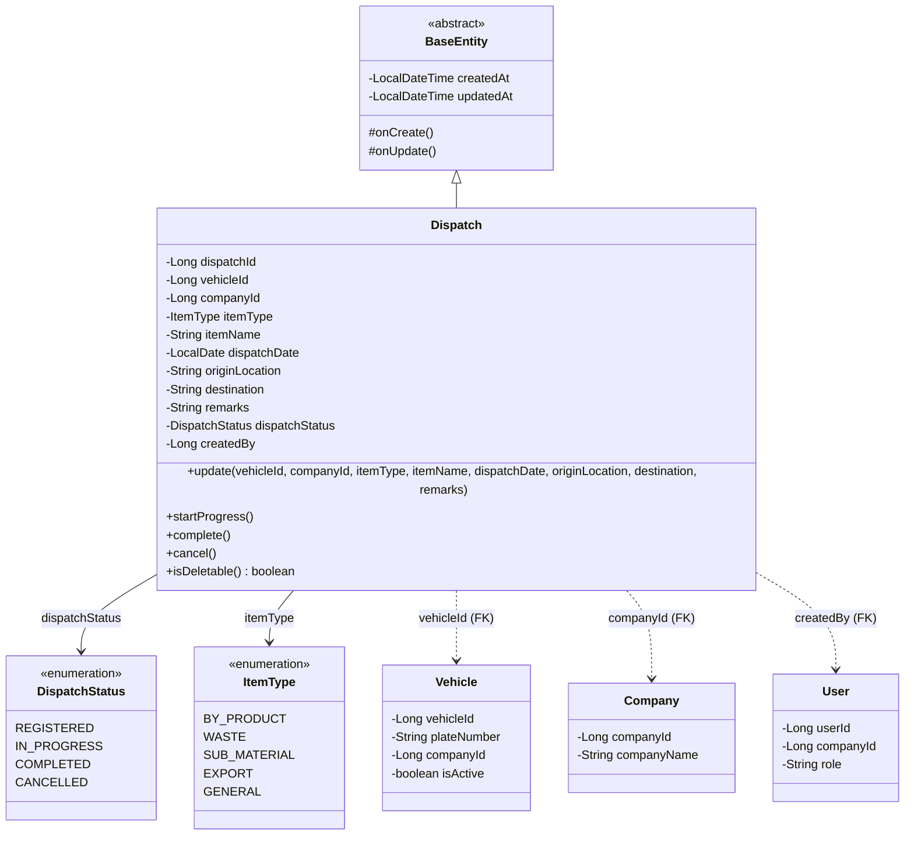
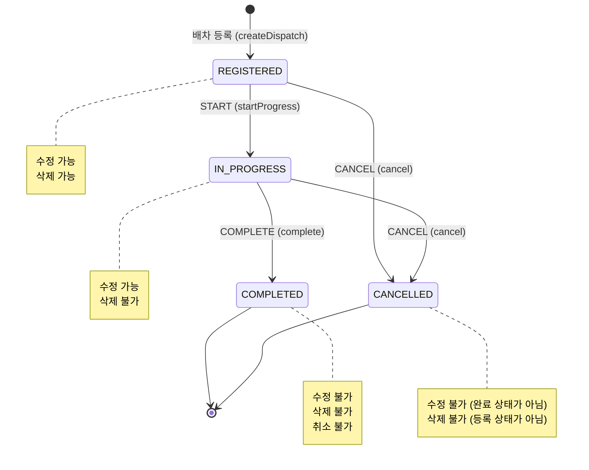
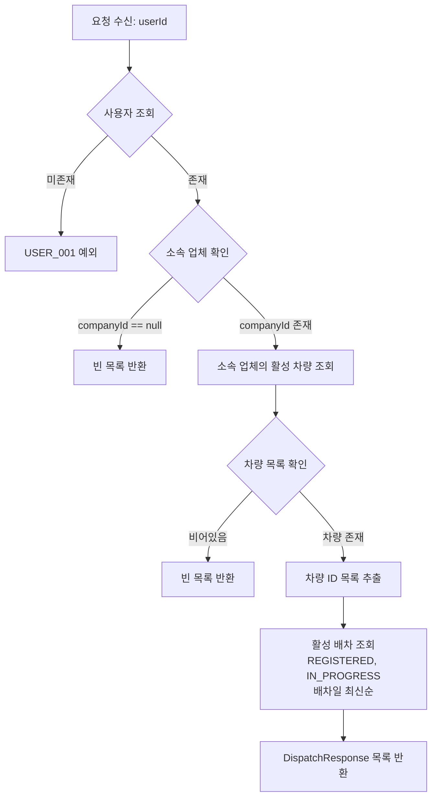
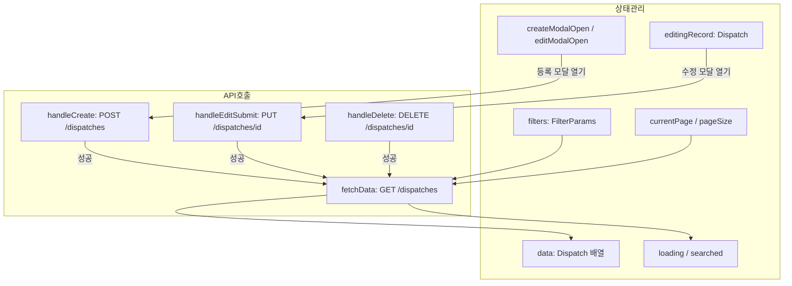
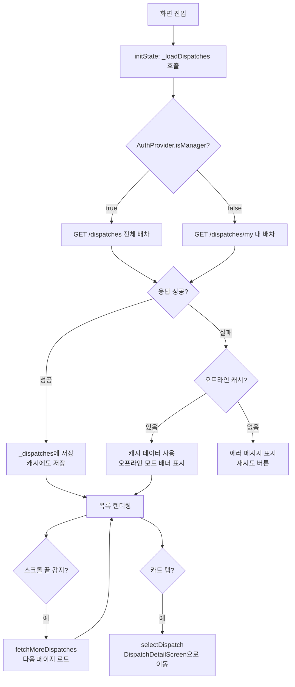
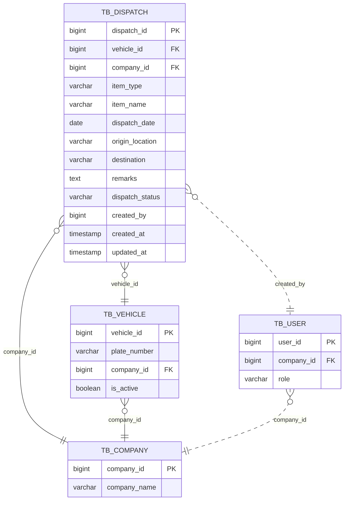
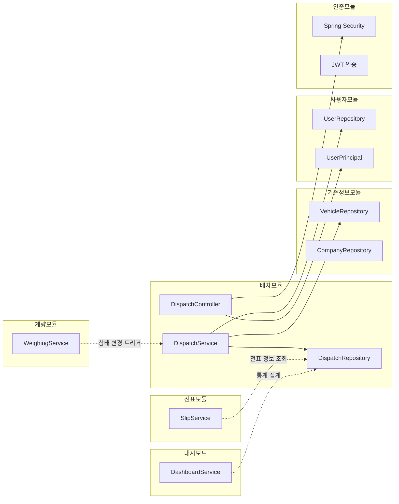

# 배차(Dispatch) 모듈 상세 설계서

| 항목 | 내용 |
|------|------|
| **문서 버전** | 1.0 |
| **작성일** | 2026-01-29 |
| **대상 모듈** | `com.dongkuk.weighing.dispatch` |
| **관련 플랫폼** | Backend (Spring Boot), Frontend (React), Mobile (Flutter) |

---

## 목차

1. [모듈 개요](#1-모듈-개요)
2. [도메인 모델](#2-도메인-모델)
3. [API 설계](#3-api-설계)
4. [서비스 로직](#4-서비스-로직)
5. [DTO 명세](#5-dto-명세)
6. [프론트엔드 화면 설계](#6-프론트엔드-화면-설계)
7. [모바일 화면 설계](#7-모바일-화면-설계)
8. [데이터베이스 설계](#8-데이터베이스-설계)
9. [연관 모듈](#9-연관-모듈)
10. [비즈니스 규칙 요약](#10-비즈니스-규칙-요약)

---

## 1. 모듈 개요

### 1.1 목적

배차(Dispatch) 모듈은 제철소 구내에서 발생하는 부산물, 폐기물, 부재료 등을 운송하는 차량의 **배정 정보를 관리**하는 핵심 업무 모듈이다. 차량, 업체, 품목, 출발지/목적지 등 운송에 필요한 정보를 등록하고, 배차의 생명주기(등록 - 진행 - 완료/취소)를 추적한다.

### 1.2 핵심 기능

| 기능 | 설명 | 사용자 역할 |
|------|------|-------------|
| 배차 등록 | 차량, 업체, 품목, 일자, 출발지/목적지 정보를 포함한 배차 생성 | ADMIN, MANAGER |
| 배차 조회 | 기간, 품목유형, 상태 등 다중 조건 검색 및 페이징 조회 | 모든 인증 사용자 |
| 배차 수정 | 기존 배차 정보 변경 (완료 상태 제외) | ADMIN, MANAGER |
| 배차 삭제 | 등록 상태의 배차만 삭제 가능 | ADMIN |
| 상태 변경 | 진행 시작(START), 완료(COMPLETE), 취소(CANCEL) | ADMIN, MANAGER |
| 내 배차 조회 | 운전자 소속 업체의 활성 배차 목록 조회 (모바일) | DRIVER |

### 1.3 모듈 위치

```
backend/src/main/java/com/dongkuk/weighing/dispatch/
  ├── controller/   DispatchController.java
  ├── service/      DispatchService.java
  ├── domain/       Dispatch.java, DispatchStatus.java, ItemType.java, DispatchRepository.java
  └── dto/          DispatchCreateRequest.java, DispatchUpdateRequest.java,
                    DispatchResponse.java, DispatchSearchCondition.java

frontend/src/pages/DispatchPage.tsx

mobile/lib/
  ├── models/       dispatch.dart
  ├── providers/    dispatch_provider.dart
  └── screens/dispatch/
        ├── dispatch_list_screen.dart
        └── dispatch_detail_screen.dart
```

---

## 2. 도메인 모델

### 2.1 클래스 다이어그램



### 2.2 엔티티 필드 상세

#### Dispatch 엔티티

| 필드 | 타입 | DB 컬럼 | 제약조건 | 설명 |
|------|------|---------|---------|------|
| `dispatchId` | `Long` | `dispatch_id` | PK, AUTO_INCREMENT | 배차 고유 식별자 |
| `vehicleId` | `Long` | `vehicle_id` | NOT NULL, FK | 배정 차량 ID |
| `companyId` | `Long` | `company_id` | NOT NULL, FK | 운송 업체 ID |
| `itemType` | `ItemType` | `item_type` | NOT NULL, VARCHAR(20) | 품목 유형 |
| `itemName` | `String` | `item_name` | NOT NULL, VARCHAR(100) | 품목명 |
| `dispatchDate` | `LocalDate` | `dispatch_date` | NOT NULL | 배차 일자 |
| `originLocation` | `String` | `origin_location` | VARCHAR(100) | 출발지 |
| `destination` | `String` | `destination` | VARCHAR(100) | 목적지 |
| `remarks` | `String` | `remarks` | TEXT | 비고 |
| `dispatchStatus` | `DispatchStatus` | `dispatch_status` | NOT NULL, VARCHAR(20) | 배차 상태 |
| `createdBy` | `Long` | `created_by` | - | 등록자 사용자 ID |
| `createdAt` | `LocalDateTime` | `created_at` | NOT NULL, 자동 | 생성 일시 (BaseEntity) |
| `updatedAt` | `LocalDateTime` | `updated_at` | NOT NULL, 자동 | 수정 일시 (BaseEntity) |

#### DispatchStatus 열거형

| 값 | 한국어 | 설명 |
|----|--------|------|
| `REGISTERED` | 등록 | 배차가 생성되어 대기 중인 초기 상태 |
| `IN_PROGRESS` | 진행중 | 계량이 시작되어 운송이 진행 중인 상태 |
| `COMPLETED` | 완료 | 모든 계량 및 운송이 정상 종료된 상태 |
| `CANCELLED` | 취소 | 배차가 취소되어 더 이상 유효하지 않은 상태 |

#### ItemType 열거형

| 값 | 한국어 | 설명 |
|----|--------|------|
| `BY_PRODUCT` | 부산물 | 제철 공정에서 발생하는 부산물 (슬래그, 더스트 등) |
| `WASTE` | 폐기물 | 산업 폐기물 및 처리 대상 물질 |
| `SUB_MATERIAL` | 부재료 | 생산 공정에 투입되는 보조 원재료 |
| `EXPORT` | 반출 | 구내에서 외부로 반출하는 물품 |
| `GENERAL` | 일반 | 상기 분류에 해당하지 않는 일반 품목 |

---

## 3. API 설계

### 3.1 엔드포인트 목록

Base URL: `/api/v1/dispatches`

| Method | URI | 설명 | 권한 | HTTP 상태 |
|--------|-----|------|------|-----------|
| `POST` | `/api/v1/dispatches` | 배차 등록 | ADMIN, MANAGER | 201 Created |
| `GET` | `/api/v1/dispatches` | 배차 목록 검색 | 인증 사용자 | 200 OK |
| `GET` | `/api/v1/dispatches/{dispatchId}` | 배차 단건 조회 | 인증 사용자 | 200 OK |
| `GET` | `/api/v1/dispatches/my` | 내 배차 조회 (운전자) | 인증 사용자 | 200 OK |
| `PUT` | `/api/v1/dispatches/{dispatchId}` | 배차 수정 | ADMIN, MANAGER | 200 OK |
| `DELETE` | `/api/v1/dispatches/{dispatchId}` | 배차 삭제 | ADMIN | 200 OK |
| `PUT` | `/api/v1/dispatches/{dispatchId}/status` | 배차 상태 변경 | ADMIN, MANAGER | 200 OK |

### 3.2 API 상세

#### 3.2.1 배차 등록

**`POST /api/v1/dispatches`**

요청 헤더:
```
Authorization: Bearer {accessToken}
Content-Type: application/json
```

요청 본문:
```json
{
  "vehicle_id": 1,
  "company_id": 2,
  "item_type": "BY_PRODUCT",
  "item_name": "슬래그",
  "dispatch_date": "2026-01-30",
  "origin_location": "2공장 제2야드",
  "destination": "외부처리장",
  "remarks": "특수 차량 배정 필요"
}
```

성공 응답 (201):
```json
{
  "success": true,
  "data": {
    "dispatch_id": 15,
    "vehicle_id": 1,
    "company_id": 2,
    "item_type": "BY_PRODUCT",
    "item_name": "슬래그",
    "dispatch_date": "2026-01-30",
    "origin_location": "2공장 제2야드",
    "destination": "외부처리장",
    "remarks": "특수 차량 배정 필요",
    "dispatch_status": "REGISTERED",
    "created_by": 3,
    "created_at": "2026-01-29T14:30:00",
    "updated_at": "2026-01-29T14:30:00"
  },
  "error": null
}
```

실패 응답 (400 - 유효성 검증 실패):
```json
{
  "success": false,
  "data": null,
  "error": {
    "code": "VALIDATION_ERROR",
    "message": "vehicleId: must not be null"
  }
}
```

#### 3.2.2 배차 목록 검색

**`GET /api/v1/dispatches`**

쿼리 파라미터:

| 파라미터 | 타입 | 필수 | 설명 |
|---------|------|------|------|
| `date_from` | `LocalDate` | X | 검색 시작일 (YYYY-MM-DD) |
| `date_to` | `LocalDate` | X | 검색 종료일 (YYYY-MM-DD) |
| `item_type` | `ItemType` | X | 품목 유형 필터 |
| `status` | `DispatchStatus` | X | 배차 상태 필터 |
| `page` | `int` | X | 페이지 번호 (0-based, 기본값: 0) |
| `size` | `int` | X | 페이지 크기 (기본값: 20) |
| `sort` | `String` | X | 정렬 조건 (예: `dispatchDate,desc`) |

요청 예시:
```
GET /api/v1/dispatches?date_from=2026-01-01&date_to=2026-01-31&item_type=BY_PRODUCT&status=REGISTERED&page=0&size=20
```

성공 응답 (200):
```json
{
  "success": true,
  "data": {
    "content": [
      {
        "dispatch_id": 15,
        "vehicle_id": 1,
        "company_id": 2,
        "item_type": "BY_PRODUCT",
        "item_name": "슬래그",
        "dispatch_date": "2026-01-30",
        "origin_location": "2공장 제2야드",
        "destination": "외부처리장",
        "remarks": null,
        "dispatch_status": "REGISTERED",
        "created_by": 3,
        "created_at": "2026-01-29T14:30:00",
        "updated_at": "2026-01-29T14:30:00"
      }
    ],
    "totalElements": 1,
    "totalPages": 1,
    "size": 20,
    "number": 0
  },
  "error": null
}
```

#### 3.2.3 배차 단건 조회

**`GET /api/v1/dispatches/{dispatchId}`**

성공 응답 (200):
```json
{
  "success": true,
  "data": {
    "dispatch_id": 15,
    "vehicle_id": 1,
    "company_id": 2,
    "item_type": "BY_PRODUCT",
    "item_name": "슬래그",
    "dispatch_date": "2026-01-30",
    "origin_location": "2공장 제2야드",
    "destination": "외부처리장",
    "remarks": null,
    "dispatch_status": "REGISTERED",
    "created_by": 3,
    "created_at": "2026-01-29T14:30:00",
    "updated_at": "2026-01-29T14:30:00"
  },
  "error": null
}
```

실패 응답 (404):
```json
{
  "success": false,
  "data": null,
  "error": {
    "code": "DISPATCH_001",
    "message": "배차 정보를 찾을 수 없습니다"
  }
}
```

#### 3.2.4 내 배차 조회 (운전자 전용)

**`GET /api/v1/dispatches/my`**

설명: 로그인한 사용자의 소속 업체에 등록된 활성 차량의 현재 진행 가능한 배차(REGISTERED, IN_PROGRESS 상태)를 반환한다.

성공 응답 (200):
```json
{
  "success": true,
  "data": [
    {
      "dispatch_id": 15,
      "vehicle_id": 1,
      "company_id": 2,
      "item_type": "BY_PRODUCT",
      "item_name": "슬래그",
      "dispatch_date": "2026-01-30",
      "origin_location": "2공장 제2야드",
      "destination": "외부처리장",
      "remarks": null,
      "dispatch_status": "REGISTERED",
      "created_by": 3,
      "created_at": "2026-01-29T14:30:00",
      "updated_at": "2026-01-29T14:30:00"
    }
  ],
  "error": null
}
```

조회 로직:
1. 로그인 사용자의 소속 업체(companyId) 확인
2. 소속 업체가 없으면 빈 배열 반환
3. 소속 업체의 활성 차량(isActive=true) 목록 조회
4. 해당 차량들의 활성 배차(REGISTERED, IN_PROGRESS) 조회
5. 배차일 기준 최신순 정렬 반환

#### 3.2.5 배차 수정

**`PUT /api/v1/dispatches/{dispatchId}`**

요청 본문:
```json
{
  "vehicle_id": 2,
  "company_id": 2,
  "item_type": "WASTE",
  "item_name": "산업폐기물",
  "dispatch_date": "2026-01-31",
  "origin_location": "1공장 폐기물집하장",
  "destination": "외부처리장",
  "remarks": "특별 관리 대상"
}
```

성공 응답 (200): `DispatchResponse` 형식 동일

실패 응답 (400 - 완료 상태 수정 시도):
```json
{
  "success": false,
  "data": null,
  "error": {
    "code": "DISPATCH_002",
    "message": "완료된 배차는 수정할 수 없습니다"
  }
}
```

#### 3.2.6 배차 삭제

**`DELETE /api/v1/dispatches/{dispatchId}`**

성공 응답 (200):
```json
{
  "success": true,
  "data": null,
  "error": null
}
```

실패 응답 (400 - 등록 상태가 아닌 배차 삭제 시도):
```json
{
  "success": false,
  "data": null,
  "error": {
    "code": "DISPATCH_003",
    "message": "등록 상태의 배차만 삭제할 수 있습니다"
  }
}
```

#### 3.2.7 배차 상태 변경

**`PUT /api/v1/dispatches/{dispatchId}/status?action={ACTION}`**

지원 액션:

| action | 설명 | 허용 시작 상태 | 변경 후 상태 |
|--------|------|---------------|-------------|
| `START` | 진행 시작 | REGISTERED | IN_PROGRESS |
| `COMPLETE` | 완료 처리 | IN_PROGRESS | COMPLETED |
| `CANCEL` | 취소 | REGISTERED, IN_PROGRESS | CANCELLED |

요청 예시:
```
PUT /api/v1/dispatches/15/status?action=START
```

성공 응답 (200): `DispatchResponse` 형식 동일

실패 응답 (400 - 유효하지 않은 상태 전이):
```json
{
  "success": false,
  "data": null,
  "error": {
    "code": "DISPATCH_004",
    "message": "유효하지 않은 배차 상태 변경입니다"
  }
}
```

---

## 4. 서비스 로직

### 4.1 서비스 계층 구조

```
DispatchController
  └── DispatchService
        ├── DispatchRepository    (배차 데이터 접근)
        ├── VehicleRepository     (차량 조회 - 내 배차 기능)
        └── UserRepository        (사용자 조회 - 내 배차 기능)
```

### 4.2 배차 상태 전이 다이어그램



### 4.3 비즈니스 규칙 상세

#### 배차 등록 (`createDispatch`)

1. 요청 DTO 유효성 검증 (Bean Validation)
2. Builder 패턴으로 Dispatch 엔티티 생성
3. 초기 상태를 `REGISTERED`로 설정
4. `createdBy`에 인증 사용자 ID 기록
5. DB 저장 후 `DispatchResponse` 반환
6. 로그 기록: `배차 등록: dispatchId={}, vehicleId={}, date={}`

#### 배차 수정 (`updateDispatch`)

1. `dispatchId`로 배차 조회 (없으면 DISPATCH_001 예외)
2. 도메인 메서드 `update()` 호출
3. 도메인 내부에서 상태 검증: COMPLETED 상태이면 DISPATCH_002 예외
4. 필드 업데이트 후 JPA Dirty Checking 으로 자동 반영
5. 로그 기록: `배차 수정: dispatchId={}`

#### 배차 삭제 (`deleteDispatch`)

1. `dispatchId`로 배차 조회 (없으면 DISPATCH_001 예외)
2. `isDeletable()` 검증: REGISTERED 상태일 때만 true
3. 삭제 불가 시 DISPATCH_003 예외
4. 물리 삭제(`repository.delete()`) 실행
5. 로그 기록: `배차 삭제: dispatchId={}`

#### 배차 상태 변경 (`updateStatus`)

1. `dispatchId`로 배차 조회 (없으면 DISPATCH_001 예외)
2. `action` 파라미터에 따라 분기 (대소문자 무관):
   - `START`: `startProgress()` 호출 (REGISTERED -> IN_PROGRESS)
   - `COMPLETE`: `complete()` 호출 (IN_PROGRESS -> COMPLETED)
   - `CANCEL`: `cancel()` 호출 (REGISTERED/IN_PROGRESS -> CANCELLED)
   - 기타: DISPATCH_004 예외
3. 도메인 내부 상태 검증 실패 시 DISPATCH_004 예외
4. 로그 기록: `배차 상태 변경: dispatchId={}, newStatus={}`

#### 내 배차 조회 (`getMyDispatches`)



### 4.4 에러 코드

| 에러 코드 | HTTP 상태 | 메시지 | 발생 조건 |
|-----------|----------|--------|-----------|
| `DISPATCH_001` | 404 | 배차 정보를 찾을 수 없습니다 | 존재하지 않는 dispatchId로 조회/수정/삭제 시 |
| `DISPATCH_002` | 400 | 완료된 배차는 수정할 수 없습니다 | COMPLETED 상태 배차에 update 호출 시 |
| `DISPATCH_003` | 400 | 등록 상태의 배차만 삭제할 수 있습니다 | REGISTERED가 아닌 배차 삭제 시도 시 |
| `DISPATCH_004` | 400 | 유효하지 않은 배차 상태 변경입니다 | 허용되지 않는 상태 전이 또는 미지원 액션 |

### 4.5 트랜잭션 관리

- 클래스 수준: `@Transactional(readOnly = true)` (기본 읽기 전용)
- 쓰기 메서드: 개별 `@Transactional` 오버라이드
  - `createDispatch`: 쓰기 트랜잭션
  - `updateDispatch`: 쓰기 트랜잭션
  - `deleteDispatch`: 쓰기 트랜잭션
  - `updateStatus`: 쓰기 트랜잭션
- 읽기 메서드: 클래스 수준 `readOnly = true` 적용
  - `getDispatch`, `searchDispatches`, `getMyDispatches`

---

## 5. DTO 명세

### 5.1 DispatchCreateRequest (배차 생성 요청)

Java Record 기반 DTO. Bean Validation 적용.

| 필드 | 타입 | JSON 키 | 필수 | 유효성 규칙 | 설명 |
|------|------|---------|------|-----------|------|
| `vehicleId` | `Long` | `vehicle_id` | O | `@NotNull` | 차량 ID |
| `companyId` | `Long` | `company_id` | O | `@NotNull` | 업체 ID |
| `itemType` | `ItemType` | `item_type` | O | `@NotNull` | 품목 유형 |
| `itemName` | `String` | `item_name` | O | `@NotBlank`, `@Size(max=100)` | 품목명 |
| `dispatchDate` | `LocalDate` | `dispatch_date` | O | `@NotNull`, `@FutureOrPresent` | 배차 일자 (현재 또는 미래) |
| `originLocation` | `String` | `origin_location` | X | `@Size(max=100)` | 출발지 |
| `destination` | `String` | `destination` | X | `@Size(max=100)` | 목적지 |
| `remarks` | `String` | `remarks` | X | - | 비고 |

### 5.2 DispatchUpdateRequest (배차 수정 요청)

`DispatchCreateRequest`와 동일한 필드 및 유효성 규칙을 가진다. 수정 시에도 모든 필수 필드를 포함해야 한다 (전체 교체 방식).

| 필드 | 타입 | JSON 키 | 필수 | 유효성 규칙 | 설명 |
|------|------|---------|------|-----------|------|
| `vehicleId` | `Long` | `vehicle_id` | O | `@NotNull` | 차량 ID |
| `companyId` | `Long` | `company_id` | O | `@NotNull` | 업체 ID |
| `itemType` | `ItemType` | `item_type` | O | `@NotNull` | 품목 유형 |
| `itemName` | `String` | `item_name` | O | `@NotBlank`, `@Size(max=100)` | 품목명 |
| `dispatchDate` | `LocalDate` | `dispatch_date` | O | `@NotNull`, `@FutureOrPresent` | 배차 일자 |
| `originLocation` | `String` | `origin_location` | X | `@Size(max=100)` | 출발지 |
| `destination` | `String` | `destination` | X | `@Size(max=100)` | 목적지 |
| `remarks` | `String` | `remarks` | X | - | 비고 |

### 5.3 DispatchResponse (배차 응답)

| 필드 | 타입 | JSON 키 | 설명 |
|------|------|---------|------|
| `dispatchId` | `Long` | `dispatch_id` | 배차 고유 식별자 |
| `vehicleId` | `Long` | `vehicle_id` | 차량 ID |
| `companyId` | `Long` | `company_id` | 업체 ID |
| `itemType` | `String` | `item_type` | 품목 유형 (enum name) |
| `itemName` | `String` | `item_name` | 품목명 |
| `dispatchDate` | `LocalDate` | `dispatch_date` | 배차 일자 |
| `originLocation` | `String` | `origin_location` | 출발지 |
| `destination` | `String` | `destination` | 목적지 |
| `remarks` | `String` | `remarks` | 비고 |
| `dispatchStatus` | `String` | `dispatch_status` | 배차 상태 (enum name) |
| `createdBy` | `Long` | `created_by` | 등록자 ID |
| `createdAt` | `LocalDateTime` | `created_at` | 생성 일시 (ISO 8601) |
| `updatedAt` | `LocalDateTime` | `updated_at` | 수정 일시 (ISO 8601) |

변환 메서드: `DispatchResponse.from(Dispatch dispatch)` 정적 팩토리 메서드를 사용하여 엔티티를 DTO로 변환한다.

### 5.4 DispatchSearchCondition (배차 검색 조건)

컨트롤러에서 쿼리 파라미터를 수집하여 서비스에 전달하는 내부 DTO이다.

| 필드 | 타입 | 설명 |
|------|------|------|
| `dateFrom` | `LocalDate` | 검색 시작일 (null 허용) |
| `dateTo` | `LocalDate` | 검색 종료일 (null 허용) |
| `itemType` | `ItemType` | 품목 유형 필터 (null 허용) |
| `status` | `DispatchStatus` | 배차 상태 필터 (null 허용) |

모든 필드가 null이면 전체 배차를 반환한다. JPQL에서 `IS NULL OR` 패턴으로 동적 쿼리를 구현한다.

---

## 6. 프론트엔드 화면 설계

### 6.1 화면 구조

파일 위치: `frontend/src/pages/DispatchPage.tsx`

```
DispatchPage
├── 페이지 타이틀: "배차 관리"
├── 검색 조건 카드 (Card)
│   ├── 기간 (RangePicker)
│   ├── 품목유형 (Select)
│   ├── 배차상태 (Select)
│   ├── 초기화 버튼
│   └── 조회 버튼
├── 결과 헤더
│   ├── 조회 결과 건수
│   ├── 새로고침 버튼
│   └── 배차 등록 버튼
├── 배차 테이블 (SortableTable)
│   └── 컬럼: ID, 품목유형, 품목명, 배차일, 출발지, 도착지, 상태, 등록일, 작업
├── 페이지네이션 (Pagination)
├── 배차 등록 모달 (Modal + Form)
└── 배차 수정 모달 (Modal + Form)
```

### 6.2 컴포넌트 데이터 흐름



### 6.3 테이블 컬럼 정의

| 컬럼 | dataIndex | 너비(px) | 렌더링 | 비고 |
|------|-----------|---------|--------|------|
| ID | `dispatchId` | 80 | 기본 | - |
| 품목유형 | `itemType` | 100 | `ITEM_TYPE_LABELS` 매핑 | BY_PRODUCT -> "부산물" |
| 품목명 | `itemName` | 110 | 기본 | - |
| 배차일 | `dispatchDate` | 110 | 기본 | YYYY-MM-DD |
| 출발지 | `originLocation` | 110 | 기본 | - |
| 도착지 | `destination` | 110 | 기본 | - |
| 상태 | `dispatchStatus` | 90 | Tag + 색상 | `DISPATCH_STATUS_COLORS` 매핑 |
| 등록일 | `createdAt` | 160 | `YYYY-MM-DD HH:mm` 포맷 | dayjs 사용 |
| 작업 | - | 100 | 수정/삭제 버튼 | 삭제는 REGISTERED만 표시 |

### 6.4 검색 필터 구성

| 필터 | 컴포넌트 | 옵션 | 기본값 |
|------|---------|------|--------|
| 기간 | `RangePicker` | 시작일 ~ 종료일 | null (전체) |
| 품목유형 | `Select` | `ITEM_TYPE_OPTIONS` (부산물, 폐기물, 부재료, 반출, 일반) | 전체 |
| 배차상태 | `Select` | `DISPATCH_STATUS_OPTIONS` (등록, 진행중, 완료, 취소) | 전체 |

### 6.5 폼 필드 구성 (등록/수정 공통)

| 필드 | 라벨 | 컴포넌트 | 필수 | 유효성 검증 |
|------|------|---------|------|-----------|
| `vehicleId` | 차량 ID | `Input[type=number]` | O | required |
| `companyId` | 운송사 ID | `Input[type=number]` | O | required |
| `itemType` | 품목유형 | `Select` | O | required |
| `itemName` | 품목명 | `Input` | O | required, `maxLengthRule(100)` |
| `dispatchDate` | 배차일 | `DatePicker` | O | required, `futureOrPresentDateValidator` |
| `originLocation` | 출발지 | `Input` | X | `maxLengthRule(100)` |
| `destination` | 도착지 | `Input` | X | `maxLengthRule(100)` |
| `remarks` | 비고 | `Input.TextArea[rows=2]` | X | - |

### 6.6 사용자 인터랙션

| 동작 | 처리 | 후속 동작 |
|------|------|----------|
| 조회 버튼 클릭 | `fetchData(1, pageSize)` 호출 | 테이블 갱신, 페이지 1로 리셋 |
| 초기화 버튼 클릭 | 필터/데이터/검색상태 초기화 | 빈 테이블 표시 |
| 배차 등록 버튼 클릭 | 등록 모달 열기 | - |
| 등록 모달 저장 | `POST /dispatches` 호출 | 성공 시 모달 닫기, 목록 새로고침 |
| 수정 아이콘 클릭 | 수정 모달 열기 + 기존 데이터 세팅 | - |
| 수정 모달 저장 | `PUT /dispatches/{id}` 호출 | 성공 시 모달 닫기, 목록 새로고침 |
| 삭제 아이콘 클릭 | Popconfirm 확인 후 `DELETE /dispatches/{id}` | 성공 시 목록 새로고침 |
| 페이지 변경 | `fetchData(page, size)` 호출 | 테이블 갱신 |

---

## 7. 모바일 화면 설계

### 7.1 화면 구조 개요

```
모바일 배차 관련 화면
├── DispatchListScreen (배차 목록)
│   ├── 오프라인 모드 배너
│   ├── 검색 바 (차량번호/업체명)
│   ├── 상태 필터 칩 (전체, 대기, 진행중, 완료)
│   └── 배차 카드 목록 (무한 스크롤)
│       └── _DispatchCard
│           ├── 배차번호 + 상태 배지
│           ├── 차량/업체/품목 정보
│           ├── 경로 정보
│           └── 배차일시 + 이동 화살표
│
└── DispatchDetailScreen (배차 상세)
    ├── 상태 카드 (배차번호, 상태 배지, 배차일시)
    ├── 차량 정보 섹션 (차량번호, 운전자)
    ├── 업체/품목 섹션 (업체명, 품목, 품목분류)
    ├── 경로 정보 섹션 (출발지, 도착지)
    ├── 예상 중량 섹션
    └── 메모 섹션
```

### 7.2 모바일 데이터 모델

파일 위치: `mobile/lib/models/dispatch.dart`

#### Dispatch 클래스 필드

| 필드 | 타입 | 필수 | 설명 |
|------|------|------|------|
| `id` | `String` | O | 배차 고유 ID |
| `dispatchNumber` | `String` | O | 배차번호 (예: DSP-20250129-A1B2) |
| `status` | `DispatchStatus` | O | 배차 상태 |
| `vehicleNumber` | `String` | O | 차량번호 |
| `driverName` | `String` | O | 운전자명 |
| `companyName` | `String` | O | 업체명 |
| `itemName` | `String` | O | 품목명 |
| `itemCategory` | `String?` | X | 품목 분류 |
| `origin` | `String?` | X | 출발지 |
| `destination` | `String?` | X | 도착지 |
| `expectedWeight` | `double?` | X | 예상 중량 (kg) |
| `memo` | `String?` | X | 메모 |
| `dispatchDate` | `DateTime` | O | 배차 일자 |
| `createdAt` | `DateTime?` | X | 생성 일시 |
| `updatedAt` | `DateTime?` | X | 수정 일시 |

#### DispatchStatus 열거형 (모바일)

| 값 | JSON 값 | 라벨 | 색상 | 아이콘 |
|----|---------|------|------|--------|
| `registered` | `REGISTERED` | 등록 | 시안(#06B6D4) | `Icons.assignment` |
| `inProgress` | `IN_PROGRESS` | 진행중 | 앰버(#F59E0B) | `Icons.local_shipping` |
| `completed` | `COMPLETED` | 완료 | 그린(#10B981) | `Icons.check_circle` |
| `cancelled` | `CANCELLED` | 취소 | 로즈(#F43F5E) | `Icons.cancel` |

### 7.3 Provider 상태 관리

파일 위치: `mobile/lib/providers/dispatch_provider.dart`

#### 상태 필드

| 필드 | 타입 | 설명 |
|------|------|------|
| `_dispatches` | `List<Dispatch>` | 배차 목록 |
| `_selectedDispatch` | `Dispatch?` | 선택된 배차 (상세 화면용) |
| `_isLoading` | `bool` | 로딩 상태 |
| `_errorMessage` | `String?` | 에러 메시지 |
| `_isOfflineMode` | `bool` | 오프라인 모드 여부 |
| `_currentPage` | `int` | 현재 페이지 (0-based) |
| `_hasMore` | `bool` | 추가 데이터 존재 여부 |

#### 주요 메서드

| 메서드 | 설명 | API 호출 |
|--------|------|---------|
| `fetchDispatches(isManager)` | 배차 목록 조회 (전체/내 배차) | GET `/dispatches` 또는 `/dispatches/my` |
| `fetchMoreDispatches(isManager, date)` | 무한 스크롤 추가 페이지 조회 | GET (페이지 번호 증가) |
| `fetchDispatchDetail(id)` | 배차 상세 조회 | GET `/dispatches/{id}` |
| `selectDispatch(dispatch)` | 목록에서 배차 선택 | - (로컬 상태 변경) |
| `resetPagination()` | 페이지네이션 상태 초기화 | - |
| `clearError()` | 에러 상태 초기화 | - |
| `clearSelection()` | 선택 상태 초기화 | - |

### 7.4 목록 화면 데이터 흐름



### 7.5 모바일 UI 특성

| 기능 | 구현 방식 |
|------|----------|
| 검색 | TextField + 클라이언트 측 필터링 (차량번호/업체명) |
| 상태 필터 | FilterChip 가로 스크롤 (전체, 대기, 진행중, 완료) |
| 목록 표시 | Card 위젯 기반 리스트 (ListView.builder) |
| 무한 스크롤 | ScrollController + position 감지 (끝에서 200px) |
| Pull-to-Refresh | RefreshIndicator 래핑 |
| 오프라인 지원 | OfflineCacheService로 로컬 캐시 + 오프라인 배너 |
| 다크 모드 | Theme.of(context).brightness 기반 자동 전환 |
| 상태 표시 | StatusBadge 위젯 (라벨 + 색상 + 아이콘) |

---

## 8. 데이터베이스 설계

### 8.1 테이블 DDL

```sql
CREATE TABLE tb_dispatch (
    dispatch_id      BIGSERIAL       PRIMARY KEY,
    vehicle_id       BIGINT          NOT NULL,
    company_id       BIGINT          NOT NULL,
    item_type        VARCHAR(20)     NOT NULL,
    item_name        VARCHAR(100)    NOT NULL,
    dispatch_date    DATE            NOT NULL,
    origin_location  VARCHAR(100),
    destination      VARCHAR(100),
    remarks          TEXT,
    dispatch_status  VARCHAR(20)     NOT NULL,
    created_by       BIGINT,
    created_at       TIMESTAMP       NOT NULL DEFAULT CURRENT_TIMESTAMP,
    updated_at       TIMESTAMP       NOT NULL DEFAULT CURRENT_TIMESTAMP,

    CONSTRAINT fk_dispatch_vehicle
        FOREIGN KEY (vehicle_id) REFERENCES tb_vehicle(vehicle_id),
    CONSTRAINT fk_dispatch_company
        FOREIGN KEY (company_id) REFERENCES tb_company(company_id),
    CONSTRAINT chk_dispatch_status
        CHECK (dispatch_status IN ('REGISTERED', 'IN_PROGRESS', 'COMPLETED', 'CANCELLED')),
    CONSTRAINT chk_item_type
        CHECK (item_type IN ('BY_PRODUCT', 'WASTE', 'SUB_MATERIAL', 'EXPORT', 'GENERAL'))
);
```

### 8.2 인덱스

```sql
-- 배차 일자별 조회 최적화 (목록 검색의 주요 필터)
CREATE INDEX idx_dispatch_date
    ON tb_dispatch (dispatch_date);

-- 차량별 배차 조회 최적화 (내 배차 조회, 차량별 활성 배차)
CREATE INDEX idx_dispatch_vehicle
    ON tb_dispatch (vehicle_id);

-- 상태별 배차 조회 최적화 (상태 필터, 활성 배차 조회)
CREATE INDEX idx_dispatch_status
    ON tb_dispatch (dispatch_status);
```

### 8.3 인덱스 사용 분석

| 쿼리 패턴 | 사용 인덱스 | 빈도 |
|-----------|------------|------|
| 기간별 배차 목록 조회 | `idx_dispatch_date` | 높음 |
| 다중 조건 검색 (기간+품목+상태) | `idx_dispatch_date` + `idx_dispatch_status` | 높음 |
| 차량 ID 목록 기반 활성 배차 조회 | `idx_dispatch_vehicle` + `idx_dispatch_status` | 높음 |
| 배차일+상태별 건수 집계 (대시보드) | `idx_dispatch_date` + `idx_dispatch_status` | 중간 |
| 업체/차량 존재 여부 확인 | `idx_dispatch_vehicle`, 별도 인덱스 불필요 | 낮음 |

### 8.4 ER 다이어그램



---

## 9. 연관 모듈

### 9.1 모듈 의존 관계



### 9.2 모듈 간 상호작용 상세

| 연관 모듈 | 방향 | 상호작용 내용 |
|-----------|------|-------------|
| **기준정보 (Vehicle)** | 배차 -> 차량 | `VehicleRepository.findByCompanyIdAndIsActiveTrue()` 호출하여 소속 업체의 활성 차량 조회 |
| **기준정보 (Company)** | 배차 -> 업체 | `companyId`로 업체 참조. `existsByCompanyId()`로 배차 존재 여부 확인 제공 |
| **사용자 (User)** | 배차 -> 사용자 | `UserRepository.findById()`로 사용자 소속 업체 확인 (내 배차 조회) |
| **인증 (Auth)** | 인증 -> 배차 | `@PreAuthorize`로 역할 기반 접근 제어. `UserPrincipal`에서 사용자 ID 추출 |
| **계량 (Weighing)** | 계량 -> 배차 | 계량 시작 시 배차 상태를 IN_PROGRESS로, 계량 완료 시 COMPLETED로 변경 |
| **전표 (Slip)** | 전표 -> 배차 | `findSlipInfoByDispatchId()`로 배차 품목명, 차량번호, 업체명 조회 |
| **대시보드 (Dashboard)** | 대시보드 -> 배차 | `countByDispatchDateAndDispatchStatus()`로 일자별/상태별 배차 건수 집계 |

### 9.3 리포지토리에서 제공하는 외부 연계 쿼리

| 메서드 | 사용처 | 설명 |
|--------|--------|------|
| `existsByCompanyId(Long)` | 기준정보 삭제 검증 | 업체에 연결된 배차 존재 여부 |
| `existsByVehicleId(Long)` | 기준정보 삭제 검증 | 차량에 연결된 배차 존재 여부 |
| `findActiveByVehicleIds(List<Long>)` | 내 배차 조회 | 차량 ID 목록의 활성 배차 조회 |
| `countByDispatchDateAndDispatchStatus(LocalDate, DispatchStatus)` | 대시보드 통계 | 일자/상태별 건수 집계 |
| `findSlipInfoByDispatchId(Long)` | 전표 생성 | 배차의 품목명, 차량번호, 업체명 조회 (네이티브 쿼리, JOIN) |

---

## 10. 비즈니스 규칙 요약

### 10.1 배차 등록 규칙

| # | 규칙 | 구현 위치 |
|---|------|----------|
| R01 | 차량 ID, 업체 ID, 품목유형, 품목명, 배차일은 필수 입력이다 | `DispatchCreateRequest` (Bean Validation) |
| R02 | 배차일은 현재 또는 미래 날짜만 허용한다 | `@FutureOrPresent` |
| R03 | 품목명은 최대 100자이다 | `@Size(max=100)` |
| R04 | 출발지, 목적지는 각각 최대 100자이다 | `@Size(max=100)` |
| R05 | 배차 생성 시 초기 상태는 반드시 REGISTERED이다 | `Dispatch` 생성자 |
| R06 | 배차 등록자 ID가 자동으로 기록된다 | `DispatchService.createDispatch()` |
| R07 | ADMIN 또는 MANAGER만 배차를 등록할 수 있다 | `@PreAuthorize("hasAnyRole('ADMIN', 'MANAGER')")` |

### 10.2 배차 수정 규칙

| # | 규칙 | 구현 위치 |
|---|------|----------|
| R08 | COMPLETED(완료) 상태의 배차는 수정할 수 없다 | `Dispatch.update()` |
| R09 | 수정은 전체 교체 방식이다 (모든 필수 필드 필요) | `DispatchUpdateRequest` |
| R10 | ADMIN 또는 MANAGER만 배차를 수정할 수 있다 | `@PreAuthorize` |

### 10.3 배차 삭제 규칙

| # | 규칙 | 구현 위치 |
|---|------|----------|
| R11 | REGISTERED(등록) 상태의 배차만 삭제할 수 있다 | `Dispatch.isDeletable()` |
| R12 | IN_PROGRESS, COMPLETED, CANCELLED 상태는 삭제 불가 | `DispatchService.deleteDispatch()` |
| R13 | ADMIN만 배차를 삭제할 수 있다 | `@PreAuthorize("hasRole('ADMIN')")` |
| R14 | 삭제는 물리 삭제(DB에서 완전 제거)이다 | `repository.delete()` |

### 10.4 상태 변경 규칙

| # | 규칙 | 구현 위치 |
|---|------|----------|
| R15 | REGISTERED에서만 START(진행 시작)가 가능하다 | `Dispatch.startProgress()` |
| R16 | IN_PROGRESS에서만 COMPLETE(완료)가 가능하다 | `Dispatch.complete()` |
| R17 | COMPLETED 상태에서는 CANCEL(취소)이 불가하다 | `Dispatch.cancel()` |
| R18 | REGISTERED, IN_PROGRESS에서 CANCEL이 가능하다 | `Dispatch.cancel()` |
| R19 | COMPLETED와 CANCELLED는 최종 상태이다 (더 이상 전이 불가) | 각 도메인 메서드 |
| R20 | 지원하지 않는 action 값은 DISPATCH_004 에러이다 | `DispatchService.updateStatus()` |
| R21 | ADMIN 또는 MANAGER만 상태를 변경할 수 있다 | `@PreAuthorize` |

### 10.5 내 배차 조회 규칙

| # | 규칙 | 구현 위치 |
|---|------|----------|
| R22 | 소속 업체가 없는 사용자는 빈 배차 목록을 반환받는다 | `DispatchService.getMyDispatches()` |
| R23 | 소속 업체에 활성 차량이 없으면 빈 목록을 반환한다 | `DispatchService.getMyDispatches()` |
| R24 | 활성 배차(REGISTERED, IN_PROGRESS)만 조회된다 | `DispatchRepository.findActiveByVehicleIds()` |
| R25 | 배차일 기준 최신순으로 정렬된다 | JPQL `ORDER BY d.dispatchDate DESC` |

### 10.6 프론트엔드/모바일 공통 규칙

| # | 규칙 | 구현 위치 |
|---|------|----------|
| R26 | 삭제 버튼은 REGISTERED 상태의 배차에만 표시한다 | `DispatchPage.tsx` 조건 렌더링 |
| R27 | JSON 필드는 snake_case이며, 프론트엔드 코드는 camelCase이다 | Axios 인터셉터 자동 변환 |
| R28 | 모바일에서 네트워크 오류 시 캐시된 데이터로 오프라인 모드 진입 | `DispatchProvider.fetchDispatches()` |
| R29 | 모바일 목록은 무한 스크롤로 페이징한다 (페이지당 20건) | `DispatchProvider._pageSize = 20` |
| R30 | 모바일 상태 필터는 클라이언트 측에서 수행한다 | `_getFilteredDispatches()` |

---

## 부록: 상태별 허용 가능 액션 매트릭스

| 현재 상태 | 조회 | 수정 | 삭제 | START | COMPLETE | CANCEL |
|-----------|:----:|:----:|:----:|:-----:|:--------:|:------:|
| **REGISTERED** | O | O | O | O | X | O |
| **IN_PROGRESS** | O | O | X | X | O | O |
| **COMPLETED** | O | X | X | X | X | X |
| **CANCELLED** | O | X | X | X | X | X |

> O = 허용, X = 불가 (BusinessException 발생)
