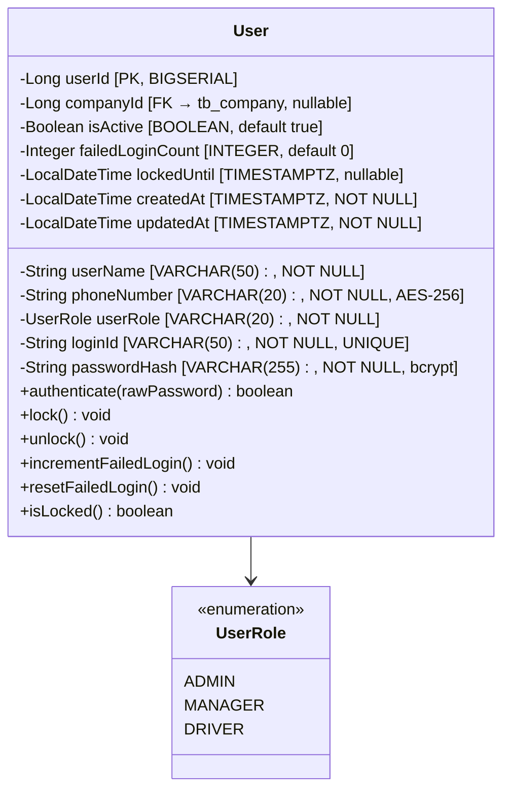
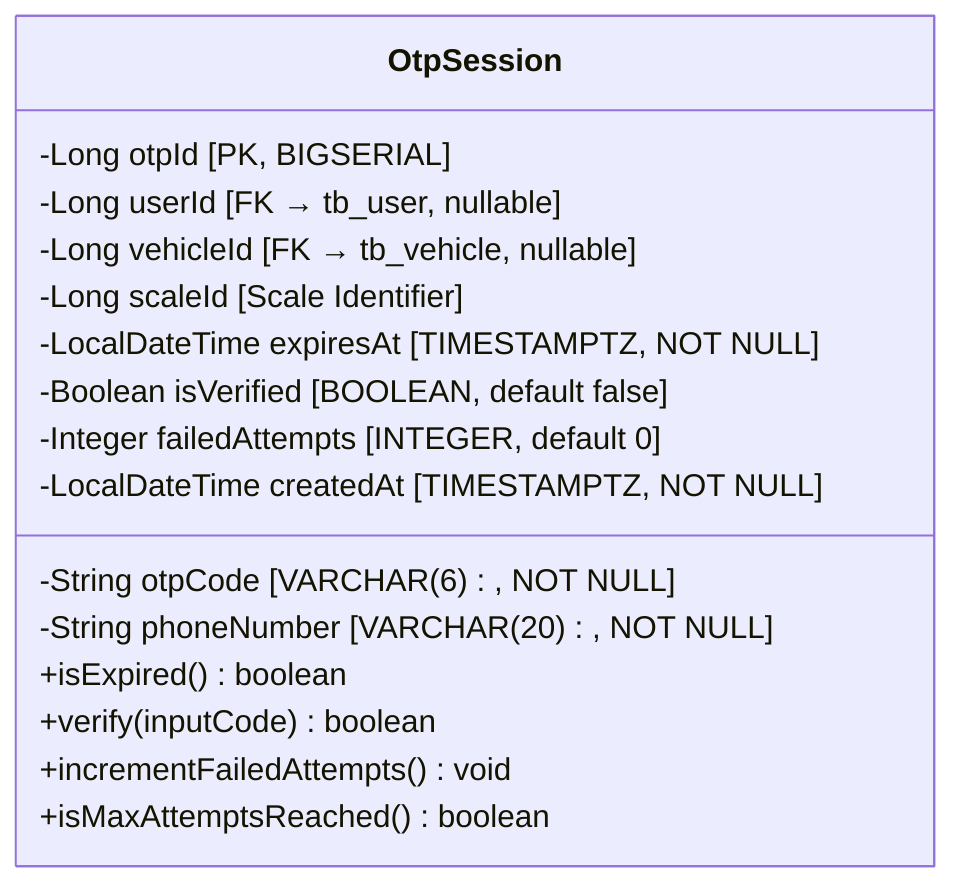
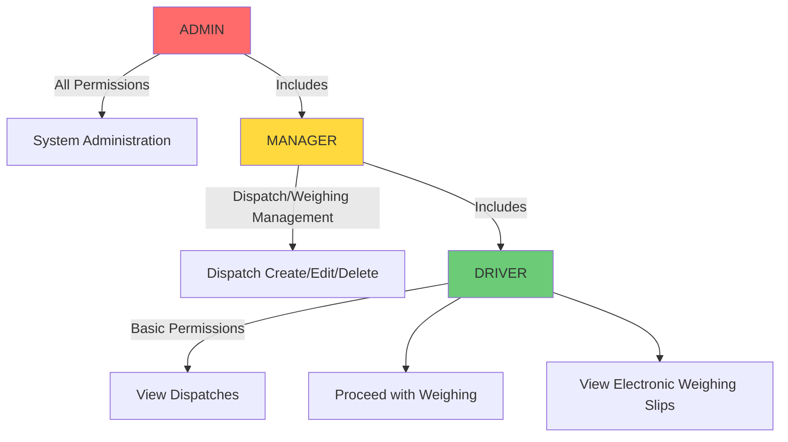
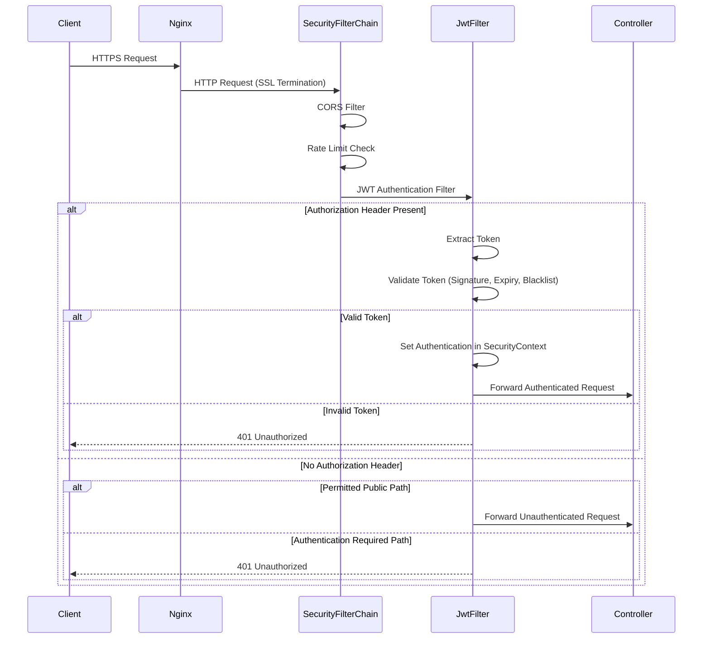
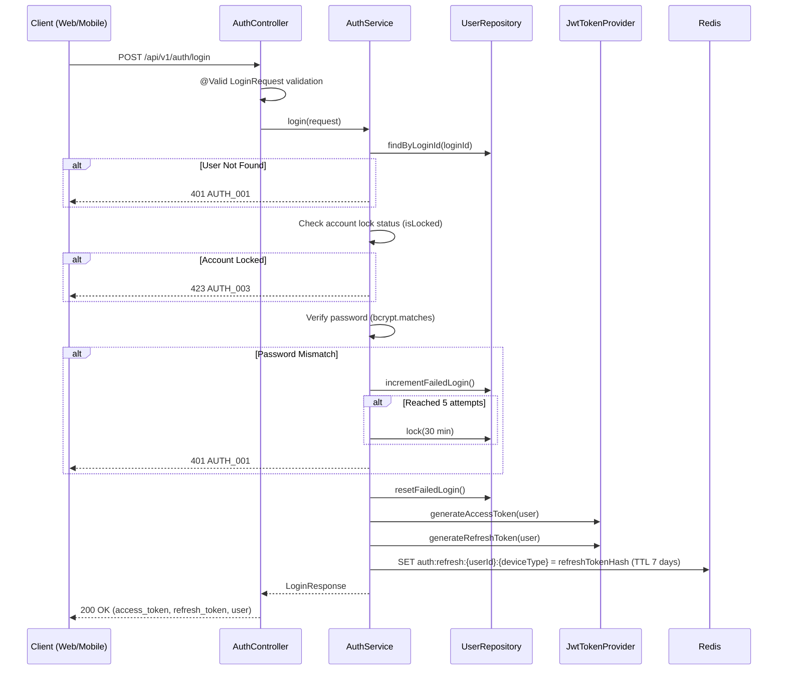
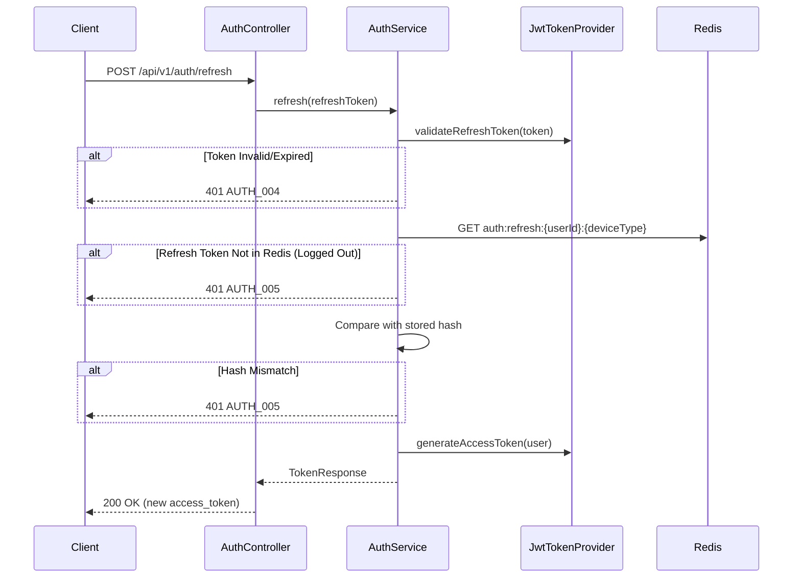
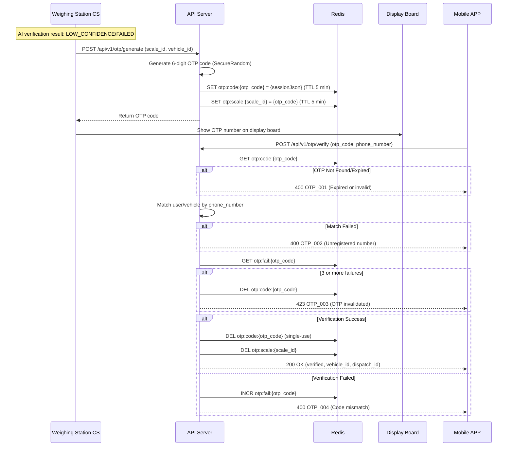
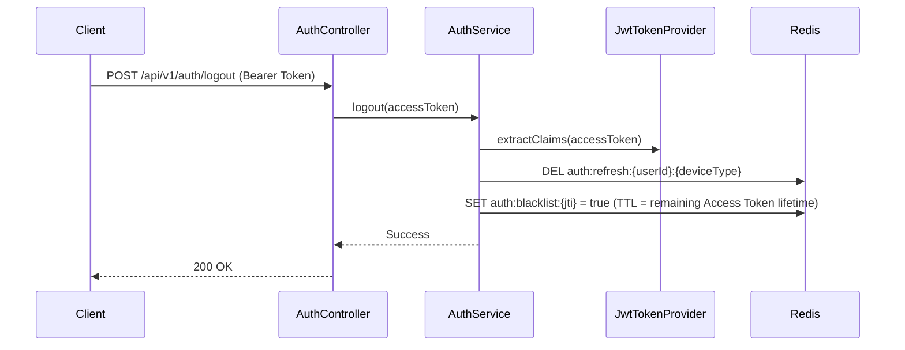
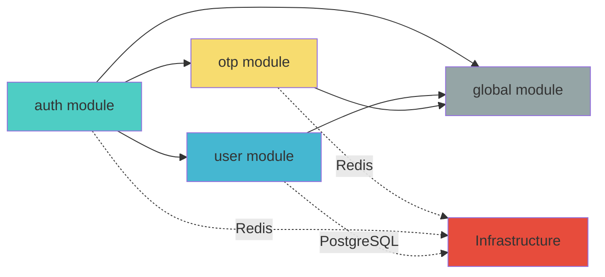

# Auth Module Basic Design Document

**Version**: 1.0
**Date**: 2026-01-27
**Reference Documents**: PRD-20260127-154446, TRD-20260127-155235, FUNC-SPEC v1.0
**Module**: Authentication & User Management
**Status**: Draft

---

## 1. Module Overview

### 1.1 Purpose
The Authentication & User Management module for the Busan Smart Weighing System provides a unified authentication service for Web (React), Mobile (Flutter), and Weighing Station CS (C#) clients. Its core features include JWT-based stateless authentication, RBAC access control, and OTP-secured weighing authentication.

### 1.2 Functional Scope

| Feature | FUNC-SPEC Mapping | Priority |
|---------|-------------------|----------|
| ID/PW Login | FUNC-017, FUNC-025-API | HIGH |
| OTP-Based Login (Mobile Secure Login) | FUNC-017, FUNC-025-API | HIGH |
| Access Token Refresh | FUNC-025-API | HIGH |
| Logout | FUNC-025-API | HIGH |
| OTP Generation (Weighing Station Secure Weighing) | FUNC-004 | HIGH |
| OTP Verification (Mobile Input) | FUNC-004, FUNC-020 | HIGH |
| User RBAC Access Control | Common across all modules | HIGH |

### 1.3 Target Clients

| Client | Authentication Method | Roles |
|--------|----------------------|-------|
| React Web | ID/PW → JWT | ADMIN, MANAGER |
| Flutter Mobile | ID/PW or OTP → JWT | MANAGER, DRIVER |
| C# Weighing Station CS | API Key or ID/PW → JWT | SYSTEM (Internal Service) |

---

## 2. Project Package Structure

### 2.1 Layer Architecture

```
┌─────────────────────────────────────────────────┐
│                  Presentation Layer              │
│         (Controller, DTO, Exception Handler)     │
├─────────────────────────────────────────────────┤
│                  Application Layer               │
│              (Service, Use Case)                 │
├─────────────────────────────────────────────────┤
│                   Domain Layer                   │
│         (Entity, Repository Interface,           │
│          Domain Service, Enum, Event)            │
├─────────────────────────────────────────────────┤
│                Infrastructure Layer              │
│     (JPA Repository Impl, Redis, Security,       │
│      External Service Client)                    │
└─────────────────────────────────────────────────┘
```

### 2.2 Package Structure

```
com.dongkuk.weighing
├── WeighingApplication.java
├── global/                          # Common Module
│   ├── config/                      # Configuration
│   │   ├── SecurityConfig.java      # Spring Security Configuration
│   │   ├── JwtConfig.java           # JWT-Related Configuration
│   │   ├── RedisConfig.java         # Redis Connection Configuration
│   │   ├── CorsConfig.java          # CORS Policy Configuration
│   │   └── WebConfig.java           # Web MVC Configuration
│   ├── security/                    # Security Infrastructure
│   │   ├── jwt/
│   │   │   ├── JwtTokenProvider.java    # JWT Token Generation/Validation
│   │   │   ├── JwtAuthenticationFilter.java  # JWT Authentication Filter
│   │   │   └── JwtProperties.java       # JWT Configuration Properties
│   │   ├── UserPrincipal.java           # Authenticated User Info
│   │   └── CustomUserDetailsService.java # UserDetailsService Implementation
│   ├── common/                      # Common Utilities
│   │   ├── dto/
│   │   │   ├── ApiResponse.java         # Common Response DTO
│   │   │   └── PageResponse.java        # Pagination Response DTO
│   │   ├── exception/
│   │   │   ├── GlobalExceptionHandler.java  # Global Exception Handler
│   │   │   ├── BusinessException.java       # Business Exception
│   │   │   └── ErrorCode.java               # Error Code Definitions
│   │   └── util/
│   │       ├── EncryptionUtil.java       # AES-256 Encryption
│   │       └── MaskingUtil.java          # Personal Data Masking
│   └── audit/
│       └── AuditEntity.java             # Auto-managed Created/Updated Timestamps
│
├── auth/                            # Authentication Module
│   ├── controller/
│   │   └── AuthController.java          # Authentication API Endpoints
│   ├── dto/
│   │   ├── request/
│   │   │   ├── LoginRequest.java        # Login Request
│   │   │   ├── OtpLoginRequest.java     # OTP Login Request
│   │   │   └── TokenRefreshRequest.java # Token Refresh Request
│   │   └── response/
│   │       ├── LoginResponse.java       # Login Response
│   │       └── TokenResponse.java       # Token Response
│   └── service/
│       └── AuthService.java             # Authentication Business Logic
│
├── user/                            # User Module
│   ├── controller/
│   │   └── UserController.java          # User Management API
│   ├── dto/
│   │   ├── request/
│   │   │   └── UserCreateRequest.java   # User Creation Request
│   │   └── response/
│   │       └── UserResponse.java        # User Info Response
│   ├── domain/
│   │   ├── User.java                    # User Entity
│   │   ├── UserRole.java                # Role Enum
│   │   └── UserRepository.java          # Repository Interface
│   └── service/
│       └── UserService.java             # User Business Logic
│
└── otp/                             # OTP Module
    ├── controller/
    │   └── OtpController.java           # OTP API Endpoints
    ├── dto/
    │   ├── request/
    │   │   ├── OtpGenerateRequest.java  # OTP Generation Request
    │   │   └── OtpVerifyRequest.java    # OTP Verification Request
    │   └── response/
    │       ├── OtpGenerateResponse.java # OTP Generation Response
    │       └── OtpVerifyResponse.java   # OTP Verification Response
    ├── domain/
    │   ├── OtpSession.java              # OTP Session Entity
    │   └── OtpSessionRepository.java    # Repository Interface
    └── service/
        └── OtpService.java             # OTP Business Logic
```

---

## 3. Domain Model Design

### 3.1 User Entity (tb_user)



**Design Decisions**:
- Added `failedLoginCount` and `lockedUntil`: Implements FUNC-017 BR-017-5 "Account lockout after 5 failed password attempts"
- `phoneNumber` is stored with AES-256 encryption (TRD 5.2 Data Security)
- JPA `@ColumnTransformer` provides transparent DB-level encryption/decryption

### 3.2 OTP Session (tb_otp_session + Redis)



**Redis Key Design**:
```
# OTP Code → Session mapping (for lookup)
otp:code:{otp_code} → {otpSessionJson}     TTL: 300s (5 min)

# Active OTP per weighing scale
otp:scale:{scale_id} → {otp_code}          TTL: 300s (5 min)

# OTP failure count tracking
otp:fail:{otp_code} → {count}              TTL: 300s (5 min)
```

**Design Decisions**:
- OTP uses Redis as the primary storage (auto-expiration via TTL)
- DB (tb_otp_session) stores records concurrently for audit logging purposes
- Added `failedAttempts`: BR-004-4 "Invalidate OTP after 3 failed verification attempts"
- Added `scaleId`: BR-004-2 "Display on the corresponding weighing station's display board"

### 3.3 Refresh Token (Redis)

```
# Refresh Token Storage
auth:refresh:{userId}:{deviceType} → {refreshTokenHash}  TTL: 604800s (7 days)

# Blacklist (Logged-out Access Tokens)
auth:blacklist:{jti} → true                              TTL: Remaining Access Token lifetime
```

---

## 4. API Design

### 4.1 Authentication API Endpoints

| Method | Endpoint | Description | Auth | Role |
|--------|----------|-------------|------|------|
| POST | `/api/v1/auth/login` | ID/PW Login | Not Required | ALL |
| POST | `/api/v1/auth/login/otp` | OTP-Based Login (Mobile) | Not Required | ALL |
| POST | `/api/v1/auth/refresh` | Access Token Refresh | Refresh Token | ALL |
| POST | `/api/v1/auth/logout` | Logout | Required | ALL |

### 4.2 OTP API Endpoints

| Method | Endpoint | Description | Auth | Role |
|--------|----------|-------------|------|------|
| POST | `/api/v1/otp/generate` | OTP Generation (Weighing Station → Display Board) | Internal (API Key) | SYSTEM |
| POST | `/api/v1/otp/verify` | OTP Verification (Mobile Input) | Not Required | ALL |

### 4.3 API Request/Response Details

#### POST /api/v1/auth/login

**Request**:
```json
{
  "login_id": "string (required, 3~50 chars)",
  "password": "string (required, 8~100 chars)",
  "device_type": "WEB | MOBILE (required)"
}
```

**Response (200 OK)**:
```json
{
  "success": true,
  "data": {
    "access_token": "eyJhbGciOiJIUzI1NiIs...",
    "refresh_token": "dGhpcyBpcyBhIHJlZnJlc2g...",
    "token_type": "Bearer",
    "expires_in": 1800,
    "user": {
      "user_id": 1,
      "user_name": "홍길동",
      "user_role": "DRIVER",
      "company_name": "ABC운수"
    }
  },
  "timestamp": "2026-01-27T15:00:00+09:00"
}
```

**Error Responses**:
| HTTP Status | Error Code | Description |
|------------|-----------|-------------|
| 401 | AUTH_001 | Login ID or password does not match |
| 401 | AUTH_002 | Deactivated account |
| 423 | AUTH_003 | Account locked (5 failed attempts) |

#### POST /api/v1/auth/login/otp

**Request**:
```json
{
  "phone_number": "string (required, 010-XXXX-XXXX)",
  "auth_code": "string (required, 6-digit number)",
  "device_type": "MOBILE (required)"
}
```

**Response**: Same as login response

#### POST /api/v1/auth/refresh

**Request**:
```json
{
  "refresh_token": "string (required)"
}
```

**Response (200 OK)**:
```json
{
  "success": true,
  "data": {
    "access_token": "eyJhbGciOiJIUzI1NiIs...",
    "token_type": "Bearer",
    "expires_in": 1800
  },
  "timestamp": "2026-01-27T15:00:00+09:00"
}
```

#### POST /api/v1/auth/logout

**Request**: No body (identified via JWT in Authorization header)

**Response (200 OK)**:
```json
{
  "success": true,
  "data": null,
  "message": "Logout completed",
  "timestamp": "2026-01-27T15:00:00+09:00"
}
```

#### POST /api/v1/otp/generate

**Request**:
```json
{
  "scale_id": 1,
  "vehicle_id": 1,
  "plate_number": "12가3456"
}
```

**Response (200 OK)**:
```json
{
  "success": true,
  "data": {
    "otp_code": "482951",
    "expires_at": "2026-01-27T15:05:00+09:00",
    "ttl_seconds": 300
  },
  "timestamp": "2026-01-27T15:00:00+09:00"
}
```

#### POST /api/v1/otp/verify

**Request**:
```json
{
  "otp_code": "482951",
  "phone_number": "010-1234-5678"
}
```

**Response (200 OK)**:
```json
{
  "success": true,
  "data": {
    "verified": true,
    "vehicle_id": 1,
    "plate_number": "12가3456",
    "dispatch_id": 5
  },
  "timestamp": "2026-01-27T15:00:30+09:00"
}
```

---

## 5. Security Architecture Design

### 5.1 JWT Token Structure

#### Access Token Payload
```json
{
  "sub": "1",
  "login_id": "hong",
  "role": "DRIVER",
  "company_id": 10,
  "device_type": "MOBILE",
  "iat": 1737957600,
  "exp": 1737959400,
  "jti": "uuid-v4"
}
```

#### Token Configuration
| Item | Value | Rationale |
|------|-------|-----------|
| Algorithm | HS256 | Single-server environment, shared secret key between servers |
| Access Token TTL | 30 min (1800s) | TRD 5.1 |
| Refresh Token TTL | 7 days (604800s) | TRD 5.1 |
| Secret Key | Managed via environment variable (256bit+) | TRD 5.2 |

### 5.2 RBAC Permission System



#### API Access Permissions by Role

| API | ADMIN | MANAGER | DRIVER | Unauthenticated |
|-----|-------|---------|--------|-----------------|
| POST /auth/login | O | O | O | O |
| POST /auth/login/otp | O | O | O | O |
| POST /auth/refresh | O | O | O | - |
| POST /auth/logout | O | O | O | - |
| POST /otp/generate | - | - | - | Internal |
| POST /otp/verify | O | O | O | O |
| GET /dispatches | O | O | - | - |
| POST /dispatches | O | O | - | - |
| DELETE /dispatches/{id} | O | - | - | - |
| GET /dispatches/my | - | - | O | - |
| GET /master/** | O | O | O | - |
| POST /master/** | O | - | - | - |

### 5.3 Authentication Filter Chain



### 5.4 Password Policy
| Item | Policy |
|------|--------|
| Hashing | bcrypt (cost factor 12) |
| Minimum Length | 8 characters |
| Complexity | Letters + numbers required, special characters recommended |
| Lockout on Failure | 30-minute lock after 5 consecutive failures |
| Unlock | Auto-unlock after 30 minutes or manual unlock by ADMIN |

---

## 6. Core Flow Sequence Diagrams

### 6.1 ID/PW Login Flow



### 6.2 Token Refresh Flow



### 6.3 OTP Secure Weighing Flow



### 6.4 Logout Flow



---

## 7. Error Code System

### 7.1 Authentication Error Codes

| Code | HTTP Status | Description |
|------|------------|-------------|
| AUTH_001 | 401 | Login ID or password does not match |
| AUTH_002 | 401 | Deactivated account. Please contact the administrator |
| AUTH_003 | 423 | Account is locked. Please try again after {minutes} minutes |
| AUTH_004 | 401 | Refresh Token has expired. Please log in again |
| AUTH_005 | 401 | Invalid Refresh Token |
| AUTH_006 | 401 | Access Token has expired |
| AUTH_007 | 403 | Access denied |

### 7.2 OTP Error Codes

| Code | HTTP Status | Description |
|------|------------|-------------|
| OTP_001 | 400 | OTP has expired or is invalid |
| OTP_002 | 400 | Unregistered phone number |
| OTP_003 | 423 | OTP invalidated due to exceeding maximum verification attempts |
| OTP_004 | 400 | OTP code does not match |

### 7.3 User Error Codes

| Code | HTTP Status | Description |
|------|------------|-------------|
| USER_001 | 404 | User not found |
| USER_002 | 409 | Login ID already registered |
| USER_003 | 400 | Invalid user information |

---

## 8. Spring Security Filter Chain Design

### 8.1 Public Paths (No Authentication Required)

```
/api/v1/auth/login          - ID/PW Login
/api/v1/auth/login/otp      - OTP-Based Login
/api/v1/auth/refresh        - Token Refresh
/api/v1/otp/verify           - OTP Verification (Mobile)
/actuator/health             - Health Check
/v3/api-docs/**              - API Documentation
/swagger-ui/**               - Swagger UI
```

### 8.2 Internal Paths (API Key Authentication)

```
/api/v1/otp/generate         - OTP Generation (Weighing Station CS → API Server)
```

### 8.3 Protected Paths (JWT Authentication Required)

```
/api/v1/**                   - All APIs require authentication by default
```

### 8.4 Role-Based Access Control

```
ADMIN       → /api/v1/master/** (POST, PUT, DELETE)
              /api/v1/dispatches/** (DELETE)
              /api/v1/admin/**

MANAGER     → /api/v1/dispatches/** (POST, PUT)
              /api/v1/gate-passes/** (POST, PUT)
              /api/v1/weighings/**

DRIVER      → /api/v1/dispatches/my (GET)
              /api/v1/slips/** (GET)
              /api/v1/notifications/** (GET)
```

---

## 9. Technology Selection Summary

| Category | Technology | Version | Purpose |
|----------|-----------|---------|---------|
| Framework | Spring Boot | 3.2.x | Application framework |
| Security | Spring Security | 6.x | Authentication/authorization framework |
| JWT | jjwt (io.jsonwebtoken) | 0.12.x | JWT token processing |
| Password | Spring Security Crypto | 6.x | bcrypt hashing |
| Encryption | javax.crypto | - | AES-256 encryption |
| Validation | Jakarta Validation | 3.x | Request DTO validation |
| ORM | Spring Data JPA | 3.2.x | Database access |
| Cache | Spring Data Redis | 3.2.x | OTP/session/blacklist |
| API Doc | SpringDoc OpenAPI | 2.x | Swagger documentation |

---

## 10. Dependencies and Constraints

### 10.1 Module Dependencies



### 10.2 External Dependencies

| Dependency | Purpose | Required |
|-----------|---------|----------|
| PostgreSQL 16 | Persistent storage for users/OTP sessions | Required |
| Redis 7 | OTP cache, Refresh Token, blacklist | Required |
| Nginx | SSL termination, rate limiting | Required |

### 10.3 Design Constraints

1. **Stateless Authentication**: No server sessions; JWT-based stateless design (for horizontal scaling)
2. **Single Session per Device Type**: Only one Refresh Token is maintained per device_type for the same user
3. **Single-Use OTP**: Deleted from Redis immediately upon successful verification
4. **Timezone**: All times are stored as TIMESTAMPTZ in UTC+9 (Asia/Seoul)

---

## 11. Glossary

| Term | Definition |
|------|-----------|
| Access Token | Short-lived JWT token (30 min), used for API authentication |
| Refresh Token | Long-lived token (7 days), used to renew Access Tokens |
| JTI | JWT Token ID, unique token identifier (used for blacklisting) |
| RBAC | Role-Based Access Control |
| OTP | One-Time Password, single-use password for weighing station secure authentication |
| bcrypt | One-way password hashing algorithm |
| AES-256 | Symmetric key encryption (for personal data encryption) |

---

*This document is the Auth Module Basic Design Document based on the PRD, TRD, and FUNC-SPEC.*
*The Detailed Design Document will further elaborate class diagrams, DTO details, DDL, configuration files, etc.*
