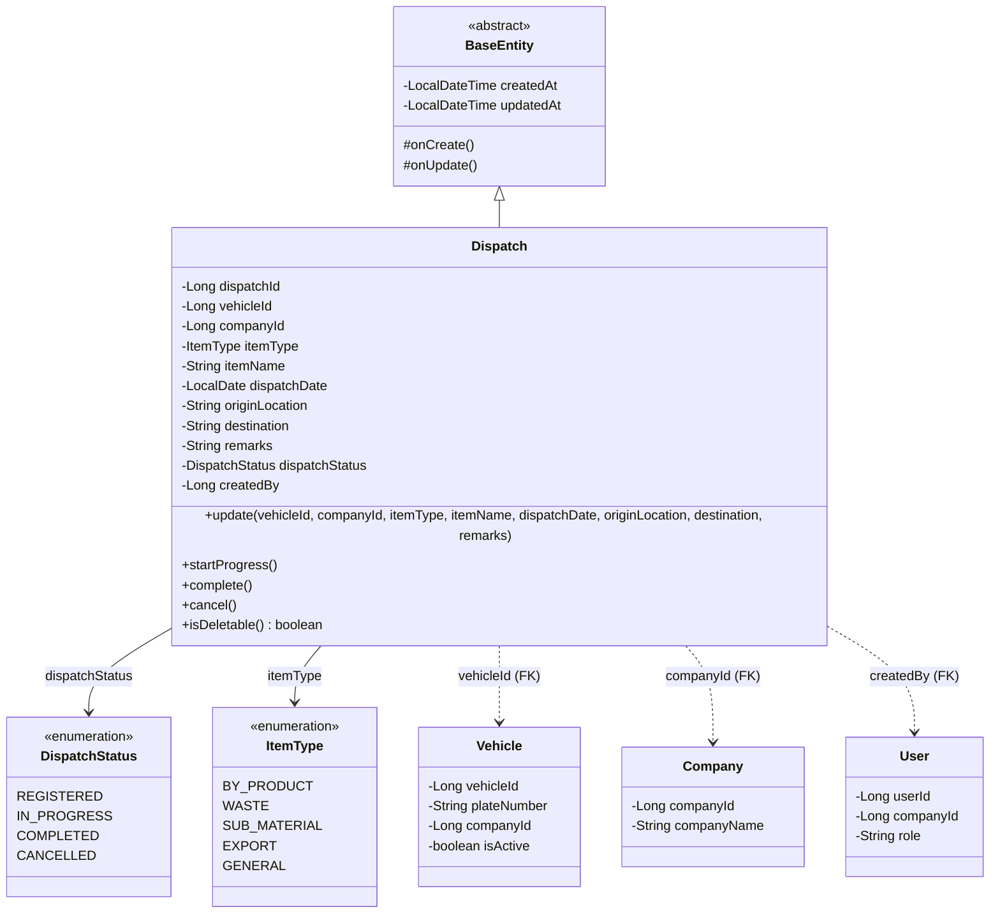
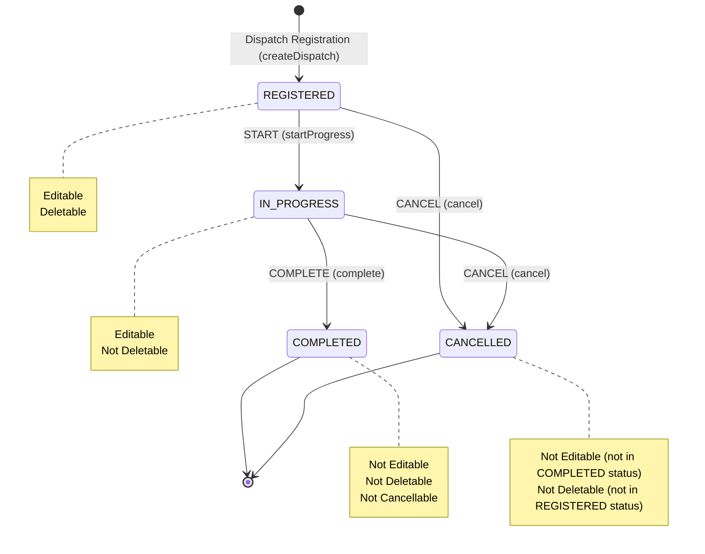
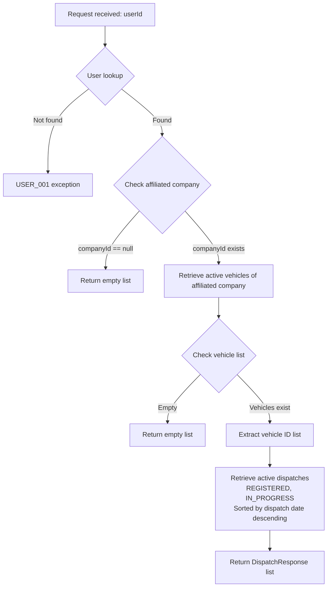
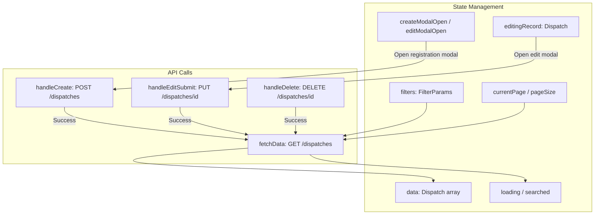
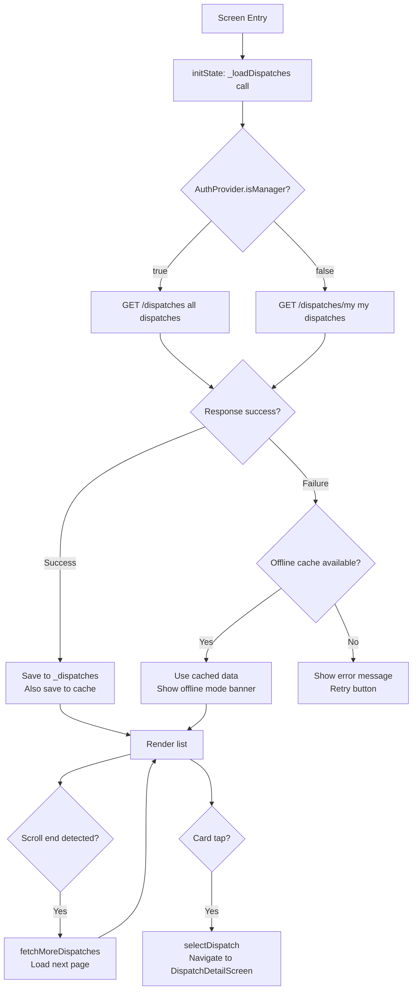
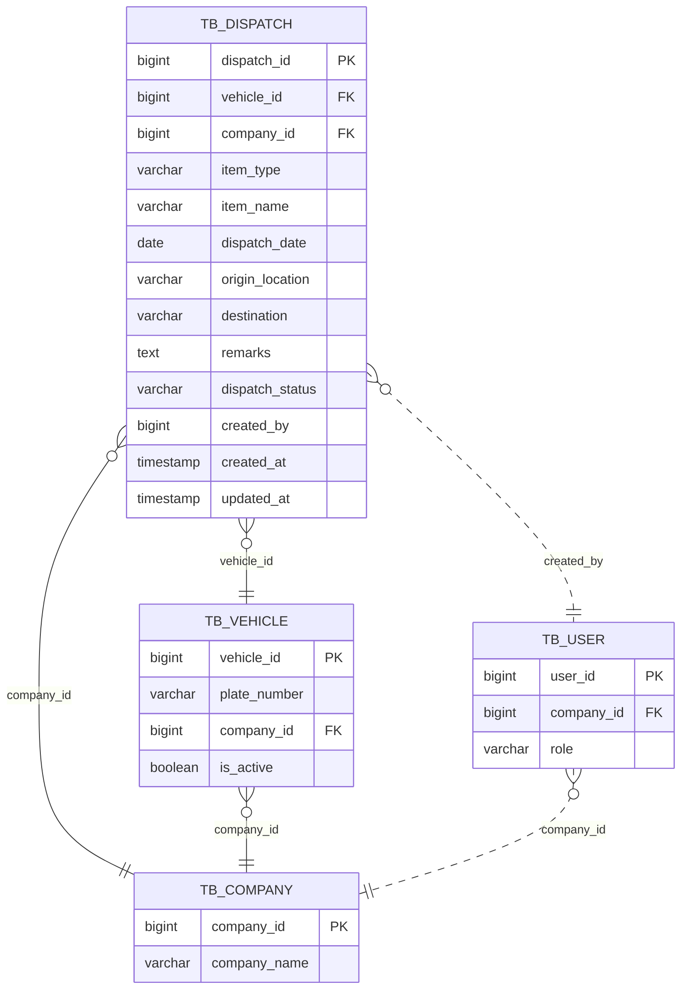
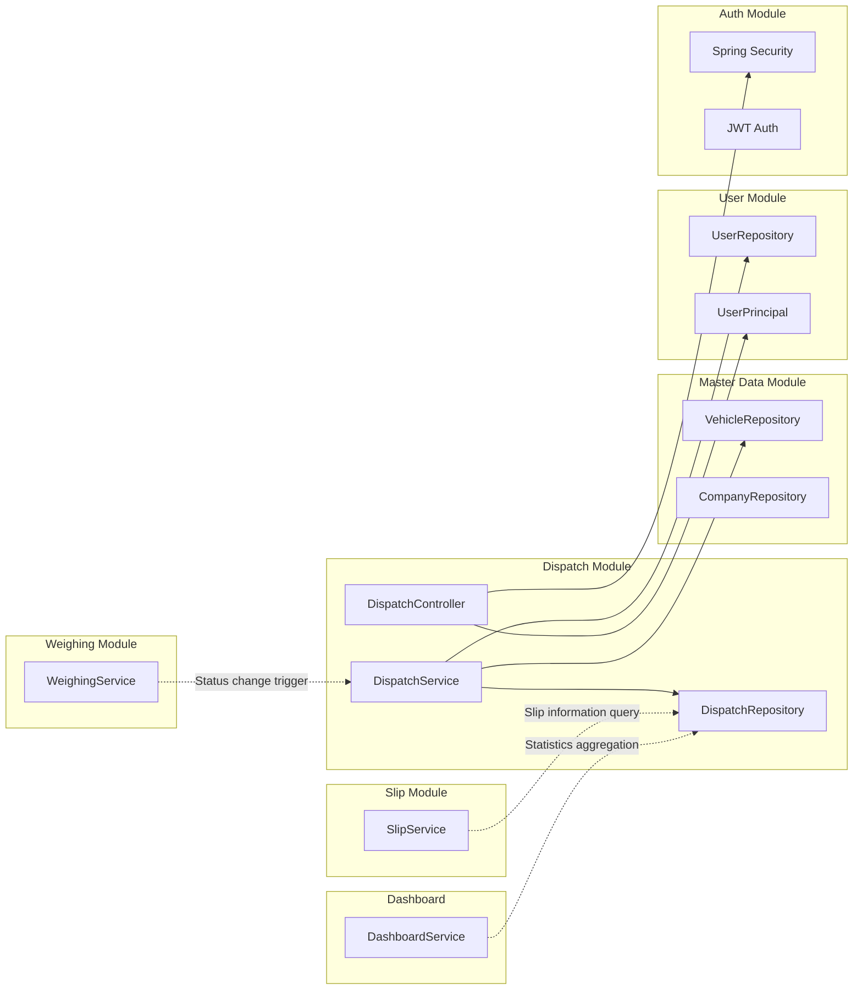

# Dispatch Module Detailed Design Document

| Item | Details |
|------|---------|
| **Document Version** | 1.0 |
| **Date** | 2026-01-29 |
| **Target Module** | `com.dongkuk.weighing.dispatch` |
| **Related Platforms** | Backend (Spring Boot), Frontend (React), Mobile (Flutter) |

---

## Table of Contents

1. [Module Overview](#1-module-overview)
2. [Domain Model](#2-domain-model)
3. [API Design](#3-api-design)
4. [Service Logic](#4-service-logic)
5. [DTO Specification](#5-dto-specification)
6. [Frontend Screen Design](#6-frontend-screen-design)
7. [Mobile Screen Design](#7-mobile-screen-design)
8. [Database Design](#8-database-design)
9. [Related Modules](#9-related-modules)
10. [Business Rules Summary](#10-business-rules-summary)

---

## 1. Module Overview

### 1.1 Purpose

The Dispatch module is a core business module that **manages vehicle assignment information** for transporting by-products, waste, sub-materials, etc. within a steel mill premises. It registers transport-related information such as vehicle, company, item, origin/destination, and tracks the dispatch lifecycle (Registered - In Progress - Completed/Cancelled).

### 1.2 Key Features

| Feature | Description | User Role |
|---------|-------------|-----------|
| Dispatch Registration | Create dispatch with vehicle, company, item, date, origin/destination information | ADMIN, MANAGER |
| Dispatch Search | Multi-criteria search with date range, item type, status, and pagination | All authenticated users |
| Dispatch Update | Modify existing dispatch information (except completed dispatches) | ADMIN, MANAGER |
| Dispatch Delete | Only dispatches in REGISTERED status can be deleted | ADMIN |
| Status Change | Start Progress (START), Complete (COMPLETE), Cancel (CANCEL) | ADMIN, MANAGER |
| My Dispatches | Retrieve active dispatches for the driver's affiliated company (mobile) | DRIVER |

### 1.3 Module Location

```
backend/src/main/java/com/dongkuk/weighing/dispatch/
  ├── controller/   DispatchController.java
  ├── service/      DispatchService.java
  ├── domain/       Dispatch.java, DispatchStatus.java, ItemType.java, DispatchRepository.java
  └── dto/          DispatchCreateRequest.java, DispatchUpdateRequest.java,
                    DispatchResponse.java, DispatchSearchCondition.java

frontend/src/pages/DispatchPage.tsx

mobile/lib/
  ├── models/       dispatch.dart
  ├── providers/    dispatch_provider.dart
  └── screens/dispatch/
        ├── dispatch_list_screen.dart
        └── dispatch_detail_screen.dart
```

---

## 2. Domain Model

### 2.1 Class Diagram



### 2.2 Entity Field Details

#### Dispatch Entity

| Field | Type | DB Column | Constraints | Description |
|-------|------|-----------|-------------|-------------|
| `dispatchId` | `Long` | `dispatch_id` | PK, AUTO_INCREMENT | Dispatch unique identifier |
| `vehicleId` | `Long` | `vehicle_id` | NOT NULL, FK | Assigned vehicle ID |
| `companyId` | `Long` | `company_id` | NOT NULL, FK | Transport company ID |
| `itemType` | `ItemType` | `item_type` | NOT NULL, VARCHAR(20) | Item type |
| `itemName` | `String` | `item_name` | NOT NULL, VARCHAR(100) | Item name |
| `dispatchDate` | `LocalDate` | `dispatch_date` | NOT NULL | Dispatch date |
| `originLocation` | `String` | `origin_location` | VARCHAR(100) | Origin location |
| `destination` | `String` | `destination` | VARCHAR(100) | Destination |
| `remarks` | `String` | `remarks` | TEXT | Remarks |
| `dispatchStatus` | `DispatchStatus` | `dispatch_status` | NOT NULL, VARCHAR(20) | Dispatch status |
| `createdBy` | `Long` | `created_by` | - | Creator user ID |
| `createdAt` | `LocalDateTime` | `created_at` | NOT NULL, auto | Created datetime (BaseEntity) |
| `updatedAt` | `LocalDateTime` | `updated_at` | NOT NULL, auto | Updated datetime (BaseEntity) |

#### DispatchStatus Enumeration

| Value | Label | Description |
|-------|-------|-------------|
| `REGISTERED` | Registered | Initial state where the dispatch is created and pending |
| `IN_PROGRESS` | In Progress | Weighing has started and transport is underway |
| `COMPLETED` | Completed | All weighing and transport have been successfully finished |
| `CANCELLED` | Cancelled | Dispatch has been cancelled and is no longer valid |

#### ItemType Enumeration

| Value | Label | Description |
|-------|-------|-------------|
| `BY_PRODUCT` | By-product | By-products from steelmaking processes (slag, dust, etc.) |
| `WASTE` | Waste | Industrial waste and materials subject to disposal |
| `SUB_MATERIAL` | Sub-material | Auxiliary raw materials used in production processes |
| `EXPORT` | Export | Items being exported from the premises to external locations |
| `GENERAL` | General | General items not falling into the above categories |

---

## 3. API Design

### 3.1 Endpoint List

Base URL: `/api/v1/dispatches`

| Method | URI | Description | Authorization | HTTP Status |
|--------|-----|-------------|---------------|-------------|
| `POST` | `/api/v1/dispatches` | Register dispatch | ADMIN, MANAGER | 201 Created |
| `GET` | `/api/v1/dispatches` | Search dispatch list | Authenticated user | 200 OK |
| `GET` | `/api/v1/dispatches/{dispatchId}` | Get single dispatch | Authenticated user | 200 OK |
| `GET` | `/api/v1/dispatches/my` | Get my dispatches (driver) | Authenticated user | 200 OK |
| `PUT` | `/api/v1/dispatches/{dispatchId}` | Update dispatch | ADMIN, MANAGER | 200 OK |
| `DELETE` | `/api/v1/dispatches/{dispatchId}` | Delete dispatch | ADMIN | 200 OK |
| `PUT` | `/api/v1/dispatches/{dispatchId}/status` | Change dispatch status | ADMIN, MANAGER | 200 OK |

### 3.2 API Details

#### 3.2.1 Register Dispatch

**`POST /api/v1/dispatches`**

Request Headers:
```
Authorization: Bearer {accessToken}
Content-Type: application/json
```

Request Body:
```json
{
  "vehicle_id": 1,
  "company_id": 2,
  "item_type": "BY_PRODUCT",
  "item_name": "Slag",
  "dispatch_date": "2026-01-30",
  "origin_location": "Plant 2 Yard 2",
  "destination": "External Processing Facility",
  "remarks": "Special vehicle assignment required"
}
```

Success Response (201):
```json
{
  "success": true,
  "data": {
    "dispatch_id": 15,
    "vehicle_id": 1,
    "company_id": 2,
    "item_type": "BY_PRODUCT",
    "item_name": "Slag",
    "dispatch_date": "2026-01-30",
    "origin_location": "Plant 2 Yard 2",
    "destination": "External Processing Facility",
    "remarks": "Special vehicle assignment required",
    "dispatch_status": "REGISTERED",
    "created_by": 3,
    "created_at": "2026-01-29T14:30:00",
    "updated_at": "2026-01-29T14:30:00"
  },
  "error": null
}
```

Error Response (400 - Validation Failure):
```json
{
  "success": false,
  "data": null,
  "error": {
    "code": "VALIDATION_ERROR",
    "message": "vehicleId: must not be null"
  }
}
```

#### 3.2.2 Search Dispatch List

**`GET /api/v1/dispatches`**

Query Parameters:

| Parameter | Type | Required | Description |
|-----------|------|----------|-------------|
| `date_from` | `LocalDate` | No | Search start date (YYYY-MM-DD) |
| `date_to` | `LocalDate` | No | Search end date (YYYY-MM-DD) |
| `item_type` | `ItemType` | No | Item type filter |
| `status` | `DispatchStatus` | No | Dispatch status filter |
| `page` | `int` | No | Page number (0-based, default: 0) |
| `size` | `int` | No | Page size (default: 20) |
| `sort` | `String` | No | Sort criteria (e.g., `dispatchDate,desc`) |

Request Example:
```
GET /api/v1/dispatches?date_from=2026-01-01&date_to=2026-01-31&item_type=BY_PRODUCT&status=REGISTERED&page=0&size=20
```

Success Response (200):
```json
{
  "success": true,
  "data": {
    "content": [
      {
        "dispatch_id": 15,
        "vehicle_id": 1,
        "company_id": 2,
        "item_type": "BY_PRODUCT",
        "item_name": "Slag",
        "dispatch_date": "2026-01-30",
        "origin_location": "Plant 2 Yard 2",
        "destination": "External Processing Facility",
        "remarks": null,
        "dispatch_status": "REGISTERED",
        "created_by": 3,
        "created_at": "2026-01-29T14:30:00",
        "updated_at": "2026-01-29T14:30:00"
      }
    ],
    "totalElements": 1,
    "totalPages": 1,
    "size": 20,
    "number": 0
  },
  "error": null
}
```

#### 3.2.3 Get Single Dispatch

**`GET /api/v1/dispatches/{dispatchId}`**

Success Response (200):
```json
{
  "success": true,
  "data": {
    "dispatch_id": 15,
    "vehicle_id": 1,
    "company_id": 2,
    "item_type": "BY_PRODUCT",
    "item_name": "Slag",
    "dispatch_date": "2026-01-30",
    "origin_location": "Plant 2 Yard 2",
    "destination": "External Processing Facility",
    "remarks": null,
    "dispatch_status": "REGISTERED",
    "created_by": 3,
    "created_at": "2026-01-29T14:30:00",
    "updated_at": "2026-01-29T14:30:00"
  },
  "error": null
}
```

Error Response (404):
```json
{
  "success": false,
  "data": null,
  "error": {
    "code": "DISPATCH_001",
    "message": "Dispatch not found"
  }
}
```

#### 3.2.4 Get My Dispatches (Driver Only)

**`GET /api/v1/dispatches/my`**

Description: Returns actionable dispatches (REGISTERED, IN_PROGRESS status) for active vehicles belonging to the logged-in user's affiliated company.

Success Response (200):
```json
{
  "success": true,
  "data": [
    {
      "dispatch_id": 15,
      "vehicle_id": 1,
      "company_id": 2,
      "item_type": "BY_PRODUCT",
      "item_name": "Slag",
      "dispatch_date": "2026-01-30",
      "origin_location": "Plant 2 Yard 2",
      "destination": "External Processing Facility",
      "remarks": null,
      "dispatch_status": "REGISTERED",
      "created_by": 3,
      "created_at": "2026-01-29T14:30:00",
      "updated_at": "2026-01-29T14:30:00"
    }
  ],
  "error": null
}
```

Query Logic:
1. Retrieve the logged-in user's affiliated company (companyId)
2. If no affiliated company, return an empty array
3. Retrieve active vehicles (isActive=true) of the affiliated company
4. Retrieve active dispatches (REGISTERED, IN_PROGRESS) for those vehicles
5. Return sorted by dispatch date in descending order

#### 3.2.5 Update Dispatch

**`PUT /api/v1/dispatches/{dispatchId}`**

Request Body:
```json
{
  "vehicle_id": 2,
  "company_id": 2,
  "item_type": "WASTE",
  "item_name": "Industrial Waste",
  "dispatch_date": "2026-01-31",
  "origin_location": "Plant 1 Waste Collection Area",
  "destination": "External Processing Facility",
  "remarks": "Subject to special management"
}
```

Success Response (200): Same `DispatchResponse` format

Error Response (400 - Attempt to modify completed dispatch):
```json
{
  "success": false,
  "data": null,
  "error": {
    "code": "DISPATCH_002",
    "message": "Completed dispatches cannot be modified"
  }
}
```

#### 3.2.6 Delete Dispatch

**`DELETE /api/v1/dispatches/{dispatchId}`**

Success Response (200):
```json
{
  "success": true,
  "data": null,
  "error": null
}
```

Error Response (400 - Attempt to delete non-REGISTERED dispatch):
```json
{
  "success": false,
  "data": null,
  "error": {
    "code": "DISPATCH_003",
    "message": "Only dispatches in REGISTERED status can be deleted"
  }
}
```

#### 3.2.7 Change Dispatch Status

**`PUT /api/v1/dispatches/{dispatchId}/status?action={ACTION}`**

Supported Actions:

| action | Description | Allowed Source Status | Target Status |
|--------|-------------|----------------------|---------------|
| `START` | Start progress | REGISTERED | IN_PROGRESS |
| `COMPLETE` | Complete | IN_PROGRESS | COMPLETED |
| `CANCEL` | Cancel | REGISTERED, IN_PROGRESS | CANCELLED |

Request Example:
```
PUT /api/v1/dispatches/15/status?action=START
```

Success Response (200): Same `DispatchResponse` format

Error Response (400 - Invalid state transition):
```json
{
  "success": false,
  "data": null,
  "error": {
    "code": "DISPATCH_004",
    "message": "Invalid dispatch status change"
  }
}
```

---

## 4. Service Logic

### 4.1 Service Layer Structure

```
DispatchController
  └── DispatchService
        ├── DispatchRepository    (Dispatch data access)
        ├── VehicleRepository     (Vehicle lookup - My Dispatches feature)
        └── UserRepository        (User lookup - My Dispatches feature)
```

### 4.2 Dispatch State Transition Diagram



### 4.3 Business Rules Details

#### Dispatch Registration (`createDispatch`)

1. Validate request DTO (Bean Validation)
2. Create Dispatch entity using Builder pattern
3. Set initial status to `REGISTERED`
4. Record authenticated user ID in `createdBy`
5. Save to DB and return `DispatchResponse`
6. Log: `Dispatch registered: dispatchId={}, vehicleId={}, date={}`

#### Dispatch Update (`updateDispatch`)

1. Look up dispatch by `dispatchId` (throw DISPATCH_001 if not found)
2. Call domain method `update()`
3. Status validation within domain: throw DISPATCH_002 if status is COMPLETED
4. After field update, auto-persist via JPA Dirty Checking
5. Log: `Dispatch updated: dispatchId={}`

#### Dispatch Delete (`deleteDispatch`)

1. Look up dispatch by `dispatchId` (throw DISPATCH_001 if not found)
2. Validate with `isDeletable()`: returns true only when status is REGISTERED
3. Throw DISPATCH_003 if not deletable
4. Execute physical delete (`repository.delete()`)
5. Log: `Dispatch deleted: dispatchId={}`

#### Dispatch Status Change (`updateStatus`)

1. Look up dispatch by `dispatchId` (throw DISPATCH_001 if not found)
2. Branch based on `action` parameter (case-insensitive):
   - `START`: call `startProgress()` (REGISTERED -> IN_PROGRESS)
   - `COMPLETE`: call `complete()` (IN_PROGRESS -> COMPLETED)
   - `CANCEL`: call `cancel()` (REGISTERED/IN_PROGRESS -> CANCELLED)
   - Other: throw DISPATCH_004
3. Throw DISPATCH_004 if domain status validation fails
4. Log: `Dispatch status changed: dispatchId={}, newStatus={}`

#### Get My Dispatches (`getMyDispatches`)



### 4.4 Error Codes

| Error Code | HTTP Status | Message | Trigger Condition |
|------------|-------------|---------|-------------------|
| `DISPATCH_001` | 404 | Dispatch not found | Querying/updating/deleting with non-existent dispatchId |
| `DISPATCH_002` | 400 | Completed dispatches cannot be modified | Calling update on a COMPLETED dispatch |
| `DISPATCH_003` | 400 | Only dispatches in REGISTERED status can be deleted | Attempting to delete a non-REGISTERED dispatch |
| `DISPATCH_004` | 400 | Invalid dispatch status change | Unsupported state transition or unsupported action |

### 4.5 Transaction Management

- Class level: `@Transactional(readOnly = true)` (default read-only)
- Write methods: individual `@Transactional` override
  - `createDispatch`: write transaction
  - `updateDispatch`: write transaction
  - `deleteDispatch`: write transaction
  - `updateStatus`: write transaction
- Read methods: class-level `readOnly = true` applied
  - `getDispatch`, `searchDispatches`, `getMyDispatches`

---

## 5. DTO Specification

### 5.1 DispatchCreateRequest (Dispatch Create Request)

Java Record-based DTO with Bean Validation.

| Field | Type | JSON Key | Required | Validation Rules | Description |
|-------|------|----------|----------|-----------------|-------------|
| `vehicleId` | `Long` | `vehicle_id` | Yes | `@NotNull` | Vehicle ID |
| `companyId` | `Long` | `company_id` | Yes | `@NotNull` | Company ID |
| `itemType` | `ItemType` | `item_type` | Yes | `@NotNull` | Item type |
| `itemName` | `String` | `item_name` | Yes | `@NotBlank`, `@Size(max=100)` | Item name |
| `dispatchDate` | `LocalDate` | `dispatch_date` | Yes | `@NotNull`, `@FutureOrPresent` | Dispatch date (present or future) |
| `originLocation` | `String` | `origin_location` | No | `@Size(max=100)` | Origin location |
| `destination` | `String` | `destination` | No | `@Size(max=100)` | Destination |
| `remarks` | `String` | `remarks` | No | - | Remarks |

### 5.2 DispatchUpdateRequest (Dispatch Update Request)

Has the same fields and validation rules as `DispatchCreateRequest`. All required fields must be included during update (full replacement approach).

| Field | Type | JSON Key | Required | Validation Rules | Description |
|-------|------|----------|----------|-----------------|-------------|
| `vehicleId` | `Long` | `vehicle_id` | Yes | `@NotNull` | Vehicle ID |
| `companyId` | `Long` | `company_id` | Yes | `@NotNull` | Company ID |
| `itemType` | `ItemType` | `item_type` | Yes | `@NotNull` | Item type |
| `itemName` | `String` | `item_name` | Yes | `@NotBlank`, `@Size(max=100)` | Item name |
| `dispatchDate` | `LocalDate` | `dispatch_date` | Yes | `@NotNull`, `@FutureOrPresent` | Dispatch date |
| `originLocation` | `String` | `origin_location` | No | `@Size(max=100)` | Origin location |
| `destination` | `String` | `destination` | No | `@Size(max=100)` | Destination |
| `remarks` | `String` | `remarks` | No | - | Remarks |

### 5.3 DispatchResponse (Dispatch Response)

| Field | Type | JSON Key | Description |
|-------|------|----------|-------------|
| `dispatchId` | `Long` | `dispatch_id` | Dispatch unique identifier |
| `vehicleId` | `Long` | `vehicle_id` | Vehicle ID |
| `companyId` | `Long` | `company_id` | Company ID |
| `itemType` | `String` | `item_type` | Item type (enum name) |
| `itemName` | `String` | `item_name` | Item name |
| `dispatchDate` | `LocalDate` | `dispatch_date` | Dispatch date |
| `originLocation` | `String` | `origin_location` | Origin location |
| `destination` | `String` | `destination` | Destination |
| `remarks` | `String` | `remarks` | Remarks |
| `dispatchStatus` | `String` | `dispatch_status` | Dispatch status (enum name) |
| `createdBy` | `Long` | `created_by` | Creator ID |
| `createdAt` | `LocalDateTime` | `created_at` | Created datetime (ISO 8601) |
| `updatedAt` | `LocalDateTime` | `updated_at` | Updated datetime (ISO 8601) |

Conversion Method: Uses the static factory method `DispatchResponse.from(Dispatch dispatch)` to convert the entity to a DTO.

### 5.4 DispatchSearchCondition (Dispatch Search Condition)

An internal DTO that collects query parameters from the controller and passes them to the service.

| Field | Type | Description |
|-------|------|-------------|
| `dateFrom` | `LocalDate` | Search start date (nullable) |
| `dateTo` | `LocalDate` | Search end date (nullable) |
| `itemType` | `ItemType` | Item type filter (nullable) |
| `status` | `DispatchStatus` | Dispatch status filter (nullable) |

If all fields are null, all dispatches are returned. Dynamic queries are implemented using the `IS NULL OR` pattern in JPQL.

---

## 6. Frontend Screen Design

### 6.1 Screen Structure

File Location: `frontend/src/pages/DispatchPage.tsx`

```
DispatchPage
├── Page Title: "Dispatch Management"
├── Search Criteria Card (Card)
│   ├── Date Range (RangePicker)
│   ├── Item Type (Select)
│   ├── Dispatch Status (Select)
│   ├── Reset Button
│   └── Search Button
├── Results Header
│   ├── Search Result Count
│   ├── Refresh Button
│   └── Register Dispatch Button
├── Dispatch Table (SortableTable)
│   └── Columns: ID, Item Type, Item Name, Dispatch Date, Origin, Destination, Status, Created Date, Actions
├── Pagination (Pagination)
├── Dispatch Registration Modal (Modal + Form)
└── Dispatch Edit Modal (Modal + Form)
```

### 6.2 Component Data Flow



### 6.3 Table Column Definitions

| Column | dataIndex | Width (px) | Rendering | Notes |
|--------|-----------|-----------|-----------|-------|
| ID | `dispatchId` | 80 | Default | - |
| Item Type | `itemType` | 100 | `ITEM_TYPE_LABELS` mapping | BY_PRODUCT -> "By-product" |
| Item Name | `itemName` | 110 | Default | - |
| Dispatch Date | `dispatchDate` | 110 | Default | YYYY-MM-DD |
| Origin | `originLocation` | 110 | Default | - |
| Destination | `destination` | 110 | Default | - |
| Status | `dispatchStatus` | 90 | Tag + color | `DISPATCH_STATUS_COLORS` mapping |
| Created Date | `createdAt` | 160 | `YYYY-MM-DD HH:mm` format | Using dayjs |
| Actions | - | 100 | Edit/Delete buttons | Delete shown only for REGISTERED |

### 6.4 Search Filter Configuration

| Filter | Component | Options | Default |
|--------|-----------|---------|---------|
| Date Range | `RangePicker` | Start date ~ End date | null (All) |
| Item Type | `Select` | `ITEM_TYPE_OPTIONS` (By-product, Waste, Sub-material, Export, General) | All |
| Dispatch Status | `Select` | `DISPATCH_STATUS_OPTIONS` (Registered, In Progress, Completed, Cancelled) | All |

### 6.5 Form Field Configuration (Shared for Registration/Edit)

| Field | Label | Component | Required | Validation |
|-------|-------|-----------|----------|------------|
| `vehicleId` | Vehicle ID | `Input[type=number]` | Yes | required |
| `companyId` | Company ID | `Input[type=number]` | Yes | required |
| `itemType` | Item Type | `Select` | Yes | required |
| `itemName` | Item Name | `Input` | Yes | required, `maxLengthRule(100)` |
| `dispatchDate` | Dispatch Date | `DatePicker` | Yes | required, `futureOrPresentDateValidator` |
| `originLocation` | Origin | `Input` | No | `maxLengthRule(100)` |
| `destination` | Destination | `Input` | No | `maxLengthRule(100)` |
| `remarks` | Remarks | `Input.TextArea[rows=2]` | No | - |

### 6.6 User Interactions

| Action | Handler | Follow-up |
|--------|---------|-----------|
| Click Search Button | Call `fetchData(1, pageSize)` | Refresh table, reset to page 1 |
| Click Reset Button | Reset filters/data/search state | Display empty table |
| Click Register Dispatch Button | Open registration modal | - |
| Save Registration Modal | Call `POST /dispatches` | On success, close modal and refresh list |
| Click Edit Icon | Open edit modal + set existing data | - |
| Save Edit Modal | Call `PUT /dispatches/{id}` | On success, close modal and refresh list |
| Click Delete Icon | Call `DELETE /dispatches/{id}` after Popconfirm | On success, refresh list |
| Page Change | Call `fetchData(page, size)` | Refresh table |

---

## 7. Mobile Screen Design

### 7.1 Screen Structure Overview

```
Mobile Dispatch Screens
├── DispatchListScreen (Dispatch List)
│   ├── Offline Mode Banner
│   ├── Search Bar (vehicle number/company name)
│   ├── Status Filter Chips (All, Pending, In Progress, Completed)
│   └── Dispatch Card List (infinite scroll)
│       └── _DispatchCard
│           ├── Dispatch Number + Status Badge
│           ├── Vehicle/Company/Item Information
│           ├── Route Information
│           └── Dispatch Datetime + Navigation Arrow
│
└── DispatchDetailScreen (Dispatch Detail)
    ├── Status Card (Dispatch number, status badge, dispatch datetime)
    ├── Vehicle Information Section (vehicle number, driver)
    ├── Company/Item Section (company name, item, item category)
    ├── Route Information Section (origin, destination)
    ├── Expected Weight Section
    └── Memo Section
```

### 7.2 Mobile Data Model

File Location: `mobile/lib/models/dispatch.dart`

#### Dispatch Class Fields

| Field | Type | Required | Description |
|-------|------|----------|-------------|
| `id` | `String` | Yes | Dispatch unique ID |
| `dispatchNumber` | `String` | Yes | Dispatch number (e.g., DSP-20250129-A1B2) |
| `status` | `DispatchStatus` | Yes | Dispatch status |
| `vehicleNumber` | `String` | Yes | Vehicle number |
| `driverName` | `String` | Yes | Driver name |
| `companyName` | `String` | Yes | Company name |
| `itemName` | `String` | Yes | Item name |
| `itemCategory` | `String?` | No | Item category |
| `origin` | `String?` | No | Origin |
| `destination` | `String?` | No | Destination |
| `expectedWeight` | `double?` | No | Expected weight (kg) |
| `memo` | `String?` | No | Memo |
| `dispatchDate` | `DateTime` | Yes | Dispatch date |
| `createdAt` | `DateTime?` | No | Created datetime |
| `updatedAt` | `DateTime?` | No | Updated datetime |

#### DispatchStatus Enumeration (Mobile)

| Value | JSON Value | Label | Color | Icon |
|-------|-----------|-------|-------|------|
| `registered` | `REGISTERED` | Registered | Cyan (#06B6D4) | `Icons.assignment` |
| `inProgress` | `IN_PROGRESS` | In Progress | Amber (#F59E0B) | `Icons.local_shipping` |
| `completed` | `COMPLETED` | Completed | Green (#10B981) | `Icons.check_circle` |
| `cancelled` | `CANCELLED` | Cancelled | Rose (#F43F5E) | `Icons.cancel` |

### 7.3 Provider State Management

File Location: `mobile/lib/providers/dispatch_provider.dart`

#### State Fields

| Field | Type | Description |
|-------|------|-------------|
| `_dispatches` | `List<Dispatch>` | Dispatch list |
| `_selectedDispatch` | `Dispatch?` | Selected dispatch (for detail screen) |
| `_isLoading` | `bool` | Loading state |
| `_errorMessage` | `String?` | Error message |
| `_isOfflineMode` | `bool` | Offline mode flag |
| `_currentPage` | `int` | Current page (0-based) |
| `_hasMore` | `bool` | Whether more data exists |

#### Key Methods

| Method | Description | API Call |
|--------|-------------|---------|
| `fetchDispatches(isManager)` | Fetch dispatch list (all/my dispatches) | GET `/dispatches` or `/dispatches/my` |
| `fetchMoreDispatches(isManager, date)` | Load additional pages for infinite scroll | GET (incrementing page number) |
| `fetchDispatchDetail(id)` | Fetch dispatch details | GET `/dispatches/{id}` |
| `selectDispatch(dispatch)` | Select dispatch from list | - (local state change) |
| `resetPagination()` | Reset pagination state | - |
| `clearError()` | Clear error state | - |
| `clearSelection()` | Clear selection state | - |

### 7.4 List Screen Data Flow



### 7.5 Mobile UI Characteristics

| Feature | Implementation |
|---------|---------------|
| Search | TextField + client-side filtering (vehicle number/company name) |
| Status Filter | FilterChip horizontal scroll (All, Pending, In Progress, Completed) |
| List Display | Card widget-based list (ListView.builder) |
| Infinite Scroll | ScrollController + position detection (200px from end) |
| Pull-to-Refresh | RefreshIndicator wrapper |
| Offline Support | OfflineCacheService for local caching + offline banner |
| Dark Mode | Automatic switch based on Theme.of(context).brightness |
| Status Display | StatusBadge widget (label + color + icon) |

---

## 8. Database Design

### 8.1 Table DDL

```sql
CREATE TABLE tb_dispatch (
    dispatch_id      BIGSERIAL       PRIMARY KEY,
    vehicle_id       BIGINT          NOT NULL,
    company_id       BIGINT          NOT NULL,
    item_type        VARCHAR(20)     NOT NULL,
    item_name        VARCHAR(100)    NOT NULL,
    dispatch_date    DATE            NOT NULL,
    origin_location  VARCHAR(100),
    destination      VARCHAR(100),
    remarks          TEXT,
    dispatch_status  VARCHAR(20)     NOT NULL,
    created_by       BIGINT,
    created_at       TIMESTAMP       NOT NULL DEFAULT CURRENT_TIMESTAMP,
    updated_at       TIMESTAMP       NOT NULL DEFAULT CURRENT_TIMESTAMP,

    CONSTRAINT fk_dispatch_vehicle
        FOREIGN KEY (vehicle_id) REFERENCES tb_vehicle(vehicle_id),
    CONSTRAINT fk_dispatch_company
        FOREIGN KEY (company_id) REFERENCES tb_company(company_id),
    CONSTRAINT chk_dispatch_status
        CHECK (dispatch_status IN ('REGISTERED', 'IN_PROGRESS', 'COMPLETED', 'CANCELLED')),
    CONSTRAINT chk_item_type
        CHECK (item_type IN ('BY_PRODUCT', 'WASTE', 'SUB_MATERIAL', 'EXPORT', 'GENERAL'))
);
```

### 8.2 Indexes

```sql
-- Optimize dispatch date-based queries (primary filter for list search)
CREATE INDEX idx_dispatch_date
    ON tb_dispatch (dispatch_date);

-- Optimize vehicle-based dispatch queries (my dispatches, active dispatches per vehicle)
CREATE INDEX idx_dispatch_vehicle
    ON tb_dispatch (vehicle_id);

-- Optimize status-based dispatch queries (status filter, active dispatch queries)
CREATE INDEX idx_dispatch_status
    ON tb_dispatch (dispatch_status);
```

### 8.3 Index Usage Analysis

| Query Pattern | Index Used | Frequency |
|---------------|-----------|-----------|
| Dispatch list by date range | `idx_dispatch_date` | High |
| Multi-criteria search (date + item type + status) | `idx_dispatch_date` + `idx_dispatch_status` | High |
| Active dispatches by vehicle ID list | `idx_dispatch_vehicle` + `idx_dispatch_status` | High |
| Dispatch count by date and status (dashboard) | `idx_dispatch_date` + `idx_dispatch_status` | Medium |
| Company/vehicle existence check | `idx_dispatch_vehicle`, no separate index needed | Low |

### 8.4 ER Diagram



---

## 9. Related Modules

### 9.1 Module Dependency Diagram



### 9.2 Inter-Module Interaction Details

| Related Module | Direction | Interaction Details |
|---------------|-----------|---------------------|
| **Master Data (Vehicle)** | Dispatch -> Vehicle | Calls `VehicleRepository.findByCompanyIdAndIsActiveTrue()` to retrieve active vehicles of the affiliated company |
| **Master Data (Company)** | Dispatch -> Company | References company by `companyId`. Provides `existsByCompanyId()` to check dispatch existence |
| **User** | Dispatch -> User | Calls `UserRepository.findById()` to verify user's affiliated company (My Dispatches) |
| **Auth** | Auth -> Dispatch | Role-based access control via `@PreAuthorize`. Extracts user ID from `UserPrincipal` |
| **Weighing** | Weighing -> Dispatch | Changes dispatch status to IN_PROGRESS at weighing start, to COMPLETED at weighing completion |
| **Slip** | Slip -> Dispatch | Queries `findSlipInfoByDispatchId()` for dispatch item name, vehicle number, company name |
| **Dashboard** | Dashboard -> Dispatch | Aggregates dispatch counts by date/status via `countByDispatchDateAndDispatchStatus()` |

### 9.3 External Integration Queries Provided by Repository

| Method | Used By | Description |
|--------|---------|-------------|
| `existsByCompanyId(Long)` | Master data delete validation | Check if dispatches exist for a company |
| `existsByVehicleId(Long)` | Master data delete validation | Check if dispatches exist for a vehicle |
| `findActiveByVehicleIds(List<Long>)` | My Dispatches | Retrieve active dispatches for vehicle ID list |
| `countByDispatchDateAndDispatchStatus(LocalDate, DispatchStatus)` | Dashboard statistics | Count by date/status |
| `findSlipInfoByDispatchId(Long)` | Slip creation | Retrieve item name, vehicle number, company name for a dispatch (native query, JOIN) |

---

## 10. Business Rules Summary

### 10.1 Dispatch Registration Rules

| # | Rule | Implementation Location |
|---|------|------------------------|
| R01 | Vehicle ID, Company ID, Item Type, Item Name, and Dispatch Date are required | `DispatchCreateRequest` (Bean Validation) |
| R02 | Dispatch date must be present or future | `@FutureOrPresent` |
| R03 | Item name has a maximum of 100 characters | `@Size(max=100)` |
| R04 | Origin and destination each have a maximum of 100 characters | `@Size(max=100)` |
| R05 | Initial status must be REGISTERED upon dispatch creation | `Dispatch` constructor |
| R06 | Creator user ID is automatically recorded | `DispatchService.createDispatch()` |
| R07 | Only ADMIN or MANAGER can register dispatches | `@PreAuthorize("hasAnyRole('ADMIN', 'MANAGER')")` |

### 10.2 Dispatch Update Rules

| # | Rule | Implementation Location |
|---|------|------------------------|
| R08 | Dispatches in COMPLETED status cannot be modified | `Dispatch.update()` |
| R09 | Update uses full replacement approach (all required fields needed) | `DispatchUpdateRequest` |
| R10 | Only ADMIN or MANAGER can update dispatches | `@PreAuthorize` |

### 10.3 Dispatch Delete Rules

| # | Rule | Implementation Location |
|---|------|------------------------|
| R11 | Only dispatches in REGISTERED status can be deleted | `Dispatch.isDeletable()` |
| R12 | IN_PROGRESS, COMPLETED, CANCELLED status dispatches cannot be deleted | `DispatchService.deleteDispatch()` |
| R13 | Only ADMIN can delete dispatches | `@PreAuthorize("hasRole('ADMIN')")` |
| R14 | Deletion is a physical delete (completely removed from DB) | `repository.delete()` |

### 10.4 Status Change Rules

| # | Rule | Implementation Location |
|---|------|------------------------|
| R15 | START (begin progress) is only allowed from REGISTERED | `Dispatch.startProgress()` |
| R16 | COMPLETE is only allowed from IN_PROGRESS | `Dispatch.complete()` |
| R17 | CANCEL is not allowed from COMPLETED status | `Dispatch.cancel()` |
| R18 | CANCEL is allowed from REGISTERED and IN_PROGRESS | `Dispatch.cancel()` |
| R19 | COMPLETED and CANCELLED are terminal states (no further transitions allowed) | Each domain method |
| R20 | Unsupported action values result in DISPATCH_004 error | `DispatchService.updateStatus()` |
| R21 | Only ADMIN or MANAGER can change status | `@PreAuthorize` |

### 10.5 My Dispatches Rules

| # | Rule | Implementation Location |
|---|------|------------------------|
| R22 | Users without an affiliated company receive an empty dispatch list | `DispatchService.getMyDispatches()` |
| R23 | If the affiliated company has no active vehicles, return an empty list | `DispatchService.getMyDispatches()` |
| R24 | Only active dispatches (REGISTERED, IN_PROGRESS) are returned | `DispatchRepository.findActiveByVehicleIds()` |
| R25 | Results are sorted by dispatch date in descending order | JPQL `ORDER BY d.dispatchDate DESC` |

### 10.6 Frontend/Mobile Common Rules

| # | Rule | Implementation Location |
|---|------|------------------------|
| R26 | Delete button is only displayed for dispatches in REGISTERED status | `DispatchPage.tsx` conditional rendering |
| R27 | JSON fields use snake_case; frontend code uses camelCase | Axios interceptor auto-conversion |
| R28 | On mobile network errors, enter offline mode with cached data | `DispatchProvider.fetchDispatches()` |
| R29 | Mobile list uses infinite scroll pagination (20 items per page) | `DispatchProvider._pageSize = 20` |
| R30 | Mobile status filtering is performed client-side | `_getFilteredDispatches()` |

---

## Appendix: Allowed Actions Matrix by Status

| Current Status | View | Edit | Delete | START | COMPLETE | CANCEL |
|---------------|:----:|:----:|:------:|:-----:|:--------:|:------:|
| **REGISTERED** | O | O | O | O | X | O |
| **IN_PROGRESS** | O | O | X | X | O | O |
| **COMPLETED** | O | X | X | X | X | X |
| **CANCELLED** | O | X | X | X | X | X |

> O = Allowed, X = Not allowed (BusinessException thrown)
