# Gate Pass and Electronic Weighing Slip Module Detailed Design

| Item | Details |
|------|---------|
| **Document Version** | 1.0 |
| **Date** | 2026-01-29 |
| **Modules** | gatepass (Gate Pass Management), slip (Electronic Weighing Slip) |
| **Backend Package** | `com.dongkuk.weighing.gatepass`, `com.dongkuk.weighing.slip` |
| **Frontend** | `GatePassPage.tsx`, `SlipPage.tsx` |
| **Mobile** | `gate_pass.dart`, `weighing_slip.dart`, `slip_list_screen.dart`, `slip_detail_screen.dart` |

---

## Table of Contents

1. [Module Overview - Gate Pass Management (GatePass)](#1-module-overview---gate-pass-management-gatepass)
2. [Gate Pass Domain Model](#2-gate-pass-domain-model)
3. [Gate Pass API Design](#3-gate-pass-api-design)
4. [Gate Pass Service Logic](#4-gate-pass-service-logic)
5. [Module Overview - Electronic Weighing Slip (Slip)](#5-module-overview---electronic-weighing-slip-slip)
6. [Slip Domain Model](#6-slip-domain-model)
7. [Slip API Design](#7-slip-api-design)
8. [Slip Service Logic](#8-slip-service-logic)
9. [DTO Specification](#9-dto-specification)
10. [Frontend Screen Design](#10-frontend-screen-design)
11. [Mobile Screen Design](#11-mobile-screen-design)
12. [Database Design](#12-database-design)
13. [Inter-Module Integration](#13-inter-module-integration)
14. [Business Rules Summary](#14-business-rules-summary)

---

## 1. Module Overview - Gate Pass Management (GatePass)

### 1.1 Purpose

The Gate Pass Management module is responsible for controlling vehicle entry and exit from the premises after weighing is completed. It issues gate passes linked to weighing records (WeighingRecord) and dispatches (Dispatch), and enables personnel with the ADMIN or MANAGER role to approve (pass) or reject them.

### 1.2 Core Features

| Feature | Description | Authorization |
|---------|-------------|---------------|
| Gate Pass Creation | Issues a new gate pass for a completed weighing record | ADMIN, MANAGER |
| Gate Pass Inquiry | Single record lookup by ID and paginated list by status | Authenticated users |
| Gate Pass Approval | Changes the gate pass status to PASSED and records the passage time | ADMIN, MANAGER |
| Gate Pass Rejection | Changes the gate pass status to REJECTED and records the rejection reason | ADMIN, MANAGER |

### 1.3 Package Structure

```
com.dongkuk.weighing.gatepass/
├── domain/
│   ├── GatePass.java              # Gate pass entity
│   ├── GatePassStatus.java        # Gate pass status enum
│   └── GatePassRepository.java    # Gate pass repository interface
├── service/
│   └── GatePassService.java       # Gate pass business service
├── controller/
│   └── GatePassController.java    # REST API controller
└── dto/
    ├── GatePassCreateRequest.java # Creation request DTO
    ├── GatePassRejectRequest.java # Rejection request DTO
    └── GatePassResponse.java      # Response DTO
```

---

## 2. Gate Pass Domain Model

### 2.1 Class Diagram

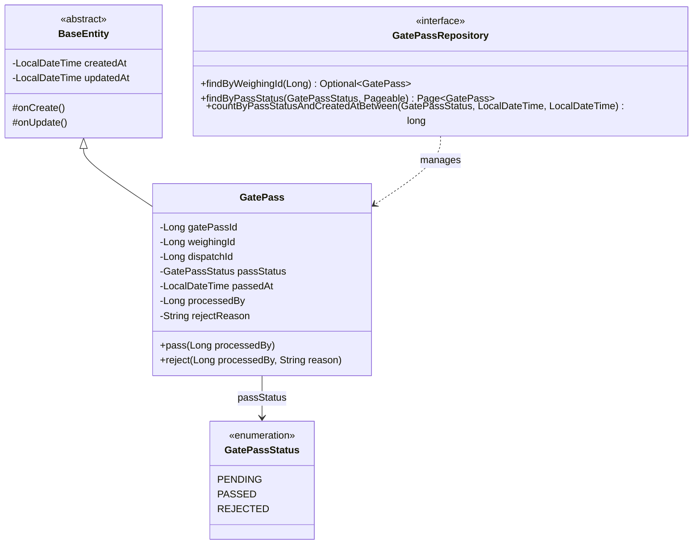

### 2.2 Entity Field Details

| Field | Type | Column Name | Constraints | Description |
|-------|------|-------------|-------------|-------------|
| `gatePassId` | Long | `gate_pass_id` | PK, AUTO_INCREMENT | Gate pass unique identifier |
| `weighingId` | Long | `weighing_id` | NOT NULL, INDEX | Associated weighing record ID |
| `dispatchId` | Long | `dispatch_id` | NOT NULL | Associated dispatch ID |
| `passStatus` | GatePassStatus | `pass_status` | NOT NULL, VARCHAR(20), INDEX | Gate pass status |
| `passedAt` | LocalDateTime | `passed_at` | NULLABLE | Date and time of passage |
| `processedBy` | Long | `processed_by` | NULLABLE | Processor user ID |
| `rejectReason` | String | `reject_reason` | NULLABLE, VARCHAR(255) | Rejection reason |
| `createdAt` | LocalDateTime | `created_at` | NOT NULL (BaseEntity) | Creation timestamp |
| `updatedAt` | LocalDateTime | `updated_at` | NOT NULL (BaseEntity) | Last updated timestamp |

### 2.3 Status Enum (GatePassStatus)

| Value | Label | Description |
|-------|-------|-------------|
| `PENDING` | Pending | The gate pass has been issued and is awaiting approval |
| `PASSED` | Passed | The gate pass has been approved and vehicle exit is permitted |
| `REJECTED` | Rejected | The gate pass has been denied and vehicle exit is not permitted |

---

## 3. Gate Pass API Design

### 3.1 Endpoint List

| Method | Path | Description | Authorization |
|--------|------|-------------|---------------|
| `POST` | `/api/v1/gate-passes` | Create a gate pass | ADMIN, MANAGER |
| `GET` | `/api/v1/gate-passes/{gatePassId}` | Retrieve a single gate pass | Authenticated users |
| `GET` | `/api/v1/gate-passes` | List gate passes by status | Authenticated users |
| `PUT` | `/api/v1/gate-passes/{gatePassId}/pass` | Approve a gate pass | ADMIN, MANAGER |
| `PUT` | `/api/v1/gate-passes/{gatePassId}/reject` | Reject a gate pass | ADMIN, MANAGER |

### 3.2 Create Gate Pass

**Request**

```http
POST /api/v1/gate-passes
Content-Type: application/json
Authorization: Bearer {access_token}

{
  "weighing_id": 42,
  "dispatch_id": 15
}
```

**Response (201 Created)**

```json
{
  "success": true,
  "data": {
    "gate_pass_id": 1,
    "weighing_id": 42,
    "dispatch_id": 15,
    "pass_status": "PENDING",
    "passed_at": null,
    "processed_by": null,
    "reject_reason": null,
    "created_at": "2026-01-29T10:30:00"
  },
  "error": null
}
```

### 3.3 Retrieve a Single Gate Pass

**Request**

```http
GET /api/v1/gate-passes/1
Authorization: Bearer {access_token}
```

**Response (200 OK)**

```json
{
  "success": true,
  "data": {
    "gate_pass_id": 1,
    "weighing_id": 42,
    "dispatch_id": 15,
    "pass_status": "PENDING",
    "passed_at": null,
    "processed_by": null,
    "reject_reason": null,
    "created_at": "2026-01-29T10:30:00"
  },
  "error": null
}
```

### 3.4 List Gate Passes by Status

**Request**

```http
GET /api/v1/gate-passes?status=PENDING&page=0&size=20
Authorization: Bearer {access_token}
```

- If the `status` parameter is omitted, the default value `PENDING` is used.

**Response (200 OK)**

```json
{
  "success": true,
  "data": {
    "content": [
      {
        "gate_pass_id": 1,
        "weighing_id": 42,
        "dispatch_id": 15,
        "pass_status": "PENDING",
        "passed_at": null,
        "processed_by": null,
        "reject_reason": null,
        "created_at": "2026-01-29T10:30:00"
      }
    ],
    "pageable": { "page_number": 0, "page_size": 20 },
    "total_elements": 1,
    "total_pages": 1
  },
  "error": null
}
```

### 3.5 Approve Gate Pass

**Request**

```http
PUT /api/v1/gate-passes/1/pass
Authorization: Bearer {access_token}
```

- No request body. The authenticated user's ID is automatically recorded as `processedBy`.

**Response (200 OK)**

```json
{
  "success": true,
  "data": {
    "gate_pass_id": 1,
    "weighing_id": 42,
    "dispatch_id": 15,
    "pass_status": "PASSED",
    "passed_at": "2026-01-29T11:05:00",
    "processed_by": 3,
    "reject_reason": null,
    "created_at": "2026-01-29T10:30:00"
  },
  "error": null
}
```

### 3.6 Reject Gate Pass

**Request**

```http
PUT /api/v1/gate-passes/1/reject
Content-Type: application/json
Authorization: Bearer {access_token}

{
  "reason": "Rejected due to incomplete documentation"
}
```

**Response (200 OK)**

```json
{
  "success": true,
  "data": {
    "gate_pass_id": 1,
    "weighing_id": 42,
    "dispatch_id": 15,
    "pass_status": "REJECTED",
    "passed_at": null,
    "processed_by": 3,
    "reject_reason": "Rejected due to incomplete documentation",
    "created_at": "2026-01-29T10:30:00"
  },
  "error": null
}
```

### 3.7 Error Responses

| Scenario | HTTP Status | Error Code | Message |
|----------|-------------|------------|---------|
| Gate pass not found | 404 | MASTER_001 | Master data not found |
| Insufficient permissions | 403 | - | Access Denied |
| Required field missing | 400 | - | Validation Error |

---

## 4. Gate Pass Service Logic

### 4.1 State Transition Diagram

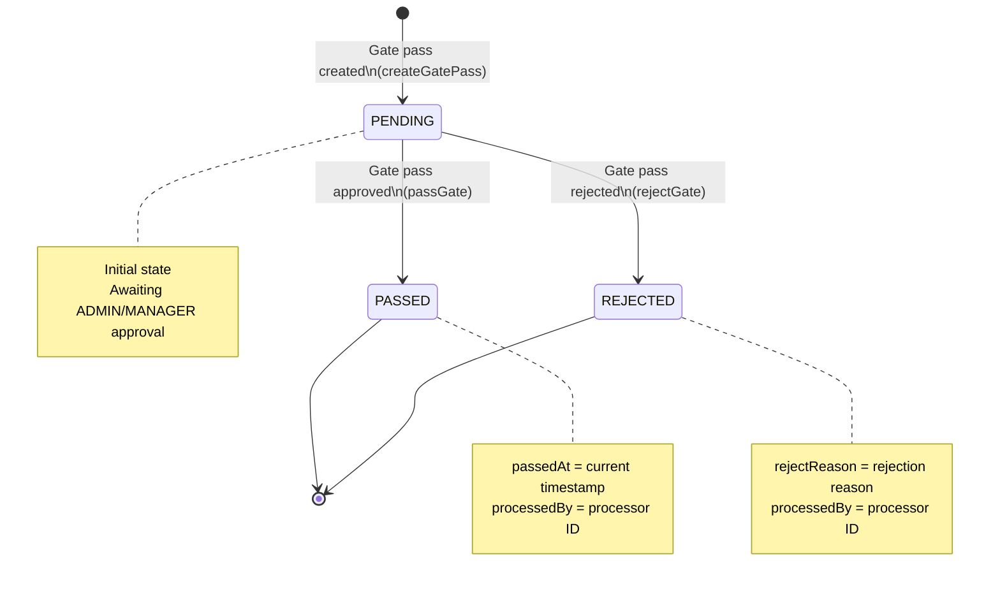

### 4.2 Service Method Details

#### createGatePass(GatePassCreateRequest)

1. Creates the entity using `GatePass.builder()`.
2. Within the constructor, `passStatus` is initialized to `PENDING`.
3. Persists the entity using `gatePassRepository.save()`.
4. Returns the response DTO via `GatePassResponse.from()`.
5. INFO log: `Gate pass registered: gatePassId={}, weighingId={}`

#### getGatePass(Long gatePassId)

1. Retrieves the gate pass using `findById()`. If not found, throws `BusinessException(MASTER_001)`.
2. Returns the response DTO via `GatePassResponse.from()`.

#### getGatePassesByStatus(GatePassStatus, Pageable)

1. Performs a paginated query by status using `gatePassRepository.findByPassStatus()`.
2. Returns the result mapped as `Page<GatePassResponse>`.

#### passGate(Long gatePassId, Long processedBy)

1. Retrieves the gate pass using `findById()`.
2. Calls `gatePass.pass(processedBy)`.
   - Changes `passStatus` to `PASSED`.
   - Sets `passedAt` to the current timestamp.
   - Records `processedBy`.
3. The update is automatically persisted via JPA dirty checking.
4. INFO log: `Gate pass approved: gatePassId={}, processedBy={}`

#### rejectGate(Long gatePassId, String reason, Long processedBy)

1. Retrieves the gate pass using `findById()`.
2. Calls `gatePass.reject(processedBy, reason)`.
   - Changes `passStatus` to `REJECTED`.
   - Records `processedBy`.
   - Records the rejection reason in `rejectReason`.
3. The update is automatically persisted via JPA dirty checking.
4. INFO log: `Gate pass rejected: gatePassId={}, reason={}, processedBy={}`

### 4.3 Transaction Policy

| Method | Transaction | Description |
|--------|-------------|-------------|
| `createGatePass` | `@Transactional` | Write transaction |
| `getGatePass` | `@Transactional(readOnly=true)` | Read-only (class-level) |
| `getGatePassesByStatus` | `@Transactional(readOnly=true)` | Read-only (class-level) |
| `passGate` | `@Transactional` | Write transaction |
| `rejectGate` | `@Transactional` | Write transaction |

---

## 5. Module Overview - Electronic Weighing Slip (Slip)

### 5.1 Purpose

The Electronic Weighing Slip module manages the documentary evidence issued after weighing is completed. It generates electronic documents containing vehicle plate number, company name, item name, gross weight/tare weight/net weight information, and supports external sharing via KakaoTalk, SMS, and other channels.

### 5.2 Core Features

| Feature | Description | Notes |
|---------|-------------|-------|
| Slip Creation | Automatically issues an electronic weighing slip upon weighing completion | Internal service call |
| Slip Inquiry | Single record lookup by ID, slip number, or weighing ID | Multiple query paths |
| Period-based Search | Paginated query filtered by start date to end date | Date range is nullable |
| Slip Sharing | External sharing via KakaoTalk, SMS, email, etc. | Sharing history is recorded |

### 5.3 Package Structure

```
com.dongkuk.weighing.slip/
├── domain/
│   ├── WeighingSlip.java              # Electronic weighing slip entity
│   └── WeighingSlipRepository.java    # Slip repository interface
├── service/
│   └── WeighingSlipService.java       # Slip business service
├── controller/
│   └── WeighingSlipController.java    # REST API controller
└── dto/
    ├── SlipResponse.java              # Response DTO
    └── SlipShareRequest.java          # Share request DTO
```

---

## 6. Slip Domain Model

### 6.1 Class Diagram

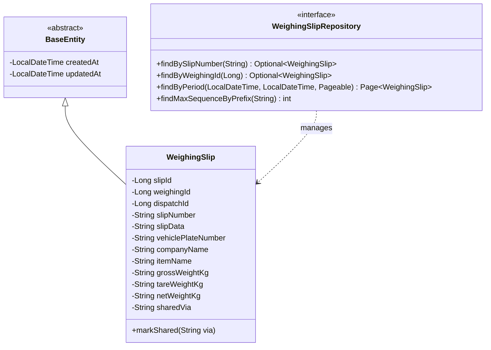

### 6.2 Entity Field Details

| Field | Type | Column Name | Constraints | Description |
|-------|------|-------------|-------------|-------------|
| `slipId` | Long | `slip_id` | PK, AUTO_INCREMENT | Slip unique identifier |
| `weighingId` | Long | `weighing_id` | NOT NULL, INDEX | Associated weighing record ID |
| `dispatchId` | Long | `dispatch_id` | NOT NULL | Associated dispatch ID |
| `slipNumber` | String | `slip_number` | NOT NULL, UNIQUE, VARCHAR(30), INDEX | Slip number (yyyyMMdd-NNNN) |
| `slipData` | String | `slip_data` | NOT NULL, TEXT | Slip data (JSON) |
| `vehiclePlateNumber` | String | `vehicle_plate_number` | NULLABLE, VARCHAR(20) | Vehicle plate number |
| `companyName` | String | `company_name` | NULLABLE, VARCHAR(100) | Company name |
| `itemName` | String | `item_name` | NULLABLE, VARCHAR(100) | Item name |
| `grossWeightKg` | String | `gross_weight_kg` | NULLABLE, VARCHAR(20) | Gross weight (display string) |
| `tareWeightKg` | String | `tare_weight_kg` | NULLABLE, VARCHAR(20) | Tare weight (display string) |
| `netWeightKg` | String | `net_weight_kg` | NULLABLE, VARCHAR(20) | Net weight (display string) |
| `sharedVia` | String | `shared_via` | NULLABLE, VARCHAR(20) | Sharing method (KAKAO, EMAIL, SMS) |
| `createdAt` | LocalDateTime | `created_at` | NOT NULL (BaseEntity) | Creation timestamp |
| `updatedAt` | LocalDateTime | `updated_at` | NOT NULL (BaseEntity) | Last updated timestamp |

### 6.3 Slip Number Generation Rules

The slip number is sequentially assigned daily in the format `yyyyMMdd-NNNN`.

- Prefix: Generated from the current date in `yyyyMMdd` format (e.g., `20260129-`)
- Sequence: Maximum sequence among slips issued on the same day + 1
- Digit count: The sequence is zero-padded to 4 digits (e.g., `0001`)
- Examples: `20260129-0001`, `20260129-0002`, ...

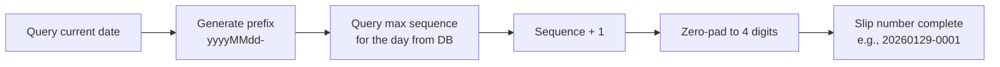

---

## 7. Slip API Design

### 7.1 Endpoint List

| Method | Path | Description | Notes |
|--------|------|-------------|-------|
| `GET` | `/api/v1/slips/{slipId}` | Retrieve slip by ID | |
| `GET` | `/api/v1/slips/number/{slipNumber}` | Retrieve slip by slip number | |
| `GET` | `/api/v1/slips/weighing/{weighingId}` | Retrieve slip by weighing ID | |
| `GET` | `/api/v1/slips` | List slips by period | Pagination supported |
| `POST` | `/api/v1/slips/{slipId}/share` | Share a slip | |

> Note: Slip creation (createSlip) is not exposed as a REST API. It is invoked internally within the service upon weighing completion.

### 7.2 Retrieve Slip by ID

**Request**

```http
GET /api/v1/slips/1
Authorization: Bearer {access_token}
```

**Response (200 OK)**

```json
{
  "success": true,
  "data": {
    "slip_id": 1,
    "weighing_id": 42,
    "dispatch_id": 15,
    "slip_number": "20260129-0001",
    "vehicle_plate_number": "12ga3456",
    "company_name": "Dongkuk Logistics",
    "item_name": "Rebar",
    "gross_weight_kg": "45200",
    "tare_weight_kg": "15100",
    "net_weight_kg": "30100",
    "shared_via": null,
    "created_at": "2026-01-29T10:35:00"
  },
  "error": null
}
```

### 7.3 Retrieve Slip by Slip Number

**Request**

```http
GET /api/v1/slips/number/20260129-0001
Authorization: Bearer {access_token}
```

**Response**: Same format as 7.2.

### 7.4 Retrieve Slip by Weighing ID

**Request**

```http
GET /api/v1/slips/weighing/42
Authorization: Bearer {access_token}
```

**Response**: Same format as 7.2.

### 7.5 List Slips by Period

**Request**

```http
GET /api/v1/slips?date_from=2026-01-01&date_to=2026-01-29&page=0&size=20
Authorization: Bearer {access_token}
```

- Both `date_from` and `date_to` are optional parameters. If omitted, all records are returned.
- `date_from` includes from 00:00:00 of the specified date, and `date_to` includes up to 23:59:59 of the specified date.

**Response (200 OK)**

```json
{
  "success": true,
  "data": {
    "content": [
      {
        "slip_id": 1,
        "weighing_id": 42,
        "dispatch_id": 15,
        "slip_number": "20260129-0001",
        "vehicle_plate_number": "12ga3456",
        "company_name": "Dongkuk Logistics",
        "item_name": "Rebar",
        "gross_weight_kg": "45200",
        "tare_weight_kg": "15100",
        "net_weight_kg": "30100",
        "shared_via": "KAKAO",
        "created_at": "2026-01-29T10:35:00"
      }
    ],
    "pageable": { "page_number": 0, "page_size": 20 },
    "total_elements": 1,
    "total_pages": 1
  },
  "error": null
}
```

### 7.6 Share Slip

**Request**

```http
POST /api/v1/slips/1/share
Content-Type: application/json
Authorization: Bearer {access_token}

{
  "type": "KAKAO"
}
```

**Response (200 OK)**

```json
{
  "success": true,
  "data": {
    "slip_id": 1,
    "weighing_id": 42,
    "dispatch_id": 15,
    "slip_number": "20260129-0001",
    "vehicle_plate_number": "12ga3456",
    "company_name": "Dongkuk Logistics",
    "item_name": "Rebar",
    "gross_weight_kg": "45200",
    "tare_weight_kg": "15100",
    "net_weight_kg": "30100",
    "shared_via": "KAKAO",
    "created_at": "2026-01-29T10:35:00"
  },
  "error": null
}
```

### 7.7 Error Responses

| Scenario | HTTP Status | Error Code | Message |
|----------|-------------|------------|---------|
| Slip not found (by ID) | 404 | SLIP_001 | Weighing slip not found |
| Slip not found (by number) | 404 | SLIP_001 | Weighing slip not found |
| Slip not found (by weighing ID) | 404 | SLIP_001 | Weighing slip not found |
| Slip creation for incomplete weighing | 400 | SLIP_002 | Cannot create a weighing slip for an incomplete weighing |
| Missing share type | 400 | - | Validation Error |

---

## 8. Slip Service Logic

### 8.1 Slip Creation Flow

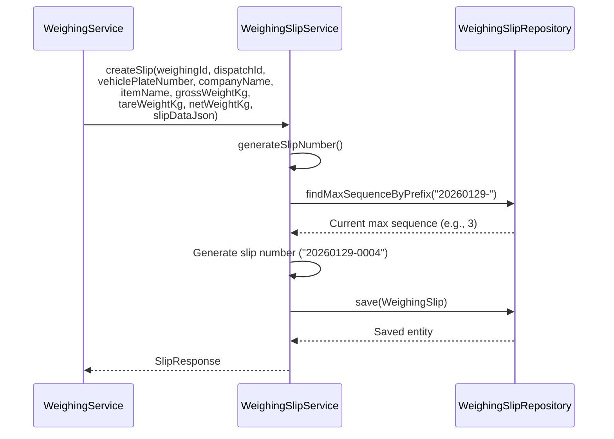

### 8.2 Slip Sharing Flow

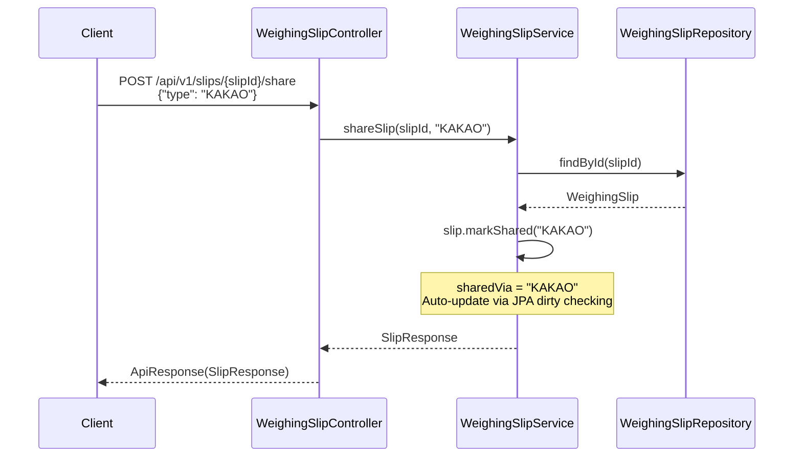

### 8.3 Service Method Details

#### createSlip(...)

1. Generates a daily sequential slip number using `generateSlipNumber()`.
2. Assembles the entity using `WeighingSlip.builder()`.
3. Persists the entity using `slipRepository.save()`.
4. INFO log: `Weighing slip created: slipId={}, slipNumber={}, weighingId={}`
5. Returns the response via `SlipResponse.from()`.

> Note: This method is not exposed as a REST API. It is invoked internally by WeighingService upon weighing completion.

#### getSlip(Long slipId)

1. Retrieves the slip using `findSlipById()`. If not found, throws `BusinessException(SLIP_001)`.
2. Returns the response via `SlipResponse.from()`.

#### getSlipByNumber(String slipNumber)

1. Retrieves the slip using `slipRepository.findBySlipNumber()`.
2. If not found, throws `BusinessException(SLIP_001)`.

#### getSlipByWeighingId(Long weighingId)

1. Retrieves the slip using `slipRepository.findByWeighingId()`.
2. If not found, throws `BusinessException(SLIP_001)`.

#### searchSlips(LocalDate dateFrom, LocalDate dateTo, Pageable)

1. If `dateFrom` is provided, converts it using `dateFrom.atStartOfDay()`.
2. If `dateTo` is provided, converts it using `dateTo.atTime(LocalTime.MAX)`.
3. Performs a paginated query using `slipRepository.findByPeriod()`.

#### shareSlip(Long slipId, String shareType)

1. Retrieves the slip using `findSlipById()`.
2. Calls `slip.markShared(shareType.toUpperCase())`.
3. The update is automatically persisted via JPA dirty checking.
4. INFO log: `Weighing slip shared: slipId={}, via={}`

### 8.4 Transaction Policy

| Method | Transaction | Description |
|--------|-------------|-------------|
| `createSlip` | `@Transactional` | Write transaction |
| `getSlip` | `@Transactional(readOnly=true)` | Read-only (class-level) |
| `getSlipByNumber` | `@Transactional(readOnly=true)` | Read-only (class-level) |
| `getSlipByWeighingId` | `@Transactional(readOnly=true)` | Read-only (class-level) |
| `searchSlips` | `@Transactional(readOnly=true)` | Read-only (class-level) |
| `shareSlip` | `@Transactional` | Write transaction |

---

## 9. DTO Specification

### 9.1 Gate Pass Module DTOs

#### GatePassCreateRequest

Request DTO for creating a new gate pass (Java Record).

| Field | Type | Required | Validation | Description |
|-------|------|----------|------------|-------------|
| `weighingId` | Long | Yes | `@NotNull` | Weighing record ID |
| `dispatchId` | Long | Yes | `@NotNull` | Dispatch ID |

#### GatePassRejectRequest

Request DTO for rejecting a gate pass (Java Record).

| Field | Type | Required | Validation | Description |
|-------|------|----------|------------|-------------|
| `reason` | String | Yes | `@NotBlank` | Rejection reason (blank string not allowed) |

#### GatePassResponse

Response DTO for gate pass (Java Record). Created via the static factory method `GatePassResponse.from(GatePass)`.

| Field | Type | Nullable | JSON Key | Description |
|-------|------|----------|----------|-------------|
| `gatePassId` | Long | N | `gate_pass_id` | Gate pass ID |
| `weighingId` | Long | N | `weighing_id` | Weighing record ID |
| `dispatchId` | Long | N | `dispatch_id` | Dispatch ID |
| `passStatus` | String | N | `pass_status` | Status (PENDING/PASSED/REJECTED) |
| `passedAt` | LocalDateTime | Y | `passed_at` | Passage date and time |
| `processedBy` | Long | Y | `processed_by` | Processor user ID |
| `rejectReason` | String | Y | `reject_reason` | Rejection reason |
| `createdAt` | LocalDateTime | N | `created_at` | Creation timestamp |

### 9.2 Slip Module DTOs

#### SlipResponse

Response DTO for electronic weighing slip (Java Record). Created via the static factory method `SlipResponse.from(WeighingSlip)`.

| Field | Type | Nullable | JSON Key | Description |
|-------|------|----------|----------|-------------|
| `slipId` | Long | N | `slip_id` | Slip ID |
| `weighingId` | Long | N | `weighing_id` | Weighing record ID |
| `dispatchId` | Long | N | `dispatch_id` | Dispatch ID |
| `slipNumber` | String | N | `slip_number` | Slip number (yyyyMMdd-NNNN) |
| `vehiclePlateNumber` | String | Y | `vehicle_plate_number` | Vehicle plate number |
| `companyName` | String | Y | `company_name` | Company name |
| `itemName` | String | Y | `item_name` | Item name |
| `grossWeightKg` | String | Y | `gross_weight_kg` | Gross weight (display string) |
| `tareWeightKg` | String | Y | `tare_weight_kg` | Tare weight (display string) |
| `netWeightKg` | String | Y | `net_weight_kg` | Net weight (display string) |
| `sharedVia` | String | Y | `shared_via` | Sharing method (KAKAO/SMS/EMAIL) |
| `createdAt` | LocalDateTime | N | `created_at` | Creation timestamp |

#### SlipShareRequest

Request DTO for sharing an electronic weighing slip (Java Record).

| Field | Type | Required | Validation | Description |
|-------|------|----------|------------|-------------|
| `type` | String | Yes | `@NotBlank` | Sharing method (EMAIL, SMS, KAKAO, etc.) |

### 9.3 Frontend TypeScript Interfaces

#### GatePass

```typescript
export interface GatePass {
  gatePassId: number;
  weighingId: number;
  dispatchId: number;
  passStatus: string;       // "PENDING" | "PASSED" | "REJECTED"
  passedAt?: string;        // ISO 8601
  processedBy?: number;
  rejectReason?: string;
  createdAt: string;         // ISO 8601
}
```

#### WeighingSlip

```typescript
export interface WeighingSlip {
  slipId: number;
  weighingId: number;
  dispatchId: number;
  slipNumber: string;
  vehiclePlateNumber?: string;
  companyName?: string;
  itemName?: string;
  grossWeightKg?: number;
  tareWeightKg?: number;
  netWeightKg?: number;
  sharedVia?: string;
  createdAt: string;         // ISO 8601
}
```

### 9.4 Mobile Dart Models

#### GatePass (Mobile)

The mobile model differs from the backend in some respects. Mobile-specific fields (passNumber, vehicleNumber, driverName, type, expiresAt) are added, and the status enum also uses mobile-specific extended statuses (issued, used, expired, cancelled).

| Field | Type | Description |
|-------|------|-------------|
| `id` | String | Gate pass ID |
| `passNumber` | String | Gate pass number |
| `dispatchId` | String | Dispatch ID |
| `vehicleNumber` | String | Vehicle number |
| `driverName` | String | Driver name |
| `type` | GatePassType | Type (entry/exit) |
| `status` | GatePassStatus | Status (issued/used/expired/cancelled) |
| `issuedAt` | DateTime | Issuance date and time |
| `usedAt` | DateTime? | Usage date and time |
| `expiresAt` | DateTime? | Expiration date and time |

#### WeighingSlip (Mobile)

The mobile-specific model contains richer information than the backend response. It includes first/second weighing times, scale information, operator, and route information.

| Field | Type | Description |
|-------|------|-------------|
| `id` | String | Slip ID |
| `slipNumber` | String | Slip number |
| `dispatchId` | String | Dispatch ID |
| `dispatchNumber` | String | Dispatch number |
| `vehicleNumber` | String | Vehicle number |
| `driverName` | String | Driver name |
| `companyName` | String | Company name |
| `itemName` | String | Item name |
| `itemCategory` | String? | Item category |
| `firstWeight` | double | First weighing weight (gross weight, kg) |
| `secondWeight` | double | Second weighing weight (tare weight, kg) |
| `netWeight` | double | Net weight (kg) |
| `firstWeighingTime` | DateTime | First weighing time |
| `secondWeighingTime` | DateTime | Second weighing time |
| `scaleId` | String? | Scale ID |
| `scaleName` | String? | Scale name |
| `operatorName` | String? | Operator name |
| `origin` | String? | Origin |
| `destination` | String? | Destination |
| `memo` | String? | Memo |
| `isShared` | bool | Whether shared |
| `createdAt` | DateTime | Creation timestamp |

---

## 10. Frontend Screen Design

### 10.1 Gate Pass Management Page (GatePassPage)

**File**: `frontend/src/pages/GatePassPage.tsx`

#### Screen Layout

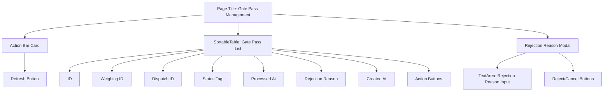

#### Table Column Definitions

| Column Name | dataIndex | Width | Rendering |
|-------------|-----------|-------|-----------|
| ID | `gatePassId` | 80px | Number |
| Weighing ID | `weighingId` | 100px | Number |
| Dispatch ID | `dispatchId` | 100px | Number |
| Status | `passStatus` | 90px | Tag component (colors: Pending=yellow, Passed=green, Rejected=red) |
| Processed At | `passedAt` | 160px | Date format (YYYY-MM-DD HH:mm) or `-` |
| Rejection Reason | `rejectReason` | 130px | Text or `-` |
| Created At | `createdAt` | 160px | Date format (YYYY-MM-DD HH:mm) |
| Actions | - | 160px | PENDING status only: Approve (Popconfirm) / Reject buttons |

#### Status Color Mapping

| Status | Label | Color |
|--------|-------|-------|
| `PENDING` | Pending | `colors.warning` (yellow) |
| `PASSED` | Passed | `colors.success` (green) |
| `REJECTED` | Rejected | `colors.error` (red) |

#### User Interactions

1. **Page Entry**: Automatically fetches the gate pass list via `GET /gate-passes?size=20`.
2. **Approval Processing**: Clicking the "Approve" button triggers a Popconfirm dialog, then calls `PUT /gate-passes/{id}/pass`.
3. **Rejection Processing**: Clicking the "Reject" button opens a modal. After entering the reason, calls `PUT /gate-passes/{id}/reject`. The reason is a required field.
4. **Refresh**: Clicking the button re-fetches the list.

### 10.2 Electronic Weighing Slip Management Page (SlipPage)

**File**: `frontend/src/pages/SlipPage.tsx`

#### Screen Layout

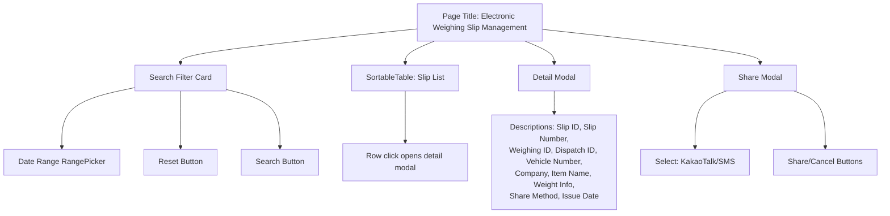

#### Table Column Definitions

| Column Name | dataIndex | Width | Align | Rendering |
|-------------|-----------|-------|-------|-----------|
| ID | `slipId` | 80px | Left | Number |
| Slip Number | `slipNumber` | 120px | Left | Text |
| Vehicle Number | `vehiclePlateNumber` | 110px | Left | Text or `-` |
| Company | `companyName` | 100px | Left | Text or `-` |
| Item Name | `itemName` | 100px | Left | Text or `-` |
| Gross Weight (kg) | `grossWeightKg` | 120px | Right | Locale-formatted number |
| Tare Weight (kg) | `tareWeightKg` | 130px | Right | Locale-formatted number |
| Net Weight (kg) | `netWeightKg` | 120px | Right | **Emphasized** (primary color, bold) |
| Shared | `sharedVia` | 80px | Left | Tag or `-` |
| Issue Date | `createdAt` | 160px | Left | Date format |
| Share | - | 80px | Left | Share button |

#### Detail Modal (Descriptions)

When a row is clicked, the following items are displayed using the `Descriptions` component (bordered, 2-column, small size):

- Slip ID, Slip Number, Weighing ID, Dispatch ID
- Vehicle Number, Company, Item Name
- Gross Weight (kg), Tare Weight (kg), Net Weight (kg) - Net weight is emphasized in primary color
- Share Method (Tag component), Issue Date

#### Share Modal

- A `Select` component is used to choose the sharing method.
- Available options: KakaoTalk (KAKAO), SMS
- Clicking the "Share" button calls `POST /slips/{slipId}/share`.

#### Search Filters

- Date filter: Select a date range (start date to end date) using Ant Design `RangePicker`.
- Reset button: Resets the date filter to null.
- Search button: Calls `GET /slips` with `dateFrom` and `dateTo` parameters.

---

## 11. Mobile Screen Design

### 11.1 Slip List Screen (SlipListScreen)

**File**: `mobile/lib/screens/slip/slip_list_screen.dart`

#### Screen Structure

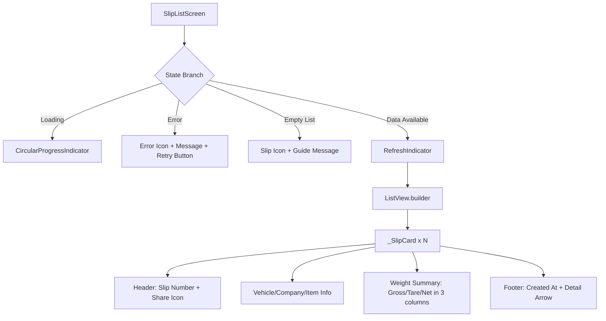

#### Key Behaviors

1. **Initial Load**: In `initState()`, calls `DispatchProvider.fetchSlips()` based on today's date (`yyyy-MM-dd`).
2. **Pull-to-Refresh**: Supports pull-to-refresh via `RefreshIndicator`.
3. **Card Tap**: Tapping a card navigates to `SlipDetailScreen`, passing the `slipId`.

#### _SlipCard Components

| Area | Content | Style |
|------|---------|-------|
| Header | Slip icon + Slip number + Share status icon | `titleMedium`, primary color icon |
| Info Rows | Vehicle number, Company name, Item name (each with icon) | `bodyMedium` |
| Weight Summary | Gross weight / Tare / Net weight (3 columns with dividers) | Net weight only: bold + primary color |
| Footer | Clock icon + Created timestamp + Detail arrow | `bodySmall`, secondary color |

### 11.2 Slip Detail Screen (SlipDetailScreen)

**File**: `mobile/lib/screens/slip/slip_detail_screen.dart`

#### Screen Structure

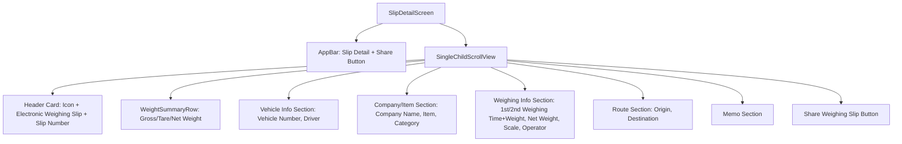

#### Share Feature

When the share button is tapped, a `BottomSheet` is displayed with three sharing options.

| Method | Icon Color | Description | Implementation |
|--------|------------|-------------|----------------|
| KakaoTalk | `#FEE500` (Kakao yellow) | Share via KakaoTalk | Server API call (`shareSlip(type: "KAKAO")`) |
| SMS | `#06B6D4` (Cyan) | Share via text message | Server API call (`shareSlip(type: "SMS")`) |
| Other | `#334155` (Dark slate) | Share via other apps | OS share sheet via `share_plus` package |

#### System Share Text Format

If the server API share fails, it falls back to the OS system share. The shared text format:

```text
[Busan Smart Weighing] Weighing Slip

Slip Number: {slipNumber}
Dispatch Number: {dispatchNumber}
Vehicle Number: {vehicleNumber}
Driver: {driverName}
Company: {companyName}
Item: {itemName}

Gross Weight: {firstWeight} kg
Tare Weight: {secondWeight} kg
Net Weight: {netWeight} kg

1st Weighing: {firstWeighingTime}
2nd Weighing: {secondWeighingTime}
```

#### Detail Information Sections

| Section | Displayed Items | Conditional Display |
|---------|----------------|---------------------|
| Header Card | Icon, "Electronic Weighing Slip" title, Slip number | Always |
| Weight Summary | Gross weight, Tare weight, Net weight (3 columns) | Always |
| Vehicle Info | Vehicle number, Driver | Always |
| Company/Item | Company name, Item name, Category | Category shown only when `itemCategory != null` |
| Weighing Info | 1st/2nd weighing time+weight, Net weight (emphasized), Scale, Operator | Scale/Operator shown only when not null |
| Route | Origin, Destination | Shown only when `origin` or `destination` is not null |
| Memo | Memo content | Shown only when `memo != null && memo.isNotEmpty` |

---

## 12. Database Design

### 12.1 Table Definitions

#### tb_gate_pass (Gate Pass)

```sql
CREATE TABLE tb_gate_pass (
    gate_pass_id    BIGSERIAL       PRIMARY KEY,
    weighing_id     BIGINT          NOT NULL,
    dispatch_id     BIGINT          NOT NULL,
    pass_status     VARCHAR(20)     NOT NULL,
    passed_at       TIMESTAMP,
    processed_by    BIGINT,
    reject_reason   VARCHAR(255),
    created_at      TIMESTAMP       NOT NULL,
    updated_at      TIMESTAMP       NOT NULL
);

-- Indexes
CREATE INDEX idx_gatepass_weighing ON tb_gate_pass(weighing_id);
CREATE INDEX idx_gatepass_status   ON tb_gate_pass(pass_status);
```

#### tb_weighing_slip (Electronic Weighing Slip)

```sql
CREATE TABLE tb_weighing_slip (
    slip_id                 BIGSERIAL       PRIMARY KEY,
    weighing_id             BIGINT          NOT NULL,
    dispatch_id             BIGINT          NOT NULL,
    slip_number             VARCHAR(30)     NOT NULL UNIQUE,
    slip_data               TEXT            NOT NULL,
    vehicle_plate_number    VARCHAR(20),
    company_name            VARCHAR(100),
    item_name               VARCHAR(100),
    gross_weight_kg         VARCHAR(20),
    tare_weight_kg          VARCHAR(20),
    net_weight_kg           VARCHAR(20),
    shared_via              VARCHAR(20),
    created_at              TIMESTAMP       NOT NULL,
    updated_at              TIMESTAMP       NOT NULL
);

-- Indexes
CREATE UNIQUE INDEX idx_slip_number   ON tb_weighing_slip(slip_number);
CREATE INDEX idx_slip_weighing        ON tb_weighing_slip(weighing_id);
```

### 12.2 ER Diagram

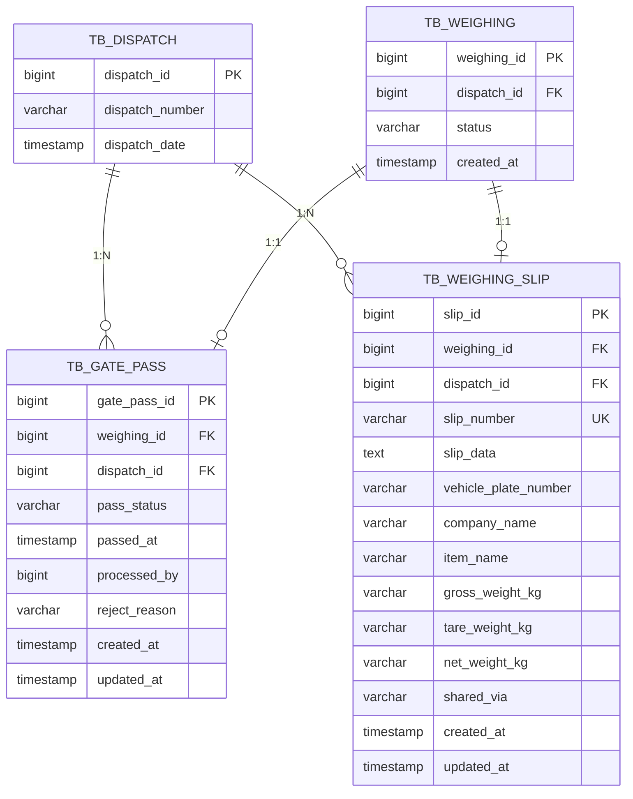

### 12.3 Index Strategy

| Table | Index Name | Column | Type | Purpose |
|-------|-----------|--------|------|---------|
| `tb_gate_pass` | `idx_gatepass_weighing` | `weighing_id` | Normal | Gate pass lookup by weighing ID |
| `tb_gate_pass` | `idx_gatepass_status` | `pass_status` | Normal | Gate pass list query by status |
| `tb_weighing_slip` | `idx_slip_number` | `slip_number` | Unique | Slip number lookup and uniqueness guarantee |
| `tb_weighing_slip` | `idx_slip_weighing` | `weighing_id` | Normal | Slip lookup by weighing ID |

---

## 13. Inter-Module Integration

### 13.1 Position Within the Overall Business Flow

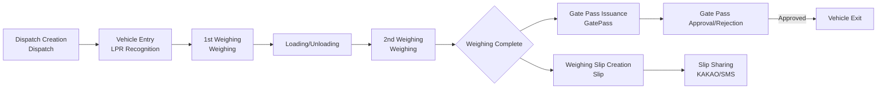

### 13.2 Module Dependencies

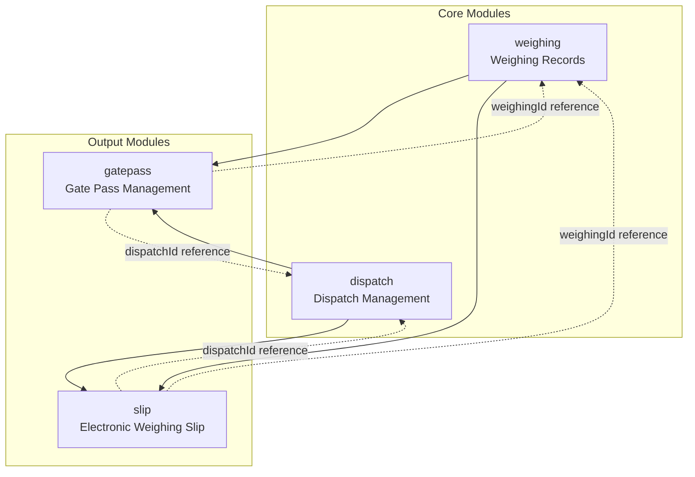

### 13.3 Integration Relationship Details

| Source Module | Target Module | Integration Method | Description |
|---------------|---------------|-------------------|-------------|
| Weighing | GatePass | `weighingId` FK | Passes the weighing ID when creating a gate pass after weighing completion |
| Weighing | Slip | Internal service call | Calls `WeighingSlipService.createSlip()` upon weighing completion |
| Dispatch | GatePass | `dispatchId` FK | Links dispatch information to the gate pass |
| Dispatch | Slip | `dispatchId` FK | Links dispatch information to the slip |
| GatePass | - | Independent processing | Gate pass approval/rejection is processed independently |
| Slip | - | Independent processing | Slip inquiry/sharing is processed independently |

### 13.4 Relationship Between GatePass and Slip

The gate pass (GatePass) and the electronic weighing slip (Slip) are linked to the same weighing record (WeighingRecord) and dispatch (Dispatch), but do not have a direct reference relationship to each other. Both modules are created independently by the same event: weighing completion.

| Aspect | GatePass | Slip |
|--------|----------|------|
| Role | Vehicle exit control document | Weighing result evidentiary document |
| Creation Timing | After weighing completion | After weighing completion |
| Creation Method | REST API (POST) | Internal service call |
| Status Management | PENDING -> PASSED/REJECTED | No status (valid immediately upon issuance) |
| Cross-reference | None | None |
| Common Keys | weighingId, dispatchId | weighingId, dispatchId |

---

## 14. Business Rules Summary

### 14.1 Gate Pass Management (GatePass) Rules

| No. | Rule | Description |
|-----|------|-------------|
| GP-01 | Gate passes can only be issued for completed weighing records | weighingId, dispatchId required |
| GP-02 | The initial status of a gate pass must always be PENDING | Enforced within the constructor |
| GP-03 | Gate pass approval/rejection can only be performed by ADMIN or MANAGER | `@PreAuthorize("hasAnyRole('ADMIN', 'MANAGER')")` |
| GP-04 | Upon approval, the passage time (passedAt) and processor (processedBy) are recorded | `LocalDateTime.now()` + authenticated user ID |
| GP-05 | Upon rejection, the rejection reason (reason) is a required input | `@NotBlank` validation |
| GP-06 | Upon rejection, the processor (processedBy) and rejection reason (rejectReason) are recorded | For audit trail |
| GP-07 | The default filter for status-based list queries is PENDING | Unprocessed records shown first |
| GP-08 | State transitions are only possible from PENDING to either PASSED or REJECTED | Unidirectional state flow |

### 14.2 Electronic Weighing Slip (Slip) Rules

| No. | Rule | Description |
|-----|------|-------------|
| SL-01 | Slip numbers are sequentially assigned daily in yyyyMMdd-NNNN format | DB max sequence + 1 |
| SL-02 | Slip numbers must be unique across the entire system | UNIQUE constraint |
| SL-03 | Slip creation is not exposed as a REST API; it is invoked internally within the service only | Auto-generated upon weighing completion |
| SL-04 | Slip data (slipData) stores the full weighing evidence information in JSON format | TEXT column |
| SL-05 | Denormalized fields (vehicle number, company name, item name, weights) are maintained for query convenience | Enables list display without separate JOINs |
| SL-06 | When sharing, the sharing method (sharedVia) is recorded in uppercase | `toUpperCase()` applied |
| SL-07 | For period searches, dateFrom is converted to the start of the day (00:00:00), and dateTo is converted to the end of the day (23:59:59) | `atStartOfDay()`, `atTime(LocalTime.MAX)` |
| SL-08 | Slips cannot be created for incomplete weighing records | ErrorCode.SLIP_002 |
| SL-09 | Slip sharing records only the most recent sharing method (overwrite) | Previous value replaced when `markShared()` is called |

### 14.3 Common Rules

| No. | Rule | Applies To |
|-----|------|------------|
| CM-01 | All entities inherit from BaseEntity for automatic createdAt/updatedAt management | GatePass, WeighingSlip |
| CM-02 | All API responses use the ApiResponse wrapper | All modules |
| CM-03 | JSON field names use snake_case (Jackson configuration) | All modules |
| CM-04 | Date/time values are serialized in ISO 8601 format | All modules |
| CM-05 | Accessing non-existent resources throws a BusinessException | GatePass(MASTER_001), Slip(SLIP_001) |
| CM-06 | Service classes apply class-level @Transactional(readOnly=true), with individual @Transactional specified only for write methods | GatePassService, WeighingSlipService |

---

*End of document*
