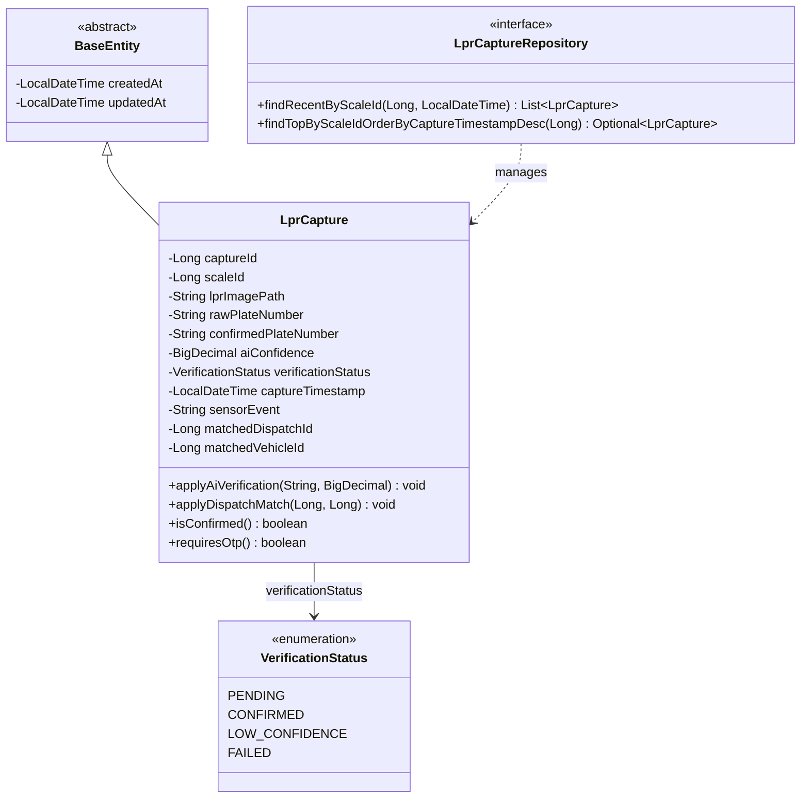
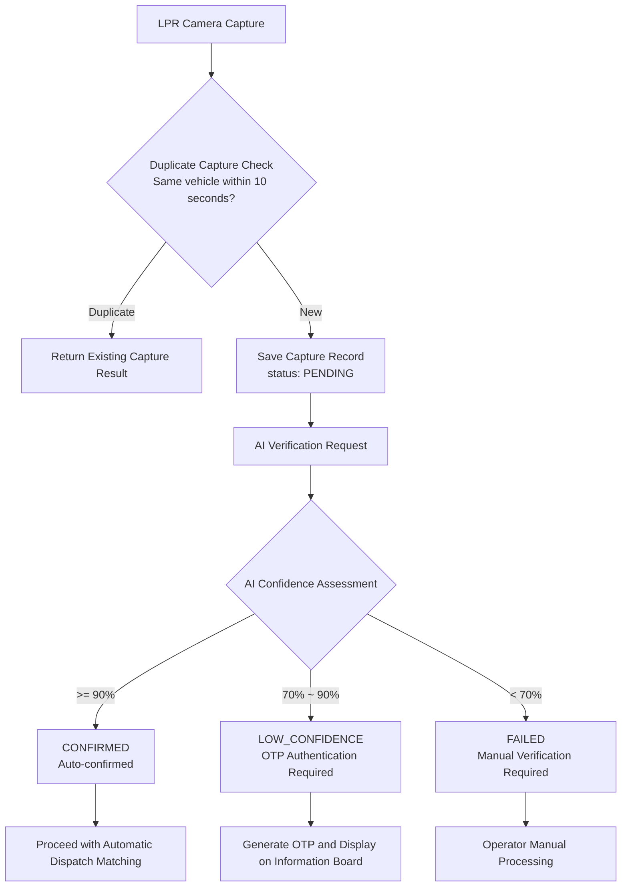
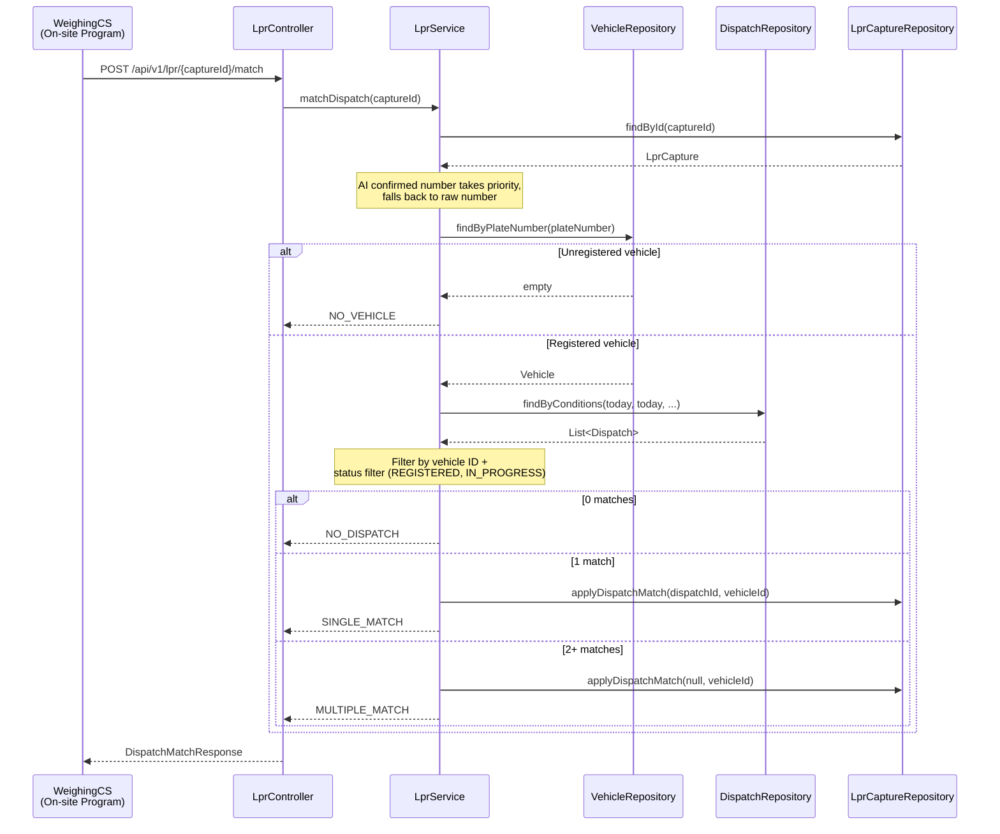
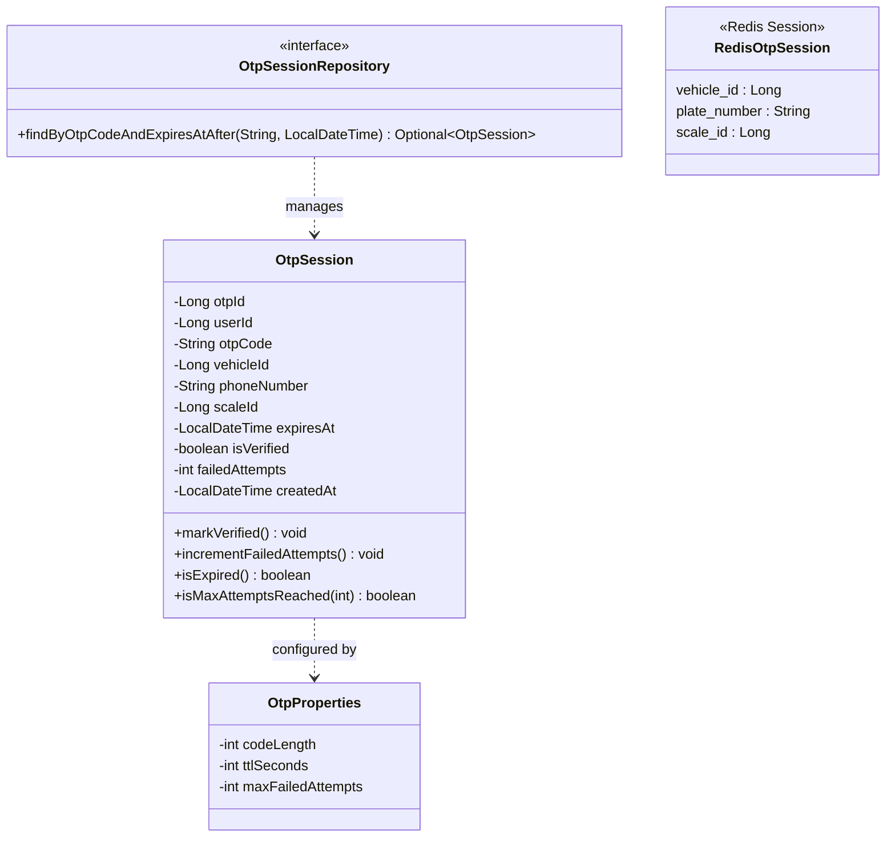
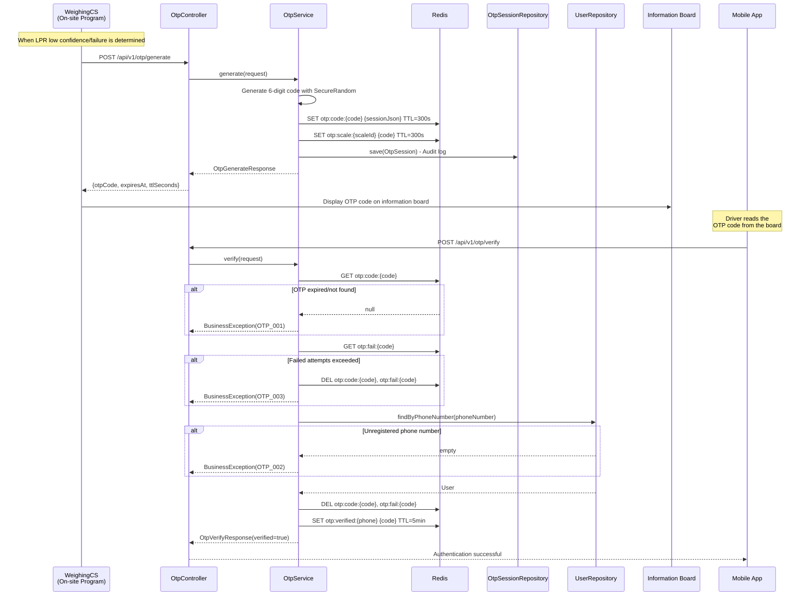
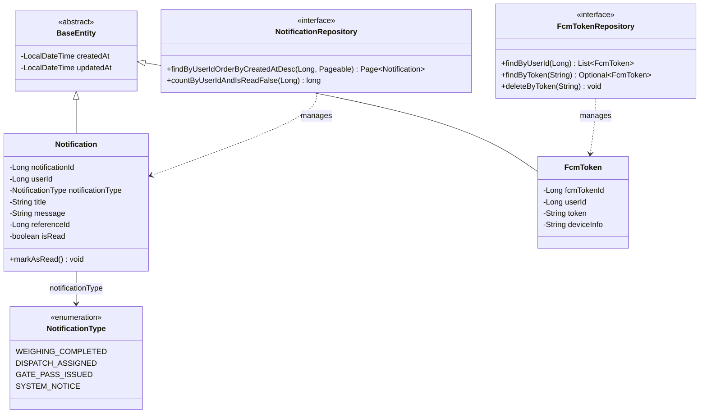
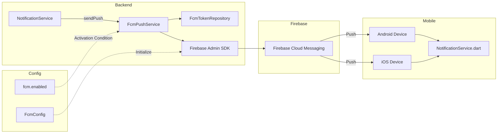
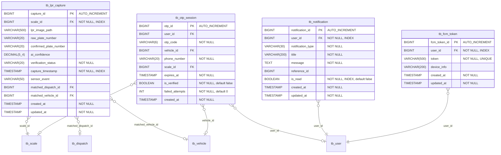
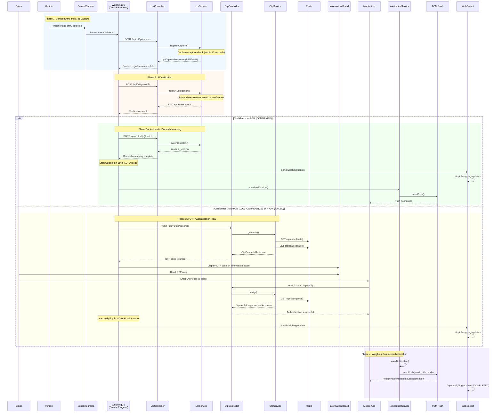

# LPR / OTP / Notification Module Detailed Design Document

| Item | Description |
|------|-------------|
| **Document Version** | 1.0 |
| **Date** | 2026-01-29 |
| **Project** | Busan Smart Weighing System |
| **Target Modules** | LPR (License Plate Recognition), OTP (One-Time Password), Notification |
| **Package Paths** | `com.dongkuk.weighing.lpr`, `com.dongkuk.weighing.otp`, `com.dongkuk.weighing.notification`, `com.dongkuk.weighing.websocket` |

---

## Table of Contents

1. [LPR Module Overview](#1-lpr-module-overview)
2. [LPR Domain Model](#2-lpr-domain-model)
3. [LPR API Design](#3-lpr-api-design)
4. [LPR Service Logic](#4-lpr-service-logic)
5. [OTP Module Overview](#5-otp-module-overview)
6. [OTP Domain Model](#6-otp-domain-model)
7. [OTP API Design](#7-otp-api-design)
8. [OTP Service Logic](#8-otp-service-logic)
9. [Notification Module Overview](#9-notification-module-overview)
10. [Notification Domain Model](#10-notification-domain-model)
11. [Notification API Design](#11-notification-api-design)
12. [FCM Push Notification Service](#12-fcm-push-notification-service)
13. [WebSocket Real-Time Notifications](#13-websocket-real-time-notifications)
14. [DTO Specifications](#14-dto-specifications)
15. [Database Design](#15-database-design)
16. [Integrated Sequence Diagram](#16-integrated-sequence-diagram)
17. [Business Rules Summary](#17-business-rules-summary)

---

## 1. LPR Module Overview

### 1.1 Purpose

The LPR (License Plate Recognition) module captures license plates of vehicles entering the weighbridge using cameras and automatically extracts vehicle numbers through an AI-based recognition engine. Based on the recognized vehicle number, it automatically matches the day's dispatch information, enabling the weighing process to begin without manual input from the driver.

### 1.2 Key Features

| Feature | Description |
|---------|-------------|
| LPR Capture Registration | Registers images captured by the weighbridge camera along with the raw recognition results |
| AI Verification | Applies the AI model's analysis results (confirmed plate number, confidence score) to the capture record |
| Automatic Dispatch Matching | Looks up the vehicle master data using the recognized plate number and matches it against the day's valid dispatches |
| Duplicate Capture Prevention | Blocks duplicate captures of the same vehicle at the same weighbridge within 10 seconds |
| Capture History Retrieval | Provides single-record retrieval and latest record retrieval per weighbridge |

### 1.3 Module Structure

```
com.dongkuk.weighing.lpr/
├── controller/
│   └── LprController.java           # REST API endpoints
├── service/
│   └── LprService.java              # Business logic
├── domain/
│   ├── LprCapture.java              # Capture record entity
│   ├── VerificationStatus.java      # Verification status enum
│   └── LprCaptureRepository.java    # Data access layer
└── dto/
    ├── LprCaptureRequest.java        # Capture registration request DTO
    ├── LprCaptureResponse.java       # Capture result response DTO
    ├── AiVerificationRequest.java    # AI verification request DTO
    └── DispatchMatchResponse.java    # Dispatch match result response DTO
```

### 1.4 External Dependencies

- `dispatch` module: References `DispatchRepository` and `DispatchStatus` for dispatch matching
- `master` module: References `VehicleRepository` for vehicle lookup by plate number
- `global` module: `BaseEntity` (audit fields), `ApiResponse` (common response), `BusinessException` (exception handling)

---

## 2. LPR Domain Model

### 2.1 Class Diagram



### 2.2 LprCapture Entity

The core domain entity that manages license plate recognition results captured by LPR cameras.

| Field | Type | DB Column | Constraints | Description |
|-------|------|-----------|-------------|-------------|
| `captureId` | `Long` | `capture_id` | PK, AUTO_INCREMENT | Capture record unique ID |
| `scaleId` | `Long` | `scale_id` | NOT NULL, INDEX | Weighbridge ID where the capture occurred |
| `lprImagePath` | `String` | `lpr_image_path` | VARCHAR(500) | Captured image storage path |
| `rawPlateNumber` | `String` | `raw_plate_number` | VARCHAR(20) | AI raw recognized plate number |
| `confirmedPlateNumber` | `String` | `confirmed_plate_number` | VARCHAR(20) | AI-verified confirmed plate number |
| `aiConfidence` | `BigDecimal` | `ai_confidence` | DECIMAL(5,4) | AI recognition confidence (0.0000~1.0000) |
| `verificationStatus` | `VerificationStatus` | `verification_status` | NOT NULL, VARCHAR(20) | Verification status |
| `captureTimestamp` | `LocalDateTime` | `capture_timestamp` | NOT NULL, INDEX | Capture date and time |
| `sensorEvent` | `String` | `sensor_event` | VARCHAR(50) | Sensor event type |
| `matchedDispatchId` | `Long` | `matched_dispatch_id` | NULLABLE | Matched dispatch ID |
| `matchedVehicleId` | `Long` | `matched_vehicle_id` | NULLABLE | Matched vehicle ID |
| `createdAt` | `LocalDateTime` | `created_at` | NOT NULL | Created timestamp (BaseEntity) |
| `updatedAt` | `LocalDateTime` | `updated_at` | NOT NULL | Updated timestamp (BaseEntity) |

### 2.3 VerificationStatus Enum

Defines the verification status for AI license plate recognition results. It is automatically determined based on the confidence threshold.

| Value | Name | Confidence Range | Follow-up Action |
|-------|------|------------------|------------------|
| `PENDING` | Pending | - | Initial state before AI verification |
| `CONFIRMED` | Confirmed | 90% or above | Automatic weighing can proceed (LPR_AUTO mode) |
| `LOW_CONFIDENCE` | Low Confidence | 70% to below 90% | OTP authentication required for identity verification |
| `FAILED` | Failed | Below 70% | Manual verification or re-capture required |

### 2.4 Domain Methods

#### `applyAiVerification(String confirmedPlateNumber, BigDecimal aiConfidence)`

Applies the AI verification result to the capture record. The verification status is automatically determined based on the confidence score.

```
Confidence >= 0.90  -->  CONFIRMED      (Auto-confirmed)
Confidence >= 0.70  -->  LOW_CONFIDENCE  (OTP authentication required)
Confidence <  0.70  -->  FAILED          (Manual verification required)
```

#### `applyDispatchMatch(Long dispatchId, Long vehicleId)`

Applies the dispatch matching result to the capture record. For a single match, both the dispatch ID and vehicle ID are recorded; for multiple matches, only the vehicle ID is recorded.

#### `requiresOtp() : boolean`

Determines whether OTP authentication is required. Returns `true` when the status is `LOW_CONFIDENCE` or `FAILED`.

---

## 3. LPR API Design

**Base URL**: `/api/v1/lpr`

### 3.1 Endpoint List

| HTTP | Path | Description | Request | Response |
|------|------|-------------|---------|----------|
| POST | `/capture` | LPR capture registration | `LprCaptureRequest` | `LprCaptureResponse` (201) |
| POST | `/verify` | Apply AI verification result | `AiVerificationRequest` | `LprCaptureResponse` (200) |
| POST | `/{captureId}/match` | Automatic dispatch matching | Path: `captureId` | `DispatchMatchResponse` (200) |
| GET | `/{captureId}` | Single capture record retrieval | Path: `captureId` | `LprCaptureResponse` (200) |
| GET | `/scale/{scaleId}/latest` | Latest capture per weighbridge | Path: `scaleId` | `LprCaptureResponse` (200) |

### 3.2 POST /capture - LPR Capture Registration

Registers the license plate image and recognition result captured by the weighbridge camera.

**Request Body** (`LprCaptureRequest`):

```json
{
  "scale_id": 1,
  "sensor_event": "ENTRY",
  "lpr_image_path": "/images/lpr/2026/01/29/capture_001.jpg",
  "raw_plate_number": "12가3456",
  "capture_timestamp": "2026-01-29T10:30:00"
}
```

**Success Response** (HTTP 201):

```json
{
  "success": true,
  "data": {
    "capture_id": 101,
    "scale_id": 1,
    "lpr_image_path": "/images/lpr/2026/01/29/capture_001.jpg",
    "raw_plate_number": "12가3456",
    "confirmed_plate_number": null,
    "ai_confidence": null,
    "verification_status": "PENDING",
    "capture_timestamp": "2026-01-29T10:30:00",
    "matched_dispatch_id": null,
    "matched_vehicle_id": null,
    "created_at": "2026-01-29T10:30:01"
  },
  "error": null
}
```

### 3.3 POST /verify - Apply AI Verification Result

Applies the AI model's analysis result to the capture record.

**Request Body** (`AiVerificationRequest`):

```json
{
  "capture_id": 101,
  "confirmed_plate_number": "12가3456",
  "ai_confidence": 0.9520
}
```

**Success Response** (HTTP 200):

```json
{
  "success": true,
  "data": {
    "capture_id": 101,
    "scale_id": 1,
    "lpr_image_path": "/images/lpr/2026/01/29/capture_001.jpg",
    "raw_plate_number": "12가3456",
    "confirmed_plate_number": "12가3456",
    "ai_confidence": 0.9520,
    "verification_status": "CONFIRMED",
    "capture_timestamp": "2026-01-29T10:30:00",
    "matched_dispatch_id": null,
    "matched_vehicle_id": null,
    "created_at": "2026-01-29T10:30:01"
  },
  "error": null
}
```

### 3.4 POST /{captureId}/match - Automatic Dispatch Matching

Automatically matches the recognized plate number against the vehicle master and the day's dispatches.

**Success Response** (HTTP 200) - Single match:

```json
{
  "success": true,
  "data": {
    "match_result": "SINGLE_MATCH",
    "vehicle_id": 5,
    "plate_number": "12가3456",
    "dispatches": [
      {
        "dispatch_id": 42,
        "item_type": "STEEL",
        "item_name": "열연코일",
        "dispatch_date": "2026-01-29",
        "status": "REGISTERED"
      }
    ]
  },
  "error": null
}
```

**Match Result Types**:

| match_result | Description | Follow-up Action |
|--------------|-------------|------------------|
| `SINGLE_MATCH` | Single dispatch match succeeded | Dispatch ID + vehicle ID auto-linked, proceed with weighing |
| `MULTIPLE_MATCH` | Multiple dispatch matches | Only vehicle ID linked, operator manually selects the dispatch |
| `NO_DISPATCH` | Vehicle exists but no dispatch for today | Operator verification required |
| `NO_VEHICLE` | Unregistered vehicle | Vehicle registration or manual entry required |

---

## 4. LPR Service Logic

### 4.1 AI Verification Flow



### 4.2 Dispatch Matching Sequence Diagram



### 4.3 Duplicate Capture Prevention Logic

The `LprService.registerCapture` method prevents duplicate captures using the following conditions:

- **Time condition**: Within 10 seconds of the requested capture timestamp
- **Location condition**: Same weighbridge (scaleId)
- **Vehicle condition**: Same raw plate number (rawPlateNumber)
- **Handling**: When a duplicate is detected, no new record is created; the existing capture result is returned instead

```
DUPLICATE_CAPTURE_SECONDS = 10
Query: captureRepository.findRecentByScaleId(scaleId, timestamp - 10 seconds)
Check: recent.stream().anyMatch(rawPlateNumber matches)
```

---

## 5. OTP Module Overview

### 5.1 Purpose

The OTP (One-Time Password) module generates and verifies 6-digit one-time passwords for driver identity verification when the LPR AI recognition confidence is low (LOW_CONFIDENCE or FAILED). When the on-site weighing program (CS) generates an OTP, it is displayed on the information board, and the driver enters the code on the mobile app to authenticate.

### 5.2 Key Features

| Feature | Description |
|---------|-------------|
| OTP Code Generation | Generates a 6-digit numeric code using SecureRandom, stored in Redis with TTL |
| Information Board Display Integration | Stores the current OTP code per weighbridge in Redis for display on the information board |
| OTP Verification | Verifies the driver's identity using the code and phone number entered via the mobile app |
| Failed Attempt Tracking | Automatically invalidates the OTP when the maximum number of failed attempts is exceeded |
| Audit Logging | Maintains OTP issuance history in the database for traceability |

### 5.3 Module Structure

```
com.dongkuk.weighing.otp/
├── controller/
│   └── OtpController.java           # REST API endpoints
├── service/
│   └── OtpService.java              # Business logic
├── config/
│   └── OtpProperties.java           # Configuration property binding
├── domain/
│   ├── OtpSession.java              # OTP session audit entity
│   └── OtpSessionRepository.java    # Data access layer
└── dto/
    ├── OtpGenerateRequest.java       # OTP generation request DTO
    ├── OtpGenerateResponse.java      # OTP generation response DTO
    ├── OtpVerifyRequest.java         # OTP verification request DTO
    └── OtpVerifyResponse.java        # OTP verification response DTO
```

### 5.4 Dual Storage Architecture

The OTP module uses a dual storage architecture with **Redis** (real-time session management) and **RDB** (audit logging).

| Storage | Role | Data | TTL |
|---------|------|------|-----|
| **Redis** | Real-time OTP session management | OTP code, vehicle/weighbridge mapping, failed attempt count | Configurable (default 300 seconds) |
| **PostgreSQL** | Audit log retention | OTP issuance history, verification status, failed attempt count | Permanent |

---

## 6. OTP Domain Model

### 6.1 Class Diagram



### 6.2 OtpSession Entity (DB Audit Log)

| Field | Type | DB Column | Constraints | Description |
|-------|------|-----------|-------------|-------------|
| `otpId` | `Long` | `otp_id` | PK, AUTO_INCREMENT | OTP session unique ID |
| `userId` | `Long` | `user_id` | NULLABLE | Associated user ID (set after verification) |
| `otpCode` | `String` | `otp_code` | NOT NULL, VARCHAR(6) | OTP code (6-digit number) |
| `vehicleId` | `Long` | `vehicle_id` | NULLABLE | Associated vehicle ID |
| `phoneNumber` | `String` | `phone_number` | NOT NULL, VARCHAR(20) | Phone number used for verification |
| `scaleId` | `Long` | `scale_id` | NULLABLE | Associated weighbridge ID |
| `expiresAt` | `LocalDateTime` | `expires_at` | NOT NULL | OTP expiration time |
| `isVerified` | `boolean` | `is_verified` | NOT NULL, default false | Verification completion status |
| `failedAttempts` | `int` | `failed_attempts` | NOT NULL, default 0 | Number of failed verification attempts |
| `createdAt` | `LocalDateTime` | `created_at` | NOT NULL | Created timestamp (JPA Auditing) |

**Indexes**:
- `idx_otp_code_expires`: (`otp_code`, `expires_at`) - Fast lookup for OTP code validity
- `idx_otp_phone`: (`phone_number`) - Phone number-based lookup

### 6.3 Redis Key Structure

| Redis Key Pattern | Purpose | Value Format | TTL |
|-------------------|---------|--------------|-----|
| `otp:code:{otpCode}` | OTP session data | JSON: `{"vehicle_id", "plate_number", "scale_id"}` | `ttlSeconds` |
| `otp:scale:{scaleId}` | Current OTP code per weighbridge | String: OTP code | `ttlSeconds` |
| `otp:fail:{otpCode}` | OTP verification failed attempt count | Integer string | Auto-expire |
| `otp:verified:{phoneNumber}` | OTP verification completion marker | OTP code | 5 minutes |

### 6.4 OtpProperties Configuration

Configuration values bound from the `otp` prefix in `application.yml`.

| Property | Description | Default (Recommended) |
|----------|-------------|----------------------|
| `codeLength` | OTP code digit count | 6 |
| `ttlSeconds` | OTP validity duration (seconds) | 300 (5 minutes) |
| `maxFailedAttempts` | Maximum allowed failed attempts | 5 |

---

## 7. OTP API Design

**Base URL**: `/api/v1/otp`

### 7.1 Endpoint List

| HTTP | Path | Description | Caller | Request | Response |
|------|------|-------------|--------|---------|----------|
| POST | `/generate` | Generate OTP code | CS program | `OtpGenerateRequest` | `OtpGenerateResponse` (200) |
| POST | `/verify` | Verify OTP code | Mobile app | `OtpVerifyRequest` | `OtpVerifyResponse` (200) |

### 7.2 POST /generate - OTP Code Generation

Called by the on-site CS program when a vehicle enters the weighbridge.

**Request Body** (`OtpGenerateRequest`):

```json
{
  "scale_id": 1,
  "vehicle_id": 5,
  "plate_number": "12가3456"
}
```

**Success Response** (HTTP 200):

```json
{
  "success": true,
  "data": {
    "otp_code": "482917",
    "expires_at": "2026-01-29T10:35:00",
    "ttl_seconds": 300
  },
  "error": null
}
```

### 7.3 POST /verify - OTP Code Verification

The driver enters the OTP code and phone number on the mobile app for authentication.

**Request Body** (`OtpVerifyRequest`):

```json
{
  "otp_code": "482917",
  "phone_number": "010-1234-5678"
}
```

**Validation Rules**:
- `otpCode`: Only 6-digit numbers allowed (`^\d{6}$`)
- `phoneNumber`: Korean mobile phone format (`^01[016789]-\d{3,4}-\d{4}$`)

**Success Response** (HTTP 200):

```json
{
  "success": true,
  "data": {
    "verified": true,
    "vehicle_id": 5,
    "plate_number": "12가3456",
    "dispatch_id": null
  },
  "error": null
}
```

**Error Responses**:

| Error Code | Scenario | HTTP Status |
|------------|----------|-------------|
| `OTP_001` | OTP expired or does not exist | 400 |
| `OTP_002` | Unregistered phone number | 400 |
| `OTP_003` | Maximum failed attempts exceeded (OTP invalidated) | 400 |

---

## 8. OTP Service Logic

### 8.1 OTP Generation Process

1. Generate an OTP code of the configured digit count (default 6 digits) using `SecureRandom`
2. Store the session JSON (`vehicleId`, `plateNumber`, `scaleId`) in the Redis key `otp:code:{otpCode}` with TTL
3. Store the OTP code in the Redis key `otp:scale:{scaleId}` (for information board display)
4. Save the audit log to the `tb_otp_session` table in the database
5. Return the generated OTP code, expiration time, and TTL in the response

### 8.2 OTP Verification Process

1. Retrieve the session data from Redis key `otp:code:{otpCode}` (throw OTP_001 exception if not found)
2. Check the failed attempt count from Redis key `otp:fail:{otpCode}` (throw OTP_003 exception and delete Redis keys if exceeded)
3. Look up the user by the requested phone number (throw OTP_002 exception if not registered)
4. Extract vehicle information (vehicleId, plateNumber) from the session data
5. On successful verification, delete Redis keys `otp:code:{otpCode}` and `otp:fail:{otpCode}` (one-time use)
6. Store the `otp:verified:{phoneNumber}` key with a 5-minute TTL to enable OTP-based login
7. Return the verification result in the response

### 8.3 Full Flow Sequence Diagram



### 8.4 Mobile App OTP Input Screen

`OtpInputScreen` (Flutter) provides the following features:

| Feature | Description |
|---------|-------------|
| 6-digit OTP display area | Displays each digit in an individual box, with color changes based on input state |
| Custom numeric keypad | A dedicated keypad in a 4x3 grid layout (1-9, C, 0, Backspace) |
| 5-minute countdown timer | Displays remaining time in MM:SS format; transitions to error state upon expiration |
| Re-request on expiration | Displays a "Re-request OTP" button after the timer expires |
| Authentication processing | Calls `DispatchProvider.verifyOtp()` upon completing 6-digit input; returns the result via `Navigator.pop(context, true)` on success |
| Failure handling | Displays an error message on authentication failure and resets the input code |

---

## 9. Notification Module Overview

### 9.1 Purpose

The notification module delivers business events occurring in the weighing system (weighing completion, dispatch assignment, gate pass issuance, etc.) to users via in-app notifications and FCM push notifications. It includes notification list management, read status tracking, and FCM token lifecycle management.

### 9.2 Key Features

| Feature | Description |
|---------|-------------|
| In-app Notification Creation | Creates a notification record in the database when a business event occurs |
| FCM Push Delivery | Sends push notifications to mobile devices via Firebase Cloud Messaging |
| Notification List Retrieval | Retrieves paginated notification lists per user, sorted by most recent |
| Read Status Processing | Updates the read status of individual notifications (with owner verification) |
| Unread Count Retrieval | Retrieves the unread notification count for badge display |
| FCM Token Management | Manages device token registration/deregistration (with duplicate prevention) |

### 9.3 Module Structure

```
com.dongkuk.weighing.notification/
├── controller/
│   └── NotificationController.java   # REST API endpoints
├── service/
│   ├── NotificationService.java       # Notification business logic
│   └── FcmPushService.java           # FCM push delivery service
├── config/
│   └── FcmConfig.java                # Firebase Admin SDK initialization
├── domain/
│   ├── Notification.java             # Notification entity
│   ├── NotificationType.java         # Notification type enum
│   ├── NotificationRepository.java    # Notification data access layer
│   ├── FcmToken.java                 # FCM token entity
│   └── FcmTokenRepository.java       # FCM token data access layer
└── dto/
    ├── FcmTokenRegisterRequest.java   # FCM token registration request DTO
    ├── NotificationResponse.java      # Notification response DTO
    └── UnreadCountResponse.java       # Unread count response DTO
```

### 9.4 Notification Delivery Channels

| Channel | Target | Technology | Purpose |
|---------|--------|------------|---------|
| **In-app Notification** | Web/Mobile | DB storage + REST API | Notification list retrieval, read management |
| **FCM Push** | Mobile | Firebase Cloud Messaging | Device notification when app is inactive |
| **WebSocket** | Web Frontend | STOMP over SockJS | Real-time weighing/equipment status broadcast |

---

## 10. Notification Domain Model

### 10.1 Class Diagram



### 10.2 Notification Entity

| Field | Type | DB Column | Constraints | Description |
|-------|------|-----------|-------------|-------------|
| `notificationId` | `Long` | `notification_id` | PK, AUTO_INCREMENT | Notification unique ID |
| `userId` | `Long` | `user_id` | NOT NULL, INDEX | Recipient user ID |
| `notificationType` | `NotificationType` | `notification_type` | NOT NULL, VARCHAR(30) | Notification type |
| `title` | `String` | `title` | NOT NULL, VARCHAR(200) | Notification title |
| `message` | `String` | `message` | NOT NULL, TEXT | Notification content |
| `referenceId` | `Long` | `reference_id` | NULLABLE | Referenced entity ID |
| `isRead` | `boolean` | `is_read` | NOT NULL, INDEX, default false | Read status |
| `createdAt` | `LocalDateTime` | `created_at` | NOT NULL | Created timestamp (BaseEntity) |
| `updatedAt` | `LocalDateTime` | `updated_at` | NOT NULL | Updated timestamp (BaseEntity) |

### 10.3 NotificationType Enum

| Value | Name | Description | Recipients |
|-------|------|-------------|------------|
| `WEIGHING_COMPLETED` | Weighing Completed | When vehicle weighing is completed | Driver (DRIVER), Manager (MANAGER) |
| `DISPATCH_ASSIGNED` | Dispatch Assigned | When a new dispatch is assigned to the driver | Driver (DRIVER) |
| `GATE_PASS_ISSUED` | Gate Pass Issued | When a gate pass is issued | Driver (DRIVER) |
| `SYSTEM_NOTICE` | System Notice | System-wide announcements | All users |

### 10.4 FcmToken Entity

| Field | Type | DB Column | Constraints | Description |
|-------|------|-----------|-------------|-------------|
| `fcmTokenId` | `Long` | `fcm_token_id` | PK, AUTO_INCREMENT | FCM token unique ID |
| `userId` | `Long` | `user_id` | NOT NULL, INDEX | Token owner user ID |
| `token` | `String` | `token` | NOT NULL, UNIQUE, VARCHAR(500) | FCM device token |
| `deviceInfo` | `String` | `device_info` | VARCHAR(200) | Device information (device name, OS, etc.) |
| `createdAt` | `LocalDateTime` | `created_at` | NOT NULL | Created timestamp (BaseEntity) |
| `updatedAt` | `LocalDateTime` | `updated_at` | NOT NULL | Updated timestamp (BaseEntity) |

**User:Token Relationship**: 1:N (a user can register multiple devices)

---

## 11. Notification API Design

**Base URL**: `/api/v1/notifications`

### 11.1 Endpoint List

| HTTP | Path | Description | Auth | Request | Response |
|------|------|-------------|------|---------|----------|
| GET | `/` | Paginated notification list | JWT | Query: `page`, `size` | `Page<NotificationResponse>` |
| PUT | `/{notificationId}/read` | Mark notification as read | JWT | Path: `notificationId` | `NotificationResponse` |
| GET | `/unread-count` | Unread notification count | JWT | - | `UnreadCountResponse` |
| POST | `/push/register` | Register FCM token | JWT | `FcmTokenRegisterRequest` | `Void` |
| DELETE | `/push/unregister` | Deregister FCM token | - | Query: `token` | `Void` |

### 11.2 GET / - Notification List Retrieval

Retrieves the logged-in user's notifications in descending order by date with pagination.

**Request**: `GET /api/v1/notifications?page=0&size=20`

**Success Response** (HTTP 200):

```json
{
  "success": true,
  "data": {
    "content": [
      {
        "notification_id": 1,
        "notification_type": "WEIGHING_COMPLETED",
        "title": "계량 완료",
        "message": "12가3456 차량의 계량이 완료되었습니다. 순중량: 25,000kg",
        "reference_id": 42,
        "is_read": false,
        "created_at": "2026-01-29T10:45:00"
      }
    ],
    "total_elements": 15,
    "total_pages": 1,
    "number": 0,
    "size": 20
  },
  "error": null
}
```

### 11.3 PUT /{notificationId}/read - Mark Notification as Read

Only the owner of the notification can mark it as read. Accessing another user's notification returns an `AUTH_007` error.

**Success Response** (HTTP 200):

```json
{
  "success": true,
  "data": {
    "notification_id": 1,
    "notification_type": "WEIGHING_COMPLETED",
    "title": "계량 완료",
    "message": "12가3456 차량의 계량이 완료되었습니다.",
    "reference_id": 42,
    "is_read": true,
    "created_at": "2026-01-29T10:45:00"
  },
  "error": null
}
```

### 11.4 GET /unread-count - Unread Count Retrieval

```json
{
  "success": true,
  "data": {
    "unread_count": 3
  },
  "error": null
}
```

### 11.5 POST /push/register - FCM Token Registration

**Request Body** (`FcmTokenRegisterRequest`):

```json
{
  "token": "fMI3Y5K8R6u...(FCM device token)...",
  "device_info": "Samsung Galaxy S24 / Android 15"
}
```

**Success Response** (HTTP 200):

```json
{
  "success": true,
  "data": null,
  "message": "FCM token has been registered",
  "error": null
}
```

### 11.6 DELETE /push/unregister - FCM Token Deregistration

**Request**: `DELETE /api/v1/notifications/push/unregister?token=fMI3Y5K8R6u...`

```json
{
  "success": true,
  "data": null,
  "message": "FCM token has been deregistered",
  "error": null
}
```

---

## 12. FCM Push Notification Service

### 12.1 Architecture



### 12.2 FcmConfig - Firebase Initialization

`FcmConfig` is activated with the condition `@ConditionalOnProperty(name = "fcm.enabled", havingValue = "true")`.

| Setting | Environment Variable | Description |
|---------|---------------------|-------------|
| `fcm.enabled` | `FCM_ENABLED` | Whether FCM functionality is enabled (true/false) |
| `fcm.service-account-file` | `FCM_SERVICE_ACCOUNT_FILE` | Path to Google service account JSON file |

`@PostConstruct` prevents duplicate initialization by checking `FirebaseApp.getApps().isEmpty()`, and performs service account authentication using `GoogleCredentials.fromStream()`.

### 12.3 FcmPushService - Push Delivery Logic

The processing flow of the `sendPush(Long userId, String title, String body)` method:

1. Retrieves all FCM tokens for the user via `FcmTokenRepository.findByUserId(userId)`
2. If no tokens exist, only logs and skips
3. Calls `sendToDevice()` sequentially for each device token

**sendToDevice Branch Logic**:

| Condition | Action |
|-----------|--------|
| `fcmEnabled == false` | Log stub record (`[FCM STUB]`) |
| `FirebaseApp.getApps().isEmpty()` | Log stub record |
| Normal state | Actual delivery via `FirebaseMessaging.getInstance().send(message)` |
| `FirebaseMessagingException` thrown | Log error, do not propagate exception |

**FCM Message Structure**:

```java
Message.builder()
    .setToken(token)
    .setNotification(Notification.builder()
        .setTitle(title)
        .setBody(body)
        .build())
    .build()
```

### 12.4 Mobile App FCM Service (Flutter)

`NotificationService` (Dart) performs the following initialization process:

| Step | Method | Description |
|------|--------|-------------|
| 1 | `_requestPermission()` | Request notification permission for iOS and Android 13+ |
| 2 | `onBackgroundMessage()` | Register background message handler |
| 3 | `_initializeLocalNotifications()` | Initialize local notification plugin + create Android channel |
| 4 | `onMessage.listen()` | Register foreground message listener |
| 5 | `onMessageOpenedApp.listen()` | Register notification tap listener |
| 6 | `getToken()` | Obtain FCM token and register with server |
| 7 | `onTokenRefresh.listen()` | Auto-reregister on token refresh |

**Android Notification Channel**:

| Property | Value |
|----------|-------|
| Channel ID | `busan_weighing_channel` |
| Channel Name | `Busan Smart Weighing Notifications` |
| Description | `Notifications for weighing status changes and announcements` |
| Importance | `Importance.high` |

---

## 13. WebSocket Real-Time Notifications

### 13.1 WebSocketNotificationService Overview

A real-time message broadcast service based on the STOMP protocol. It uses `SimpMessagingTemplate` to send events to all subscribed clients.

**Connection Information**:
- WebSocket endpoint: `/ws` (with SockJS fallback support)
- Subscription prefix: `/topic/*` (server -> client)
- Send prefix: `/app/*` (client -> server)
- Authentication: JWT token required

### 13.2 Message Topics and Types

| Topic | Message Type | Description | Published When |
|-------|-------------|-------------|----------------|
| `/topic/weighing-updates` | `WeighingUpdateMessage` | Weighing record change notification | On weighing status/weight change |
| `/topic/scale-status` | `ScaleStatusMessage` | Scale status change notification | On scale active/maintenance/inactive transition |
| `/topic/device-status` | `DeviceStatusResponse` | Device status change notification | On device connect/disconnect/error |

### 13.3 WeighingUpdateMessage

Message sent when a weighing record changes.

| Field | Type | Description |
|-------|------|-------------|
| `weighingId` | `Long` | Weighing record ID |
| `dispatchId` | `Long` | Associated dispatch ID |
| `weighingStatus` | `String` | Weighing status: `IN_PROGRESS`, `COMPLETED`, `RE_WEIGHING`, `CANCELLED` |
| `weighingMode` | `String` | Weighing mode: `LPR_AUTO`, `MOBILE_OTP`, `MANUAL`, `RE_WEIGH` |
| `grossWeight` | `BigDecimal` | Gross weight (kg) |
| `tareWeight` | `BigDecimal` | Tare weight (kg) |
| `netWeight` | `BigDecimal` | Net weight (kg) |
| `lprPlateNumber` | `String` | LPR recognized plate number |
| `timestamp` | `LocalDateTime` | Message timestamp |

### 13.4 ScaleStatusMessage

Message sent when the scale (weighbridge) status changes.

| Field | Type | Description |
|-------|------|-------------|
| `scaleId` | `Long` | Scale ID |
| `scaleName` | `String` | Scale name |
| `status` | `String` | Status: `ACTIVE`, `MAINTENANCE`, `INACTIVE` |
| `timestamp` | `LocalDateTime` | Status change timestamp |

### 13.5 DeviceStatusResponse

Message sent when device connection status changes.

| Field | Type | Description |
|-------|------|-------------|
| `deviceId` | `Long` | Device ID |
| `deviceCode` | `String` | Device code |
| `deviceName` | `String` | Device name |
| `deviceType` | `DeviceType` | Device type |
| `deviceTypeDesc` | `String` | Device type description |
| `location` | `String` | Installation location |
| `connectionStatus` | `ConnectionStatus` | Connection status |
| `connectionStatusDesc` | `String` | Connection status description |
| `lastConnectedAt` | `LocalDateTime` | Last connected timestamp |
| `ipAddress` | `String` | IP address |
| `errorMessage` | `String` | Error message |
| `isActive` | `boolean` | Active status |

---

## 14. DTO Specifications

### 14.1 LPR Module DTOs

#### LprCaptureRequest (Capture Registration Request)

```java
public record LprCaptureRequest(
    @NotNull Long scaleId,           // Weighbridge ID (required)
    @NotBlank String sensorEvent,    // Sensor event type (required)
    String lprImagePath,             // Captured image path (optional)
    String rawPlateNumber,           // Raw recognized plate number (optional)
    @NotNull LocalDateTime captureTimestamp  // Capture timestamp (required)
) {}
```

#### AiVerificationRequest (AI Verification Request)

```java
public record AiVerificationRequest(
    @NotNull Long captureId,              // LPR capture ID (required)
    String confirmedPlateNumber,           // AI confirmed plate number (optional)
    @NotNull BigDecimal aiConfidence       // AI confidence (required, 0~1)
) {}
```

#### LprCaptureResponse (Capture Result Response)

```java
public record LprCaptureResponse(
    Long captureId,                    // Capture ID
    Long scaleId,                      // Weighbridge ID
    String lprImagePath,               // Image path
    String rawPlateNumber,             // Raw recognized number
    String confirmedPlateNumber,       // Confirmed number
    BigDecimal aiConfidence,           // AI confidence
    String verificationStatus,         // Verification status (PENDING/CONFIRMED/LOW_CONFIDENCE/FAILED)
    LocalDateTime captureTimestamp,    // Capture timestamp
    Long matchedDispatchId,            // Matched dispatch ID
    Long matchedVehicleId,             // Matched vehicle ID
    LocalDateTime createdAt            // Created timestamp
) {}
```

#### DispatchMatchResponse (Dispatch Match Response)

```java
public record DispatchMatchResponse(
    String matchResult,                // Match result (SINGLE_MATCH/MULTIPLE_MATCH/NO_DISPATCH/NO_VEHICLE)
    Long vehicleId,                    // Vehicle ID
    String plateNumber,                // Plate number
    List<MatchedDispatchItem> dispatches  // Matched dispatch list
) {
    public record MatchedDispatchItem(
        Long dispatchId,               // Dispatch ID
        String itemType,               // Item type
        String itemName,               // Item name
        String dispatchDate,           // Dispatch date
        String status                  // Dispatch status
    ) {}
}
```

### 14.2 OTP Module DTOs

#### OtpGenerateRequest (OTP Generation Request)

```java
public record OtpGenerateRequest(
    @NotNull Long scaleId,             // Weighbridge ID (required)
    @NotNull Long vehicleId,           // Vehicle ID (required)
    @NotBlank @Size(max = 20) String plateNumber  // Plate number (required, max 20 chars)
) {}
```

#### OtpGenerateResponse (OTP Generation Response)

```java
public record OtpGenerateResponse(
    String otpCode,                    // Generated OTP code (6 digits)
    LocalDateTime expiresAt,           // Expiration time
    int ttlSeconds                     // Validity duration (seconds)
) {}
```

#### OtpVerifyRequest (OTP Verification Request)

```java
public record OtpVerifyRequest(
    @NotBlank @Pattern(regexp = "^\\d{6}$") String otpCode,  // OTP code (6-digit number)
    @NotBlank @Pattern(regexp = "^01[016789]-\\d{3,4}-\\d{4}$") String phoneNumber  // Phone number
) {}
```

#### OtpVerifyResponse (OTP Verification Response)

```java
public record OtpVerifyResponse(
    boolean verified,                  // Verification success status
    Long vehicleId,                    // Vehicle ID
    String plateNumber,                // Plate number
    Long dispatchId                    // Dispatch ID (if applicable)
) {}
```

### 14.3 Notification Module DTOs

#### FcmTokenRegisterRequest (FCM Token Registration Request)

```java
public record FcmTokenRegisterRequest(
    @NotBlank String token,            // FCM device token (required)
    String deviceInfo                  // Device information (optional)
) {}
```

#### NotificationResponse (Notification Response)

```java
public record NotificationResponse(
    Long notificationId,               // Notification ID
    NotificationType notificationType, // Notification type
    String title,                      // Title
    String message,                    // Content
    Long referenceId,                  // Referenced entity ID
    boolean isRead,                    // Read status
    LocalDateTime createdAt            // Created timestamp
) {}
```

#### UnreadCountResponse (Unread Count Response)

```java
public record UnreadCountResponse(
    long unreadCount                   // Unread notification count
) {}
```

### 14.4 WebSocket Message DTOs

#### WeighingUpdateMessage

```java
public record WeighingUpdateMessage(
    Long weighingId, Long dispatchId,
    String weighingStatus, String weighingMode,
    BigDecimal grossWeight, BigDecimal tareWeight, BigDecimal netWeight,
    String lprPlateNumber, LocalDateTime timestamp
) {}
```

#### ScaleStatusMessage

```java
public record ScaleStatusMessage(
    Long scaleId, String scaleName,
    String status, LocalDateTime timestamp
) {}
```

---

## 15. Database Design

### 15.1 ERD



### 15.2 Index Design

#### tb_lpr_capture

| Index Name | Columns | Purpose |
|------------|---------|---------|
| `idx_lpr_scale` | `scale_id` | Capture record retrieval per weighbridge |
| `idx_lpr_capture_time` | `capture_timestamp` | Time-range-based capture record retrieval, duplicate capture prevention |

#### tb_otp_session

| Index Name | Columns | Purpose |
|------------|---------|---------|
| `idx_otp_code_expires` | `otp_code`, `expires_at` | Fast lookup for OTP code validity verification |
| `idx_otp_phone` | `phone_number` | Phone number-based OTP history retrieval |

#### tb_notification

| Index Name | Columns | Purpose |
|------------|---------|---------|
| `idx_notification_user` | `user_id` | Notification list retrieval per user |
| `idx_notification_read` | `is_read` | Unread notification count retrieval |

#### tb_fcm_token

| Index Name | Columns | Purpose |
|------------|---------|---------|
| `idx_fcm_token_user` | `user_id` | FCM token retrieval per user |
| `uk_fcm_token` | `token` (UNIQUE) | Duplicate token registration prevention |

### 15.3 DDL Scripts

```sql
-- LPR capture record table
CREATE TABLE tb_lpr_capture (
    capture_id          BIGSERIAL PRIMARY KEY,
    scale_id            BIGINT NOT NULL REFERENCES tb_scale(scale_id),
    lpr_image_path      VARCHAR(500),
    raw_plate_number    VARCHAR(20),
    confirmed_plate_number VARCHAR(20),
    ai_confidence       DECIMAL(5,4),
    verification_status VARCHAR(20) NOT NULL DEFAULT 'PENDING',
    capture_timestamp   TIMESTAMP NOT NULL,
    sensor_event        VARCHAR(50),
    matched_dispatch_id BIGINT REFERENCES tb_dispatch(dispatch_id),
    matched_vehicle_id  BIGINT REFERENCES tb_vehicle(vehicle_id),
    created_at          TIMESTAMP NOT NULL DEFAULT CURRENT_TIMESTAMP,
    updated_at          TIMESTAMP NOT NULL DEFAULT CURRENT_TIMESTAMP
);

CREATE INDEX idx_lpr_scale ON tb_lpr_capture(scale_id);
CREATE INDEX idx_lpr_capture_time ON tb_lpr_capture(capture_timestamp);

-- OTP session table
CREATE TABLE tb_otp_session (
    otp_id          BIGSERIAL PRIMARY KEY,
    user_id         BIGINT REFERENCES tb_user(user_id),
    otp_code        VARCHAR(6) NOT NULL,
    vehicle_id      BIGINT REFERENCES tb_vehicle(vehicle_id),
    phone_number    VARCHAR(20) NOT NULL,
    scale_id        BIGINT REFERENCES tb_scale(scale_id),
    expires_at      TIMESTAMP NOT NULL,
    is_verified     BOOLEAN NOT NULL DEFAULT FALSE,
    failed_attempts INT NOT NULL DEFAULT 0,
    created_at      TIMESTAMP NOT NULL DEFAULT CURRENT_TIMESTAMP
);

CREATE INDEX idx_otp_code_expires ON tb_otp_session(otp_code, expires_at);
CREATE INDEX idx_otp_phone ON tb_otp_session(phone_number);

-- Notification table
CREATE TABLE tb_notification (
    notification_id   BIGSERIAL PRIMARY KEY,
    user_id           BIGINT NOT NULL REFERENCES tb_user(user_id),
    notification_type VARCHAR(30) NOT NULL,
    title             VARCHAR(200) NOT NULL,
    message           TEXT NOT NULL,
    reference_id      BIGINT,
    is_read           BOOLEAN NOT NULL DEFAULT FALSE,
    created_at        TIMESTAMP NOT NULL DEFAULT CURRENT_TIMESTAMP,
    updated_at        TIMESTAMP NOT NULL DEFAULT CURRENT_TIMESTAMP
);

CREATE INDEX idx_notification_user ON tb_notification(user_id);
CREATE INDEX idx_notification_read ON tb_notification(is_read);

-- FCM token table
CREATE TABLE tb_fcm_token (
    fcm_token_id BIGSERIAL PRIMARY KEY,
    user_id      BIGINT NOT NULL REFERENCES tb_user(user_id),
    token        VARCHAR(500) NOT NULL,
    device_info  VARCHAR(200),
    created_at   TIMESTAMP NOT NULL DEFAULT CURRENT_TIMESTAMP,
    updated_at   TIMESTAMP NOT NULL DEFAULT CURRENT_TIMESTAMP,
    CONSTRAINT uk_fcm_token UNIQUE (token)
);

CREATE INDEX idx_fcm_token_user ON tb_fcm_token(user_id);
```

---

## 16. Integrated Sequence Diagram

Illustrates the complete flow from the moment a vehicle enters the weighbridge through LPR recognition, AI verification, OTP authentication, and notification delivery.



---

## 17. Business Rules Summary

### 17.1 LPR Module Business Rules

| Rule ID | Rule Name | Description |
|---------|-----------|-------------|
| **BR-001-1** | AI Confidence Auto-Confirmation | Automatically transitions to CONFIRMED status when confidence is 90% or above, enabling LPR_AUTO mode weighing |
| **BR-001-2** | Low Confidence OTP Transition | Transitions to LOW_CONFIDENCE status when confidence is 70%~90%, switching to OTP authentication |
| **BR-001-3** | Duplicate Capture Prevention | Blocks duplicate captures of the same plate number at the same weighbridge within 10 seconds and returns the existing result |
| **BR-003-1** | AI Confirmed Number Priority | Uses the AI-verified plate number (confirmedPlateNumber) first for dispatch matching; falls back to the raw number (rawPlateNumber) if unavailable |
| **BR-003-2** | Same-Day Valid Dispatch Filter | Only dispatches with the current day's date and REGISTERED or IN_PROGRESS status are eligible for matching |
| **BR-003-3** | Single Match Auto-Link | When a single match is found, the dispatch ID and vehicle ID are automatically linked to the capture record |
| **BR-003-4** | Multiple Match Manual Selection | When two or more matches are found, only the vehicle ID is linked; dispatch selection is handled manually by the operator |

### 17.2 OTP Module Business Rules

| Rule ID | Rule Name | Description |
|---------|-----------|-------------|
| **BR-OTP-1** | SecureRandom Code Generation | Generates a 6-digit OTP code using a cryptographically secure random number generator |
| **BR-OTP-2** | TTL-Based Auto-Expiration | Automatically invalidates the OTP after the configured duration (default 300 seconds) via Redis TTL |
| **BR-OTP-3** | One-Time Use Code | Immediately deletes the code from Redis upon successful verification to prevent reuse |
| **BR-OTP-4** | Failed Attempt Limit | Invalidates the OTP and deletes Redis keys when the maximum failed attempt count (default 5) is exceeded |
| **BR-OTP-5** | Phone Number Identity Verification | Verifies the driver's identity by looking up the registered user by phone number during OTP verification |
| **BR-OTP-6** | Verification Completion Linkage | Stores the `otp:verified:{phoneNumber}` key with a 5-minute TTL upon successful verification to enable OTP-based login |
| **BR-OTP-7** | Information Board Display Linkage | Stores the current OTP per weighbridge in the `otp:scale:{scaleId}` key for display on the information board |
| **BR-OTP-8** | Audit Log Retention | Permanently retains all OTP issuance history in the database for audit traceability |

### 17.3 Notification Module Business Rules

| Rule ID | Rule Name | Description |
|---------|-----------|-------------|
| **BR-NOTI-1** | Dual-Channel Delivery | Sends both in-app notifications (DB) and FCM push simultaneously when a business event occurs |
| **BR-NOTI-2** | Owner Verification | Verifies that the requesting user is the notification owner when marking as read (AUTH_007) |
| **BR-NOTI-3** | FCM Token Duplicate Prevention | Does not register an already-registered FCM token again |
| **BR-NOTI-4** | Multi-Device Support | Allows multiple device FCM token registrations per user (1:N), delivering sequentially to all devices |
| **BR-NOTI-5** | FCM Stub Mode | Only logs without actual delivery when `fcm.enabled=false` or Firebase is not initialized |
| **BR-NOTI-6** | Push Failure Isolation | Logs errors without propagating exceptions on FCM delivery failure, ensuring no impact on business flow |
| **BR-NOTI-7** | Token Refresh Automation | Automatically re-registers with the server via `onTokenRefresh` listener when the FCM token is refreshed on the mobile app |

### 17.4 WebSocket Business Rules

| Rule ID | Rule Name | Description |
|---------|-----------|-------------|
| **BR-WS-1** | Broadcast Model | Broadcasts messages to all clients subscribed to `/topic/*` paths |
| **BR-WS-2** | JWT Authentication Required | JWT token authentication is required for WebSocket connections |
| **BR-WS-3** | SockJS Fallback | Automatically falls back to SockJS in environments that do not support WebSocket |

---

## Change History

| Version | Date | Author | Changes |
|---------|------|--------|---------|
| 1.0 | 2026-01-29 | System | Initial draft - LPR, OTP, Notification module detailed design |
