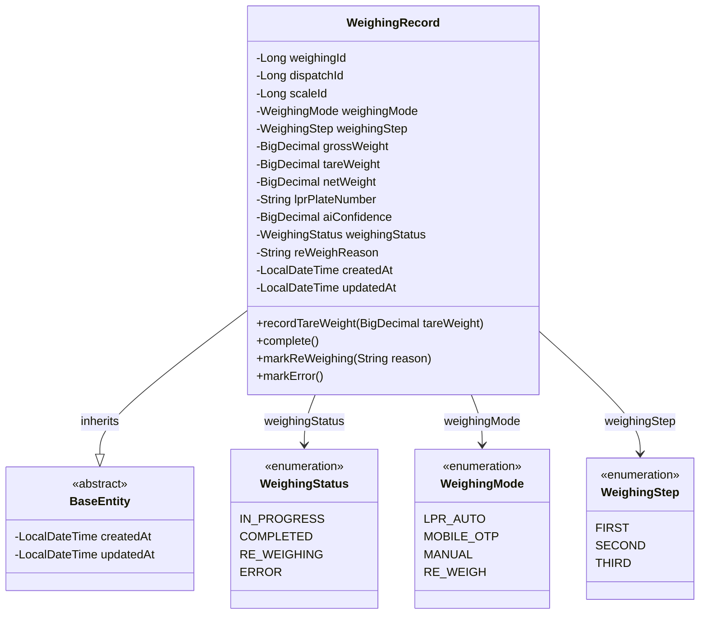
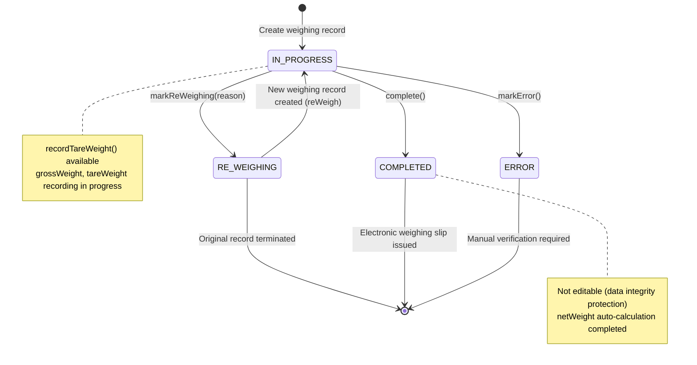
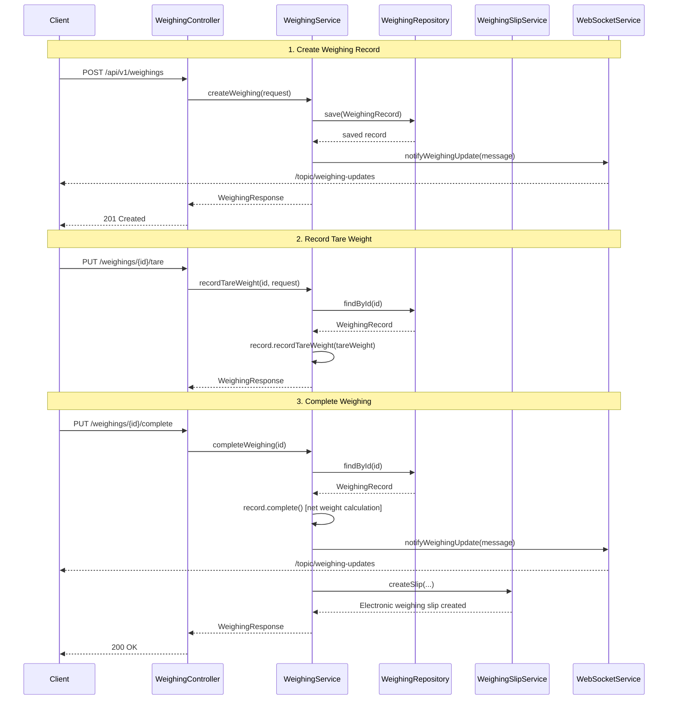
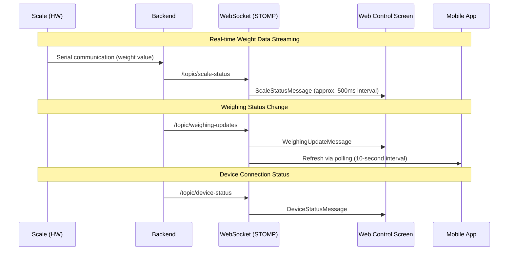
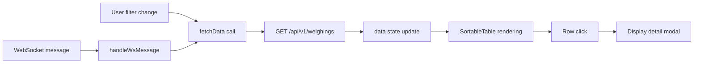
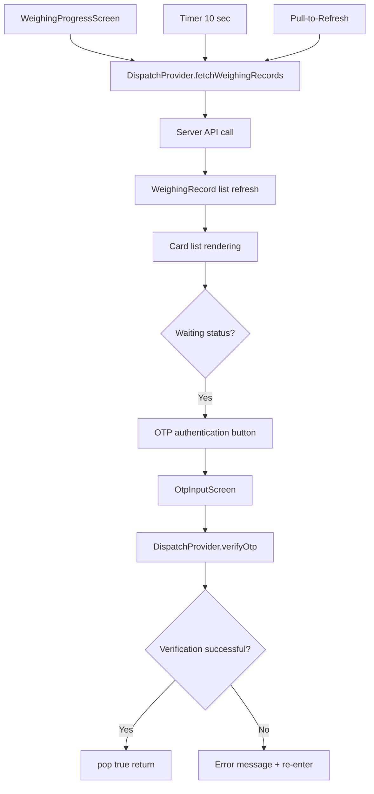

# Weighing Module Detailed Design Document

| Item | Details |
|------|---------|
| Document Version | 1.0 |
| Date | 2026-01-29 |
| Project | Busan Smart Weighing System |
| Module | Weighing |

---

## Table of Contents

1. [Module Overview](#1-module-overview)
2. [Domain Model](#2-domain-model)
3. [API Design](#3-api-design)
4. [Service Logic](#4-service-logic)
5. [DTO Specification](#5-dto-specification)
6. [Real-time Communication Design](#6-real-time-communication-design)
7. [Frontend Screen Design](#7-frontend-screen-design)
8. [Mobile Screen Design](#8-mobile-screen-design)
9. [Weighing Station Control Design](#9-weighing-station-control-design)
10. [Database Design](#10-database-design)
11. [Business Rules Summary](#11-business-rules-summary)

---

## 1. Module Overview

### 1.1 Purpose

The Weighing module is the core domain that automates the vehicle weight measurement process. Based on Dispatch information, it measures the gross weight and tare weight of vehicles, automatically calculates the net weight, and automatically generates an electronic weighing slip upon weighing completion.

### 1.2 Key Features

| Feature | Description |
|---------|-------------|
| Weighing Record Creation | Create a new weighing record based on dispatch and scale information |
| Tare Weight Recording | Record the weight of an empty vehicle and automatically calculate the net weight |
| Weighing Completion | State transition + automatic electronic weighing slip generation |
| Re-weighing | Mark the existing record as RE_WEIGHING and create a new record |
| Real-time Status | Propagate weighing status changes in real-time via WebSocket |
| Statistics Query | Today/monthly counts, net weight, distribution by item type/mode, daily trends |
| Weighing Station Control | Real-time weight display, device status monitoring, manual/automatic mode operation |

### 1.3 Weighing Modes

| Mode | Code | Description |
|------|------|-------------|
| LPR Auto | `LPR_AUTO` | Automatic identification and weighing via license plate recognition camera |
| Mobile OTP | `MOBILE_OTP` | Weighing after OTP authentication from the mobile app |
| Manual | `MANUAL` | Administrator manually enters vehicle information for weighing |
| Re-weigh | `RE_WEIGH` | Re-measurement due to dispute over existing weighing results |

### 1.4 Module Dependencies

```
Weighing ─── Dispatch: Reference dispatch information, query slip information
       │
       ├── Slip: Automatic electronic weighing slip generation upon weighing completion
       │
       ├── WebSocket: Real-time propagation of status changes
       │
       ├── LPR: Receive automatic license plate recognition results
       │
       └── OTP: Mobile OTP authentication integration
```

---

## 2. Domain Model

### 2.1 Class Diagram



### 2.2 Entity: WeighingRecord

The core domain entity for weighing records. It records the gross weight, tare weight, and net weight based on dispatch information and scale, and also stores LPR recognition results and AI confidence scores.

| Field | Type | Constraints | Description |
|-------|------|-------------|-------------|
| `weighingId` | `Long` | PK, AUTO_INCREMENT | Weighing record unique identifier |
| `dispatchId` | `Long` | NOT NULL, FK | Associated dispatch ID |
| `scaleId` | `Long` | NOT NULL, FK | Scale ID used |
| `weighingMode` | `WeighingMode` | NOT NULL | Weighing mode (LPR_AUTO, MOBILE_OTP, MANUAL, RE_WEIGH) |
| `weighingStep` | `WeighingStep` | NOT NULL | Weighing step (FIRST, SECOND, THIRD) |
| `grossWeight` | `BigDecimal(10,2)` | nullable | Gross weight (kg) |
| `tareWeight` | `BigDecimal(10,2)` | nullable | Tare weight (kg) |
| `netWeight` | `BigDecimal(10,2)` | nullable | Net weight (kg), auto-calculated |
| `lprPlateNumber` | `String(20)` | nullable | LPR-recognized license plate number |
| `aiConfidence` | `BigDecimal(5,4)` | nullable | AI recognition confidence (0.0000 ~ 1.0000) |
| `weighingStatus` | `WeighingStatus` | NOT NULL | Weighing status |
| `reWeighReason` | `String(255)` | nullable | Re-weighing reason |
| `createdAt` | `LocalDateTime` | auto-generated | Created datetime (BaseEntity) |
| `updatedAt` | `LocalDateTime` | auto-updated | Updated datetime (BaseEntity) |

### 2.3 Enumerations

**WeighingStatus (Weighing Status)**

| Value | Label | Description |
|-------|-------|-------------|
| `IN_PROGRESS` | In Progress | Weighing has started and measurement is in progress |
| `COMPLETED` | Completed | All weight measurements have been successfully completed |
| `RE_WEIGHING` | Re-weighing | Re-measurement required due to measurement error or dispute |
| `ERROR` | Error | Failed due to equipment error or system failure |

**WeighingMode (Weighing Mode)**

| Value | Label | Description |
|-------|-------|-------------|
| `LPR_AUTO` | LPR Auto | Automatic identification by license plate recognition camera |
| `MOBILE_OTP` | Mobile OTP | Mobile app OTP authentication |
| `MANUAL` | Manual | Administrator manual input |
| `RE_WEIGH` | Re-weigh | Re-measurement due to dispute over existing results |

**WeighingStep (Weighing Step)**

| Value | Label | Description |
|-------|-------|-------------|
| `FIRST` | 1st Weighing | Gross weight measurement in loaded state |
| `SECOND` | 2nd Weighing | Tare weight measurement in empty state |
| `THIRD` | 3rd Weighing | Re-measurement or additional verification |

---

## 3. API Design

### 3.1 Endpoint List

Base URL: `/api/v1/weighings`

| HTTP Method | Endpoint | Description | Auth |
|-------------|----------|-------------|------|
| `POST` | `/` | Create weighing record | Required |
| `GET` | `/` | Search weighing records (paginated) | Required |
| `GET` | `/{weighingId}` | Get single weighing record | Required |
| `GET` | `/dispatch/{dispatchId}` | Get weighing records by dispatch | Required |
| `GET` | `/in-progress` | Get in-progress weighing list | Required |
| `GET` | `/statistics` | Get weighing statistics | Required |
| `PUT` | `/{weighingId}/tare` | Record tare weight | Required |
| `PUT` | `/{weighingId}/complete` | Complete weighing | Required |
| `PUT` | `/{weighingId}/re-weigh` | Perform re-weighing | Required |

### 3.2 Detailed API Specification

#### 3.2.1 Create Weighing Record

```
POST /api/v1/weighings
Content-Type: application/json
```

**Request Body:**

```json
{
  "dispatch_id": 101,
  "scale_id": 1,
  "weighing_mode": "LPR_AUTO",
  "weighing_step": "FIRST",
  "weight_value": 45200.50,
  "lpr_plate_number": "12ga3456",
  "ai_confidence": 0.9856
}
```

**Response (201 Created):**

```json
{
  "success": true,
  "data": {
    "weighing_id": 1,
    "dispatch_id": 101,
    "scale_id": 1,
    "weighing_mode": "LPR_AUTO",
    "weighing_step": "FIRST",
    "gross_weight": 45200.50,
    "tare_weight": null,
    "net_weight": null,
    "lpr_plate_number": "12ga3456",
    "ai_confidence": 0.9856,
    "weighing_status": "IN_PROGRESS",
    "re_weigh_reason": null,
    "created_at": "2026-01-29T09:15:30",
    "updated_at": "2026-01-29T09:15:30"
  },
  "error": null
}
```

#### 3.2.2 Search Weighing Records (Paginated)

```
GET /api/v1/weighings?date_from=2026-01-01&date_to=2026-01-29&weighing_mode=LPR_AUTO&status=COMPLETED&lpr_plate_number=12ga&page=0&size=20&sort=createdAt,desc
```

**Query Parameters:**

| Parameter | Type | Required | Description |
|-----------|------|----------|-------------|
| `date_from` | `LocalDate` | Optional | Search start date |
| `date_to` | `LocalDate` | Optional | Search end date |
| `weighing_mode` | `String` | Optional | Weighing mode filter |
| `status` | `String` | Optional | Weighing status filter |
| `lpr_plate_number` | `String` | Optional | License plate number partial match |
| `page` | `int` | Optional | Page number (starts from 0) |
| `size` | `int` | Optional | Page size |
| `sort` | `String` | Optional | Sort criteria |

**Response (200 OK):**

```json
{
  "success": true,
  "data": {
    "content": [
      {
        "weighing_id": 1,
        "dispatch_id": 101,
        "scale_id": 1,
        "weighing_mode": "LPR_AUTO",
        "weighing_step": "FIRST",
        "gross_weight": 45200.50,
        "tare_weight": 15100.00,
        "net_weight": 30100.50,
        "lpr_plate_number": "12ga3456",
        "ai_confidence": 0.9856,
        "weighing_status": "COMPLETED",
        "re_weigh_reason": null,
        "created_at": "2026-01-29T09:15:30",
        "updated_at": "2026-01-29T09:25:00"
      }
    ],
    "total_elements": 150,
    "total_pages": 8,
    "number": 0,
    "size": 20
  },
  "error": null
}
```

#### 3.2.3 Get Single Weighing Record

```
GET /api/v1/weighings/{weighingId}
```

**Response (200 OK):** Returns a single `WeighingResponse` (same data structure as 3.2.1)

#### 3.2.4 Get Weighing Records by Dispatch

```
GET /api/v1/weighings/dispatch/{dispatchId}
```

**Response (200 OK):** Returns `WeighingResponse[]` array

#### 3.2.5 Get In-Progress Weighing List

```
GET /api/v1/weighings/in-progress
```

**Response (200 OK):** Returns `WeighingResponse[]` array (only records with `IN_PROGRESS` status, sorted by most recent)

#### 3.2.6 Record Tare Weight

```
PUT /api/v1/weighings/{weighingId}/tare
Content-Type: application/json
```

**Request Body:**

```json
{
  "tare_weight": 15100.00
}
```

**Response (200 OK):** Returns updated `WeighingResponse`

#### 3.2.7 Complete Weighing

```
PUT /api/v1/weighings/{weighingId}/complete
```

**Response (200 OK):** Returns completed `WeighingResponse` (net weight automatically calculated)

**Business Logic:**
- Change status to `COMPLETED`
- Auto-calculate net weight: `netWeight = grossWeight - tareWeight`
- Throw `WEIGHING_002` exception if net weight is negative
- Propagate status change via WebSocket
- Automatically generate electronic weighing slip (weighing completion is maintained even if slip generation fails)

#### 3.2.8 Perform Re-weighing

```
PUT /api/v1/weighings/{weighingId}/re-weigh
Content-Type: application/json
```

**Request Body:**

```json
{
  "reason": "Re-weighing requested due to weight measurement error"
}
```

**Response (200 OK):** Returns `WeighingResponse` of the newly created weighing record

**Business Logic:**
- Change the original record's status to `RE_WEIGHING` and record the reason
- Copy the original information to create a new weighing record (status: `IN_PROGRESS`)
- Propagate status change via WebSocket

#### 3.2.9 Get Weighing Statistics

```
GET /api/v1/weighings/statistics
```

**Response (200 OK):**

```json
{
  "success": true,
  "data": {
    "today_total_count": 42,
    "today_completed_count": 38,
    "today_in_progress_count": 4,
    "today_total_net_weight_ton": 1215.5,
    "month_total_count": 856,
    "month_total_net_weight_ton": 25680.3,
    "count_by_item_type": {
      "STEEL": 320,
      "SCRAP": 280,
      "RAW_MATERIAL": 256
    },
    "count_by_weighing_mode": {
      "LPR_AUTO": 650,
      "MOBILE_OTP": 120,
      "MANUAL": 86
    },
    "daily_statistics": [
      {
        "date": "2026-01-28",
        "total_count": 45,
        "total_net_weight_ton": 1350.2
      },
      {
        "date": "2026-01-29",
        "total_count": 42,
        "total_net_weight_ton": 1215.5
      }
    ]
  },
  "error": null
}
```

### 3.3 Error Codes

| Code | HTTP Status | Description |
|------|-------------|-------------|
| `WEIGHING_001` | 404 | Weighing record not found |
| `WEIGHING_002` | 400 | Net weight is negative (measurement error) |
| `WEIGHING_003` | 400 | Already completed weighing cannot be modified/re-completed |

---

## 4. Service Logic

### 4.1 State Transition Diagram



### 4.2 Weighing Process Flow



### 4.3 Core Business Logic

#### 4.3.1 Automatic Net Weight Calculation

Performed in the `WeighingRecord.complete()` method.

```
if (grossWeight != null AND tareWeight != null) {
    netWeight = grossWeight - tareWeight
    if (netWeight < 0) {
        throw WEIGHING_002 (negative net weight error)
    }
}
weighingStatus = COMPLETED
```

#### 4.3.2 Tare Weight Recording Constraints

Performed in the `WeighingRecord.recordTareWeight()` method.

```
if (weighingStatus == COMPLETED) {
    throw WEIGHING_003 (cannot modify completed weighing)
}
this.tareWeight = tareWeight
```

#### 4.3.3 Re-weighing Process

Performed in the `WeighingService.reWeigh()` method.

```
1. Look up original record (findById)
2. Mark original record as RE_WEIGHING status + record reason
3. Copy original information (dispatchId, scaleId, mode, step, grossWeight, lpr, etc.) to create new record
4. Save new record (status: IN_PROGRESS)
5. Propagate status change via WebSocket
```

#### 4.3.4 Automatic Electronic Weighing Slip Generation

Automatically performed upon weighing completion (`completeWeighing`).

```
1. Query Dispatch + Vehicle + Company information via a single JOIN query
2. Compose weighing information (weighingId, dispatchId, vehiclePlate, companyName, itemName,
   grossWeight, tareWeight, netWeight) in JSON format
3. Call WeighingSlipService.createSlip()
4. Weighing completion is maintained even if electronic slip generation fails (try-catch)
```

#### 4.3.5 Statistics Query Logic

Performed in the `WeighingService.getStatistics()` method.

| Statistic | Period | Query Method |
|-----------|--------|-------------|
| Today total count | Today | `countByPeriod(todayStart, todayEnd)` |
| Today completed count | Today | `countByStatusAndPeriod(COMPLETED, ...)` |
| Today in-progress count | Today | `countByStatusAndPeriod(IN_PROGRESS, ...)` |
| Today net weight (tons) | Today | `sumNetWeightByPeriod(...)` / 1000 |
| Monthly total count | 1st of month ~ Today | `countByPeriod(monthStart, todayEnd)` |
| Monthly net weight (tons) | 1st of month ~ Today | `sumNetWeightByPeriod(...)` / 1000 |
| Count by item type | Current month | `countGroupByItemType(...)` |
| Count by mode | Current month | `countGroupByWeighingMode(...)` |
| Daily statistics | Last 30 days | `findDailyStatistics(...)` |

---

## 5. DTO Specification

### 5.1 Request DTOs

#### WeighingCreateRequest (Weighing Create Request)

```java
public record WeighingCreateRequest(
    @NotNull Long dispatchId,          // Dispatch ID (required)
    @NotNull Long scaleId,             // Scale ID (required)
    @NotNull WeighingMode weighingMode, // Weighing mode (required)
    @NotNull WeighingStep weighingStep, // Weighing step (required)
    @NotNull @DecimalMin("0.01") BigDecimal weightValue, // Measured weight (required, min 0.01)
    String lprPlateNumber,              // LPR-recognized plate number (optional)
    BigDecimal aiConfidence             // AI recognition confidence (optional)
)
```

#### WeighingTareRequest (Tare Weight Recording Request)

```java
public record WeighingTareRequest(
    @NotNull @DecimalMin("0.01") BigDecimal tareWeight // Tare weight (required, min 0.01)
)
```

#### ReWeighRequest (Re-weighing Request)

```java
public record ReWeighRequest(
    @NotBlank String reason // Re-weighing reason (required, empty string not allowed)
)
```

#### WeighingSearchCondition (Search Condition)

```java
public record WeighingSearchCondition(
    LocalDate dateFrom,             // Search start date (optional)
    LocalDate dateTo,               // Search end date (optional)
    WeighingMode weighingMode,      // Weighing mode filter (optional)
    WeighingStatus status,          // Weighing status filter (optional)
    String lprPlateNumber           // License plate partial match (optional)
)
```

### 5.2 Response DTOs

#### WeighingResponse (Weighing Response)

```java
public record WeighingResponse(
    Long weighingId,                // Weighing ID
    Long dispatchId,                // Dispatch ID
    Long scaleId,                   // Scale ID
    String weighingMode,            // Weighing mode (string)
    String weighingStep,            // Weighing step (string)
    BigDecimal grossWeight,         // Gross weight (kg)
    BigDecimal tareWeight,          // Tare weight (kg)
    BigDecimal netWeight,           // Net weight (kg)
    String lprPlateNumber,          // LPR plate number
    BigDecimal aiConfidence,        // AI confidence
    String weighingStatus,          // Weighing status (string)
    String reWeighReason,           // Re-weighing reason
    LocalDateTime createdAt,        // Created datetime
    LocalDateTime updatedAt         // Updated datetime
)
```

- Converts from entity using `from(WeighingRecord record)` static factory method

#### WeighingStatisticsResponse (Statistics Response)

```java
public record WeighingStatisticsResponse(
    long todayTotalCount,                       // Today total count
    long todayCompletedCount,                   // Today completed count
    long todayInProgressCount,                  // Today in-progress count
    double todayTotalNetWeightTon,              // Today net weight (tons)
    long monthTotalCount,                       // Monthly total count
    double monthTotalNetWeightTon,              // Monthly net weight (tons)
    Map<String, Long> countByItemType,          // Count by item type
    Map<String, Long> countByWeighingMode,      // Count by mode
    List<DailyStatistics> dailyStatistics       // Daily statistics list
)
```

#### DailyStatistics (Daily Statistics)

```java
public record DailyStatistics(
    LocalDate date,                 // Statistics reference date
    long totalCount,                // Total count for the date
    double totalNetWeightTon        // Net weight for the date (tons)
)
```

---

## 6. Real-time Communication Design

### 6.1 WebSocket Architecture

```
Protocol: STOMP over SockJS
Endpoint: /ws (SockJS fallback supported)
Reconnect delay: 5 seconds
Heartbeat: incoming 10 seconds, outgoing 10 seconds
Authentication: JWT token based
```

### 6.2 Subscription Topics

| Topic | Direction | Message Type | Trigger |
|-------|-----------|-------------|---------|
| `/topic/weighing-updates` | Server -> Client | `WeighingUpdateMessage` | On weighing creation, completion, or re-weighing |
| `/topic/scale-status` | Server -> Client | `ScaleStatusMessage` | Real-time weight changes on scale (approx. 500ms interval) |
| `/topic/device-status` | Server -> Client | `DeviceStatusMessage` | On device connection status change |

### 6.3 Message Formats

#### WeighingUpdateMessage (Weighing Update)

Server-side message structure sent from the backend.

```json
{
  "weighing_id": 1,
  "dispatch_id": 101,
  "weighing_status": "COMPLETED",
  "weighing_mode": "LPR_AUTO",
  "gross_weight": 45200.50,
  "tare_weight": 15100.00,
  "net_weight": 30100.50,
  "lpr_plate_number": "12ga3456",
  "timestamp": "2026-01-29T09:25:00"
}
```

Extended message structure received by the frontend control screen.

```json
{
  "weighingId": 1,
  "dispatchId": 101,
  "processState": "COMPLETE",
  "weighingMode": "AUTO",
  "plateNumber": "12ga3456",
  "grossWeight": 45200.50,
  "tareWeight": 15100.00,
  "netWeight": 30100.50,
  "companyName": "Dongkuk Logistics",
  "itemName": "Steel",
  "driverName": "Hong Gildong",
  "message": "Weighing completed: 12ga3456",
  "timestamp": "2026-01-29T09:25:00"
}
```

#### ScaleStatusMessage (Scale Real-time Status)

```json
{
  "scale_id": 1,
  "current_weight": 45200.5,
  "unit": "kg",
  "is_stable": true,
  "stability_status": "STABLE",
  "timestamp": "2026-01-29T09:15:30"
}
```

#### DeviceStatusMessage (Device Status)

```json
{
  "device_type": "SCALE",
  "device_name": "Scale No.1",
  "status": "ONLINE",
  "message": null,
  "timestamp": "2026-01-29T09:00:00"
}
```

### 6.4 Message Flow



---

## 7. Frontend Screen Design

### 7.1 Weighing Status Page (WeighingPage)

**Path:** `/weighing`
**File:** `frontend/src/pages/WeighingPage.tsx`

#### 7.1.1 Screen Layout

```
+----------------------------------------------------------+
| Weighing Status                                           |
+----------------------------------------------------------+
| [Period: Start ~ End] [Status: All v] [Mode: All v]      |
|                                    [Reset] [Search]       |
+----------------------------------------------------------+
| ID | DispatchID | Mode    | Gross  | Tare   | Net   |...|
|----|------------|---------|--------|--------|-------|-----|
|  1 |   101      | LPRAuto | 45,201 | 15,100 | 30,101|...|
|  2 |   102      | Manual  | 38,500 | 12,800 | 25,700|...|
+----------------------------------------------------------+
```

#### 7.1.2 Feature List

| Feature | Description |
|---------|-------------|
| Filter Search | Combined filter with date range (RangePicker), status (Select), weighing mode (Select) |
| List View | SortableTable-based paginated list (page size 20) |
| Real-time Refresh | Automatic list refresh upon receiving WebSocket message (`/topic/weighing-updates`) |
| Detail Modal | Display weighing detail Modal on row click (Descriptions component) |
| Reset | Reset all filter criteria |

#### 7.1.3 State Management

| State | Type | Initial Value | Description |
|-------|------|---------------|-------------|
| `data` | `WeighingRecord[]` | `[]` | Weighing record list |
| `loading` | `boolean` | `false` | Loading state |
| `statusFilter` | `string \| undefined` | `undefined` | Status filter |
| `modeFilter` | `string \| undefined` | `undefined` | Weighing mode filter |
| `dateRange` | `[Dayjs, Dayjs] \| null` | `null` | Date range filter |
| `detailOpen` | `boolean` | `false` | Detail modal visibility |
| `selectedRecord` | `WeighingRecord \| null` | `null` | Selected record |

#### 7.1.4 Data Flow



### 7.2 Table Column Configuration

| Column Name | Field | Width | Rendering |
|-------------|-------|-------|-----------|
| ID | `weighingId` | 80px | Number |
| Dispatch ID | `dispatchId` | 100px | Number |
| Mode | `weighingMode` | 120px | Korean label conversion |
| Gross Weight (kg) | `grossWeight` | 120px | Thousands separator, right-aligned |
| Tare Weight (kg) | `tareWeight` | 130px | Thousands separator, right-aligned |
| Net Weight (kg) | `netWeight` | 120px | Primary color highlight, right-aligned |
| Plate Number | `lprPlateNumber` | 110px | Text |
| Status | `weighingStatus` | 90px | Tag component (color-coded) |
| Datetime | `createdAt` | 160px | `YYYY-MM-DD HH:mm` format |

---

## 8. Mobile Screen Design

### 8.1 Screen Structure

The mobile app's weighing-related screens consist of two screens.

```
mobile/lib/screens/weighing/
├── weighing_progress_screen.dart   # Weighing progress screen
└── otp_input_screen.dart           # OTP authentication input screen
```

### 8.2 Weighing Progress Screen (WeighingProgressScreen)

#### 8.2.1 Screen Layout

```
+------------------------------------------+
| [Last updated: Just now]       [Refresh]  |
+------------------------------------------+
| +--------------------------------------+ |
| | Dispatch No: DIS-2026-0101           | |
| | 12ga3456 | Dongkuk Logistics [1st]   | |
| |                                      | |
| | Progress Status              33%     | |
| | [========----------]                 | |
| | Waiting  1st   2nd   Done           | |
| |                                      | |
| | Gross Weight: 45,201 kg             | |
| | Tare: -                             | |
| | Net Weight: -                       | |
| |                                      | |
| | 1st Weighing: 09:15                 | |
| |                                      | |
| | [     OTP Authentication     ]      | |
| +--------------------------------------+ |
+------------------------------------------+
```

#### 8.2.2 Feature List

| Feature | Description |
|---------|-------------|
| Auto Refresh | Automatic query of weighing records based on today's date every 10 seconds via Timer |
| Pull-to-Refresh | Manual refresh support via RefreshIndicator |
| New Completion Detection | Display dialog when newly COMPLETED records are detected compared to previous query |
| Progress Display | LinearProgressIndicator + step labels (Waiting/1st/2nd/Done) |
| Weight Summary | Visual display of gross weight/tare weight/net weight via WeightSummaryRow |
| OTP Authentication | Display OTP authentication button for records in waiting status |

#### 8.2.3 Data Model (WeighingRecord - Flutter)

```dart
class WeighingRecord {
  final String id;                    // Weighing record ID
  final String dispatchId;            // Dispatch ID
  final String dispatchNumber;        // Dispatch number
  final WeighingStatus status;        // Weighing status
  final String vehicleNumber;         // Vehicle number
  final String driverName;            // Driver name
  final String companyName;           // Company name
  final String itemName;              // Item name
  final double? firstWeight;          // 1st weighing (gross weight)
  final double? secondWeight;         // 2nd weighing (tare weight)
  final double? netWeight;            // Net weight
  final DateTime? firstWeighingTime;  // 1st weighing time
  final DateTime? secondWeighingTime; // 2nd weighing time
  final String? scaleId;              // Scale ID
  final String? memo;                 // Memo
  final DateTime createdAt;           // Created datetime
}
```

#### 8.2.4 Mobile Weighing Status Enumeration

| Value | Label | Progress | Color | Icon |
|-------|-------|----------|-------|------|
| `waiting` | Waiting | 0% | Slate | hourglass_empty |
| `firstWeighing` | 1st Weighing | 33% | Cyan | monitor_weight |
| `secondWeighing` | 2nd Weighing | 66% | Amber | monitor_weight |
| `completed` | Completed | 100% | Green | check_circle |
| `error` | Error | 0% | Rose | error |

### 8.3 OTP Authentication Screen (OtpInputScreen)

#### 8.3.1 Screen Layout

```
+------------------------------------------+
|              < OTP Authentication         |
+------------------------------------------+
|          DIS-2026-0101                    |
|     Enter 6-digit OTP code               |
|          [ 04:32 ]                        |
|                                           |
|    [1] [2] [3] [4] [5] [6]              |
|                                           |
|    [1] [2] [3]                           |
|    [4] [5] [6]                           |
|    [7] [8] [9]                           |
|    [C] [0] [<]                           |
|                                           |
|    [        Verify          ]            |
+------------------------------------------+
```

#### 8.3.2 Feature List

| Feature | Description |
|---------|-------------|
| 6-digit OTP Input | Custom numeric keypad (0-9, C, backspace) |
| 5-minute Countdown | 300-second countdown via Timer.periodic, input disabled on expiry |
| OTP Verification | Server authentication request via DispatchProvider.verifyOtp() |
| Expiry Re-request | Display "Re-request OTP" button on timer expiry |
| Verification Result | On success: pop(context, true), on failure: error message + code reset |

### 8.4 Mobile Data Flow



---

## 9. Weighing Station Control Design

### 9.1 Overview

The Weighing Station Control page (WeighingStationPage) is a control screen where weighing station operators monitor and control the weighing process in real-time. It consists of a left display panel (weight, vehicle, device, history) and a right control panel (mode toggle, manual controls, action buttons, process state, log, simulator).

### 9.2 Overall Architecture

```mermaid
flowchart TB
    subgraph "WeighingStationPage"
        direction TB
        subgraph "Left Panel (Display Area)"
            WD[WeightDisplay<br/>Real-time Weight]
            VP[VehicleInfoPanel<br/>Vehicle/Dispatch Info]
            CS[ConnectionStatusBar<br/>Device Connection Status]
            HT[WeighingHistoryTable<br/>Recent Weighing History]
        end
        subgraph "Right Panel (Control Area)"
            MT[ModeToggle<br/>Auto/Manual Switch]
            MC[ManualControls<br/>Manual Weighing Controls]
            AB[ActionButtons<br/>Action Control Buttons]
            PS[ProcessStateBar<br/>Process State]
            SL[StatusLog<br/>Status Log]
            SP[SimulatorPanel<br/>Simulator]
        end
    end

    subgraph "Hooks"
        UWS[useWeighingStation<br/>State Management Hook]
        UWSS[useWeighingStationSocket<br/>WebSocket Hook]
    end

    subgraph "WebSocket Topics"
        T1[/topic/scale-status]
        T2[/topic/weighing-updates]
        T3[/topic/device-status]
    end

    subgraph "REST API"
        A1[weighingStationApi]
    end

    UWSS --> T1
    UWSS --> T2
    UWSS --> T3
    UWS --> UWSS
    UWS --> A1

    UWS --> WD
    UWS --> VP
    UWS --> CS
    UWS --> HT
    UWS --> MT
    UWS --> MC
    UWS --> AB
    UWS --> PS
    UWS --> SL
    UWS --> SP
```

### 9.3 State Management (useWeighingStation)

**File:** `frontend/src/hooks/useWeighingStation.ts`

This hook manages the overall state of the weighing station, coordinating WebSocket message reception, API calls, and UI state in a single place.

#### 9.3.1 Managed State

| State | Type | Initial Value | Description |
|-------|------|---------------|-------------|
| `mode` | `WeighingMode` | `'AUTO'` | Current weighing mode (AUTO/MANUAL) |
| `processState` | `ProcessState` | `'IDLE'` | Process progress state |
| `weight` | `WeightData` | `{currentWeight:0, stability:'DISCONNECTED', unit:'kg'}` | Real-time weight data |
| `vehicle` | `VehicleInfo` | `{plateNumber:'-', ...}` | Current vehicle information |
| `devices` | `DeviceConnectionState` | `{scale:'OFFLINE', ...}` | Device connection state |
| `logs` | `StatusLogEntry[]` | `[]` | Status log list (max 200 entries) |
| `history` | `WeighingHistoryRecord[]` | `[]` | Recent weighing history |
| `searchResults` | `DispatchSearchResult[]` | `[]` | Dispatch search results |
| `selectedDispatchId` | `number \| null` | `null` | Selected dispatch ID |
| `simulatorEnabled` | `boolean` | `false` | Simulator enabled |
| `searchLoading` | `boolean` | `false` | Search loading state |

#### 9.3.2 Provided Actions

| Action | Description |
|--------|-------------|
| `changeMode(mode)` | Switch weighing mode (AUTO/MANUAL), reset search state |
| `handleSearch(plate)` | Search dispatches by plate number (for manual mode) |
| `handleConfirmWeight()` | Start manual weighing for selected dispatch |
| `handleReset()` | Reset process (reset to IDLE state) |
| `handleBarrierOpen()` | Manual barrier opening |
| `loadHistory()` | Load recent weighing history (50 records) |
| `addLog(msg, level)` | Add entry to status log |
| `handleSimTriggerSensor()` | [Sim] Trigger vehicle detection sensor |
| `handleSimCaptureLpr()` | [Sim] LPR camera capture |
| `handleSimTogglePosition()` | [Sim] Toggle position |
| `handleSimSetWeight(w)` | [Sim] Set weight |

### 9.4 WebSocket Connection (useWeighingStationSocket)

**File:** `frontend/src/hooks/useWeighingStationSocket.ts`

Connects to the server via STOMP over SockJS protocol and subscribes to three topics.

```typescript
// Connection configuration
const client = new Client({
  webSocketFactory: () => new SockJS('/ws'),
  reconnectDelay: 5000,        // Reconnect delay: 5 seconds
  heartbeatIncoming: 10000,    // Server->Client heartbeat: 10 seconds
  heartbeatOutgoing: 10000,    // Client->Server heartbeat: 10 seconds
});

// Topic subscriptions
client.subscribe('/topic/scale-status', ...);       // -> onScaleStatus callback
client.subscribe('/topic/weighing-updates', ...);   // -> onWeighingUpdate callback
client.subscribe('/topic/device-status', ...);      // -> onDeviceStatus callback
```

### 9.5 Component Details

#### 9.5.1 WeightDisplay (Weight Display)

Displays the real-time scale weight value in a digital display format using 72px monospace font.

| Stability Status | Background | Text Color | Effect |
|------------------|------------|------------|--------|
| STABLE | Green background | Theme primary | Glow + shadow |
| UNSTABLE | Yellow background | Yellow | Default |
| ERROR | Red background | Red | Red shadow |
| DISCONNECTED | Gray background | Gray | None |

- Number change animation via AnimatedNumber component (300ms)
- Screen reader accessibility support with `aria-live="assertive"`

#### 9.5.2 VehicleInfoPanel (Vehicle Information)

Displays vehicle number, transport company, item, dispatch number, and driver information in rows with icons.

| Row | Icon | Field |
|-----|------|-------|
| Vehicle Number | CarOutlined | `plateNumber` |
| Transport Company | BankOutlined | `companyName` |
| Item | ShoppingOutlined | `itemName` |
| Dispatch Number | FileTextOutlined | `dispatchId` |
| Driver | UserOutlined | `driverName` |

- When plate number is not `-`, displayed in bold as active state

#### 9.5.3 ConnectionStatusBar (Device Connection Status)

Visually displays the real-time connection status of 4 devices.

| Device | Icon | Status Key |
|--------|------|-----------|
| Scale | DashboardOutlined | `scale` |
| Display Board | DesktopOutlined | `display` |
| Barrier | StopOutlined | `barrier` |
| Network | WifiOutlined | `network` |

- Status-based colors: ONLINE (green), OFFLINE (gray), ERROR (red)
- LED glow effect when ONLINE
- Tooltip showing device name: status

#### 9.5.4 ModeToggle (Mode Toggle)

Switches between Auto (AUTO LPR) and Manual (MANUAL) modes via Radio.Group.

- AUTO: Theme primary color, ScanOutlined icon
- MANUAL: Purple (#A855F7), EditOutlined icon
- LED and left border color dynamically change on mode switch

#### 9.5.5 ManualControls (Manual Weighing Controls)

Control panel that is only active in manual mode.

**Workflow:**
1. Enter plate number (Input.Search)
2. Execute search -> Returns dispatch list
3. Select dispatch (Select)
4. Click "Confirm Weight and Start Weighing" button

- In AUTO mode, entire section has opacity 0.45 + disabled
- Search can be executed via Enter key

#### 9.5.6 ActionButtons (Action Controls)

| Button | Icon | Action | Confirmation |
|--------|------|--------|-------------|
| Reset | ClearOutlined | Reset process to IDLE | Popconfirm required |
| Open Barrier | UnlockOutlined | Manual barrier opening | Immediate execution |
| Re-weigh | ReloadOutlined | Perform re-measurement | Disabled (pending implementation) |

#### 9.5.7 ProcessStateBar (Process State)

Visually displays the current progress state of the weighing process with a progress bar and status tags.

**Process Step Progression:**

```
IDLE -> WEIGHING -> STABILIZING -> COMPLETE
(Idle)  (Weighing)  (Stabilizing)  (Complete)
```

| State | Color | Icon |
|-------|-------|------|
| IDLE | #64748B (Gray) | ClockCircleOutlined |
| WEIGHING | #06B6D4 (Cyan) | LoadingOutlined (spinning) |
| STABILIZING | #F59E0B (Yellow) | SyncOutlined (spinning) |
| COMPLETE | #10B981 (Green) | CheckCircleOutlined |
| ERROR | #F43F5E (Red) | CloseCircleOutlined |

- Segment bar corresponding to each step is activated
- Current step has glow effect applied
- ERROR state turns entire bar red

#### 9.5.8 StatusLog (Status Log)

Terminal-style real-time event log panel.

- Dark background (#0D1117) + monospace font
- macOS traffic light decorative header
- Maximum 200 logs maintained
- Colors by log level: info (gray), success (neon green), warning (yellow), error (red)
- Auto-scroll on new log addition (to top)

#### 9.5.9 SimulatorPanel (Simulator)

Device simulation panel for development/testing environments. Can be collapsed, and displays a DEV badge.

| Button | Icon | API |
|--------|------|-----|
| Vehicle Detection | ExperimentOutlined | `POST /lpr/simulator {command: 'TRIGGER_SENSOR'}` |
| LPR Capture | CameraOutlined | `POST /lpr/simulator {command: 'CAPTURE_LPR'}` |
| Position Toggle | AimOutlined | `POST /lpr/simulator {command: 'TOGGLE_POSITION'}` |
| Set Weight | DashboardOutlined | `POST /lpr/simulator {command: 'SET_WEIGHT', params: {weight: N}}` |

- Switch to toggle simulator enable/disable
- InputNumber for direct weight value input (default: 15,000 kg, range: 0~100,000)

### 9.6 REST API (weighingStationApi)

| Function | Method | Endpoint | Description |
|----------|--------|----------|-------------|
| `searchDispatches(plate)` | GET | `/dispatches?plateNumber=...&status=REGISTERED` | Dispatch search |
| `createWeighing(data)` | POST | `/weighings` | Create weighing |
| `confirmWeighing(id, weight)` | POST | `/weighings/{id}/confirm` | Confirm weight |
| `reWeigh(id, reason)` | POST | `/weighings/{id}/reweigh` | Re-weigh |
| `fetchWeighingHistory(size)` | GET | `/weighings?size=50&sort=createdAt,desc` | Fetch history |
| `openBarrier()` | POST | `/monitoring/devices/cmd` | Open barrier |
| `resetProcess(scaleId)` | POST | `/weighings/reset` | Reset process |
| `sendSimulatorCommand(cmd)` | POST | `/lpr/simulator` | Simulator command |

---

## 10. Database Design

### 10.1 DDL

```sql
CREATE TABLE tb_weighing (
    weighing_id     BIGSERIAL       PRIMARY KEY,
    dispatch_id     BIGINT          NOT NULL,
    scale_id        BIGINT          NOT NULL,
    weighing_mode   VARCHAR(20)     NOT NULL,
    weighing_step   VARCHAR(20)     NOT NULL,
    gross_weight    NUMERIC(10, 2),
    tare_weight     NUMERIC(10, 2),
    net_weight      NUMERIC(10, 2),
    lpr_plate_number VARCHAR(20),
    ai_confidence   NUMERIC(5, 4),
    weighing_status VARCHAR(20)     NOT NULL,
    re_weigh_reason VARCHAR(255),
    created_at      TIMESTAMP       NOT NULL DEFAULT CURRENT_TIMESTAMP,
    updated_at      TIMESTAMP       NOT NULL DEFAULT CURRENT_TIMESTAMP,

    CONSTRAINT fk_weighing_dispatch
        FOREIGN KEY (dispatch_id) REFERENCES tb_dispatch(dispatch_id),
    CONSTRAINT fk_weighing_scale
        FOREIGN KEY (scale_id) REFERENCES tb_scale(scale_id),
    CONSTRAINT chk_weighing_mode
        CHECK (weighing_mode IN ('LPR_AUTO', 'MOBILE_OTP', 'MANUAL', 'RE_WEIGH')),
    CONSTRAINT chk_weighing_step
        CHECK (weighing_step IN ('FIRST', 'SECOND', 'THIRD')),
    CONSTRAINT chk_weighing_status
        CHECK (weighing_status IN ('IN_PROGRESS', 'COMPLETED', 'RE_WEIGHING', 'ERROR'))
);
```

### 10.2 Indexes

```sql
-- Dispatch ID-based query (weighing history by dispatch)
CREATE INDEX idx_weighing_dispatch ON tb_weighing (dispatch_id);

-- Scale ID-based query (usage status by scale)
CREATE INDEX idx_weighing_scale ON tb_weighing (scale_id);

-- Status-based query (in-progress weighing list, statistics by status)
CREATE INDEX idx_weighing_status ON tb_weighing (weighing_status);

-- Composite index (period + status combination search, statistics query optimization)
CREATE INDEX idx_weighing_created_status
    ON tb_weighing (created_at, weighing_status);

-- License plate LIKE search optimization
CREATE INDEX idx_weighing_lpr_plate
    ON tb_weighing (lpr_plate_number);
```

### 10.3 Key Query Patterns

| Purpose | Access Pattern | Index Used |
|---------|---------------|-----------|
| Weighing by dispatch | `WHERE dispatch_id = ?` | `idx_weighing_dispatch` |
| In-progress list | `WHERE weighing_status = 'IN_PROGRESS' ORDER BY created_at DESC` | `idx_weighing_status` |
| Period + status search | `WHERE created_at BETWEEN ? AND ? AND weighing_status = ?` | `idx_weighing_created_status` |
| Plate number search | `WHERE lpr_plate_number LIKE '%?%'` | `idx_weighing_lpr_plate` |
| Count statistics by period | `WHERE created_at BETWEEN ? AND ? GROUP BY ...` | `idx_weighing_created_status` |
| Daily completion statistics | `WHERE weighing_status = 'COMPLETED' AND created_at BETWEEN ? AND ?` | `idx_weighing_created_status` |

---

## 11. Business Rules Summary

### 11.1 Weighing Creation Rules

| No. | Rule | Description |
|-----|------|-------------|
| BR-01 | Fixed initial status | The status of a created weighing record is always `IN_PROGRESS` |
| BR-02 | Required field validation | `dispatchId`, `scaleId`, `weighingMode`, `weighingStep`, `weightValue` are required |
| BR-03 | Minimum weight | `weightValue` must be at least 0.01 |
| BR-04 | WebSocket propagation | Immediately propagate to `/topic/weighing-updates` upon creation |

### 11.2 Weight Recording Rules

| No. | Rule | Description |
|-----|------|-------------|
| BR-05 | No modification after completion | Tare weight cannot be recorded for `COMPLETED` weighing (WEIGHING_003) |
| BR-06 | Automatic net weight calculation | `netWeight = grossWeight - tareWeight` on `complete()` call |
| BR-07 | Negative net weight validation | Throw `WEIGHING_002` exception if net weight is negative (physically impossible) |
| BR-08 | No re-completion | Already `COMPLETED` records cannot be re-completed (WEIGHING_003) |

### 11.3 Re-weighing Rules

| No. | Rule | Description |
|-----|------|-------------|
| BR-09 | Reason required | Re-weighing reason (`reason`) cannot be empty (@NotBlank) |
| BR-10 | Original marking | Change the original record's status to `RE_WEIGHING` |
| BR-11 | New record copy | Copy dispatchId, scaleId, mode, step, grossWeight, lpr information from the original to create a new record |

### 11.4 Electronic Weighing Slip Rules

| No. | Rule | Description |
|-----|------|-------------|
| BR-12 | Automatic generation | Automatically generate electronic weighing slip by combining dispatch + vehicle + company info upon weighing completion |
| BR-13 | Fault tolerance | Weighing completion is maintained even if electronic slip generation fails |

### 11.5 Statistics Rules

| No. | Rule | Description |
|-----|------|-------------|
| BR-14 | Unit conversion | Net weight is stored in kg in DB, converted to tons in API response (/ 1000) |
| BR-15 | Daily statistics range | Daily count and net weight of completed weighings for the last 30 days |
| BR-16 | Monthly statistics range | Total count and net weight from the 1st of the current month to today |

### 11.6 Real-time Communication Rules

| No. | Rule | Description |
|-----|------|-------------|
| BR-17 | Automatic reconnection | Auto-reconnect after 5 seconds on WebSocket disconnection |
| BR-18 | Heartbeat | Maintain heartbeat at 10-second intervals for both incoming and outgoing |
| BR-19 | History refresh on completion | Auto-refresh history table when `COMPLETE` status is received via WebSocket |
| BR-20 | Log size limit | Status log maintains a maximum of 200 entries, oldest logs are removed when exceeded |

### 11.7 Mobile Rules

| No. | Rule | Description |
|-----|------|-------------|
| BR-21 | OTP validity period | OTP code must be entered within 5 minutes (300 seconds) |
| BR-22 | OTP digit count | Only 6-digit numeric codes are allowed |
| BR-23 | Auto refresh | Automatic refresh of weighing records based on today's date every 10 seconds |
| BR-24 | Completion detection | Display dialog when newly COMPLETED records are detected compared to previous query |
