# 출문(GatePass) 및 전자계량표(Slip) 모듈 상세 설계서

| 항목 | 내용 |
|------|------|
| **문서 버전** | 1.0 |
| **작성일** | 2026-01-29 |
| **모듈** | gatepass (출문 관리), slip (전자계량표) |
| **백엔드 패키지** | `com.dongkuk.weighing.gatepass`, `com.dongkuk.weighing.slip` |
| **프론트엔드** | `GatePassPage.tsx`, `SlipPage.tsx` |
| **모바일** | `gate_pass.dart`, `weighing_slip.dart`, `slip_list_screen.dart`, `slip_detail_screen.dart` |

---

## 목차

1. [모듈 개요 - 출문 관리 (GatePass)](#1-모듈-개요---출문-관리-gatepass)
2. [출문 도메인 모델](#2-출문-도메인-모델)
3. [출문 API 설계](#3-출문-api-설계)
4. [출문 서비스 로직](#4-출문-서비스-로직)
5. [모듈 개요 - 전자계량표 (Slip)](#5-모듈-개요---전자계량표-slip)
6. [전표 도메인 모델](#6-전표-도메인-모델)
7. [전표 API 설계](#7-전표-api-설계)
8. [전표 서비스 로직](#8-전표-서비스-로직)
9. [DTO 명세](#9-dto-명세)
10. [프론트엔드 화면 설계](#10-프론트엔드-화면-설계)
11. [모바일 화면 설계](#11-모바일-화면-설계)
12. [데이터베이스 설계](#12-데이터베이스-설계)
13. [모듈간 연동](#13-모듈간-연동)
14. [비즈니스 규칙 요약](#14-비즈니스-규칙-요약)

---

## 1. 모듈 개요 - 출문 관리 (GatePass)

### 1.1 목적

출문 관리 모듈은 계량 완료 후 차량의 구내 출입을 통제하는 기능을 담당한다. 계량 기록(WeighingRecord)과 배차(Dispatch)에 연결된 출문증을 발급하고, ADMIN 또는 MANAGER 역할의 담당자가 승인(통과) 또는 반려 처리를 수행한다.

### 1.2 핵심 기능

| 기능 | 설명 | 권한 |
|------|------|------|
| 출문증 생성 | 계량 완료 건에 대해 출문증을 신규 발급한다 | ADMIN, MANAGER |
| 출문증 조회 | ID 기반 단건 조회 및 상태별 목록 페이징 조회 | 인증된 사용자 |
| 출문 승인 | 출문증 상태를 PASSED로 변경하고 통과 시각을 기록한다 | ADMIN, MANAGER |
| 출문 반려 | 출문증 상태를 REJECTED로 변경하고 반려 사유를 기록한다 | ADMIN, MANAGER |

### 1.3 패키지 구조

```
com.dongkuk.weighing.gatepass/
├── domain/
│   ├── GatePass.java              # 출문증 엔티티
│   ├── GatePassStatus.java        # 출문증 상태 열거형
│   └── GatePassRepository.java    # 출문증 저장소 인터페이스
├── service/
│   └── GatePassService.java       # 출문증 비즈니스 서비스
├── controller/
│   └── GatePassController.java    # REST API 컨트롤러
└── dto/
    ├── GatePassCreateRequest.java # 생성 요청 DTO
    ├── GatePassRejectRequest.java # 반려 요청 DTO
    └── GatePassResponse.java      # 응답 DTO
```

---

## 2. 출문 도메인 모델

### 2.1 클래스 다이어그램

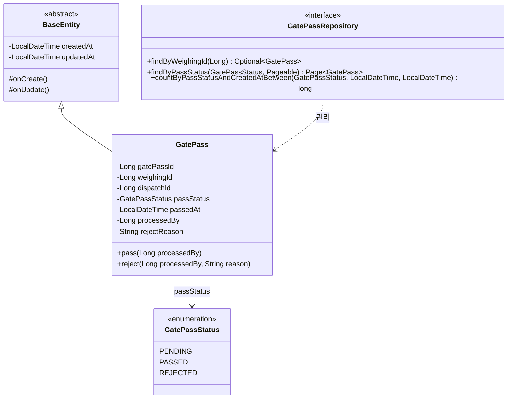

### 2.2 엔티티 필드 상세

| 필드 | 타입 | 컬럼명 | 제약조건 | 설명 |
|------|------|--------|----------|------|
| `gatePassId` | Long | `gate_pass_id` | PK, AUTO_INCREMENT | 출문증 고유 식별자 |
| `weighingId` | Long | `weighing_id` | NOT NULL, INDEX | 연관 계량 기록 ID |
| `dispatchId` | Long | `dispatch_id` | NOT NULL | 연관 배차 ID |
| `passStatus` | GatePassStatus | `pass_status` | NOT NULL, VARCHAR(20), INDEX | 출문증 상태 |
| `passedAt` | LocalDateTime | `passed_at` | NULLABLE | 출문 통과 일시 |
| `processedBy` | Long | `processed_by` | NULLABLE | 처리자 사용자 ID |
| `rejectReason` | String | `reject_reason` | NULLABLE, VARCHAR(255) | 반려 사유 |
| `createdAt` | LocalDateTime | `created_at` | NOT NULL (BaseEntity) | 생성 일시 |
| `updatedAt` | LocalDateTime | `updated_at` | NOT NULL (BaseEntity) | 수정 일시 |

### 2.3 상태 열거형 (GatePassStatus)

| 값 | 한글명 | 설명 |
|----|--------|------|
| `PENDING` | 대기 | 출문증이 발급되어 승인 대기 중인 상태 |
| `PASSED` | 통과 | 출문이 승인되어 차량 출입이 허가된 상태 |
| `REJECTED` | 반려 | 출문이 거부되어 차량 출입이 불허된 상태 |

---

## 3. 출문 API 설계

### 3.1 엔드포인트 목록

| 메서드 | 경로 | 설명 | 권한 |
|--------|------|------|------|
| `POST` | `/api/v1/gate-passes` | 출문증 생성 | ADMIN, MANAGER |
| `GET` | `/api/v1/gate-passes/{gatePassId}` | 출문증 단건 조회 | 인증된 사용자 |
| `GET` | `/api/v1/gate-passes` | 상태별 출문증 목록 조회 | 인증된 사용자 |
| `PUT` | `/api/v1/gate-passes/{gatePassId}/pass` | 출문 승인 | ADMIN, MANAGER |
| `PUT` | `/api/v1/gate-passes/{gatePassId}/reject` | 출문 반려 | ADMIN, MANAGER |

### 3.2 출문증 생성

**요청**

```http
POST /api/v1/gate-passes
Content-Type: application/json
Authorization: Bearer {access_token}

{
  "weighing_id": 42,
  "dispatch_id": 15
}
```

**응답 (201 Created)**

```json
{
  "success": true,
  "data": {
    "gate_pass_id": 1,
    "weighing_id": 42,
    "dispatch_id": 15,
    "pass_status": "PENDING",
    "passed_at": null,
    "processed_by": null,
    "reject_reason": null,
    "created_at": "2026-01-29T10:30:00"
  },
  "error": null
}
```

### 3.3 출문증 단건 조회

**요청**

```http
GET /api/v1/gate-passes/1
Authorization: Bearer {access_token}
```

**응답 (200 OK)**

```json
{
  "success": true,
  "data": {
    "gate_pass_id": 1,
    "weighing_id": 42,
    "dispatch_id": 15,
    "pass_status": "PENDING",
    "passed_at": null,
    "processed_by": null,
    "reject_reason": null,
    "created_at": "2026-01-29T10:30:00"
  },
  "error": null
}
```

### 3.4 상태별 출문증 목록 조회

**요청**

```http
GET /api/v1/gate-passes?status=PENDING&page=0&size=20
Authorization: Bearer {access_token}
```

- `status` 파라미터가 생략되면 기본값 `PENDING`으로 조회한다.

**응답 (200 OK)**

```json
{
  "success": true,
  "data": {
    "content": [
      {
        "gate_pass_id": 1,
        "weighing_id": 42,
        "dispatch_id": 15,
        "pass_status": "PENDING",
        "passed_at": null,
        "processed_by": null,
        "reject_reason": null,
        "created_at": "2026-01-29T10:30:00"
      }
    ],
    "pageable": { "page_number": 0, "page_size": 20 },
    "total_elements": 1,
    "total_pages": 1
  },
  "error": null
}
```

### 3.5 출문 승인

**요청**

```http
PUT /api/v1/gate-passes/1/pass
Authorization: Bearer {access_token}
```

- 요청 본문 없음. 인증된 사용자의 ID가 `processedBy`로 자동 기록된다.

**응답 (200 OK)**

```json
{
  "success": true,
  "data": {
    "gate_pass_id": 1,
    "weighing_id": 42,
    "dispatch_id": 15,
    "pass_status": "PASSED",
    "passed_at": "2026-01-29T11:05:00",
    "processed_by": 3,
    "reject_reason": null,
    "created_at": "2026-01-29T10:30:00"
  },
  "error": null
}
```

### 3.6 출문 반려

**요청**

```http
PUT /api/v1/gate-passes/1/reject
Content-Type: application/json
Authorization: Bearer {access_token}

{
  "reason": "서류 미비로 인한 반려"
}
```

**응답 (200 OK)**

```json
{
  "success": true,
  "data": {
    "gate_pass_id": 1,
    "weighing_id": 42,
    "dispatch_id": 15,
    "pass_status": "REJECTED",
    "passed_at": null,
    "processed_by": 3,
    "reject_reason": "서류 미비로 인한 반려",
    "created_at": "2026-01-29T10:30:00"
  },
  "error": null
}
```

### 3.7 오류 응답

| 상황 | HTTP 상태 | 에러 코드 | 메시지 |
|------|-----------|-----------|--------|
| 출문증 미존재 | 404 | MASTER_001 | 기준정보를 찾을 수 없습니다 |
| 권한 부족 | 403 | - | Access Denied |
| 필수 필드 누락 | 400 | - | Validation Error |

---

## 4. 출문 서비스 로직

### 4.1 상태 전이 다이어그램

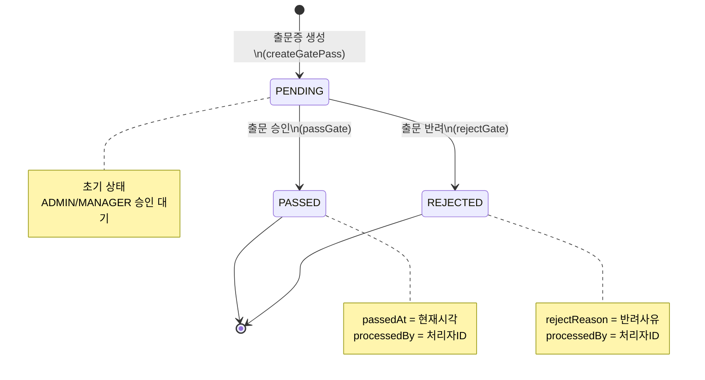

### 4.2 서비스 메서드 상세

#### createGatePass(GatePassCreateRequest)

1. `GatePass.builder()`로 엔티티를 생성한다.
2. 생성자 내부에서 `passStatus`를 `PENDING`으로 초기화한다.
3. `gatePassRepository.save()`로 영속화한다.
4. `GatePassResponse.from()`으로 응답 DTO를 반환한다.
5. INFO 로그: `출문 등록: gatePassId={}, weighingId={}`

#### getGatePass(Long gatePassId)

1. `findById()`로 출문증을 조회한다. 미존재 시 `BusinessException(MASTER_001)` 발생.
2. `GatePassResponse.from()`으로 응답 DTO를 반환한다.

#### getGatePassesByStatus(GatePassStatus, Pageable)

1. `gatePassRepository.findByPassStatus()`로 상태별 페이징 조회한다.
2. `Page<GatePassResponse>`로 매핑하여 반환한다.

#### passGate(Long gatePassId, Long processedBy)

1. `findById()`로 출문증을 조회한다.
2. `gatePass.pass(processedBy)`를 호출한다.
   - `passStatus`를 `PASSED`로 변경한다.
   - `passedAt`을 현재 시각으로 설정한다.
   - `processedBy`를 기록한다.
3. JPA dirty checking으로 자동 업데이트된다.
4. INFO 로그: `출문 승인: gatePassId={}, processedBy={}`

#### rejectGate(Long gatePassId, String reason, Long processedBy)

1. `findById()`로 출문증을 조회한다.
2. `gatePass.reject(processedBy, reason)`을 호출한다.
   - `passStatus`를 `REJECTED`로 변경한다.
   - `processedBy`를 기록한다.
   - `rejectReason`에 반려 사유를 기록한다.
3. JPA dirty checking으로 자동 업데이트된다.
4. INFO 로그: `출문 거부: gatePassId={}, reason={}, processedBy={}`

### 4.3 트랜잭션 정책

| 메서드 | 트랜잭션 | 설명 |
|--------|----------|------|
| `createGatePass` | `@Transactional` | 쓰기 트랜잭션 |
| `getGatePass` | `@Transactional(readOnly=true)` | 읽기 전용 (클래스 레벨) |
| `getGatePassesByStatus` | `@Transactional(readOnly=true)` | 읽기 전용 (클래스 레벨) |
| `passGate` | `@Transactional` | 쓰기 트랜잭션 |
| `rejectGate` | `@Transactional` | 쓰기 트랜잭션 |

---

## 5. 모듈 개요 - 전자계량표 (Slip)

### 5.1 목적

전자계량표 모듈은 계량 완료 후 발행되는 증빙 문서를 관리한다. 차량번호, 업체명, 품목명, 총중량/공차중량/순중량 정보가 포함된 전자 문서를 생성하고, 카카오톡/SMS 등 다양한 방식으로 외부 공유할 수 있다.

### 5.2 핵심 기능

| 기능 | 설명 | 비고 |
|------|------|------|
| 전표 생성 | 계량 완료 시 전자계량표를 자동 발행한다 | 서비스 내부 호출 |
| 전표 조회 | ID, 전표번호, 계량ID 기반 단건 조회 | 다중 조회 경로 |
| 기간별 검색 | 시작일~종료일 기간 필터 페이징 조회 | 날짜 범위 nullable |
| 전표 공유 | 카카오톡, SMS, 이메일 등으로 외부 공유 | 공유 이력 기록 |

### 5.3 패키지 구조

```
com.dongkuk.weighing.slip/
├── domain/
│   ├── WeighingSlip.java              # 전자계량표 엔티티
│   └── WeighingSlipRepository.java    # 전표 저장소 인터페이스
├── service/
│   └── WeighingSlipService.java       # 전표 비즈니스 서비스
├── controller/
│   └── WeighingSlipController.java    # REST API 컨트롤러
└── dto/
    ├── SlipResponse.java              # 응답 DTO
    └── SlipShareRequest.java          # 공유 요청 DTO
```

---

## 6. 전표 도메인 모델

### 6.1 클래스 다이어그램

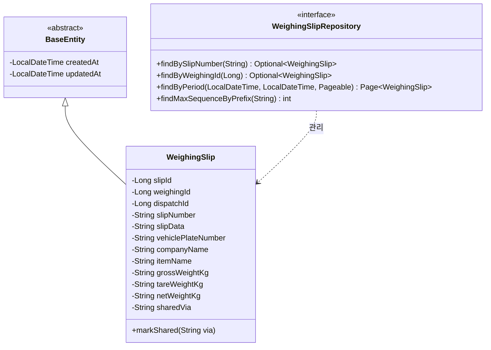

### 6.2 엔티티 필드 상세

| 필드 | 타입 | 컬럼명 | 제약조건 | 설명 |
|------|------|--------|----------|------|
| `slipId` | Long | `slip_id` | PK, AUTO_INCREMENT | 전표 고유 식별자 |
| `weighingId` | Long | `weighing_id` | NOT NULL, INDEX | 연관 계량 기록 ID |
| `dispatchId` | Long | `dispatch_id` | NOT NULL | 연관 배차 ID |
| `slipNumber` | String | `slip_number` | NOT NULL, UNIQUE, VARCHAR(30), INDEX | 전표 번호 (yyyyMMdd-NNNN) |
| `slipData` | String | `slip_data` | NOT NULL, TEXT | 전표 데이터 (JSON) |
| `vehiclePlateNumber` | String | `vehicle_plate_number` | NULLABLE, VARCHAR(20) | 차량 번호판 |
| `companyName` | String | `company_name` | NULLABLE, VARCHAR(100) | 업체명 |
| `itemName` | String | `item_name` | NULLABLE, VARCHAR(100) | 품목명 |
| `grossWeightKg` | String | `gross_weight_kg` | NULLABLE, VARCHAR(20) | 총중량 (표시용 문자열) |
| `tareWeightKg` | String | `tare_weight_kg` | NULLABLE, VARCHAR(20) | 공차중량 (표시용 문자열) |
| `netWeightKg` | String | `net_weight_kg` | NULLABLE, VARCHAR(20) | 순중량 (표시용 문자열) |
| `sharedVia` | String | `shared_via` | NULLABLE, VARCHAR(20) | 공유 방식 (KAKAO, EMAIL, SMS) |
| `createdAt` | LocalDateTime | `created_at` | NOT NULL (BaseEntity) | 생성 일시 |
| `updatedAt` | LocalDateTime | `updated_at` | NOT NULL (BaseEntity) | 수정 일시 |

### 6.3 전표 번호 채번 규칙

전표 번호는 `yyyyMMdd-NNNN` 형식으로 일별 순차 채번된다.

- 접두사: 당일 날짜를 `yyyyMMdd` 형식으로 생성 (예: `20260129-`)
- 시퀀스: 당일 발행된 전표 중 최대 시퀀스 + 1
- 자릿수: 시퀀스를 4자리 0-패딩 (예: `0001`)
- 예시: `20260129-0001`, `20260129-0002`, ...


---

## 7. 전표 API 설계

### 7.1 엔드포인트 목록

| 메서드 | 경로 | 설명 | 비고 |
|--------|------|------|------|
| `GET` | `/api/v1/slips/{slipId}` | 전표 ID로 단건 조회 | |
| `GET` | `/api/v1/slips/number/{slipNumber}` | 전표 번호로 조회 | |
| `GET` | `/api/v1/slips/weighing/{weighingId}` | 계량 ID로 전표 조회 | |
| `GET` | `/api/v1/slips` | 기간별 전표 목록 조회 | 페이징 지원 |
| `POST` | `/api/v1/slips/{slipId}/share` | 전표 공유 | |

> 참고: 전표 생성(createSlip)은 REST API로 노출되지 않는다. 계량 완료 시 서비스 내부에서 호출된다.

### 7.2 전표 ID로 단건 조회

**요청**

```http
GET /api/v1/slips/1
Authorization: Bearer {access_token}
```

**응답 (200 OK)**

```json
{
  "success": true,
  "data": {
    "slip_id": 1,
    "weighing_id": 42,
    "dispatch_id": 15,
    "slip_number": "20260129-0001",
    "vehicle_plate_number": "12가3456",
    "company_name": "동국물류",
    "item_name": "철근",
    "gross_weight_kg": "45200",
    "tare_weight_kg": "15100",
    "net_weight_kg": "30100",
    "shared_via": null,
    "created_at": "2026-01-29T10:35:00"
  },
  "error": null
}
```

### 7.3 전표 번호로 조회

**요청**

```http
GET /api/v1/slips/number/20260129-0001
Authorization: Bearer {access_token}
```

**응답**: 7.2와 동일한 형식.

### 7.4 계량 ID로 전표 조회

**요청**

```http
GET /api/v1/slips/weighing/42
Authorization: Bearer {access_token}
```

**응답**: 7.2와 동일한 형식.

### 7.5 기간별 전표 목록 조회

**요청**

```http
GET /api/v1/slips?date_from=2026-01-01&date_to=2026-01-29&page=0&size=20
Authorization: Bearer {access_token}
```

- `date_from`, `date_to` 모두 선택 파라미터이다. 생략 시 전체 기간 조회.
- `date_from`은 해당일 00:00:00부터, `date_to`는 해당일 23:59:59까지 포함.

**응답 (200 OK)**

```json
{
  "success": true,
  "data": {
    "content": [
      {
        "slip_id": 1,
        "weighing_id": 42,
        "dispatch_id": 15,
        "slip_number": "20260129-0001",
        "vehicle_plate_number": "12가3456",
        "company_name": "동국물류",
        "item_name": "철근",
        "gross_weight_kg": "45200",
        "tare_weight_kg": "15100",
        "net_weight_kg": "30100",
        "shared_via": "KAKAO",
        "created_at": "2026-01-29T10:35:00"
      }
    ],
    "pageable": { "page_number": 0, "page_size": 20 },
    "total_elements": 1,
    "total_pages": 1
  },
  "error": null
}
```

### 7.6 전표 공유

**요청**

```http
POST /api/v1/slips/1/share
Content-Type: application/json
Authorization: Bearer {access_token}

{
  "type": "KAKAO"
}
```

**응답 (200 OK)**

```json
{
  "success": true,
  "data": {
    "slip_id": 1,
    "weighing_id": 42,
    "dispatch_id": 15,
    "slip_number": "20260129-0001",
    "vehicle_plate_number": "12가3456",
    "company_name": "동국물류",
    "item_name": "철근",
    "gross_weight_kg": "45200",
    "tare_weight_kg": "15100",
    "net_weight_kg": "30100",
    "shared_via": "KAKAO",
    "created_at": "2026-01-29T10:35:00"
  },
  "error": null
}
```

### 7.7 오류 응답

| 상황 | HTTP 상태 | 에러 코드 | 메시지 |
|------|-----------|-----------|--------|
| 전표 미존재 (ID) | 404 | SLIP_001 | 계량표를 찾을 수 없습니다 |
| 전표 미존재 (번호) | 404 | SLIP_001 | 계량표를 찾을 수 없습니다 |
| 전표 미존재 (계량ID) | 404 | SLIP_001 | 계량표를 찾을 수 없습니다 |
| 미완료 계량 전표 생성 | 400 | SLIP_002 | 완료되지 않은 계량은 계량표를 생성할 수 없습니다 |
| 공유 타입 누락 | 400 | - | Validation Error |

---

## 8. 전표 서비스 로직

### 8.1 전표 생성 흐름

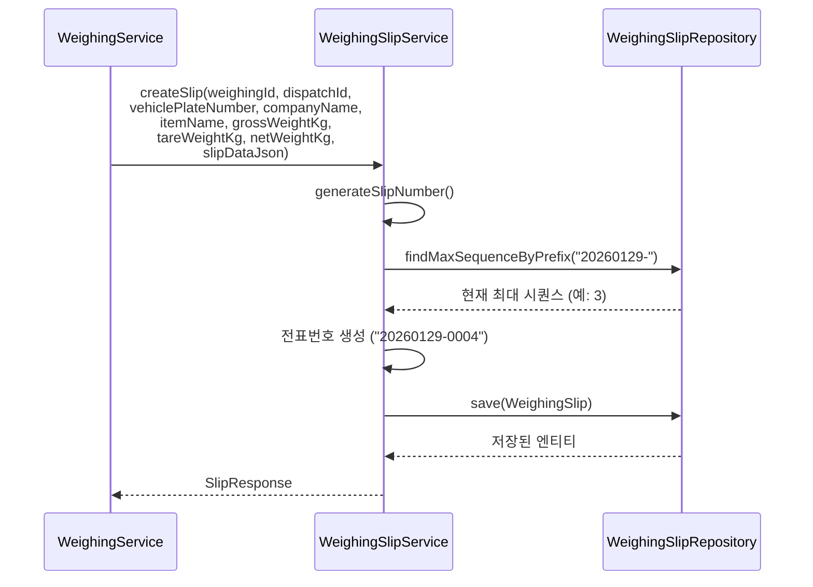

### 8.2 전표 공유 흐름

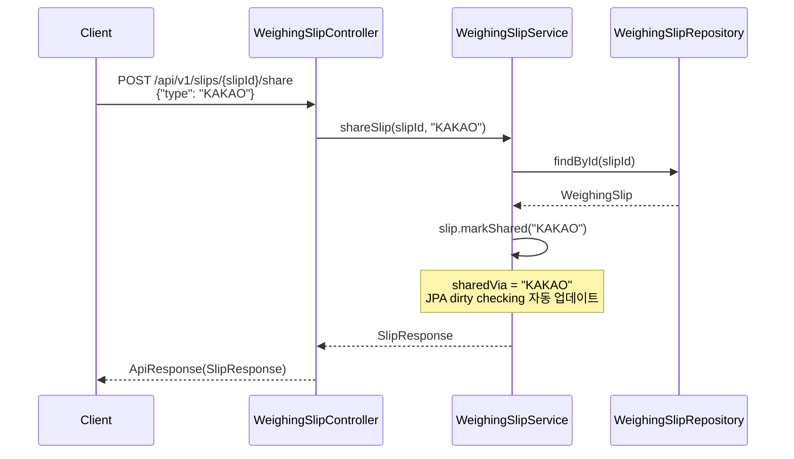

### 8.3 서비스 메서드 상세

#### createSlip(...)

1. `generateSlipNumber()`로 일별 순차 전표 번호를 생성한다.
2. `WeighingSlip.builder()`로 엔티티를 조립한다.
3. `slipRepository.save()`로 영속화한다.
4. INFO 로그: `계량표 생성: slipId={}, slipNumber={}, weighingId={}`
5. `SlipResponse.from()`으로 응답을 반환한다.

> 참고: 이 메서드는 REST API로 노출되지 않으며, 계량 완료 시 WeighingService 등에서 내부적으로 호출한다.

#### getSlip(Long slipId)

1. `findSlipById()`로 전표를 조회한다. 미존재 시 `BusinessException(SLIP_001)` 발생.
2. `SlipResponse.from()`으로 응답을 반환한다.

#### getSlipByNumber(String slipNumber)

1. `slipRepository.findBySlipNumber()`로 조회한다.
2. 미존재 시 `BusinessException(SLIP_001)` 발생.

#### getSlipByWeighingId(Long weighingId)

1. `slipRepository.findByWeighingId()`로 조회한다.
2. 미존재 시 `BusinessException(SLIP_001)` 발생.

#### searchSlips(LocalDate dateFrom, LocalDate dateTo, Pageable)

1. `dateFrom`이 있으면 `dateFrom.atStartOfDay()`로 변환한다.
2. `dateTo`가 있으면 `dateTo.atTime(LocalTime.MAX)`로 변환한다.
3. `slipRepository.findByPeriod()`로 페이징 조회한다.

#### shareSlip(Long slipId, String shareType)

1. `findSlipById()`로 전표를 조회한다.
2. `slip.markShared(shareType.toUpperCase())`를 호출한다.
3. JPA dirty checking으로 자동 업데이트된다.
4. INFO 로그: `계량표 공유: slipId={}, via={}`

### 8.4 트랜잭션 정책

| 메서드 | 트랜잭션 | 설명 |
|--------|----------|------|
| `createSlip` | `@Transactional` | 쓰기 트랜잭션 |
| `getSlip` | `@Transactional(readOnly=true)` | 읽기 전용 (클래스 레벨) |
| `getSlipByNumber` | `@Transactional(readOnly=true)` | 읽기 전용 (클래스 레벨) |
| `getSlipByWeighingId` | `@Transactional(readOnly=true)` | 읽기 전용 (클래스 레벨) |
| `searchSlips` | `@Transactional(readOnly=true)` | 읽기 전용 (클래스 레벨) |
| `shareSlip` | `@Transactional` | 쓰기 트랜잭션 |

---

## 9. DTO 명세

### 9.1 출문 모듈 DTO

#### GatePassCreateRequest

출문증 신규 생성 요청 DTO (Java Record).

| 필드 | 타입 | 필수 | 검증 | 설명 |
|------|------|------|------|------|
| `weighingId` | Long | O | `@NotNull` | 계량 기록 ID |
| `dispatchId` | Long | O | `@NotNull` | 배차 ID |

#### GatePassRejectRequest

출문증 반려 요청 DTO (Java Record).

| 필드 | 타입 | 필수 | 검증 | 설명 |
|------|------|------|------|------|
| `reason` | String | O | `@NotBlank` | 반려 사유 (빈 문자열 불가) |

#### GatePassResponse

출문증 응답 DTO (Java Record). `GatePassResponse.from(GatePass)` 정적 팩토리 메서드로 생성.

| 필드 | 타입 | Nullable | JSON 키 | 설명 |
|------|------|----------|---------|------|
| `gatePassId` | Long | N | `gate_pass_id` | 출문증 ID |
| `weighingId` | Long | N | `weighing_id` | 계량 기록 ID |
| `dispatchId` | Long | N | `dispatch_id` | 배차 ID |
| `passStatus` | String | N | `pass_status` | 상태 (PENDING/PASSED/REJECTED) |
| `passedAt` | LocalDateTime | Y | `passed_at` | 통과 일시 |
| `processedBy` | Long | Y | `processed_by` | 처리자 사용자 ID |
| `rejectReason` | String | Y | `reject_reason` | 반려 사유 |
| `createdAt` | LocalDateTime | N | `created_at` | 생성 일시 |

### 9.2 전표 모듈 DTO

#### SlipResponse

전자계량표 응답 DTO (Java Record). `SlipResponse.from(WeighingSlip)` 정적 팩토리 메서드로 생성.

| 필드 | 타입 | Nullable | JSON 키 | 설명 |
|------|------|----------|---------|------|
| `slipId` | Long | N | `slip_id` | 전표 ID |
| `weighingId` | Long | N | `weighing_id` | 계량 기록 ID |
| `dispatchId` | Long | N | `dispatch_id` | 배차 ID |
| `slipNumber` | String | N | `slip_number` | 전표 번호 (yyyyMMdd-NNNN) |
| `vehiclePlateNumber` | String | Y | `vehicle_plate_number` | 차량 번호 |
| `companyName` | String | Y | `company_name` | 업체명 |
| `itemName` | String | Y | `item_name` | 품목명 |
| `grossWeightKg` | String | Y | `gross_weight_kg` | 총중량 (표시용 문자열) |
| `tareWeightKg` | String | Y | `tare_weight_kg` | 공차중량 (표시용 문자열) |
| `netWeightKg` | String | Y | `net_weight_kg` | 순중량 (표시용 문자열) |
| `sharedVia` | String | Y | `shared_via` | 공유 방식 (KAKAO/SMS/EMAIL) |
| `createdAt` | LocalDateTime | N | `created_at` | 생성 일시 |

#### SlipShareRequest

전자계량표 공유 요청 DTO (Java Record).

| 필드 | 타입 | 필수 | 검증 | 설명 |
|------|------|------|------|------|
| `type` | String | O | `@NotBlank` | 공유 방식 (EMAIL, SMS, KAKAO 등) |

### 9.3 프론트엔드 TypeScript 인터페이스

#### GatePass

```typescript
export interface GatePass {
  gatePassId: number;
  weighingId: number;
  dispatchId: number;
  passStatus: string;       // "PENDING" | "PASSED" | "REJECTED"
  passedAt?: string;        // ISO 8601
  processedBy?: number;
  rejectReason?: string;
  createdAt: string;         // ISO 8601
}
```

#### WeighingSlip

```typescript
export interface WeighingSlip {
  slipId: number;
  weighingId: number;
  dispatchId: number;
  slipNumber: string;
  vehiclePlateNumber?: string;
  companyName?: string;
  itemName?: string;
  grossWeightKg?: number;
  tareWeightKg?: number;
  netWeightKg?: number;
  sharedVia?: string;
  createdAt: string;         // ISO 8601
}
```

### 9.4 모바일 Dart 모델

#### GatePass (모바일)

모바일 모델은 백엔드와 일부 차이가 있다. 모바일 전용 필드(passNumber, vehicleNumber, driverName, type, expiresAt)가 추가되어 있으며, 상태 열거형도 모바일 고유의 확장된 상태(issued, used, expired, cancelled)를 사용한다.

| 필드 | 타입 | 설명 |
|------|------|------|
| `id` | String | 출문증 ID |
| `passNumber` | String | 출문증 번호 |
| `dispatchId` | String | 배차 ID |
| `vehicleNumber` | String | 차량번호 |
| `driverName` | String | 운전자명 |
| `type` | GatePassType | 유형 (entry/exit) |
| `status` | GatePassStatus | 상태 (issued/used/expired/cancelled) |
| `issuedAt` | DateTime | 발급 일시 |
| `usedAt` | DateTime? | 사용 일시 |
| `expiresAt` | DateTime? | 만료 일시 |

#### WeighingSlip (모바일)

모바일 전용 모델은 백엔드 응답보다 더 풍부한 정보를 포함한다. 1차/2차 계량 시각, 계량대 정보, 담당자, 경로 정보 등이 추가되어 있다.

| 필드 | 타입 | 설명 |
|------|------|------|
| `id` | String | 전표 ID |
| `slipNumber` | String | 전표 번호 |
| `dispatchId` | String | 배차 ID |
| `dispatchNumber` | String | 배차번호 |
| `vehicleNumber` | String | 차량번호 |
| `driverName` | String | 운전자명 |
| `companyName` | String | 업체명 |
| `itemName` | String | 품목명 |
| `itemCategory` | String? | 품목 분류 |
| `firstWeight` | double | 1차 계량 중량 (총중량, kg) |
| `secondWeight` | double | 2차 계량 중량 (공차중량, kg) |
| `netWeight` | double | 순중량 (kg) |
| `firstWeighingTime` | DateTime | 1차 계량 시각 |
| `secondWeighingTime` | DateTime | 2차 계량 시각 |
| `scaleId` | String? | 계량대 ID |
| `scaleName` | String? | 계량대 이름 |
| `operatorName` | String? | 담당 운영자명 |
| `origin` | String? | 출발지 |
| `destination` | String? | 도착지 |
| `memo` | String? | 메모 |
| `isShared` | bool | 공유 여부 |
| `createdAt` | DateTime | 생성 일시 |

---

## 10. 프론트엔드 화면 설계

### 10.1 출문 관리 페이지 (GatePassPage)

**파일**: `frontend/src/pages/GatePassPage.tsx`

#### 화면 구성

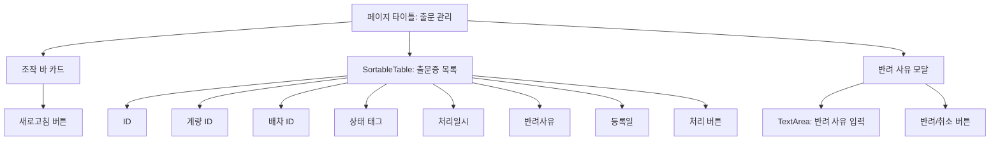

#### 테이블 컬럼 정의

| 컬럼명 | dataIndex | 너비 | 렌더링 |
|--------|-----------|------|--------|
| ID | `gatePassId` | 80px | 숫자 |
| 계량 ID | `weighingId` | 100px | 숫자 |
| 배차 ID | `dispatchId` | 100px | 숫자 |
| 상태 | `passStatus` | 90px | Tag 컴포넌트 (색상: 대기=노랑, 통과=초록, 반려=빨강) |
| 처리일시 | `passedAt` | 160px | 날짜 포맷 (YYYY-MM-DD HH:mm) 또는 `-` |
| 반려사유 | `rejectReason` | 130px | 텍스트 또는 `-` |
| 등록일 | `createdAt` | 160px | 날짜 포맷 (YYYY-MM-DD HH:mm) |
| 처리 | - | 160px | PENDING 상태만: 승인(Popconfirm)/반려 버튼 |

#### 상태 색상 매핑

| 상태 | 한글 | 색상 |
|------|------|------|
| `PENDING` | 대기 | `colors.warning` (노랑) |
| `PASSED` | 통과 | `colors.success` (초록) |
| `REJECTED` | 반려 | `colors.error` (빨강) |

#### 사용자 인터랙션

1. **페이지 진입**: 자동으로 출문증 목록을 `GET /gate-passes?size=20`으로 조회한다.
2. **승인 처리**: "승인" 버튼 클릭 시 Popconfirm 확인 후 `PUT /gate-passes/{id}/pass`를 호출한다.
3. **반려 처리**: "반려" 버튼 클릭 시 모달이 열리고, 사유 입력 후 `PUT /gate-passes/{id}/reject`를 호출한다. 사유는 필수 입력 필드이다.
4. **새로고침**: 버튼 클릭 시 목록을 다시 조회한다.

### 10.2 전자계량표 관리 페이지 (SlipPage)

**파일**: `frontend/src/pages/SlipPage.tsx`

#### 화면 구성

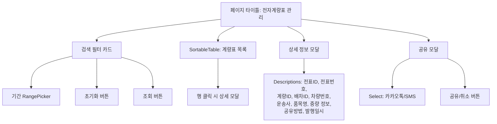

#### 테이블 컬럼 정의

| 컬럼명 | dataIndex | 너비 | 정렬 | 렌더링 |
|--------|-----------|------|------|--------|
| ID | `slipId` | 80px | 좌 | 숫자 |
| 전표번호 | `slipNumber` | 120px | 좌 | 텍스트 |
| 차량번호 | `vehiclePlateNumber` | 110px | 좌 | 텍스트 또는 `-` |
| 운송사 | `companyName` | 100px | 좌 | 텍스트 또는 `-` |
| 품목명 | `itemName` | 100px | 좌 | 텍스트 또는 `-` |
| 총중량(kg) | `grossWeightKg` | 120px | 우 | 숫자 로케일 포맷 |
| 차량중량(kg) | `tareWeightKg` | 130px | 우 | 숫자 로케일 포맷 |
| 순중량(kg) | `netWeightKg` | 120px | 우 | **강조** (primary 색상, bold) |
| 공유 | `sharedVia` | 80px | 좌 | Tag 또는 `-` |
| 발행일 | `createdAt` | 160px | 좌 | 날짜 포맷 |
| 공유 | - | 80px | 좌 | 공유 버튼 |

#### 상세 모달 (Descriptions)

행 클릭 시 `Descriptions` 컴포넌트(bordered, 2열, small)로 표시하는 항목:

- 전표 ID, 전표번호, 계량 ID, 배차 ID
- 차량번호, 운송사, 품목명
- 총중량(kg), 차량중량(kg), 순중량(kg) - 순중량은 primary 색상으로 강조
- 공유방법 (Tag 컴포넌트), 발행일시

#### 공유 모달

- `Select` 컴포넌트로 공유 방식을 선택한다.
- 선택 가능 옵션: 카카오톡(KAKAO), SMS
- "공유" 버튼 클릭 시 `POST /slips/{slipId}/share`를 호출한다.

#### 검색 필터

- 기간 필터: Ant Design `RangePicker`로 시작일~종료일 선택.
- 초기화 버튼: 기간 필터를 null로 리셋한다.
- 조회 버튼: `GET /slips`에 `dateFrom`, `dateTo` 파라미터를 전달하여 조회한다.

---

## 11. 모바일 화면 설계

### 11.1 계량표 목록 화면 (SlipListScreen)

**파일**: `mobile/lib/screens/slip/slip_list_screen.dart`

#### 화면 구조

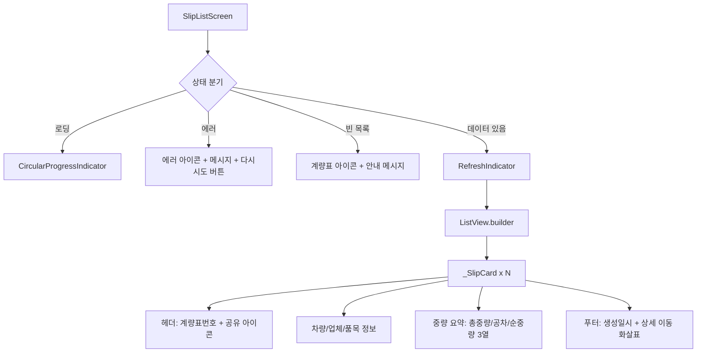

#### 주요 동작

1. **초기 로드**: `initState()`에서 오늘 날짜 기준(`yyyy-MM-dd`)으로 `DispatchProvider.fetchSlips()`를 호출한다.
2. **Pull-to-Refresh**: `RefreshIndicator`로 당겨서 새로고침을 지원한다.
3. **카드 탭**: 카드를 탭하면 `SlipDetailScreen`으로 이동하며 `slipId`를 전달한다.

#### _SlipCard 구성 요소

| 영역 | 내용 | 스타일 |
|------|------|--------|
| 헤더 | 계량표 아이콘 + 계량표번호 + 공유 여부 아이콘 | `titleMedium`, primary 색상 아이콘 |
| 정보 행 | 차량번호, 업체명, 품목명 (각각 아이콘 포함) | `bodyMedium` |
| 중량 요약 | 총중량 / 공차 / 순중량 (3열, 구분선 포함) | 순중량만 bold + primary 색상 |
| 푸터 | 시계 아이콘 + 생성일시 + 상세 화살표 | `bodySmall`, 보조 색상 |

### 11.2 계량표 상세 화면 (SlipDetailScreen)

**파일**: `mobile/lib/screens/slip/slip_detail_screen.dart`

#### 화면 구조

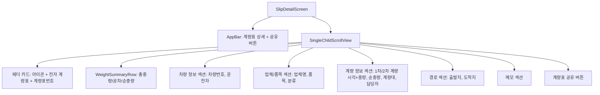

#### 공유 기능

공유 버튼 클릭 시 `BottomSheet`가 표시되며, 세 가지 공유 방식을 제공한다.

| 방식 | 아이콘 색상 | 설명 | 구현 |
|------|------------|------|------|
| 카카오톡 | `#FEE500` (카카오 노랑) | 카카오톡으로 공유 | 서버 API 호출 (`shareSlip(type: "KAKAO")`) |
| SMS | `#06B6D4` (시안) | 문자 메시지로 공유 | 서버 API 호출 (`shareSlip(type: "SMS")`) |
| 기타 | `#334155` (다크 슬레이트) | 다른 앱으로 공유 | `share_plus` 패키지로 OS 공유 시트 |

#### 시스템 공유 텍스트 형식

서버 API 공유가 실패하면 OS 시스템 공유로 폴백한다. 공유되는 텍스트 형식:

```text
[부산 스마트 계량] 계량표

계량표번호: {slipNumber}
배차번호: {dispatchNumber}
차량번호: {vehicleNumber}
운전자: {driverName}
업체: {companyName}
품목: {itemName}

총중량: {firstWeight} kg
공차중량: {secondWeight} kg
순중량: {netWeight} kg

1차 계량: {firstWeighingTime}
2차 계량: {secondWeighingTime}
```

#### 상세 정보 섹션

| 섹션 | 표시 항목 | 조건부 표시 |
|------|----------|------------|
| 헤더 카드 | 아이콘, "전자 계량표" 제목, 계량표번호 | 항상 |
| 중량 요약 | 총중량, 공차중량, 순중량 (3열) | 항상 |
| 차량 정보 | 차량번호, 운전자 | 항상 |
| 업체/품목 | 업체명, 품목명, 분류 | 분류는 `itemCategory != null`일 때만 |
| 계량 정보 | 1차/2차 계량 시각+중량, 순중량(강조), 계량대, 담당자 | 계량대/담당자는 null이 아닐 때만 |
| 경로 | 출발지, 도착지 | `origin` 또는 `destination`이 null이 아닐 때만 |
| 메모 | 메모 내용 | `memo != null && memo.isNotEmpty`일 때만 |

---

## 12. 데이터베이스 설계

### 12.1 테이블 정의

#### tb_gate_pass (출문증)

```sql
CREATE TABLE tb_gate_pass (
    gate_pass_id    BIGSERIAL       PRIMARY KEY,
    weighing_id     BIGINT          NOT NULL,
    dispatch_id     BIGINT          NOT NULL,
    pass_status     VARCHAR(20)     NOT NULL,
    passed_at       TIMESTAMP,
    processed_by    BIGINT,
    reject_reason   VARCHAR(255),
    created_at      TIMESTAMP       NOT NULL,
    updated_at      TIMESTAMP       NOT NULL
);

-- 인덱스
CREATE INDEX idx_gatepass_weighing ON tb_gate_pass(weighing_id);
CREATE INDEX idx_gatepass_status   ON tb_gate_pass(pass_status);
```

#### tb_weighing_slip (전자계량표)

```sql
CREATE TABLE tb_weighing_slip (
    slip_id                 BIGSERIAL       PRIMARY KEY,
    weighing_id             BIGINT          NOT NULL,
    dispatch_id             BIGINT          NOT NULL,
    slip_number             VARCHAR(30)     NOT NULL UNIQUE,
    slip_data               TEXT            NOT NULL,
    vehicle_plate_number    VARCHAR(20),
    company_name            VARCHAR(100),
    item_name               VARCHAR(100),
    gross_weight_kg         VARCHAR(20),
    tare_weight_kg          VARCHAR(20),
    net_weight_kg           VARCHAR(20),
    shared_via              VARCHAR(20),
    created_at              TIMESTAMP       NOT NULL,
    updated_at              TIMESTAMP       NOT NULL
);

-- 인덱스
CREATE UNIQUE INDEX idx_slip_number   ON tb_weighing_slip(slip_number);
CREATE INDEX idx_slip_weighing        ON tb_weighing_slip(weighing_id);
```

### 12.2 ER 다이어그램

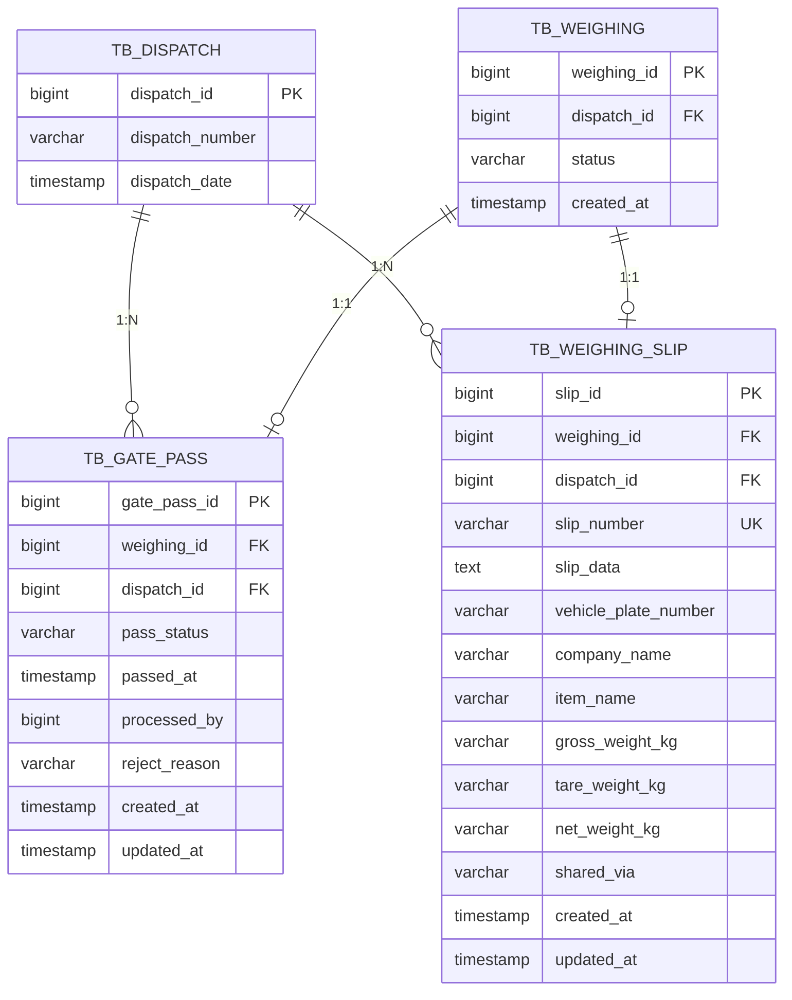

### 12.3 인덱스 전략

| 테이블 | 인덱스명 | 컬럼 | 유형 | 용도 |
|--------|----------|------|------|------|
| `tb_gate_pass` | `idx_gatepass_weighing` | `weighing_id` | 일반 | 계량 ID로 출문증 조회 |
| `tb_gate_pass` | `idx_gatepass_status` | `pass_status` | 일반 | 상태별 출문증 목록 조회 |
| `tb_weighing_slip` | `idx_slip_number` | `slip_number` | 유니크 | 전표 번호 기반 조회 및 유일성 보장 |
| `tb_weighing_slip` | `idx_slip_weighing` | `weighing_id` | 일반 | 계량 ID로 전표 조회 |

---

## 13. 모듈간 연동

### 13.1 전체 업무 흐름 내 위치

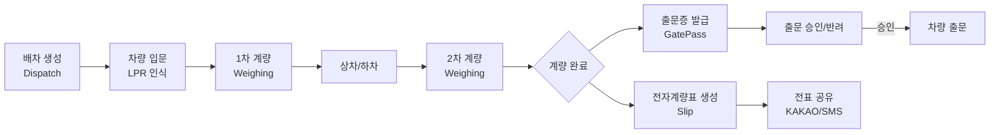

### 13.2 모듈 의존성

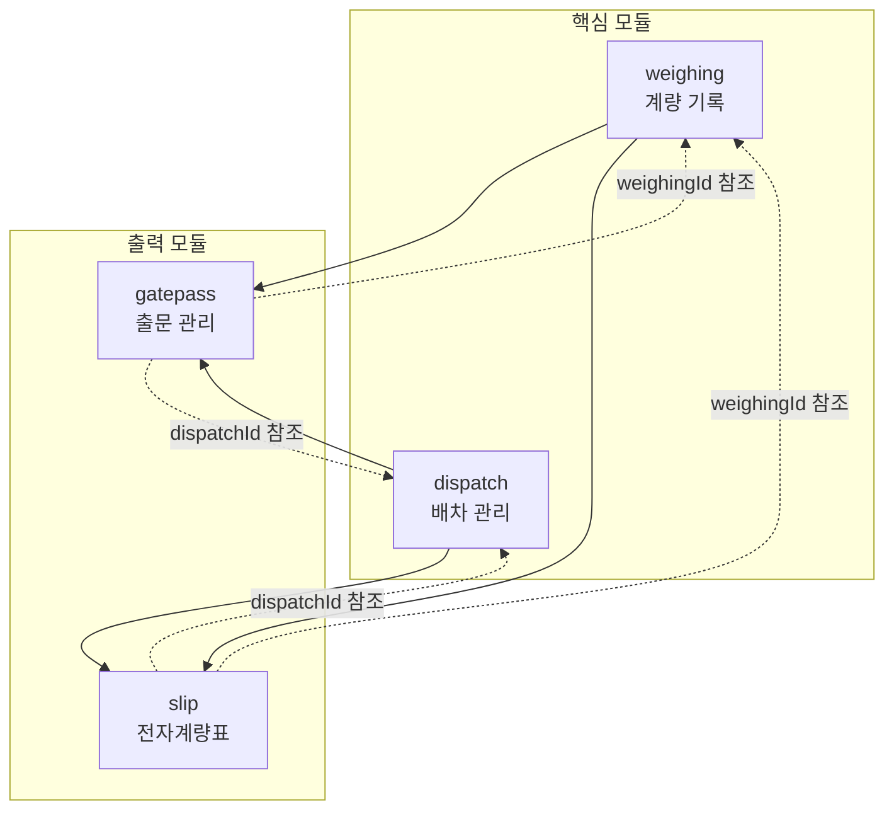

### 13.3 연동 관계 상세

| 출발 모듈 | 대상 모듈 | 연동 방식 | 설명 |
|-----------|-----------|-----------|------|
| Weighing | GatePass | `weighingId` FK | 계량 완료 후 출문증 생성 시 계량 ID 전달 |
| Weighing | Slip | 서비스 내부 호출 | 계량 완료 시 `WeighingSlipService.createSlip()` 호출 |
| Dispatch | GatePass | `dispatchId` FK | 배차 정보와 출문증 연결 |
| Dispatch | Slip | `dispatchId` FK | 배차 정보와 전표 연결 |
| GatePass | - | 독립 처리 | 출문 승인/반려는 독립적으로 처리 |
| Slip | - | 독립 처리 | 전표 조회/공유는 독립적으로 처리 |

### 13.4 GatePass와 Slip의 관계

출문증(GatePass)과 전자계량표(Slip)는 동일한 계량 기록(WeighingRecord)과 배차(Dispatch)에 연결되지만, 서로 직접적인 참조 관계는 없다. 두 모듈은 계량 완료라는 동일한 이벤트에 의해 각각 독립적으로 생성된다.

| 항목 | GatePass | Slip |
|------|----------|------|
| 역할 | 차량 출입 통제 문서 | 계량 결과 증빙 문서 |
| 생성 시점 | 계량 완료 후 | 계량 완료 후 |
| 생성 방법 | REST API (POST) | 서비스 내부 호출 |
| 상태 관리 | PENDING -> PASSED/REJECTED | 상태 없음 (발행 즉시 유효) |
| 상호 참조 | 없음 | 없음 |
| 공통 키 | weighingId, dispatchId | weighingId, dispatchId |

---

## 14. 비즈니스 규칙 요약

### 14.1 출문 관리 (GatePass) 규칙

| 번호 | 규칙 | 설명 |
|------|------|------|
| GP-01 | 출문증은 계량 완료 건에 대해서만 발급 가능하다 | weighingId, dispatchId 필수 |
| GP-02 | 출문증 생성 시 초기 상태는 반드시 PENDING이다 | 생성자 내부에서 강제 설정 |
| GP-03 | 출문증 승인/반려는 ADMIN 또는 MANAGER만 가능하다 | `@PreAuthorize("hasAnyRole('ADMIN', 'MANAGER')")` |
| GP-04 | 승인 시 통과 시각(passedAt)과 처리자(processedBy)를 기록한다 | `LocalDateTime.now()` + 인증 사용자 ID |
| GP-05 | 반려 시 반려 사유(reason)는 필수 입력이다 | `@NotBlank` 검증 |
| GP-06 | 반려 시 처리자(processedBy)와 반려 사유(rejectReason)를 기록한다 | 감사 추적용 |
| GP-07 | 상태별 목록 조회 시 기본 필터는 PENDING이다 | 미처리 건 우선 조회 |
| GP-08 | 상태 전이는 PENDING에서만 PASSED 또는 REJECTED로 가능하다 | 단방향 상태 흐름 |

### 14.2 전자계량표 (Slip) 규칙

| 번호 | 규칙 | 설명 |
|------|------|------|
| SL-01 | 전표 번호는 yyyyMMdd-NNNN 형식으로 일별 순차 채번된다 | DB 최대 시퀀스 + 1 |
| SL-02 | 전표 번호는 시스템 전체에서 유일해야 한다 | UNIQUE 제약조건 |
| SL-03 | 전표 생성은 REST API로 노출되지 않으며, 서비스 내부에서만 호출된다 | 계량 완료 시 자동 생성 |
| SL-04 | 전표 데이터(slipData)는 JSON 형식의 전체 계량 증빙 정보를 저장한다 | TEXT 컬럼 |
| SL-05 | 비정규화 필드(차량번호, 업체명, 품목명, 중량)는 조회 편의를 위해 유지한다 | 별도 JOIN 없이 목록 표시 |
| SL-06 | 공유 시 공유 방식(sharedVia)이 대문자로 기록된다 | `toUpperCase()` 적용 |
| SL-07 | 기간 검색 시 dateFrom은 해당일 시작(00:00:00), dateTo는 해당일 끝(23:59:59)으로 변환된다 | `atStartOfDay()`, `atTime(LocalTime.MAX)` |
| SL-08 | 미완료 계량에 대해서는 전표를 생성할 수 없다 | ErrorCode.SLIP_002 |
| SL-09 | 전표 공유는 최종 공유 방식만 기록한다 (덮어쓰기) | `markShared()` 호출 시 기존 값 교체 |

### 14.3 공통 규칙

| 번호 | 규칙 | 적용 대상 |
|------|------|-----------|
| CM-01 | 모든 엔티티는 BaseEntity를 상속하여 createdAt/updatedAt을 자동 관리한다 | GatePass, WeighingSlip |
| CM-02 | 모든 API 응답은 ApiResponse 래퍼를 사용한다 | 전체 |
| CM-03 | JSON 필드명은 snake_case를 사용한다 (Jackson 설정) | 전체 |
| CM-04 | 날짜/시간은 ISO 8601 형식으로 직렬화한다 | 전체 |
| CM-05 | 미존재 리소스 접근 시 BusinessException을 발생시킨다 | GatePass(MASTER_001), Slip(SLIP_001) |
| CM-06 | 서비스 클래스에 클래스 레벨 @Transactional(readOnly=true)를 적용하고, 쓰기 메서드만 개별 @Transactional을 지정한다 | GatePassService, WeighingSlipService |

---

*문서 끝*
