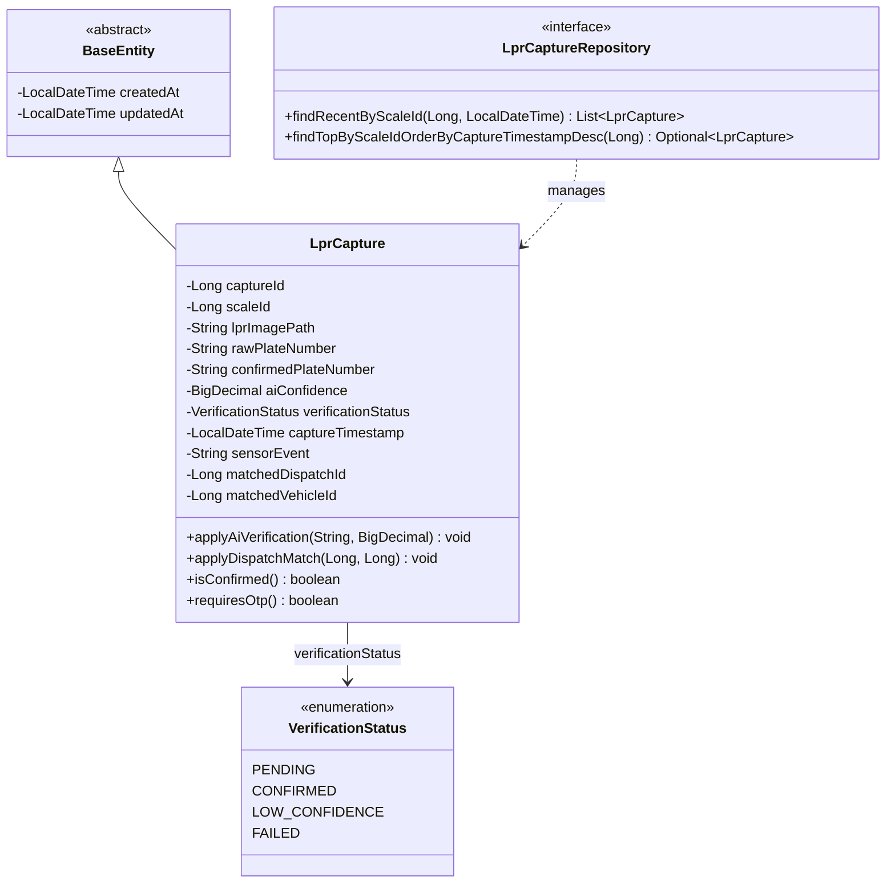
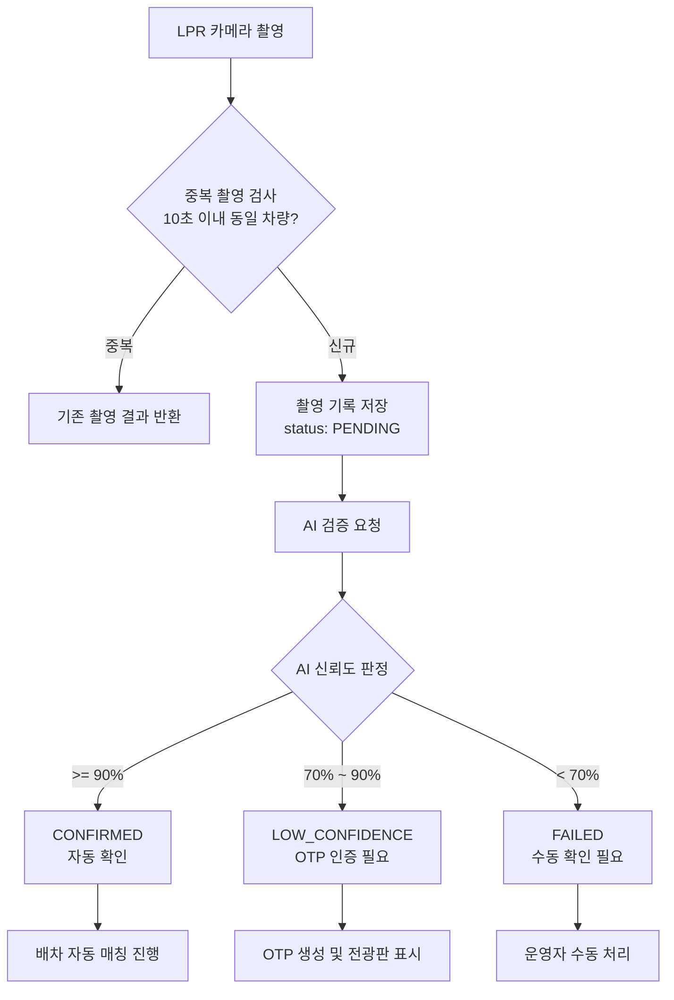
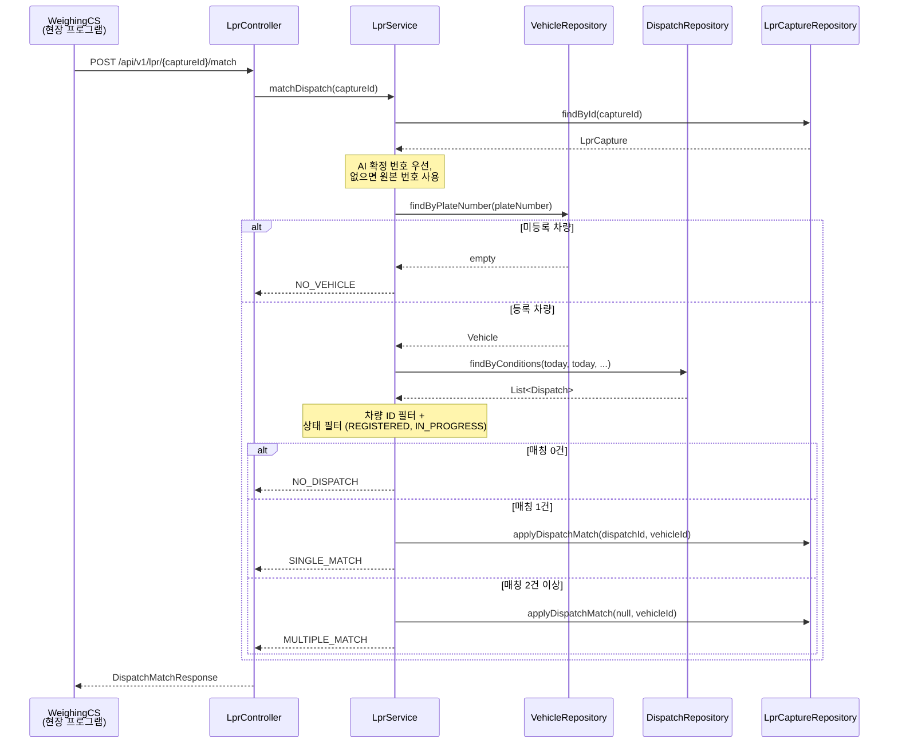
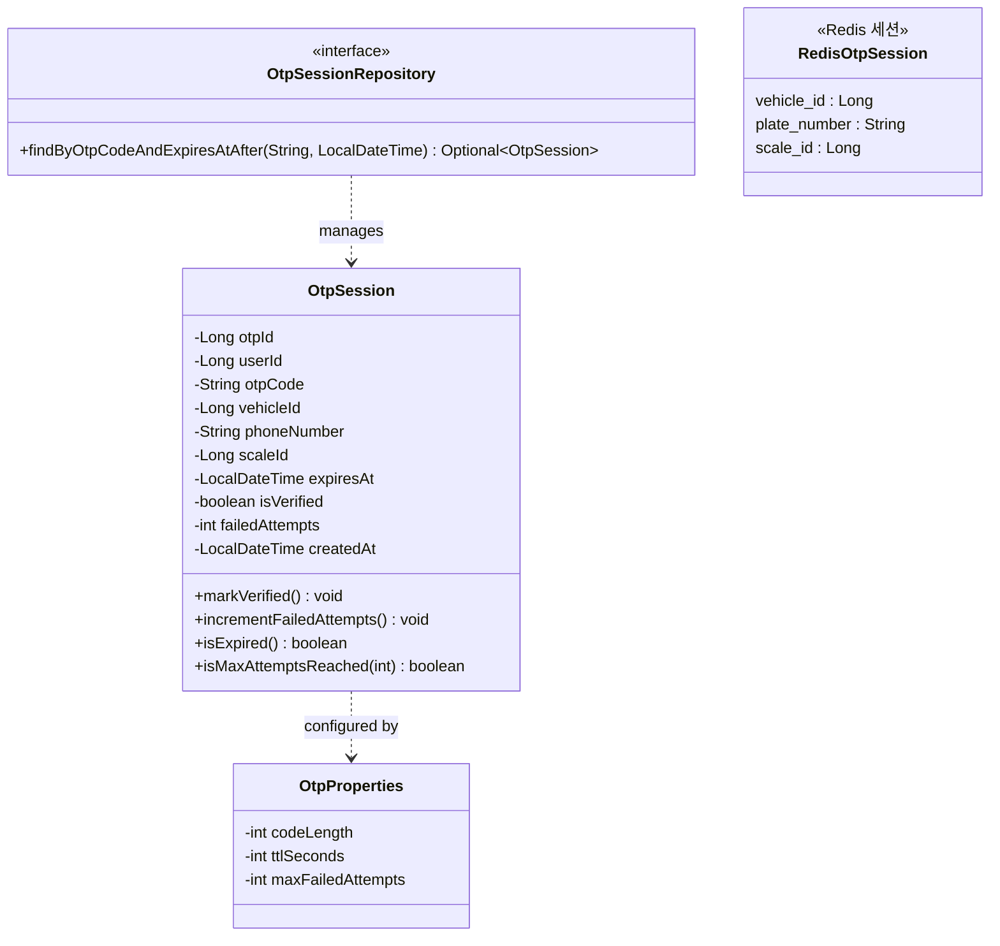
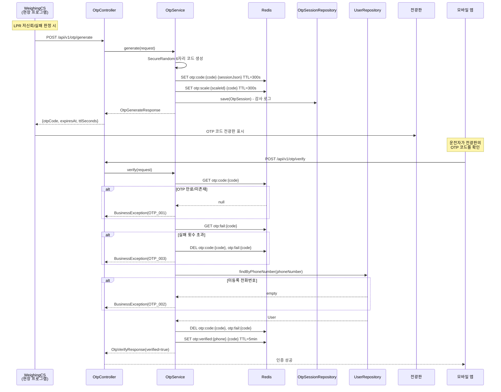
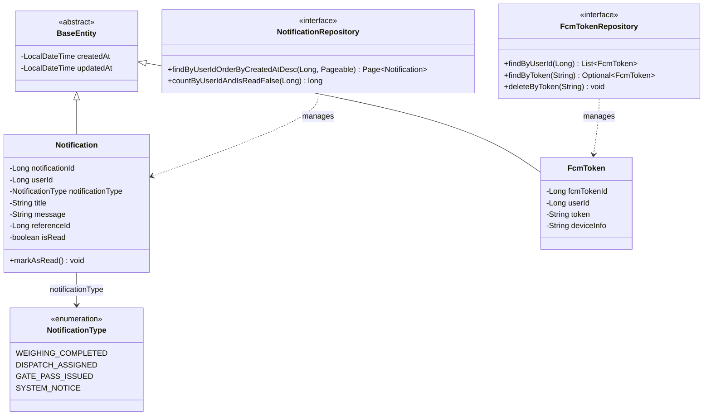
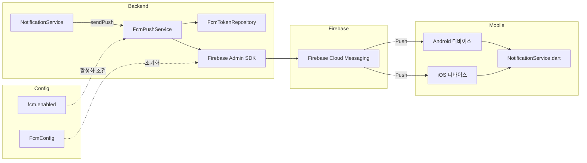
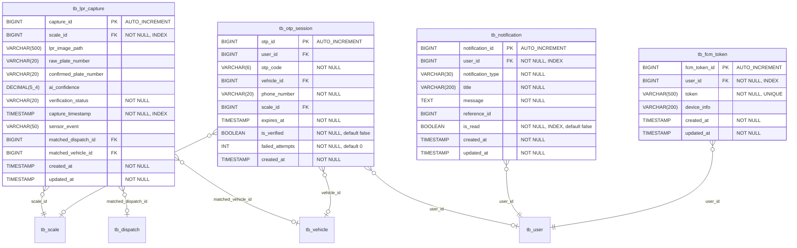
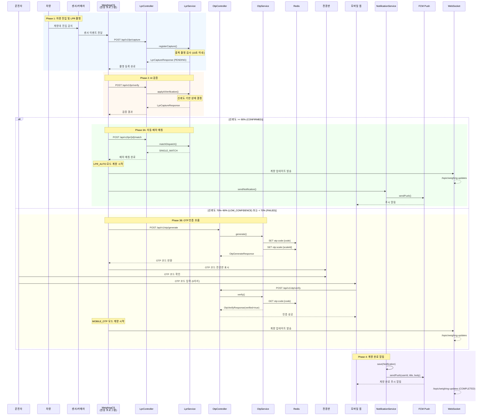

# LPR / OTP / 알림 모듈 상세 설계서

| 항목 | 내용 |
|------|------|
| **문서 버전** | 1.0 |
| **작성일** | 2026-01-29 |
| **프로젝트** | 부산 스마트 계량 시스템 (Busan Smart Weighing System) |
| **대상 모듈** | LPR (차량번호인식), OTP (일회용 비밀번호), Notification (알림) |
| **패키지 경로** | `com.dongkuk.weighing.lpr`, `com.dongkuk.weighing.otp`, `com.dongkuk.weighing.notification`, `com.dongkuk.weighing.websocket` |

---

## 목차

1. [LPR 모듈 개요](#1-lpr-모듈-개요)
2. [LPR 도메인 모델](#2-lpr-도메인-모델)
3. [LPR API 설계](#3-lpr-api-설계)
4. [LPR 서비스 로직](#4-lpr-서비스-로직)
5. [OTP 모듈 개요](#5-otp-모듈-개요)
6. [OTP 도메인 모델](#6-otp-도메인-모델)
7. [OTP API 설계](#7-otp-api-설계)
8. [OTP 서비스 로직](#8-otp-서비스-로직)
9. [알림 모듈 개요](#9-알림-모듈-개요)
10. [알림 도메인 모델](#10-알림-도메인-모델)
11. [알림 API 설계](#11-알림-api-설계)
12. [FCM 푸시 알림 서비스](#12-fcm-푸시-알림-서비스)
13. [WebSocket 실시간 알림](#13-websocket-실시간-알림)
14. [DTO 명세](#14-dto-명세)
15. [데이터베이스 설계](#15-데이터베이스-설계)
16. [통합 시퀀스 다이어그램](#16-통합-시퀀스-다이어그램)
17. [비즈니스 규칙 요약](#17-비즈니스-규칙-요약)

---

## 1. LPR 모듈 개요

### 1.1 목적

LPR(License Plate Recognition) 모듈은 계량대에 진입하는 차량의 번호판을 카메라로 촬영하고, AI 기반 인식 엔진을 통해 차량번호를 자동 추출한다. 인식된 차량번호를 기반으로 당일 배차 정보와 자동 매칭하여, 운전자의 수동 입력 없이 계량 프로세스를 시작할 수 있도록 한다.

### 1.2 핵심 기능

| 기능 | 설명 |
|------|------|
| LPR 촬영 등록 | 계량대 카메라에서 촬영한 이미지 및 원본 인식 결과를 등록한다 |
| AI 검증 적용 | AI 모델의 분석 결과(확정 차량번호, 신뢰도)를 촬영 기록에 반영한다 |
| 배차 자동 매칭 | 인식된 차량번호로 차량 마스터를 조회하고 당일 유효 배차를 매칭한다 |
| 중복 촬영 방지 | 동일 계량대에서 동일 차량의 10초 이내 중복 촬영을 차단한다 |
| 촬영 이력 조회 | 촬영 기록의 단건 조회 및 계량대별 최신 기록 조회를 제공한다 |

### 1.3 모듈 구조

```
com.dongkuk.weighing.lpr/
├── controller/
│   └── LprController.java           # REST API 엔드포인트
├── service/
│   └── LprService.java              # 비즈니스 로직
├── domain/
│   ├── LprCapture.java              # 촬영 기록 엔티티
│   ├── VerificationStatus.java      # 검증 상태 열거형
│   └── LprCaptureRepository.java    # 데이터 접근 계층
└── dto/
    ├── LprCaptureRequest.java        # 촬영 등록 요청 DTO
    ├── LprCaptureResponse.java       # 촬영 결과 응답 DTO
    ├── AiVerificationRequest.java    # AI 검증 요청 DTO
    └── DispatchMatchResponse.java    # 배차 매칭 결과 응답 DTO
```

### 1.4 외부 의존성

- `dispatch` 모듈: 배차 매칭을 위한 `DispatchRepository`, `DispatchStatus` 참조
- `master` 모듈: 차량번호 기반 차량 조회를 위한 `VehicleRepository` 참조
- `global` 모듈: `BaseEntity` (감사 필드), `ApiResponse` (공통 응답), `BusinessException` (예외 처리)

---

## 2. LPR 도메인 모델

### 2.1 클래스 다이어그램



### 2.2 LprCapture 엔티티

LPR 카메라로 촬영된 차량번호 인식 결과를 관리하는 핵심 도메인 엔티티이다.

| 필드명 | 타입 | DB 컬럼 | 제약 조건 | 설명 |
|--------|------|---------|-----------|------|
| `captureId` | `Long` | `capture_id` | PK, AUTO_INCREMENT | 촬영 기록 고유 ID |
| `scaleId` | `Long` | `scale_id` | NOT NULL, INDEX | 촬영 발생 계량대 ID |
| `lprImagePath` | `String` | `lpr_image_path` | VARCHAR(500) | 촬영 이미지 저장 경로 |
| `rawPlateNumber` | `String` | `raw_plate_number` | VARCHAR(20) | AI 원본 인식 차량번호 |
| `confirmedPlateNumber` | `String` | `confirmed_plate_number` | VARCHAR(20) | AI 검증 후 확정 차량번호 |
| `aiConfidence` | `BigDecimal` | `ai_confidence` | DECIMAL(5,4) | AI 인식 신뢰도 (0.0000~1.0000) |
| `verificationStatus` | `VerificationStatus` | `verification_status` | NOT NULL, VARCHAR(20) | 검증 상태 |
| `captureTimestamp` | `LocalDateTime` | `capture_timestamp` | NOT NULL, INDEX | 촬영 일시 |
| `sensorEvent` | `String` | `sensor_event` | VARCHAR(50) | 센서 이벤트 유형 |
| `matchedDispatchId` | `Long` | `matched_dispatch_id` | NULLABLE | 매칭된 배차 ID |
| `matchedVehicleId` | `Long` | `matched_vehicle_id` | NULLABLE | 매칭된 차량 ID |
| `createdAt` | `LocalDateTime` | `created_at` | NOT NULL | 생성일시 (BaseEntity) |
| `updatedAt` | `LocalDateTime` | `updated_at` | NOT NULL | 수정일시 (BaseEntity) |

### 2.3 VerificationStatus 열거형

AI 번호판 인식 결과에 대한 검증 상태를 정의한다. 신뢰도 임계값에 따라 자동 결정된다.

| 값 | 한글명 | 신뢰도 범위 | 후속 처리 |
|----|--------|-------------|-----------|
| `PENDING` | 대기 | - | AI 검증 수행 전 초기 상태 |
| `CONFIRMED` | 확인 | 90% 이상 | 자동 계량 진행 가능 (LPR_AUTO 모드) |
| `LOW_CONFIDENCE` | 저신뢰 | 70%~90% 미만 | OTP 인증으로 본인 확인 필요 |
| `FAILED` | 실패 | 70% 미만 | 수동 확인 또는 재촬영 필요 |

### 2.4 도메인 메서드

#### `applyAiVerification(String confirmedPlateNumber, BigDecimal aiConfidence)`

AI 검증 결과를 촬영 기록에 적용한다. 신뢰도에 따라 검증 상태를 자동 결정한다.

```
신뢰도 >= 0.90  -->  CONFIRMED     (자동 확인)
신뢰도 >= 0.70  -->  LOW_CONFIDENCE (OTP 인증 필요)
신뢰도 <  0.70  -->  FAILED         (수동 확인 필요)
```

#### `applyDispatchMatch(Long dispatchId, Long vehicleId)`

배차 매칭 결과를 촬영 기록에 반영한다. 단건 매칭 시 배차 ID와 차량 ID 모두 기록하고, 다건 매칭 시 차량 ID만 기록한다.

#### `requiresOtp() : boolean`

OTP 인증이 필요한 상태인지 판별한다. `LOW_CONFIDENCE` 또는 `FAILED` 상태일 때 `true`를 반환한다.

---

## 3. LPR API 설계

**Base URL**: `/api/v1/lpr`

### 3.1 엔드포인트 목록

| HTTP | 경로 | 설명 | 요청 | 응답 |
|------|------|------|------|------|
| POST | `/capture` | LPR 촬영 등록 | `LprCaptureRequest` | `LprCaptureResponse` (201) |
| POST | `/verify` | AI 검증 결과 적용 | `AiVerificationRequest` | `LprCaptureResponse` (200) |
| POST | `/{captureId}/match` | 배차 자동 매칭 | Path: `captureId` | `DispatchMatchResponse` (200) |
| GET | `/{captureId}` | 촬영 기록 단건 조회 | Path: `captureId` | `LprCaptureResponse` (200) |
| GET | `/scale/{scaleId}/latest` | 계량대별 최신 촬영 조회 | Path: `scaleId` | `LprCaptureResponse` (200) |

### 3.2 POST /capture - LPR 촬영 등록

계량대 카메라에서 촬영된 차량번호판 이미지와 인식 결과를 등록한다.

**요청 본문** (`LprCaptureRequest`):

```json
{
  "scale_id": 1,
  "sensor_event": "ENTRY",
  "lpr_image_path": "/images/lpr/2026/01/29/capture_001.jpg",
  "raw_plate_number": "12가3456",
  "capture_timestamp": "2026-01-29T10:30:00"
}
```

**성공 응답** (HTTP 201):

```json
{
  "success": true,
  "data": {
    "capture_id": 101,
    "scale_id": 1,
    "lpr_image_path": "/images/lpr/2026/01/29/capture_001.jpg",
    "raw_plate_number": "12가3456",
    "confirmed_plate_number": null,
    "ai_confidence": null,
    "verification_status": "PENDING",
    "capture_timestamp": "2026-01-29T10:30:00",
    "matched_dispatch_id": null,
    "matched_vehicle_id": null,
    "created_at": "2026-01-29T10:30:01"
  },
  "error": null
}
```

### 3.3 POST /verify - AI 검증 결과 적용

AI 모델의 분석 결과를 촬영 기록에 반영한다.

**요청 본문** (`AiVerificationRequest`):

```json
{
  "capture_id": 101,
  "confirmed_plate_number": "12가3456",
  "ai_confidence": 0.9520
}
```

**성공 응답** (HTTP 200):

```json
{
  "success": true,
  "data": {
    "capture_id": 101,
    "scale_id": 1,
    "lpr_image_path": "/images/lpr/2026/01/29/capture_001.jpg",
    "raw_plate_number": "12가3456",
    "confirmed_plate_number": "12가3456",
    "ai_confidence": 0.9520,
    "verification_status": "CONFIRMED",
    "capture_timestamp": "2026-01-29T10:30:00",
    "matched_dispatch_id": null,
    "matched_vehicle_id": null,
    "created_at": "2026-01-29T10:30:01"
  },
  "error": null
}
```

### 3.4 POST /{captureId}/match - 배차 자동 매칭

인식된 차량번호를 기반으로 차량 마스터 및 당일 배차를 자동 매칭한다.

**성공 응답** (HTTP 200) - 단건 매칭 시:

```json
{
  "success": true,
  "data": {
    "match_result": "SINGLE_MATCH",
    "vehicle_id": 5,
    "plate_number": "12가3456",
    "dispatches": [
      {
        "dispatch_id": 42,
        "item_type": "STEEL",
        "item_name": "열연코일",
        "dispatch_date": "2026-01-29",
        "status": "REGISTERED"
      }
    ]
  },
  "error": null
}
```

**매칭 결과 유형**:

| match_result | 설명 | 후속 처리 |
|--------------|------|-----------|
| `SINGLE_MATCH` | 단건 배차 매칭 성공 | 배차 ID + 차량 ID 자동 연결, 계량 진행 |
| `MULTIPLE_MATCH` | 다건 배차 매칭 | 차량 ID만 연결, 운영자가 배차 수동 선택 |
| `NO_DISPATCH` | 차량은 존재하나 당일 배차 없음 | 운영자 확인 필요 |
| `NO_VEHICLE` | 미등록 차량 | 차량 등록 또는 수동 입력 필요 |

---

## 4. LPR 서비스 로직

### 4.1 AI 검증 흐름



### 4.2 배차 매칭 시퀀스 다이어그램



### 4.3 중복 촬영 방지 로직

`LprService.registerCapture` 메서드는 다음 조건으로 중복 촬영을 방지한다.

- **시간 조건**: 요청 촬영시각 기준 10초 이내
- **위치 조건**: 동일 계량대(scaleId)
- **차량 조건**: 동일 원본 차량번호(rawPlateNumber)
- **처리 방식**: 중복 판정 시 신규 기록을 생성하지 않고 기존 촬영 결과를 반환한다

```
DUPLICATE_CAPTURE_SECONDS = 10
조회: captureRepository.findRecentByScaleId(scaleId, timestamp - 10초)
판정: recent.stream().anyMatch(rawPlateNumber 일치)
```

---

## 5. OTP 모듈 개요

### 5.1 목적

OTP(One-Time Password) 모듈은 LPR AI 인식 신뢰도가 낮은 경우(LOW_CONFIDENCE 또는 FAILED) 운전자의 본인 확인을 위해 6자리 일회용 비밀번호를 생성하고 검증한다. 현장 계량 프로그램(CS)이 OTP를 생성하면 전광판에 표시하고, 운전자가 모바일 앱에서 해당 코드를 입력하여 인증한다.

### 5.2 핵심 기능

| 기능 | 설명 |
|------|------|
| OTP 코드 생성 | SecureRandom 기반 6자리 숫자 코드 생성, Redis TTL 저장 |
| 전광판 표시 연계 | 계량대별 현재 OTP 코드를 Redis에 저장하여 전광판에 표시 |
| OTP 검증 | 모바일 앱에서 입력한 코드와 전화번호로 운전자 본인 확인 |
| 실패 횟수 추적 | 최대 실패 횟수 초과 시 OTP 자동 무효화 |
| 감사 로그 | DB에 OTP 발급 이력을 보관하여 추적성 확보 |

### 5.3 모듈 구조

```
com.dongkuk.weighing.otp/
├── controller/
│   └── OtpController.java           # REST API 엔드포인트
├── service/
│   └── OtpService.java              # 비즈니스 로직
├── config/
│   └── OtpProperties.java           # 설정 속성 바인딩
├── domain/
│   ├── OtpSession.java              # OTP 세션 감사 엔티티
│   └── OtpSessionRepository.java    # 데이터 접근 계층
└── dto/
    ├── OtpGenerateRequest.java       # OTP 생성 요청 DTO
    ├── OtpGenerateResponse.java      # OTP 생성 응답 DTO
    ├── OtpVerifyRequest.java         # OTP 검증 요청 DTO
    └── OtpVerifyResponse.java        # OTP 검증 응답 DTO
```

### 5.4 저장소 이중 구조

OTP 모듈은 **Redis**(실시간 세션 관리)와 **RDB**(감사 로그) 이중 저장 구조를 사용한다.

| 저장소 | 역할 | 데이터 | TTL |
|--------|------|--------|-----|
| **Redis** | 실시간 OTP 세션 관리 | OTP 코드, 차량/계량대 매핑, 실패 횟수 | 설정값 (기본 300초) |
| **PostgreSQL** | 감사 로그 보관 | OTP 발급 이력, 검증 상태, 실패 횟수 | 영구 |

---

## 6. OTP 도메인 모델

### 6.1 클래스 다이어그램



### 6.2 OtpSession 엔티티 (DB 감사 로그)

| 필드명 | 타입 | DB 컬럼 | 제약 조건 | 설명 |
|--------|------|---------|-----------|------|
| `otpId` | `Long` | `otp_id` | PK, AUTO_INCREMENT | OTP 세션 고유 ID |
| `userId` | `Long` | `user_id` | NULLABLE | 연결된 사용자 ID (검증 후 설정) |
| `otpCode` | `String` | `otp_code` | NOT NULL, VARCHAR(6) | OTP 코드 (6자리 숫자) |
| `vehicleId` | `Long` | `vehicle_id` | NULLABLE | 연결된 차량 ID |
| `phoneNumber` | `String` | `phone_number` | NOT NULL, VARCHAR(20) | 검증 시 사용된 전화번호 |
| `scaleId` | `Long` | `scale_id` | NULLABLE | 연결된 계량대 ID |
| `expiresAt` | `LocalDateTime` | `expires_at` | NOT NULL | OTP 만료 시각 |
| `isVerified` | `boolean` | `is_verified` | NOT NULL, 기본값 false | 검증 완료 여부 |
| `failedAttempts` | `int` | `failed_attempts` | NOT NULL, 기본값 0 | 검증 실패 횟수 |
| `createdAt` | `LocalDateTime` | `created_at` | NOT NULL | 생성일시 (JPA Auditing) |

**인덱스**:
- `idx_otp_code_expires`: (`otp_code`, `expires_at`) - OTP 코드 유효성 빠른 조회
- `idx_otp_phone`: (`phone_number`) - 전화번호 기반 조회

### 6.3 Redis 키 구조

| Redis 키 패턴 | 용도 | 값 형식 | TTL |
|----------------|------|---------|-----|
| `otp:code:{otpCode}` | OTP 세션 데이터 | JSON: `{"vehicle_id", "plate_number", "scale_id"}` | `ttlSeconds` |
| `otp:scale:{scaleId}` | 계량대별 현재 OTP 코드 | 문자열: OTP 코드 | `ttlSeconds` |
| `otp:fail:{otpCode}` | OTP 검증 실패 횟수 | 정수 문자열 | 자동 만료 |
| `otp:verified:{phoneNumber}` | OTP 인증 완료 표시 | OTP 코드 | 5분 |

### 6.4 OtpProperties 설정

`application.yml`의 `otp` 접두사에서 바인딩되는 설정 값이다.

| 속성 | 설명 | 기본값 (권장) |
|------|------|---------------|
| `codeLength` | OTP 코드 자릿수 | 6 |
| `ttlSeconds` | OTP 유효 시간 (초) | 300 (5분) |
| `maxFailedAttempts` | 최대 실패 허용 횟수 | 5 |

---

## 7. OTP API 설계

**Base URL**: `/api/v1/otp`

### 7.1 엔드포인트 목록

| HTTP | 경로 | 설명 | 호출 주체 | 요청 | 응답 |
|------|------|------|-----------|------|------|
| POST | `/generate` | OTP 코드 생성 | CS 프로그램 | `OtpGenerateRequest` | `OtpGenerateResponse` (200) |
| POST | `/verify` | OTP 코드 검증 | 모바일 앱 | `OtpVerifyRequest` | `OtpVerifyResponse` (200) |

### 7.2 POST /generate - OTP 코드 생성

현장 CS 프로그램에서 계량대에 차량이 진입할 때 호출한다.

**요청 본문** (`OtpGenerateRequest`):

```json
{
  "scale_id": 1,
  "vehicle_id": 5,
  "plate_number": "12가3456"
}
```

**성공 응답** (HTTP 200):

```json
{
  "success": true,
  "data": {
    "otp_code": "482917",
    "expires_at": "2026-01-29T10:35:00",
    "ttl_seconds": 300
  },
  "error": null
}
```

### 7.3 POST /verify - OTP 코드 검증

모바일 앱에서 운전자가 OTP 코드와 전화번호를 입력하여 인증한다.

**요청 본문** (`OtpVerifyRequest`):

```json
{
  "otp_code": "482917",
  "phone_number": "010-1234-5678"
}
```

**유효성 검증 규칙**:
- `otpCode`: 6자리 숫자만 허용 (`^\d{6}$`)
- `phoneNumber`: 한국 휴대전화 형식 (`^01[016789]-\d{3,4}-\d{4}$`)

**성공 응답** (HTTP 200):

```json
{
  "success": true,
  "data": {
    "verified": true,
    "vehicle_id": 5,
    "plate_number": "12가3456",
    "dispatch_id": null
  },
  "error": null
}
```

**오류 응답**:

| 에러 코드 | 상황 | HTTP 상태 |
|-----------|------|-----------|
| `OTP_001` | OTP 만료 또는 존재하지 않음 | 400 |
| `OTP_002` | 미등록 전화번호 | 400 |
| `OTP_003` | 최대 실패 횟수 초과 (OTP 무효화) | 400 |

---

## 8. OTP 서비스 로직

### 8.1 OTP 생성 프로세스

1. `SecureRandom`으로 설정된 자릿수(기본 6자리)의 OTP 코드를 생성한다
2. Redis `otp:code:{otpCode}` 키에 세션 JSON (`vehicleId`, `plateNumber`, `scaleId`)을 TTL과 함께 저장한다
3. Redis `otp:scale:{scaleId}` 키에 OTP 코드를 저장한다 (전광판 표시용)
4. DB `tb_otp_session` 테이블에 감사 로그를 저장한다
5. 생성된 OTP 코드, 만료 시각, TTL을 응답으로 반환한다

### 8.2 OTP 검증 프로세스

1. Redis `otp:code:{otpCode}`에서 세션 데이터를 조회한다 (없으면 OTP_001 예외)
2. Redis `otp:fail:{otpCode}`에서 실패 횟수를 확인한다 (초과 시 OTP_003 예외, Redis 키 삭제)
3. 요청된 전화번호로 사용자를 조회한다 (미등록 시 OTP_002 예외)
4. 세션 데이터에서 차량 정보(vehicleId, plateNumber)를 추출한다
5. 검증 성공 시 Redis `otp:code:{otpCode}` 및 `otp:fail:{otpCode}` 키를 삭제한다 (일회용)
6. `otp:verified:{phoneNumber}` 키를 5분 TTL로 저장하여 OTP 기반 로그인과 연계한다
7. 검증 결과를 응답으로 반환한다

### 8.3 전체 흐름 시퀀스 다이어그램



### 8.4 모바일 앱 OTP 입력 화면

`OtpInputScreen` (Flutter)은 다음 기능을 제공한다.

| 기능 | 설명 |
|------|------|
| 6자리 OTP 표시 영역 | 각 자릿수를 개별 박스로 표시하며, 입력 상태에 따라 색상이 변경된다 |
| 커스텀 숫자 키패드 | 4x3 그리드 (1~9, C, 0, 백스페이스)로 구성된 전용 키패드이다 |
| 5분 카운트다운 타이머 | MM:SS 형식으로 남은 시간을 표시하며, 만료 시 오류 상태로 전환한다 |
| 만료 시 재요청 | 타이머 만료 후 "OTP 재요청" 버튼을 표시한다 |
| 인증 처리 | 6자리 입력 완료 시 `DispatchProvider.verifyOtp()`를 호출하고, 성공 시 `Navigator.pop(context, true)`로 결과를 반환한다 |
| 실패 처리 | 인증 실패 시 오류 메시지를 표시하고 입력 코드를 초기화한다 |

---

## 9. 알림 모듈 개요

### 9.1 목적

알림 모듈은 계량 시스템에서 발생하는 비즈니스 이벤트(계량 완료, 배차 배정, 출문증 발행 등)를 사용자에게 인앱 알림과 FCM 푸시 알림으로 전달한다. 알림 목록 관리, 읽음 상태 추적, FCM 토큰 라이프사이클 관리를 포함한다.

### 9.2 핵심 기능

| 기능 | 설명 |
|------|------|
| 인앱 알림 생성 | 비즈니스 이벤트 발생 시 DB에 알림 레코드를 생성한다 |
| FCM 푸시 발송 | Firebase Cloud Messaging을 통해 모바일 디바이스에 푸시 알림을 전송한다 |
| 알림 목록 조회 | 사용자별 알림 목록을 최신순 페이징 조회한다 |
| 읽음 처리 | 개별 알림의 읽음 상태를 변경한다 (소유자 검증 포함) |
| 미읽음 건수 조회 | 배지 표시를 위한 미읽음 알림 건수를 조회한다 |
| FCM 토큰 관리 | 디바이스 토큰 등록/해제를 관리한다 (중복 등록 방지) |

### 9.3 모듈 구조

```
com.dongkuk.weighing.notification/
├── controller/
│   └── NotificationController.java   # REST API 엔드포인트
├── service/
│   ├── NotificationService.java       # 알림 비즈니스 로직
│   └── FcmPushService.java           # FCM 푸시 발송 서비스
├── config/
│   └── FcmConfig.java                # Firebase Admin SDK 초기화
├── domain/
│   ├── Notification.java             # 알림 엔티티
│   ├── NotificationType.java         # 알림 유형 열거형
│   ├── NotificationRepository.java    # 알림 데이터 접근 계층
│   ├── FcmToken.java                 # FCM 토큰 엔티티
│   └── FcmTokenRepository.java       # FCM 토큰 데이터 접근 계층
└── dto/
    ├── FcmTokenRegisterRequest.java   # FCM 토큰 등록 요청 DTO
    ├── NotificationResponse.java      # 알림 응답 DTO
    └── UnreadCountResponse.java       # 미읽음 건수 응답 DTO
```

### 9.4 알림 전달 채널

| 채널 | 대상 | 기술 | 용도 |
|------|------|------|------|
| **인앱 알림** | 웹/모바일 | DB 저장 + REST API | 알림 목록 조회, 읽음 관리 |
| **FCM 푸시** | 모바일 | Firebase Cloud Messaging | 앱 비활성 상태 시 디바이스 알림 |
| **WebSocket** | 웹 프론트엔드 | STOMP over SockJS | 실시간 계량/장비 상태 브로드캐스트 |

---

## 10. 알림 도메인 모델

### 10.1 클래스 다이어그램



### 10.2 Notification 엔티티

| 필드명 | 타입 | DB 컬럼 | 제약 조건 | 설명 |
|--------|------|---------|-----------|------|
| `notificationId` | `Long` | `notification_id` | PK, AUTO_INCREMENT | 알림 고유 ID |
| `userId` | `Long` | `user_id` | NOT NULL, INDEX | 수신 사용자 ID |
| `notificationType` | `NotificationType` | `notification_type` | NOT NULL, VARCHAR(30) | 알림 유형 |
| `title` | `String` | `title` | NOT NULL, VARCHAR(200) | 알림 제목 |
| `message` | `String` | `message` | NOT NULL, TEXT | 알림 내용 |
| `referenceId` | `Long` | `reference_id` | NULLABLE | 참조 엔티티 ID |
| `isRead` | `boolean` | `is_read` | NOT NULL, INDEX, 기본값 false | 읽음 여부 |
| `createdAt` | `LocalDateTime` | `created_at` | NOT NULL | 생성일시 (BaseEntity) |
| `updatedAt` | `LocalDateTime` | `updated_at` | NOT NULL | 수정일시 (BaseEntity) |

### 10.3 NotificationType 열거형

| 값 | 한글명 | 설명 | 수신 대상 |
|----|--------|------|-----------|
| `WEIGHING_COMPLETED` | 계량 완료 | 차량 계량이 완료되었을 때 | 운전자(DRIVER), 관리자(MANAGER) |
| `DISPATCH_ASSIGNED` | 배차 배정 | 운전자에게 새 배차가 배정되었을 때 | 운전자(DRIVER) |
| `GATE_PASS_ISSUED` | 출문증 발행 | 출문증이 발행되었을 때 | 운전자(DRIVER) |
| `SYSTEM_NOTICE` | 시스템 공지 | 시스템 전체 공지사항 | 전체 사용자 |

### 10.4 FcmToken 엔티티

| 필드명 | 타입 | DB 컬럼 | 제약 조건 | 설명 |
|--------|------|---------|-----------|------|
| `fcmTokenId` | `Long` | `fcm_token_id` | PK, AUTO_INCREMENT | FCM 토큰 고유 ID |
| `userId` | `Long` | `user_id` | NOT NULL, INDEX | 토큰 소유 사용자 ID |
| `token` | `String` | `token` | NOT NULL, UNIQUE, VARCHAR(500) | FCM 디바이스 토큰 |
| `deviceInfo` | `String` | `device_info` | VARCHAR(200) | 디바이스 정보 (기기명, OS 등) |
| `createdAt` | `LocalDateTime` | `created_at` | NOT NULL | 생성일시 (BaseEntity) |
| `updatedAt` | `LocalDateTime` | `updated_at` | NOT NULL | 수정일시 (BaseEntity) |

**사용자:토큰 관계**: 1:N (한 사용자가 여러 디바이스 등록 가능)

---

## 11. 알림 API 설계

**Base URL**: `/api/v1/notifications`

### 11.1 엔드포인트 목록

| HTTP | 경로 | 설명 | 인증 | 요청 | 응답 |
|------|------|------|------|------|------|
| GET | `/` | 알림 목록 페이징 조회 | JWT | Query: `page`, `size` | `Page<NotificationResponse>` |
| PUT | `/{notificationId}/read` | 알림 읽음 처리 | JWT | Path: `notificationId` | `NotificationResponse` |
| GET | `/unread-count` | 미읽음 알림 건수 조회 | JWT | - | `UnreadCountResponse` |
| POST | `/push/register` | FCM 토큰 등록 | JWT | `FcmTokenRegisterRequest` | `Void` |
| DELETE | `/push/unregister` | FCM 토큰 해제 | - | Query: `token` | `Void` |

### 11.2 GET / - 알림 목록 조회

로그인한 사용자의 알림 목록을 최신순으로 페이징 조회한다.

**요청**: `GET /api/v1/notifications?page=0&size=20`

**성공 응답** (HTTP 200):

```json
{
  "success": true,
  "data": {
    "content": [
      {
        "notification_id": 1,
        "notification_type": "WEIGHING_COMPLETED",
        "title": "계량 완료",
        "message": "12가3456 차량의 계량이 완료되었습니다. 순중량: 25,000kg",
        "reference_id": 42,
        "is_read": false,
        "created_at": "2026-01-29T10:45:00"
      }
    ],
    "total_elements": 15,
    "total_pages": 1,
    "number": 0,
    "size": 20
  },
  "error": null
}
```

### 11.3 PUT /{notificationId}/read - 알림 읽음 처리

본인의 알림만 읽음 처리할 수 있다. 타 사용자의 알림에 접근 시 `AUTH_007` 오류가 발생한다.

**성공 응답** (HTTP 200):

```json
{
  "success": true,
  "data": {
    "notification_id": 1,
    "notification_type": "WEIGHING_COMPLETED",
    "title": "계량 완료",
    "message": "12가3456 차량의 계량이 완료되었습니다.",
    "reference_id": 42,
    "is_read": true,
    "created_at": "2026-01-29T10:45:00"
  },
  "error": null
}
```

### 11.4 GET /unread-count - 미읽음 건수 조회

```json
{
  "success": true,
  "data": {
    "unread_count": 3
  },
  "error": null
}
```

### 11.5 POST /push/register - FCM 토큰 등록

**요청 본문** (`FcmTokenRegisterRequest`):

```json
{
  "token": "fMI3Y5K8R6u...(FCM 디바이스 토큰)...",
  "device_info": "Samsung Galaxy S24 / Android 15"
}
```

**성공 응답** (HTTP 200):

```json
{
  "success": true,
  "data": null,
  "message": "FCM 토큰이 등록되었습니다",
  "error": null
}
```

### 11.6 DELETE /push/unregister - FCM 토큰 해제

**요청**: `DELETE /api/v1/notifications/push/unregister?token=fMI3Y5K8R6u...`

```json
{
  "success": true,
  "data": null,
  "message": "FCM 토큰이 해제되었습니다",
  "error": null
}
```

---

## 12. FCM 푸시 알림 서비스

### 12.1 아키텍처



### 12.2 FcmConfig - Firebase 초기화

`FcmConfig`는 `@ConditionalOnProperty(name = "fcm.enabled", havingValue = "true")` 조건으로 활성화된다.

| 설정 | 환경변수 | 설명 |
|------|----------|------|
| `fcm.enabled` | `FCM_ENABLED` | FCM 기능 활성화 여부 (true/false) |
| `fcm.service-account-file` | `FCM_SERVICE_ACCOUNT_FILE` | Google 서비스 계정 JSON 파일 경로 |

`@PostConstruct`에서 `FirebaseApp.getApps().isEmpty()` 검사로 중복 초기화를 방지하고, `GoogleCredentials.fromStream()`으로 서비스 계정 인증을 수행한다.

### 12.3 FcmPushService - 푸시 발송 로직

`sendPush(Long userId, String title, String body)` 메서드의 처리 흐름은 다음과 같다.

1. `FcmTokenRepository.findByUserId(userId)`로 사용자의 모든 FCM 토큰을 조회한다
2. 토큰이 없으면 로그만 기록하고 건너뛴다
3. 각 디바이스 토큰에 대해 `sendToDevice()`를 순차 호출한다

**sendToDevice 분기 로직**:

| 조건 | 동작 |
|------|------|
| `fcmEnabled == false` | 스텁 로그 기록 (`[FCM STUB]`) |
| `FirebaseApp.getApps().isEmpty()` | 스텁 로그 기록 |
| 정상 상태 | `FirebaseMessaging.getInstance().send(message)` 실제 발송 |
| `FirebaseMessagingException` 발생 | 오류 로그 기록, 예외 전파하지 않음 |

**FCM 메시지 구성**:

```java
Message.builder()
    .setToken(token)
    .setNotification(Notification.builder()
        .setTitle(title)
        .setBody(body)
        .build())
    .build()
```

### 12.4 모바일 앱 FCM 서비스 (Flutter)

`NotificationService` (Dart)는 다음 초기화 과정을 수행한다.

| 단계 | 메서드 | 설명 |
|------|--------|------|
| 1 | `_requestPermission()` | iOS, Android 13+ 알림 권한 요청 |
| 2 | `onBackgroundMessage()` | 백그라운드 메시지 핸들러 등록 |
| 3 | `_initializeLocalNotifications()` | 로컬 알림 플러그인 + Android 채널 생성 |
| 4 | `onMessage.listen()` | 포그라운드 메시지 리스너 등록 |
| 5 | `onMessageOpenedApp.listen()` | 알림 탭 리스너 등록 |
| 6 | `getToken()` | FCM 토큰 획득 및 서버 등록 |
| 7 | `onTokenRefresh.listen()` | 토큰 갱신 시 자동 재등록 |

**Android 알림 채널**:

| 속성 | 값 |
|------|-----|
| 채널 ID | `busan_weighing_channel` |
| 채널 이름 | `부산 스마트 계량 알림` |
| 설명 | `계량 상태 변경 및 공지사항 알림` |
| 중요도 | `Importance.high` |

---

## 13. WebSocket 실시간 알림

### 13.1 WebSocketNotificationService 개요

STOMP 프로토콜 기반의 실시간 메시지 브로드캐스트 서비스이다. `SimpMessagingTemplate`을 사용하여 구독 중인 모든 클라이언트에 이벤트를 전송한다.

**연결 정보**:
- WebSocket 엔드포인트: `/ws` (SockJS 폴백 지원)
- 구독 접두어: `/topic/*` (서버 -> 클라이언트)
- 전송 접두어: `/app/*` (클라이언트 -> 서버)
- 인증: JWT 토큰 필요

### 13.2 메시지 토픽 및 타입

| 토픽 | 메시지 타입 | 설명 | 발행 시점 |
|------|------------|------|-----------|
| `/topic/weighing-updates` | `WeighingUpdateMessage` | 계량 실적 변경 알림 | 계량 상태/중량 변경 시 |
| `/topic/scale-status` | `ScaleStatusMessage` | 계근대 상태 변경 알림 | 계근대 활성/유지보수/비활성 전환 시 |
| `/topic/device-status` | `DeviceStatusResponse` | 장비 상태 변경 알림 | 장비 연결/해제/오류 발생 시 |

### 13.3 WeighingUpdateMessage

계량 실적이 변경될 때 전송되는 메시지이다.

| 필드 | 타입 | 설명 |
|------|------|------|
| `weighingId` | `Long` | 계량 실적 ID |
| `dispatchId` | `Long` | 연결된 배차 ID |
| `weighingStatus` | `String` | 계량 상태: `IN_PROGRESS`, `COMPLETED`, `RE_WEIGHING`, `CANCELLED` |
| `weighingMode` | `String` | 계량 모드: `LPR_AUTO`, `MOBILE_OTP`, `MANUAL`, `RE_WEIGH` |
| `grossWeight` | `BigDecimal` | 총중량 (kg) |
| `tareWeight` | `BigDecimal` | 공차중량 (kg) |
| `netWeight` | `BigDecimal` | 순중량 (kg) |
| `lprPlateNumber` | `String` | LPR 인식 차량번호 |
| `timestamp` | `LocalDateTime` | 메시지 발생 시각 |

### 13.4 ScaleStatusMessage

계근대(저울)의 상태가 변경될 때 전송되는 메시지이다.

| 필드 | 타입 | 설명 |
|------|------|------|
| `scaleId` | `Long` | 계근대 ID |
| `scaleName` | `String` | 계근대 이름 |
| `status` | `String` | 상태: `ACTIVE`, `MAINTENANCE`, `INACTIVE` |
| `timestamp` | `LocalDateTime` | 상태 변경 시각 |

### 13.5 DeviceStatusResponse

장비 연결 상태 변경 시 전송되는 메시지이다.

| 필드 | 타입 | 설명 |
|------|------|------|
| `deviceId` | `Long` | 장비 ID |
| `deviceCode` | `String` | 장비 코드 |
| `deviceName` | `String` | 장비명 |
| `deviceType` | `DeviceType` | 장비 유형 |
| `deviceTypeDesc` | `String` | 장비 유형 한글명 |
| `location` | `String` | 설치 위치 |
| `connectionStatus` | `ConnectionStatus` | 연결 상태 |
| `connectionStatusDesc` | `String` | 연결 상태 한글명 |
| `lastConnectedAt` | `LocalDateTime` | 마지막 연결 시각 |
| `ipAddress` | `String` | IP 주소 |
| `errorMessage` | `String` | 오류 메시지 |
| `isActive` | `boolean` | 활성 상태 |

---

## 14. DTO 명세

### 14.1 LPR 모듈 DTO

#### LprCaptureRequest (촬영 등록 요청)

```java
public record LprCaptureRequest(
    @NotNull Long scaleId,           // 계량대 ID (필수)
    @NotBlank String sensorEvent,    // 센서 이벤트 유형 (필수)
    String lprImagePath,             // 촬영 이미지 경로 (선택)
    String rawPlateNumber,           // 원본 인식 차량번호 (선택)
    @NotNull LocalDateTime captureTimestamp  // 촬영 일시 (필수)
) {}
```

#### AiVerificationRequest (AI 검증 요청)

```java
public record AiVerificationRequest(
    @NotNull Long captureId,              // LPR 촬영 ID (필수)
    String confirmedPlateNumber,           // AI 확정 차량번호 (선택)
    @NotNull BigDecimal aiConfidence       // AI 신뢰도 (필수, 0~1)
) {}
```

#### LprCaptureResponse (촬영 결과 응답)

```java
public record LprCaptureResponse(
    Long captureId,                    // 촬영 ID
    Long scaleId,                      // 계량대 ID
    String lprImagePath,               // 이미지 경로
    String rawPlateNumber,             // 원본 인식 번호
    String confirmedPlateNumber,       // 확정 번호
    BigDecimal aiConfidence,           // AI 신뢰도
    String verificationStatus,         // 검증 상태 (PENDING/CONFIRMED/LOW_CONFIDENCE/FAILED)
    LocalDateTime captureTimestamp,    // 촬영 일시
    Long matchedDispatchId,            // 매칭 배차 ID
    Long matchedVehicleId,             // 매칭 차량 ID
    LocalDateTime createdAt            // 생성일시
) {}
```

#### DispatchMatchResponse (배차 매칭 응답)

```java
public record DispatchMatchResponse(
    String matchResult,                // 매칭 결과 (SINGLE_MATCH/MULTIPLE_MATCH/NO_DISPATCH/NO_VEHICLE)
    Long vehicleId,                    // 차량 ID
    String plateNumber,                // 차량번호
    List<MatchedDispatchItem> dispatches  // 매칭된 배차 목록
) {
    public record MatchedDispatchItem(
        Long dispatchId,               // 배차 ID
        String itemType,               // 품목 유형
        String itemName,               // 품목명
        String dispatchDate,           // 배차 날짜
        String status                  // 배차 상태
    ) {}
}
```

### 14.2 OTP 모듈 DTO

#### OtpGenerateRequest (OTP 생성 요청)

```java
public record OtpGenerateRequest(
    @NotNull Long scaleId,             // 계량대 ID (필수)
    @NotNull Long vehicleId,           // 차량 ID (필수)
    @NotBlank @Size(max = 20) String plateNumber  // 차량번호 (필수, 최대 20자)
) {}
```

#### OtpGenerateResponse (OTP 생성 응답)

```java
public record OtpGenerateResponse(
    String otpCode,                    // 생성된 OTP 코드 (6자리)
    LocalDateTime expiresAt,           // 만료 시각
    int ttlSeconds                     // 유효 시간 (초)
) {}
```

#### OtpVerifyRequest (OTP 검증 요청)

```java
public record OtpVerifyRequest(
    @NotBlank @Pattern(regexp = "^\\d{6}$") String otpCode,  // OTP 코드 (6자리 숫자)
    @NotBlank @Pattern(regexp = "^01[016789]-\\d{3,4}-\\d{4}$") String phoneNumber  // 전화번호
) {}
```

#### OtpVerifyResponse (OTP 검증 응답)

```java
public record OtpVerifyResponse(
    boolean verified,                  // 검증 성공 여부
    Long vehicleId,                    // 차량 ID
    String plateNumber,                // 차량번호
    Long dispatchId                    // 배차 ID (해당 시)
) {}
```

### 14.3 알림 모듈 DTO

#### FcmTokenRegisterRequest (FCM 토큰 등록 요청)

```java
public record FcmTokenRegisterRequest(
    @NotBlank String token,            // FCM 디바이스 토큰 (필수)
    String deviceInfo                  // 디바이스 정보 (선택)
) {}
```

#### NotificationResponse (알림 응답)

```java
public record NotificationResponse(
    Long notificationId,               // 알림 ID
    NotificationType notificationType, // 알림 유형
    String title,                      // 제목
    String message,                    // 내용
    Long referenceId,                  // 참조 엔티티 ID
    boolean isRead,                    // 읽음 여부
    LocalDateTime createdAt            // 생성일시
) {}
```

#### UnreadCountResponse (미읽음 건수 응답)

```java
public record UnreadCountResponse(
    long unreadCount                   // 미읽음 알림 건수
) {}
```

### 14.4 WebSocket 메시지 DTO

#### WeighingUpdateMessage

```java
public record WeighingUpdateMessage(
    Long weighingId, Long dispatchId,
    String weighingStatus, String weighingMode,
    BigDecimal grossWeight, BigDecimal tareWeight, BigDecimal netWeight,
    String lprPlateNumber, LocalDateTime timestamp
) {}
```

#### ScaleStatusMessage

```java
public record ScaleStatusMessage(
    Long scaleId, String scaleName,
    String status, LocalDateTime timestamp
) {}
```

---

## 15. 데이터베이스 설계

### 15.1 ERD



### 15.2 인덱스 설계

#### tb_lpr_capture

| 인덱스명 | 컬럼 | 용도 |
|----------|------|------|
| `idx_lpr_scale` | `scale_id` | 계량대별 촬영 기록 조회 |
| `idx_lpr_capture_time` | `capture_timestamp` | 시간 범위 기반 촬영 기록 조회, 중복 촬영 방지 |

#### tb_otp_session

| 인덱스명 | 컬럼 | 용도 |
|----------|------|------|
| `idx_otp_code_expires` | `otp_code`, `expires_at` | OTP 코드 유효성 검증 시 빠른 조회 |
| `idx_otp_phone` | `phone_number` | 전화번호 기반 OTP 이력 조회 |

#### tb_notification

| 인덱스명 | 컬럼 | 용도 |
|----------|------|------|
| `idx_notification_user` | `user_id` | 사용자별 알림 목록 조회 |
| `idx_notification_read` | `is_read` | 미읽음 알림 건수 조회 |

#### tb_fcm_token

| 인덱스명 | 컬럼 | 용도 |
|----------|------|------|
| `idx_fcm_token_user` | `user_id` | 사용자별 FCM 토큰 조회 |
| `uk_fcm_token` | `token` (UNIQUE) | 토큰 중복 등록 방지 |

### 15.3 DDL 스크립트

```sql
-- LPR 촬영 기록 테이블
CREATE TABLE tb_lpr_capture (
    capture_id          BIGSERIAL PRIMARY KEY,
    scale_id            BIGINT NOT NULL REFERENCES tb_scale(scale_id),
    lpr_image_path      VARCHAR(500),
    raw_plate_number    VARCHAR(20),
    confirmed_plate_number VARCHAR(20),
    ai_confidence       DECIMAL(5,4),
    verification_status VARCHAR(20) NOT NULL DEFAULT 'PENDING',
    capture_timestamp   TIMESTAMP NOT NULL,
    sensor_event        VARCHAR(50),
    matched_dispatch_id BIGINT REFERENCES tb_dispatch(dispatch_id),
    matched_vehicle_id  BIGINT REFERENCES tb_vehicle(vehicle_id),
    created_at          TIMESTAMP NOT NULL DEFAULT CURRENT_TIMESTAMP,
    updated_at          TIMESTAMP NOT NULL DEFAULT CURRENT_TIMESTAMP
);

CREATE INDEX idx_lpr_scale ON tb_lpr_capture(scale_id);
CREATE INDEX idx_lpr_capture_time ON tb_lpr_capture(capture_timestamp);

-- OTP 세션 테이블
CREATE TABLE tb_otp_session (
    otp_id          BIGSERIAL PRIMARY KEY,
    user_id         BIGINT REFERENCES tb_user(user_id),
    otp_code        VARCHAR(6) NOT NULL,
    vehicle_id      BIGINT REFERENCES tb_vehicle(vehicle_id),
    phone_number    VARCHAR(20) NOT NULL,
    scale_id        BIGINT REFERENCES tb_scale(scale_id),
    expires_at      TIMESTAMP NOT NULL,
    is_verified     BOOLEAN NOT NULL DEFAULT FALSE,
    failed_attempts INT NOT NULL DEFAULT 0,
    created_at      TIMESTAMP NOT NULL DEFAULT CURRENT_TIMESTAMP
);

CREATE INDEX idx_otp_code_expires ON tb_otp_session(otp_code, expires_at);
CREATE INDEX idx_otp_phone ON tb_otp_session(phone_number);

-- 알림 테이블
CREATE TABLE tb_notification (
    notification_id   BIGSERIAL PRIMARY KEY,
    user_id           BIGINT NOT NULL REFERENCES tb_user(user_id),
    notification_type VARCHAR(30) NOT NULL,
    title             VARCHAR(200) NOT NULL,
    message           TEXT NOT NULL,
    reference_id      BIGINT,
    is_read           BOOLEAN NOT NULL DEFAULT FALSE,
    created_at        TIMESTAMP NOT NULL DEFAULT CURRENT_TIMESTAMP,
    updated_at        TIMESTAMP NOT NULL DEFAULT CURRENT_TIMESTAMP
);

CREATE INDEX idx_notification_user ON tb_notification(user_id);
CREATE INDEX idx_notification_read ON tb_notification(is_read);

-- FCM 토큰 테이블
CREATE TABLE tb_fcm_token (
    fcm_token_id BIGSERIAL PRIMARY KEY,
    user_id      BIGINT NOT NULL REFERENCES tb_user(user_id),
    token        VARCHAR(500) NOT NULL,
    device_info  VARCHAR(200),
    created_at   TIMESTAMP NOT NULL DEFAULT CURRENT_TIMESTAMP,
    updated_at   TIMESTAMP NOT NULL DEFAULT CURRENT_TIMESTAMP,
    CONSTRAINT uk_fcm_token UNIQUE (token)
);

CREATE INDEX idx_fcm_token_user ON tb_fcm_token(user_id);
```

---

## 16. 통합 시퀀스 다이어그램

차량이 계량대에 진입하는 시점부터 LPR 인식, AI 검증, OTP 인증, 알림 발송까지의 전체 흐름을 나타낸다.



---

## 17. 비즈니스 규칙 요약

### 17.1 LPR 모듈 비즈니스 규칙

| 규칙 ID | 규칙명 | 설명 |
|---------|--------|------|
| **BR-001-1** | AI 신뢰도 기반 자동 확인 | 신뢰도 90% 이상 시 CONFIRMED 상태로 자동 전환, LPR_AUTO 모드 계량 가능 |
| **BR-001-2** | 저신뢰 OTP 전환 | 신뢰도 70%~90% 시 LOW_CONFIDENCE 상태, OTP 인증으로 전환 |
| **BR-001-3** | 중복 촬영 방지 | 동일 계량대에서 동일 차량번호의 10초 이내 중복 촬영을 차단하고 기존 결과를 반환 |
| **BR-003-1** | AI 확정 번호 우선 | 배차 매칭 시 AI 검증된 차량번호(confirmedPlateNumber)를 우선 사용, 없으면 원본(rawPlateNumber) 사용 |
| **BR-003-2** | 당일 유효 배차 필터 | 당일 날짜의 REGISTERED 또는 IN_PROGRESS 상태 배차만 매칭 대상 |
| **BR-003-3** | 단건 자동 연결 | 매칭 결과가 1건이면 배차 ID와 차량 ID를 촬영 기록에 자동 연결 |
| **BR-003-4** | 다건 수동 선택 | 매칭 결과가 2건 이상이면 차량 ID만 연결, 배차 선택은 운영자가 수동 처리 |

### 17.2 OTP 모듈 비즈니스 규칙

| 규칙 ID | 규칙명 | 설명 |
|---------|--------|------|
| **BR-OTP-1** | SecureRandom 코드 생성 | 암호학적으로 안전한 난수 생성기로 6자리 OTP 코드 생성 |
| **BR-OTP-2** | TTL 기반 자동 만료 | Redis TTL을 통해 설정된 시간(기본 300초) 후 OTP 자동 무효화 |
| **BR-OTP-3** | 일회성 코드 | 검증 성공 시 Redis에서 즉시 삭제하여 재사용 불가 |
| **BR-OTP-4** | 실패 횟수 제한 | 최대 실패 횟수(기본 5회) 초과 시 OTP 무효화 및 Redis 키 삭제 |
| **BR-OTP-5** | 전화번호 본인 확인 | OTP 검증 시 전화번호로 등록된 사용자를 조회하여 본인 확인 |
| **BR-OTP-6** | 인증 완료 연계 | 검증 성공 시 `otp:verified:{phoneNumber}` 키를 5분 TTL로 저장하여 OTP 기반 로그인과 연계 |
| **BR-OTP-7** | 전광판 표시 연계 | 계량대별 현재 OTP를 `otp:scale:{scaleId}` 키에 저장하여 전광판에 표시 |
| **BR-OTP-8** | 감사 로그 보관 | 모든 OTP 발급 이력을 DB에 영구 보관하여 감사 추적성 확보 |

### 17.3 알림 모듈 비즈니스 규칙

| 규칙 ID | 규칙명 | 설명 |
|---------|--------|------|
| **BR-NOTI-1** | 이중 채널 전송 | 비즈니스 이벤트 발생 시 인앱 알림(DB) + FCM 푸시를 동시에 전송 |
| **BR-NOTI-2** | 소유자 검증 | 알림 읽음 처리 시 요청 사용자가 알림 소유자인지 검증 (AUTH_007) |
| **BR-NOTI-3** | FCM 토큰 중복 방지 | 이미 등록된 FCM 토큰은 중복 등록하지 않음 |
| **BR-NOTI-4** | 멀티 디바이스 지원 | 사용자당 여러 디바이스에 FCM 토큰 등록 가능 (1:N), 전체 디바이스에 순차 발송 |
| **BR-NOTI-5** | FCM 스텁 모드 | `fcm.enabled=false`이거나 Firebase 미초기화 시 실제 발송 없이 로그만 기록 |
| **BR-NOTI-6** | 푸시 실패 격리 | FCM 발송 실패 시 예외를 전파하지 않고 로그만 기록하여 비즈니스 흐름에 영향 없음 |
| **BR-NOTI-7** | 토큰 갱신 자동화 | 모바일 앱에서 FCM 토큰 갱신 시 `onTokenRefresh` 리스너를 통해 서버에 자동 재등록 |

### 17.4 WebSocket 비즈니스 규칙

| 규칙 ID | 규칙명 | 설명 |
|---------|--------|------|
| **BR-WS-1** | 브로드캐스트 방식 | `/topic/*` 경로로 구독 중인 모든 클라이언트에 메시지를 브로드캐스트 |
| **BR-WS-2** | JWT 인증 필수 | WebSocket 연결 시 JWT 토큰 인증이 필요 |
| **BR-WS-3** | SockJS 폴백 | WebSocket을 지원하지 않는 환경에서 SockJS로 자동 폴백 |

---

## 변경 이력

| 버전 | 날짜 | 작성자 | 변경 내용 |
|------|------|--------|-----------|
| 1.0 | 2026-01-29 | 시스템 | 초안 작성 - LPR, OTP, 알림 모듈 상세 설계 |
