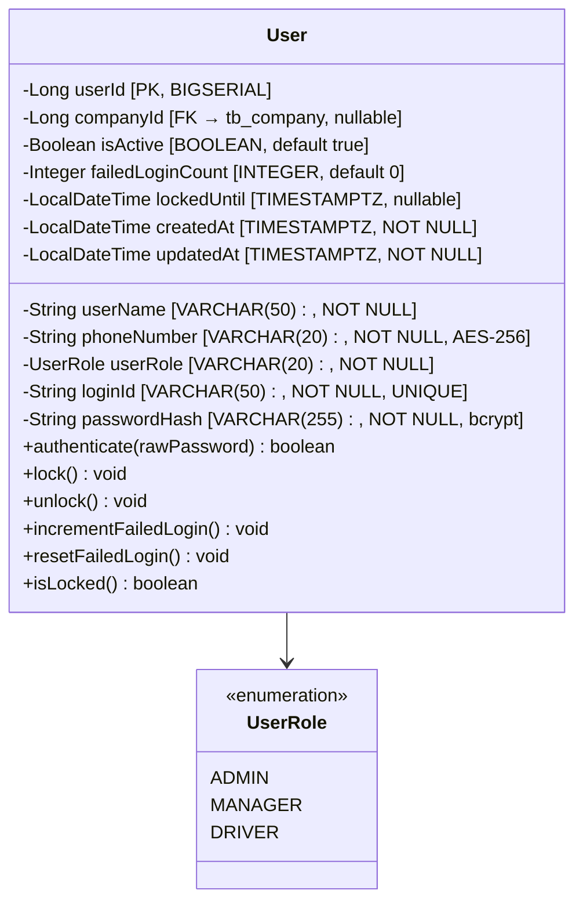
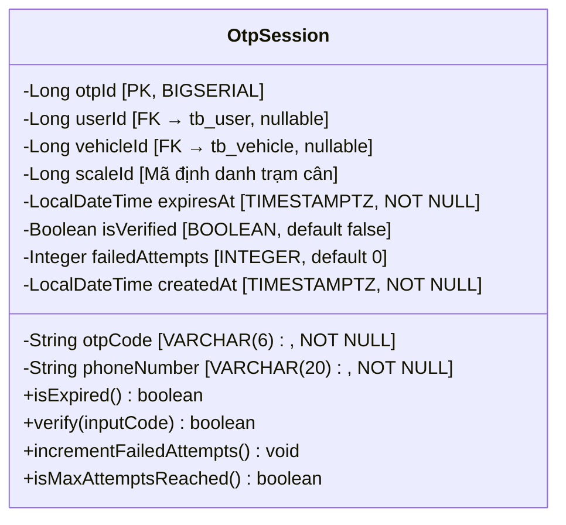
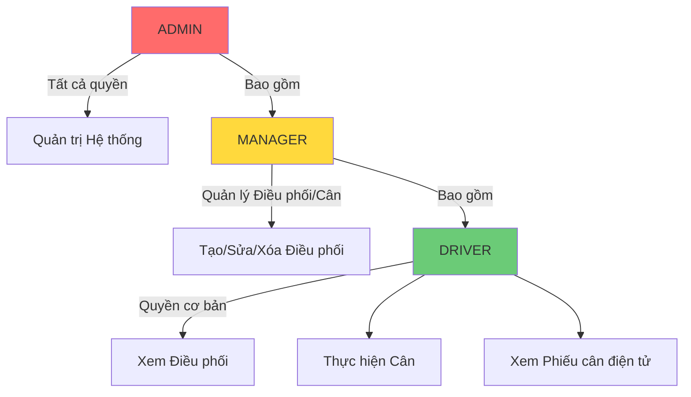
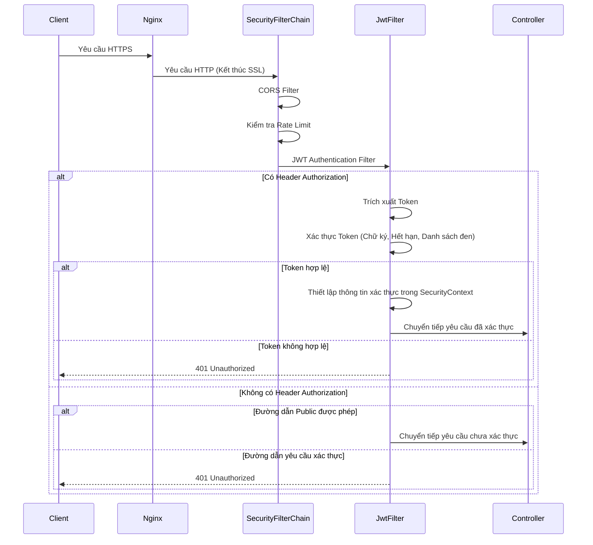
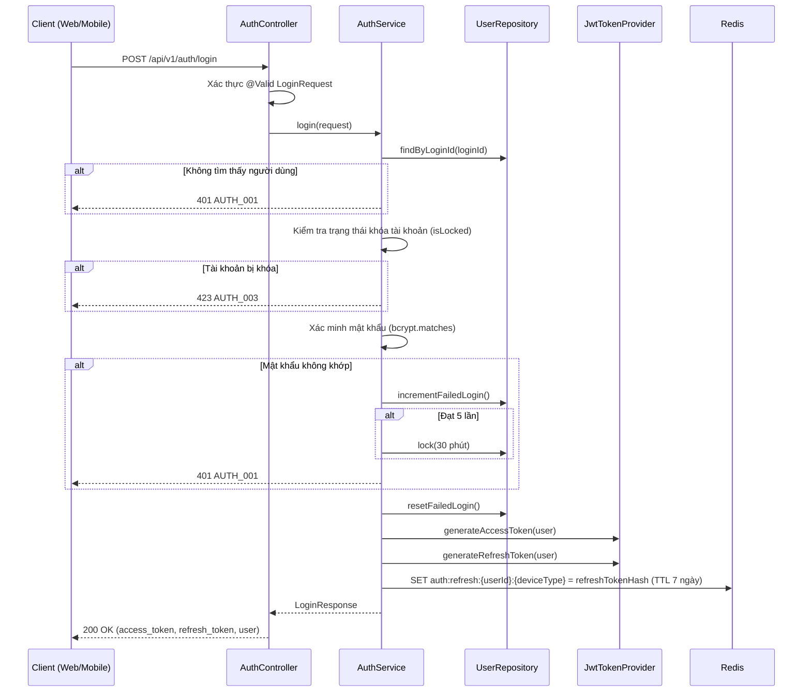
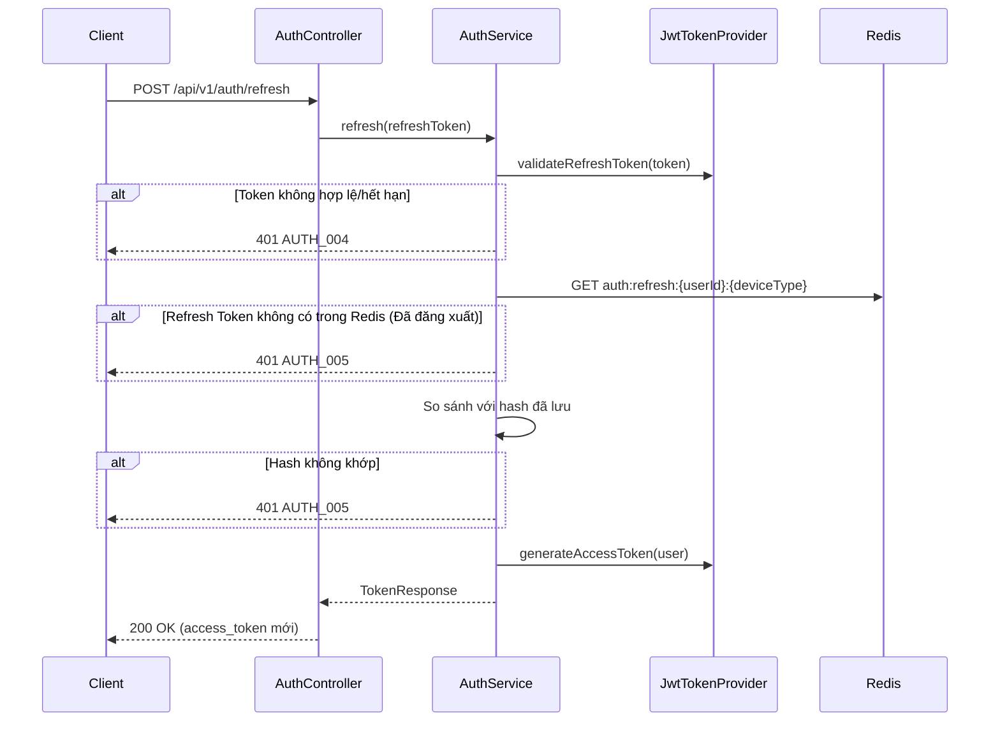
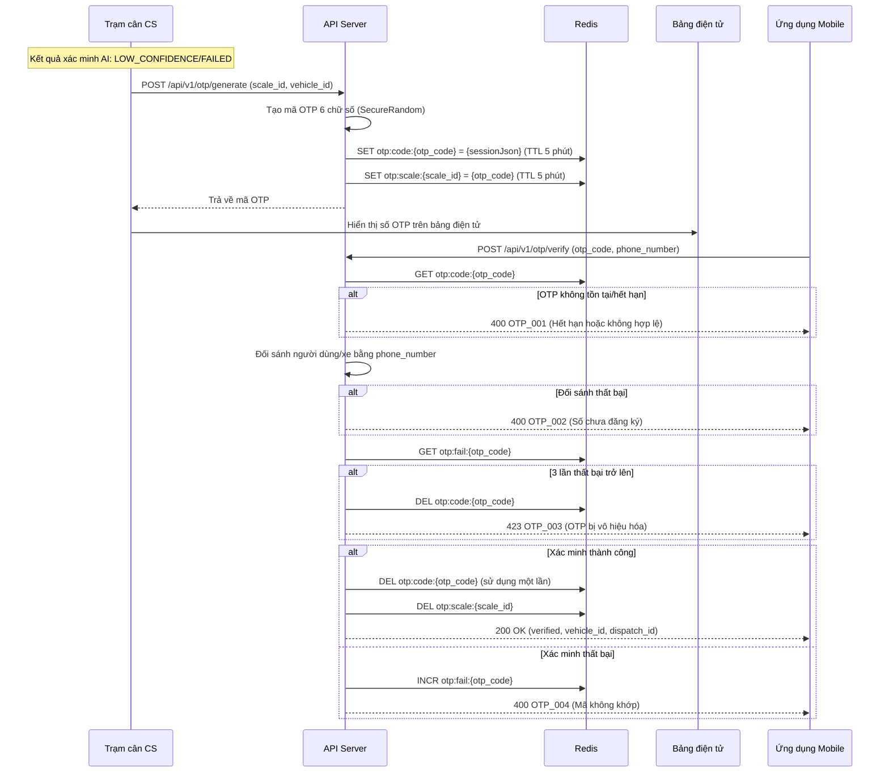
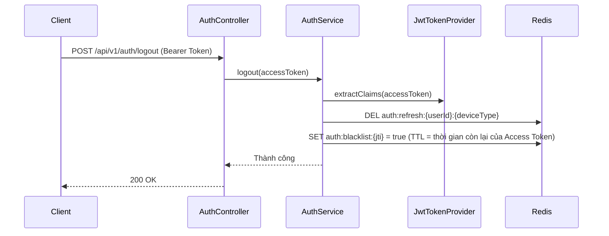
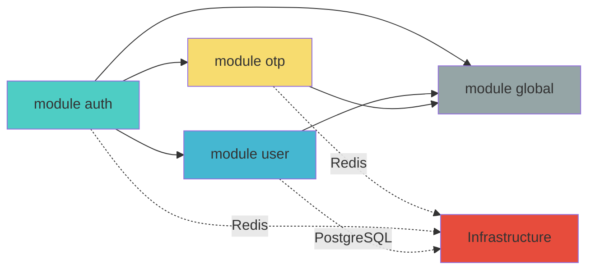

# Tài liệu Thiết kế Cơ bản Module Auth

**Phiên bản**: 1.0
**Ngày tạo**: 2026-01-27
**Tài liệu tham chiếu**: PRD-20260127-154446, TRD-20260127-155235, FUNC-SPEC v1.0
**Module**: Xác thực & Quản lý Người dùng (Authentication & User Management)
**Trạng thái**: Draft

---

## 1. Tổng quan Module

### 1.1 Mục đích
Module Xác thực & Quản lý Người dùng của Hệ thống Cân thông minh Busan cung cấp dịch vụ xác thực tích hợp cho các client Web (React), Mobile (Flutter) và Trạm cân CS (C#). Các tính năng cốt lõi bao gồm xác thực Stateless dựa trên JWT, quản lý quyền truy cập RBAC và xác thực cân bảo mật bằng OTP.

### 1.2 Phạm vi Chức năng

| Chức năng | Ánh xạ FUNC-SPEC | Độ ưu tiên |
|-----------|-------------------|------------|
| Đăng nhập ID/PW | FUNC-017, FUNC-025-API | HIGH |
| Đăng nhập dựa trên OTP (Đăng nhập an toàn Mobile) | FUNC-017, FUNC-025-API | HIGH |
| Làm mới Access Token | FUNC-025-API | HIGH |
| Đăng xuất | FUNC-025-API | HIGH |
| Tạo OTP (Cân bảo mật tại trạm cân) | FUNC-004 | HIGH |
| Xác minh OTP (Nhập từ Mobile) | FUNC-004, FUNC-020 | HIGH |
| Quản lý quyền truy cập RBAC người dùng | Chung cho tất cả module | HIGH |

### 1.3 Client Mục tiêu

| Client | Phương thức Xác thực | Vai trò |
|--------|---------------------|---------|
| React Web | ID/PW → JWT | ADMIN, MANAGER |
| Flutter Mobile | ID/PW hoặc OTP → JWT | MANAGER, DRIVER |
| C# Trạm cân CS | API Key hoặc ID/PW → JWT | SYSTEM (Dịch vụ nội bộ) |

---

## 2. Cấu trúc Package Dự án

### 2.1 Kiến trúc Phân tầng

```
┌─────────────────────────────────────────────────┐
│                  Presentation Layer              │
│         (Controller, DTO, Exception Handler)     │
├─────────────────────────────────────────────────┤
│                  Application Layer               │
│              (Service, Use Case)                 │
├─────────────────────────────────────────────────┤
│                   Domain Layer                   │
│         (Entity, Repository Interface,           │
│          Domain Service, Enum, Event)            │
├─────────────────────────────────────────────────┤
│                Infrastructure Layer              │
│     (JPA Repository Impl, Redis, Security,       │
│      External Service Client)                    │
└─────────────────────────────────────────────────┘
```

### 2.2 Cấu trúc Package

```
com.dongkuk.weighing
├── WeighingApplication.java
├── global/                          # Module chung
│   ├── config/                      # Cấu hình
│   │   ├── SecurityConfig.java      # Cấu hình Spring Security
│   │   ├── JwtConfig.java           # Cấu hình liên quan JWT
│   │   ├── RedisConfig.java         # Cấu hình kết nối Redis
│   │   ├── CorsConfig.java          # Cấu hình chính sách CORS
│   │   └── WebConfig.java           # Cấu hình Web MVC
│   ├── security/                    # Hạ tầng bảo mật
│   │   ├── jwt/
│   │   │   ├── JwtTokenProvider.java    # Tạo/Xác thực JWT Token
│   │   │   ├── JwtAuthenticationFilter.java  # Bộ lọc xác thực JWT
│   │   │   └── JwtProperties.java       # Thuộc tính cấu hình JWT
│   │   ├── UserPrincipal.java           # Thông tin người dùng đã xác thực
│   │   └── CustomUserDetailsService.java # Triển khai UserDetailsService
│   ├── common/                      # Tiện ích chung
│   │   ├── dto/
│   │   │   ├── ApiResponse.java         # DTO phản hồi chung
│   │   │   └── PageResponse.java        # DTO phản hồi phân trang
│   │   ├── exception/
│   │   │   ├── GlobalExceptionHandler.java  # Xử lý ngoại lệ toàn cục
│   │   │   ├── BusinessException.java       # Ngoại lệ nghiệp vụ
│   │   │   └── ErrorCode.java               # Định nghĩa mã lỗi
│   │   └── util/
│   │       ├── EncryptionUtil.java       # Mã hóa AES-256
│   │       └── MaskingUtil.java          # Che dấu thông tin cá nhân
│   └── audit/
│       └── AuditEntity.java             # Quản lý tự động ngày tạo/cập nhật
│
├── auth/                            # Module Xác thực
│   ├── controller/
│   │   └── AuthController.java          # API endpoint xác thực
│   ├── dto/
│   │   ├── request/
│   │   │   ├── LoginRequest.java        # Yêu cầu đăng nhập
│   │   │   ├── OtpLoginRequest.java     # Yêu cầu đăng nhập OTP
│   │   │   └── TokenRefreshRequest.java # Yêu cầu làm mới token
│   │   └── response/
│   │       ├── LoginResponse.java       # Phản hồi đăng nhập
│   │       └── TokenResponse.java       # Phản hồi token
│   └── service/
│       └── AuthService.java             # Logic nghiệp vụ xác thực
│
├── user/                            # Module Người dùng
│   ├── controller/
│   │   └── UserController.java          # API quản lý người dùng
│   ├── dto/
│   │   ├── request/
│   │   │   └── UserCreateRequest.java   # Yêu cầu tạo người dùng
│   │   └── response/
│   │       └── UserResponse.java        # Phản hồi thông tin người dùng
│   ├── domain/
│   │   ├── User.java                    # Entity Người dùng
│   │   ├── UserRole.java                # Enum Vai trò
│   │   └── UserRepository.java          # Interface Repository
│   └── service/
│       └── UserService.java             # Logic nghiệp vụ người dùng
│
└── otp/                             # Module OTP
    ├── controller/
    │   └── OtpController.java           # API endpoint OTP
    ├── dto/
    │   ├── request/
    │   │   ├── OtpGenerateRequest.java  # Yêu cầu tạo OTP
    │   │   └── OtpVerifyRequest.java    # Yêu cầu xác minh OTP
    │   └── response/
    │       ├── OtpGenerateResponse.java # Phản hồi tạo OTP
    │       └── OtpVerifyResponse.java   # Phản hồi xác minh OTP
    ├── domain/
    │   ├── OtpSession.java              # Entity Phiên OTP
    │   └── OtpSessionRepository.java    # Interface Repository
    └── service/
        └── OtpService.java             # Logic nghiệp vụ OTP
```

---

## 3. Thiết kế Mô hình Miền

### 3.1 Entity User (tb_user)



**Quyết định Thiết kế**:
- Thêm `failedLoginCount` và `lockedUntil`: Triển khai FUNC-017 BR-017-5 "Khóa tài khoản sau 5 lần nhập sai mật khẩu"
- `phoneNumber` được lưu trữ với mã hóa AES-256 (TRD 5.2 Bảo mật dữ liệu)
- JPA `@ColumnTransformer` cung cấp mã hóa/giải mã trong suốt ở cấp DB

### 3.2 Phiên OTP (tb_otp_session + Redis)



**Thiết kế Key Redis**:
```
# Ánh xạ Mã OTP → Phiên (để tra cứu)
otp:code:{otp_code} → {otpSessionJson}     TTL: 300s (5 phút)

# OTP đang hoạt động theo từng trạm cân
otp:scale:{scale_id} → {otp_code}          TTL: 300s (5 phút)

# Theo dõi số lần thất bại OTP
otp:fail:{otp_code} → {count}              TTL: 300s (5 phút)
```

**Quyết định Thiết kế**:
- OTP sử dụng Redis làm bộ nhớ chính (tự động hết hạn qua TTL)
- DB (tb_otp_session) lưu trữ song song cho mục đích ghi nhật ký kiểm toán
- Thêm `failedAttempts`: BR-004-4 "Vô hiệu hóa OTP sau 3 lần xác minh thất bại"
- Thêm `scaleId`: BR-004-2 "Hiển thị trên bảng điện tử của trạm cân tương ứng"

### 3.3 Refresh Token (Redis)

```
# Lưu trữ Refresh Token
auth:refresh:{userId}:{deviceType} → {refreshTokenHash}  TTL: 604800s (7 ngày)

# Danh sách đen (Access Token đã đăng xuất)
auth:blacklist:{jti} → true                              TTL: Thời gian còn lại của Access Token
```

---

## 4. Thiết kế API

### 4.1 API Endpoint Xác thực

| Method | Endpoint | Mô tả | Xác thực | Vai trò |
|--------|----------|-------|----------|---------|
| POST | `/api/v1/auth/login` | Đăng nhập ID/PW | Không yêu cầu | ALL |
| POST | `/api/v1/auth/login/otp` | Đăng nhập dựa trên OTP (Mobile) | Không yêu cầu | ALL |
| POST | `/api/v1/auth/refresh` | Làm mới Access Token | Refresh Token | ALL |
| POST | `/api/v1/auth/logout` | Đăng xuất | Bắt buộc | ALL |

### 4.2 API Endpoint OTP

| Method | Endpoint | Mô tả | Xác thực | Vai trò |
|--------|----------|-------|----------|---------|
| POST | `/api/v1/otp/generate` | Tạo OTP (Trạm cân → Bảng điện tử) | Nội bộ (API Key) | SYSTEM |
| POST | `/api/v1/otp/verify` | Xác minh OTP (Nhập từ Mobile) | Không yêu cầu | ALL |

### 4.3 Chi tiết Yêu cầu/Phản hồi API

#### POST /api/v1/auth/login

**Request**:
```json
{
  "login_id": "string (bắt buộc, 3~50 ký tự)",
  "password": "string (bắt buộc, 8~100 ký tự)",
  "device_type": "WEB | MOBILE (bắt buộc)"
}
```

**Response (200 OK)**:
```json
{
  "success": true,
  "data": {
    "access_token": "eyJhbGciOiJIUzI1NiIs...",
    "refresh_token": "dGhpcyBpcyBhIHJlZnJlc2g...",
    "token_type": "Bearer",
    "expires_in": 1800,
    "user": {
      "user_id": 1,
      "user_name": "홍길동",
      "user_role": "DRIVER",
      "company_name": "ABC운수"
    }
  },
  "timestamp": "2026-01-27T15:00:00+09:00"
}
```

**Phản hồi lỗi**:
| HTTP Status | Mã lỗi | Mô tả |
|------------|---------|-------|
| 401 | AUTH_001 | ID đăng nhập hoặc mật khẩu không khớp |
| 401 | AUTH_002 | Tài khoản đã bị vô hiệu hóa |
| 423 | AUTH_003 | Tài khoản bị khóa (5 lần thất bại) |

#### POST /api/v1/auth/login/otp

**Request**:
```json
{
  "phone_number": "string (bắt buộc, 010-XXXX-XXXX)",
  "auth_code": "string (bắt buộc, 6 chữ số)",
  "device_type": "MOBILE (bắt buộc)"
}
```

**Response**: Giống phản hồi đăng nhập

#### POST /api/v1/auth/refresh

**Request**:
```json
{
  "refresh_token": "string (bắt buộc)"
}
```

**Response (200 OK)**:
```json
{
  "success": true,
  "data": {
    "access_token": "eyJhbGciOiJIUzI1NiIs...",
    "token_type": "Bearer",
    "expires_in": 1800
  },
  "timestamp": "2026-01-27T15:00:00+09:00"
}
```

#### POST /api/v1/auth/logout

**Request**: Không có body (xác định qua JWT trong header Authorization)

**Response (200 OK)**:
```json
{
  "success": true,
  "data": null,
  "message": "Đăng xuất hoàn tất",
  "timestamp": "2026-01-27T15:00:00+09:00"
}
```

#### POST /api/v1/otp/generate

**Request**:
```json
{
  "scale_id": 1,
  "vehicle_id": 1,
  "plate_number": "12가3456"
}
```

**Response (200 OK)**:
```json
{
  "success": true,
  "data": {
    "otp_code": "482951",
    "expires_at": "2026-01-27T15:05:00+09:00",
    "ttl_seconds": 300
  },
  "timestamp": "2026-01-27T15:00:00+09:00"
}
```

#### POST /api/v1/otp/verify

**Request**:
```json
{
  "otp_code": "482951",
  "phone_number": "010-1234-5678"
}
```

**Response (200 OK)**:
```json
{
  "success": true,
  "data": {
    "verified": true,
    "vehicle_id": 1,
    "plate_number": "12가3456",
    "dispatch_id": 5
  },
  "timestamp": "2026-01-27T15:00:30+09:00"
}
```

---

## 5. Thiết kế Kiến trúc Bảo mật

### 5.1 Cấu trúc JWT Token

#### Access Token Payload
```json
{
  "sub": "1",
  "login_id": "hong",
  "role": "DRIVER",
  "company_id": 10,
  "device_type": "MOBILE",
  "iat": 1737957600,
  "exp": 1737959400,
  "jti": "uuid-v4"
}
```

#### Cấu hình Token
| Mục | Giá trị | Căn cứ |
|-----|---------|--------|
| Thuật toán | HS256 | Môi trường máy chủ đơn, khóa bí mật chia sẻ giữa các máy chủ |
| Access Token TTL | 30 phút (1800s) | TRD 5.1 |
| Refresh Token TTL | 7 ngày (604800s) | TRD 5.1 |
| Secret Key | Quản lý qua biến môi trường (256bit trở lên) | TRD 5.2 |

### 5.2 Hệ thống Phân quyền RBAC



#### Quyền Truy cập API theo Vai trò

| API | ADMIN | MANAGER | DRIVER | Chưa xác thực |
|-----|-------|---------|--------|----------------|
| POST /auth/login | O | O | O | O |
| POST /auth/login/otp | O | O | O | O |
| POST /auth/refresh | O | O | O | - |
| POST /auth/logout | O | O | O | - |
| POST /otp/generate | - | - | - | Internal |
| POST /otp/verify | O | O | O | O |
| GET /dispatches | O | O | - | - |
| POST /dispatches | O | O | - | - |
| DELETE /dispatches/{id} | O | - | - | - |
| GET /dispatches/my | - | - | O | - |
| GET /master/** | O | O | O | - |
| POST /master/** | O | - | - | - |

### 5.3 Chuỗi Bộ lọc Xác thực



### 5.4 Chính sách Mật khẩu
| Mục | Chính sách |
|-----|-----------|
| Hashing | bcrypt (cost factor 12) |
| Độ dài tối thiểu | 8 ký tự |
| Độ phức tạp | Yêu cầu chữ cái + số, khuyến nghị ký tự đặc biệt |
| Khóa khi thất bại | Khóa 30 phút sau 5 lần thất bại liên tiếp |
| Mở khóa | Tự động mở khóa sau 30 phút hoặc ADMIN mở khóa thủ công |

---

## 6. Sơ đồ Trình tự Luồng Chính

### 6.1 Luồng Đăng nhập ID/PW



### 6.2 Luồng Làm mới Token



### 6.3 Luồng Cân Bảo mật OTP



### 6.4 Luồng Đăng xuất



---

## 7. Hệ thống Mã Lỗi

### 7.1 Mã Lỗi Xác thực

| Mã | HTTP Status | Mô tả |
|----|------------|-------|
| AUTH_001 | 401 | ID đăng nhập hoặc mật khẩu không khớp |
| AUTH_002 | 401 | Tài khoản đã bị vô hiệu hóa. Vui lòng liên hệ quản trị viên |
| AUTH_003 | 423 | Tài khoản bị khóa. Vui lòng thử lại sau {minutes} phút |
| AUTH_004 | 401 | Refresh Token đã hết hạn. Vui lòng đăng nhập lại |
| AUTH_005 | 401 | Refresh Token không hợp lệ |
| AUTH_006 | 401 | Access Token đã hết hạn |
| AUTH_007 | 403 | Không có quyền truy cập |

### 7.2 Mã Lỗi OTP

| Mã | HTTP Status | Mô tả |
|----|------------|-------|
| OTP_001 | 400 | OTP đã hết hạn hoặc không hợp lệ |
| OTP_002 | 400 | Số điện thoại chưa đăng ký |
| OTP_003 | 423 | OTP bị vô hiệu hóa do vượt quá số lần xác minh cho phép |
| OTP_004 | 400 | Mã OTP không khớp |

### 7.3 Mã Lỗi Người dùng

| Mã | HTTP Status | Mô tả |
|----|------------|-------|
| USER_001 | 404 | Không tìm thấy người dùng |
| USER_002 | 409 | ID đăng nhập đã được đăng ký |
| USER_003 | 400 | Thông tin người dùng không hợp lệ |

---

## 8. Thiết kế Chuỗi Bộ lọc Spring Security

### 8.1 Đường dẫn Public (Không yêu cầu xác thực)

```
/api/v1/auth/login          - Đăng nhập ID/PW
/api/v1/auth/login/otp      - Đăng nhập dựa trên OTP
/api/v1/auth/refresh        - Làm mới Token
/api/v1/otp/verify           - Xác minh OTP (Mobile)
/actuator/health             - Kiểm tra sức khỏe
/v3/api-docs/**              - Tài liệu API
/swagger-ui/**               - Swagger UI
```

### 8.2 Đường dẫn Nội bộ (Xác thực API Key)

```
/api/v1/otp/generate         - Tạo OTP (Trạm cân CS → API Server)
```

### 8.3 Đường dẫn Được bảo vệ (Yêu cầu Xác thực JWT)

```
/api/v1/**                   - Mặc định tất cả API yêu cầu xác thực
```

### 8.4 Kiểm soát Truy cập dựa trên Vai trò

```
ADMIN       → /api/v1/master/** (POST, PUT, DELETE)
              /api/v1/dispatches/** (DELETE)
              /api/v1/admin/**

MANAGER     → /api/v1/dispatches/** (POST, PUT)
              /api/v1/gate-passes/** (POST, PUT)
              /api/v1/weighings/**

DRIVER      → /api/v1/dispatches/my (GET)
              /api/v1/slips/** (GET)
              /api/v1/notifications/** (GET)
```

---

## 9. Tóm tắt Lựa chọn Công nghệ

| Phân loại | Công nghệ | Phiên bản | Mục đích |
|-----------|-----------|-----------|----------|
| Framework | Spring Boot | 3.2.x | Framework ứng dụng |
| Security | Spring Security | 6.x | Framework xác thực/phân quyền |
| JWT | jjwt (io.jsonwebtoken) | 0.12.x | Xử lý JWT token |
| Password | Spring Security Crypto | 6.x | Hashing bcrypt |
| Encryption | javax.crypto | - | Mã hóa AES-256 |
| Validation | Jakarta Validation | 3.x | Xác thực Request DTO |
| ORM | Spring Data JPA | 3.2.x | Truy cập cơ sở dữ liệu |
| Cache | Spring Data Redis | 3.2.x | OTP/phiên/danh sách đen |
| API Doc | SpringDoc OpenAPI | 2.x | Tài liệu Swagger |

---

## 10. Phụ thuộc và Ràng buộc

### 10.1 Phụ thuộc Module



### 10.2 Phụ thuộc Bên ngoài

| Phụ thuộc | Mục đích | Bắt buộc |
|-----------|----------|----------|
| PostgreSQL 16 | Lưu trữ bền vững người dùng/phiên OTP | Bắt buộc |
| Redis 7 | Cache OTP, Refresh Token, danh sách đen | Bắt buộc |
| Nginx | Kết thúc SSL, giới hạn tốc độ | Bắt buộc |

### 10.3 Ràng buộc Thiết kế

1. **Xác thực Stateless**: Không sử dụng phiên máy chủ; thiết kế Stateless dựa trên JWT (chuẩn bị cho mở rộng ngang)
2. **Phiên đơn theo loại thiết bị**: Chỉ duy trì một Refresh Token cho mỗi device_type của cùng một người dùng
3. **OTP sử dụng một lần**: Xóa khỏi Redis ngay sau khi xác minh thành công
4. **Múi giờ**: Tất cả thời gian được lưu dưới dạng TIMESTAMPTZ theo UTC+9 (Asia/Seoul)

---

## 11. Định nghĩa Thuật ngữ

| Thuật ngữ | Định nghĩa |
|-----------|-----------|
| Access Token | JWT token ngắn hạn (30 phút), sử dụng để xác thực API |
| Refresh Token | Token dài hạn (7 ngày), sử dụng để làm mới Access Token |
| JTI | JWT Token ID, mã định danh duy nhất của token (dùng cho danh sách đen) |
| RBAC | Role-Based Access Control, Kiểm soát truy cập dựa trên vai trò |
| OTP | One-Time Password, mật khẩu dùng một lần cho xác thực bảo mật tại trạm cân |
| bcrypt | Thuật toán hashing mật khẩu một chiều |
| AES-256 | Mã hóa khóa đối xứng hai chiều (cho mã hóa thông tin cá nhân) |

---

*Tài liệu này là Tài liệu Thiết kế Cơ bản Module Auth dựa trên PRD, TRD và FUNC-SPEC.*
*Tài liệu Thiết kế Chi tiết sẽ cụ thể hóa thêm sơ đồ lớp, chi tiết DTO, DDL, tập tin cấu hình, v.v.*
