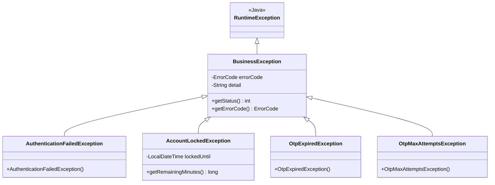

# Tài liệu Thiết kế Chi tiết Module Auth

**Phiên bản**: 1.0
**Ngày tạo**: 2026-01-27
**Tài liệu tham chiếu**: auth-basic-design.md (Tài liệu Thiết kế Cơ bản)
**Module**: Xác thực & Quản lý Người dùng (Authentication & User Management)
**Trạng thái**: Draft

---

## 1. Sơ đồ Lớp

### 1.1 Sơ đồ Quan hệ Lớp Tổng thể

```mermaid
classDiagram
    direction TB

    %% === Global Layer ===
    class ApiResponse~T~ {
        -boolean success
        -T data
        -String message
        -LocalDateTime timestamp
        +ok(T data) ApiResponse~T~$
        +ok(T data, String message) ApiResponse~T~$
        +error(ErrorCode code) ApiResponse~Void~$
        +error(ErrorCode code, String detail) ApiResponse~Void~$
    }

    class ErrorCode {
        <<enumeration>>
        AUTH_001(401, "ID đăng nhập hoặc mật khẩu không khớp")
        AUTH_002(401, "Tài khoản đã bị vô hiệu hóa")
        AUTH_003(423, "Tài khoản bị khóa")
        AUTH_004(401, "Refresh Token đã hết hạn")
        AUTH_005(401, "Refresh Token không hợp lệ")
        AUTH_006(401, "Access Token đã hết hạn")
        AUTH_007(403, "Không có quyền truy cập")
        OTP_001(400, "OTP đã hết hạn hoặc không hợp lệ")
        OTP_002(400, "Số điện thoại chưa đăng ký")
        OTP_003(423, "Vượt quá số lần xác minh OTP")
        OTP_004(400, "Mã OTP không khớp")
        USER_001(404, "Không tìm thấy người dùng")
        USER_002(409, "ID đăng nhập đã được đăng ký")
        USER_003(400, "Thông tin người dùng không hợp lệ")
        INTERNAL_ERROR(500, "Lỗi máy chủ nội bộ")
        -int status
        -String message
    }

    class BusinessException {
        -ErrorCode errorCode
        -String detail
        +BusinessException(ErrorCode)
        +BusinessException(ErrorCode, String)
        +getStatus() int
    }

    class GlobalExceptionHandler {
        +handleBusinessException(BusinessException) ResponseEntity
        +handleValidationException(MethodArgumentNotValidException) ResponseEntity
        +handleAccessDeniedException(AccessDeniedException) ResponseEntity
        +handleException(Exception) ResponseEntity
    }

    class BaseEntity {
        <<abstract>>
        -LocalDateTime createdAt
        -LocalDateTime updatedAt
    }

    BusinessException --> ErrorCode
    GlobalExceptionHandler ..> BusinessException
    GlobalExceptionHandler ..> ApiResponse

    %% === User Domain ===
    class User {
        -Long userId
        -Long companyId
        -String userName
        -String phoneNumber
        -UserRole userRole
        -String loginId
        -String passwordHash
        -boolean isActive
        -int failedLoginCount
        -LocalDateTime lockedUntil
        +authenticate(String rawPassword, PasswordEncoder encoder) boolean
        +incrementFailedLogin(int maxAttempts, Duration lockDuration) void
        +resetFailedLogin() void
        +isLocked() boolean
        +activate() void
        +deactivate() void
    }

    class UserRole {
        <<enumeration>>
        ADMIN("Quản trị viên")
        MANAGER("Quản lý")
        DRIVER("Tài xế")
        -String description
        +includes(UserRole other) boolean
    }

    class UserRepository {
        <<interface>>
        +findByLoginId(String loginId) Optional~User~
        +findByPhoneNumber(String phoneNumber) Optional~User~
        +existsByLoginId(String loginId) boolean
    }

    User --|> BaseEntity
    User --> UserRole
    UserRepository ..> User

    %% === Auth Module ===
    class AuthController {
        -AuthService authService
        +login(LoginRequest) ResponseEntity
        +loginOtp(OtpLoginRequest) ResponseEntity
        +refresh(TokenRefreshRequest) ResponseEntity
        +logout(HttpServletRequest) ResponseEntity
    }

    class AuthService {
        -UserRepository userRepository
        -JwtTokenProvider jwtTokenProvider
        -PasswordEncoder passwordEncoder
        -RedisTemplate redisTemplate
        -AuthProperties authProperties
        +login(LoginRequest) LoginResponse
        +loginByOtp(OtpLoginRequest) LoginResponse
        +refresh(String refreshToken) TokenResponse
        +logout(String accessToken) void
    }

    class LoginRequest {
        -String loginId
        -String password
        -DeviceType deviceType
    }

    class OtpLoginRequest {
        -String phoneNumber
        -String authCode
        -DeviceType deviceType
    }

    class TokenRefreshRequest {
        -String refreshToken
    }

    class LoginResponse {
        -String accessToken
        -String refreshToken
        -String tokenType
        -long expiresIn
        -UserInfo user
    }

    class TokenResponse {
        -String accessToken
        -String tokenType
        -long expiresIn
    }

    class UserInfo {
        -Long userId
        -String userName
        -String userRole
        -String companyName
    }

    class DeviceType {
        <<enumeration>>
        WEB
        MOBILE
    }

    AuthController --> AuthService
    AuthController ..> LoginRequest
    AuthController ..> OtpLoginRequest
    AuthController ..> TokenRefreshRequest
    AuthService --> UserRepository
    AuthService --> JwtTokenProvider
    AuthService ..> LoginResponse
    AuthService ..> TokenResponse
    LoginResponse --> UserInfo

    %% === JWT ===
    class JwtTokenProvider {
        -JwtProperties jwtProperties
        -SecretKey secretKey
        +generateAccessToken(User user, DeviceType deviceType) String
        +generateRefreshToken(User user, DeviceType deviceType) String
        +validateToken(String token) boolean
        +extractClaims(String token) Claims
        +extractUserId(String token) Long
        +extractJti(String token) String
        +getRemainingExpiration(String token) long
    }

    class JwtProperties {
        -String secret
        -long accessTokenExpiration
        -long refreshTokenExpiration
        -String issuer
    }

    class JwtAuthenticationFilter {
        -JwtTokenProvider jwtTokenProvider
        -CustomUserDetailsService userDetailsService
        -RedisTemplate redisTemplate
        #doFilterInternal(HttpServletRequest, HttpServletResponse, FilterChain) void
        -resolveToken(HttpServletRequest) String
        -isBlacklisted(String jti) boolean
    }

    class UserPrincipal {
        -Long userId
        -String loginId
        -UserRole role
        -Long companyId
        +getAuthorities() Collection~GrantedAuthority~
    }

    class CustomUserDetailsService {
        -UserRepository userRepository
        +loadUserByUsername(String loginId) UserDetails
    }

    JwtAuthenticationFilter --> JwtTokenProvider
    JwtAuthenticationFilter --> CustomUserDetailsService
    JwtTokenProvider --> JwtProperties
    CustomUserDetailsService --> UserRepository
    CustomUserDetailsService ..> UserPrincipal

    %% === OTP Module ===
    class OtpController {
        -OtpService otpService
        +generate(OtpGenerateRequest) ResponseEntity
        +verify(OtpVerifyRequest) ResponseEntity
    }

    class OtpService {
        -RedisTemplate redisTemplate
        -UserRepository userRepository
        -OtpSessionRepository otpSessionRepository
        -OtpProperties otpProperties
        +generate(OtpGenerateRequest) OtpGenerateResponse
        +verify(OtpVerifyRequest) OtpVerifyResponse
        -generateOtpCode() String
        -buildRedisKey(String prefix, String key) String
    }

    class OtpGenerateRequest {
        -Long scaleId
        -Long vehicleId
        -String plateNumber
    }

    class OtpVerifyRequest {
        -String otpCode
        -String phoneNumber
    }

    class OtpGenerateResponse {
        -String otpCode
        -LocalDateTime expiresAt
        -int ttlSeconds
    }

    class OtpVerifyResponse {
        -boolean verified
        -Long vehicleId
        -String plateNumber
        -Long dispatchId
    }

    class OtpSession {
        -Long otpId
        -Long userId
        -String otpCode
        -Long vehicleId
        -String phoneNumber
        -Long scaleId
        -LocalDateTime expiresAt
        -boolean isVerified
        -int failedAttempts
    }

    class OtpSessionRepository {
        <<interface>>
        +findByOtpCodeAndExpiresAtAfter(String code, LocalDateTime now) Optional~OtpSession~
    }

    class OtpProperties {
        -int codeLength
        -int ttlSeconds
        -int maxFailedAttempts
    }

    OtpController --> OtpService
    OtpService --> UserRepository
    OtpService --> OtpSessionRepository
    OtpService --> OtpProperties
    OtpSessionRepository ..> OtpSession
    OtpSession --|> BaseEntity

    %% === Security Config ===
    class SecurityConfig {
        -JwtAuthenticationFilter jwtFilter
        -JwtAuthenticationEntryPoint entryPoint
        +securityFilterChain(HttpSecurity) SecurityFilterChain
    }

    class JwtAuthenticationEntryPoint {
        +commence(HttpServletRequest, HttpServletResponse, AuthenticationException) void
    }

    SecurityConfig --> JwtAuthenticationFilter
    SecurityConfig --> JwtAuthenticationEntryPoint
```



---

## 2. Đặc tả Chi tiết DTO

### 2.1 DTO Yêu cầu (Request)

#### LoginRequest
```java
public record LoginRequest(
    @NotBlank(message = "Vui lòng nhập ID đăng nhập")
    @Size(min = 3, max = 50, message = "ID đăng nhập phải từ 3~50 ký tự")
    String loginId,

    @NotBlank(message = "Vui lòng nhập mật khẩu")
    @Size(min = 8, max = 100, message = "Mật khẩu phải từ 8~100 ký tự")
    String password,

    @NotNull(message = "Vui lòng chọn loại thiết bị")
    DeviceType deviceType
) {}
```

#### OtpLoginRequest
```java
public record OtpLoginRequest(
    @NotBlank(message = "Vui lòng nhập số điện thoại")
    @Pattern(regexp = "^01[016789]-\\d{3,4}-\\d{4}$",
             message = "Định dạng số điện thoại không hợp lệ (ví dụ: 010-1234-5678)")
    String phoneNumber,

    @NotBlank(message = "Vui lòng nhập mã xác thực")
    @Pattern(regexp = "^\\d{6}$", message = "Mã xác thực phải là 6 chữ số")
    String authCode,

    @NotNull(message = "Vui lòng chọn loại thiết bị")
    DeviceType deviceType
) {}
```

#### TokenRefreshRequest
```java
public record TokenRefreshRequest(
    @NotBlank(message = "Vui lòng cung cấp Refresh Token")
    String refreshToken
) {}
```

#### OtpGenerateRequest
```java
public record OtpGenerateRequest(
    @NotNull(message = "Vui lòng cung cấp ID trạm cân")
    Long scaleId,

    @NotNull(message = "Vui lòng cung cấp ID xe")
    Long vehicleId,

    @NotBlank(message = "Vui lòng cung cấp biển số xe")
    @Size(max = 20)
    String plateNumber
) {}
```

#### OtpVerifyRequest
```java
public record OtpVerifyRequest(
    @NotBlank(message = "Vui lòng nhập mã OTP")
    @Pattern(regexp = "^\\d{6}$", message = "OTP phải là 6 chữ số")
    String otpCode,

    @NotBlank(message = "Vui lòng nhập số điện thoại")
    @Pattern(regexp = "^01[016789]-\\d{3,4}-\\d{4}$",
             message = "Định dạng số điện thoại không hợp lệ")
    String phoneNumber
) {}
```

#### UserCreateRequest
```java
public record UserCreateRequest(
    @NotBlank @Size(min = 3, max = 50)
    String loginId,

    @NotBlank @Size(min = 8, max = 100)
    @Pattern(regexp = "^(?=.*[A-Za-z])(?=.*\\d).+$",
             message = "Mật khẩu phải chứa cả chữ cái và số")
    String password,

    @NotBlank @Size(max = 50)
    String userName,

    @NotBlank
    @Pattern(regexp = "^01[016789]-\\d{3,4}-\\d{4}$")
    String phoneNumber,

    @NotNull
    UserRole userRole,

    Long companyId
) {}
```

### 2.2 DTO Phản hồi (Response)

#### LoginResponse
```java
public record LoginResponse(
    String accessToken,
    String refreshToken,
    String tokenType,   // Cố định "Bearer"
    long expiresIn,     // Số giây đến khi Access Token hết hạn (1800)
    UserInfo user
) {
    public record UserInfo(
        Long userId,
        String userName,
        String userRole,
        String companyName
    ) {}

    public static LoginResponse of(String accessToken, String refreshToken,
                                    long expiresIn, User user, String companyName) {
        return new LoginResponse(
            accessToken, refreshToken, "Bearer", expiresIn,
            new UserInfo(user.getUserId(), user.getUserName(),
                         user.getUserRole().name(), companyName)
        );
    }
}
```

#### TokenResponse
```java
public record TokenResponse(
    String accessToken,
    String tokenType,   // Cố định "Bearer"
    long expiresIn      // 1800
) {
    public static TokenResponse of(String accessToken, long expiresIn) {
        return new TokenResponse(accessToken, "Bearer", expiresIn);
    }
}
```

#### OtpGenerateResponse
```java
public record OtpGenerateResponse(
    String otpCode,
    LocalDateTime expiresAt,
    int ttlSeconds
) {}
```

#### OtpVerifyResponse
```java
public record OtpVerifyResponse(
    boolean verified,
    Long vehicleId,
    String plateNumber,
    Long dispatchId
) {}
```

#### UserResponse
```java
public record UserResponse(
    Long userId,
    String userName,
    String phoneNumber,  // Che dấu: 010-****-5678
    String userRole,
    String companyName,
    boolean isActive,
    LocalDateTime createdAt
) {
    public static UserResponse from(User user, String companyName) {
        return new UserResponse(
            user.getUserId(),
            user.getUserName(),
            MaskingUtil.maskPhone(user.getPhoneNumber()),
            user.getUserRole().name(),
            companyName,
            user.isActive(),
            user.getCreatedAt()
        );
    }
}
```

### 2.3 Wrapper Phản hồi Chung

#### ApiResponse
```java
public record ApiResponse<T>(
    boolean success,
    T data,
    String message,
    ErrorDetail error,
    LocalDateTime timestamp
) {
    public record ErrorDetail(String code, String message) {}

    public static <T> ApiResponse<T> ok(T data) {
        return new ApiResponse<>(true, data, null, null, LocalDateTime.now());
    }

    public static <T> ApiResponse<T> ok(T data, String message) {
        return new ApiResponse<>(true, data, message, null, LocalDateTime.now());
    }

    public static ApiResponse<Void> error(ErrorCode code) {
        return new ApiResponse<>(false, null, null,
            new ErrorDetail(code.name(), code.getMessage()), LocalDateTime.now());
    }

    public static ApiResponse<Void> error(ErrorCode code, String detail) {
        return new ApiResponse<>(false, null, null,
            new ErrorDetail(code.name(), detail), LocalDateTime.now());
    }
}
```

---

## 3. Thiết kế Chi tiết Entity

### 3.1 BaseEntity (Entity Kiểm toán Chung)

```java
@MappedSuperclass
@EntityListeners(AuditingEntityListener.class)
public abstract class BaseEntity {

    @CreatedDate
    @Column(name = "created_at", nullable = false, updatable = false)
    private LocalDateTime createdAt;

    @LastModifiedDate
    @Column(name = "updated_at", nullable = false)
    private LocalDateTime updatedAt;
}
```

### 3.2 Entity User

```java
@Entity
@Table(name = "tb_user", indexes = {
    @Index(name = "idx_user_login", columnList = "login_id", unique = true),
    @Index(name = "idx_user_phone", columnList = "phone_number")
})
@Getter
@NoArgsConstructor(access = AccessLevel.PROTECTED)
public class User extends BaseEntity {

    private static final int MAX_FAILED_ATTEMPTS = 5;
    private static final Duration LOCK_DURATION = Duration.ofMinutes(30);

    @Id
    @GeneratedValue(strategy = GenerationType.IDENTITY)
    @Column(name = "user_id")
    private Long userId;

    @Column(name = "company_id")
    private Long companyId;

    @Column(name = "user_name", nullable = false, length = 50)
    private String userName;

    @Column(name = "phone_number", nullable = false, length = 20)
    private String phoneNumber;

    @Enumerated(EnumType.STRING)
    @Column(name = "user_role", nullable = false, length = 20)
    private UserRole userRole;

    @Column(name = "login_id", nullable = false, unique = true, length = 50)
    private String loginId;

    @Column(name = "password_hash", nullable = false, length = 255)
    private String passwordHash;

    @Column(name = "is_active", nullable = false)
    private boolean isActive = true;

    @Column(name = "failed_login_count", nullable = false)
    private int failedLoginCount = 0;

    @Column(name = "locked_until")
    private LocalDateTime lockedUntil;

    // === Phương thức Miền ===

    public boolean authenticate(String rawPassword, PasswordEncoder encoder) {
        return encoder.matches(rawPassword, this.passwordHash);
    }

    public boolean isLocked() {
        if (lockedUntil == null) return false;
        if (LocalDateTime.now().isAfter(lockedUntil)) {
            // Thời gian khóa đã hết → tự động mở khóa
            unlock();
            return false;
        }
        return true;
    }

    public void incrementFailedLogin() {
        this.failedLoginCount++;
        if (this.failedLoginCount >= MAX_FAILED_ATTEMPTS) {
            lock();
        }
    }

    public void resetFailedLogin() {
        this.failedLoginCount = 0;
        this.lockedUntil = null;
    }

    private void lock() {
        this.lockedUntil = LocalDateTime.now().plus(LOCK_DURATION);
    }

    private void unlock() {
        this.failedLoginCount = 0;
        this.lockedUntil = null;
    }

    public void activate() { this.isActive = true; }
    public void deactivate() { this.isActive = false; }

    // === Builder ===
    @Builder
    public User(Long companyId, String userName, String phoneNumber,
                UserRole userRole, String loginId, String passwordHash) {
        this.companyId = companyId;
        this.userName = userName;
        this.phoneNumber = phoneNumber;
        this.userRole = userRole;
        this.loginId = loginId;
        this.passwordHash = passwordHash;
    }
}
```

### 3.3 Enum UserRole

```java
@Getter
@RequiredArgsConstructor
public enum UserRole {
    ADMIN("Quản trị viên"),
    MANAGER("Quản lý"),
    DRIVER("Tài xế");

    private final String description;

    /**
     * Kiểm tra bao gồm quyền theo phân cấp.
     * ADMIN bao gồm quyền MANAGER và DRIVER.
     * MANAGER bao gồm quyền DRIVER.
     */
    public boolean includes(UserRole other) {
        return this.ordinal() <= other.ordinal();
    }
}
```

### 3.4 Entity OtpSession

```java
@Entity
@Table(name = "tb_otp_session", indexes = {
    @Index(name = "idx_otp_code_expires", columnList = "otp_code, expires_at"),
    @Index(name = "idx_otp_phone", columnList = "phone_number")
})
@Getter
@NoArgsConstructor(access = AccessLevel.PROTECTED)
public class OtpSession {

    @Id
    @GeneratedValue(strategy = GenerationType.IDENTITY)
    @Column(name = "otp_id")
    private Long otpId;

    @Column(name = "user_id")
    private Long userId;

    @Column(name = "otp_code", nullable = false, length = 6)
    private String otpCode;

    @Column(name = "vehicle_id")
    private Long vehicleId;

    @Column(name = "phone_number", nullable = false, length = 20)
    private String phoneNumber;

    @Column(name = "scale_id")
    private Long scaleId;

    @Column(name = "expires_at", nullable = false)
    private LocalDateTime expiresAt;

    @Column(name = "is_verified", nullable = false)
    private boolean isVerified = false;

    @Column(name = "failed_attempts", nullable = false)
    private int failedAttempts = 0;

    @CreatedDate
    @Column(name = "created_at", nullable = false, updatable = false)
    private LocalDateTime createdAt;

    @Builder
    public OtpSession(Long userId, String otpCode, Long vehicleId,
                      String phoneNumber, Long scaleId, LocalDateTime expiresAt) {
        this.userId = userId;
        this.otpCode = otpCode;
        this.vehicleId = vehicleId;
        this.phoneNumber = phoneNumber;
        this.scaleId = scaleId;
        this.expiresAt = expiresAt;
    }

    public void markVerified() { this.isVerified = true; }
    public void incrementFailedAttempts() { this.failedAttempts++; }
    public boolean isExpired() { return LocalDateTime.now().isAfter(expiresAt); }
    public boolean isMaxAttemptsReached(int max) { return failedAttempts >= max; }
}
```

---

## 4. Chữ ký Phương thức Service

### 4.1 AuthService

```java
@Service
@RequiredArgsConstructor
@Transactional(readOnly = true)
public class AuthService {

    private final UserRepository userRepository;
    private final JwtTokenProvider jwtTokenProvider;
    private final PasswordEncoder passwordEncoder;
    private final StringRedisTemplate redisTemplate;
    private final JwtProperties jwtProperties;

    /**
     * Đăng nhập ID/PW.
     * - Tìm người dùng → kiểm tra khóa → xác minh mật khẩu → cấp token
     * - Khi thất bại, tăng failedLoginCount; khóa 30 phút khi đạt 5 lần
     *
     * @throws BusinessException AUTH_001 Mật khẩu không khớp
     * @throws BusinessException AUTH_002 Tài khoản không hoạt động
     * @throws BusinessException AUTH_003 Tài khoản bị khóa
     */
    @Transactional
    public LoginResponse login(LoginRequest request) { ... }

    /**
     * Đăng nhập dựa trên OTP (Đăng nhập an toàn Mobile).
     * - Tìm người dùng bằng số điện thoại → xác minh mã xác thực → cấp token
     *
     * @throws BusinessException AUTH_001 Xác thực thất bại
     * @throws BusinessException AUTH_002 Tài khoản không hoạt động
     */
    @Transactional
    public LoginResponse loginByOtp(OtpLoginRequest request) { ... }

    /**
     * Làm mới Access Token.
     * - Xác thực Refresh Token → so sánh với giá trị lưu trong Redis → cấp Access Token mới
     *
     * @throws BusinessException AUTH_004 Refresh Token hết hạn
     * @throws BusinessException AUTH_005 Refresh Token không hợp lệ
     */
    public TokenResponse refresh(String refreshToken) { ... }

    /**
     * Đăng xuất.
     * - Xóa Refresh Token khỏi Redis
     * - Thêm JTI của Access Token vào danh sách đen (TTL = thời gian còn lại)
     */
    @Transactional
    public void logout(String accessToken) { ... }

    // === Phương thức Hỗ trợ Private ===

    private void validateUserActive(User user) { ... }
    private void validateNotLocked(User user) { ... }
    private void storeRefreshToken(Long userId, DeviceType deviceType,
                                    String refreshToken) { ... }
    private String buildRefreshKey(Long userId, DeviceType deviceType) { ... }
}
```

### 4.2 OtpService

```java
@Service
@RequiredArgsConstructor
public class OtpService {

    private final StringRedisTemplate redisTemplate;
    private final UserRepository userRepository;
    private final OtpSessionRepository otpSessionRepository;
    private final OtpProperties otpProperties;
    private final ObjectMapper objectMapper;

    /**
     * Tạo OTP (Trạm cân CS → Bảng điện tử).
     * - Tạo mã 6 chữ số bằng SecureRandom
     * - Lưu vào Redis với TTL 5 phút
     * - Lưu bản ghi nhật ký kiểm toán vào DB
     */
    @Transactional
    public OtpGenerateResponse generate(OtpGenerateRequest request) { ... }

    /**
     * Xác minh OTP (Nhập từ Mobile).
     * - Tra cứu phiên OTP từ Redis
     * - Kiểm tra số lần thất bại (vô hiệu hóa nếu > 3 lần)
     * - Đối sánh người dùng/xe bằng số điện thoại
     * - Xóa key Redis khi thành công (sử dụng một lần)
     *
     * @throws BusinessException OTP_001 Hết hạn/không tồn tại
     * @throws BusinessException OTP_002 Số điện thoại chưa đăng ký
     * @throws BusinessException OTP_003 Vượt quá số lần thất bại
     * @throws BusinessException OTP_004 Mã không khớp
     */
    @Transactional
    public OtpVerifyResponse verify(OtpVerifyRequest request) { ... }

    // === Phương thức Hỗ trợ Private ===

    private String generateOtpCode() { ... }  // SecureRandom 6 chữ số
    private String codeKey(String otpCode) { ... }  // "otp:code:{code}"
    private String scaleKey(Long scaleId) { ... }   // "otp:scale:{id}"
    private String failKey(String otpCode) { ... }  // "otp:fail:{code}"
}
```

### 4.3 UserService

```java
@Service
@RequiredArgsConstructor
@Transactional(readOnly = true)
public class UserService {

    private final UserRepository userRepository;
    private final PasswordEncoder passwordEncoder;

    /**
     * Tạo người dùng.
     * @throws BusinessException USER_002 ID đăng nhập trùng lặp
     */
    @Transactional
    public UserResponse createUser(UserCreateRequest request) { ... }

    /**
     * Lấy người dùng theo ID.
     * @throws BusinessException USER_001 Không tìm thấy
     */
    public UserResponse getUser(Long userId) { ... }

    /**
     * Lấy danh sách người dùng (phân trang).
     */
    public Page<UserResponse> getUsers(Pageable pageable) { ... }

    /**
     * Chuyển đổi trạng thái hoạt động/không hoạt động của người dùng.
     * @throws BusinessException USER_001 Không tìm thấy
     */
    @Transactional
    public void toggleActive(Long userId) { ... }

    /**
     * Mở khóa tài khoản thủ công (bởi ADMIN).
     * @throws BusinessException USER_001 Không tìm thấy
     */
    @Transactional
    public void unlockAccount(Long userId) { ... }
}
```

### 4.4 JwtTokenProvider

```java
@Component
@RequiredArgsConstructor
public class JwtTokenProvider {

    private final JwtProperties jwtProperties;
    private SecretKey secretKey;

    @PostConstruct
    void init() {
        byte[] keyBytes = Decoders.BASE64.decode(jwtProperties.getSecret());
        this.secretKey = Keys.hmacShaKeyFor(keyBytes);
    }

    /**
     * Tạo Access Token.
     * Claims: sub(userId), login_id, role, company_id, device_type, jti
     */
    public String generateAccessToken(User user, DeviceType deviceType) { ... }

    /**
     * Tạo Refresh Token.
     * Claims: sub(userId), device_type, jti
     */
    public String generateRefreshToken(User user, DeviceType deviceType) { ... }

    /**
     * Xác thực token.
     * - Xác thực chữ ký, hết hạn và định dạng
     * - Kiểm tra danh sách đen được thực hiện riêng trong Filter
     */
    public boolean validateToken(String token) { ... }

    /** Trích xuất Claims từ token. */
    public Claims extractClaims(String token) { ... }

    /** Trích xuất userId (sub). */
    public Long extractUserId(String token) { ... }

    /** Trích xuất JTI (key danh sách đen). */
    public String extractJti(String token) { ... }

    /** Thời gian hết hạn còn lại (ms). Dùng để tính TTL danh sách đen khi đăng xuất. */
    public long getRemainingExpiration(String token) { ... }
}
```

---

## 5. Chi tiết Tập tin Cấu hình

### 5.1 application.yml

```yaml
spring:
  application:
    name: weighing-api

  # === JPA / PostgreSQL ===
  datasource:
    url: jdbc:postgresql://${DB_HOST:localhost}:${DB_PORT:5432}/${DB_NAME:weighing}
    username: ${DB_USERNAME:weighing}
    password: ${DB_PASSWORD:weighing}
    driver-class-name: org.postgresql.Driver
    hikari:
      minimum-idle: 10
      maximum-pool-size: 30
      connection-timeout: 5000
      idle-timeout: 300000
      max-lifetime: 600000

  jpa:
    hibernate:
      ddl-auto: validate
    open-in-view: false
    properties:
      hibernate:
        dialect: org.hibernate.dialect.PostgreSQLDialect
        default_schema: public
        format_sql: true
        jdbc:
          time_zone: Asia/Seoul

  # === Redis ===
  data:
    redis:
      host: ${REDIS_HOST:localhost}
      port: ${REDIS_PORT:6379}
      password: ${REDIS_PASSWORD:}
      timeout: 3000ms
      lettuce:
        pool:
          min-idle: 5
          max-idle: 10
          max-active: 20

  # === Jackson ===
  jackson:
    time-zone: Asia/Seoul
    date-format: yyyy-MM-dd'T'HH:mm:ssXXX
    serialization:
      write-dates-as-timestamps: false
    property-naming-strategy: SNAKE_CASE

# === JWT Properties ===
jwt:
  secret: ${JWT_SECRET}                    # Secret mã hóa Base64 256bit trở lên
  access-token-expiration: 1800000         # 30 phút (ms)
  refresh-token-expiration: 604800000      # 7 ngày (ms)
  issuer: weighing-api

# === OTP Properties ===
otp:
  code-length: 6
  ttl-seconds: 300                         # 5 phút
  max-failed-attempts: 3

# === API Key (Xác thực nội bộ Trạm cân CS) ===
api:
  internal-key: ${API_INTERNAL_KEY}

# === CORS ===
cors:
  allowed-origins:
    - ${CORS_ORIGIN_WEB:http://localhost:3000}
    - ${CORS_ORIGIN_MOBILE:http://localhost:8081}
  allowed-methods: GET,POST,PUT,DELETE,OPTIONS
  allowed-headers: "*"
  allow-credentials: true
  max-age: 3600

# === Encryption ===
encryption:
  aes-key: ${AES_SECRET_KEY}               # Khóa mã hóa AES-256 Base64

# === Actuator ===
management:
  endpoints:
    web:
      exposure:
        include: health,info,prometheus
  endpoint:
    health:
      show-details: when_authorized

# === Logging ===
logging:
  level:
    com.dongkuk.weighing: DEBUG
    org.springframework.security: DEBUG
    org.hibernate.SQL: DEBUG
```

### 5.2 JwtProperties

```java
@Getter
@Setter
@Component
@ConfigurationProperties(prefix = "jwt")
public class JwtProperties {
    private String secret;
    private long accessTokenExpiration;   // ms
    private long refreshTokenExpiration;  // ms
    private String issuer;
}
```

### 5.3 OtpProperties

```java
@Getter
@Setter
@Component
@ConfigurationProperties(prefix = "otp")
public class OtpProperties {
    private int codeLength = 6;
    private int ttlSeconds = 300;
    private int maxFailedAttempts = 3;
}
```

### 5.4 SecurityConfig

```java
@Configuration
@EnableWebSecurity
@EnableMethodSecurity
@RequiredArgsConstructor
public class SecurityConfig {

    private final JwtAuthenticationFilter jwtFilter;
    private final JwtAuthenticationEntryPoint entryPoint;

    @Bean
    public SecurityFilterChain securityFilterChain(HttpSecurity http) throws Exception {
        http
            .csrf(csrf -> csrf.disable())                        // JWT Stateless → không cần CSRF
            .sessionManagement(session ->
                session.sessionCreationPolicy(SessionCreationPolicy.STATELESS))
            .exceptionHandling(ex ->
                ex.authenticationEntryPoint(entryPoint))
            .authorizeHttpRequests(auth -> auth
                // Public
                .requestMatchers(
                    "/api/v1/auth/login",
                    "/api/v1/auth/login/otp",
                    "/api/v1/auth/refresh",
                    "/api/v1/otp/verify",
                    "/actuator/health",
                    "/v3/api-docs/**",
                    "/swagger-ui/**"
                ).permitAll()
                // Internal (API Key) - Xử lý bởi bộ lọc riêng
                .requestMatchers("/api/v1/otp/generate").permitAll()
                // Dựa trên vai trò
                .requestMatchers(HttpMethod.DELETE, "/api/v1/dispatches/**")
                    .hasRole("ADMIN")
                .requestMatchers(HttpMethod.POST, "/api/v1/master/**")
                    .hasRole("ADMIN")
                .requestMatchers(HttpMethod.PUT, "/api/v1/master/**")
                    .hasRole("ADMIN")
                .requestMatchers(HttpMethod.POST, "/api/v1/dispatches")
                    .hasAnyRole("ADMIN", "MANAGER")
                .requestMatchers(HttpMethod.PUT, "/api/v1/dispatches/**")
                    .hasAnyRole("ADMIN", "MANAGER")
                .requestMatchers("/api/v1/gate-passes/**")
                    .hasAnyRole("ADMIN", "MANAGER")
                // Tất cả API khác → yêu cầu xác thực
                .requestMatchers("/api/v1/**").authenticated()
                .anyRequest().permitAll()
            )
            .addFilterBefore(jwtFilter, UsernamePasswordAuthenticationFilter.class);

        return http.build();
    }

    @Bean
    public PasswordEncoder passwordEncoder() {
        return new BCryptPasswordEncoder(12);  // cost factor 12 (yêu cầu TRD)
    }
}
```

### 5.5 RedisConfig

```java
@Configuration
public class RedisConfig {

    @Bean
    public RedisTemplate<String, Object> redisTemplate(
            RedisConnectionFactory connectionFactory) {
        RedisTemplate<String, Object> template = new RedisTemplate<>();
        template.setConnectionFactory(connectionFactory);
        template.setKeySerializer(new StringRedisSerializer());
        template.setValueSerializer(new GenericJackson2JsonRedisSerializer());
        template.setHashKeySerializer(new StringRedisSerializer());
        template.setHashValueSerializer(new GenericJackson2JsonRedisSerializer());
        return template;
    }
}
```

### 5.6 CorsConfig

```java
@Configuration
@RequiredArgsConstructor
public class CorsConfig implements WebMvcConfigurer {

    @Value("${cors.allowed-origins}")
    private List<String> allowedOrigins;

    @Override
    public void addCorsMappings(CorsRegistry registry) {
        registry.addMapping("/api/**")
            .allowedOrigins(allowedOrigins.toArray(String[]::new))
            .allowedMethods("GET", "POST", "PUT", "DELETE", "OPTIONS")
            .allowedHeaders("*")
            .allowCredentials(true)
            .maxAge(3600);
    }
}
```

---

## 6. Chiến lược Xử lý Ngoại lệ

### 6.1 Phân cấp Ngoại lệ



### 6.2 BusinessException

```java
@Getter
public class BusinessException extends RuntimeException {
    private final ErrorCode errorCode;
    private final String detail;

    public BusinessException(ErrorCode errorCode) {
        super(errorCode.getMessage());
        this.errorCode = errorCode;
        this.detail = null;
    }

    public BusinessException(ErrorCode errorCode, String detail) {
        super(detail != null ? detail : errorCode.getMessage());
        this.errorCode = errorCode;
        this.detail = detail;
    }

    public int getStatus() {
        return errorCode.getStatus();
    }
}
```

### 6.3 Enum ErrorCode

```java
@Getter
@RequiredArgsConstructor
public enum ErrorCode {

    // Auth
    AUTH_001(401, "ID đăng nhập hoặc mật khẩu không khớp"),
    AUTH_002(401, "Tài khoản đã bị vô hiệu hóa. Vui lòng liên hệ quản trị viên"),
    AUTH_003(423, "Tài khoản bị khóa"),
    AUTH_004(401, "Refresh Token đã hết hạn. Vui lòng đăng nhập lại"),
    AUTH_005(401, "Refresh Token không hợp lệ"),
    AUTH_006(401, "Access Token đã hết hạn"),
    AUTH_007(403, "Không có quyền truy cập"),

    // OTP
    OTP_001(400, "OTP đã hết hạn hoặc không hợp lệ"),
    OTP_002(400, "Số điện thoại chưa đăng ký"),
    OTP_003(423, "OTP bị vô hiệu hóa do vượt quá số lần xác minh"),
    OTP_004(400, "Mã OTP không khớp"),

    // User
    USER_001(404, "Không tìm thấy người dùng"),
    USER_002(409, "ID đăng nhập đã được đăng ký"),
    USER_003(400, "Thông tin người dùng không hợp lệ"),

    // Common
    VALIDATION_ERROR(400, "Lỗi xác thực đầu vào"),
    INTERNAL_ERROR(500, "Đã xảy ra lỗi máy chủ nội bộ");

    private final int status;
    private final String message;
}
```

### 6.4 GlobalExceptionHandler

```java
@RestControllerAdvice
@Slf4j
public class GlobalExceptionHandler {

    @ExceptionHandler(BusinessException.class)
    public ResponseEntity<ApiResponse<Void>> handleBusinessException(BusinessException e) {
        log.warn("Business exception: {} - {}", e.getErrorCode(), e.getMessage());
        return ResponseEntity
            .status(e.getStatus())
            .body(ApiResponse.error(e.getErrorCode(),
                  e.getDetail() != null ? e.getDetail() : e.getErrorCode().getMessage()));
    }

    @ExceptionHandler(MethodArgumentNotValidException.class)
    public ResponseEntity<ApiResponse<Void>> handleValidation(
            MethodArgumentNotValidException e) {
        String message = e.getBindingResult().getFieldErrors().stream()
            .map(err -> err.getField() + ": " + err.getDefaultMessage())
            .collect(Collectors.joining(", "));
        log.warn("Validation error: {}", message);
        return ResponseEntity
            .badRequest()
            .body(ApiResponse.error(ErrorCode.VALIDATION_ERROR, message));
    }

    @ExceptionHandler(AccessDeniedException.class)
    public ResponseEntity<ApiResponse<Void>> handleAccessDenied(AccessDeniedException e) {
        return ResponseEntity
            .status(HttpStatus.FORBIDDEN)
            .body(ApiResponse.error(ErrorCode.AUTH_007));
    }

    @ExceptionHandler(Exception.class)
    public ResponseEntity<ApiResponse<Void>> handleException(Exception e) {
        log.error("Unhandled exception", e);
        return ResponseEntity
            .internalServerError()
            .body(ApiResponse.error(ErrorCode.INTERNAL_ERROR));
    }
}
```

---

## 7. DDL Cơ sở dữ liệu

### 7.1 tb_user

```sql
CREATE TABLE tb_user (
    user_id         BIGSERIAL       PRIMARY KEY,
    company_id      BIGINT          NULL,
    user_name       VARCHAR(50)     NOT NULL,
    phone_number    VARCHAR(20)     NOT NULL,
    user_role       VARCHAR(20)     NOT NULL
                    CHECK (user_role IN ('ADMIN', 'MANAGER', 'DRIVER')),
    login_id        VARCHAR(50)     NOT NULL,
    password_hash   VARCHAR(255)    NOT NULL,
    is_active       BOOLEAN         NOT NULL DEFAULT TRUE,
    failed_login_count INTEGER      NOT NULL DEFAULT 0,
    locked_until    TIMESTAMPTZ     NULL,
    created_at      TIMESTAMPTZ     NOT NULL DEFAULT NOW(),
    updated_at      TIMESTAMPTZ     NOT NULL DEFAULT NOW()
);

-- Chỉ mục
CREATE UNIQUE INDEX idx_user_login ON tb_user (login_id);
CREATE INDEX idx_user_phone ON tb_user (phone_number);
CREATE INDEX idx_user_company ON tb_user (company_id);
CREATE INDEX idx_user_role ON tb_user (user_role);

-- Khóa ngoại (sau khi tạo tb_company)
-- ALTER TABLE tb_user ADD CONSTRAINT fk_user_company
--     FOREIGN KEY (company_id) REFERENCES tb_company(company_id);

-- Trigger tự động cập nhật updated_at
CREATE OR REPLACE FUNCTION update_updated_at_column()
RETURNS TRIGGER AS $$
BEGIN
    NEW.updated_at = NOW();
    RETURN NEW;
END;
$$ language 'plpgsql';

CREATE TRIGGER tr_user_updated_at
    BEFORE UPDATE ON tb_user
    FOR EACH ROW
    EXECUTE FUNCTION update_updated_at_column();

COMMENT ON TABLE tb_user IS 'Bảng người dùng';
COMMENT ON COLUMN tb_user.user_role IS 'ADMIN: Quản trị viên, MANAGER: Quản lý, DRIVER: Tài xế';
COMMENT ON COLUMN tb_user.password_hash IS 'Giá trị hash bcrypt(cost=12)';
COMMENT ON COLUMN tb_user.failed_login_count IS 'Số lần đăng nhập thất bại liên tiếp (khóa khi đạt 5)';
COMMENT ON COLUMN tb_user.locked_until IS 'Thời điểm mở khóa tài khoản (NULL = không bị khóa)';
```

### 7.2 tb_otp_session

```sql
CREATE TABLE tb_otp_session (
    otp_id          BIGSERIAL       PRIMARY KEY,
    user_id         BIGINT          NULL,
    otp_code        VARCHAR(6)      NOT NULL,
    vehicle_id      BIGINT          NULL,
    phone_number    VARCHAR(20)     NOT NULL,
    scale_id        BIGINT          NULL,
    expires_at      TIMESTAMPTZ     NOT NULL,
    is_verified     BOOLEAN         NOT NULL DEFAULT FALSE,
    failed_attempts INTEGER         NOT NULL DEFAULT 0,
    created_at      TIMESTAMPTZ     NOT NULL DEFAULT NOW()
);

-- Chỉ mục
CREATE INDEX idx_otp_code_expires ON tb_otp_session (otp_code, expires_at);
CREATE INDEX idx_otp_phone ON tb_otp_session (phone_number);
CREATE INDEX idx_otp_scale ON tb_otp_session (scale_id, created_at DESC);

-- Tự động dọn dẹp dữ liệu hết hạn (chạy định kỳ)
-- Bộ lập lịch riêng xóa các bản ghi cũ hơn 90 ngày

COMMENT ON TABLE tb_otp_session IS 'Bảng phiên OTP (kiêm nhật ký kiểm toán)';
COMMENT ON COLUMN tb_otp_session.otp_code IS 'Mã OTP 6 chữ số';
COMMENT ON COLUMN tb_otp_session.expires_at IS 'Thời điểm hết hạn (5 phút sau khi tạo)';
COMMENT ON COLUMN tb_otp_session.failed_attempts IS 'Số lần xác minh thất bại (vô hiệu hóa sau 3+ lần)';
```

### 7.3 Dữ liệu Ban đầu (Seed)

```sql
-- Tài khoản quản trị hệ thống (mật khẩu: Admin1234!)
-- bcrypt hash for 'Admin1234!' with cost 12
INSERT INTO tb_user (user_name, phone_number, user_role, login_id, password_hash)
VALUES (
    '시스템관리자',
    '010-0000-0000',
    'ADMIN',
    'admin',
    '$2a$12$LJ3MFgfFw.PAGtv.Q0n.aeF8VPx4dSmA5WVUkRrXQJQNvk7z3K5Hm'
);
```

---

## 8. Chi tiết Thiết kế Key Redis

### 8.1 Quy ước Đặt tên Key

```
{domain}:{entity}:{identifier}
```

### 8.2 Danh sách Key Đầy đủ

| Mẫu Key | Loại Giá trị | TTL | Mục đích | CRUD |
|---------|-------------|-----|----------|------|
| `auth:refresh:{userId}:{deviceType}` | String (SHA-256 hash) | 7 ngày | Lưu trữ Refresh Token | SET khi đăng nhập, GET khi làm mới, DEL khi đăng xuất |
| `auth:blacklist:{jti}` | String "true" | Thời gian còn lại của Access Token | Vô hiệu hóa Access Token đã đăng xuất | SET khi đăng xuất, GET mỗi yêu cầu |
| `otp:code:{otpCode}` | JSON (OtpSessionData) | 5 phút | Dữ liệu phiên OTP | SET khi tạo, GET khi xác minh, DEL khi xác minh thành công |
| `otp:scale:{scaleId}` | String (otpCode) | 5 phút | Mã OTP hiện tại theo trạm cân | SET khi tạo, DEL khi xác minh |
| `otp:fail:{otpCode}` | String (count) | 5 phút | Số lần xác minh OTP thất bại | INCR khi thất bại, GET khi xác minh |
| `auth:login-otp:{phoneNumber}` | String (mã 6 chữ số) | 5 phút | Mã xác thực đăng nhập | SET khi yêu cầu, GET khi xác minh |

### 8.3 Cấu trúc Giá trị Redis

#### Giá trị auth:refresh
```
SHA-256(refreshToken)
```
Chuỗi hash đơn giản. Lưu hash thay vì token gốc để ngăn chặn đánh cắp token trong trường hợp Redis bị lộ.

#### Giá trị otp:code (JSON)
```json
{
  "otpId": 1,
  "scaleId": 1,
  "vehicleId": 10,
  "plateNumber": "12가3456",
  "phoneNumber": "010-1234-5678",
  "createdAt": "2026-01-27T15:00:00"
}
```

### 8.4 Dự phòng khi Redis Gặp sự cố

| Tính năng | Chiến lược Dự phòng |
|-----------|---------------------|
| Xác minh Refresh Token | Chỉ tự xác thực JWT (danh sách đen bị vô hiệu hóa) |
| Danh sách đen Access Token | Bị vô hiệu hóa (không thể vô hiệu hóa ngay khi đăng xuất, chờ TTL) |
| Phiên OTP | Tra cứu trực tiếp DB (tb_otp_session) |
| Số lần thất bại OTP | Sử dụng cột failedAttempts trong DB |

---

## 9. Chi tiết Controller

### 9.1 AuthController

```java
@RestController
@RequestMapping("/api/v1/auth")
@RequiredArgsConstructor
@Tag(name = "Xác thực", description = "API đăng nhập, làm mới token và đăng xuất")
public class AuthController {

    private final AuthService authService;

    @PostMapping("/login")
    @Operation(summary = "Đăng nhập", description = "Đăng nhập dựa trên ID/PW")
    public ResponseEntity<ApiResponse<LoginResponse>> login(
            @Valid @RequestBody LoginRequest request) {
        LoginResponse response = authService.login(request);
        return ResponseEntity.ok(ApiResponse.ok(response));
    }

    @PostMapping("/login/otp")
    @Operation(summary = "Đăng nhập OTP", description = "Đăng nhập bằng số điện thoại + mã xác thực (Mobile)")
    public ResponseEntity<ApiResponse<LoginResponse>> loginOtp(
            @Valid @RequestBody OtpLoginRequest request) {
        LoginResponse response = authService.loginByOtp(request);
        return ResponseEntity.ok(ApiResponse.ok(response));
    }

    @PostMapping("/refresh")
    @Operation(summary = "Làm mới Token", description = "Cấp lại Access Token bằng Refresh Token")
    public ResponseEntity<ApiResponse<TokenResponse>> refresh(
            @Valid @RequestBody TokenRefreshRequest request) {
        TokenResponse response = authService.refresh(request.refreshToken());
        return ResponseEntity.ok(ApiResponse.ok(response));
    }

    @PostMapping("/logout")
    @Operation(summary = "Đăng xuất", description = "Đăng xuất phiên hiện tại")
    public ResponseEntity<ApiResponse<Void>> logout(HttpServletRequest request) {
        String token = resolveToken(request);
        authService.logout(token);
        return ResponseEntity.ok(ApiResponse.ok(null, "Đăng xuất hoàn tất"));
    }

    private String resolveToken(HttpServletRequest request) {
        String bearer = request.getHeader("Authorization");
        if (bearer != null && bearer.startsWith("Bearer ")) {
            return bearer.substring(7);
        }
        throw new BusinessException(ErrorCode.AUTH_006);
    }
}
```

### 9.2 OtpController

```java
@RestController
@RequestMapping("/api/v1/otp")
@RequiredArgsConstructor
@Tag(name = "OTP", description = "API tạo/xác minh OTP tại trạm cân")
public class OtpController {

    private final OtpService otpService;

    @Value("${api.internal-key}")
    private String internalKey;

    @PostMapping("/generate")
    @Operation(summary = "Tạo OTP", description = "Gọi từ chương trình CS trạm cân (Nội bộ)")
    public ResponseEntity<ApiResponse<OtpGenerateResponse>> generate(
            @RequestHeader("X-API-Key") String apiKey,
            @Valid @RequestBody OtpGenerateRequest request) {
        validateApiKey(apiKey);
        OtpGenerateResponse response = otpService.generate(request);
        return ResponseEntity.ok(ApiResponse.ok(response));
    }

    @PostMapping("/verify")
    @Operation(summary = "Xác minh OTP", description = "Xác minh nhập OTP từ ứng dụng mobile")
    public ResponseEntity<ApiResponse<OtpVerifyResponse>> verify(
            @Valid @RequestBody OtpVerifyRequest request) {
        OtpVerifyResponse response = otpService.verify(request);
        return ResponseEntity.ok(ApiResponse.ok(response));
    }

    private void validateApiKey(String apiKey) {
        if (!internalKey.equals(apiKey)) {
            throw new BusinessException(ErrorCode.AUTH_007);
        }
    }
}
```

### 9.3 UserController

```java
@RestController
@RequestMapping("/api/v1/users")
@RequiredArgsConstructor
@Tag(name = "Người dùng", description = "API quản lý người dùng")
public class UserController {

    private final UserService userService;

    @PostMapping
    @PreAuthorize("hasRole('ADMIN')")
    @Operation(summary = "Tạo Người dùng")
    public ResponseEntity<ApiResponse<UserResponse>> createUser(
            @Valid @RequestBody UserCreateRequest request) {
        UserResponse response = userService.createUser(request);
        return ResponseEntity.status(HttpStatus.CREATED)
            .body(ApiResponse.ok(response));
    }

    @GetMapping("/{userId}")
    @PreAuthorize("hasAnyRole('ADMIN', 'MANAGER')")
    @Operation(summary = "Xem Người dùng")
    public ResponseEntity<ApiResponse<UserResponse>> getUser(
            @PathVariable Long userId) {
        UserResponse response = userService.getUser(userId);
        return ResponseEntity.ok(ApiResponse.ok(response));
    }

    @GetMapping
    @PreAuthorize("hasAnyRole('ADMIN', 'MANAGER')")
    @Operation(summary = "Danh sách Người dùng")
    public ResponseEntity<ApiResponse<Page<UserResponse>>> getUsers(
            @PageableDefault(size = 20) Pageable pageable) {
        Page<UserResponse> response = userService.getUsers(pageable);
        return ResponseEntity.ok(ApiResponse.ok(response));
    }

    @PatchMapping("/{userId}/toggle-active")
    @PreAuthorize("hasRole('ADMIN')")
    @Operation(summary = "Chuyển đổi Hoạt động/Không hoạt động")
    public ResponseEntity<ApiResponse<Void>> toggleActive(
            @PathVariable Long userId) {
        userService.toggleActive(userId);
        return ResponseEntity.ok(ApiResponse.ok(null));
    }

    @PostMapping("/{userId}/unlock")
    @PreAuthorize("hasRole('ADMIN')")
    @Operation(summary = "Mở khóa Tài khoản")
    public ResponseEntity<ApiResponse<Void>> unlockAccount(
            @PathVariable Long userId) {
        userService.unlockAccount(userId);
        return ResponseEntity.ok(ApiResponse.ok(null));
    }
}
```

---

## 10. Chi tiết Bộ lọc Xác thực JWT

### 10.1 JwtAuthenticationFilter

```java
@Component
@RequiredArgsConstructor
@Slf4j
public class JwtAuthenticationFilter extends OncePerRequestFilter {

    private final JwtTokenProvider jwtTokenProvider;
    private final CustomUserDetailsService userDetailsService;
    private final StringRedisTemplate redisTemplate;

    @Override
    protected void doFilterInternal(HttpServletRequest request,
                                     HttpServletResponse response,
                                     FilterChain filterChain)
            throws ServletException, IOException {

        String token = resolveToken(request);

        if (token != null && jwtTokenProvider.validateToken(token)) {
            // Kiểm tra danh sách đen
            String jti = jwtTokenProvider.extractJti(token);
            if (isBlacklisted(jti)) {
                log.debug("Blacklisted token: {}", jti);
                filterChain.doFilter(request, response);
                return;
            }

            // Thiết lập thông tin xác thực
            Long userId = jwtTokenProvider.extractUserId(token);
            Claims claims = jwtTokenProvider.extractClaims(token);

            UserPrincipal principal = new UserPrincipal(
                userId,
                claims.get("login_id", String.class),
                UserRole.valueOf(claims.get("role", String.class)),
                claims.get("company_id", Long.class)
            );

            UsernamePasswordAuthenticationToken authentication =
                new UsernamePasswordAuthenticationToken(
                    principal, null, principal.getAuthorities());
            authentication.setDetails(
                new WebAuthenticationDetailsSource().buildDetails(request));

            SecurityContextHolder.getContext().setAuthentication(authentication);
        }

        filterChain.doFilter(request, response);
    }

    private String resolveToken(HttpServletRequest request) {
        String bearer = request.getHeader("Authorization");
        if (bearer != null && bearer.startsWith("Bearer ")) {
            return bearer.substring(7);
        }
        return null;
    }

    private boolean isBlacklisted(String jti) {
        try {
            return Boolean.TRUE.toString()
                .equals(redisTemplate.opsForValue().get("auth:blacklist:" + jti));
        } catch (Exception e) {
            log.warn("Redis blacklist check failed, skipping: {}", e.getMessage());
            return false;  // Cho qua khi Redis gặp sự cố (Dự phòng)
        }
    }

    @Override
    protected boolean shouldNotFilter(HttpServletRequest request) {
        String path = request.getRequestURI();
        return path.startsWith("/api/v1/auth/login")
            || path.equals("/api/v1/auth/refresh")
            || path.equals("/api/v1/otp/verify")
            || path.startsWith("/actuator")
            || path.startsWith("/v3/api-docs")
            || path.startsWith("/swagger-ui");
    }
}
```

### 10.2 UserPrincipal

```java
@Getter
@AllArgsConstructor
public class UserPrincipal implements UserDetails {

    private final Long userId;
    private final String loginId;
    private final UserRole role;
    private final Long companyId;

    @Override
    public Collection<? extends GrantedAuthority> getAuthorities() {
        return List.of(new SimpleGrantedAuthority("ROLE_" + role.name()));
    }

    @Override public String getPassword() { return null; }
    @Override public String getUsername() { return loginId; }
    @Override public boolean isAccountNonExpired() { return true; }
    @Override public boolean isAccountNonLocked() { return true; }
    @Override public boolean isCredentialsNonExpired() { return true; }
    @Override public boolean isEnabled() { return true; }
}
```

### 10.3 JwtAuthenticationEntryPoint

```java
@Component
@Slf4j
public class JwtAuthenticationEntryPoint implements AuthenticationEntryPoint {

    private final ObjectMapper objectMapper = new ObjectMapper()
        .registerModule(new JavaTimeModule());

    @Override
    public void commence(HttpServletRequest request,
                          HttpServletResponse response,
                          AuthenticationException authException)
            throws IOException {
        log.debug("Unauthorized access: {} {}", request.getMethod(), request.getRequestURI());
        response.setStatus(HttpServletResponse.SC_UNAUTHORIZED);
        response.setContentType(MediaType.APPLICATION_JSON_VALUE);
        response.setCharacterEncoding("UTF-8");
        objectMapper.writeValue(response.getOutputStream(),
            ApiResponse.error(ErrorCode.AUTH_006));
    }
}
```

---

## 11. Lớp Tiện ích

### 11.1 EncryptionUtil (AES-256)

```java
@Component
public class EncryptionUtil {

    private static final String ALGORITHM = "AES";
    private static final String TRANSFORMATION = "AES/GCM/NoPadding";
    private static final int GCM_TAG_LENGTH = 128;
    private static final int IV_LENGTH = 12;

    private final SecretKey secretKey;

    public EncryptionUtil(@Value("${encryption.aes-key}") String base64Key) {
        byte[] keyBytes = Base64.getDecoder().decode(base64Key);
        this.secretKey = new SecretKeySpec(keyBytes, ALGORITHM);
    }

    /**
     * Mã hóa AES-256-GCM.
     * @return Base64(IV + CipherText + Tag)
     */
    public String encrypt(String plainText) {
        try {
            byte[] iv = new byte[IV_LENGTH];
            SecureRandom.getInstanceStrong().nextBytes(iv);
            GCMParameterSpec spec = new GCMParameterSpec(GCM_TAG_LENGTH, iv);

            Cipher cipher = Cipher.getInstance(TRANSFORMATION);
            cipher.init(Cipher.ENCRYPT_MODE, secretKey, spec);
            byte[] encrypted = cipher.doFinal(plainText.getBytes(StandardCharsets.UTF_8));

            byte[] combined = new byte[IV_LENGTH + encrypted.length];
            System.arraycopy(iv, 0, combined, 0, IV_LENGTH);
            System.arraycopy(encrypted, 0, combined, IV_LENGTH, encrypted.length);

            return Base64.getEncoder().encodeToString(combined);
        } catch (Exception e) {
            throw new RuntimeException("Encryption failed", e);
        }
    }

    /**
     * Giải mã AES-256-GCM.
     */
    public String decrypt(String cipherText) {
        try {
            byte[] combined = Base64.getDecoder().decode(cipherText);
            byte[] iv = Arrays.copyOfRange(combined, 0, IV_LENGTH);
            byte[] encrypted = Arrays.copyOfRange(combined, IV_LENGTH, combined.length);

            GCMParameterSpec spec = new GCMParameterSpec(GCM_TAG_LENGTH, iv);
            Cipher cipher = Cipher.getInstance(TRANSFORMATION);
            cipher.init(Cipher.DECRYPT_MODE, secretKey, spec);

            return new String(cipher.doFinal(encrypted), StandardCharsets.UTF_8);
        } catch (Exception e) {
            throw new RuntimeException("Decryption failed", e);
        }
    }
}
```

### 11.2 MaskingUtil

```java
public final class MaskingUtil {

    private MaskingUtil() {}

    /**
     * Che dấu số điện thoại: 010-1234-5678 → 010-****-5678
     */
    public static String maskPhone(String phone) {
        if (phone == null || phone.length() < 10) return phone;
        return phone.replaceAll("(\\d{3})-?(\\d{3,4})-?(\\d{4})",
                                "$1-****-$3");
    }

    /**
     * Che dấu biển số xe: 12가3456 → 12가****
     */
    public static String maskPlateNumber(String plate) {
        if (plate == null || plate.length() < 4) return plate;
        int visibleLength = Math.max(plate.length() - 4, 0);
        return plate.substring(0, visibleLength + 1)
             + "****".substring(0, Math.min(4, plate.length() - visibleLength - 1));
    }
}
```

---

## 12. Phụ thuộc Gradle (build.gradle)

```groovy
plugins {
    id 'java'
    id 'org.springframework.boot' version '3.2.5'
    id 'io.spring.dependency-management' version '1.1.5'
}

group = 'com.dongkuk'
version = '0.0.1-SNAPSHOT'

java {
    sourceCompatibility = JavaVersion.VERSION_17
}

configurations {
    compileOnly {
        extendsFrom annotationProcessor
    }
}

repositories {
    mavenCentral()
}

dependencies {
    // Spring Boot Starters
    implementation 'org.springframework.boot:spring-boot-starter-web'
    implementation 'org.springframework.boot:spring-boot-starter-data-jpa'
    implementation 'org.springframework.boot:spring-boot-starter-data-redis'
    implementation 'org.springframework.boot:spring-boot-starter-security'
    implementation 'org.springframework.boot:spring-boot-starter-validation'
    implementation 'org.springframework.boot:spring-boot-starter-actuator'

    // JWT
    implementation 'io.jsonwebtoken:jjwt-api:0.12.5'
    runtimeOnly 'io.jsonwebtoken:jjwt-impl:0.12.5'
    runtimeOnly 'io.jsonwebtoken:jjwt-jackson:0.12.5'

    // OpenAPI (Swagger)
    implementation 'org.springdoc:springdoc-openapi-starter-webmvc-ui:2.5.0'

    // Database
    runtimeOnly 'org.postgresql:postgresql'

    // Lombok
    compileOnly 'org.projectlombok:lombok'
    annotationProcessor 'org.projectlombok:lombok'

    // Configuration Processor
    annotationProcessor 'org.springframework.boot:spring-boot-configuration-processor'

    // Test
    testImplementation 'org.springframework.boot:spring-boot-starter-test'
    testImplementation 'org.springframework.security:spring-security-test'

    // Testcontainers (Kiểm thử Tích hợp)
    testImplementation 'org.testcontainers:testcontainers:1.19.7'
    testImplementation 'org.testcontainers:junit-jupiter:1.19.7'
    testImplementation 'org.testcontainers:postgresql:1.19.7'

    // Embedded Redis (Kiểm thử Đơn vị)
    testImplementation 'it.ozimov:embedded-redis:0.7.3'
}

tasks.named('test') {
    useJUnitPlatform()
}
```

---

## 13. Chiến lược Kiểm thử (Chuẩn bị TDD)

### 13.1 Các Tầng Kiểm thử

| Cấp độ | Đối tượng | Công cụ | Phạm vi |
|--------|-----------|---------|---------|
| **Unit Test** | Logic miền, service | JUnit 5 + Mockito | Miền User, OtpSession, AuthService, OtpService |
| **Slice Test** | Controller, repository | @WebMvcTest, @DataJpaTest | Yêu cầu/phản hồi API, truy vấn JPA |
| **Integration Test** | Luồng đầu-cuối | @SpringBootTest + Testcontainers | E2E từ đăng nhập đến đăng xuất |

### 13.2 Cấu trúc Tập tin Kiểm thử

```
src/test/java/com/dongkuk/weighing/
├── auth/
│   ├── controller/
│   │   └── AuthControllerTest.java          # @WebMvcTest
│   └── service/
│       └── AuthServiceTest.java             # @ExtendWith(MockitoExtension)
├── user/
│   ├── domain/
│   │   ├── UserTest.java                    # Kiểm thử đơn vị logic miền
│   │   └── UserRepositoryTest.java          # @DataJpaTest
│   └── service/
│       └── UserServiceTest.java
├── otp/
│   ├── controller/
│   │   └── OtpControllerTest.java           # @WebMvcTest
│   └── service/
│       └── OtpServiceTest.java
├── global/
│   ├── security/
│   │   └── JwtTokenProviderTest.java
│   └── util/
│       ├── EncryptionUtilTest.java
│       └── MaskingUtilTest.java
└── integration/
    ├── AuthIntegrationTest.java             # @SpringBootTest + Testcontainers
    └── OtpIntegrationTest.java
```

### 13.3 Thứ tự Triển khai TDD (Xem trước 3 Giai đoạn)

```
Giai đoạn 1: Kiểm thử Miền → Triển khai Miền
  ├── UserTest                → Entity User
  ├── UserRoleTest            → Enum UserRole
  ├── OtpSessionTest          → Entity OtpSession
  ├── EncryptionUtilTest      → EncryptionUtil
  └── MaskingUtilTest         → MaskingUtil

Giai đoạn 2: Kiểm thử Service → Triển khai Service
  ├── JwtTokenProviderTest    → JwtTokenProvider
  ├── AuthServiceTest         → AuthService
  ├── OtpServiceTest          → OtpService
  └── UserServiceTest         → UserService

Giai đoạn 3: Kiểm thử Controller + Tích hợp → Triển khai Controller/Cấu hình
  ├── AuthControllerTest      → AuthController + SecurityConfig
  ├── OtpControllerTest       → OtpController
  ├── UserControllerTest      → UserController
  └── AuthIntegrationTest     → Xác minh luồng đầu-cuối
```

### 13.4 Danh sách Trường hợp Kiểm thử Chính

#### Kiểm thử AuthService
| # | Trường hợp Kiểm thử | Điểm Xác minh |
|---|---------------------|---------------|
| 1 | Đăng nhập thành công | Cấp Access/Refresh Token, lưu Redis, cấu trúc phản hồi |
| 2 | loginId không tồn tại | Ngoại lệ AUTH_001 |
| 3 | Mật khẩu không khớp | AUTH_001, tăng failedLoginCount |
| 4 | Khóa sau 5 lần thất bại | AUTH_003, thiết lập lockedUntil |
| 5 | Thử đăng nhập khi bị khóa | Ngoại lệ AUTH_003 |
| 6 | Đăng nhập sau khi hết thời gian khóa | Đăng nhập thành công, mở khóa |
| 7 | Tài khoản không hoạt động | Ngoại lệ AUTH_002 |
| 8 | Làm mới thành công | Cấp Access Token mới |
| 9 | Refresh Token hết hạn | Ngoại lệ AUTH_004 |
| 10 | Làm mới sau đăng xuất | Ngoại lệ AUTH_005 (không có trong Redis) |
| 11 | Access Token sau đăng xuất | Danh sách đen → từ chối |

#### Kiểm thử OtpService
| # | Trường hợp Kiểm thử | Điểm Xác minh |
|---|---------------------|---------------|
| 1 | Tạo OTP thành công | Mã 6 chữ số, lưu Redis, lưu DB |
| 2 | Xác minh OTP thành công | verified=true, đối sánh xe/điều phối |
| 3 | Xác minh OTP hết hạn | Ngoại lệ OTP_001 |
| 4 | Số điện thoại chưa đăng ký | Ngoại lệ OTP_002 |
| 5 | Vô hiệu hóa sau 3 lần thất bại | OTP_003, xóa key Redis |
| 6 | Nhập mã sai | OTP_004, tăng bộ đếm thất bại |
| 7 | Thử sử dụng lại sau xác minh thành công | OTP_001 (đã xóa vì sử dụng một lần) |

#### Kiểm thử Miền User
| # | Trường hợp Kiểm thử | Điểm Xác minh |
|---|---------------------|---------------|
| 1 | authenticate thành công | bcrypt khớp trả về true |
| 2 | authenticate thất bại | Trả về false |
| 3 | incrementFailedLogin (1~4 lần) | Bộ đếm tăng, chưa bị khóa |
| 4 | incrementFailedLogin (lần thứ 5) | lockedUntil được thiết lập |
| 5 | isLocked - đang bị khóa | Trả về true |
| 6 | isLocked - sau khi hết thời gian | Trả về false, tự động đặt lại |
| 7 | resetFailedLogin | count=0, lockedUntil=null |

---

## 14. Hồ sơ Môi trường Triển khai

```yaml
# application-dev.yml
spring:
  datasource:
    url: jdbc:postgresql://localhost:5432/weighing_dev
  jpa:
    hibernate:
      ddl-auto: update
    show-sql: true
logging:
  level:
    com.dongkuk.weighing: DEBUG
    org.hibernate.SQL: DEBUG

# application-staging.yml
spring:
  datasource:
    url: jdbc:postgresql://${DB_HOST}:5432/weighing_staging
  jpa:
    hibernate:
      ddl-auto: validate
logging:
  level:
    com.dongkuk.weighing: INFO

# application-prod.yml
spring:
  datasource:
    url: jdbc:postgresql://${DB_HOST}:5432/weighing
    hikari:
      minimum-idle: 10
      maximum-pool-size: 30
  jpa:
    hibernate:
      ddl-auto: none
    show-sql: false
logging:
  level:
    com.dongkuk.weighing: WARN
    org.hibernate.SQL: WARN
```

---

## 15. Thiết kế Ghi Nhật ký Kiểm toán

### 15.1 Sự kiện Kiểm toán

| Sự kiện | Mục Ghi lại | Mức Log |
|---------|------------|---------|
| Đăng nhập Thành công | userId, loginId, deviceType, IP, timestamp | INFO |
| Đăng nhập Thất bại | loginId, lý do thất bại, số lần thất bại, IP | WARN |
| Khóa Tài khoản | userId, loginId, lockedUntil | WARN |
| Đăng xuất | userId, loginId, deviceType | INFO |
| Tạo OTP | scaleId, vehicleId, plateNumber | INFO |
| Xác minh OTP Thành công | otpCode (che dấu), phoneNumber (che dấu), vehicleId | INFO |
| Xác minh OTP Thất bại | otpCode (che dấu), phoneNumber (che dấu), số lần thất bại | WARN |
| Từ chối Quyền truy cập | userId, URI yêu cầu, vai trò cần thiết | WARN |

### 15.2 Định dạng Log

```
[AUDIT] {event} | userId={} | ip={} | detail={}
```

Ví dụ:
```
[AUDIT] LOGIN_SUCCESS | userId=1 | ip=192.168.1.100 | detail=loginId=hong, device=MOBILE
[AUDIT] LOGIN_FAILED  | userId=null | ip=192.168.1.100 | detail=loginId=hong, reason=PASSWORD_MISMATCH, attempts=3
[AUDIT] ACCOUNT_LOCKED | userId=1 | ip=192.168.1.100 | detail=loginId=hong, lockedUntil=2026-01-27T15:30:00
```

---

*Tài liệu này là Tài liệu Thiết kế Chi tiết Module Auth định nghĩa tất cả chi tiết triển khai dựa trên Tài liệu Thiết kế Cơ bản.*
*Trong quá trình triển khai TDD 3 giai đoạn, các bài kiểm thử sẽ được viết trước theo thiết kế này, sau đó triển khai mã nguồn.*
