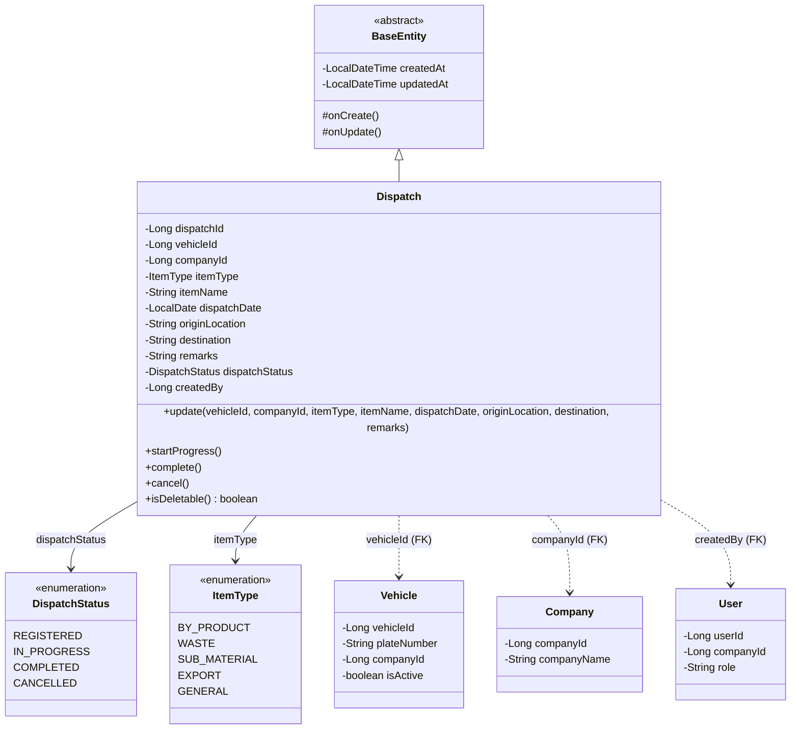
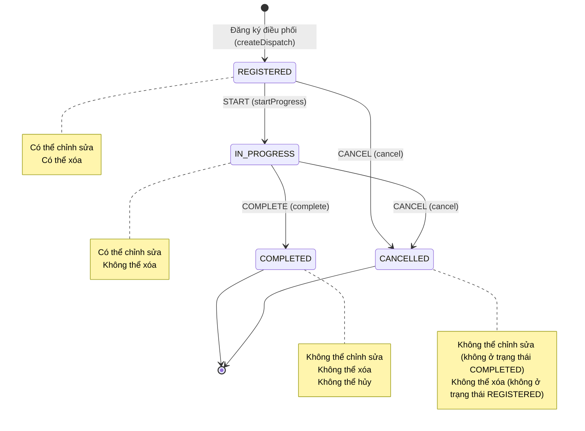
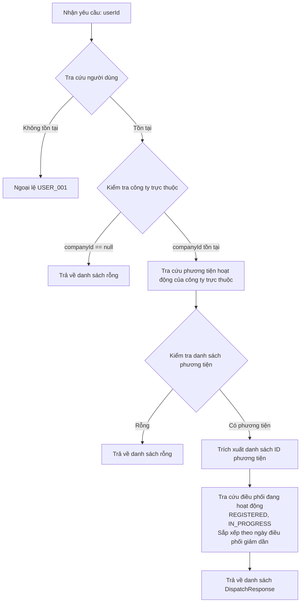
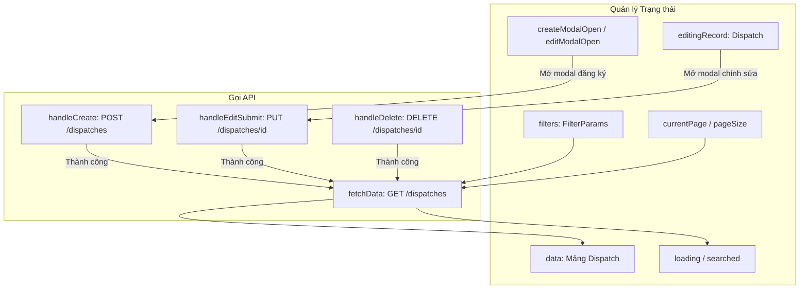
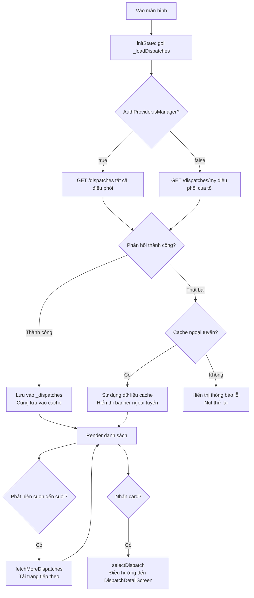
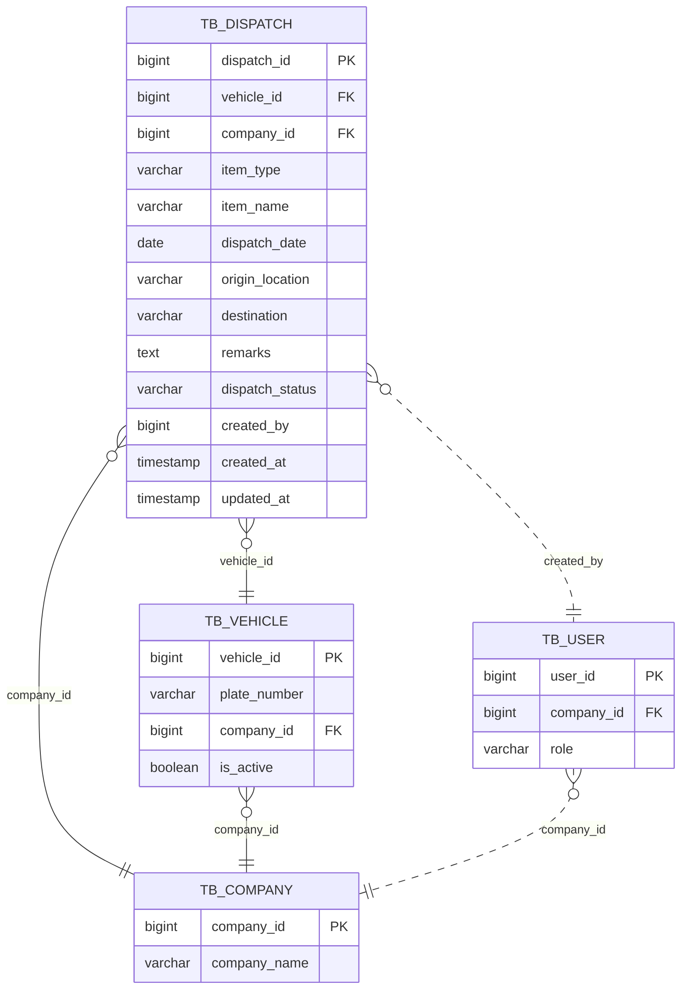
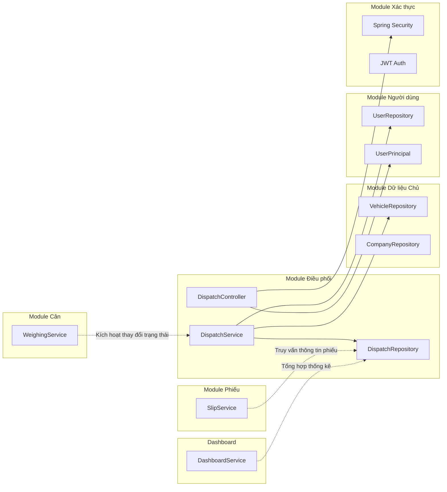

# Tài liệu Thiết kế Chi tiết Module Điều phối (Dispatch)

| Mục | Nội dung |
|-----|---------|
| **Phiên bản tài liệu** | 1.0 |
| **Ngày tạo** | 2026-01-29 |
| **Module mục tiêu** | `com.dongkuk.weighing.dispatch` |
| **Nền tảng liên quan** | Backend (Spring Boot), Frontend (React), Mobile (Flutter) |

---

## Mục lục

1. [Tổng quan Module](#1-tổng-quan-module)
2. [Mô hình Miền](#2-mô-hình-miền)
3. [Thiết kế API](#3-thiết-kế-api)
4. [Logic Dịch vụ](#4-logic-dịch-vụ)
5. [Đặc tả DTO](#5-đặc-tả-dto)
6. [Thiết kế Giao diện Frontend](#6-thiết-kế-giao-diện-frontend)
7. [Thiết kế Giao diện Mobile](#7-thiết-kế-giao-diện-mobile)
8. [Thiết kế Cơ sở dữ liệu](#8-thiết-kế-cơ-sở-dữ-liệu)
9. [Các Module liên quan](#9-các-module-liên-quan)
10. [Tóm tắt Quy tắc Nghiệp vụ](#10-tóm-tắt-quy-tắc-nghiệp-vụ)

---

## 1. Tổng quan Module

### 1.1 Mục đích

Module Điều phối (Dispatch) là module nghiệp vụ cốt lõi **quản lý thông tin phân bổ phương tiện** vận chuyển phụ phẩm, chất thải, phụ liệu, v.v. trong khuôn viên nhà máy thép. Module đăng ký các thông tin cần thiết cho vận chuyển như phương tiện, công ty, hạng mục, điểm xuất phát/điểm đến, và theo dõi vòng đời điều phối (Đăng ký - Đang tiến hành - Hoàn thành/Hủy).

### 1.2 Chức năng chính

| Chức năng | Mô tả | Vai trò người dùng |
|-----------|-------|---------------------|
| Đăng ký điều phối | Tạo điều phối với thông tin phương tiện, công ty, hạng mục, ngày, điểm xuất phát/điểm đến | ADMIN, MANAGER |
| Tra cứu điều phối | Tìm kiếm đa điều kiện theo khoảng thời gian, loại hạng mục, trạng thái và phân trang | Tất cả người dùng đã xác thực |
| Cập nhật điều phối | Thay đổi thông tin điều phối hiện có (trừ trạng thái hoàn thành) | ADMIN, MANAGER |
| Xóa điều phối | Chỉ có thể xóa điều phối ở trạng thái đã đăng ký | ADMIN |
| Thay đổi trạng thái | Bắt đầu (START), Hoàn thành (COMPLETE), Hủy (CANCEL) | ADMIN, MANAGER |
| Xem điều phối của tôi | Tra cứu danh sách điều phối đang hoạt động của công ty mà tài xế trực thuộc (mobile) | DRIVER |

### 1.3 Vị trí Module

```
backend/src/main/java/com/dongkuk/weighing/dispatch/
  ├── controller/   DispatchController.java
  ├── service/      DispatchService.java
  ├── domain/       Dispatch.java, DispatchStatus.java, ItemType.java, DispatchRepository.java
  └── dto/          DispatchCreateRequest.java, DispatchUpdateRequest.java,
                    DispatchResponse.java, DispatchSearchCondition.java

frontend/src/pages/DispatchPage.tsx

mobile/lib/
  ├── models/       dispatch.dart
  ├── providers/    dispatch_provider.dart
  └── screens/dispatch/
        ├── dispatch_list_screen.dart
        └── dispatch_detail_screen.dart
```

---

## 2. Mô hình Miền

### 2.1 Sơ đồ Lớp



### 2.2 Chi tiết Trường Entity

#### Entity Dispatch

| Trường | Kiểu | Cột DB | Ràng buộc | Mô tả |
|--------|------|--------|-----------|-------|
| `dispatchId` | `Long` | `dispatch_id` | PK, AUTO_INCREMENT | Mã định danh duy nhất của điều phối |
| `vehicleId` | `Long` | `vehicle_id` | NOT NULL, FK | ID phương tiện được phân bổ |
| `companyId` | `Long` | `company_id` | NOT NULL, FK | ID công ty vận chuyển |
| `itemType` | `ItemType` | `item_type` | NOT NULL, VARCHAR(20) | Loại hạng mục |
| `itemName` | `String` | `item_name` | NOT NULL, VARCHAR(100) | Tên hạng mục |
| `dispatchDate` | `LocalDate` | `dispatch_date` | NOT NULL | Ngày điều phối |
| `originLocation` | `String` | `origin_location` | VARCHAR(100) | Điểm xuất phát |
| `destination` | `String` | `destination` | VARCHAR(100) | Điểm đến |
| `remarks` | `String` | `remarks` | TEXT | Ghi chú |
| `dispatchStatus` | `DispatchStatus` | `dispatch_status` | NOT NULL, VARCHAR(20) | Trạng thái điều phối |
| `createdBy` | `Long` | `created_by` | - | ID người dùng tạo |
| `createdAt` | `LocalDateTime` | `created_at` | NOT NULL, tự động | Ngày giờ tạo (BaseEntity) |
| `updatedAt` | `LocalDateTime` | `updated_at` | NOT NULL, tự động | Ngày giờ cập nhật (BaseEntity) |

#### Kiểu liệt kê DispatchStatus

| Giá trị | Nhãn | Mô tả |
|---------|------|-------|
| `REGISTERED` | Đã đăng ký | Trạng thái ban đầu khi điều phối được tạo và đang chờ |
| `IN_PROGRESS` | Đang tiến hành | Quá trình cân đã bắt đầu và vận chuyển đang diễn ra |
| `COMPLETED` | Hoàn thành | Tất cả quá trình cân và vận chuyển đã kết thúc bình thường |
| `CANCELLED` | Đã hủy | Điều phối đã bị hủy và không còn hiệu lực |

#### Kiểu liệt kê ItemType

| Giá trị | Nhãn | Mô tả |
|---------|------|-------|
| `BY_PRODUCT` | Phụ phẩm | Phụ phẩm từ quá trình luyện thép (xỉ, bụi, v.v.) |
| `WASTE` | Chất thải | Chất thải công nghiệp và vật liệu cần xử lý |
| `SUB_MATERIAL` | Phụ liệu | Nguyên liệu phụ trợ được đưa vào quy trình sản xuất |
| `EXPORT` | Xuất | Hàng hóa được đưa ra khỏi khuôn viên ra bên ngoài |
| `GENERAL` | Chung | Hạng mục chung không thuộc các phân loại trên |

---

## 3. Thiết kế API

### 3.1 Danh sách Endpoint

Base URL: `/api/v1/dispatches`

| Method | URI | Mô tả | Quyền | HTTP Status |
|--------|-----|-------|-------|-------------|
| `POST` | `/api/v1/dispatches` | Đăng ký điều phối | ADMIN, MANAGER | 201 Created |
| `GET` | `/api/v1/dispatches` | Tìm kiếm danh sách điều phối | Người dùng đã xác thực | 200 OK |
| `GET` | `/api/v1/dispatches/{dispatchId}` | Tra cứu đơn lẻ điều phối | Người dùng đã xác thực | 200 OK |
| `GET` | `/api/v1/dispatches/my` | Xem điều phối của tôi (tài xế) | Người dùng đã xác thực | 200 OK |
| `PUT` | `/api/v1/dispatches/{dispatchId}` | Cập nhật điều phối | ADMIN, MANAGER | 200 OK |
| `DELETE` | `/api/v1/dispatches/{dispatchId}` | Xóa điều phối | ADMIN | 200 OK |
| `PUT` | `/api/v1/dispatches/{dispatchId}/status` | Thay đổi trạng thái điều phối | ADMIN, MANAGER | 200 OK |

### 3.2 Chi tiết API

#### 3.2.1 Đăng ký Điều phối

**`POST /api/v1/dispatches`**

Header yêu cầu:
```
Authorization: Bearer {accessToken}
Content-Type: application/json
```

Body yêu cầu:
```json
{
  "vehicle_id": 1,
  "company_id": 2,
  "item_type": "BY_PRODUCT",
  "item_name": "Xỉ",
  "dispatch_date": "2026-01-30",
  "origin_location": "Nhà máy 2 Bãi 2",
  "destination": "Cơ sở xử lý bên ngoài",
  "remarks": "Cần phân bổ phương tiện đặc biệt"
}
```

Phản hồi thành công (201):
```json
{
  "success": true,
  "data": {
    "dispatch_id": 15,
    "vehicle_id": 1,
    "company_id": 2,
    "item_type": "BY_PRODUCT",
    "item_name": "Xỉ",
    "dispatch_date": "2026-01-30",
    "origin_location": "Nhà máy 2 Bãi 2",
    "destination": "Cơ sở xử lý bên ngoài",
    "remarks": "Cần phân bổ phương tiện đặc biệt",
    "dispatch_status": "REGISTERED",
    "created_by": 3,
    "created_at": "2026-01-29T14:30:00",
    "updated_at": "2026-01-29T14:30:00"
  },
  "error": null
}
```

Phản hồi lỗi (400 - Lỗi xác thực):
```json
{
  "success": false,
  "data": null,
  "error": {
    "code": "VALIDATION_ERROR",
    "message": "vehicleId: must not be null"
  }
}
```

#### 3.2.2 Tìm kiếm Danh sách Điều phối

**`GET /api/v1/dispatches`**

Tham số truy vấn:

| Tham số | Kiểu | Bắt buộc | Mô tả |
|---------|------|----------|-------|
| `date_from` | `LocalDate` | Không | Ngày bắt đầu tìm kiếm (YYYY-MM-DD) |
| `date_to` | `LocalDate` | Không | Ngày kết thúc tìm kiếm (YYYY-MM-DD) |
| `item_type` | `ItemType` | Không | Bộ lọc loại hạng mục |
| `status` | `DispatchStatus` | Không | Bộ lọc trạng thái điều phối |
| `page` | `int` | Không | Số trang (bắt đầu từ 0, mặc định: 0) |
| `size` | `int` | Không | Kích thước trang (mặc định: 20) |
| `sort` | `String` | Không | Điều kiện sắp xếp (ví dụ: `dispatchDate,desc`) |

Ví dụ yêu cầu:
```
GET /api/v1/dispatches?date_from=2026-01-01&date_to=2026-01-31&item_type=BY_PRODUCT&status=REGISTERED&page=0&size=20
```

Phản hồi thành công (200):
```json
{
  "success": true,
  "data": {
    "content": [
      {
        "dispatch_id": 15,
        "vehicle_id": 1,
        "company_id": 2,
        "item_type": "BY_PRODUCT",
        "item_name": "Xỉ",
        "dispatch_date": "2026-01-30",
        "origin_location": "Nhà máy 2 Bãi 2",
        "destination": "Cơ sở xử lý bên ngoài",
        "remarks": null,
        "dispatch_status": "REGISTERED",
        "created_by": 3,
        "created_at": "2026-01-29T14:30:00",
        "updated_at": "2026-01-29T14:30:00"
      }
    ],
    "totalElements": 1,
    "totalPages": 1,
    "size": 20,
    "number": 0
  },
  "error": null
}
```

#### 3.2.3 Tra cứu Đơn lẻ Điều phối

**`GET /api/v1/dispatches/{dispatchId}`**

Phản hồi thành công (200):
```json
{
  "success": true,
  "data": {
    "dispatch_id": 15,
    "vehicle_id": 1,
    "company_id": 2,
    "item_type": "BY_PRODUCT",
    "item_name": "Xỉ",
    "dispatch_date": "2026-01-30",
    "origin_location": "Nhà máy 2 Bãi 2",
    "destination": "Cơ sở xử lý bên ngoài",
    "remarks": null,
    "dispatch_status": "REGISTERED",
    "created_by": 3,
    "created_at": "2026-01-29T14:30:00",
    "updated_at": "2026-01-29T14:30:00"
  },
  "error": null
}
```

Phản hồi lỗi (404):
```json
{
  "success": false,
  "data": null,
  "error": {
    "code": "DISPATCH_001",
    "message": "Không tìm thấy thông tin điều phối"
  }
}
```

#### 3.2.4 Xem Điều phối của Tôi (Dành cho Tài xế)

**`GET /api/v1/dispatches/my`**

Mô tả: Trả về các điều phối có thể thực hiện (trạng thái REGISTERED, IN_PROGRESS) của các phương tiện hoạt động thuộc công ty mà người dùng đã đăng nhập trực thuộc.

Phản hồi thành công (200):
```json
{
  "success": true,
  "data": [
    {
      "dispatch_id": 15,
      "vehicle_id": 1,
      "company_id": 2,
      "item_type": "BY_PRODUCT",
      "item_name": "Xỉ",
      "dispatch_date": "2026-01-30",
      "origin_location": "Nhà máy 2 Bãi 2",
      "destination": "Cơ sở xử lý bên ngoài",
      "remarks": null,
      "dispatch_status": "REGISTERED",
      "created_by": 3,
      "created_at": "2026-01-29T14:30:00",
      "updated_at": "2026-01-29T14:30:00"
    }
  ],
  "error": null
}
```

Logic tra cứu:
1. Xác nhận công ty trực thuộc (companyId) của người dùng đã đăng nhập
2. Nếu không có công ty trực thuộc, trả về mảng rỗng
3. Tra cứu danh sách phương tiện hoạt động (isActive=true) của công ty trực thuộc
4. Tra cứu điều phối đang hoạt động (REGISTERED, IN_PROGRESS) của các phương tiện đó
5. Trả về kết quả sắp xếp theo ngày điều phối giảm dần

#### 3.2.5 Cập nhật Điều phối

**`PUT /api/v1/dispatches/{dispatchId}`**

Body yêu cầu:
```json
{
  "vehicle_id": 2,
  "company_id": 2,
  "item_type": "WASTE",
  "item_name": "Chất thải công nghiệp",
  "dispatch_date": "2026-01-31",
  "origin_location": "Nhà máy 1 Khu thu gom chất thải",
  "destination": "Cơ sở xử lý bên ngoài",
  "remarks": "Đối tượng quản lý đặc biệt"
}
```

Phản hồi thành công (200): Cùng định dạng `DispatchResponse`

Phản hồi lỗi (400 - Cố gắng sửa đổi điều phối đã hoàn thành):
```json
{
  "success": false,
  "data": null,
  "error": {
    "code": "DISPATCH_002",
    "message": "Không thể sửa đổi điều phối đã hoàn thành"
  }
}
```

#### 3.2.6 Xóa Điều phối

**`DELETE /api/v1/dispatches/{dispatchId}`**

Phản hồi thành công (200):
```json
{
  "success": true,
  "data": null,
  "error": null
}
```

Phản hồi lỗi (400 - Cố gắng xóa điều phối không ở trạng thái đã đăng ký):
```json
{
  "success": false,
  "data": null,
  "error": {
    "code": "DISPATCH_003",
    "message": "Chỉ có thể xóa điều phối ở trạng thái đã đăng ký"
  }
}
```

#### 3.2.7 Thay đổi Trạng thái Điều phối

**`PUT /api/v1/dispatches/{dispatchId}/status?action={ACTION}`**

Các hành động được hỗ trợ:

| action | Mô tả | Trạng thái nguồn được phép | Trạng thái đích |
|--------|-------|---------------------------|-----------------|
| `START` | Bắt đầu tiến hành | REGISTERED | IN_PROGRESS |
| `COMPLETE` | Hoàn thành | IN_PROGRESS | COMPLETED |
| `CANCEL` | Hủy | REGISTERED, IN_PROGRESS | CANCELLED |

Ví dụ yêu cầu:
```
PUT /api/v1/dispatches/15/status?action=START
```

Phản hồi thành công (200): Cùng định dạng `DispatchResponse`

Phản hồi lỗi (400 - Chuyển đổi trạng thái không hợp lệ):
```json
{
  "success": false,
  "data": null,
  "error": {
    "code": "DISPATCH_004",
    "message": "Thay đổi trạng thái điều phối không hợp lệ"
  }
}
```

---

## 4. Logic Dịch vụ

### 4.1 Cấu trúc Tầng Dịch vụ

```
DispatchController
  └── DispatchService
        ├── DispatchRepository    (Truy cập dữ liệu điều phối)
        ├── VehicleRepository     (Tra cứu phương tiện - chức năng Điều phối của tôi)
        └── UserRepository        (Tra cứu người dùng - chức năng Điều phối của tôi)
```

### 4.2 Sơ đồ Chuyển đổi Trạng thái Điều phối



### 4.3 Chi tiết Quy tắc Nghiệp vụ

#### Đăng ký Điều phối (`createDispatch`)

1. Xác thực DTO yêu cầu (Bean Validation)
2. Tạo entity Dispatch bằng Builder pattern
3. Đặt trạng thái ban đầu là `REGISTERED`
4. Ghi lại ID người dùng đã xác thực vào `createdBy`
5. Lưu vào DB và trả về `DispatchResponse`
6. Ghi log: `Đăng ký điều phối: dispatchId={}, vehicleId={}, date={}`

#### Cập nhật Điều phối (`updateDispatch`)

1. Tra cứu điều phối theo `dispatchId` (ném DISPATCH_001 nếu không tìm thấy)
2. Gọi phương thức domain `update()`
3. Xác thực trạng thái trong domain: ném DISPATCH_002 nếu trạng thái là COMPLETED
4. Sau khi cập nhật trường, tự động phản ánh qua JPA Dirty Checking
5. Ghi log: `Cập nhật điều phối: dispatchId={}`

#### Xóa Điều phối (`deleteDispatch`)

1. Tra cứu điều phối theo `dispatchId` (ném DISPATCH_001 nếu không tìm thấy)
2. Xác thực bằng `isDeletable()`: trả về true chỉ khi trạng thái là REGISTERED
3. Ném DISPATCH_003 nếu không thể xóa
4. Thực hiện xóa vật lý (`repository.delete()`)
5. Ghi log: `Xóa điều phối: dispatchId={}`

#### Thay đổi Trạng thái Điều phối (`updateStatus`)

1. Tra cứu điều phối theo `dispatchId` (ném DISPATCH_001 nếu không tìm thấy)
2. Phân nhánh theo tham số `action` (không phân biệt hoa thường):
   - `START`: gọi `startProgress()` (REGISTERED -> IN_PROGRESS)
   - `COMPLETE`: gọi `complete()` (IN_PROGRESS -> COMPLETED)
   - `CANCEL`: gọi `cancel()` (REGISTERED/IN_PROGRESS -> CANCELLED)
   - Khác: ném DISPATCH_004
3. Ném DISPATCH_004 nếu xác thực trạng thái domain thất bại
4. Ghi log: `Thay đổi trạng thái điều phối: dispatchId={}, newStatus={}`

#### Xem Điều phối của Tôi (`getMyDispatches`)



### 4.4 Mã Lỗi

| Mã lỗi | HTTP Status | Thông báo | Điều kiện phát sinh |
|---------|-------------|-----------|---------------------|
| `DISPATCH_001` | 404 | Không tìm thấy thông tin điều phối | Tra cứu/cập nhật/xóa với dispatchId không tồn tại |
| `DISPATCH_002` | 400 | Không thể sửa đổi điều phối đã hoàn thành | Gọi update trên điều phối COMPLETED |
| `DISPATCH_003` | 400 | Chỉ có thể xóa điều phối ở trạng thái đã đăng ký | Cố gắng xóa điều phối không phải REGISTERED |
| `DISPATCH_004` | 400 | Thay đổi trạng thái điều phối không hợp lệ | Chuyển đổi trạng thái không được phép hoặc hành động không được hỗ trợ |

### 4.5 Quản lý Transaction

- Cấp lớp: `@Transactional(readOnly = true)` (mặc định chỉ đọc)
- Phương thức ghi: ghi đè `@Transactional` riêng lẻ
  - `createDispatch`: transaction ghi
  - `updateDispatch`: transaction ghi
  - `deleteDispatch`: transaction ghi
  - `updateStatus`: transaction ghi
- Phương thức đọc: áp dụng `readOnly = true` cấp lớp
  - `getDispatch`, `searchDispatches`, `getMyDispatches`

---

## 5. Đặc tả DTO

### 5.1 DispatchCreateRequest (Yêu cầu Tạo Điều phối)

DTO dựa trên Java Record. Áp dụng Bean Validation.

| Trường | Kiểu | JSON Key | Bắt buộc | Quy tắc xác thực | Mô tả |
|--------|------|----------|----------|-------------------|-------|
| `vehicleId` | `Long` | `vehicle_id` | Có | `@NotNull` | ID phương tiện |
| `companyId` | `Long` | `company_id` | Có | `@NotNull` | ID công ty |
| `itemType` | `ItemType` | `item_type` | Có | `@NotNull` | Loại hạng mục |
| `itemName` | `String` | `item_name` | Có | `@NotBlank`, `@Size(max=100)` | Tên hạng mục |
| `dispatchDate` | `LocalDate` | `dispatch_date` | Có | `@NotNull`, `@FutureOrPresent` | Ngày điều phối (hiện tại hoặc tương lai) |
| `originLocation` | `String` | `origin_location` | Không | `@Size(max=100)` | Điểm xuất phát |
| `destination` | `String` | `destination` | Không | `@Size(max=100)` | Điểm đến |
| `remarks` | `String` | `remarks` | Không | - | Ghi chú |

### 5.2 DispatchUpdateRequest (Yêu cầu Cập nhật Điều phối)

Có cùng trường và quy tắc xác thực như `DispatchCreateRequest`. Khi cập nhật cũng phải bao gồm tất cả trường bắt buộc (phương thức thay thế toàn bộ).

| Trường | Kiểu | JSON Key | Bắt buộc | Quy tắc xác thực | Mô tả |
|--------|------|----------|----------|-------------------|-------|
| `vehicleId` | `Long` | `vehicle_id` | Có | `@NotNull` | ID phương tiện |
| `companyId` | `Long` | `company_id` | Có | `@NotNull` | ID công ty |
| `itemType` | `ItemType` | `item_type` | Có | `@NotNull` | Loại hạng mục |
| `itemName` | `String` | `item_name` | Có | `@NotBlank`, `@Size(max=100)` | Tên hạng mục |
| `dispatchDate` | `LocalDate` | `dispatch_date` | Có | `@NotNull`, `@FutureOrPresent` | Ngày điều phối |
| `originLocation` | `String` | `origin_location` | Không | `@Size(max=100)` | Điểm xuất phát |
| `destination` | `String` | `destination` | Không | `@Size(max=100)` | Điểm đến |
| `remarks` | `String` | `remarks` | Không | - | Ghi chú |

### 5.3 DispatchResponse (Phản hồi Điều phối)

| Trường | Kiểu | JSON Key | Mô tả |
|--------|------|----------|-------|
| `dispatchId` | `Long` | `dispatch_id` | Mã định danh duy nhất của điều phối |
| `vehicleId` | `Long` | `vehicle_id` | ID phương tiện |
| `companyId` | `Long` | `company_id` | ID công ty |
| `itemType` | `String` | `item_type` | Loại hạng mục (tên enum) |
| `itemName` | `String` | `item_name` | Tên hạng mục |
| `dispatchDate` | `LocalDate` | `dispatch_date` | Ngày điều phối |
| `originLocation` | `String` | `origin_location` | Điểm xuất phát |
| `destination` | `String` | `destination` | Điểm đến |
| `remarks` | `String` | `remarks` | Ghi chú |
| `dispatchStatus` | `String` | `dispatch_status` | Trạng thái điều phối (tên enum) |
| `createdBy` | `Long` | `created_by` | ID người tạo |
| `createdAt` | `LocalDateTime` | `created_at` | Ngày giờ tạo (ISO 8601) |
| `updatedAt` | `LocalDateTime` | `updated_at` | Ngày giờ cập nhật (ISO 8601) |

Phương thức chuyển đổi: Sử dụng phương thức factory tĩnh `DispatchResponse.from(Dispatch dispatch)` để chuyển đổi entity sang DTO.

### 5.4 DispatchSearchCondition (Điều kiện Tìm kiếm Điều phối)

DTO nội bộ thu thập tham số truy vấn từ controller và chuyển đến service.

| Trường | Kiểu | Mô tả |
|--------|------|-------|
| `dateFrom` | `LocalDate` | Ngày bắt đầu tìm kiếm (cho phép null) |
| `dateTo` | `LocalDate` | Ngày kết thúc tìm kiếm (cho phép null) |
| `itemType` | `ItemType` | Bộ lọc loại hạng mục (cho phép null) |
| `status` | `DispatchStatus` | Bộ lọc trạng thái điều phối (cho phép null) |

Nếu tất cả trường là null, trả về toàn bộ điều phối. Truy vấn động được triển khai bằng pattern `IS NULL OR` trong JPQL.

---

## 6. Thiết kế Giao diện Frontend

### 6.1 Cấu trúc Màn hình

Vị trí file: `frontend/src/pages/DispatchPage.tsx`

```
DispatchPage
├── Tiêu đề trang: "Quản lý Điều phối"
├── Card Điều kiện Tìm kiếm (Card)
│   ├── Khoảng thời gian (RangePicker)
│   ├── Loại hạng mục (Select)
│   ├── Trạng thái điều phối (Select)
│   ├── Nút Đặt lại
│   └── Nút Tìm kiếm
├── Header Kết quả
│   ├── Số lượng kết quả tìm kiếm
│   ├── Nút Làm mới
│   └── Nút Đăng ký Điều phối
├── Bảng Điều phối (SortableTable)
│   └── Cột: ID, Loại hạng mục, Tên hạng mục, Ngày điều phối, Điểm xuất phát, Điểm đến, Trạng thái, Ngày tạo, Thao tác
├── Phân trang (Pagination)
├── Modal Đăng ký Điều phối (Modal + Form)
└── Modal Chỉnh sửa Điều phối (Modal + Form)
```

### 6.2 Luồng Dữ liệu Component



### 6.3 Định nghĩa Cột Bảng

| Cột | dataIndex | Rộng (px) | Render | Ghi chú |
|-----|-----------|----------|--------|---------|
| ID | `dispatchId` | 80 | Mặc định | - |
| Loại hạng mục | `itemType` | 100 | Ánh xạ `ITEM_TYPE_LABELS` | BY_PRODUCT -> "Phụ phẩm" |
| Tên hạng mục | `itemName` | 110 | Mặc định | - |
| Ngày điều phối | `dispatchDate` | 110 | Mặc định | YYYY-MM-DD |
| Điểm xuất phát | `originLocation` | 110 | Mặc định | - |
| Điểm đến | `destination` | 110 | Mặc định | - |
| Trạng thái | `dispatchStatus` | 90 | Tag + màu sắc | Ánh xạ `DISPATCH_STATUS_COLORS` |
| Ngày tạo | `createdAt` | 160 | Định dạng `YYYY-MM-DD HH:mm` | Sử dụng dayjs |
| Thao tác | - | 100 | Nút Sửa/Xóa | Xóa chỉ hiển thị cho REGISTERED |

### 6.4 Cấu hình Bộ lọc Tìm kiếm

| Bộ lọc | Component | Tùy chọn | Mặc định |
|--------|-----------|----------|----------|
| Khoảng thời gian | `RangePicker` | Ngày bắt đầu ~ Ngày kết thúc | null (Tất cả) |
| Loại hạng mục | `Select` | `ITEM_TYPE_OPTIONS` (Phụ phẩm, Chất thải, Phụ liệu, Xuất, Chung) | Tất cả |
| Trạng thái điều phối | `Select` | `DISPATCH_STATUS_OPTIONS` (Đã đăng ký, Đang tiến hành, Hoàn thành, Đã hủy) | Tất cả |

### 6.5 Cấu hình Trường Form (Đăng ký/Chỉnh sửa chung)

| Trường | Nhãn | Component | Bắt buộc | Xác thực |
|--------|------|-----------|----------|----------|
| `vehicleId` | ID Phương tiện | `Input[type=number]` | Có | required |
| `companyId` | ID Công ty vận chuyển | `Input[type=number]` | Có | required |
| `itemType` | Loại hạng mục | `Select` | Có | required |
| `itemName` | Tên hạng mục | `Input` | Có | required, `maxLengthRule(100)` |
| `dispatchDate` | Ngày điều phối | `DatePicker` | Có | required, `futureOrPresentDateValidator` |
| `originLocation` | Điểm xuất phát | `Input` | Không | `maxLengthRule(100)` |
| `destination` | Điểm đến | `Input` | Không | `maxLengthRule(100)` |
| `remarks` | Ghi chú | `Input.TextArea[rows=2]` | Không | - |

### 6.6 Tương tác Người dùng

| Hành động | Xử lý | Hành động tiếp theo |
|-----------|-------|---------------------|
| Nhấn nút Tìm kiếm | Gọi `fetchData(1, pageSize)` | Làm mới bảng, đặt lại về trang 1 |
| Nhấn nút Đặt lại | Đặt lại bộ lọc/dữ liệu/trạng thái tìm kiếm | Hiển thị bảng rỗng |
| Nhấn nút Đăng ký Điều phối | Mở modal đăng ký | - |
| Lưu modal Đăng ký | Gọi `POST /dispatches` | Thành công: đóng modal, làm mới danh sách |
| Nhấn biểu tượng Sửa | Mở modal chỉnh sửa + đặt dữ liệu hiện có | - |
| Lưu modal Chỉnh sửa | Gọi `PUT /dispatches/{id}` | Thành công: đóng modal, làm mới danh sách |
| Nhấn biểu tượng Xóa | Gọi `DELETE /dispatches/{id}` sau khi xác nhận Popconfirm | Thành công: làm mới danh sách |
| Thay đổi trang | Gọi `fetchData(page, size)` | Làm mới bảng |

---

## 7. Thiết kế Giao diện Mobile

### 7.1 Tổng quan Cấu trúc Màn hình

```
Màn hình Điều phối Mobile
├── DispatchListScreen (Danh sách Điều phối)
│   ├── Banner Chế độ Ngoại tuyến
│   ├── Thanh Tìm kiếm (biển số xe/tên công ty)
│   ├── Chip Bộ lọc Trạng thái (Tất cả, Chờ, Đang tiến hành, Hoàn thành)
│   └── Danh sách Card Điều phối (cuộn vô hạn)
│       └── _DispatchCard
│           ├── Số điều phối + Huy hiệu trạng thái
│           ├── Thông tin Phương tiện/Công ty/Hạng mục
│           ├── Thông tin Lộ trình
│           └── Ngày giờ điều phối + Mũi tên điều hướng
│
└── DispatchDetailScreen (Chi tiết Điều phối)
    ├── Card Trạng thái (Số điều phối, huy hiệu trạng thái, ngày giờ điều phối)
    ├── Phần Thông tin Phương tiện (biển số xe, tài xế)
    ├── Phần Công ty/Hạng mục (tên công ty, hạng mục, phân loại hạng mục)
    ├── Phần Thông tin Lộ trình (điểm xuất phát, điểm đến)
    ├── Phần Trọng lượng Dự kiến
    └── Phần Ghi chú
```

### 7.2 Mô hình Dữ liệu Mobile

Vị trí file: `mobile/lib/models/dispatch.dart`

#### Trường Lớp Dispatch

| Trường | Kiểu | Bắt buộc | Mô tả |
|--------|------|----------|-------|
| `id` | `String` | Có | ID duy nhất của điều phối |
| `dispatchNumber` | `String` | Có | Số điều phối (ví dụ: DSP-20250129-A1B2) |
| `status` | `DispatchStatus` | Có | Trạng thái điều phối |
| `vehicleNumber` | `String` | Có | Biển số xe |
| `driverName` | `String` | Có | Tên tài xế |
| `companyName` | `String` | Có | Tên công ty |
| `itemName` | `String` | Có | Tên hạng mục |
| `itemCategory` | `String?` | Không | Phân loại hạng mục |
| `origin` | `String?` | Không | Điểm xuất phát |
| `destination` | `String?` | Không | Điểm đến |
| `expectedWeight` | `double?` | Không | Trọng lượng dự kiến (kg) |
| `memo` | `String?` | Không | Ghi chú |
| `dispatchDate` | `DateTime` | Có | Ngày điều phối |
| `createdAt` | `DateTime?` | Không | Ngày giờ tạo |
| `updatedAt` | `DateTime?` | Không | Ngày giờ cập nhật |

#### Kiểu liệt kê DispatchStatus (Mobile)

| Giá trị | Giá trị JSON | Nhãn | Màu sắc | Icon |
|---------|-------------|------|---------|------|
| `registered` | `REGISTERED` | Đã đăng ký | Cyan (#06B6D4) | `Icons.assignment` |
| `inProgress` | `IN_PROGRESS` | Đang tiến hành | Amber (#F59E0B) | `Icons.local_shipping` |
| `completed` | `COMPLETED` | Hoàn thành | Green (#10B981) | `Icons.check_circle` |
| `cancelled` | `CANCELLED` | Đã hủy | Rose (#F43F5E) | `Icons.cancel` |

### 7.3 Quản lý Trạng thái Provider

Vị trí file: `mobile/lib/providers/dispatch_provider.dart`

#### Trường Trạng thái

| Trường | Kiểu | Mô tả |
|--------|------|-------|
| `_dispatches` | `List<Dispatch>` | Danh sách điều phối |
| `_selectedDispatch` | `Dispatch?` | Điều phối được chọn (cho màn hình chi tiết) |
| `_isLoading` | `bool` | Trạng thái loading |
| `_errorMessage` | `String?` | Thông báo lỗi |
| `_isOfflineMode` | `bool` | Cờ chế độ ngoại tuyến |
| `_currentPage` | `int` | Trang hiện tại (bắt đầu từ 0) |
| `_hasMore` | `bool` | Có thêm dữ liệu hay không |

#### Phương thức Chính

| Phương thức | Mô tả | Gọi API |
|-------------|-------|---------|
| `fetchDispatches(isManager)` | Lấy danh sách điều phối (tất cả/của tôi) | GET `/dispatches` hoặc `/dispatches/my` |
| `fetchMoreDispatches(isManager, date)` | Tải thêm trang cho cuộn vô hạn | GET (tăng số trang) |
| `fetchDispatchDetail(id)` | Lấy chi tiết điều phối | GET `/dispatches/{id}` |
| `selectDispatch(dispatch)` | Chọn điều phối từ danh sách | - (thay đổi trạng thái local) |
| `resetPagination()` | Đặt lại trạng thái phân trang | - |
| `clearError()` | Xóa trạng thái lỗi | - |
| `clearSelection()` | Xóa trạng thái lựa chọn | - |

### 7.4 Luồng Dữ liệu Màn hình Danh sách



### 7.5 Đặc điểm UI Mobile

| Tính năng | Cách triển khai |
|-----------|----------------|
| Tìm kiếm | TextField + lọc phía client (biển số xe/tên công ty) |
| Bộ lọc trạng thái | FilterChip cuộn ngang (Tất cả, Chờ, Đang tiến hành, Hoàn thành) |
| Hiển thị danh sách | Danh sách dựa trên widget Card (ListView.builder) |
| Cuộn vô hạn | ScrollController + phát hiện vị trí (200px từ cuối) |
| Kéo để Làm mới | Bọc RefreshIndicator |
| Hỗ trợ Ngoại tuyến | OfflineCacheService cho cache local + banner ngoại tuyến |
| Chế độ Tối | Tự động chuyển đổi dựa trên Theme.of(context).brightness |
| Hiển thị Trạng thái | Widget StatusBadge (nhãn + màu sắc + icon) |

---

## 8. Thiết kế Cơ sở dữ liệu

### 8.1 DDL Bảng

```sql
CREATE TABLE tb_dispatch (
    dispatch_id      BIGSERIAL       PRIMARY KEY,
    vehicle_id       BIGINT          NOT NULL,
    company_id       BIGINT          NOT NULL,
    item_type        VARCHAR(20)     NOT NULL,
    item_name        VARCHAR(100)    NOT NULL,
    dispatch_date    DATE            NOT NULL,
    origin_location  VARCHAR(100),
    destination      VARCHAR(100),
    remarks          TEXT,
    dispatch_status  VARCHAR(20)     NOT NULL,
    created_by       BIGINT,
    created_at       TIMESTAMP       NOT NULL DEFAULT CURRENT_TIMESTAMP,
    updated_at       TIMESTAMP       NOT NULL DEFAULT CURRENT_TIMESTAMP,

    CONSTRAINT fk_dispatch_vehicle
        FOREIGN KEY (vehicle_id) REFERENCES tb_vehicle(vehicle_id),
    CONSTRAINT fk_dispatch_company
        FOREIGN KEY (company_id) REFERENCES tb_company(company_id),
    CONSTRAINT chk_dispatch_status
        CHECK (dispatch_status IN ('REGISTERED', 'IN_PROGRESS', 'COMPLETED', 'CANCELLED')),
    CONSTRAINT chk_item_type
        CHECK (item_type IN ('BY_PRODUCT', 'WASTE', 'SUB_MATERIAL', 'EXPORT', 'GENERAL'))
);
```

### 8.2 Index

```sql
-- Tối ưu hóa truy vấn theo ngày điều phối (bộ lọc chính cho tìm kiếm danh sách)
CREATE INDEX idx_dispatch_date
    ON tb_dispatch (dispatch_date);

-- Tối ưu hóa truy vấn điều phối theo phương tiện (điều phối của tôi, điều phối đang hoạt động theo phương tiện)
CREATE INDEX idx_dispatch_vehicle
    ON tb_dispatch (vehicle_id);

-- Tối ưu hóa truy vấn điều phối theo trạng thái (bộ lọc trạng thái, truy vấn điều phối đang hoạt động)
CREATE INDEX idx_dispatch_status
    ON tb_dispatch (dispatch_status);
```

### 8.3 Phân tích Sử dụng Index

| Pattern Truy vấn | Index Sử dụng | Tần suất |
|-------------------|---------------|----------|
| Danh sách điều phối theo khoảng ngày | `idx_dispatch_date` | Cao |
| Tìm kiếm đa điều kiện (ngày + loại hạng mục + trạng thái) | `idx_dispatch_date` + `idx_dispatch_status` | Cao |
| Điều phối đang hoạt động theo danh sách ID phương tiện | `idx_dispatch_vehicle` + `idx_dispatch_status` | Cao |
| Đếm điều phối theo ngày và trạng thái (dashboard) | `idx_dispatch_date` + `idx_dispatch_status` | Trung bình |
| Kiểm tra tồn tại công ty/phương tiện | `idx_dispatch_vehicle`, không cần index riêng | Thấp |

### 8.4 Sơ đồ ER



---

## 9. Các Module liên quan

### 9.1 Sơ đồ Phụ thuộc Module



### 9.2 Chi tiết Tương tác giữa các Module

| Module liên quan | Hướng | Nội dung Tương tác |
|------------------|-------|-------------------|
| **Dữ liệu Chủ (Vehicle)** | Điều phối -> Phương tiện | Gọi `VehicleRepository.findByCompanyIdAndIsActiveTrue()` để tra cứu phương tiện hoạt động của công ty trực thuộc |
| **Dữ liệu Chủ (Company)** | Điều phối -> Công ty | Tham chiếu công ty bằng `companyId`. Cung cấp `existsByCompanyId()` để kiểm tra sự tồn tại của điều phối |
| **Người dùng (User)** | Điều phối -> Người dùng | Gọi `UserRepository.findById()` để xác nhận công ty trực thuộc của người dùng (Điều phối của tôi) |
| **Xác thực (Auth)** | Xác thực -> Điều phối | Kiểm soát truy cập dựa trên vai trò qua `@PreAuthorize`. Trích xuất ID người dùng từ `UserPrincipal` |
| **Cân (Weighing)** | Cân -> Điều phối | Thay đổi trạng thái điều phối sang IN_PROGRESS khi bắt đầu cân, sang COMPLETED khi hoàn thành cân |
| **Phiếu (Slip)** | Phiếu -> Điều phối | Truy vấn `findSlipInfoByDispatchId()` cho tên hạng mục, biển số xe, tên công ty của điều phối |
| **Dashboard** | Dashboard -> Điều phối | Tổng hợp số lượng điều phối theo ngày/trạng thái qua `countByDispatchDateAndDispatchStatus()` |

### 9.3 Truy vấn Liên kết Bên ngoài do Repository cung cấp

| Phương thức | Nơi sử dụng | Mô tả |
|-------------|-------------|-------|
| `existsByCompanyId(Long)` | Xác thực xóa dữ liệu chủ | Kiểm tra xem có điều phối tồn tại cho công ty hay không |
| `existsByVehicleId(Long)` | Xác thực xóa dữ liệu chủ | Kiểm tra xem có điều phối tồn tại cho phương tiện hay không |
| `findActiveByVehicleIds(List<Long>)` | Điều phối của tôi | Tra cứu điều phối đang hoạt động cho danh sách ID phương tiện |
| `countByDispatchDateAndDispatchStatus(LocalDate, DispatchStatus)` | Thống kê dashboard | Đếm theo ngày/trạng thái |
| `findSlipInfoByDispatchId(Long)` | Tạo phiếu | Tra cứu tên hạng mục, biển số xe, tên công ty cho điều phối (native query, JOIN) |

---

## 10. Tóm tắt Quy tắc Nghiệp vụ

### 10.1 Quy tắc Đăng ký Điều phối

| # | Quy tắc | Vị trí Triển khai |
|---|---------|-------------------|
| R01 | ID Phương tiện, ID Công ty, Loại hạng mục, Tên hạng mục và Ngày điều phối là bắt buộc | `DispatchCreateRequest` (Bean Validation) |
| R02 | Ngày điều phối phải là hiện tại hoặc tương lai | `@FutureOrPresent` |
| R03 | Tên hạng mục tối đa 100 ký tự | `@Size(max=100)` |
| R04 | Điểm xuất phát và điểm đến mỗi cái tối đa 100 ký tự | `@Size(max=100)` |
| R05 | Trạng thái ban đầu phải là REGISTERED khi tạo điều phối | Constructor `Dispatch` |
| R06 | ID người tạo điều phối được ghi lại tự động | `DispatchService.createDispatch()` |
| R07 | Chỉ ADMIN hoặc MANAGER mới có thể đăng ký điều phối | `@PreAuthorize("hasAnyRole('ADMIN', 'MANAGER')")` |

### 10.2 Quy tắc Cập nhật Điều phối

| # | Quy tắc | Vị trí Triển khai |
|---|---------|-------------------|
| R08 | Điều phối ở trạng thái COMPLETED không thể sửa đổi | `Dispatch.update()` |
| R09 | Cập nhật sử dụng phương thức thay thế toàn bộ (cần tất cả trường bắt buộc) | `DispatchUpdateRequest` |
| R10 | Chỉ ADMIN hoặc MANAGER mới có thể cập nhật điều phối | `@PreAuthorize` |

### 10.3 Quy tắc Xóa Điều phối

| # | Quy tắc | Vị trí Triển khai |
|---|---------|-------------------|
| R11 | Chỉ điều phối ở trạng thái REGISTERED mới có thể xóa | `Dispatch.isDeletable()` |
| R12 | Điều phối trạng thái IN_PROGRESS, COMPLETED, CANCELLED không thể xóa | `DispatchService.deleteDispatch()` |
| R13 | Chỉ ADMIN mới có thể xóa điều phối | `@PreAuthorize("hasRole('ADMIN')")` |
| R14 | Xóa là xóa vật lý (loại bỏ hoàn toàn khỏi DB) | `repository.delete()` |

### 10.4 Quy tắc Thay đổi Trạng thái

| # | Quy tắc | Vị trí Triển khai |
|---|---------|-------------------|
| R15 | START (bắt đầu tiến hành) chỉ được phép từ REGISTERED | `Dispatch.startProgress()` |
| R16 | COMPLETE chỉ được phép từ IN_PROGRESS | `Dispatch.complete()` |
| R17 | CANCEL không được phép từ trạng thái COMPLETED | `Dispatch.cancel()` |
| R18 | CANCEL được phép từ REGISTERED và IN_PROGRESS | `Dispatch.cancel()` |
| R19 | COMPLETED và CANCELLED là trạng thái cuối cùng (không cho phép chuyển đổi tiếp) | Mỗi phương thức domain |
| R20 | Giá trị action không được hỗ trợ dẫn đến lỗi DISPATCH_004 | `DispatchService.updateStatus()` |
| R21 | Chỉ ADMIN hoặc MANAGER mới có thể thay đổi trạng thái | `@PreAuthorize` |

### 10.5 Quy tắc Điều phối của Tôi

| # | Quy tắc | Vị trí Triển khai |
|---|---------|-------------------|
| R22 | Người dùng không có công ty trực thuộc nhận danh sách điều phối rỗng | `DispatchService.getMyDispatches()` |
| R23 | Nếu công ty trực thuộc không có phương tiện hoạt động, trả về danh sách rỗng | `DispatchService.getMyDispatches()` |
| R24 | Chỉ điều phối đang hoạt động (REGISTERED, IN_PROGRESS) được trả về | `DispatchRepository.findActiveByVehicleIds()` |
| R25 | Kết quả được sắp xếp theo ngày điều phối giảm dần | JPQL `ORDER BY d.dispatchDate DESC` |

### 10.6 Quy tắc Chung Frontend/Mobile

| # | Quy tắc | Vị trí Triển khai |
|---|---------|-------------------|
| R26 | Nút xóa chỉ hiển thị cho điều phối ở trạng thái REGISTERED | `DispatchPage.tsx` render có điều kiện |
| R27 | Trường JSON sử dụng snake_case; code frontend sử dụng camelCase | Axios interceptor tự động chuyển đổi |
| R28 | Trên mobile khi lỗi mạng, vào chế độ ngoại tuyến với dữ liệu cache | `DispatchProvider.fetchDispatches()` |
| R29 | Danh sách mobile sử dụng cuộn vô hạn để phân trang (20 mục mỗi trang) | `DispatchProvider._pageSize = 20` |
| R30 | Bộ lọc trạng thái mobile được thực hiện phía client | `_getFilteredDispatches()` |

---

## Phụ lục: Ma trận Hành động Được phép theo Trạng thái

| Trạng thái hiện tại | Xem | Sửa | Xóa | START | COMPLETE | CANCEL |
|---------------------|:---:|:---:|:---:|:-----:|:--------:|:------:|
| **REGISTERED** | O | O | O | O | X | O |
| **IN_PROGRESS** | O | O | X | X | O | O |
| **COMPLETED** | O | X | X | X | X | X |
| **CANCELLED** | O | X | X | X | X | X |

> O = Được phép, X = Không được phép (ném BusinessException)
