# Tài liệu Thiết kế Chi tiết Module Giấy phép Ra cổng (GatePass) và Phiếu cân Điện tử (Slip)

| Mục | Nội dung |
|-----|----------|
| **Phiên bản tài liệu** | 1.0 |
| **Ngày lập** | 2026-01-29 |
| **Module** | gatepass (Quản lý giấy phép ra cổng), slip (Phiếu cân điện tử) |
| **Package Backend** | `com.dongkuk.weighing.gatepass`, `com.dongkuk.weighing.slip` |
| **Frontend** | `GatePassPage.tsx`, `SlipPage.tsx` |
| **Mobile** | `gate_pass.dart`, `weighing_slip.dart`, `slip_list_screen.dart`, `slip_detail_screen.dart` |

---

## Mục lục

1. [Tổng quan Module - Quản lý Giấy phép Ra cổng (GatePass)](#1-tổng-quan-module---quản-lý-giấy-phép-ra-cổng-gatepass)
2. [Mô hình Miền Giấy phép Ra cổng](#2-mô-hình-miền-giấy-phép-ra-cổng)
3. [Thiết kế API Giấy phép Ra cổng](#3-thiết-kế-api-giấy-phép-ra-cổng)
4. [Logic Dịch vụ Giấy phép Ra cổng](#4-logic-dịch-vụ-giấy-phép-ra-cổng)
5. [Tổng quan Module - Phiếu cân Điện tử (Slip)](#5-tổng-quan-module---phiếu-cân-điện-tử-slip)
6. [Mô hình Miền Phiếu cân](#6-mô-hình-miền-phiếu-cân)
7. [Thiết kế API Phiếu cân](#7-thiết-kế-api-phiếu-cân)
8. [Logic Dịch vụ Phiếu cân](#8-logic-dịch-vụ-phiếu-cân)
9. [Đặc tả DTO](#9-đặc-tả-dto)
10. [Thiết kế Giao diện Frontend](#10-thiết-kế-giao-diện-frontend)
11. [Thiết kế Giao diện Mobile](#11-thiết-kế-giao-diện-mobile)
12. [Thiết kế Cơ sở dữ liệu](#12-thiết-kế-cơ-sở-dữ-liệu)
13. [Tích hợp Liên module](#13-tích-hợp-liên-module)
14. [Tóm tắt Quy tắc Nghiệp vụ](#14-tóm-tắt-quy-tắc-nghiệp-vụ)

---

## 1. Tổng quan Module - Quản lý Giấy phép Ra cổng (GatePass)

### 1.1 Mục đích

Module Quản lý Giấy phép Ra cổng chịu trách nhiệm kiểm soát việc ra vào của phương tiện trong khuôn viên sau khi hoàn tất cân. Module này phát hành giấy phép ra cổng liên kết với bản ghi cân (WeighingRecord) và lệnh điều xe (Dispatch), và cho phép nhân viên có vai trò ADMIN hoặc MANAGER thực hiện phê duyệt (cho qua) hoặc từ chối.

### 1.2 Chức năng Chính

| Chức năng | Mô tả | Quyền hạn |
|-----------|-------|-----------|
| Tạo giấy phép ra cổng | Phát hành giấy phép ra cổng mới cho lượt cân đã hoàn tất | ADMIN, MANAGER |
| Tra cứu giấy phép ra cổng | Tra cứu đơn lẻ theo ID và danh sách phân trang theo trạng thái | Người dùng đã xác thực |
| Phê duyệt giấy phép ra cổng | Chuyển trạng thái giấy phép thành PASSED và ghi nhận thời điểm ra cổng | ADMIN, MANAGER |
| Từ chối giấy phép ra cổng | Chuyển trạng thái giấy phép thành REJECTED và ghi nhận lý do từ chối | ADMIN, MANAGER |

### 1.3 Cấu trúc Package

```
com.dongkuk.weighing.gatepass/
├── domain/
│   ├── GatePass.java              # Entity giấy phép ra cổng
│   ├── GatePassStatus.java        # Enum trạng thái giấy phép ra cổng
│   └── GatePassRepository.java    # Interface repository giấy phép ra cổng
├── service/
│   └── GatePassService.java       # Dịch vụ nghiệp vụ giấy phép ra cổng
├── controller/
│   └── GatePassController.java    # Controller REST API
└── dto/
    ├── GatePassCreateRequest.java # DTO yêu cầu tạo mới
    ├── GatePassRejectRequest.java # DTO yêu cầu từ chối
    └── GatePassResponse.java      # DTO phản hồi
```

---

## 2. Mô hình Miền Giấy phép Ra cổng

### 2.1 Sơ đồ Lớp

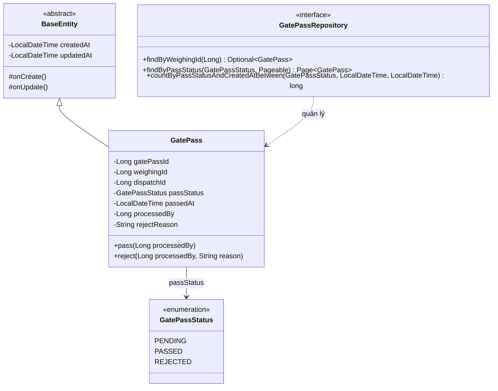

### 2.2 Chi tiết Trường Entity

| Trường | Kiểu | Tên cột | Ràng buộc | Mô tả |
|--------|------|---------|-----------|-------|
| `gatePassId` | Long | `gate_pass_id` | PK, AUTO_INCREMENT | Mã định danh duy nhất giấy phép ra cổng |
| `weighingId` | Long | `weighing_id` | NOT NULL, INDEX | ID bản ghi cân liên quan |
| `dispatchId` | Long | `dispatch_id` | NOT NULL | ID lệnh điều xe liên quan |
| `passStatus` | GatePassStatus | `pass_status` | NOT NULL, VARCHAR(20), INDEX | Trạng thái giấy phép ra cổng |
| `passedAt` | LocalDateTime | `passed_at` | NULLABLE | Ngày giờ ra cổng |
| `processedBy` | Long | `processed_by` | NULLABLE | ID người xử lý |
| `rejectReason` | String | `reject_reason` | NULLABLE, VARCHAR(255) | Lý do từ chối |
| `createdAt` | LocalDateTime | `created_at` | NOT NULL (BaseEntity) | Thời điểm tạo |
| `updatedAt` | LocalDateTime | `updated_at` | NOT NULL (BaseEntity) | Thời điểm cập nhật |

### 2.3 Enum Trạng thái (GatePassStatus)

| Giá trị | Nhãn | Mô tả |
|---------|------|-------|
| `PENDING` | Chờ xử lý | Giấy phép đã được phát hành và đang chờ phê duyệt |
| `PASSED` | Đã thông qua | Giấy phép đã được phê duyệt và phương tiện được phép ra cổng |
| `REJECTED` | Đã từ chối | Giấy phép đã bị từ chối và phương tiện không được phép ra cổng |

---

## 3. Thiết kế API Giấy phép Ra cổng

### 3.1 Danh sách Endpoint

| Phương thức | Đường dẫn | Mô tả | Quyền hạn |
|-------------|-----------|-------|-----------|
| `POST` | `/api/v1/gate-passes` | Tạo giấy phép ra cổng | ADMIN, MANAGER |
| `GET` | `/api/v1/gate-passes/{gatePassId}` | Tra cứu đơn lẻ giấy phép ra cổng | Người dùng đã xác thực |
| `GET` | `/api/v1/gate-passes` | Danh sách giấy phép ra cổng theo trạng thái | Người dùng đã xác thực |
| `PUT` | `/api/v1/gate-passes/{gatePassId}/pass` | Phê duyệt giấy phép ra cổng | ADMIN, MANAGER |
| `PUT` | `/api/v1/gate-passes/{gatePassId}/reject` | Từ chối giấy phép ra cổng | ADMIN, MANAGER |

### 3.2 Tạo Giấy phép Ra cổng

**Yêu cầu**

```http
POST /api/v1/gate-passes
Content-Type: application/json
Authorization: Bearer {access_token}

{
  "weighing_id": 42,
  "dispatch_id": 15
}
```

**Phản hồi (201 Created)**

```json
{
  "success": true,
  "data": {
    "gate_pass_id": 1,
    "weighing_id": 42,
    "dispatch_id": 15,
    "pass_status": "PENDING",
    "passed_at": null,
    "processed_by": null,
    "reject_reason": null,
    "created_at": "2026-01-29T10:30:00"
  },
  "error": null
}
```

### 3.3 Tra cứu Đơn lẻ Giấy phép Ra cổng

**Yêu cầu**

```http
GET /api/v1/gate-passes/1
Authorization: Bearer {access_token}
```

**Phản hồi (200 OK)**

```json
{
  "success": true,
  "data": {
    "gate_pass_id": 1,
    "weighing_id": 42,
    "dispatch_id": 15,
    "pass_status": "PENDING",
    "passed_at": null,
    "processed_by": null,
    "reject_reason": null,
    "created_at": "2026-01-29T10:30:00"
  },
  "error": null
}
```

### 3.4 Danh sách Giấy phép Ra cổng theo Trạng thái

**Yêu cầu**

```http
GET /api/v1/gate-passes?status=PENDING&page=0&size=20
Authorization: Bearer {access_token}
```

- Nếu tham số `status` bị bỏ qua, giá trị mặc định `PENDING` sẽ được sử dụng.

**Phản hồi (200 OK)**

```json
{
  "success": true,
  "data": {
    "content": [
      {
        "gate_pass_id": 1,
        "weighing_id": 42,
        "dispatch_id": 15,
        "pass_status": "PENDING",
        "passed_at": null,
        "processed_by": null,
        "reject_reason": null,
        "created_at": "2026-01-29T10:30:00"
      }
    ],
    "pageable": { "page_number": 0, "page_size": 20 },
    "total_elements": 1,
    "total_pages": 1
  },
  "error": null
}
```

### 3.5 Phê duyệt Giấy phép Ra cổng

**Yêu cầu**

```http
PUT /api/v1/gate-passes/1/pass
Authorization: Bearer {access_token}
```

- Không có nội dung yêu cầu. ID của người dùng đã xác thực sẽ được tự động ghi nhận vào `processedBy`.

**Phản hồi (200 OK)**

```json
{
  "success": true,
  "data": {
    "gate_pass_id": 1,
    "weighing_id": 42,
    "dispatch_id": 15,
    "pass_status": "PASSED",
    "passed_at": "2026-01-29T11:05:00",
    "processed_by": 3,
    "reject_reason": null,
    "created_at": "2026-01-29T10:30:00"
  },
  "error": null
}
```

### 3.6 Từ chối Giấy phép Ra cổng

**Yêu cầu**

```http
PUT /api/v1/gate-passes/1/reject
Content-Type: application/json
Authorization: Bearer {access_token}

{
  "reason": "Từ chối do hồ sơ không đầy đủ"
}
```

**Phản hồi (200 OK)**

```json
{
  "success": true,
  "data": {
    "gate_pass_id": 1,
    "weighing_id": 42,
    "dispatch_id": 15,
    "pass_status": "REJECTED",
    "passed_at": null,
    "processed_by": 3,
    "reject_reason": "Từ chối do hồ sơ không đầy đủ",
    "created_at": "2026-01-29T10:30:00"
  },
  "error": null
}
```

### 3.7 Phản hồi Lỗi

| Tình huống | Mã HTTP | Mã lỗi | Thông báo |
|------------|---------|--------|-----------|
| Không tìm thấy giấy phép ra cổng | 404 | MASTER_001 | Không tìm thấy dữ liệu chính |
| Không đủ quyền | 403 | - | Access Denied |
| Thiếu trường bắt buộc | 400 | - | Validation Error |

---

## 4. Logic Dịch vụ Giấy phép Ra cổng

### 4.1 Sơ đồ Chuyển đổi Trạng thái

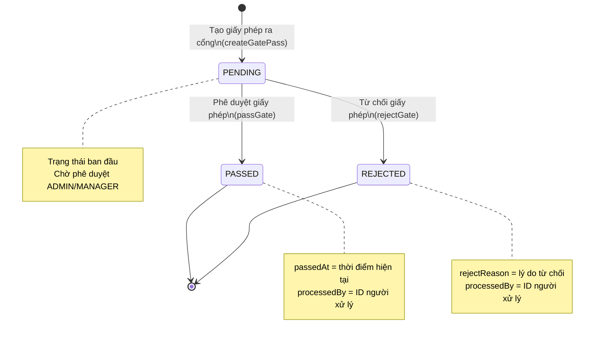

### 4.2 Chi tiết Phương thức Dịch vụ

#### createGatePass(GatePassCreateRequest)

1. Tạo entity bằng `GatePass.builder()`.
2. Trong constructor, `passStatus` được khởi tạo thành `PENDING`.
3. Lưu trữ entity bằng `gatePassRepository.save()`.
4. Trả về DTO phản hồi thông qua `GatePassResponse.from()`.
5. Log INFO: `Đăng ký giấy phép ra cổng: gatePassId={}, weighingId={}`

#### getGatePass(Long gatePassId)

1. Tra cứu giấy phép ra cổng bằng `findById()`. Nếu không tìm thấy, ném `BusinessException(MASTER_001)`.
2. Trả về DTO phản hồi thông qua `GatePassResponse.from()`.

#### getGatePassesByStatus(GatePassStatus, Pageable)

1. Thực hiện truy vấn phân trang theo trạng thái bằng `gatePassRepository.findByPassStatus()`.
2. Trả về kết quả được ánh xạ dưới dạng `Page<GatePassResponse>`.

#### passGate(Long gatePassId, Long processedBy)

1. Tra cứu giấy phép ra cổng bằng `findById()`.
2. Gọi `gatePass.pass(processedBy)`.
   - Chuyển `passStatus` thành `PASSED`.
   - Đặt `passedAt` thành thời điểm hiện tại.
   - Ghi nhận `processedBy`.
3. Cập nhật tự động thông qua JPA dirty checking.
4. Log INFO: `Phê duyệt giấy phép ra cổng: gatePassId={}, processedBy={}`

#### rejectGate(Long gatePassId, String reason, Long processedBy)

1. Tra cứu giấy phép ra cổng bằng `findById()`.
2. Gọi `gatePass.reject(processedBy, reason)`.
   - Chuyển `passStatus` thành `REJECTED`.
   - Ghi nhận `processedBy`.
   - Ghi nhận lý do từ chối vào `rejectReason`.
3. Cập nhật tự động thông qua JPA dirty checking.
4. Log INFO: `Từ chối giấy phép ra cổng: gatePassId={}, reason={}, processedBy={}`

### 4.3 Chính sách Giao dịch

| Phương thức | Giao dịch | Mô tả |
|-------------|-----------|-------|
| `createGatePass` | `@Transactional` | Giao dịch ghi |
| `getGatePass` | `@Transactional(readOnly=true)` | Chỉ đọc (cấp lớp) |
| `getGatePassesByStatus` | `@Transactional(readOnly=true)` | Chỉ đọc (cấp lớp) |
| `passGate` | `@Transactional` | Giao dịch ghi |
| `rejectGate` | `@Transactional` | Giao dịch ghi |

---

## 5. Tổng quan Module - Phiếu cân Điện tử (Slip)

### 5.1 Mục đích

Module Phiếu cân Điện tử quản lý chứng từ được phát hành sau khi hoàn tất cân. Module tạo tài liệu điện tử chứa thông tin biển số xe, tên công ty, tên hàng hóa, trọng lượng tổng/trọng lượng bì/trọng lượng tịnh, và hỗ trợ chia sẻ bên ngoài qua KakaoTalk, SMS và các kênh khác.

### 5.2 Chức năng Chính

| Chức năng | Mô tả | Ghi chú |
|-----------|-------|---------|
| Tạo phiếu cân | Tự động phát hành phiếu cân điện tử khi hoàn tất cân | Gọi nội bộ từ dịch vụ |
| Tra cứu phiếu cân | Tra cứu đơn lẻ theo ID, số phiếu cân, hoặc ID bản ghi cân | Nhiều đường dẫn truy vấn |
| Tìm kiếm theo Kỳ | Truy vấn phân trang lọc theo ngày bắt đầu đến ngày kết thúc | Phạm vi ngày có thể null |
| Chia sẻ phiếu cân | Chia sẻ bên ngoài qua KakaoTalk, SMS, email, v.v. | Lịch sử chia sẻ được ghi nhận |

### 5.3 Cấu trúc Package

```
com.dongkuk.weighing.slip/
├── domain/
│   ├── WeighingSlip.java              # Entity phiếu cân điện tử
│   └── WeighingSlipRepository.java    # Interface repository phiếu cân
├── service/
│   └── WeighingSlipService.java       # Dịch vụ nghiệp vụ phiếu cân
├── controller/
│   └── WeighingSlipController.java    # Controller REST API
└── dto/
    ├── SlipResponse.java              # DTO phản hồi
    └── SlipShareRequest.java          # DTO yêu cầu chia sẻ
```

---

## 6. Mô hình Miền Phiếu cân

### 6.1 Sơ đồ Lớp

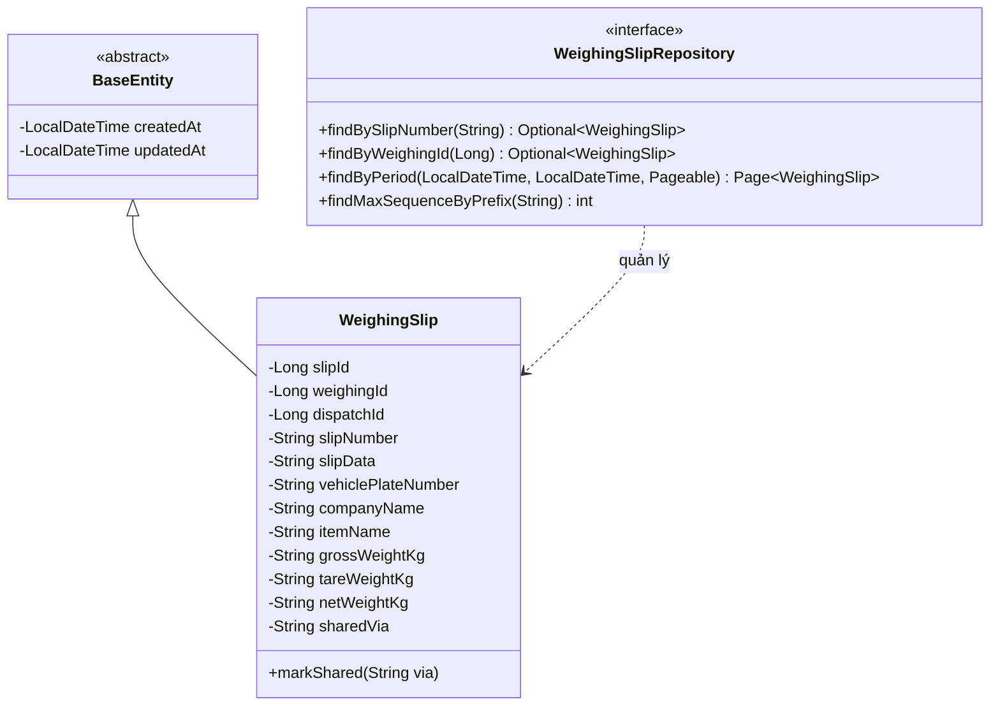

### 6.2 Chi tiết Trường Entity

| Trường | Kiểu | Tên cột | Ràng buộc | Mô tả |
|--------|------|---------|-----------|-------|
| `slipId` | Long | `slip_id` | PK, AUTO_INCREMENT | Mã định danh duy nhất phiếu cân |
| `weighingId` | Long | `weighing_id` | NOT NULL, INDEX | ID bản ghi cân liên quan |
| `dispatchId` | Long | `dispatch_id` | NOT NULL | ID lệnh điều xe liên quan |
| `slipNumber` | String | `slip_number` | NOT NULL, UNIQUE, VARCHAR(30), INDEX | Số phiếu cân (yyyyMMdd-NNNN) |
| `slipData` | String | `slip_data` | NOT NULL, TEXT | Dữ liệu phiếu cân (JSON) |
| `vehiclePlateNumber` | String | `vehicle_plate_number` | NULLABLE, VARCHAR(20) | Biển số xe |
| `companyName` | String | `company_name` | NULLABLE, VARCHAR(100) | Tên công ty |
| `itemName` | String | `item_name` | NULLABLE, VARCHAR(100) | Tên hàng hóa |
| `grossWeightKg` | String | `gross_weight_kg` | NULLABLE, VARCHAR(20) | Trọng lượng tổng (chuỗi hiển thị) |
| `tareWeightKg` | String | `tare_weight_kg` | NULLABLE, VARCHAR(20) | Trọng lượng bì (chuỗi hiển thị) |
| `netWeightKg` | String | `net_weight_kg` | NULLABLE, VARCHAR(20) | Trọng lượng tịnh (chuỗi hiển thị) |
| `sharedVia` | String | `shared_via` | NULLABLE, VARCHAR(20) | Phương thức chia sẻ (KAKAO, EMAIL, SMS) |
| `createdAt` | LocalDateTime | `created_at` | NOT NULL (BaseEntity) | Thời điểm tạo |
| `updatedAt` | LocalDateTime | `updated_at` | NOT NULL (BaseEntity) | Thời điểm cập nhật |

### 6.3 Quy tắc Sinh Số Phiếu cân

Số phiếu cân được cấp tuần tự theo ngày với định dạng `yyyyMMdd-NNNN`.

- Tiền tố: Tạo từ ngày hiện tại theo định dạng `yyyyMMdd` (ví dụ: `20260129-`)
- Số thứ tự: Số thứ tự lớn nhất trong các phiếu cân phát hành cùng ngày + 1
- Số chữ số: Số thứ tự được đệm số 0 thành 4 chữ số (ví dụ: `0001`)
- Ví dụ: `20260129-0001`, `20260129-0002`, ...

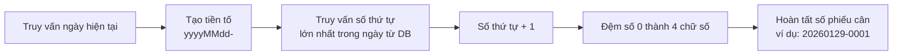

---

## 7. Thiết kế API Phiếu cân

### 7.1 Danh sách Endpoint

| Phương thức | Đường dẫn | Mô tả | Ghi chú |
|-------------|-----------|-------|---------|
| `GET` | `/api/v1/slips/{slipId}` | Tra cứu phiếu cân theo ID | |
| `GET` | `/api/v1/slips/number/{slipNumber}` | Tra cứu phiếu cân theo số phiếu | |
| `GET` | `/api/v1/slips/weighing/{weighingId}` | Tra cứu phiếu cân theo ID bản ghi cân | |
| `GET` | `/api/v1/slips` | Danh sách phiếu cân theo kỳ | Hỗ trợ phân trang |
| `POST` | `/api/v1/slips/{slipId}/share` | Chia sẻ phiếu cân | |

> Lưu ý: Việc tạo phiếu cân (createSlip) không được cung cấp dưới dạng REST API. Nó được gọi nội bộ trong dịch vụ khi hoàn tất cân.

### 7.2 Tra cứu Phiếu cân theo ID

**Yêu cầu**

```http
GET /api/v1/slips/1
Authorization: Bearer {access_token}
```

**Phản hồi (200 OK)**

```json
{
  "success": true,
  "data": {
    "slip_id": 1,
    "weighing_id": 42,
    "dispatch_id": 15,
    "slip_number": "20260129-0001",
    "vehicle_plate_number": "12ga3456",
    "company_name": "Dongkuk Logistics",
    "item_name": "Thep thanh",
    "gross_weight_kg": "45200",
    "tare_weight_kg": "15100",
    "net_weight_kg": "30100",
    "shared_via": null,
    "created_at": "2026-01-29T10:35:00"
  },
  "error": null
}
```

### 7.3 Tra cứu Phiếu cân theo Số Phiếu

**Yêu cầu**

```http
GET /api/v1/slips/number/20260129-0001
Authorization: Bearer {access_token}
```

**Phản hồi**: Cùng định dạng với 7.2.

### 7.4 Tra cứu Phiếu cân theo ID Bản ghi Cân

**Yêu cầu**

```http
GET /api/v1/slips/weighing/42
Authorization: Bearer {access_token}
```

**Phản hồi**: Cùng định dạng với 7.2.

### 7.5 Danh sách Phiếu cân theo Kỳ

**Yêu cầu**

```http
GET /api/v1/slips?date_from=2026-01-01&date_to=2026-01-29&page=0&size=20
Authorization: Bearer {access_token}
```

- Cả `date_from` và `date_to` đều là tham số tùy chọn. Nếu bỏ qua, tất cả bản ghi sẽ được trả về.
- `date_from` bao gồm từ 00:00:00 của ngày được chỉ định, và `date_to` bao gồm đến 23:59:59 của ngày được chỉ định.

**Phản hồi (200 OK)**

```json
{
  "success": true,
  "data": {
    "content": [
      {
        "slip_id": 1,
        "weighing_id": 42,
        "dispatch_id": 15,
        "slip_number": "20260129-0001",
        "vehicle_plate_number": "12ga3456",
        "company_name": "Dongkuk Logistics",
        "item_name": "Thep thanh",
        "gross_weight_kg": "45200",
        "tare_weight_kg": "15100",
        "net_weight_kg": "30100",
        "shared_via": "KAKAO",
        "created_at": "2026-01-29T10:35:00"
      }
    ],
    "pageable": { "page_number": 0, "page_size": 20 },
    "total_elements": 1,
    "total_pages": 1
  },
  "error": null
}
```

### 7.6 Chia sẻ Phiếu cân

**Yêu cầu**

```http
POST /api/v1/slips/1/share
Content-Type: application/json
Authorization: Bearer {access_token}

{
  "type": "KAKAO"
}
```

**Phản hồi (200 OK)**

```json
{
  "success": true,
  "data": {
    "slip_id": 1,
    "weighing_id": 42,
    "dispatch_id": 15,
    "slip_number": "20260129-0001",
    "vehicle_plate_number": "12ga3456",
    "company_name": "Dongkuk Logistics",
    "item_name": "Thep thanh",
    "gross_weight_kg": "45200",
    "tare_weight_kg": "15100",
    "net_weight_kg": "30100",
    "shared_via": "KAKAO",
    "created_at": "2026-01-29T10:35:00"
  },
  "error": null
}
```

### 7.7 Phản hồi Lỗi

| Tình huống | Mã HTTP | Mã lỗi | Thông báo |
|------------|---------|--------|-----------|
| Không tìm thấy phiếu cân (theo ID) | 404 | SLIP_001 | Không tìm thấy phiếu cân |
| Không tìm thấy phiếu cân (theo số phiếu) | 404 | SLIP_001 | Không tìm thấy phiếu cân |
| Không tìm thấy phiếu cân (theo ID bản ghi cân) | 404 | SLIP_001 | Không tìm thấy phiếu cân |
| Tạo phiếu cân cho lượt cân chưa hoàn tất | 400 | SLIP_002 | Không thể tạo phiếu cân cho lượt cân chưa hoàn tất |
| Thiếu loại chia sẻ | 400 | - | Validation Error |

---

## 8. Logic Dịch vụ Phiếu cân

### 8.1 Quy trình Tạo Phiếu cân

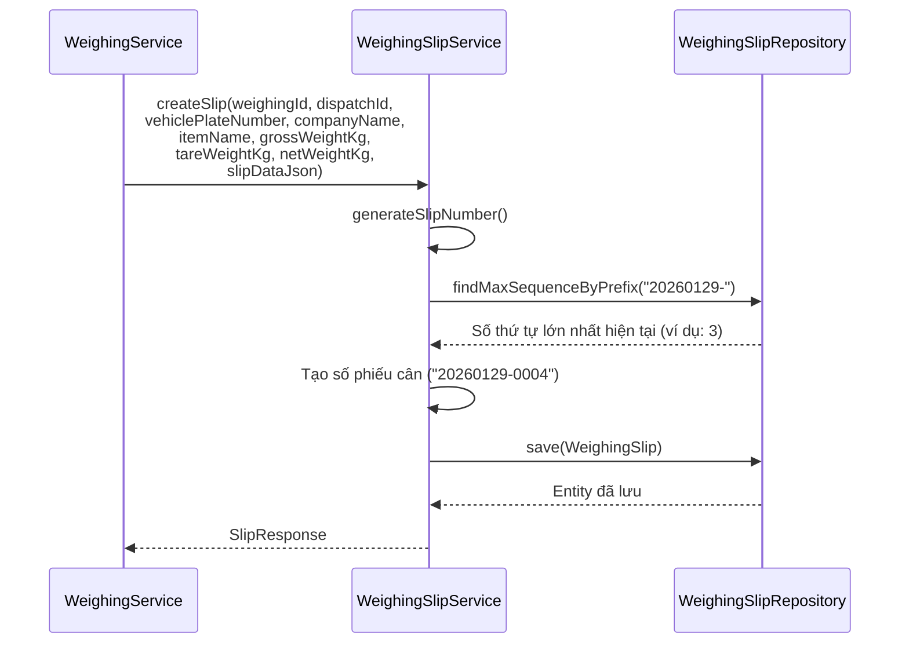

### 8.2 Quy trình Chia sẻ Phiếu cân

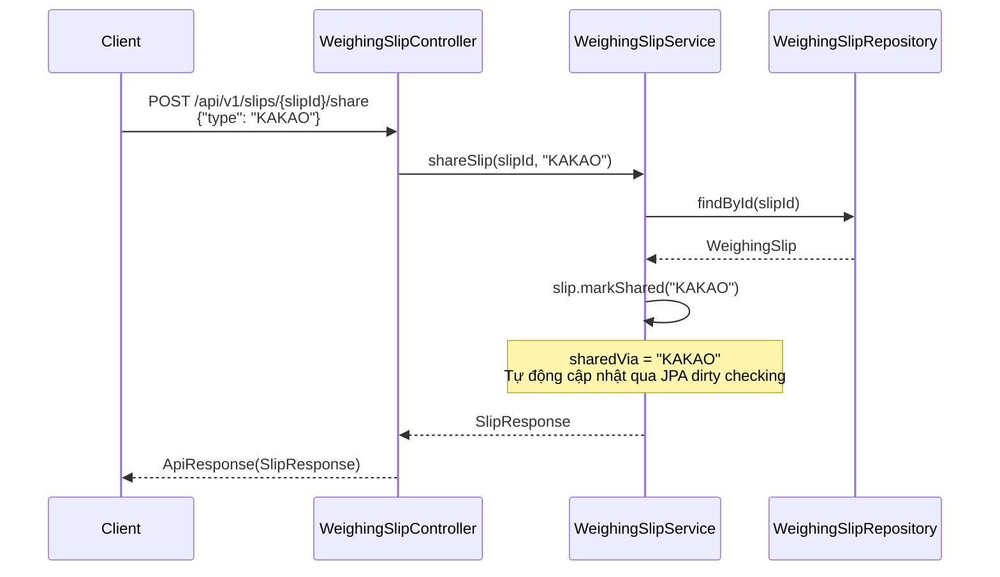

### 8.3 Chi tiết Phương thức Dịch vụ

#### createSlip(...)

1. Tạo số phiếu cân tuần tự theo ngày bằng `generateSlipNumber()`.
2. Lắp ráp entity bằng `WeighingSlip.builder()`.
3. Lưu trữ entity bằng `slipRepository.save()`.
4. Log INFO: `Tạo phiếu cân: slipId={}, slipNumber={}, weighingId={}`
5. Trả về phản hồi thông qua `SlipResponse.from()`.

> Lưu ý: Phương thức này không được cung cấp dưới dạng REST API. Nó được gọi nội bộ bởi WeighingService khi hoàn tất cân.

#### getSlip(Long slipId)

1. Tra cứu phiếu cân bằng `findSlipById()`. Nếu không tìm thấy, ném `BusinessException(SLIP_001)`.
2. Trả về phản hồi thông qua `SlipResponse.from()`.

#### getSlipByNumber(String slipNumber)

1. Tra cứu phiếu cân bằng `slipRepository.findBySlipNumber()`.
2. Nếu không tìm thấy, ném `BusinessException(SLIP_001)`.

#### getSlipByWeighingId(Long weighingId)

1. Tra cứu phiếu cân bằng `slipRepository.findByWeighingId()`.
2. Nếu không tìm thấy, ném `BusinessException(SLIP_001)`.

#### searchSlips(LocalDate dateFrom, LocalDate dateTo, Pageable)

1. Nếu `dateFrom` được cung cấp, chuyển đổi bằng `dateFrom.atStartOfDay()`.
2. Nếu `dateTo` được cung cấp, chuyển đổi bằng `dateTo.atTime(LocalTime.MAX)`.
3. Thực hiện truy vấn phân trang bằng `slipRepository.findByPeriod()`.

#### shareSlip(Long slipId, String shareType)

1. Tra cứu phiếu cân bằng `findSlipById()`.
2. Gọi `slip.markShared(shareType.toUpperCase())`.
3. Cập nhật tự động thông qua JPA dirty checking.
4. Log INFO: `Chia sẻ phiếu cân: slipId={}, via={}`

### 8.4 Chính sách Giao dịch

| Phương thức | Giao dịch | Mô tả |
|-------------|-----------|-------|
| `createSlip` | `@Transactional` | Giao dịch ghi |
| `getSlip` | `@Transactional(readOnly=true)` | Chỉ đọc (cấp lớp) |
| `getSlipByNumber` | `@Transactional(readOnly=true)` | Chỉ đọc (cấp lớp) |
| `getSlipByWeighingId` | `@Transactional(readOnly=true)` | Chỉ đọc (cấp lớp) |
| `searchSlips` | `@Transactional(readOnly=true)` | Chỉ đọc (cấp lớp) |
| `shareSlip` | `@Transactional` | Giao dịch ghi |

---

## 9. Đặc tả DTO

### 9.1 DTO Module Giấy phép Ra cổng

#### GatePassCreateRequest

DTO yêu cầu tạo mới giấy phép ra cổng (Java Record).

| Trường | Kiểu | Bắt buộc | Xác thực | Mô tả |
|--------|------|----------|----------|-------|
| `weighingId` | Long | Có | `@NotNull` | ID bản ghi cân |
| `dispatchId` | Long | Có | `@NotNull` | ID lệnh điều xe |

#### GatePassRejectRequest

DTO yêu cầu từ chối giấy phép ra cổng (Java Record).

| Trường | Kiểu | Bắt buộc | Xác thực | Mô tả |
|--------|------|----------|----------|-------|
| `reason` | String | Có | `@NotBlank` | Lý do từ chối (không chấp nhận chuỗi rỗng) |

#### GatePassResponse

DTO phản hồi giấy phép ra cổng (Java Record). Được tạo thông qua phương thức factory tĩnh `GatePassResponse.from(GatePass)`.

| Trường | Kiểu | Nullable | Khóa JSON | Mô tả |
|--------|------|----------|-----------|-------|
| `gatePassId` | Long | N | `gate_pass_id` | ID giấy phép ra cổng |
| `weighingId` | Long | N | `weighing_id` | ID bản ghi cân |
| `dispatchId` | Long | N | `dispatch_id` | ID lệnh điều xe |
| `passStatus` | String | N | `pass_status` | Trạng thái (PENDING/PASSED/REJECTED) |
| `passedAt` | LocalDateTime | Y | `passed_at` | Ngày giờ ra cổng |
| `processedBy` | Long | Y | `processed_by` | ID người xử lý |
| `rejectReason` | String | Y | `reject_reason` | Lý do từ chối |
| `createdAt` | LocalDateTime | N | `created_at` | Thời điểm tạo |

### 9.2 DTO Module Phiếu cân

#### SlipResponse

DTO phản hồi phiếu cân điện tử (Java Record). Được tạo thông qua phương thức factory tĩnh `SlipResponse.from(WeighingSlip)`.

| Trường | Kiểu | Nullable | Khóa JSON | Mô tả |
|--------|------|----------|-----------|-------|
| `slipId` | Long | N | `slip_id` | ID phiếu cân |
| `weighingId` | Long | N | `weighing_id` | ID bản ghi cân |
| `dispatchId` | Long | N | `dispatch_id` | ID lệnh điều xe |
| `slipNumber` | String | N | `slip_number` | Số phiếu cân (yyyyMMdd-NNNN) |
| `vehiclePlateNumber` | String | Y | `vehicle_plate_number` | Biển số xe |
| `companyName` | String | Y | `company_name` | Tên công ty |
| `itemName` | String | Y | `item_name` | Tên hàng hóa |
| `grossWeightKg` | String | Y | `gross_weight_kg` | Trọng lượng tổng (chuỗi hiển thị) |
| `tareWeightKg` | String | Y | `tare_weight_kg` | Trọng lượng bì (chuỗi hiển thị) |
| `netWeightKg` | String | Y | `net_weight_kg` | Trọng lượng tịnh (chuỗi hiển thị) |
| `sharedVia` | String | Y | `shared_via` | Phương thức chia sẻ (KAKAO/SMS/EMAIL) |
| `createdAt` | LocalDateTime | N | `created_at` | Thời điểm tạo |

#### SlipShareRequest

DTO yêu cầu chia sẻ phiếu cân điện tử (Java Record).

| Trường | Kiểu | Bắt buộc | Xác thực | Mô tả |
|--------|------|----------|----------|-------|
| `type` | String | Có | `@NotBlank` | Phương thức chia sẻ (EMAIL, SMS, KAKAO, v.v.) |

### 9.3 Interface TypeScript Frontend

#### GatePass

```typescript
export interface GatePass {
  gatePassId: number;
  weighingId: number;
  dispatchId: number;
  passStatus: string;       // "PENDING" | "PASSED" | "REJECTED"
  passedAt?: string;        // ISO 8601
  processedBy?: number;
  rejectReason?: string;
  createdAt: string;         // ISO 8601
}
```

#### WeighingSlip

```typescript
export interface WeighingSlip {
  slipId: number;
  weighingId: number;
  dispatchId: number;
  slipNumber: string;
  vehiclePlateNumber?: string;
  companyName?: string;
  itemName?: string;
  grossWeightKg?: number;
  tareWeightKg?: number;
  netWeightKg?: number;
  sharedVia?: string;
  createdAt: string;         // ISO 8601
}
```

### 9.4 Model Dart Mobile

#### GatePass (Mobile)

Model mobile khác với backend ở một số điểm. Các trường dành riêng cho mobile (passNumber, vehicleNumber, driverName, type, expiresAt) được bổ sung, và enum trạng thái cũng sử dụng các trạng thái mở rộng riêng cho mobile (issued, used, expired, cancelled).

| Trường | Kiểu | Mô tả |
|--------|------|-------|
| `id` | String | ID giấy phép ra cổng |
| `passNumber` | String | Số giấy phép ra cổng |
| `dispatchId` | String | ID lệnh điều xe |
| `vehicleNumber` | String | Biển số xe |
| `driverName` | String | Tên tài xế |
| `type` | GatePassType | Loại (entry/exit) |
| `status` | GatePassStatus | Trạng thái (issued/used/expired/cancelled) |
| `issuedAt` | DateTime | Ngày giờ phát hành |
| `usedAt` | DateTime? | Ngày giờ sử dụng |
| `expiresAt` | DateTime? | Ngày giờ hết hạn |

#### WeighingSlip (Mobile)

Model dành riêng cho mobile chứa thông tin phong phú hơn phản hồi backend. Bao gồm thời gian cân lần 1/lần 2, thông tin trạm cân, người vận hành và thông tin lộ trình.

| Trường | Kiểu | Mô tả |
|--------|------|-------|
| `id` | String | ID phiếu cân |
| `slipNumber` | String | Số phiếu cân |
| `dispatchId` | String | ID lệnh điều xe |
| `dispatchNumber` | String | Số lệnh điều xe |
| `vehicleNumber` | String | Biển số xe |
| `driverName` | String | Tên tài xế |
| `companyName` | String | Tên công ty |
| `itemName` | String | Tên hàng hóa |
| `itemCategory` | String? | Phân loại hàng hóa |
| `firstWeight` | double | Trọng lượng cân lần 1 (trọng lượng tổng, kg) |
| `secondWeight` | double | Trọng lượng cân lần 2 (trọng lượng bì, kg) |
| `netWeight` | double | Trọng lượng tịnh (kg) |
| `firstWeighingTime` | DateTime | Thời gian cân lần 1 |
| `secondWeighingTime` | DateTime | Thời gian cân lần 2 |
| `scaleId` | String? | ID trạm cân |
| `scaleName` | String? | Tên trạm cân |
| `operatorName` | String? | Tên người vận hành |
| `origin` | String? | Nơi xuất phát |
| `destination` | String? | Nơi đến |
| `memo` | String? | Ghi chú |
| `isShared` | bool | Trạng thái chia sẻ |
| `createdAt` | DateTime | Thời điểm tạo |

---

## 10. Thiết kế Giao diện Frontend

### 10.1 Trang Quản lý Giấy phép Ra cổng (GatePassPage)

**Tệp**: `frontend/src/pages/GatePassPage.tsx`

#### Bố cục Giao diện

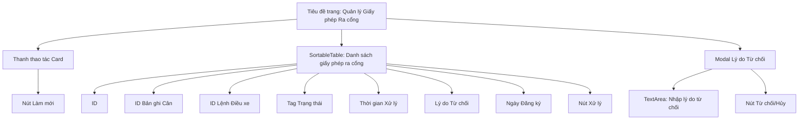

#### Định nghĩa Cột Bảng

| Tên cột | dataIndex | Chiều rộng | Hiển thị |
|---------|-----------|------------|----------|
| ID | `gatePassId` | 80px | Số |
| ID Bản ghi Cân | `weighingId` | 100px | Số |
| ID Lệnh Điều xe | `dispatchId` | 100px | Số |
| Trạng thái | `passStatus` | 90px | Component Tag (màu: Chờ=vàng, Đã thông qua=xanh, Đã từ chối=đỏ) |
| Thời gian Xử lý | `passedAt` | 160px | Định dạng ngày (YYYY-MM-DD HH:mm) hoặc `-` |
| Lý do Từ chối | `rejectReason` | 130px | Văn bản hoặc `-` |
| Ngày Đăng ký | `createdAt` | 160px | Định dạng ngày (YYYY-MM-DD HH:mm) |
| Xử lý | - | 160px | Chỉ trạng thái PENDING: Nút Phê duyệt (Popconfirm)/Từ chối |

#### Ánh xạ Màu Trạng thái

| Trạng thái | Nhãn | Màu |
|------------|------|-----|
| `PENDING` | Chờ xử lý | `colors.warning` (vàng) |
| `PASSED` | Đã thông qua | `colors.success` (xanh) |
| `REJECTED` | Đã từ chối | `colors.error` (đỏ) |

#### Tương tác Người dùng

1. **Vào trang**: Tự động tải danh sách giấy phép ra cổng qua `GET /gate-passes?size=20`.
2. **Xử lý phê duyệt**: Nhấn nút "Phê duyệt" hiển thị hộp thoại Popconfirm xác nhận, sau đó gọi `PUT /gate-passes/{id}/pass`.
3. **Xử lý từ chối**: Nhấn nút "Từ chối" mở modal. Sau khi nhập lý do, gọi `PUT /gate-passes/{id}/reject`. Lý do là trường bắt buộc.
4. **Làm mới**: Nhấn nút tải lại danh sách.

### 10.2 Trang Quản lý Phiếu cân Điện tử (SlipPage)

**Tệp**: `frontend/src/pages/SlipPage.tsx`

#### Bố cục Giao diện

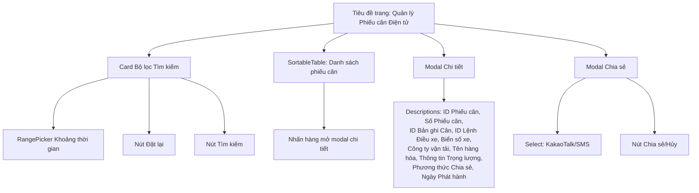

#### Định nghĩa Cột Bảng

| Tên cột | dataIndex | Chiều rộng | Căn chỉnh | Hiển thị |
|---------|-----------|------------|-----------|----------|
| ID | `slipId` | 80px | Trái | Số |
| Số Phiếu cân | `slipNumber` | 120px | Trái | Văn bản |
| Biển số xe | `vehiclePlateNumber` | 110px | Trái | Văn bản hoặc `-` |
| Công ty vận tải | `companyName` | 100px | Trái | Văn bản hoặc `-` |
| Tên hàng hóa | `itemName` | 100px | Trái | Văn bản hoặc `-` |
| Trọng lượng tổng (kg) | `grossWeightKg` | 120px | Phải | Số định dạng locale |
| Trọng lượng bì (kg) | `tareWeightKg` | 130px | Phải | Số định dạng locale |
| Trọng lượng tịnh (kg) | `netWeightKg` | 120px | Phải | **Nhấn mạnh** (màu primary, bold) |
| Chia sẻ | `sharedVia` | 80px | Trái | Tag hoặc `-` |
| Ngày phát hành | `createdAt` | 160px | Trái | Định dạng ngày |
| Chia sẻ | - | 80px | Trái | Nút chia sẻ |

#### Modal Chi tiết (Descriptions)

Khi nhấn vào hàng, các mục sau được hiển thị bằng component `Descriptions` (bordered, 2 cột, kích thước small):

- ID Phiếu cân, Số Phiếu cân, ID Bản ghi Cân, ID Lệnh Điều xe
- Biển số xe, Công ty vận tải, Tên hàng hóa
- Trọng lượng tổng (kg), Trọng lượng bì (kg), Trọng lượng tịnh (kg) - Trọng lượng tịnh được nhấn mạnh bằng màu primary
- Phương thức Chia sẻ (component Tag), Ngày Phát hành

#### Modal Chia sẻ

- Sử dụng component `Select` để chọn phương thức chia sẻ.
- Tùy chọn khả dụng: KakaoTalk (KAKAO), SMS
- Nhấn nút "Chia sẻ" gọi `POST /slips/{slipId}/share`.

#### Bộ lọc Tìm kiếm

- Bộ lọc ngày: Chọn khoảng thời gian (ngày bắt đầu đến ngày kết thúc) bằng `RangePicker` của Ant Design.
- Nút Đặt lại: Đặt lại bộ lọc ngày về null.
- Nút Tìm kiếm: Gọi `GET /slips` với tham số `dateFrom` và `dateTo`.

---

## 11. Thiết kế Giao diện Mobile

### 11.1 Màn hình Danh sách Phiếu cân (SlipListScreen)

**Tệp**: `mobile/lib/screens/slip/slip_list_screen.dart`

#### Cấu trúc Màn hình

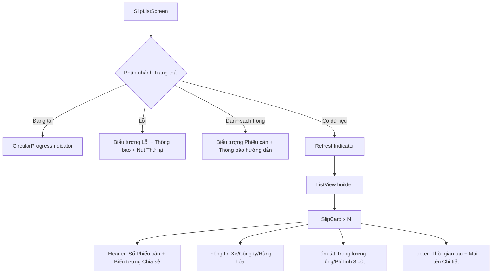

#### Hành vi Chính

1. **Tải ban đầu**: Trong `initState()`, gọi `DispatchProvider.fetchSlips()` dựa trên ngày hiện tại (`yyyy-MM-dd`).
2. **Kéo để Làm mới**: Hỗ trợ kéo xuống để làm mới qua `RefreshIndicator`.
3. **Nhấn thẻ**: Nhấn vào thẻ sẽ chuyển đến `SlipDetailScreen`, truyền `slipId`.

#### Các thành phần _SlipCard

| Vùng | Nội dung | Kiểu dáng |
|------|----------|-----------|
| Header | Biểu tượng phiếu cân + Số phiếu cân + Biểu tượng trạng thái chia sẻ | `titleMedium`, biểu tượng màu primary |
| Hàng thông tin | Biển số xe, Tên công ty, Tên hàng hóa (mỗi mục kèm biểu tượng) | `bodyMedium` |
| Tóm tắt trọng lượng | Trọng lượng tổng / Bì / Tịnh (3 cột, có đường phân cách) | Chỉ trọng lượng tịnh: bold + màu primary |
| Footer | Biểu tượng đồng hồ + Thời gian tạo + Mũi tên chi tiết | `bodySmall`, màu phụ |

### 11.2 Màn hình Chi tiết Phiếu cân (SlipDetailScreen)

**Tệp**: `mobile/lib/screens/slip/slip_detail_screen.dart`

#### Cấu trúc Màn hình

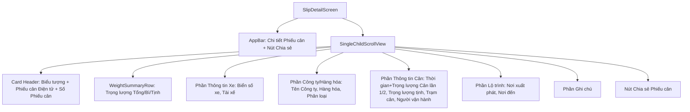

#### Tính năng Chia sẻ

Khi nhấn nút chia sẻ, `BottomSheet` được hiển thị với ba tùy chọn chia sẻ.

| Phương thức | Màu biểu tượng | Mô tả | Triển khai |
|-------------|----------------|-------|------------|
| KakaoTalk | `#FEE500` (Vàng Kakao) | Chia sẻ qua KakaoTalk | Gọi API server (`shareSlip(type: "KAKAO")`) |
| SMS | `#06B6D4` (Cyan) | Chia sẻ qua tin nhắn | Gọi API server (`shareSlip(type: "SMS")`) |
| Khác | `#334155` (Dark slate) | Chia sẻ qua ứng dụng khác | Bảng chia sẻ OS qua package `share_plus` |

#### Định dạng Văn bản Chia sẻ Hệ thống

Nếu việc chia sẻ qua API server thất bại, hệ thống sẽ chuyển sang chia sẻ qua OS. Định dạng văn bản được chia sẻ:

```text
[Hệ thống Cân thông minh Busan] Phiếu cân

Số phiếu cân: {slipNumber}
Số lệnh điều xe: {dispatchNumber}
Biển số xe: {vehicleNumber}
Tài xế: {driverName}
Công ty: {companyName}
Hàng hóa: {itemName}

Trọng lượng tổng: {firstWeight} kg
Trọng lượng bì: {secondWeight} kg
Trọng lượng tịnh: {netWeight} kg

Cân lần 1: {firstWeighingTime}
Cân lần 2: {secondWeighingTime}
```

#### Các Phần Thông tin Chi tiết

| Phần | Mục hiển thị | Hiển thị có điều kiện |
|------|-------------|----------------------|
| Card Header | Biểu tượng, Tiêu đề "Phiếu cân Điện tử", Số phiếu cân | Luôn hiển thị |
| Tóm tắt trọng lượng | Trọng lượng tổng, Trọng lượng bì, Trọng lượng tịnh (3 cột) | Luôn hiển thị |
| Thông tin xe | Biển số xe, Tài xế | Luôn hiển thị |
| Công ty/Hàng hóa | Tên công ty, Tên hàng hóa, Phân loại | Phân loại chỉ hiển thị khi `itemCategory != null` |
| Thông tin cân | Thời gian+trọng lượng cân lần 1/2, Trọng lượng tịnh (nhấn mạnh), Trạm cân, Người vận hành | Trạm cân/Người vận hành chỉ hiển thị khi không null |
| Lộ trình | Nơi xuất phát, Nơi đến | Chỉ hiển thị khi `origin` hoặc `destination` không null |
| Ghi chú | Nội dung ghi chú | Chỉ hiển thị khi `memo != null && memo.isNotEmpty` |

---

## 12. Thiết kế Cơ sở dữ liệu

### 12.1 Định nghĩa Bảng

#### tb_gate_pass (Giấy phép Ra cổng)

```sql
CREATE TABLE tb_gate_pass (
    gate_pass_id    BIGSERIAL       PRIMARY KEY,
    weighing_id     BIGINT          NOT NULL,
    dispatch_id     BIGINT          NOT NULL,
    pass_status     VARCHAR(20)     NOT NULL,
    passed_at       TIMESTAMP,
    processed_by    BIGINT,
    reject_reason   VARCHAR(255),
    created_at      TIMESTAMP       NOT NULL,
    updated_at      TIMESTAMP       NOT NULL
);

-- Index
CREATE INDEX idx_gatepass_weighing ON tb_gate_pass(weighing_id);
CREATE INDEX idx_gatepass_status   ON tb_gate_pass(pass_status);
```

#### tb_weighing_slip (Phiếu cân Điện tử)

```sql
CREATE TABLE tb_weighing_slip (
    slip_id                 BIGSERIAL       PRIMARY KEY,
    weighing_id             BIGINT          NOT NULL,
    dispatch_id             BIGINT          NOT NULL,
    slip_number             VARCHAR(30)     NOT NULL UNIQUE,
    slip_data               TEXT            NOT NULL,
    vehicle_plate_number    VARCHAR(20),
    company_name            VARCHAR(100),
    item_name               VARCHAR(100),
    gross_weight_kg         VARCHAR(20),
    tare_weight_kg          VARCHAR(20),
    net_weight_kg           VARCHAR(20),
    shared_via              VARCHAR(20),
    created_at              TIMESTAMP       NOT NULL,
    updated_at              TIMESTAMP       NOT NULL
);

-- Index
CREATE UNIQUE INDEX idx_slip_number   ON tb_weighing_slip(slip_number);
CREATE INDEX idx_slip_weighing        ON tb_weighing_slip(weighing_id);
```

### 12.2 Sơ đồ ER

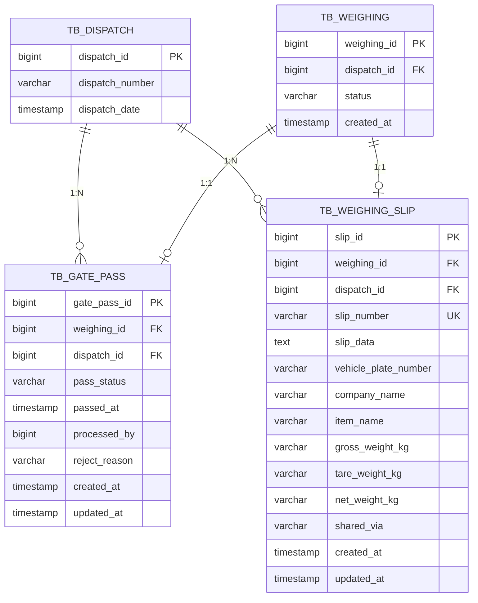

### 12.3 Chiến lược Index

| Bảng | Tên Index | Cột | Loại | Mục đích |
|------|-----------|-----|------|----------|
| `tb_gate_pass` | `idx_gatepass_weighing` | `weighing_id` | Thường | Tra cứu giấy phép ra cổng theo ID bản ghi cân |
| `tb_gate_pass` | `idx_gatepass_status` | `pass_status` | Thường | Truy vấn danh sách giấy phép ra cổng theo trạng thái |
| `tb_weighing_slip` | `idx_slip_number` | `slip_number` | Duy nhất | Tra cứu theo số phiếu cân và đảm bảo tính duy nhất |
| `tb_weighing_slip` | `idx_slip_weighing` | `weighing_id` | Thường | Tra cứu phiếu cân theo ID bản ghi cân |

---

## 13. Tích hợp Liên module

### 13.1 Vị trí trong Quy trình Nghiệp vụ Tổng thể

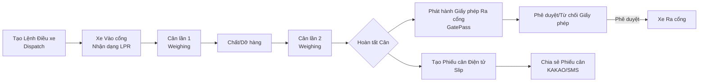

### 13.2 Phụ thuộc Module

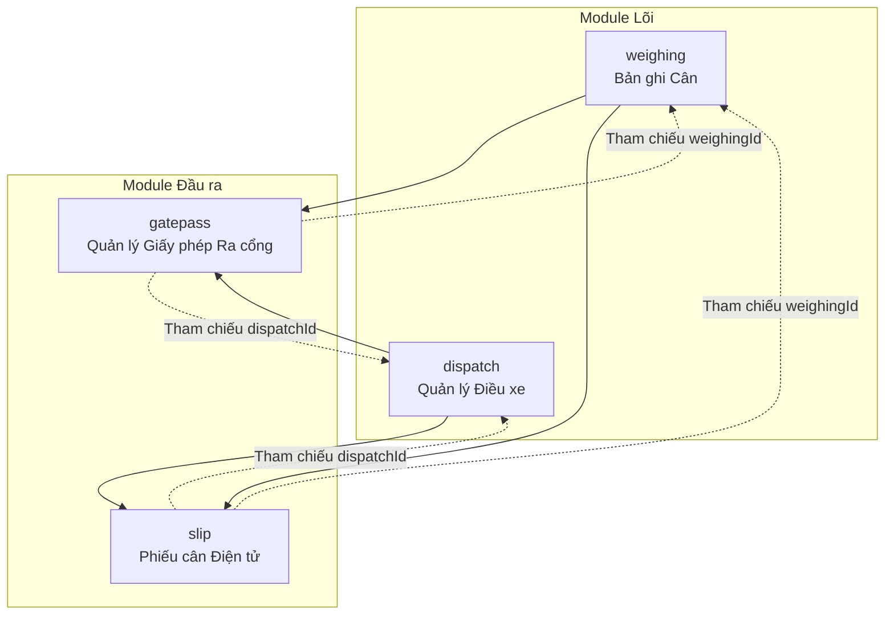

### 13.3 Chi tiết Quan hệ Tích hợp

| Module Nguồn | Module Đích | Phương thức Tích hợp | Mô tả |
|--------------|-------------|---------------------|-------|
| Weighing | GatePass | FK `weighingId` | Truyền ID bản ghi cân khi tạo giấy phép ra cổng sau khi hoàn tất cân |
| Weighing | Slip | Gọi nội bộ dịch vụ | Gọi `WeighingSlipService.createSlip()` khi hoàn tất cân |
| Dispatch | GatePass | FK `dispatchId` | Liên kết thông tin lệnh điều xe với giấy phép ra cổng |
| Dispatch | Slip | FK `dispatchId` | Liên kết thông tin lệnh điều xe với phiếu cân |
| GatePass | - | Xử lý độc lập | Phê duyệt/từ chối giấy phép ra cổng được xử lý độc lập |
| Slip | - | Xử lý độc lập | Tra cứu/chia sẻ phiếu cân được xử lý độc lập |

### 13.4 Quan hệ giữa GatePass và Slip

Giấy phép ra cổng (GatePass) và phiếu cân điện tử (Slip) đều liên kết với cùng bản ghi cân (WeighingRecord) và lệnh điều xe (Dispatch), nhưng không có quan hệ tham chiếu trực tiếp với nhau. Cả hai module đều được tạo độc lập bởi cùng một sự kiện: hoàn tất cân.

| Khía cạnh | GatePass | Slip |
|-----------|----------|------|
| Vai trò | Chứng từ kiểm soát ra vào phương tiện | Chứng từ chứng nhận kết quả cân |
| Thời điểm tạo | Sau khi hoàn tất cân | Sau khi hoàn tất cân |
| Phương thức tạo | REST API (POST) | Gọi nội bộ dịch vụ |
| Quản lý trạng thái | PENDING -> PASSED/REJECTED | Không có trạng thái (có hiệu lực ngay khi phát hành) |
| Tham chiếu chéo | Không | Không |
| Khóa chung | weighingId, dispatchId | weighingId, dispatchId |

---

## 14. Tóm tắt Quy tắc Nghiệp vụ

### 14.1 Quy tắc Quản lý Giấy phép Ra cổng (GatePass)

| STT | Quy tắc | Mô tả |
|-----|---------|-------|
| GP-01 | Giấy phép ra cổng chỉ có thể được phát hành cho lượt cân đã hoàn tất | weighingId, dispatchId bắt buộc |
| GP-02 | Trạng thái ban đầu của giấy phép ra cổng phải luôn là PENDING | Được thiết lập bắt buộc trong constructor |
| GP-03 | Phê duyệt/từ chối giấy phép chỉ dành cho ADMIN hoặc MANAGER | `@PreAuthorize("hasAnyRole('ADMIN', 'MANAGER')")` |
| GP-04 | Khi phê duyệt, thời gian ra cổng (passedAt) và người xử lý (processedBy) được ghi nhận | `LocalDateTime.now()` + ID người dùng đã xác thực |
| GP-05 | Khi từ chối, lý do từ chối (reason) là trường bắt buộc | Xác thực `@NotBlank` |
| GP-06 | Khi từ chối, người xử lý (processedBy) và lý do từ chối (rejectReason) được ghi nhận | Dùng cho kiểm toán |
| GP-07 | Bộ lọc mặc định cho truy vấn danh sách theo trạng thái là PENDING | Hiển thị các bản ghi chưa xử lý trước |
| GP-08 | Chuyển đổi trạng thái chỉ có thể từ PENDING sang PASSED hoặc REJECTED | Luồng trạng thái một chiều |

### 14.2 Quy tắc Phiếu cân Điện tử (Slip)

| STT | Quy tắc | Mô tả |
|-----|---------|-------|
| SL-01 | Số phiếu cân được cấp tuần tự theo ngày với định dạng yyyyMMdd-NNNN | Số thứ tự lớn nhất DB + 1 |
| SL-02 | Số phiếu cân phải duy nhất trong toàn hệ thống | Ràng buộc UNIQUE |
| SL-03 | Việc tạo phiếu cân không được cung cấp dưới dạng REST API; chỉ được gọi nội bộ trong dịch vụ | Tự động tạo khi hoàn tất cân |
| SL-04 | Dữ liệu phiếu cân (slipData) lưu trữ toàn bộ thông tin chứng từ cân dưới dạng JSON | Cột TEXT |
| SL-05 | Các trường phi chuẩn hóa (biển số xe, tên công ty, tên hàng hóa, trọng lượng) được duy trì để thuận tiện truy vấn | Hiển thị danh sách không cần JOIN riêng |
| SL-06 | Khi chia sẻ, phương thức chia sẻ (sharedVia) được ghi nhận bằng chữ in hoa | Áp dụng `toUpperCase()` |
| SL-07 | Khi tìm kiếm theo kỳ, dateFrom được chuyển đổi thành đầu ngày (00:00:00), dateTo được chuyển đổi thành cuối ngày (23:59:59) | `atStartOfDay()`, `atTime(LocalTime.MAX)` |
| SL-08 | Không thể tạo phiếu cân cho lượt cân chưa hoàn tất | ErrorCode.SLIP_002 |
| SL-09 | Chia sẻ phiếu cân chỉ ghi nhận phương thức chia sẻ gần nhất (ghi đè) | Giá trị trước đó bị thay thế khi gọi `markShared()` |

### 14.3 Quy tắc Chung

| STT | Quy tắc | Áp dụng cho |
|-----|---------|-------------|
| CM-01 | Tất cả entity kế thừa BaseEntity để tự động quản lý createdAt/updatedAt | GatePass, WeighingSlip |
| CM-02 | Tất cả phản hồi API sử dụng wrapper ApiResponse | Tất cả module |
| CM-03 | Tên trường JSON sử dụng snake_case (cấu hình Jackson) | Tất cả module |
| CM-04 | Giá trị ngày/giờ được tuần tự hóa theo định dạng ISO 8601 | Tất cả module |
| CM-05 | Truy cập tài nguyên không tồn tại sẽ ném BusinessException | GatePass(MASTER_001), Slip(SLIP_001) |
| CM-06 | Các lớp dịch vụ áp dụng @Transactional(readOnly=true) ở cấp lớp, chỉ các phương thức ghi mới chỉ định @Transactional riêng | GatePassService, WeighingSlipService |

---

*Het tai lieu*
