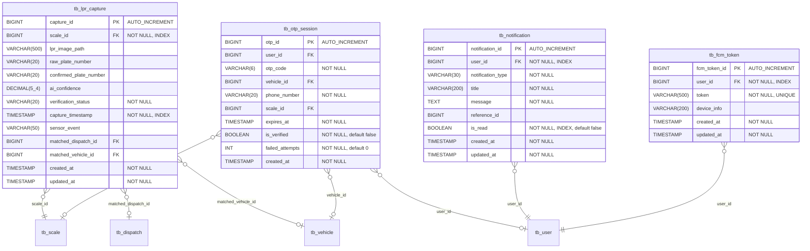

# Tài liệu Thiết kế Chi tiết Module LPR / OTP / Thông báo

| Mục | Nội dung |
|-----|----------|
| **Phiên bản tài liệu** | 1.0 |
| **Ngày tạo** | 2026-01-29 |
| **Dự án** | Hệ thống Cân thông minh Busan (Busan Smart Weighing System) |
| **Module mục tiêu** | LPR (Nhận dạng Biển số Xe), OTP (Mật khẩu Một lần), Notification (Thông báo) |
| **Đường dẫn package** | `com.dongkuk.weighing.lpr`, `com.dongkuk.weighing.otp`, `com.dongkuk.weighing.notification`, `com.dongkuk.weighing.websocket` |

---

## Mục lục

1. [Tổng quan Module LPR](#1-tổng-quan-module-lpr)
2. [Mô hình Domain LPR](#2-mô-hình-domain-lpr)
3. [Thiết kế API LPR](#3-thiết-kế-api-lpr)
4. [Logic Dịch vụ LPR](#4-logic-dịch-vụ-lpr)
5. [Tổng quan Module OTP](#5-tổng-quan-module-otp)
6. [Mô hình Domain OTP](#6-mô-hình-domain-otp)
7. [Thiết kế API OTP](#7-thiết-kế-api-otp)
8. [Logic Dịch vụ OTP](#8-logic-dịch-vụ-otp)
9. [Tổng quan Module Thông báo](#9-tổng-quan-module-thông-báo)
10. [Mô hình Domain Thông báo](#10-mô-hình-domain-thông-báo)
11. [Thiết kế API Thông báo](#11-thiết-kế-api-thông-báo)
12. [Dịch vụ Thông báo Đẩy FCM](#12-dịch-vụ-thông-báo-đẩy-fcm)
13. [Thông báo Thời gian thực qua WebSocket](#13-thông-báo-thời-gian-thực-qua-websocket)
14. [Đặc tả DTO](#14-đặc-tả-dto)
15. [Thiết kế Cơ sở dữ liệu](#15-thiết-kế-cơ-sở-dữ-liệu)
16. [Sơ đồ Tuần tự Tích hợp](#16-sơ-đồ-tuần-tự-tích-hợp)
17. [Tóm tắt Quy tắc Nghiệp vụ](#17-tóm-tắt-quy-tắc-nghiệp-vụ)

---

## 1. Tổng quan Module LPR

### 1.1 Mục đích

Module LPR (License Plate Recognition - Nhận dạng Biển số Xe) sử dụng camera để chụp biển số xe khi xe tiến vào trạm cân, và tự động trích xuất số biển số thông qua engine nhận dạng dựa trên AI. Dựa trên biển số xe được nhận dạng, hệ thống tự động đối chiếu với thông tin điều xe trong ngày, cho phép bắt đầu quy trình cân mà không cần nhập liệu thủ công từ tài xế.

### 1.2 Chức năng chính

| Chức năng | Mô tả |
|-----------|-------|
| Đăng ký Chụp LPR | Đăng ký hình ảnh chụp từ camera trạm cân và kết quả nhận dạng gốc |
| Xác minh AI | Áp dụng kết quả phân tích của mô hình AI (biển số xác nhận, độ tin cậy) vào bản ghi chụp |
| Đối chiếu Điều xe Tự động | Tra cứu dữ liệu chủ xe dựa trên biển số nhận dạng và đối chiếu với lệnh điều xe hợp lệ trong ngày |
| Ngăn chặn Chụp Trùng lặp | Chặn việc chụp trùng lặp cùng một xe tại cùng trạm cân trong vòng 10 giây |
| Tra cứu Lịch sử Chụp | Cung cấp tra cứu đơn bản ghi và tra cứu bản ghi mới nhất theo trạm cân |

### 1.3 Cấu trúc Module

```
com.dongkuk.weighing.lpr/
├── controller/
│   └── LprController.java           # Các endpoint REST API
├── service/
│   └── LprService.java              # Logic nghiệp vụ
├── domain/
│   ├── LprCapture.java              # Entity bản ghi chụp
│   ├── VerificationStatus.java      # Enum trạng thái xác minh
│   └── LprCaptureRepository.java    # Tầng truy cập dữ liệu
└── dto/
    ├── LprCaptureRequest.java        # DTO yêu cầu đăng ký chụp
    ├── LprCaptureResponse.java       # DTO phản hồi kết quả chụp
    ├── AiVerificationRequest.java    # DTO yêu cầu xác minh AI
    └── DispatchMatchResponse.java    # DTO phản hồi kết quả đối chiếu điều xe
```

### 1.4 Phụ thuộc Bên ngoài

- Module `dispatch`: Tham chiếu `DispatchRepository` và `DispatchStatus` để đối chiếu điều xe
- Module `master`: Tham chiếu `VehicleRepository` để tra cứu xe theo biển số
- Module `global`: `BaseEntity` (trường kiểm toán), `ApiResponse` (phản hồi chung), `BusinessException` (xử lý ngoại lệ)

---

## 2. Mô hình Domain LPR

### 2.1 Sơ đồ Lớp


### 2.2 Entity LprCapture

Entity domain cốt lõi quản lý kết quả nhận dạng biển số xe được chụp bởi camera LPR.

| Trường | Kiểu | Cột DB | Ràng buộc | Mô tả |
|--------|------|--------|-----------|-------|
| `captureId` | `Long` | `capture_id` | PK, AUTO_INCREMENT | ID duy nhất của bản ghi chụp |
| `scaleId` | `Long` | `scale_id` | NOT NULL, INDEX | ID trạm cân nơi thực hiện chụp |
| `lprImagePath` | `String` | `lpr_image_path` | VARCHAR(500) | Đường dẫn lưu trữ hình ảnh chụp |
| `rawPlateNumber` | `String` | `raw_plate_number` | VARCHAR(20) | Biển số xe nhận dạng gốc từ AI |
| `confirmedPlateNumber` | `String` | `confirmed_plate_number` | VARCHAR(20) | Biển số xe xác nhận sau khi AI xác minh |
| `aiConfidence` | `BigDecimal` | `ai_confidence` | DECIMAL(5,4) | Độ tin cậy nhận dạng AI (0.0000~1.0000) |
| `verificationStatus` | `VerificationStatus` | `verification_status` | NOT NULL, VARCHAR(20) | Trạng thái xác minh |
| `captureTimestamp` | `LocalDateTime` | `capture_timestamp` | NOT NULL, INDEX | Thời điểm chụp |
| `sensorEvent` | `String` | `sensor_event` | VARCHAR(50) | Loại sự kiện cảm biến |
| `matchedDispatchId` | `Long` | `matched_dispatch_id` | NULLABLE | ID điều xe đã đối chiếu |
| `matchedVehicleId` | `Long` | `matched_vehicle_id` | NULLABLE | ID xe đã đối chiếu |
| `createdAt` | `LocalDateTime` | `created_at` | NOT NULL | Thời điểm tạo (BaseEntity) |
| `updatedAt` | `LocalDateTime` | `updated_at` | NOT NULL | Thời điểm cập nhật (BaseEntity) |

### 2.3 Enum VerificationStatus

Định nghĩa trạng thái xác minh cho kết quả nhận dạng biển số AI. Được xác định tự động dựa trên ngưỡng độ tin cậy.

| Giá trị | Tên | Phạm vi Độ tin cậy | Xử lý Tiếp theo |
|---------|-----|---------------------|------------------|
| `PENDING` | Chờ xử lý | - | Trạng thái khởi tạo trước khi xác minh AI |
| `CONFIRMED` | Đã xác nhận | Từ 90% trở lên | Có thể tiến hành cân tự động (chế độ LPR_AUTO) |
| `LOW_CONFIDENCE` | Độ tin cậy Thấp | Từ 70% đến dưới 90% | Cần xác thực OTP để xác minh danh tính |
| `FAILED` | Thất bại | Dưới 70% | Cần xác minh thủ công hoặc chụp lại |

### 2.4 Phương thức Domain

#### `applyAiVerification(String confirmedPlateNumber, BigDecimal aiConfidence)`

Áp dụng kết quả xác minh AI vào bản ghi chụp. Trạng thái xác minh được xác định tự động dựa trên điểm độ tin cậy.

```
Độ tin cậy >= 0.90  -->  CONFIRMED      (Tự động xác nhận)
Độ tin cậy >= 0.70  -->  LOW_CONFIDENCE  (Cần xác thực OTP)
Độ tin cậy <  0.70  -->  FAILED          (Cần xác minh thủ công)
```

#### `applyDispatchMatch(Long dispatchId, Long vehicleId)`

Áp dụng kết quả đối chiếu điều xe vào bản ghi chụp. Đối với đối chiếu đơn, cả ID điều xe và ID xe đều được ghi nhận; đối với đối chiếu nhiều, chỉ ID xe được ghi nhận.

#### `requiresOtp() : boolean`

Xác định xem có cần xác thực OTP hay không. Trả về `true` khi trạng thái là `LOW_CONFIDENCE` hoặc `FAILED`.

---

## 3. Thiết kế API LPR

**Base URL**: `/api/v1/lpr`

### 3.1 Danh sách Endpoint

| HTTP | Đường dẫn | Mô tả | Yêu cầu | Phản hồi |
|------|-----------|-------|----------|----------|
| POST | `/capture` | Đăng ký chụp LPR | `LprCaptureRequest` | `LprCaptureResponse` (201) |
| POST | `/verify` | Áp dụng kết quả xác minh AI | `AiVerificationRequest` | `LprCaptureResponse` (200) |
| POST | `/{captureId}/match` | Đối chiếu điều xe tự động | Path: `captureId` | `DispatchMatchResponse` (200) |
| GET | `/{captureId}` | Tra cứu đơn bản ghi chụp | Path: `captureId` | `LprCaptureResponse` (200) |
| GET | `/scale/{scaleId}/latest` | Bản ghi chụp mới nhất theo trạm cân | Path: `scaleId` | `LprCaptureResponse` (200) |

### 3.2 POST /capture - Đăng ký Chụp LPR

Đăng ký hình ảnh biển số xe và kết quả nhận dạng được chụp bởi camera trạm cân.

**Nội dung Yêu cầu** (`LprCaptureRequest`):

```json
{
  "scale_id": 1,
  "sensor_event": "ENTRY",
  "lpr_image_path": "/images/lpr/2026/01/29/capture_001.jpg",
  "raw_plate_number": "12가3456",
  "capture_timestamp": "2026-01-29T10:30:00"
}
```

**Phản hồi Thành công** (HTTP 201):

```json
{
  "success": true,
  "data": {
    "capture_id": 101,
    "scale_id": 1,
    "lpr_image_path": "/images/lpr/2026/01/29/capture_001.jpg",
    "raw_plate_number": "12가3456",
    "confirmed_plate_number": null,
    "ai_confidence": null,
    "verification_status": "PENDING",
    "capture_timestamp": "2026-01-29T10:30:00",
    "matched_dispatch_id": null,
    "matched_vehicle_id": null,
    "created_at": "2026-01-29T10:30:01"
  },
  "error": null
}
```

### 3.3 POST /verify - Áp dụng Kết quả Xác minh AI

Áp dụng kết quả phân tích của mô hình AI vào bản ghi chụp.

**Nội dung Yêu cầu** (`AiVerificationRequest`):

```json
{
  "capture_id": 101,
  "confirmed_plate_number": "12가3456",
  "ai_confidence": 0.9520
}
```

**Phản hồi Thành công** (HTTP 200):

```json
{
  "success": true,
  "data": {
    "capture_id": 101,
    "scale_id": 1,
    "lpr_image_path": "/images/lpr/2026/01/29/capture_001.jpg",
    "raw_plate_number": "12가3456",
    "confirmed_plate_number": "12가3456",
    "ai_confidence": 0.9520,
    "verification_status": "CONFIRMED",
    "capture_timestamp": "2026-01-29T10:30:00",
    "matched_dispatch_id": null,
    "matched_vehicle_id": null,
    "created_at": "2026-01-29T10:30:01"
  },
  "error": null
}
```

### 3.4 POST /{captureId}/match - Đối chiếu Điều xe Tự động

Tự động đối chiếu biển số xe nhận dạng được với dữ liệu chủ xe và lệnh điều xe trong ngày.

**Phản hồi Thành công** (HTTP 200) - Khi đối chiếu đơn:

```json
{
  "success": true,
  "data": {
    "match_result": "SINGLE_MATCH",
    "vehicle_id": 5,
    "plate_number": "12가3456",
    "dispatches": [
      {
        "dispatch_id": 42,
        "item_type": "STEEL",
        "item_name": "열연코일",
        "dispatch_date": "2026-01-29",
        "status": "REGISTERED"
      }
    ]
  },
  "error": null
}
```

**Các loại Kết quả Đối chiếu**:

| match_result | Mô tả | Xử lý Tiếp theo |
|--------------|-------|------------------|
| `SINGLE_MATCH` | Đối chiếu đơn điều xe thành công | Tự động liên kết ID điều xe + ID xe, tiến hành cân |
| `MULTIPLE_MATCH` | Đối chiếu nhiều điều xe | Chỉ liên kết ID xe, vận hành viên chọn thủ công điều xe |
| `NO_DISPATCH` | Xe tồn tại nhưng không có điều xe trong ngày | Cần xác minh từ vận hành viên |
| `NO_VEHICLE` | Xe chưa đăng ký | Cần đăng ký xe hoặc nhập thủ công |

---

## 4. Logic Dịch vụ LPR

### 4.1 Luồng Xác minh AI


### 4.2 Sơ đồ Tuần tự Đối chiếu Điều xe


### 4.3 Logic Ngăn chặn Chụp Trùng lặp

Phương thức `LprService.registerCapture` ngăn chặn chụp trùng lặp bằng các điều kiện sau:

- **Điều kiện thời gian**: Trong vòng 10 giây kể từ thời điểm chụp yêu cầu
- **Điều kiện vị trí**: Cùng trạm cân (scaleId)
- **Điều kiện xe**: Cùng biển số xe gốc (rawPlateNumber)
- **Cách xử lý**: Khi phát hiện trùng lặp, không tạo bản ghi mới mà trả về kết quả chụp hiện có

```
DUPLICATE_CAPTURE_SECONDS = 10
Truy vấn: captureRepository.findRecentByScaleId(scaleId, timestamp - 10 giây)
Kiểm tra: recent.stream().anyMatch(rawPlateNumber khớp)
```

---

## 5. Tổng quan Module OTP

### 5.1 Mục đích

Module OTP (One-Time Password - Mật khẩu Một lần) tạo và xác minh mật khẩu một lần gồm 6 chữ số để xác minh danh tính tài xế khi độ tin cậy nhận dạng AI của LPR thấp (LOW_CONFIDENCE hoặc FAILED). Khi chương trình cân hiện trường (CS) tạo OTP, mã sẽ được hiển thị trên bảng thông tin, và tài xế nhập mã trên ứng dụng di động để xác thực.

### 5.2 Chức năng chính

| Chức năng | Mô tả |
|-----------|-------|
| Tạo Mã OTP | Tạo mã số 6 chữ số bằng SecureRandom, lưu trữ trong Redis với TTL |
| Tích hợp Hiển thị Bảng Thông tin | Lưu mã OTP hiện tại theo trạm cân trong Redis để hiển thị trên bảng thông tin |
| Xác minh OTP | Xác minh danh tính tài xế bằng mã và số điện thoại nhập từ ứng dụng di động |
| Theo dõi Số lần Thất bại | Tự động vô hiệu hóa OTP khi vượt quá số lần thất bại tối đa |
| Nhật ký Kiểm toán | Lưu giữ lịch sử phát hành OTP trong cơ sở dữ liệu để đảm bảo khả năng truy vết |

### 5.3 Cấu trúc Module

```
com.dongkuk.weighing.otp/
├── controller/
│   └── OtpController.java           # Các endpoint REST API
├── service/
│   └── OtpService.java              # Logic nghiệp vụ
├── config/
│   └── OtpProperties.java           # Liên kết thuộc tính cấu hình
├── domain/
│   ├── OtpSession.java              # Entity kiểm toán phiên OTP
│   └── OtpSessionRepository.java    # Tầng truy cập dữ liệu
└── dto/
    ├── OtpGenerateRequest.java       # DTO yêu cầu tạo OTP
    ├── OtpGenerateResponse.java      # DTO phản hồi tạo OTP
    ├── OtpVerifyRequest.java         # DTO yêu cầu xác minh OTP
    └── OtpVerifyResponse.java        # DTO phản hồi xác minh OTP
```

### 5.4 Kiến trúc Lưu trữ Kép

Module OTP sử dụng kiến trúc lưu trữ kép với **Redis** (quản lý phiên thời gian thực) và **RDB** (nhật ký kiểm toán).

| Kho lưu trữ | Vai trò | Dữ liệu | TTL |
|--------------|---------|----------|-----|
| **Redis** | Quản lý phiên OTP thời gian thực | Mã OTP, ánh xạ xe/trạm cân, số lần thất bại | Có thể cấu hình (mặc định 300 giây) |
| **PostgreSQL** | Lưu giữ nhật ký kiểm toán | Lịch sử phát hành OTP, trạng thái xác minh, số lần thất bại | Vĩnh viễn |

---

## 6. Mô hình Domain OTP

### 6.1 Sơ đồ Lớp


### 6.2 Entity OtpSession (Nhật ký Kiểm toán DB)

| Trường | Kiểu | Cột DB | Ràng buộc | Mô tả |
|--------|------|--------|-----------|-------|
| `otpId` | `Long` | `otp_id` | PK, AUTO_INCREMENT | ID duy nhất phiên OTP |
| `userId` | `Long` | `user_id` | NULLABLE | ID người dùng liên kết (được đặt sau xác minh) |
| `otpCode` | `String` | `otp_code` | NOT NULL, VARCHAR(6) | Mã OTP (số 6 chữ số) |
| `vehicleId` | `Long` | `vehicle_id` | NULLABLE | ID xe liên kết |
| `phoneNumber` | `String` | `phone_number` | NOT NULL, VARCHAR(20) | Số điện thoại dùng để xác minh |
| `scaleId` | `Long` | `scale_id` | NULLABLE | ID trạm cân liên kết |
| `expiresAt` | `LocalDateTime` | `expires_at` | NOT NULL | Thời điểm hết hạn OTP |
| `isVerified` | `boolean` | `is_verified` | NOT NULL, mặc định false | Trạng thái hoàn thành xác minh |
| `failedAttempts` | `int` | `failed_attempts` | NOT NULL, mặc định 0 | Số lần xác minh thất bại |
| `createdAt` | `LocalDateTime` | `created_at` | NOT NULL | Thời điểm tạo (JPA Auditing) |

**Chỉ mục**:
- `idx_otp_code_expires`: (`otp_code`, `expires_at`) - Tra cứu nhanh tính hợp lệ mã OTP
- `idx_otp_phone`: (`phone_number`) - Tra cứu theo số điện thoại

### 6.3 Cấu trúc Khóa Redis

| Mẫu Khóa Redis | Mục đích | Định dạng Giá trị | TTL |
|-----------------|----------|-------------------|-----|
| `otp:code:{otpCode}` | Dữ liệu phiên OTP | JSON: `{"vehicle_id", "plate_number", "scale_id"}` | `ttlSeconds` |
| `otp:scale:{scaleId}` | Mã OTP hiện tại theo trạm cân | Chuỗi: Mã OTP | `ttlSeconds` |
| `otp:fail:{otpCode}` | Số lần xác minh OTP thất bại | Chuỗi số nguyên | Tự động hết hạn |
| `otp:verified:{phoneNumber}` | Đánh dấu hoàn thành xác minh OTP | Mã OTP | 5 phút |

### 6.4 Cấu hình OtpProperties

Các giá trị cấu hình được liên kết từ tiền tố `otp` trong `application.yml`.

| Thuộc tính | Mô tả | Mặc định (Khuyến nghị) |
|------------|-------|----------------------|
| `codeLength` | Số chữ số mã OTP | 6 |
| `ttlSeconds` | Thời gian hiệu lực OTP (giây) | 300 (5 phút) |
| `maxFailedAttempts` | Số lần thất bại tối đa cho phép | 5 |

---

## 7. Thiết kế API OTP

**Base URL**: `/api/v1/otp`

### 7.1 Danh sách Endpoint

| HTTP | Đường dẫn | Mô tả | Chủ thể Gọi | Yêu cầu | Phản hồi |
|------|-----------|-------|-------------|----------|----------|
| POST | `/generate` | Tạo mã OTP | Chương trình CS | `OtpGenerateRequest` | `OtpGenerateResponse` (200) |
| POST | `/verify` | Xác minh mã OTP | Ứng dụng di động | `OtpVerifyRequest` | `OtpVerifyResponse` (200) |

### 7.2 POST /generate - Tạo Mã OTP

Được gọi bởi chương trình CS hiện trường khi xe tiến vào trạm cân.

**Nội dung Yêu cầu** (`OtpGenerateRequest`):

```json
{
  "scale_id": 1,
  "vehicle_id": 5,
  "plate_number": "12가3456"
}
```

**Phản hồi Thành công** (HTTP 200):

```json
{
  "success": true,
  "data": {
    "otp_code": "482917",
    "expires_at": "2026-01-29T10:35:00",
    "ttl_seconds": 300
  },
  "error": null
}
```

### 7.3 POST /verify - Xác minh Mã OTP

Tài xế nhập mã OTP và số điện thoại trên ứng dụng di động để xác thực.

**Nội dung Yêu cầu** (`OtpVerifyRequest`):

```json
{
  "otp_code": "482917",
  "phone_number": "010-1234-5678"
}
```

**Quy tắc Kiểm tra Tính hợp lệ**:
- `otpCode`: Chỉ cho phép số 6 chữ số (`^\d{6}$`)
- `phoneNumber`: Định dạng số điện thoại di động Hàn Quốc (`^01[016789]-\d{3,4}-\d{4}$`)

**Phản hồi Thành công** (HTTP 200):

```json
{
  "success": true,
  "data": {
    "verified": true,
    "vehicle_id": 5,
    "plate_number": "12가3456",
    "dispatch_id": null
  },
  "error": null
}
```

**Phản hồi Lỗi**:

| Mã Lỗi | Tình huống | Mã HTTP |
|---------|-----------|---------|
| `OTP_001` | OTP hết hạn hoặc không tồn tại | 400 |
| `OTP_002` | Số điện thoại chưa đăng ký | 400 |
| `OTP_003` | Vượt quá số lần thất bại tối đa (OTP bị vô hiệu hóa) | 400 |

---

## 8. Logic Dịch vụ OTP

### 8.1 Quy trình Tạo OTP

1. Tạo mã OTP với số chữ số được cấu hình (mặc định 6 chữ số) sử dụng `SecureRandom`
2. Lưu JSON phiên (`vehicleId`, `plateNumber`, `scaleId`) vào khóa Redis `otp:code:{otpCode}` với TTL
3. Lưu mã OTP vào khóa Redis `otp:scale:{scaleId}` (để hiển thị trên bảng thông tin)
4. Lưu nhật ký kiểm toán vào bảng `tb_otp_session` trong cơ sở dữ liệu
5. Trả về mã OTP đã tạo, thời điểm hết hạn và TTL trong phản hồi

### 8.2 Quy trình Xác minh OTP

1. Truy vấn dữ liệu phiên từ khóa Redis `otp:code:{otpCode}` (ném ngoại lệ OTP_001 nếu không tìm thấy)
2. Kiểm tra số lần thất bại từ khóa Redis `otp:fail:{otpCode}` (ném ngoại lệ OTP_003 và xóa khóa Redis nếu vượt quá)
3. Tra cứu người dùng theo số điện thoại yêu cầu (ném ngoại lệ OTP_002 nếu chưa đăng ký)
4. Trích xuất thông tin xe (vehicleId, plateNumber) từ dữ liệu phiên
5. Khi xác minh thành công, xóa khóa Redis `otp:code:{otpCode}` và `otp:fail:{otpCode}` (sử dụng một lần)
6. Lưu khóa `otp:verified:{phoneNumber}` với TTL 5 phút để liên kết với đăng nhập qua OTP
7. Trả về kết quả xác minh trong phản hồi

### 8.3 Sơ đồ Tuần tự Toàn bộ Luồng


### 8.4 Màn hình Nhập OTP trên Ứng dụng Di động

`OtpInputScreen` (Flutter) cung cấp các chức năng sau:

| Chức năng | Mô tả |
|-----------|-------|
| Vùng hiển thị OTP 6 chữ số | Hiển thị từng chữ số trong ô riêng biệt, thay đổi màu sắc theo trạng thái nhập liệu |
| Bàn phím số tùy chỉnh | Bàn phím chuyên dụng dạng lưới 4x3 (1-9, C, 0, Xóa lùi) |
| Bộ đếm ngược 5 phút | Hiển thị thời gian còn lại ở định dạng MM:SS; chuyển sang trạng thái lỗi khi hết hạn |
| Yêu cầu lại khi hết hạn | Hiển thị nút "Yêu cầu lại OTP" sau khi bộ đếm thời gian hết hạn |
| Xử lý xác thực | Gọi `DispatchProvider.verifyOtp()` khi hoàn thành nhập 6 chữ số; trả kết quả qua `Navigator.pop(context, true)` khi thành công |
| Xử lý thất bại | Hiển thị thông báo lỗi khi xác thực thất bại và đặt lại mã nhập |

---

## 9. Tổng quan Module Thông báo

### 9.1 Mục đích

Module thông báo truyền tải các sự kiện nghiệp vụ phát sinh trong hệ thống cân (hoàn thành cân, phân công điều xe, phát hành giấy phép ra cổng, v.v.) đến người dùng thông qua thông báo trong ứng dụng và thông báo đẩy FCM. Bao gồm quản lý danh sách thông báo, theo dõi trạng thái đã đọc và quản lý vòng đời token FCM.

### 9.2 Chức năng chính

| Chức năng | Mô tả |
|-----------|-------|
| Tạo Thông báo Trong Ứng dụng | Tạo bản ghi thông báo trong cơ sở dữ liệu khi sự kiện nghiệp vụ xảy ra |
| Gửi Đẩy FCM | Gửi thông báo đẩy đến thiết bị di động qua Firebase Cloud Messaging |
| Tra cứu Danh sách Thông báo | Tra cứu danh sách thông báo phân trang theo người dùng, sắp xếp mới nhất |
| Xử lý Đánh dấu Đã đọc | Cập nhật trạng thái đã đọc của từng thông báo (có xác minh chủ sở hữu) |
| Tra cứu Số lượng Chưa đọc | Tra cứu số lượng thông báo chưa đọc để hiển thị huy hiệu |
| Quản lý Token FCM | Quản lý đăng ký/hủy đăng ký token thiết bị (có ngăn chặn trùng lặp) |

### 9.3 Cấu trúc Module

```
com.dongkuk.weighing.notification/
├── controller/
│   └── NotificationController.java   # Các endpoint REST API
├── service/
│   ├── NotificationService.java       # Logic nghiệp vụ thông báo
│   └── FcmPushService.java           # Dịch vụ gửi đẩy FCM
├── config/
│   └── FcmConfig.java                # Khởi tạo Firebase Admin SDK
├── domain/
│   ├── Notification.java             # Entity thông báo
│   ├── NotificationType.java         # Enum loại thông báo
│   ├── NotificationRepository.java    # Tầng truy cập dữ liệu thông báo
│   ├── FcmToken.java                 # Entity token FCM
│   └── FcmTokenRepository.java       # Tầng truy cập dữ liệu token FCM
└── dto/
    ├── FcmTokenRegisterRequest.java   # DTO yêu cầu đăng ký token FCM
    ├── NotificationResponse.java      # DTO phản hồi thông báo
    └── UnreadCountResponse.java       # DTO phản hồi số lượng chưa đọc
```

### 9.4 Kênh Truyền tải Thông báo

| Kênh | Đối tượng | Công nghệ | Mục đích |
|------|-----------|-----------|----------|
| **Thông báo Trong Ứng dụng** | Web/Di động | Lưu DB + REST API | Tra cứu danh sách thông báo, quản lý đã đọc |
| **Đẩy FCM** | Di động | Firebase Cloud Messaging | Thông báo thiết bị khi ứng dụng không hoạt động |
| **WebSocket** | Giao diện Web | STOMP over SockJS | Phát sóng trạng thái cân/thiết bị thời gian thực |

---

## 10. Mô hình Domain Thông báo

### 10.1 Sơ đồ Lớp


### 10.2 Entity Notification

| Trường | Kiểu | Cột DB | Ràng buộc | Mô tả |
|--------|------|--------|-----------|-------|
| `notificationId` | `Long` | `notification_id` | PK, AUTO_INCREMENT | ID duy nhất thông báo |
| `userId` | `Long` | `user_id` | NOT NULL, INDEX | ID người dùng nhận |
| `notificationType` | `NotificationType` | `notification_type` | NOT NULL, VARCHAR(30) | Loại thông báo |
| `title` | `String` | `title` | NOT NULL, VARCHAR(200) | Tiêu đề thông báo |
| `message` | `String` | `message` | NOT NULL, TEXT | Nội dung thông báo |
| `referenceId` | `Long` | `reference_id` | NULLABLE | ID entity tham chiếu |
| `isRead` | `boolean` | `is_read` | NOT NULL, INDEX, mặc định false | Trạng thái đã đọc |
| `createdAt` | `LocalDateTime` | `created_at` | NOT NULL | Thời điểm tạo (BaseEntity) |
| `updatedAt` | `LocalDateTime` | `updated_at` | NOT NULL | Thời điểm cập nhật (BaseEntity) |

### 10.3 Enum NotificationType

| Giá trị | Tên | Mô tả | Đối tượng Nhận |
|---------|-----|-------|----------------|
| `WEIGHING_COMPLETED` | Hoàn thành Cân | Khi việc cân xe hoàn thành | Tài xế (DRIVER), Quản lý (MANAGER) |
| `DISPATCH_ASSIGNED` | Phân công Điều xe | Khi lệnh điều xe mới được phân công cho tài xế | Tài xế (DRIVER) |
| `GATE_PASS_ISSUED` | Phát hành Giấy phép Ra cổng | Khi giấy phép ra cổng được phát hành | Tài xế (DRIVER) |
| `SYSTEM_NOTICE` | Thông báo Hệ thống | Thông báo toàn hệ thống | Tất cả người dùng |

### 10.4 Entity FcmToken

| Trường | Kiểu | Cột DB | Ràng buộc | Mô tả |
|--------|------|--------|-----------|-------|
| `fcmTokenId` | `Long` | `fcm_token_id` | PK, AUTO_INCREMENT | ID duy nhất token FCM |
| `userId` | `Long` | `user_id` | NOT NULL, INDEX | ID người dùng sở hữu token |
| `token` | `String` | `token` | NOT NULL, UNIQUE, VARCHAR(500) | Token thiết bị FCM |
| `deviceInfo` | `String` | `device_info` | VARCHAR(200) | Thông tin thiết bị (tên thiết bị, HĐH, v.v.) |
| `createdAt` | `LocalDateTime` | `created_at` | NOT NULL | Thời điểm tạo (BaseEntity) |
| `updatedAt` | `LocalDateTime` | `updated_at` | NOT NULL | Thời điểm cập nhật (BaseEntity) |

**Quan hệ Người dùng:Token**: 1:N (một người dùng có thể đăng ký nhiều thiết bị)

---

## 11. Thiết kế API Thông báo

**Base URL**: `/api/v1/notifications`

### 11.1 Danh sách Endpoint

| HTTP | Đường dẫn | Mô tả | Xác thực | Yêu cầu | Phản hồi |
|------|-----------|-------|----------|----------|----------|
| GET | `/` | Tra cứu danh sách thông báo phân trang | JWT | Query: `page`, `size` | `Page<NotificationResponse>` |
| PUT | `/{notificationId}/read` | Đánh dấu thông báo đã đọc | JWT | Path: `notificationId` | `NotificationResponse` |
| GET | `/unread-count` | Tra cứu số lượng thông báo chưa đọc | JWT | - | `UnreadCountResponse` |
| POST | `/push/register` | Đăng ký token FCM | JWT | `FcmTokenRegisterRequest` | `Void` |
| DELETE | `/push/unregister` | Hủy đăng ký token FCM | - | Query: `token` | `Void` |

### 11.2 GET / - Tra cứu Danh sách Thông báo

Tra cứu danh sách thông báo của người dùng đã đăng nhập theo thứ tự mới nhất với phân trang.

**Yêu cầu**: `GET /api/v1/notifications?page=0&size=20`

**Phản hồi Thành công** (HTTP 200):

```json
{
  "success": true,
  "data": {
    "content": [
      {
        "notification_id": 1,
        "notification_type": "WEIGHING_COMPLETED",
        "title": "계량 완료",
        "message": "12가3456 차량의 계량이 완료되었습니다. 순중량: 25,000kg",
        "reference_id": 42,
        "is_read": false,
        "created_at": "2026-01-29T10:45:00"
      }
    ],
    "total_elements": 15,
    "total_pages": 1,
    "number": 0,
    "size": 20
  },
  "error": null
}
```

### 11.3 PUT /{notificationId}/read - Đánh dấu Thông báo Đã đọc

Chỉ chủ sở hữu thông báo mới có thể đánh dấu đã đọc. Khi truy cập thông báo của người dùng khác sẽ trả về lỗi `AUTH_007`.

**Phản hồi Thành công** (HTTP 200):

```json
{
  "success": true,
  "data": {
    "notification_id": 1,
    "notification_type": "WEIGHING_COMPLETED",
    "title": "계량 완료",
    "message": "12가3456 차량의 계량이 완료되었습니다.",
    "reference_id": 42,
    "is_read": true,
    "created_at": "2026-01-29T10:45:00"
  },
  "error": null
}
```

### 11.4 GET /unread-count - Tra cứu Số lượng Chưa đọc

```json
{
  "success": true,
  "data": {
    "unread_count": 3
  },
  "error": null
}
```

### 11.5 POST /push/register - Đăng ký Token FCM

**Nội dung Yêu cầu** (`FcmTokenRegisterRequest`):

```json
{
  "token": "fMI3Y5K8R6u...(Token thiết bị FCM)...",
  "device_info": "Samsung Galaxy S24 / Android 15"
}
```

**Phản hồi Thành công** (HTTP 200):

```json
{
  "success": true,
  "data": null,
  "message": "Token FCM đã được đăng ký",
  "error": null
}
```

### 11.6 DELETE /push/unregister - Hủy đăng ký Token FCM

**Yêu cầu**: `DELETE /api/v1/notifications/push/unregister?token=fMI3Y5K8R6u...`

```json
{
  "success": true,
  "data": null,
  "message": "Token FCM đã được hủy đăng ký",
  "error": null
}
```

---

## 12. Dịch vụ Thông báo Đẩy FCM

### 12.1 Kiến trúc


### 12.2 FcmConfig - Khởi tạo Firebase

`FcmConfig` được kích hoạt với điều kiện `@ConditionalOnProperty(name = "fcm.enabled", havingValue = "true")`.

| Cài đặt | Biến Môi trường | Mô tả |
|---------|----------------|-------|
| `fcm.enabled` | `FCM_ENABLED` | Có kích hoạt chức năng FCM hay không (true/false) |
| `fcm.service-account-file` | `FCM_SERVICE_ACCOUNT_FILE` | Đường dẫn file JSON tài khoản dịch vụ Google |

`@PostConstruct` ngăn chặn khởi tạo trùng lặp bằng cách kiểm tra `FirebaseApp.getApps().isEmpty()`, và thực hiện xác thực tài khoản dịch vụ bằng `GoogleCredentials.fromStream()`.

### 12.3 FcmPushService - Logic Gửi Đẩy

Luồng xử lý của phương thức `sendPush(Long userId, String title, String body)`:

1. Truy vấn tất cả token FCM của người dùng qua `FcmTokenRepository.findByUserId(userId)`
2. Nếu không có token, chỉ ghi nhật ký và bỏ qua
3. Gọi `sendToDevice()` tuần tự cho mỗi token thiết bị

**Logic Phân nhánh sendToDevice**:

| Điều kiện | Hành động |
|-----------|----------|
| `fcmEnabled == false` | Ghi nhật ký stub (`[FCM STUB]`) |
| `FirebaseApp.getApps().isEmpty()` | Ghi nhật ký stub |
| Trạng thái bình thường | Gửi thực tế qua `FirebaseMessaging.getInstance().send(message)` |
| Phát sinh `FirebaseMessagingException` | Ghi nhật ký lỗi, không lan truyền ngoại lệ |

**Cấu trúc Thông điệp FCM**:

```java
Message.builder()
    .setToken(token)
    .setNotification(Notification.builder()
        .setTitle(title)
        .setBody(body)
        .build())
    .build()
```

### 12.4 Dịch vụ FCM trên Ứng dụng Di động (Flutter)

`NotificationService` (Dart) thực hiện quy trình khởi tạo sau:

| Bước | Phương thức | Mô tả |
|------|------------|-------|
| 1 | `_requestPermission()` | Yêu cầu quyền thông báo cho iOS và Android 13+ |
| 2 | `onBackgroundMessage()` | Đăng ký trình xử lý thông điệp nền |
| 3 | `_initializeLocalNotifications()` | Khởi tạo plugin thông báo cục bộ + tạo kênh Android |
| 4 | `onMessage.listen()` | Đăng ký trình lắng nghe thông điệp foreground |
| 5 | `onMessageOpenedApp.listen()` | Đăng ký trình lắng nghe khi nhấn vào thông báo |
| 6 | `getToken()` | Lấy token FCM và đăng ký với server |
| 7 | `onTokenRefresh.listen()` | Tự động đăng ký lại khi token được làm mới |

**Kênh Thông báo Android**:

| Thuộc tính | Giá trị |
|------------|---------|
| ID Kênh | `busan_weighing_channel` |
| Tên Kênh | `Thông báo Hệ thống Cân thông minh Busan` |
| Mô tả | `Thông báo thay đổi trạng thái cân và thông báo hệ thống` |
| Mức độ Quan trọng | `Importance.high` |

---

## 13. Thông báo Thời gian thực qua WebSocket

### 13.1 Tổng quan WebSocketNotificationService

Dịch vụ phát sóng thông điệp thời gian thực dựa trên giao thức STOMP. Sử dụng `SimpMessagingTemplate` để gửi sự kiện đến tất cả client đang đăng ký.

**Thông tin Kết nối**:
- Endpoint WebSocket: `/ws` (hỗ trợ dự phòng SockJS)
- Tiền tố đăng ký: `/topic/*` (server -> client)
- Tiền tố gửi: `/app/*` (client -> server)
- Xác thực: Yêu cầu token JWT

### 13.2 Chủ đề và Loại Thông điệp

| Chủ đề | Loại Thông điệp | Mô tả | Thời điểm Phát hành |
|--------|-----------------|-------|---------------------|
| `/topic/weighing-updates` | `WeighingUpdateMessage` | Thông báo thay đổi bản ghi cân | Khi trạng thái/trọng lượng cân thay đổi |
| `/topic/scale-status` | `ScaleStatusMessage` | Thông báo thay đổi trạng thái trạm cân | Khi trạm cân chuyển đổi hoạt động/bảo trì/không hoạt động |
| `/topic/device-status` | `DeviceStatusResponse` | Thông báo thay đổi trạng thái thiết bị | Khi thiết bị kết nối/ngắt kết nối/lỗi |

### 13.3 WeighingUpdateMessage

Thông điệp được gửi khi bản ghi cân thay đổi.

| Trường | Kiểu | Mô tả |
|--------|------|-------|
| `weighingId` | `Long` | ID bản ghi cân |
| `dispatchId` | `Long` | ID điều xe liên kết |
| `weighingStatus` | `String` | Trạng thái cân: `IN_PROGRESS`, `COMPLETED`, `RE_WEIGHING`, `CANCELLED` |
| `weighingMode` | `String` | Chế độ cân: `LPR_AUTO`, `MOBILE_OTP`, `MANUAL`, `RE_WEIGH` |
| `grossWeight` | `BigDecimal` | Tổng trọng lượng (kg) |
| `tareWeight` | `BigDecimal` | Trọng lượng bì (kg) |
| `netWeight` | `BigDecimal` | Trọng lượng tịnh (kg) |
| `lprPlateNumber` | `String` | Biển số xe nhận dạng LPR |
| `timestamp` | `LocalDateTime` | Thời điểm thông điệp |

### 13.4 ScaleStatusMessage

Thông điệp được gửi khi trạng thái trạm cân thay đổi.

| Trường | Kiểu | Mô tả |
|--------|------|-------|
| `scaleId` | `Long` | ID trạm cân |
| `scaleName` | `String` | Tên trạm cân |
| `status` | `String` | Trạng thái: `ACTIVE`, `MAINTENANCE`, `INACTIVE` |
| `timestamp` | `LocalDateTime` | Thời điểm thay đổi trạng thái |

### 13.5 DeviceStatusResponse

Thông điệp được gửi khi trạng thái kết nối thiết bị thay đổi.

| Trường | Kiểu | Mô tả |
|--------|------|-------|
| `deviceId` | `Long` | ID thiết bị |
| `deviceCode` | `String` | Mã thiết bị |
| `deviceName` | `String` | Tên thiết bị |
| `deviceType` | `DeviceType` | Loại thiết bị |
| `deviceTypeDesc` | `String` | Mô tả loại thiết bị |
| `location` | `String` | Vị trí lắp đặt |
| `connectionStatus` | `ConnectionStatus` | Trạng thái kết nối |
| `connectionStatusDesc` | `String` | Mô tả trạng thái kết nối |
| `lastConnectedAt` | `LocalDateTime` | Thời điểm kết nối cuối cùng |
| `ipAddress` | `String` | Địa chỉ IP |
| `errorMessage` | `String` | Thông báo lỗi |
| `isActive` | `boolean` | Trạng thái hoạt động |

---

## 14. Đặc tả DTO

### 14.1 DTO Module LPR

#### LprCaptureRequest (Yêu cầu Đăng ký Chụp)

```java
public record LprCaptureRequest(
    @NotNull Long scaleId,           // ID trạm cân (bắt buộc)
    @NotBlank String sensorEvent,    // Loại sự kiện cảm biến (bắt buộc)
    String lprImagePath,             // Đường dẫn hình ảnh chụp (tùy chọn)
    String rawPlateNumber,           // Biển số nhận dạng gốc (tùy chọn)
    @NotNull LocalDateTime captureTimestamp  // Thời điểm chụp (bắt buộc)
) {}
```

#### AiVerificationRequest (Yêu cầu Xác minh AI)

```java
public record AiVerificationRequest(
    @NotNull Long captureId,              // ID chụp LPR (bắt buộc)
    String confirmedPlateNumber,           // Biển số xác nhận AI (tùy chọn)
    @NotNull BigDecimal aiConfidence       // Độ tin cậy AI (bắt buộc, 0~1)
) {}
```

#### LprCaptureResponse (Phản hồi Kết quả Chụp)

```java
public record LprCaptureResponse(
    Long captureId,                    // ID chụp
    Long scaleId,                      // ID trạm cân
    String lprImagePath,               // Đường dẫn hình ảnh
    String rawPlateNumber,             // Biển số nhận dạng gốc
    String confirmedPlateNumber,       // Biển số xác nhận
    BigDecimal aiConfidence,           // Độ tin cậy AI
    String verificationStatus,         // Trạng thái xác minh (PENDING/CONFIRMED/LOW_CONFIDENCE/FAILED)
    LocalDateTime captureTimestamp,    // Thời điểm chụp
    Long matchedDispatchId,            // ID điều xe đã đối chiếu
    Long matchedVehicleId,             // ID xe đã đối chiếu
    LocalDateTime createdAt            // Thời điểm tạo
) {}
```

#### DispatchMatchResponse (Phản hồi Đối chiếu Điều xe)

```java
public record DispatchMatchResponse(
    String matchResult,                // Kết quả đối chiếu (SINGLE_MATCH/MULTIPLE_MATCH/NO_DISPATCH/NO_VEHICLE)
    Long vehicleId,                    // ID xe
    String plateNumber,                // Biển số xe
    List<MatchedDispatchItem> dispatches  // Danh sách điều xe đã đối chiếu
) {
    public record MatchedDispatchItem(
        Long dispatchId,               // ID điều xe
        String itemType,               // Loại hàng
        String itemName,               // Tên hàng
        String dispatchDate,           // Ngày điều xe
        String status                  // Trạng thái điều xe
    ) {}
}
```

### 14.2 DTO Module OTP

#### OtpGenerateRequest (Yêu cầu Tạo OTP)

```java
public record OtpGenerateRequest(
    @NotNull Long scaleId,             // ID trạm cân (bắt buộc)
    @NotNull Long vehicleId,           // ID xe (bắt buộc)
    @NotBlank @Size(max = 20) String plateNumber  // Biển số xe (bắt buộc, tối đa 20 ký tự)
) {}
```

#### OtpGenerateResponse (Phản hồi Tạo OTP)

```java
public record OtpGenerateResponse(
    String otpCode,                    // Mã OTP đã tạo (6 chữ số)
    LocalDateTime expiresAt,           // Thời điểm hết hạn
    int ttlSeconds                     // Thời gian hiệu lực (giây)
) {}
```

#### OtpVerifyRequest (Yêu cầu Xác minh OTP)

```java
public record OtpVerifyRequest(
    @NotBlank @Pattern(regexp = "^\\d{6}$") String otpCode,  // Mã OTP (số 6 chữ số)
    @NotBlank @Pattern(regexp = "^01[016789]-\\d{3,4}-\\d{4}$") String phoneNumber  // Số điện thoại
) {}
```

#### OtpVerifyResponse (Phản hồi Xác minh OTP)

```java
public record OtpVerifyResponse(
    boolean verified,                  // Trạng thái xác minh thành công
    Long vehicleId,                    // ID xe
    String plateNumber,                // Biển số xe
    Long dispatchId                    // ID điều xe (nếu có)
) {}
```

### 14.3 DTO Module Thông báo

#### FcmTokenRegisterRequest (Yêu cầu Đăng ký Token FCM)

```java
public record FcmTokenRegisterRequest(
    @NotBlank String token,            // Token thiết bị FCM (bắt buộc)
    String deviceInfo                  // Thông tin thiết bị (tùy chọn)
) {}
```

#### NotificationResponse (Phản hồi Thông báo)

```java
public record NotificationResponse(
    Long notificationId,               // ID thông báo
    NotificationType notificationType, // Loại thông báo
    String title,                      // Tiêu đề
    String message,                    // Nội dung
    Long referenceId,                  // ID entity tham chiếu
    boolean isRead,                    // Trạng thái đã đọc
    LocalDateTime createdAt            // Thời điểm tạo
) {}
```

#### UnreadCountResponse (Phản hồi Số lượng Chưa đọc)

```java
public record UnreadCountResponse(
    long unreadCount                   // Số lượng thông báo chưa đọc
) {}
```

### 14.4 DTO Thông điệp WebSocket

#### WeighingUpdateMessage

```java
public record WeighingUpdateMessage(
    Long weighingId, Long dispatchId,
    String weighingStatus, String weighingMode,
    BigDecimal grossWeight, BigDecimal tareWeight, BigDecimal netWeight,
    String lprPlateNumber, LocalDateTime timestamp
) {}
```

#### ScaleStatusMessage

```java
public record ScaleStatusMessage(
    Long scaleId, String scaleName,
    String status, LocalDateTime timestamp
) {}
```

---

## 15. Thiết kế Cơ sở dữ liệu

### 15.1 ERD



### 15.2 Thiết kế Chỉ mục

#### tb_lpr_capture

| Tên Chỉ mục | Cột | Mục đích |
|-------------|-----|----------|
| `idx_lpr_scale` | `scale_id` | Tra cứu bản ghi chụp theo trạm cân |
| `idx_lpr_capture_time` | `capture_timestamp` | Tra cứu bản ghi chụp theo phạm vi thời gian, ngăn chặn chụp trùng lặp |

#### tb_otp_session

| Tên Chỉ mục | Cột | Mục đích |
|-------------|-----|----------|
| `idx_otp_code_expires` | `otp_code`, `expires_at` | Tra cứu nhanh xác minh tính hợp lệ mã OTP |
| `idx_otp_phone` | `phone_number` | Tra cứu lịch sử OTP theo số điện thoại |

#### tb_notification

| Tên Chỉ mục | Cột | Mục đích |
|-------------|-----|----------|
| `idx_notification_user` | `user_id` | Tra cứu danh sách thông báo theo người dùng |
| `idx_notification_read` | `is_read` | Tra cứu số lượng thông báo chưa đọc |

#### tb_fcm_token

| Tên Chỉ mục | Cột | Mục đích |
|-------------|-----|----------|
| `idx_fcm_token_user` | `user_id` | Tra cứu token FCM theo người dùng |
| `uk_fcm_token` | `token` (UNIQUE) | Ngăn chặn đăng ký token trùng lặp |

### 15.3 Script DDL

```sql
-- Bảng bản ghi chụp LPR
CREATE TABLE tb_lpr_capture (
    capture_id          BIGSERIAL PRIMARY KEY,
    scale_id            BIGINT NOT NULL REFERENCES tb_scale(scale_id),
    lpr_image_path      VARCHAR(500),
    raw_plate_number    VARCHAR(20),
    confirmed_plate_number VARCHAR(20),
    ai_confidence       DECIMAL(5,4),
    verification_status VARCHAR(20) NOT NULL DEFAULT 'PENDING',
    capture_timestamp   TIMESTAMP NOT NULL,
    sensor_event        VARCHAR(50),
    matched_dispatch_id BIGINT REFERENCES tb_dispatch(dispatch_id),
    matched_vehicle_id  BIGINT REFERENCES tb_vehicle(vehicle_id),
    created_at          TIMESTAMP NOT NULL DEFAULT CURRENT_TIMESTAMP,
    updated_at          TIMESTAMP NOT NULL DEFAULT CURRENT_TIMESTAMP
);

CREATE INDEX idx_lpr_scale ON tb_lpr_capture(scale_id);
CREATE INDEX idx_lpr_capture_time ON tb_lpr_capture(capture_timestamp);

-- Bảng phiên OTP
CREATE TABLE tb_otp_session (
    otp_id          BIGSERIAL PRIMARY KEY,
    user_id         BIGINT REFERENCES tb_user(user_id),
    otp_code        VARCHAR(6) NOT NULL,
    vehicle_id      BIGINT REFERENCES tb_vehicle(vehicle_id),
    phone_number    VARCHAR(20) NOT NULL,
    scale_id        BIGINT REFERENCES tb_scale(scale_id),
    expires_at      TIMESTAMP NOT NULL,
    is_verified     BOOLEAN NOT NULL DEFAULT FALSE,
    failed_attempts INT NOT NULL DEFAULT 0,
    created_at      TIMESTAMP NOT NULL DEFAULT CURRENT_TIMESTAMP
);

CREATE INDEX idx_otp_code_expires ON tb_otp_session(otp_code, expires_at);
CREATE INDEX idx_otp_phone ON tb_otp_session(phone_number);

-- Bảng thông báo
CREATE TABLE tb_notification (
    notification_id   BIGSERIAL PRIMARY KEY,
    user_id           BIGINT NOT NULL REFERENCES tb_user(user_id),
    notification_type VARCHAR(30) NOT NULL,
    title             VARCHAR(200) NOT NULL,
    message           TEXT NOT NULL,
    reference_id      BIGINT,
    is_read           BOOLEAN NOT NULL DEFAULT FALSE,
    created_at        TIMESTAMP NOT NULL DEFAULT CURRENT_TIMESTAMP,
    updated_at        TIMESTAMP NOT NULL DEFAULT CURRENT_TIMESTAMP
);

CREATE INDEX idx_notification_user ON tb_notification(user_id);
CREATE INDEX idx_notification_read ON tb_notification(is_read);

-- Bảng token FCM
CREATE TABLE tb_fcm_token (
    fcm_token_id BIGSERIAL PRIMARY KEY,
    user_id      BIGINT NOT NULL REFERENCES tb_user(user_id),
    token        VARCHAR(500) NOT NULL,
    device_info  VARCHAR(200),
    created_at   TIMESTAMP NOT NULL DEFAULT CURRENT_TIMESTAMP,
    updated_at   TIMESTAMP NOT NULL DEFAULT CURRENT_TIMESTAMP,
    CONSTRAINT uk_fcm_token UNIQUE (token)
);

CREATE INDEX idx_fcm_token_user ON tb_fcm_token(user_id);
```

---

## 16. Sơ đồ Tuần tự Tích hợp

Minh họa toàn bộ luồng từ thời điểm xe tiến vào trạm cân qua nhận dạng LPR, xác minh AI, xác thực OTP và gửi thông báo.


---

## 17. Tóm tắt Quy tắc Nghiệp vụ

### 17.1 Quy tắc Nghiệp vụ Module LPR

| ID Quy tắc | Tên Quy tắc | Mô tả |
|-------------|-------------|-------|
| **BR-001-1** | Tự động Xác nhận theo Độ tin cậy AI | Tự động chuyển sang trạng thái CONFIRMED khi độ tin cậy từ 90% trở lên, cho phép cân ở chế độ LPR_AUTO |
| **BR-001-2** | Chuyển đổi OTP khi Độ tin cậy Thấp | Chuyển sang trạng thái LOW_CONFIDENCE khi độ tin cậy từ 70%~90%, chuyển sang xác thực OTP |
| **BR-001-3** | Ngăn chặn Chụp Trùng lặp | Chặn chụp trùng lặp cùng biển số tại cùng trạm cân trong vòng 10 giây và trả về kết quả hiện có |
| **BR-003-1** | Ưu tiên Biển số Xác nhận AI | Sử dụng biển số đã xác minh AI (confirmedPlateNumber) ưu tiên khi đối chiếu điều xe; dùng biển số gốc (rawPlateNumber) nếu không có |
| **BR-003-2** | Lọc Điều xe Hợp lệ Trong ngày | Chỉ những lệnh điều xe có ngày hiện tại và trạng thái REGISTERED hoặc IN_PROGRESS mới đủ điều kiện đối chiếu |
| **BR-003-3** | Tự động Liên kết Đối chiếu Đơn | Khi tìm thấy một kết quả đối chiếu, ID điều xe và ID xe được tự động liên kết vào bản ghi chụp |
| **BR-003-4** | Chọn Thủ công Đối chiếu Nhiều | Khi tìm thấy từ hai kết quả trở lên, chỉ liên kết ID xe; việc chọn điều xe do vận hành viên xử lý thủ công |

### 17.2 Quy tắc Nghiệp vụ Module OTP

| ID Quy tắc | Tên Quy tắc | Mô tả |
|-------------|-------------|-------|
| **BR-OTP-1** | Tạo Mã bằng SecureRandom | Tạo mã OTP 6 chữ số bằng bộ sinh số ngẫu nhiên an toàn mật mã |
| **BR-OTP-2** | Tự động Hết hạn theo TTL | Tự động vô hiệu hóa OTP sau thời gian cấu hình (mặc định 300 giây) qua Redis TTL |
| **BR-OTP-3** | Mã Sử dụng Một lần | Xóa ngay khỏi Redis khi xác minh thành công để ngăn tái sử dụng |
| **BR-OTP-4** | Giới hạn Số lần Thất bại | Vô hiệu hóa OTP và xóa khóa Redis khi vượt quá số lần thất bại tối đa (mặc định 5) |
| **BR-OTP-5** | Xác minh Danh tính theo Số Điện thoại | Xác minh danh tính tài xế bằng cách tra cứu người dùng đăng ký theo số điện thoại trong quá trình xác minh OTP |
| **BR-OTP-6** | Liên kết Hoàn thành Xác minh | Lưu khóa `otp:verified:{phoneNumber}` với TTL 5 phút khi xác minh thành công để liên kết đăng nhập qua OTP |
| **BR-OTP-7** | Liên kết Hiển thị Bảng Thông tin | Lưu OTP hiện tại theo trạm cân trong khóa `otp:scale:{scaleId}` để hiển thị trên bảng thông tin |
| **BR-OTP-8** | Lưu giữ Nhật ký Kiểm toán | Lưu giữ vĩnh viễn tất cả lịch sử phát hành OTP trong cơ sở dữ liệu để đảm bảo khả năng truy vết kiểm toán |

### 17.3 Quy tắc Nghiệp vụ Module Thông báo

| ID Quy tắc | Tên Quy tắc | Mô tả |
|-------------|-------------|-------|
| **BR-NOTI-1** | Gửi Kênh Kép | Gửi đồng thời thông báo trong ứng dụng (DB) + đẩy FCM khi sự kiện nghiệp vụ xảy ra |
| **BR-NOTI-2** | Xác minh Chủ sở hữu | Xác minh người dùng yêu cầu là chủ sở hữu thông báo khi đánh dấu đã đọc (AUTH_007) |
| **BR-NOTI-3** | Ngăn chặn Trùng lặp Token FCM | Không đăng ký lại token FCM đã đăng ký |
| **BR-NOTI-4** | Hỗ trợ Đa Thiết bị | Cho phép đăng ký token FCM nhiều thiết bị cho mỗi người dùng (1:N), gửi tuần tự đến tất cả thiết bị |
| **BR-NOTI-5** | Chế độ FCM Stub | Chỉ ghi nhật ký mà không gửi thực tế khi `fcm.enabled=false` hoặc Firebase chưa khởi tạo |
| **BR-NOTI-6** | Cô lập Lỗi Đẩy | Ghi nhật ký lỗi mà không lan truyền ngoại lệ khi gửi FCM thất bại, đảm bảo không ảnh hưởng luồng nghiệp vụ |
| **BR-NOTI-7** | Tự động Làm mới Token | Tự động đăng ký lại với server qua trình lắng nghe `onTokenRefresh` khi token FCM được làm mới trên ứng dụng di động |

### 17.4 Quy tắc Nghiệp vụ WebSocket

| ID Quy tắc | Tên Quy tắc | Mô tả |
|-------------|-------------|-------|
| **BR-WS-1** | Mô hình Phát sóng | Phát sóng thông điệp đến tất cả client đăng ký các đường dẫn `/topic/*` |
| **BR-WS-2** | Yêu cầu Xác thực JWT | Kết nối WebSocket yêu cầu xác thực token JWT |
| **BR-WS-3** | Dự phòng SockJS | Tự động chuyển sang SockJS trong môi trường không hỗ trợ WebSocket |

---

## Lịch sử Thay đổi

| Phiên bản | Ngày | Tác giả | Thay đổi |
|-----------|------|---------|----------|
| 1.0 | 2026-01-29 | Hệ thống | Bản nháp đầu tiên - Thiết kế chi tiết module LPR, OTP, Thông báo |
