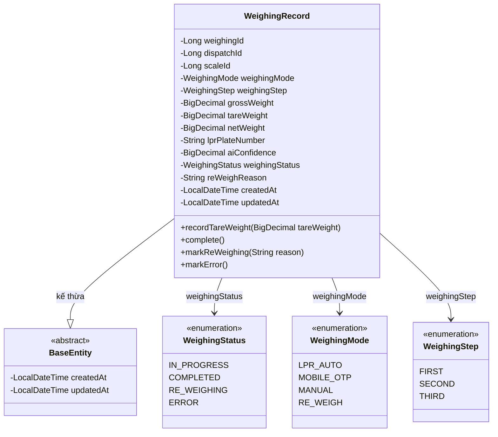
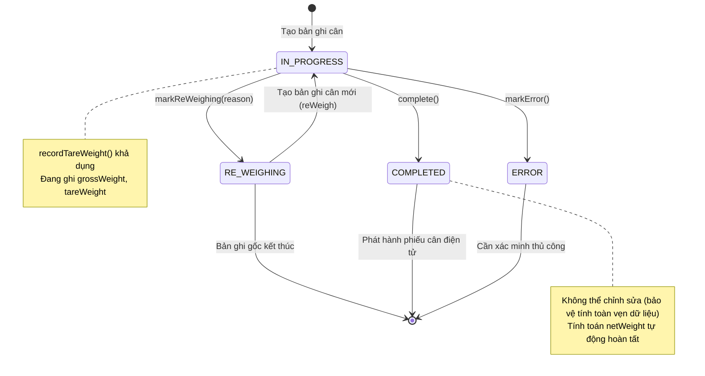
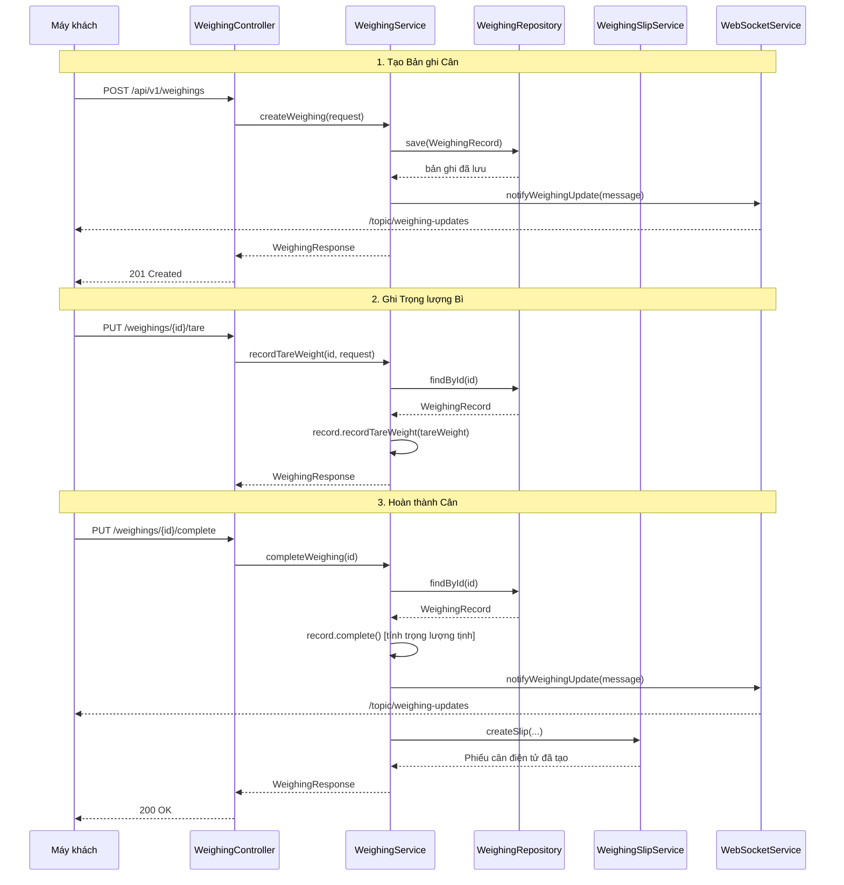
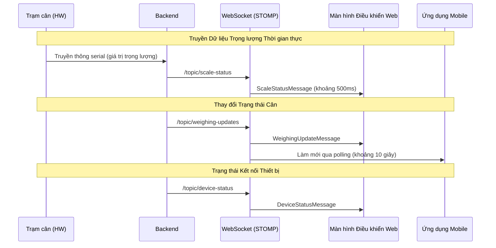
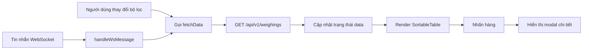
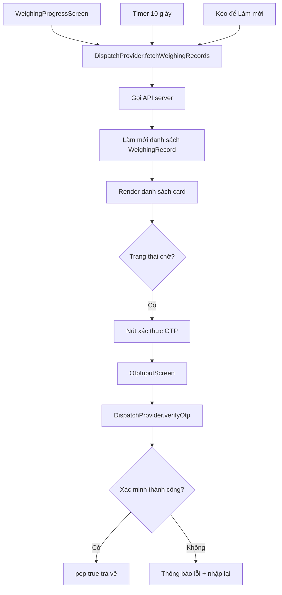

# Tài liệu Thiết kế Chi tiết Module Cân (Weighing)

| Mục | Nội dung |
|-----|---------|
| Phiên bản tài liệu | 1.0 |
| Ngày tạo | 2026-01-29 |
| Dự án | Hệ thống Cân thông minh Busan |
| Module | Cân (Weighing) |

---

## Mục lục

1. [Tổng quan Module](#1-tổng-quan-module)
2. [Mô hình Miền](#2-mô-hình-miền)
3. [Thiết kế API](#3-thiết-kế-api)
4. [Logic Dịch vụ](#4-logic-dịch-vụ)
5. [Đặc tả DTO](#5-đặc-tả-dto)
6. [Thiết kế Truyền thông Thời gian thực](#6-thiết-kế-truyền-thông-thời-gian-thực)
7. [Thiết kế Giao diện Frontend](#7-thiết-kế-giao-diện-frontend)
8. [Thiết kế Giao diện Mobile](#8-thiết-kế-giao-diện-mobile)
9. [Thiết kế Điều khiển Trạm Cân](#9-thiết-kế-điều-khiển-trạm-cân)
10. [Thiết kế Cơ sở dữ liệu](#10-thiết-kế-cơ-sở-dữ-liệu)
11. [Tóm tắt Quy tắc Nghiệp vụ](#11-tóm-tắt-quy-tắc-nghiệp-vụ)

---

## 1. Tổng quan Module

### 1.1 Mục đích

Module Cân là miền cốt lõi tự động hóa quy trình đo trọng lượng phương tiện. Dựa trên thông tin Điều phối (Dispatch), module đo tổng trọng lượng (gross weight) và trọng lượng bì (tare weight) của phương tiện, tự động tính trọng lượng tịnh (net weight), và tự động tạo phiếu cân điện tử (Slip) khi hoàn thành cân.

### 1.2 Chức năng chính

| Chức năng | Mô tả |
|-----------|-------|
| Tạo bản ghi cân | Tạo bản ghi cân mới dựa trên thông tin điều phối và trạm cân |
| Ghi trọng lượng bì | Ghi trọng lượng xe trống và tự động tính trọng lượng tịnh |
| Hoàn thành cân | Chuyển đổi trạng thái + tự động tạo phiếu cân điện tử |
| Cân lại | Đánh dấu bản ghi hiện tại là RE_WEIGHING và tạo bản ghi mới |
| Trạng thái thời gian thực | Truyền thay đổi trạng thái cân theo thời gian thực qua WebSocket |
| Tra cứu thống kê | Số lượng hôm nay/tháng, trọng lượng tịnh, phân bổ theo loại hạng mục/chế độ, xu hướng hàng ngày |
| Điều khiển trạm cân | Hiển thị trọng lượng thời gian thực, giám sát trạng thái thiết bị, vận hành chế độ tự động/thủ công |

### 1.3 Chế độ Cân

| Chế độ | Mã | Mô tả |
|--------|-----|-------|
| LPR Tự động | `LPR_AUTO` | Nhận dạng tự động qua camera nhận dạng biển số và cân |
| Mobile OTP | `MOBILE_OTP` | Cân sau khi xác thực OTP từ ứng dụng mobile |
| Thủ công | `MANUAL` | Quản trị viên nhập thủ công thông tin phương tiện để cân |
| Cân lại | `RE_WEIGH` | Đo lại do khiếu nại kết quả cân hiện có |

### 1.4 Phụ thuộc Module

```
Cân (Weighing) ─── Điều phối (Dispatch): Tham chiếu thông tin điều phối, truy vấn thông tin phiếu
       │
       ├── Phiếu (Slip): Tự động tạo phiếu cân điện tử khi hoàn thành cân
       │
       ├── WebSocket: Truyền thay đổi trạng thái theo thời gian thực
       │
       ├── LPR: Nhận kết quả nhận dạng biển số tự động
       │
       └── OTP: Tích hợp xác thực OTP mobile
```

---

## 2. Mô hình Miền

### 2.1 Sơ đồ Lớp



### 2.2 Entity: WeighingRecord

Entity miền cốt lõi cho bản ghi cân. Ghi lại tổng trọng lượng, trọng lượng bì và trọng lượng tịnh dựa trên thông tin điều phối và trạm cân, đồng thời lưu trữ kết quả nhận dạng LPR và điểm tin cậy AI.

| Trường | Kiểu | Ràng buộc | Mô tả |
|--------|------|-----------|-------|
| `weighingId` | `Long` | PK, AUTO_INCREMENT | Mã định danh duy nhất bản ghi cân |
| `dispatchId` | `Long` | NOT NULL, FK | ID điều phối liên quan |
| `scaleId` | `Long` | NOT NULL, FK | ID trạm cân sử dụng |
| `weighingMode` | `WeighingMode` | NOT NULL | Chế độ cân (LPR_AUTO, MOBILE_OTP, MANUAL, RE_WEIGH) |
| `weighingStep` | `WeighingStep` | NOT NULL | Bước cân (FIRST, SECOND, THIRD) |
| `grossWeight` | `BigDecimal(10,2)` | nullable | Tổng trọng lượng (kg) |
| `tareWeight` | `BigDecimal(10,2)` | nullable | Trọng lượng bì (kg) |
| `netWeight` | `BigDecimal(10,2)` | nullable | Trọng lượng tịnh (kg), tính tự động |
| `lprPlateNumber` | `String(20)` | nullable | Biển số xe nhận dạng bởi LPR |
| `aiConfidence` | `BigDecimal(5,4)` | nullable | Độ tin cậy nhận dạng AI (0.0000 ~ 1.0000) |
| `weighingStatus` | `WeighingStatus` | NOT NULL | Trạng thái cân |
| `reWeighReason` | `String(255)` | nullable | Lý do cân lại |
| `createdAt` | `LocalDateTime` | tự động tạo | Ngày giờ tạo (BaseEntity) |
| `updatedAt` | `LocalDateTime` | tự động cập nhật | Ngày giờ cập nhật (BaseEntity) |

### 2.3 Kiểu liệt kê

**WeighingStatus (Trạng thái Cân)**

| Giá trị | Nhãn | Mô tả |
|---------|------|-------|
| `IN_PROGRESS` | Đang tiến hành | Quá trình cân đã bắt đầu và đang đo |
| `COMPLETED` | Hoàn thành | Tất cả phép đo trọng lượng đã hoàn thành thành công |
| `RE_WEIGHING` | Cân lại | Cần đo lại do lỗi đo hoặc khiếu nại |
| `ERROR` | Lỗi | Thất bại do lỗi thiết bị hoặc sự cố hệ thống |

**WeighingMode (Chế độ Cân)**

| Giá trị | Nhãn | Mô tả |
|---------|------|-------|
| `LPR_AUTO` | LPR Tự động | Nhận dạng tự động bằng camera nhận dạng biển số |
| `MOBILE_OTP` | Mobile OTP | Xác thực OTP qua ứng dụng mobile |
| `MANUAL` | Thủ công | Quản trị viên nhập thủ công |
| `RE_WEIGH` | Cân lại | Đo lại do khiếu nại kết quả hiện có |

**WeighingStep (Bước Cân)**

| Giá trị | Nhãn | Mô tả |
|---------|------|-------|
| `FIRST` | Cân lần 1 | Đo tổng trọng lượng ở trạng thái có tải |
| `SECOND` | Cân lần 2 | Đo trọng lượng bì ở trạng thái xe trống |
| `THIRD` | Cân lần 3 | Đo lại hoặc xác minh bổ sung |

---

## 3. Thiết kế API

### 3.1 Danh sách Endpoint

Base URL: `/api/v1/weighings`

| HTTP Method | Endpoint | Mô tả | Xác thực |
|-------------|----------|-------|----------|
| `POST` | `/` | Tạo bản ghi cân | Bắt buộc |
| `GET` | `/` | Tìm kiếm bản ghi cân (phân trang) | Bắt buộc |
| `GET` | `/{weighingId}` | Tra cứu bản ghi cân đơn lẻ | Bắt buộc |
| `GET` | `/dispatch/{dispatchId}` | Tra cứu bản ghi cân theo điều phối | Bắt buộc |
| `GET` | `/in-progress` | Danh sách cân đang tiến hành | Bắt buộc |
| `GET` | `/statistics` | Tra cứu thống kê cân | Bắt buộc |
| `PUT` | `/{weighingId}/tare` | Ghi trọng lượng bì | Bắt buộc |
| `PUT` | `/{weighingId}/complete` | Hoàn thành cân | Bắt buộc |
| `PUT` | `/{weighingId}/re-weigh` | Thực hiện cân lại | Bắt buộc |

### 3.2 Đặc tả API Chi tiết

#### 3.2.1 Tạo Bản ghi Cân

```
POST /api/v1/weighings
Content-Type: application/json
```

**Body yêu cầu:**

```json
{
  "dispatch_id": 101,
  "scale_id": 1,
  "weighing_mode": "LPR_AUTO",
  "weighing_step": "FIRST",
  "weight_value": 45200.50,
  "lpr_plate_number": "12가3456",
  "ai_confidence": 0.9856
}
```

**Phản hồi (201 Created):**

```json
{
  "success": true,
  "data": {
    "weighing_id": 1,
    "dispatch_id": 101,
    "scale_id": 1,
    "weighing_mode": "LPR_AUTO",
    "weighing_step": "FIRST",
    "gross_weight": 45200.50,
    "tare_weight": null,
    "net_weight": null,
    "lpr_plate_number": "12가3456",
    "ai_confidence": 0.9856,
    "weighing_status": "IN_PROGRESS",
    "re_weigh_reason": null,
    "created_at": "2026-01-29T09:15:30",
    "updated_at": "2026-01-29T09:15:30"
  },
  "error": null
}
```

#### 3.2.2 Tìm kiếm Bản ghi Cân (Phân trang)

```
GET /api/v1/weighings?date_from=2026-01-01&date_to=2026-01-29&weighing_mode=LPR_AUTO&status=COMPLETED&lpr_plate_number=12가&page=0&size=20&sort=createdAt,desc
```

**Tham số truy vấn:**

| Tham số | Kiểu | Bắt buộc | Mô tả |
|---------|------|----------|-------|
| `date_from` | `LocalDate` | Tùy chọn | Ngày bắt đầu tìm kiếm |
| `date_to` | `LocalDate` | Tùy chọn | Ngày kết thúc tìm kiếm |
| `weighing_mode` | `String` | Tùy chọn | Bộ lọc chế độ cân |
| `status` | `String` | Tùy chọn | Bộ lọc trạng thái cân |
| `lpr_plate_number` | `String` | Tùy chọn | Khớp một phần biển số xe |
| `page` | `int` | Tùy chọn | Số trang (bắt đầu từ 0) |
| `size` | `int` | Tùy chọn | Kích thước trang |
| `sort` | `String` | Tùy chọn | Điều kiện sắp xếp |

**Phản hồi (200 OK):**

```json
{
  "success": true,
  "data": {
    "content": [
      {
        "weighing_id": 1,
        "dispatch_id": 101,
        "scale_id": 1,
        "weighing_mode": "LPR_AUTO",
        "weighing_step": "FIRST",
        "gross_weight": 45200.50,
        "tare_weight": 15100.00,
        "net_weight": 30100.50,
        "lpr_plate_number": "12가3456",
        "ai_confidence": 0.9856,
        "weighing_status": "COMPLETED",
        "re_weigh_reason": null,
        "created_at": "2026-01-29T09:15:30",
        "updated_at": "2026-01-29T09:25:00"
      }
    ],
    "total_elements": 150,
    "total_pages": 8,
    "number": 0,
    "size": 20
  },
  "error": null
}
```

#### 3.2.3 Tra cứu Bản ghi Cân Đơn lẻ

```
GET /api/v1/weighings/{weighingId}
```

**Phản hồi (200 OK):** Trả về một `WeighingResponse` đơn lẻ (cùng cấu trúc dữ liệu như 3.2.1)

#### 3.2.4 Tra cứu Bản ghi Cân theo Điều phối

```
GET /api/v1/weighings/dispatch/{dispatchId}
```

**Phản hồi (200 OK):** Trả về mảng `WeighingResponse[]`

#### 3.2.5 Danh sách Cân Đang Tiến hành

```
GET /api/v1/weighings/in-progress
```

**Phản hồi (200 OK):** Trả về mảng `WeighingResponse[]` (chỉ các bản ghi có trạng thái `IN_PROGRESS`, sắp xếp theo mới nhất)

#### 3.2.6 Ghi Trọng lượng Bì

```
PUT /api/v1/weighings/{weighingId}/tare
Content-Type: application/json
```

**Body yêu cầu:**

```json
{
  "tare_weight": 15100.00
}
```

**Phản hồi (200 OK):** Trả về `WeighingResponse` đã cập nhật

#### 3.2.7 Hoàn thành Cân

```
PUT /api/v1/weighings/{weighingId}/complete
```

**Phản hồi (200 OK):** Trả về `WeighingResponse` đã hoàn thành (trọng lượng tịnh được tính tự động)

**Logic nghiệp vụ:**
- Thay đổi trạng thái sang `COMPLETED`
- Tự động tính trọng lượng tịnh: `netWeight = grossWeight - tareWeight`
- Ném ngoại lệ `WEIGHING_002` nếu trọng lượng tịnh âm
- Truyền thay đổi trạng thái qua WebSocket
- Tự động tạo phiếu cân điện tử (hoàn thành cân được duy trì ngay cả khi tạo phiếu thất bại)

#### 3.2.8 Thực hiện Cân lại

```
PUT /api/v1/weighings/{weighingId}/re-weigh
Content-Type: application/json
```

**Body yêu cầu:**

```json
{
  "reason": "Yêu cầu cân lại do lỗi đo trọng lượng"
}
```

**Phản hồi (200 OK):** Trả về `WeighingResponse` của bản ghi cân mới được tạo

**Logic nghiệp vụ:**
- Thay đổi trạng thái bản ghi gốc sang `RE_WEIGHING` và ghi lại lý do
- Sao chép thông tin gốc để tạo bản ghi cân mới (trạng thái: `IN_PROGRESS`)
- Truyền thay đổi trạng thái qua WebSocket

#### 3.2.9 Tra cứu Thống kê Cân

```
GET /api/v1/weighings/statistics
```

**Phản hồi (200 OK):**

```json
{
  "success": true,
  "data": {
    "today_total_count": 42,
    "today_completed_count": 38,
    "today_in_progress_count": 4,
    "today_total_net_weight_ton": 1215.5,
    "month_total_count": 856,
    "month_total_net_weight_ton": 25680.3,
    "count_by_item_type": {
      "STEEL": 320,
      "SCRAP": 280,
      "RAW_MATERIAL": 256
    },
    "count_by_weighing_mode": {
      "LPR_AUTO": 650,
      "MOBILE_OTP": 120,
      "MANUAL": 86
    },
    "daily_statistics": [
      {
        "date": "2026-01-28",
        "total_count": 45,
        "total_net_weight_ton": 1350.2
      },
      {
        "date": "2026-01-29",
        "total_count": 42,
        "total_net_weight_ton": 1215.5
      }
    ]
  },
  "error": null
}
```

### 3.3 Mã Lỗi

| Mã | HTTP Status | Mô tả |
|----|-------------|-------|
| `WEIGHING_001` | 404 | Không tìm thấy bản ghi cân |
| `WEIGHING_002` | 400 | Trọng lượng tịnh âm (lỗi đo) |
| `WEIGHING_003` | 400 | Không thể sửa đổi/hoàn thành lại bản ghi cân đã hoàn thành |

---

## 4. Logic Dịch vụ

### 4.1 Sơ đồ Chuyển đổi Trạng thái



### 4.2 Luồng Quy trình Cân



### 4.3 Logic Nghiệp vụ Cốt lõi

#### 4.3.1 Tính Trọng lượng Tịnh Tự động

Thực hiện trong phương thức `WeighingRecord.complete()`.

```
if (grossWeight != null AND tareWeight != null) {
    netWeight = grossWeight - tareWeight
    if (netWeight < 0) {
        throw WEIGHING_002 (lỗi trọng lượng tịnh âm)
    }
}
weighingStatus = COMPLETED
```

#### 4.3.2 Ràng buộc Ghi Trọng lượng Bì

Thực hiện trong phương thức `WeighingRecord.recordTareWeight()`.

```
if (weighingStatus == COMPLETED) {
    throw WEIGHING_003 (không thể sửa đổi bản ghi cân đã hoàn thành)
}
this.tareWeight = tareWeight
```

#### 4.3.3 Xử lý Cân lại

Thực hiện trong phương thức `WeighingService.reWeigh()`.

```
1. Tra cứu bản ghi gốc (findById)
2. Đánh dấu bản ghi gốc sang trạng thái RE_WEIGHING + ghi lại lý do
3. Sao chép thông tin gốc (dispatchId, scaleId, mode, step, grossWeight, lpr, v.v.) để tạo bản ghi mới
4. Lưu bản ghi mới (trạng thái: IN_PROGRESS)
5. Truyền thay đổi trạng thái qua WebSocket
```

#### 4.3.4 Tạo Phiếu Cân Điện tử Tự động

Tự động thực hiện khi hoàn thành cân (`completeWeighing`).

```
1. Truy vấn thông tin Dispatch + Vehicle + Company qua một câu truy vấn JOIN duy nhất
2. Tổ hợp thông tin cân (weighingId, dispatchId, vehiclePlate, companyName, itemName,
   grossWeight, tareWeight, netWeight) dạng JSON
3. Gọi WeighingSlipService.createSlip()
4. Hoàn thành cân được duy trì ngay cả khi tạo phiếu điện tử thất bại (try-catch)
```

#### 4.3.5 Logic Tra cứu Thống kê

Thực hiện trong phương thức `WeighingService.getStatistics()`.

| Thống kê | Khoảng thời gian | Phương thức Truy vấn |
|----------|-------------------|---------------------|
| Tổng số hôm nay | Hôm nay | `countByPeriod(todayStart, todayEnd)` |
| Số hoàn thành hôm nay | Hôm nay | `countByStatusAndPeriod(COMPLETED, ...)` |
| Số đang tiến hành hôm nay | Hôm nay | `countByStatusAndPeriod(IN_PROGRESS, ...)` |
| Trọng lượng tịnh hôm nay (tấn) | Hôm nay | `sumNetWeightByPeriod(...)` / 1000 |
| Tổng số tháng | Ngày 1 đến Hôm nay | `countByPeriod(monthStart, todayEnd)` |
| Trọng lượng tịnh tháng (tấn) | Ngày 1 đến Hôm nay | `sumNetWeightByPeriod(...)` / 1000 |
| Số theo loại hạng mục | Tháng hiện tại | `countGroupByItemType(...)` |
| Số theo chế độ | Tháng hiện tại | `countGroupByWeighingMode(...)` |
| Thống kê hàng ngày | 30 ngày gần nhất | `findDailyStatistics(...)` |

---

## 5. Đặc tả DTO

### 5.1 DTO Yêu cầu

#### WeighingCreateRequest (Yêu cầu Tạo Cân)

```java
public record WeighingCreateRequest(
    @NotNull Long dispatchId,          // ID điều phối (bắt buộc)
    @NotNull Long scaleId,             // ID trạm cân (bắt buộc)
    @NotNull WeighingMode weighingMode, // Chế độ cân (bắt buộc)
    @NotNull WeighingStep weighingStep, // Bước cân (bắt buộc)
    @NotNull @DecimalMin("0.01") BigDecimal weightValue, // Trọng lượng đo (bắt buộc, tối thiểu 0.01)
    String lprPlateNumber,              // Biển số nhận dạng LPR (tùy chọn)
    BigDecimal aiConfidence             // Độ tin cậy nhận dạng AI (tùy chọn)
)
```

#### WeighingTareRequest (Yêu cầu Ghi Trọng lượng Bì)

```java
public record WeighingTareRequest(
    @NotNull @DecimalMin("0.01") BigDecimal tareWeight // Trọng lượng bì (bắt buộc, tối thiểu 0.01)
)
```

#### ReWeighRequest (Yêu cầu Cân lại)

```java
public record ReWeighRequest(
    @NotBlank String reason // Lý do cân lại (bắt buộc, không cho phép chuỗi rỗng)
)
```

#### WeighingSearchCondition (Điều kiện Tìm kiếm)

```java
public record WeighingSearchCondition(
    LocalDate dateFrom,             // Ngày bắt đầu tìm kiếm (tùy chọn)
    LocalDate dateTo,               // Ngày kết thúc tìm kiếm (tùy chọn)
    WeighingMode weighingMode,      // Bộ lọc chế độ cân (tùy chọn)
    WeighingStatus status,          // Bộ lọc trạng thái cân (tùy chọn)
    String lprPlateNumber           // Khớp một phần biển số (tùy chọn)
)
```

### 5.2 DTO Phản hồi

#### WeighingResponse (Phản hồi Cân)

```java
public record WeighingResponse(
    Long weighingId,                // ID cân
    Long dispatchId,                // ID điều phối
    Long scaleId,                   // ID trạm cân
    String weighingMode,            // Chế độ cân (chuỗi)
    String weighingStep,            // Bước cân (chuỗi)
    BigDecimal grossWeight,         // Tổng trọng lượng (kg)
    BigDecimal tareWeight,          // Trọng lượng bì (kg)
    BigDecimal netWeight,           // Trọng lượng tịnh (kg)
    String lprPlateNumber,          // Biển số LPR
    BigDecimal aiConfidence,        // Độ tin cậy AI
    String weighingStatus,          // Trạng thái cân (chuỗi)
    String reWeighReason,           // Lý do cân lại
    LocalDateTime createdAt,        // Ngày giờ tạo
    LocalDateTime updatedAt         // Ngày giờ cập nhật
)
```

- Chuyển đổi từ entity bằng phương thức factory tĩnh `from(WeighingRecord record)`

#### WeighingStatisticsResponse (Phản hồi Thống kê)

```java
public record WeighingStatisticsResponse(
    long todayTotalCount,                       // Tổng số hôm nay
    long todayCompletedCount,                   // Số hoàn thành hôm nay
    long todayInProgressCount,                  // Số đang tiến hành hôm nay
    double todayTotalNetWeightTon,              // Trọng lượng tịnh hôm nay (tấn)
    long monthTotalCount,                       // Tổng số tháng
    double monthTotalNetWeightTon,              // Trọng lượng tịnh tháng (tấn)
    Map<String, Long> countByItemType,          // Số theo loại hạng mục
    Map<String, Long> countByWeighingMode,      // Số theo chế độ
    List<DailyStatistics> dailyStatistics       // Danh sách thống kê hàng ngày
)
```

#### DailyStatistics (Thống kê Hàng ngày)

```java
public record DailyStatistics(
    LocalDate date,                 // Ngày tham chiếu thống kê
    long totalCount,                // Tổng số cho ngày đó
    double totalNetWeightTon        // Trọng lượng tịnh cho ngày đó (tấn)
)
```

---

## 6. Thiết kế Truyền thông Thời gian thực

### 6.1 Kiến trúc WebSocket

```
Giao thức: STOMP over SockJS
Endpoint: /ws (hỗ trợ SockJS fallback)
Thời gian chờ kết nối lại: 5 giây
Heartbeat: nhận 10 giây, gửi 10 giây
Xác thực: Dựa trên JWT token
```

### 6.2 Chủ đề Đăng ký

| Chủ đề | Hướng | Kiểu Tin nhắn | Thời điểm Kích hoạt |
|--------|-------|---------------|---------------------|
| `/topic/weighing-updates` | Server -> Client | `WeighingUpdateMessage` | Khi tạo, hoàn thành hoặc cân lại |
| `/topic/scale-status` | Server -> Client | `ScaleStatusMessage` | Thay đổi trọng lượng thời gian thực trên trạm cân (khoảng 500ms) |
| `/topic/device-status` | Server -> Client | `DeviceStatusMessage` | Khi trạng thái kết nối thiết bị thay đổi |

### 6.3 Định dạng Tin nhắn

#### WeighingUpdateMessage (Cập nhật Cân)

Cấu trúc tin nhắn phía server được gửi từ backend.

```json
{
  "weighing_id": 1,
  "dispatch_id": 101,
  "weighing_status": "COMPLETED",
  "weighing_mode": "LPR_AUTO",
  "gross_weight": 45200.50,
  "tare_weight": 15100.00,
  "net_weight": 30100.50,
  "lpr_plate_number": "12가3456",
  "timestamp": "2026-01-29T09:25:00"
}
```

Cấu trúc tin nhắn mở rộng được nhận bởi màn hình điều khiển frontend.

```json
{
  "weighingId": 1,
  "dispatchId": 101,
  "processState": "COMPLETE",
  "weighingMode": "AUTO",
  "plateNumber": "12가3456",
  "grossWeight": 45200.50,
  "tareWeight": 15100.00,
  "netWeight": 30100.50,
  "companyName": "Dongkuk Logistics",
  "itemName": "Thép",
  "driverName": "Hong Gildong",
  "message": "Hoàn thành cân: 12가3456",
  "timestamp": "2026-01-29T09:25:00"
}
```

#### ScaleStatusMessage (Trạng thái Trạm Cân Thời gian thực)

```json
{
  "scale_id": 1,
  "current_weight": 45200.5,
  "unit": "kg",
  "is_stable": true,
  "stability_status": "STABLE",
  "timestamp": "2026-01-29T09:15:30"
}
```

#### DeviceStatusMessage (Trạng thái Thiết bị)

```json
{
  "device_type": "SCALE",
  "device_name": "Trạm cân số 1",
  "status": "ONLINE",
  "message": null,
  "timestamp": "2026-01-29T09:00:00"
}
```

### 6.4 Luồng Tin nhắn



---

## 7. Thiết kế Giao diện Frontend

### 7.1 Trang Trạng thái Cân (WeighingPage)

**Đường dẫn:** `/weighing`
**File:** `frontend/src/pages/WeighingPage.tsx`

#### 7.1.1 Bố cục Màn hình

```
+----------------------------------------------------------+
| Trạng thái Cân                                            |
+----------------------------------------------------------+
| [Khoảng thời gian: Bắt đầu ~ Kết thúc] [Trạng thái: Tất cả v] [Chế độ: Tất cả v] |
|                                    [Đặt lại] [Tìm kiếm]  |
+----------------------------------------------------------+
| ID | ID Điều phối | Chế độ | Tổng | Bì | Tịnh | ...     |
|----|-------------|--------|------|-----|------|------     |
|  1 |   101       | LPR TĐ | 45,201 | 15,100 | 30,101 |...|
|  2 |   102       | Thủ công | 38,500 | 12,800 | 25,700 |...|
+----------------------------------------------------------+
```

#### 7.1.2 Danh sách Chức năng

| Chức năng | Mô tả |
|-----------|-------|
| Tìm kiếm Bộ lọc | Bộ lọc kết hợp khoảng thời gian (RangePicker), trạng thái (Select), chế độ cân (Select) |
| Xem danh sách | Danh sách phân trang dựa trên SortableTable (kích thước trang 20) |
| Làm mới Thời gian thực | Tự động làm mới danh sách khi nhận tin nhắn WebSocket (`/topic/weighing-updates`) |
| Modal Chi tiết | Hiển thị Modal chi tiết cân khi nhấn hàng (component Descriptions) |
| Đặt lại | Đặt lại tất cả điều kiện bộ lọc |

#### 7.1.3 Quản lý Trạng thái

| Trạng thái | Kiểu | Giá trị ban đầu | Mô tả |
|------------|------|-----------------|-------|
| `data` | `WeighingRecord[]` | `[]` | Danh sách bản ghi cân |
| `loading` | `boolean` | `false` | Trạng thái loading |
| `statusFilter` | `string \| undefined` | `undefined` | Bộ lọc trạng thái |
| `modeFilter` | `string \| undefined` | `undefined` | Bộ lọc chế độ cân |
| `dateRange` | `[Dayjs, Dayjs] \| null` | `null` | Bộ lọc khoảng thời gian |
| `detailOpen` | `boolean` | `false` | Hiển thị modal chi tiết |
| `selectedRecord` | `WeighingRecord \| null` | `null` | Bản ghi được chọn |

#### 7.1.4 Luồng Dữ liệu



### 7.2 Cấu hình Cột Bảng

| Tên Cột | Trường | Rộng | Render |
|---------|--------|------|--------|
| ID | `weighingId` | 80px | Số |
| ID Điều phối | `dispatchId` | 100px | Số |
| Chế độ | `weighingMode` | 120px | Chuyển đổi nhãn |
| Tổng trọng lượng (kg) | `grossWeight` | 120px | Phân cách hàng nghìn, căn phải |
| Trọng lượng bì (kg) | `tareWeight` | 130px | Phân cách hàng nghìn, căn phải |
| Trọng lượng tịnh (kg) | `netWeight` | 120px | Nổi bật màu chính, căn phải |
| Biển số | `lprPlateNumber` | 110px | Văn bản |
| Trạng thái | `weighingStatus` | 90px | Component Tag (mã màu) |
| Ngày giờ | `createdAt` | 160px | Định dạng `YYYY-MM-DD HH:mm` |

---

## 8. Thiết kế Giao diện Mobile

### 8.1 Cấu trúc Màn hình

Các màn hình liên quan đến cân của ứng dụng mobile bao gồm hai màn hình.

```
mobile/lib/screens/weighing/
├── weighing_progress_screen.dart   # Màn hình tiến trình cân
└── otp_input_screen.dart           # Màn hình nhập xác thực OTP
```

### 8.2 Màn hình Tiến trình Cân (WeighingProgressScreen)

#### 8.2.1 Bố cục Màn hình

```
+------------------------------------------+
| [Cập nhật lần cuối: Vừa xong]  [Làm mới] |
+------------------------------------------+
| +--------------------------------------+ |
| | Số điều phối: DIS-2026-0101          | |
| | 12가3456 | Dongkuk Logistics [Lần 1] | |
| |                                      | |
| | Trạng thái tiến trình        33%     | |
| | [========----------]                 | |
| | Chờ   Lần 1  Lần 2  Xong           | |
| |                                      | |
| | Tổng trọng lượng: 45,201 kg        | |
| | Bì: -                               | |
| | Tịnh: -                             | |
| |                                      | |
| | Cân lần 1: 09:15                    | |
| |                                      | |
| | [    Xác thực OTP        ]          | |
| +--------------------------------------+ |
+------------------------------------------+
```

#### 8.2.2 Danh sách Chức năng

| Chức năng | Mô tả |
|-----------|-------|
| Tự động Làm mới | Tự động tra cứu bản ghi cân theo ngày hôm nay mỗi 10 giây qua Timer |
| Kéo để Làm mới | Hỗ trợ làm mới thủ công qua RefreshIndicator |
| Phát hiện Hoàn thành mới | Hiển thị dialog khi phát hiện bản ghi COMPLETED mới so với lần tra cứu trước |
| Hiển thị Tiến trình | LinearProgressIndicator + nhãn bước (Chờ/Lần 1/Lần 2/Xong) |
| Tóm tắt Trọng lượng | Hiển thị trực quan tổng trọng lượng/trọng lượng bì/trọng lượng tịnh qua WeightSummaryRow |
| Xác thực OTP | Hiển thị nút xác thực OTP cho bản ghi ở trạng thái chờ |

#### 8.2.3 Mô hình Dữ liệu (WeighingRecord - Flutter)

```dart
class WeighingRecord {
  final String id;                    // ID bản ghi cân
  final String dispatchId;            // ID điều phối
  final String dispatchNumber;        // Số điều phối
  final WeighingStatus status;        // Trạng thái cân
  final String vehicleNumber;         // Biển số xe
  final String driverName;            // Tên tài xế
  final String companyName;           // Tên công ty
  final String itemName;              // Tên hạng mục
  final double? firstWeight;          // Cân lần 1 (tổng trọng lượng)
  final double? secondWeight;         // Cân lần 2 (trọng lượng bì)
  final double? netWeight;            // Trọng lượng tịnh
  final DateTime? firstWeighingTime;  // Thời gian cân lần 1
  final DateTime? secondWeighingTime; // Thời gian cân lần 2
  final String? scaleId;              // ID trạm cân
  final String? memo;                 // Ghi chú
  final DateTime createdAt;           // Ngày giờ tạo
}
```

#### 8.2.4 Kiểu liệt kê Trạng thái Cân Mobile

| Giá trị | Nhãn | Tiến trình | Màu sắc | Icon |
|---------|------|-----------|---------|------|
| `waiting` | Đang chờ | 0% | Slate | hourglass_empty |
| `firstWeighing` | Cân lần 1 | 33% | Cyan | monitor_weight |
| `secondWeighing` | Cân lần 2 | 66% | Amber | monitor_weight |
| `completed` | Hoàn thành | 100% | Green | check_circle |
| `error` | Lỗi | 0% | Rose | error |

### 8.3 Màn hình Xác thực OTP (OtpInputScreen)

#### 8.3.1 Bố cục Màn hình

```
+------------------------------------------+
|              < Xác thực OTP              |
+------------------------------------------+
|          DIS-2026-0101                    |
|     Nhập mã OTP 6 chữ số                |
|          [ 04:32 ]                        |
|                                           |
|    [1] [2] [3] [4] [5] [6]              |
|                                           |
|    [1] [2] [3]                           |
|    [4] [5] [6]                           |
|    [7] [8] [9]                           |
|    [C] [0] [<]                           |
|                                           |
|    [        Xác minh          ]          |
+------------------------------------------+
```

#### 8.3.2 Danh sách Chức năng

| Chức năng | Mô tả |
|-----------|-------|
| Nhập OTP 6 chữ số | Bàn phím số tùy chỉnh (0-9, C, backspace) |
| Đếm ngược 5 phút | Đếm ngược 300 giây qua Timer.periodic, vô hiệu hóa nhập khi hết hạn |
| Xác minh OTP | Yêu cầu xác thực server qua DispatchProvider.verifyOtp() |
| Yêu cầu lại khi hết hạn | Hiển thị nút "Yêu cầu OTP lại" khi hết thời gian |
| Kết quả Xác minh | Thành công: pop(context, true), Thất bại: thông báo lỗi + đặt lại mã |

### 8.4 Luồng Dữ liệu Mobile



---

## 9. Thiết kế Điều khiển Trạm Cân

### 9.1 Tổng quan

Trang Điều khiển Trạm Cân (WeighingStationPage) là màn hình điều khiển nơi nhân viên vận hành trạm cân giám sát và điều khiển quy trình cân theo thời gian thực. Bao gồm bảng hiển thị bên trái (trọng lượng, phương tiện, thiết bị, lịch sử) và bảng điều khiển bên phải (chuyển đổi chế độ, điều khiển thủ công, nút hành động, trạng thái quy trình, nhật ký, bộ mô phỏng).

### 9.2 Kiến trúc Tổng thể

```mermaid
flowchart TB
    subgraph "WeighingStationPage"
        direction TB
        subgraph "Bảng Trái (Khu vực Hiển thị)"
            WD[WeightDisplay<br/>Trọng lượng Thời gian thực]
            VP[VehicleInfoPanel<br/>Thông tin Phương tiện/Điều phối]
            CS[ConnectionStatusBar<br/>Trạng thái Kết nối Thiết bị]
            HT[WeighingHistoryTable<br/>Lịch sử Cân Gần đây]
        end
        subgraph "Bảng Phải (Khu vực Điều khiển)"
            MT[ModeToggle<br/>Chuyển Tự động/Thủ công]
            MC[ManualControls<br/>Điều khiển Cân Thủ công]
            AB[ActionButtons<br/>Nút Điều khiển Hành động]
            PS[ProcessStateBar<br/>Trạng thái Quy trình]
            SL[StatusLog<br/>Nhật ký Trạng thái]
            SP[SimulatorPanel<br/>Bộ Mô phỏng]
        end
    end

    subgraph "Hooks"
        UWS[useWeighingStation<br/>Hook Quản lý Trạng thái]
        UWSS[useWeighingStationSocket<br/>Hook WebSocket]
    end

    subgraph "WebSocket Topics"
        T1[/topic/scale-status]
        T2[/topic/weighing-updates]
        T3[/topic/device-status]
    end

    subgraph "REST API"
        A1[weighingStationApi]
    end

    UWSS --> T1
    UWSS --> T2
    UWSS --> T3
    UWS --> UWSS
    UWS --> A1

    UWS --> WD
    UWS --> VP
    UWS --> CS
    UWS --> HT
    UWS --> MT
    UWS --> MC
    UWS --> AB
    UWS --> PS
    UWS --> SL
    UWS --> SP
```

### 9.3 Quản lý Trạng thái (useWeighingStation)

**File:** `frontend/src/hooks/useWeighingStation.ts`

Hook này quản lý toàn bộ trạng thái của trạm cân, phối hợp nhận tin nhắn WebSocket, gọi API và trạng thái UI tại một nơi.

#### 9.3.1 Trạng thái Được quản lý

| Trạng thái | Kiểu | Giá trị ban đầu | Mô tả |
|------------|------|-----------------|-------|
| `mode` | `WeighingMode` | `'AUTO'` | Chế độ cân hiện tại (AUTO/MANUAL) |
| `processState` | `ProcessState` | `'IDLE'` | Trạng thái tiến trình quy trình |
| `weight` | `WeightData` | `{currentWeight:0, stability:'DISCONNECTED', unit:'kg'}` | Dữ liệu trọng lượng thời gian thực |
| `vehicle` | `VehicleInfo` | `{plateNumber:'-', ...}` | Thông tin phương tiện hiện tại |
| `devices` | `DeviceConnectionState` | `{scale:'OFFLINE', ...}` | Trạng thái kết nối thiết bị |
| `logs` | `StatusLogEntry[]` | `[]` | Danh sách nhật ký trạng thái (tối đa 200 mục) |
| `history` | `WeighingHistoryRecord[]` | `[]` | Lịch sử cân gần đây |
| `searchResults` | `DispatchSearchResult[]` | `[]` | Kết quả tìm kiếm điều phối |
| `selectedDispatchId` | `number \| null` | `null` | ID điều phối được chọn |
| `simulatorEnabled` | `boolean` | `false` | Bộ mô phỏng đã bật |
| `searchLoading` | `boolean` | `false` | Trạng thái loading tìm kiếm |

#### 9.3.2 Hành động Cung cấp

| Hành động | Mô tả |
|-----------|-------|
| `changeMode(mode)` | Chuyển chế độ cân (AUTO/MANUAL), đặt lại trạng thái tìm kiếm |
| `handleSearch(plate)` | Tìm kiếm điều phối theo biển số (cho chế độ thủ công) |
| `handleConfirmWeight()` | Bắt đầu cân thủ công cho điều phối đã chọn |
| `handleReset()` | Đặt lại quy trình (đặt lại về trạng thái IDLE) |
| `handleBarrierOpen()` | Mở rào chắn thủ công |
| `loadHistory()` | Tải lịch sử cân gần đây (50 bản ghi) |
| `addLog(msg, level)` | Thêm mục vào nhật ký trạng thái |
| `handleSimTriggerSensor()` | [Mô phỏng] Kích hoạt cảm biến phát hiện phương tiện |
| `handleSimCaptureLpr()` | [Mô phỏng] Chụp camera LPR |
| `handleSimTogglePosition()` | [Mô phỏng] Chuyển đổi vị trí |
| `handleSimSetWeight(w)` | [Mô phỏng] Đặt trọng lượng |

### 9.4 Kết nối WebSocket (useWeighingStationSocket)

**File:** `frontend/src/hooks/useWeighingStationSocket.ts`

Kết nối đến server qua giao thức STOMP over SockJS và đăng ký ba chủ đề.

```typescript
// Cấu hình kết nối
const client = new Client({
  webSocketFactory: () => new SockJS('/ws'),
  reconnectDelay: 5000,        // Thời gian chờ kết nối lại: 5 giây
  heartbeatIncoming: 10000,    // Heartbeat Server->Client: 10 giây
  heartbeatOutgoing: 10000,    // Heartbeat Client->Server: 10 giây
});

// Đăng ký chủ đề
client.subscribe('/topic/scale-status', ...);       // -> callback onScaleStatus
client.subscribe('/topic/weighing-updates', ...);   // -> callback onWeighingUpdate
client.subscribe('/topic/device-status', ...);      // -> callback onDeviceStatus
```

### 9.5 Chi tiết Component

#### 9.5.1 WeightDisplay (Hiển thị Trọng lượng)

Hiển thị giá trị trọng lượng trạm cân thời gian thực dạng hiển thị kỹ thuật số với phông monospace 72px.

| Trạng thái Ổn định | Nền | Màu Chữ | Hiệu ứng |
|--------------------|------|---------|-----------|
| STABLE | Nền xanh lá | Theme primary | Phát sáng + đổ bóng |
| UNSTABLE | Nền vàng | Vàng | Mặc định |
| ERROR | Nền đỏ | Đỏ | Đổ bóng đỏ |
| DISCONNECTED | Nền xám | Xám | Không |

- Hoạt ảnh thay đổi số qua component AnimatedNumber (300ms)
- Hỗ trợ trình đọc màn hình với `aria-live="assertive"`

#### 9.5.2 VehicleInfoPanel (Thông tin Phương tiện)

Hiển thị biển số xe, công ty vận chuyển, hạng mục, số điều phối và thông tin tài xế theo hàng với biểu tượng.

| Hàng | Icon | Trường |
|------|------|--------|
| Biển số xe | CarOutlined | `plateNumber` |
| Công ty vận chuyển | BankOutlined | `companyName` |
| Hạng mục | ShoppingOutlined | `itemName` |
| Số điều phối | FileTextOutlined | `dispatchId` |
| Tài xế | UserOutlined | `driverName` |

- Khi biển số không phải `-`, hiển thị đậm ở trạng thái hoạt động

#### 9.5.3 ConnectionStatusBar (Trạng thái Kết nối Thiết bị)

Hiển thị trực quan trạng thái kết nối thời gian thực của 4 thiết bị.

| Thiết bị | Icon | Key Trạng thái |
|----------|------|---------------|
| Trạm cân | DashboardOutlined | `scale` |
| Bảng hiển thị | DesktopOutlined | `display` |
| Rào chắn | StopOutlined | `barrier` |
| Mạng | WifiOutlined | `network` |

- Màu theo trạng thái: ONLINE (xanh lá), OFFLINE (xám), ERROR (đỏ)
- Hiệu ứng LED phát sáng khi ONLINE
- Tooltip hiển thị tên thiết bị: trạng thái

#### 9.5.4 ModeToggle (Chuyển đổi Chế độ)

Chuyển đổi giữa chế độ Tự động (AUTO LPR) và Thủ công (MANUAL) qua Radio.Group.

- AUTO: Màu theme primary, icon ScanOutlined
- MANUAL: Tím (#A855F7), icon EditOutlined
- LED và màu viền trái thay đổi động khi chuyển chế độ

#### 9.5.5 ManualControls (Điều khiển Cân Thủ công)

Bảng điều khiển chỉ hoạt động ở chế độ thủ công.

**Luồng công việc:**
1. Nhập biển số xe (Input.Search)
2. Thực hiện tìm kiếm -> Trả về danh sách điều phối
3. Chọn điều phối (Select)
4. Nhấn nút "Xác nhận Trọng lượng và Bắt đầu Cân"

- Ở chế độ AUTO, toàn bộ phần có opacity 0.45 + disabled
- Có thể tìm kiếm bằng phím Enter

#### 9.5.6 ActionButtons (Điều khiển Hành động)

| Nút | Icon | Hành động | Xác nhận |
|-----|------|-----------|----------|
| Đặt lại | ClearOutlined | Đặt lại quy trình về IDLE | Cần Popconfirm |
| Mở Rào chắn | UnlockOutlined | Mở rào chắn thủ công | Thực hiện ngay |
| Cân lại | ReloadOutlined | Thực hiện đo lại | Vô hiệu hóa (đang triển khai) |

#### 9.5.7 ProcessStateBar (Trạng thái Quy trình)

Hiển thị trực quan trạng thái tiến trình hiện tại của quy trình cân bằng thanh tiến trình và thẻ trạng thái.

**Tiến trình các Bước Quy trình:**

```
IDLE -> WEIGHING -> STABILIZING -> COMPLETE
(Chờ)  (Đang cân)  (Đang ổn định) (Hoàn thành)
```

| Trạng thái | Màu sắc | Icon |
|------------|---------|------|
| IDLE | #64748B (Xám) | ClockCircleOutlined |
| WEIGHING | #06B6D4 (Cyan) | LoadingOutlined (quay) |
| STABILIZING | #F59E0B (Vàng) | SyncOutlined (quay) |
| COMPLETE | #10B981 (Xanh lá) | CheckCircleOutlined |
| ERROR | #F43F5E (Đỏ) | CloseCircleOutlined |

- Thanh segment tương ứng với mỗi bước được kích hoạt
- Bước hiện tại có hiệu ứng phát sáng
- Trạng thái ERROR chuyển toàn bộ thanh sang đỏ

#### 9.5.8 StatusLog (Nhật ký Trạng thái)

Bảng nhật ký sự kiện thời gian thực kiểu terminal.

- Nền tối (#0D1117) + phông monospace
- Header trang trí kiểu macOS traffic light
- Duy trì tối đa 200 nhật ký
- Màu theo cấp nhật ký: info (xám), success (xanh neon), warning (vàng), error (đỏ)
- Tự động cuộn khi thêm nhật ký mới (lên trên)

#### 9.5.9 SimulatorPanel (Bộ Mô phỏng)

Bảng mô phỏng thiết bị cho môi trường phát triển/kiểm thử. Có thể thu gọn bằng Collapse và hiển thị huy hiệu DEV.

| Nút | Icon | API |
|-----|------|-----|
| Phát hiện Phương tiện | ExperimentOutlined | `POST /lpr/simulator {command: 'TRIGGER_SENSOR'}` |
| Chụp LPR | CameraOutlined | `POST /lpr/simulator {command: 'CAPTURE_LPR'}` |
| Chuyển đổi Vị trí | AimOutlined | `POST /lpr/simulator {command: 'TOGGLE_POSITION'}` |
| Đặt Trọng lượng | DashboardOutlined | `POST /lpr/simulator {command: 'SET_WEIGHT', params: {weight: N}}` |

- Switch để bật/tắt bộ mô phỏng
- InputNumber để nhập trực tiếp giá trị trọng lượng (mặc định: 15,000 kg, phạm vi: 0~100,000)

### 9.6 REST API (weighingStationApi)

| Hàm | Method | Endpoint | Mô tả |
|-----|--------|----------|-------|
| `searchDispatches(plate)` | GET | `/dispatches?plateNumber=...&status=REGISTERED` | Tìm kiếm điều phối |
| `createWeighing(data)` | POST | `/weighings` | Tạo cân |
| `confirmWeighing(id, weight)` | POST | `/weighings/{id}/confirm` | Xác nhận trọng lượng |
| `reWeigh(id, reason)` | POST | `/weighings/{id}/reweigh` | Cân lại |
| `fetchWeighingHistory(size)` | GET | `/weighings?size=50&sort=createdAt,desc` | Lấy lịch sử |
| `openBarrier()` | POST | `/monitoring/devices/cmd` | Mở rào chắn |
| `resetProcess(scaleId)` | POST | `/weighings/reset` | Đặt lại quy trình |
| `sendSimulatorCommand(cmd)` | POST | `/lpr/simulator` | Lệnh mô phỏng |

---

## 10. Thiết kế Cơ sở dữ liệu

### 10.1 DDL

```sql
CREATE TABLE tb_weighing (
    weighing_id     BIGSERIAL       PRIMARY KEY,
    dispatch_id     BIGINT          NOT NULL,
    scale_id        BIGINT          NOT NULL,
    weighing_mode   VARCHAR(20)     NOT NULL,
    weighing_step   VARCHAR(20)     NOT NULL,
    gross_weight    NUMERIC(10, 2),
    tare_weight     NUMERIC(10, 2),
    net_weight      NUMERIC(10, 2),
    lpr_plate_number VARCHAR(20),
    ai_confidence   NUMERIC(5, 4),
    weighing_status VARCHAR(20)     NOT NULL,
    re_weigh_reason VARCHAR(255),
    created_at      TIMESTAMP       NOT NULL DEFAULT CURRENT_TIMESTAMP,
    updated_at      TIMESTAMP       NOT NULL DEFAULT CURRENT_TIMESTAMP,

    CONSTRAINT fk_weighing_dispatch
        FOREIGN KEY (dispatch_id) REFERENCES tb_dispatch(dispatch_id),
    CONSTRAINT fk_weighing_scale
        FOREIGN KEY (scale_id) REFERENCES tb_scale(scale_id),
    CONSTRAINT chk_weighing_mode
        CHECK (weighing_mode IN ('LPR_AUTO', 'MOBILE_OTP', 'MANUAL', 'RE_WEIGH')),
    CONSTRAINT chk_weighing_step
        CHECK (weighing_step IN ('FIRST', 'SECOND', 'THIRD')),
    CONSTRAINT chk_weighing_status
        CHECK (weighing_status IN ('IN_PROGRESS', 'COMPLETED', 'RE_WEIGHING', 'ERROR'))
);
```

### 10.2 Index

```sql
-- Truy vấn theo ID điều phối (lịch sử cân theo điều phối)
CREATE INDEX idx_weighing_dispatch ON tb_weighing (dispatch_id);

-- Truy vấn theo ID trạm cân (tình trạng sử dụng theo trạm cân)
CREATE INDEX idx_weighing_scale ON tb_weighing (scale_id);

-- Truy vấn theo trạng thái (danh sách cân đang tiến hành, thống kê theo trạng thái)
CREATE INDEX idx_weighing_status ON tb_weighing (weighing_status);

-- Index phức hợp (tìm kiếm kết hợp khoảng thời gian + trạng thái, tối ưu truy vấn thống kê)
CREATE INDEX idx_weighing_created_status
    ON tb_weighing (created_at, weighing_status);

-- Tối ưu tìm kiếm LIKE biển số
CREATE INDEX idx_weighing_lpr_plate
    ON tb_weighing (lpr_plate_number);
```

### 10.3 Các Pattern Truy vấn Chính

| Mục đích | Pattern Truy cập | Index Sử dụng |
|----------|-------------------|---------------|
| Cân theo điều phối | `WHERE dispatch_id = ?` | `idx_weighing_dispatch` |
| Danh sách đang tiến hành | `WHERE weighing_status = 'IN_PROGRESS' ORDER BY created_at DESC` | `idx_weighing_status` |
| Tìm kiếm khoảng thời gian + trạng thái | `WHERE created_at BETWEEN ? AND ? AND weighing_status = ?` | `idx_weighing_created_status` |
| Tìm kiếm biển số | `WHERE lpr_plate_number LIKE '%?%'` | `idx_weighing_lpr_plate` |
| Thống kê số lượng theo khoảng thời gian | `WHERE created_at BETWEEN ? AND ? GROUP BY ...` | `idx_weighing_created_status` |
| Thống kê hoàn thành hàng ngày | `WHERE weighing_status = 'COMPLETED' AND created_at BETWEEN ? AND ?` | `idx_weighing_created_status` |

---

## 11. Tóm tắt Quy tắc Nghiệp vụ

### 11.1 Quy tắc Tạo Cân

| Số | Quy tắc | Mô tả |
|----|---------|-------|
| BR-01 | Trạng thái ban đầu cố định | Trạng thái của bản ghi cân được tạo luôn là `IN_PROGRESS` |
| BR-02 | Xác thực trường bắt buộc | `dispatchId`, `scaleId`, `weighingMode`, `weighingStep`, `weightValue` là bắt buộc |
| BR-03 | Trọng lượng tối thiểu | `weightValue` phải ít nhất 0.01 |
| BR-04 | Truyền WebSocket | Truyền ngay đến `/topic/weighing-updates` khi tạo |

### 11.2 Quy tắc Ghi Trọng lượng

| Số | Quy tắc | Mô tả |
|----|---------|-------|
| BR-05 | Không sửa đổi sau hoàn thành | Không thể ghi trọng lượng bì cho bản ghi cân `COMPLETED` (WEIGHING_003) |
| BR-06 | Tính trọng lượng tịnh tự động | `netWeight = grossWeight - tareWeight` khi gọi `complete()` |
| BR-07 | Xác thực trọng lượng tịnh âm | Ném ngoại lệ `WEIGHING_002` nếu trọng lượng tịnh âm (vật lý không thể) |
| BR-08 | Không hoàn thành lại | Bản ghi đã `COMPLETED` không thể hoàn thành lại (WEIGHING_003) |

### 11.3 Quy tắc Cân lại

| Số | Quy tắc | Mô tả |
|----|---------|-------|
| BR-09 | Bắt buộc lý do | Lý do cân lại (`reason`) không được rỗng (@NotBlank) |
| BR-10 | Đánh dấu bản ghi gốc | Thay đổi trạng thái bản ghi gốc sang `RE_WEIGHING` |
| BR-11 | Sao chép bản ghi mới | Sao chép dispatchId, scaleId, mode, step, grossWeight, thông tin lpr từ bản ghi gốc để tạo bản ghi mới |

### 11.4 Quy tắc Phiếu Cân Điện tử

| Số | Quy tắc | Mô tả |
|----|---------|-------|
| BR-12 | Tạo tự động | Tự động tạo phiếu cân điện tử bằng cách kết hợp thông tin điều phối + phương tiện + công ty khi hoàn thành cân |
| BR-13 | Chịu lỗi | Hoàn thành cân được duy trì ngay cả khi tạo phiếu điện tử thất bại |

### 11.5 Quy tắc Thống kê

| Số | Quy tắc | Mô tả |
|----|---------|-------|
| BR-14 | Chuyển đổi đơn vị | Trọng lượng tịnh lưu bằng kg trong DB, chuyển sang tấn (ton) trong phản hồi API (/ 1000) |
| BR-15 | Phạm vi thống kê hàng ngày | Số lượng hàng ngày và trọng lượng tịnh của các phép cân hoàn thành trong 30 ngày gần nhất |
| BR-16 | Phạm vi thống kê tháng | Tổng số và trọng lượng tịnh từ ngày 1 tháng hiện tại đến hôm nay |

### 11.6 Quy tắc Truyền thông Thời gian thực

| Số | Quy tắc | Mô tả |
|----|---------|-------|
| BR-17 | Kết nối lại tự động | Tự động kết nối lại sau 5 giây khi WebSocket bị ngắt |
| BR-18 | Heartbeat | Duy trì heartbeat ở khoảng 10 giây cho cả nhận và gửi |
| BR-19 | Làm mới lịch sử khi hoàn thành | Tự động làm mới bảng lịch sử khi nhận trạng thái `COMPLETE` qua WebSocket |
| BR-20 | Giới hạn kích thước nhật ký | Nhật ký trạng thái duy trì tối đa 200 mục, nhật ký cũ nhất bị xóa khi vượt quá |

### 11.7 Quy tắc Mobile

| Số | Quy tắc | Mô tả |
|----|---------|-------|
| BR-21 | Thời hạn OTP | Mã OTP phải được nhập trong vòng 5 phút (300 giây) |
| BR-22 | Số chữ số OTP | Chỉ cho phép mã số 6 chữ số |
| BR-23 | Làm mới tự động | Tự động làm mới bản ghi cân theo ngày hôm nay mỗi 10 giây |
| BR-24 | Phát hiện hoàn thành | Hiển thị dialog khi phát hiện bản ghi COMPLETED mới so với lần tra cứu trước |
