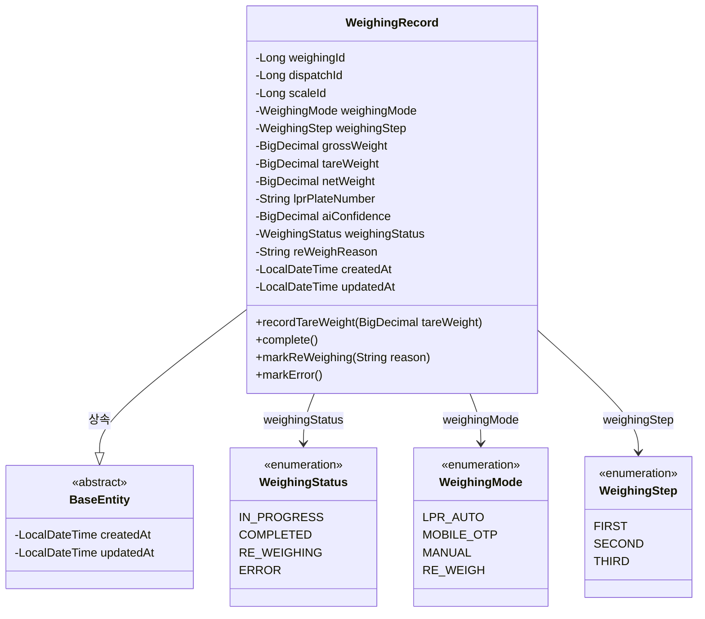
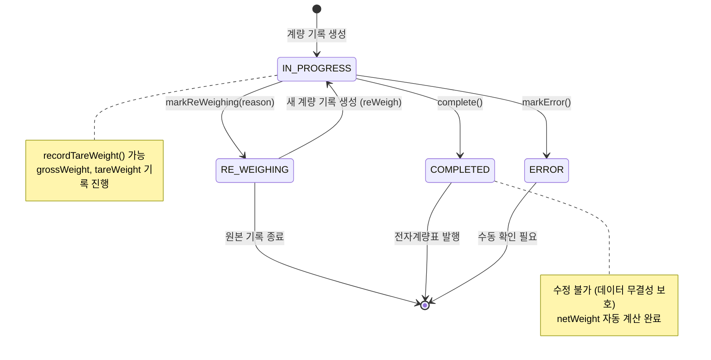
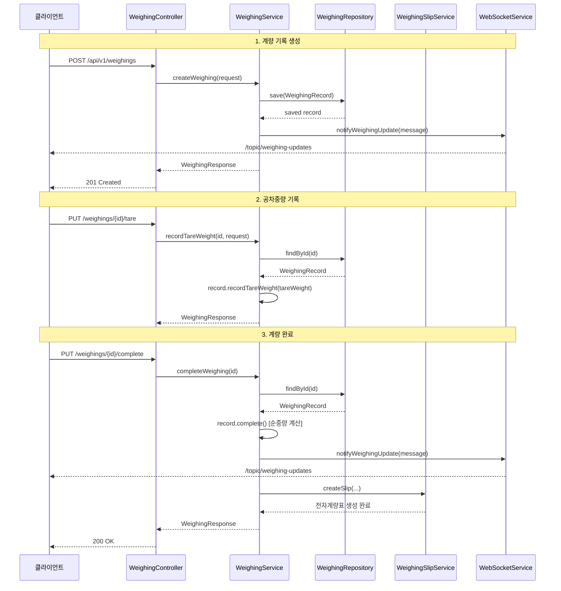
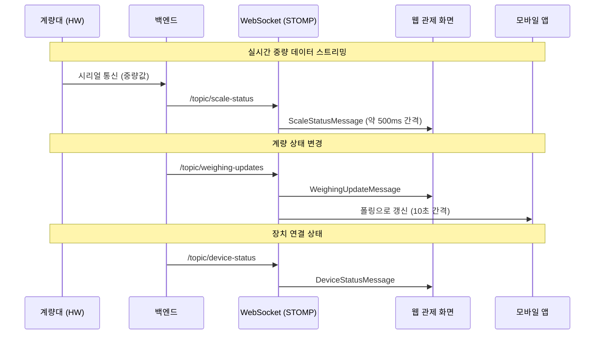
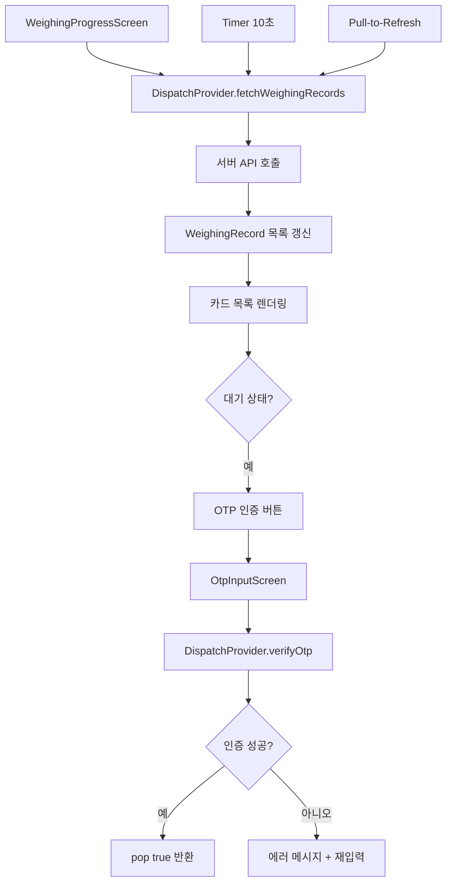

# 계량(Weighing) 모듈 상세 설계서

| 항목 | 내용 |
|------|------|
| 문서 버전 | 1.0 |
| 작성일 | 2026-01-29 |
| 프로젝트 | 부산 스마트 계량 시스템 |
| 모듈 | 계량 (Weighing) |

---

## 목차

1. [모듈 개요](#1-모듈-개요)
2. [도메인 모델](#2-도메인-모델)
3. [API 설계](#3-api-설계)
4. [서비스 로직](#4-서비스-로직)
5. [DTO 명세](#5-dto-명세)
6. [실시간 통신 설계](#6-실시간-통신-설계)
7. [프론트엔드 화면 설계](#7-프론트엔드-화면-설계)
8. [모바일 화면 설계](#8-모바일-화면-설계)
9. [계량소 관제 설계](#9-계량소-관제-설계)
10. [데이터베이스 설계](#10-데이터베이스-설계)
11. [비즈니스 규칙 요약](#11-비즈니스-규칙-요약)

---

## 1. 모듈 개요

### 1.1 목적

계량 모듈은 차량의 중량 측정 프로세스를 자동화하는 핵심 도메인이다. 배차(Dispatch) 정보를 기반으로 차량의 총중량(gross weight)과 공차중량(tare weight)을 측정하고, 순중량(net weight)을 자동 계산하며, 계량 완료 시 전자계량표(Slip)를 자동 생성한다.

### 1.2 핵심 기능

| 기능 | 설명 |
|------|------|
| 계량 기록 생성 | 배차 및 계량대 정보 기반으로 새 계량 기록 생성 |
| 공차중량 기록 | 빈 차량 상태의 중량 기록 및 순중량 자동 계산 |
| 계량 완료 | 상태 전환 + 전자계량표 자동 생성 |
| 재계량 | 기존 기록을 RE_WEIGHING으로 마킹 후 신규 기록 생성 |
| 실시간 현황 | WebSocket으로 계량 상태 변경을 실시간 전파 |
| 통계 조회 | 금일/월간 건수, 순중량, 품목별/모드별 분포, 일별 추이 |
| 계량소 관제 | 실시간 중량 표시, 장치 상태 모니터링, 수동/자동 모드 운영 |

### 1.3 계량 모드

| 모드 | 코드 | 설명 |
|------|------|------|
| LPR 자동 | `LPR_AUTO` | 차량번호인식 카메라로 자동 식별 후 계량 |
| 모바일 OTP | `MOBILE_OTP` | 모바일 앱에서 OTP 인증 후 계량 |
| 수동 | `MANUAL` | 관리자가 직접 차량 정보를 입력하여 계량 |
| 재계량 | `RE_WEIGH` | 기존 계량 결과에 이의가 있어 재측정 |

### 1.4 모듈 의존 관계

```
계량(Weighing) ─── 배차(Dispatch): 배차 정보 참조, 슬립 정보 조회
       │
       ├── 전표(Slip): 계량 완료 시 전자계량표 자동 생성
       │
       ├── WebSocket: 상태 변경 실시간 전파
       │
       ├── LPR: 차량번호 자동인식 결과 수신
       │
       └── OTP: 모바일 OTP 인증 연동
```

---

## 2. 도메인 모델

### 2.1 클래스 다이어그램



### 2.2 엔티티: WeighingRecord

계량 기록의 핵심 도메인 엔티티이다. 배차 정보와 계량대를 기반으로 총중량, 공차중량, 순중량을 기록하며, LPR 인식 결과와 AI 신뢰도 정보를 함께 보관한다.

| 필드 | 타입 | 제약조건 | 설명 |
|------|------|----------|------|
| `weighingId` | `Long` | PK, AUTO_INCREMENT | 계량 기록 고유 식별자 |
| `dispatchId` | `Long` | NOT NULL, FK | 연관된 배차 ID |
| `scaleId` | `Long` | NOT NULL, FK | 사용된 계량대 ID |
| `weighingMode` | `WeighingMode` | NOT NULL | 계량 모드 (LPR_AUTO, MOBILE_OTP, MANUAL, RE_WEIGH) |
| `weighingStep` | `WeighingStep` | NOT NULL | 계량 단계 (FIRST, SECOND, THIRD) |
| `grossWeight` | `BigDecimal(10,2)` | nullable | 총중량 (kg) |
| `tareWeight` | `BigDecimal(10,2)` | nullable | 공차중량 (kg) |
| `netWeight` | `BigDecimal(10,2)` | nullable | 순중량 (kg), 자동계산 |
| `lprPlateNumber` | `String(20)` | nullable | LPR 인식 차량번호 |
| `aiConfidence` | `BigDecimal(5,4)` | nullable | AI 인식 신뢰도 (0.0000 ~ 1.0000) |
| `weighingStatus` | `WeighingStatus` | NOT NULL | 계량 상태 |
| `reWeighReason` | `String(255)` | nullable | 재계량 사유 |
| `createdAt` | `LocalDateTime` | 자동생성 | 생성일시 (BaseEntity) |
| `updatedAt` | `LocalDateTime` | 자동갱신 | 수정일시 (BaseEntity) |

### 2.3 열거형

**WeighingStatus (계량 상태)**

| 값 | 한국어 | 설명 |
|----|--------|------|
| `IN_PROGRESS` | 진행중 | 계량이 시작되어 측정 진행 중 |
| `COMPLETED` | 완료 | 모든 중량 측정이 정상 완료 |
| `RE_WEIGHING` | 재계량 | 측정 오류 또는 이의 제기로 재측정 필요 |
| `ERROR` | 오류 | 장비 오류 또는 시스템 장애로 실패 |

**WeighingMode (계량 모드)**

| 값 | 한국어 | 설명 |
|----|--------|------|
| `LPR_AUTO` | LPR 자동 | 차량번호인식 카메라 자동 식별 |
| `MOBILE_OTP` | 모바일 OTP | 모바일 앱 OTP 인증 |
| `MANUAL` | 수동 | 관리자 직접 입력 |
| `RE_WEIGH` | 재계량 | 기존 결과 이의 제기 재측정 |

**WeighingStep (계량 단계)**

| 값 | 한국어 | 설명 |
|----|--------|------|
| `FIRST` | 1차 계량 | 적재 상태에서 총중량 측정 |
| `SECOND` | 2차 계량 | 공차 상태에서 공차중량 측정 |
| `THIRD` | 3차 계량 | 재측정 또는 추가 검증 |

---

## 3. API 설계

### 3.1 엔드포인트 목록

Base URL: `/api/v1/weighings`

| HTTP Method | 엔드포인트 | 설명 | 인증 |
|-------------|-----------|------|------|
| `POST` | `/` | 계량 기록 생성 | 필수 |
| `GET` | `/` | 계량 기록 검색 (페이징) | 필수 |
| `GET` | `/{weighingId}` | 계량 기록 단건 조회 | 필수 |
| `GET` | `/dispatch/{dispatchId}` | 배차별 계량 기록 조회 | 필수 |
| `GET` | `/in-progress` | 진행 중 계량 목록 조회 | 필수 |
| `GET` | `/statistics` | 계량 통계 조회 | 필수 |
| `PUT` | `/{weighingId}/tare` | 공차중량 기록 | 필수 |
| `PUT` | `/{weighingId}/complete` | 계량 완료 처리 | 필수 |
| `PUT` | `/{weighingId}/re-weigh` | 재계량 수행 | 필수 |

### 3.2 상세 API 명세

#### 3.2.1 계량 기록 생성

```
POST /api/v1/weighings
Content-Type: application/json
```

**요청 본문:**

```json
{
  "dispatch_id": 101,
  "scale_id": 1,
  "weighing_mode": "LPR_AUTO",
  "weighing_step": "FIRST",
  "weight_value": 45200.50,
  "lpr_plate_number": "12가3456",
  "ai_confidence": 0.9856
}
```

**응답 (201 Created):**

```json
{
  "success": true,
  "data": {
    "weighing_id": 1,
    "dispatch_id": 101,
    "scale_id": 1,
    "weighing_mode": "LPR_AUTO",
    "weighing_step": "FIRST",
    "gross_weight": 45200.50,
    "tare_weight": null,
    "net_weight": null,
    "lpr_plate_number": "12가3456",
    "ai_confidence": 0.9856,
    "weighing_status": "IN_PROGRESS",
    "re_weigh_reason": null,
    "created_at": "2026-01-29T09:15:30",
    "updated_at": "2026-01-29T09:15:30"
  },
  "error": null
}
```

#### 3.2.2 계량 기록 검색 (페이징)

```
GET /api/v1/weighings?date_from=2026-01-01&date_to=2026-01-29&weighing_mode=LPR_AUTO&status=COMPLETED&lpr_plate_number=12가&page=0&size=20&sort=createdAt,desc
```

**쿼리 파라미터:**

| 파라미터 | 타입 | 필수 | 설명 |
|----------|------|------|------|
| `date_from` | `LocalDate` | 선택 | 검색 시작일 |
| `date_to` | `LocalDate` | 선택 | 검색 종료일 |
| `weighing_mode` | `String` | 선택 | 계량 모드 필터 |
| `status` | `String` | 선택 | 계량 상태 필터 |
| `lpr_plate_number` | `String` | 선택 | 차량번호 부분 일치 |
| `page` | `int` | 선택 | 페이지 번호 (0부터) |
| `size` | `int` | 선택 | 페이지 크기 |
| `sort` | `String` | 선택 | 정렬 조건 |

**응답 (200 OK):**

```json
{
  "success": true,
  "data": {
    "content": [
      {
        "weighing_id": 1,
        "dispatch_id": 101,
        "scale_id": 1,
        "weighing_mode": "LPR_AUTO",
        "weighing_step": "FIRST",
        "gross_weight": 45200.50,
        "tare_weight": 15100.00,
        "net_weight": 30100.50,
        "lpr_plate_number": "12가3456",
        "ai_confidence": 0.9856,
        "weighing_status": "COMPLETED",
        "re_weigh_reason": null,
        "created_at": "2026-01-29T09:15:30",
        "updated_at": "2026-01-29T09:25:00"
      }
    ],
    "total_elements": 150,
    "total_pages": 8,
    "number": 0,
    "size": 20
  },
  "error": null
}
```

#### 3.2.3 계량 기록 단건 조회

```
GET /api/v1/weighings/{weighingId}
```

**응답 (200 OK):** `WeighingResponse` 단건 반환 (3.2.1의 data 구조와 동일)

#### 3.2.4 배차별 계량 기록 조회

```
GET /api/v1/weighings/dispatch/{dispatchId}
```

**응답 (200 OK):** `WeighingResponse[]` 배열 반환

#### 3.2.5 진행 중 계량 목록 조회

```
GET /api/v1/weighings/in-progress
```

**응답 (200 OK):** `WeighingResponse[]` 배열 반환 (상태가 `IN_PROGRESS`인 기록만, 최신순 정렬)

#### 3.2.6 공차중량 기록

```
PUT /api/v1/weighings/{weighingId}/tare
Content-Type: application/json
```

**요청 본문:**

```json
{
  "tare_weight": 15100.00
}
```

**응답 (200 OK):** 업데이트된 `WeighingResponse` 반환

#### 3.2.7 계량 완료 처리

```
PUT /api/v1/weighings/{weighingId}/complete
```

**응답 (200 OK):** 완료 처리된 `WeighingResponse` 반환 (순중량 자동 계산됨)

**비즈니스 로직:**
- 상태를 `COMPLETED`로 변경
- 순중량 자동 계산: `netWeight = grossWeight - tareWeight`
- 순중량이 음수이면 `WEIGHING_002` 예외 발생
- WebSocket으로 상태 변경 전파
- 전자계량표(Slip) 자동 생성 (실패 시에도 계량 완료는 유지)

#### 3.2.8 재계량 수행

```
PUT /api/v1/weighings/{weighingId}/re-weigh
Content-Type: application/json
```

**요청 본문:**

```json
{
  "reason": "중량 측정 오류로 인한 재계량 요청"
}
```

**응답 (200 OK):** 새로 생성된 계량 기록의 `WeighingResponse` 반환

**비즈니스 로직:**
- 원본 기록의 상태를 `RE_WEIGHING`으로 변경하고 사유를 기록
- 원본 정보를 복사하여 새로운 계량 기록 생성 (상태: `IN_PROGRESS`)
- WebSocket으로 상태 변경 전파

#### 3.2.9 계량 통계 조회

```
GET /api/v1/weighings/statistics
```

**응답 (200 OK):**

```json
{
  "success": true,
  "data": {
    "today_total_count": 42,
    "today_completed_count": 38,
    "today_in_progress_count": 4,
    "today_total_net_weight_ton": 1215.5,
    "month_total_count": 856,
    "month_total_net_weight_ton": 25680.3,
    "count_by_item_type": {
      "STEEL": 320,
      "SCRAP": 280,
      "RAW_MATERIAL": 256
    },
    "count_by_weighing_mode": {
      "LPR_AUTO": 650,
      "MOBILE_OTP": 120,
      "MANUAL": 86
    },
    "daily_statistics": [
      {
        "date": "2026-01-28",
        "total_count": 45,
        "total_net_weight_ton": 1350.2
      },
      {
        "date": "2026-01-29",
        "total_count": 42,
        "total_net_weight_ton": 1215.5
      }
    ]
  },
  "error": null
}
```

### 3.3 에러 코드

| 코드 | HTTP 상태 | 설명 |
|------|-----------|------|
| `WEIGHING_001` | 404 | 계량 기록을 찾을 수 없음 |
| `WEIGHING_002` | 400 | 순중량이 음수 (측정 오류) |
| `WEIGHING_003` | 400 | 이미 완료된 계량은 수정/재완료 불가 |

---

## 4. 서비스 로직

### 4.1 상태 전이 다이어그램



### 4.2 계량 프로세스 흐름



### 4.3 핵심 비즈니스 로직

#### 4.3.1 순중량 자동 계산

`WeighingRecord.complete()` 메서드에서 수행된다.

```
if (grossWeight != null AND tareWeight != null) {
    netWeight = grossWeight - tareWeight
    if (netWeight < 0) {
        throw WEIGHING_002 (순중량 음수 오류)
    }
}
weighingStatus = COMPLETED
```

#### 4.3.2 공차중량 기록 제약

`WeighingRecord.recordTareWeight()` 메서드에서 수행된다.

```
if (weighingStatus == COMPLETED) {
    throw WEIGHING_003 (완료된 계량 수정 불가)
}
this.tareWeight = tareWeight
```

#### 4.3.3 재계량 처리

`WeighingService.reWeigh()` 메서드에서 수행된다.

```
1. 원본 기록 조회 (findById)
2. 원본 기록을 RE_WEIGHING 상태로 마킹 + 사유 기록
3. 원본 정보(dispatchId, scaleId, mode, step, grossWeight, lpr 등)를 복사하여 새 기록 생성
4. 새 기록 저장 (상태: IN_PROGRESS)
5. WebSocket으로 상태 변경 전파
```

#### 4.3.4 전자계량표 자동 생성

계량 완료(`completeWeighing`) 시 자동으로 수행된다.

```
1. Dispatch + Vehicle + Company 정보를 단일 JOIN 쿼리로 조회
2. 계량 정보(weighingId, dispatchId, vehiclePlate, companyName, itemName,
   grossWeight, tareWeight, netWeight)를 JSON 형태로 구성
3. WeighingSlipService.createSlip() 호출
4. 전자계량표 생성 실패 시에도 계량 완료 처리는 정상 유지 (try-catch)
```

#### 4.3.5 통계 조회 로직

`WeighingService.getStatistics()` 메서드에서 수행된다.

| 통계 항목 | 기간 | 쿼리 메서드 |
|-----------|------|-------------|
| 금일 총 건수 | 금일 | `countByPeriod(todayStart, todayEnd)` |
| 금일 완료 건수 | 금일 | `countByStatusAndPeriod(COMPLETED, ...)` |
| 금일 진행 중 건수 | 금일 | `countByStatusAndPeriod(IN_PROGRESS, ...)` |
| 금일 순중량(톤) | 금일 | `sumNetWeightByPeriod(...)` / 1000 |
| 월간 총 건수 | 당월 1일~금일 | `countByPeriod(monthStart, todayEnd)` |
| 월간 순중량(톤) | 당월 1일~금일 | `sumNetWeightByPeriod(...)` / 1000 |
| 품목별 건수 | 당월 | `countGroupByItemType(...)` |
| 모드별 건수 | 당월 | `countGroupByWeighingMode(...)` |
| 일별 통계 | 최근 30일 | `findDailyStatistics(...)` |

---

## 5. DTO 명세

### 5.1 요청 DTO

#### WeighingCreateRequest (계량 생성 요청)

```java
public record WeighingCreateRequest(
    @NotNull Long dispatchId,          // 배차 ID (필수)
    @NotNull Long scaleId,             // 계량대 ID (필수)
    @NotNull WeighingMode weighingMode, // 계량 모드 (필수)
    @NotNull WeighingStep weighingStep, // 계량 단계 (필수)
    @NotNull @DecimalMin("0.01") BigDecimal weightValue, // 측정 중량 (필수, 최소 0.01)
    String lprPlateNumber,              // LPR 인식 차량번호 (선택)
    BigDecimal aiConfidence             // AI 인식 신뢰도 (선택)
)
```

#### WeighingTareRequest (공차중량 기록 요청)

```java
public record WeighingTareRequest(
    @NotNull @DecimalMin("0.01") BigDecimal tareWeight // 공차중량 (필수, 최소 0.01)
)
```

#### ReWeighRequest (재계량 요청)

```java
public record ReWeighRequest(
    @NotBlank String reason // 재계량 사유 (필수, 빈 문자열 불가)
)
```

#### WeighingSearchCondition (검색 조건)

```java
public record WeighingSearchCondition(
    LocalDate dateFrom,             // 검색 시작일 (선택)
    LocalDate dateTo,               // 검색 종료일 (선택)
    WeighingMode weighingMode,      // 계량 모드 필터 (선택)
    WeighingStatus status,          // 계량 상태 필터 (선택)
    String lprPlateNumber           // 차량번호 부분 일치 (선택)
)
```

### 5.2 응답 DTO

#### WeighingResponse (계량 응답)

```java
public record WeighingResponse(
    Long weighingId,                // 계량 ID
    Long dispatchId,                // 배차 ID
    Long scaleId,                   // 계량대 ID
    String weighingMode,            // 계량 모드 (문자열)
    String weighingStep,            // 계량 단계 (문자열)
    BigDecimal grossWeight,         // 총중량 (kg)
    BigDecimal tareWeight,          // 공차중량 (kg)
    BigDecimal netWeight,           // 순중량 (kg)
    String lprPlateNumber,          // LPR 차량번호
    BigDecimal aiConfidence,        // AI 신뢰도
    String weighingStatus,          // 계량 상태 (문자열)
    String reWeighReason,           // 재계량 사유
    LocalDateTime createdAt,        // 생성일시
    LocalDateTime updatedAt         // 수정일시
)
```

- `from(WeighingRecord record)` 정적 팩토리 메서드로 엔티티에서 변환

#### WeighingStatisticsResponse (통계 응답)

```java
public record WeighingStatisticsResponse(
    long todayTotalCount,                       // 금일 총 건수
    long todayCompletedCount,                   // 금일 완료 건수
    long todayInProgressCount,                  // 금일 진행 중 건수
    double todayTotalNetWeightTon,              // 금일 순중량 (톤)
    long monthTotalCount,                       // 월간 총 건수
    double monthTotalNetWeightTon,              // 월간 순중량 (톤)
    Map<String, Long> countByItemType,          // 품목별 건수
    Map<String, Long> countByWeighingMode,      // 모드별 건수
    List<DailyStatistics> dailyStatistics       // 일별 통계 목록
)
```

#### DailyStatistics (일별 통계)

```java
public record DailyStatistics(
    LocalDate date,                 // 통계 기준 날짜
    long totalCount,                // 해당 날짜 총 건수
    double totalNetWeightTon        // 해당 날짜 순중량 (톤)
)
```

---

## 6. 실시간 통신 설계

### 6.1 WebSocket 아키텍처

```
프로토콜: STOMP over SockJS
엔드포인트: /ws (SockJS 폴백 지원)
재연결 대기: 5초
하트비트: 수신 10초, 송신 10초
인증: JWT 토큰 기반
```

### 6.2 구독 토픽

| 토픽 | 방향 | 메시지 타입 | 발생 시점 |
|------|------|-------------|-----------|
| `/topic/weighing-updates` | 서버 -> 클라이언트 | `WeighingUpdateMessage` | 계량 생성, 완료, 재계량 시 |
| `/topic/scale-status` | 서버 -> 클라이언트 | `ScaleStatusMessage` | 계량대 실시간 중량 변경 (약 500ms 간격) |
| `/topic/device-status` | 서버 -> 클라이언트 | `DeviceStatusMessage` | 장비 연결 상태 변경 시 |

### 6.3 메시지 포맷

#### WeighingUpdateMessage (계량 업데이트)

백엔드에서 전송되는 서버측 메시지 구조이다.

```json
{
  "weighing_id": 1,
  "dispatch_id": 101,
  "weighing_status": "COMPLETED",
  "weighing_mode": "LPR_AUTO",
  "gross_weight": 45200.50,
  "tare_weight": 15100.00,
  "net_weight": 30100.50,
  "lpr_plate_number": "12가3456",
  "timestamp": "2026-01-29T09:25:00"
}
```

프론트엔드 관제 화면에서 수신하는 확장 메시지 구조는 다음과 같다.

```json
{
  "weighingId": 1,
  "dispatchId": 101,
  "processState": "COMPLETE",
  "weighingMode": "AUTO",
  "plateNumber": "12가3456",
  "grossWeight": 45200.50,
  "tareWeight": 15100.00,
  "netWeight": 30100.50,
  "companyName": "동국물류",
  "itemName": "철강재",
  "driverName": "홍길동",
  "message": "계량 완료: 12가3456",
  "timestamp": "2026-01-29T09:25:00"
}
```

#### ScaleStatusMessage (계량대 실시간 상태)

```json
{
  "scale_id": 1,
  "current_weight": 45200.5,
  "unit": "kg",
  "is_stable": true,
  "stability_status": "STABLE",
  "timestamp": "2026-01-29T09:15:30"
}
```

#### DeviceStatusMessage (장치 상태)

```json
{
  "device_type": "SCALE",
  "device_name": "1호 계량대",
  "status": "ONLINE",
  "message": null,
  "timestamp": "2026-01-29T09:00:00"
}
```

### 6.4 메시지 흐름



---

## 7. 프론트엔드 화면 설계

### 7.1 계량 현황 페이지 (WeighingPage)

**경로:** `/weighing`
**파일:** `frontend/src/pages/WeighingPage.tsx`

#### 7.1.1 화면 구성

```
+----------------------------------------------------------+
| 계량 현황                                                 |
+----------------------------------------------------------+
| [기간: 시작일 ~ 종료일] [상태: 전체 v] [계량방식: 전체 v]  |
|                                    [초기화] [조회]         |
+----------------------------------------------------------+
| ID | 배차ID | 계량방식 | 총중량 | 공차중량 | 순중량 | ... |
|----|--------|---------|--------|---------|--------|------|
|  1 |   101  | LPR자동 | 45,201 |  15,100 | 30,101 | ...  |
|  2 |   102  | 수동    | 38,500 |  12,800 | 25,700 | ...  |
+----------------------------------------------------------+
```

#### 7.1.2 기능 목록

| 기능 | 설명 |
|------|------|
| 필터 검색 | 기간(RangePicker), 상태(Select), 계량방식(Select) 조합 필터 |
| 목록 조회 | SortableTable 기반 페이징 목록 (페이지 크기 20) |
| 실시간 갱신 | WebSocket 메시지(`/topic/weighing-updates`) 수신 시 목록 자동 갱신 |
| 상세 모달 | 행 클릭 시 계량 상세정보 Modal 표시 (Descriptions 컴포넌트) |
| 초기화 | 필터 조건 전체 초기화 |

#### 7.1.3 상태 관리

| 상태 | 타입 | 초기값 | 설명 |
|------|------|--------|------|
| `data` | `WeighingRecord[]` | `[]` | 계량 기록 목록 |
| `loading` | `boolean` | `false` | 로딩 상태 |
| `statusFilter` | `string \| undefined` | `undefined` | 상태 필터 |
| `modeFilter` | `string \| undefined` | `undefined` | 계량방식 필터 |
| `dateRange` | `[Dayjs, Dayjs] \| null` | `null` | 기간 필터 |
| `detailOpen` | `boolean` | `false` | 상세 모달 표시 여부 |
| `selectedRecord` | `WeighingRecord \| null` | `null` | 선택된 레코드 |

#### 7.1.4 데이터 흐름


### 7.2 테이블 컬럼 구성

| 컬럼명 | 필드 | 너비 | 렌더링 |
|--------|------|------|--------|
| ID | `weighingId` | 80px | 숫자 |
| 배차ID | `dispatchId` | 100px | 숫자 |
| 계량방식 | `weighingMode` | 120px | 한국어 라벨 변환 |
| 총중량(kg) | `grossWeight` | 120px | 천 단위 구분, 우측 정렬 |
| 공차중량(kg) | `tareWeight` | 130px | 천 단위 구분, 우측 정렬 |
| 순중량(kg) | `netWeight` | 120px | 기본색 강조, 우측 정렬 |
| 차량번호 | `lprPlateNumber` | 110px | 텍스트 |
| 상태 | `weighingStatus` | 90px | Tag 컴포넌트 (색상별) |
| 일시 | `createdAt` | 160px | `YYYY-MM-DD HH:mm` 포맷 |

---

## 8. 모바일 화면 설계

### 8.1 화면 구조

모바일 앱의 계량 관련 화면은 두 개의 스크린으로 구성된다.

```
mobile/lib/screens/weighing/
├── weighing_progress_screen.dart   # 계량 진행 현황 화면
└── otp_input_screen.dart           # OTP 인증 입력 화면
```

### 8.2 계량 진행 현황 화면 (WeighingProgressScreen)

#### 8.2.1 화면 구성

```
+------------------------------------------+
| [최종 업데이트: 방금 전]        [새로고침] |
+------------------------------------------+
| +--------------------------------------+ |
| | 배차번호: DIS-2026-0101              | |
| | 12가3456 | 동국물류       [1차 계량]  | |
| |                                      | |
| | 진행 상태               33%          | |
| | [========----------]                 | |
| | 대기   1차   2차   완료              | |
| |                                      | |
| | 총중량: 45,201 kg                    | |
| | 공차: -                              | |
| | 순중량: -                            | |
| |                                      | |
| | 1차 계량: 09:15                      | |
| |                                      | |
| | [       OTP 인증        ]            | |
| +--------------------------------------+ |
+------------------------------------------+
```

#### 8.2.2 기능 목록

| 기능 | 설명 |
|------|------|
| 자동 새로고침 | 10초 간격 Timer로 오늘 날짜 기준 계량 기록 자동 조회 |
| Pull-to-Refresh | RefreshIndicator로 수동 새로고침 지원 |
| 신규 완료 감지 | 이전 조회 대비 새로 COMPLETED 된 기록 감지 시 다이얼로그 표시 |
| 진행률 표시 | LinearProgressIndicator + 단계 라벨 (대기/1차/2차/완료) |
| 중량 요약 | WeightSummaryRow로 총중량/공차중량/순중량 시각적 표시 |
| OTP 인증 | 대기(waiting) 상태의 기록에 OTP 인증 버튼 표시 |

#### 8.2.3 데이터 모델 (WeighingRecord - Flutter)

```dart
class WeighingRecord {
  final String id;                    // 계량 기록 ID
  final String dispatchId;            // 배차 ID
  final String dispatchNumber;        // 배차번호
  final WeighingStatus status;        // 계량 상태
  final String vehicleNumber;         // 차량번호
  final String driverName;            // 운전자명
  final String companyName;           // 업체명
  final String itemName;              // 품목명
  final double? firstWeight;          // 1차 계량 (총중량)
  final double? secondWeight;         // 2차 계량 (공차중량)
  final double? netWeight;            // 순중량
  final DateTime? firstWeighingTime;  // 1차 계량 시각
  final DateTime? secondWeighingTime; // 2차 계량 시각
  final String? scaleId;              // 계량대 ID
  final String? memo;                 // 메모
  final DateTime createdAt;           // 생성일시
}
```

#### 8.2.4 모바일 계량 상태 열거형

| 값 | 한국어 | 진행률 | 색상 | 아이콘 |
|----|--------|--------|------|--------|
| `waiting` | 대기중 | 0% | 슬레이트 | hourglass_empty |
| `firstWeighing` | 1차 계량 | 33% | 시안 | monitor_weight |
| `secondWeighing` | 2차 계량 | 66% | 앰버 | monitor_weight |
| `completed` | 완료 | 100% | 그린 | check_circle |
| `error` | 오류 | 0% | 로즈 | error |

### 8.3 OTP 인증 화면 (OtpInputScreen)

#### 8.3.1 화면 구성

```
+------------------------------------------+
|              < OTP 인증                   |
+------------------------------------------+
|          DIS-2026-0101                    |
|     OTP 코드 6자리를 입력하세요           |
|          [ 04:32 ]                        |
|                                           |
|    [1] [2] [3] [4] [5] [6]               |
|                                           |
|    [1] [2] [3]                            |
|    [4] [5] [6]                            |
|    [7] [8] [9]                            |
|    [C] [0] [<]                            |
|                                           |
|    [        인증하기        ]              |
+------------------------------------------+
```

#### 8.3.2 기능 목록

| 기능 | 설명 |
|------|------|
| 6자리 OTP 입력 | 커스텀 숫자 키패드 (0-9, C, 백스페이스) |
| 5분 카운트다운 | Timer.periodic으로 300초 카운트다운, 만료 시 입력 비활성화 |
| OTP 검증 | DispatchProvider.verifyOtp()로 서버 인증 요청 |
| 만료 재요청 | 타이머 만료 시 "OTP 재요청" 버튼 표시 |
| 인증 결과 | 성공 시 pop(context, true), 실패 시 에러 메시지 + 코드 초기화 |

### 8.4 모바일 데이터 흐름



---

## 9. 계량소 관제 설계

### 9.1 개요

계량소 관제 페이지(WeighingStationPage)는 계량소 운영자가 실시간으로 계량 프로세스를 모니터링하고 제어하는 관제 화면이다. 좌측에 표시 패널(중량, 차량, 장치, 이력), 우측에 제어 패널(모드 전환, 수동 제어, 작업 버튼, 프로세스 상태, 로그, 시뮬레이터)로 구성된다.

### 9.2 전체 아키텍처

```mermaid
flowchart TB
    subgraph "WeighingStationPage"
        direction TB
        subgraph "좌측 패널 (표시 영역)"
            WD[WeightDisplay<br/>실시간 중량]
            VP[VehicleInfoPanel<br/>차량/배차 정보]
            CS[ConnectionStatusBar<br/>장치 연결 상태]
            HT[WeighingHistoryTable<br/>최근 계량 이력]
        end
        subgraph "우측 패널 (제어 영역)"
            MT[ModeToggle<br/>자동/수동 전환]
            MC[ManualControls<br/>수동 계량 제어]
            AB[ActionButtons<br/>작업 제어 버튼]
            PS[ProcessStateBar<br/>프로세스 상태]
            SL[StatusLog<br/>상태 로그]
            SP[SimulatorPanel<br/>시뮬레이터]
        end
    end

    subgraph "Hooks"
        UWS[useWeighingStation<br/>상태 관리 훅]
        UWSS[useWeighingStationSocket<br/>WebSocket 훅]
    end

    subgraph "WebSocket Topics"
        T1[/topic/scale-status]
        T2[/topic/weighing-updates]
        T3[/topic/device-status]
    end

    subgraph "REST API"
        A1[weighingStationApi]
    end

    UWSS --> T1
    UWSS --> T2
    UWSS --> T3
    UWS --> UWSS
    UWS --> A1

    UWS --> WD
    UWS --> VP
    UWS --> CS
    UWS --> HT
    UWS --> MT
    UWS --> MC
    UWS --> AB
    UWS --> PS
    UWS --> SL
    UWS --> SP
```

### 9.3 상태 관리 (useWeighingStation)

**파일:** `frontend/src/hooks/useWeighingStation.ts`

이 훅은 계량소 전체 상태를 통합 관리하며, WebSocket 메시지 수신, API 호출, UI 상태를 한 곳에서 조율한다.

#### 9.3.1 관리 상태

| 상태 | 타입 | 초기값 | 설명 |
|------|------|--------|------|
| `mode` | `WeighingMode` | `'AUTO'` | 현재 계량 모드 (AUTO/MANUAL) |
| `processState` | `ProcessState` | `'IDLE'` | 프로세스 진행 상태 |
| `weight` | `WeightData` | `{currentWeight:0, stability:'DISCONNECTED', unit:'kg'}` | 실시간 중량 데이터 |
| `vehicle` | `VehicleInfo` | `{plateNumber:'-', ...}` | 현재 차량 정보 |
| `devices` | `DeviceConnectionState` | `{scale:'OFFLINE', ...}` | 장치 연결 상태 |
| `logs` | `StatusLogEntry[]` | `[]` | 상태 로그 목록 (최대 200건) |
| `history` | `WeighingHistoryRecord[]` | `[]` | 최근 계량 이력 |
| `searchResults` | `DispatchSearchResult[]` | `[]` | 배차 검색 결과 |
| `selectedDispatchId` | `number \| null` | `null` | 선택된 배차 ID |
| `simulatorEnabled` | `boolean` | `false` | 시뮬레이터 활성화 |
| `searchLoading` | `boolean` | `false` | 검색 로딩 상태 |

#### 9.3.2 제공 액션

| 액션 | 설명 |
|------|------|
| `changeMode(mode)` | 계량 모드 전환 (AUTO/MANUAL), 검색 상태 초기화 |
| `handleSearch(plate)` | 차량번호로 배차 검색 (수동 모드용) |
| `handleConfirmWeight()` | 선택된 배차에 대해 수동 계량 시작 |
| `handleReset()` | 프로세스 초기화 (IDLE 상태로 리셋) |
| `handleBarrierOpen()` | 차단기 수동 개방 |
| `loadHistory()` | 최근 계량 이력 조회 (50건) |
| `addLog(msg, level)` | 상태 로그에 항목 추가 |
| `handleSimTriggerSensor()` | [시뮬] 차량 감지 센서 트리거 |
| `handleSimCaptureLpr()` | [시뮬] LPR 카메라 촬영 |
| `handleSimTogglePosition()` | [시뮬] 정위치 토글 |
| `handleSimSetWeight(w)` | [시뮬] 중량 설정 |

### 9.4 WebSocket 연결 (useWeighingStationSocket)

**파일:** `frontend/src/hooks/useWeighingStationSocket.ts`

STOMP over SockJS 프로토콜로 서버와 연결하며, 세 개의 토픽을 구독한다.

```typescript
// 연결 설정
const client = new Client({
  webSocketFactory: () => new SockJS('/ws'),
  reconnectDelay: 5000,        // 재연결 대기: 5초
  heartbeatIncoming: 10000,    // 서버->클라 하트비트: 10초
  heartbeatOutgoing: 10000,    // 클라->서버 하트비트: 10초
});

// 구독 토픽
client.subscribe('/topic/scale-status', ...);       // -> onScaleStatus 콜백
client.subscribe('/topic/weighing-updates', ...);   // -> onWeighingUpdate 콜백
client.subscribe('/topic/device-status', ...);      // -> onDeviceStatus 콜백
```

### 9.5 컴포넌트 상세

#### 9.5.1 WeightDisplay (중량 표시)

실시간 계량대 중량값을 72px 모노스페이스 폰트로 디지털 디스플레이 형태 표시한다.

| 안정성 상태 | 배경색 | 텍스트 색상 | 효과 |
|-------------|--------|-------------|------|
| STABLE | 초록 배경 | 테마 primary | 글로우 + 그림자 |
| UNSTABLE | 노랑 배경 | 노란색 | 기본 |
| ERROR | 빨강 배경 | 빨간색 | 빨간 그림자 |
| DISCONNECTED | 회색 배경 | 회색 | 없음 |

- AnimatedNumber 컴포넌트로 숫자 변경 애니메이션 (300ms)
- `aria-live="assertive"` 스크린 리더 접근성 지원

#### 9.5.2 VehicleInfoPanel (차량 정보)

차량번호, 운송사, 품목, 배차번호, 운전자 정보를 아이콘과 함께 행 단위로 표시한다.

| 행 | 아이콘 | 필드 |
|----|--------|------|
| 차량번호 | CarOutlined | `plateNumber` |
| 운송사 | BankOutlined | `companyName` |
| 품목 | ShoppingOutlined | `itemName` |
| 배차번호 | FileTextOutlined | `dispatchId` |
| 운전자 | UserOutlined | `driverName` |

- 차량번호가 `-`가 아닌 경우 활성 상태로 굵은 글씨 표시

#### 9.5.3 ConnectionStatusBar (장치 연결 상태)

4개 장비의 실시간 연결 상태를 시각적으로 표시한다.

| 장비 | 아이콘 | 상태 키 |
|------|--------|---------|
| 계량기 | DashboardOutlined | `scale` |
| 전광판 | DesktopOutlined | `display` |
| 차단기 | StopOutlined | `barrier` |
| 네트워크 | WifiOutlined | `network` |

- 상태별 색상: ONLINE(초록), OFFLINE(회색), ERROR(빨강)
- ONLINE 상태에서 LED 글로우 효과
- Tooltip으로 장비명: 상태 표시

#### 9.5.4 ModeToggle (모드 전환)

자동(AUTO LPR)과 수동(MANUAL) 모드를 Radio.Group으로 전환한다.

- AUTO: 테마 primary 색상, ScanOutlined 아이콘
- MANUAL: 보라색(#A855F7), EditOutlined 아이콘
- 모드 변경 시 LED 및 좌측 테두리 색상 동적 변경

#### 9.5.5 ManualControls (수동 계량 제어)

수동 모드에서만 활성화되는 제어 패널이다.

**워크플로우:**
1. 차량번호 입력 (Input.Search)
2. 검색 실행 -> 배차 목록 반환
3. 배차 선택 (Select)
4. "중량 확인 및 계량 시작" 버튼 클릭

- AUTO 모드에서는 전체 opacity 0.45 + disabled 처리
- Enter 키로 검색 실행 가능

#### 9.5.6 ActionButtons (작업 제어)

| 버튼 | 아이콘 | 동작 | 확인 여부 |
|------|--------|------|-----------|
| 초기화 | ClearOutlined | 프로세스 IDLE 리셋 | Popconfirm 필요 |
| 차단기 열기 | UnlockOutlined | 차단기 수동 개방 | 즉시 실행 |
| 재계량 | ReloadOutlined | 재측정 수행 | 비활성화 (구현 예정) |

#### 9.5.7 ProcessStateBar (프로세스 상태)

계량 프로세스의 현재 진행 상태를 시각적 진행 바와 상태 태그로 표시한다.

**프로세스 단계 진행:**

```
IDLE -> WEIGHING -> STABILIZING -> COMPLETE
(대기)   (계량 중)   (안정화 중)    (완료)
```

| 상태 | 색상 | 아이콘 |
|------|------|--------|
| IDLE | #64748B (회색) | ClockCircleOutlined |
| WEIGHING | #06B6D4 (시안) | LoadingOutlined (회전) |
| STABILIZING | #F59E0B (노랑) | SyncOutlined (회전) |
| COMPLETE | #10B981 (초록) | CheckCircleOutlined |
| ERROR | #F43F5E (빨강) | CloseCircleOutlined |

- 각 단계에 해당하는 세그먼트 바가 활성화
- 현재 단계는 글로우 효과 적용
- ERROR 상태는 전체 바가 빨간색

#### 9.5.8 StatusLog (상태 로그)

터미널 스타일의 실시간 이벤트 로그 패널이다.

- 다크 배경(#0D1117) + 모노스페이스 폰트
- macOS 트래픽 라이트 장식 헤더
- 최대 200개 로그 유지
- 로그 레벨별 색상: info(회색), success(네온 초록), warning(노랑), error(빨강)
- 새 로그 추가 시 자동 스크롤 (상단)

#### 9.5.9 SimulatorPanel (시뮬레이터)

개발/테스트 환경용 장비 시뮬레이션 패널이다. Collapse로 접을 수 있으며, DEV 배지가 표시된다.

| 버튼 | 아이콘 | API |
|------|--------|-----|
| 차량 감지 | ExperimentOutlined | `POST /lpr/simulator {command: 'TRIGGER_SENSOR'}` |
| LPR 촬영 | CameraOutlined | `POST /lpr/simulator {command: 'CAPTURE_LPR'}` |
| 정위치 토글 | AimOutlined | `POST /lpr/simulator {command: 'TOGGLE_POSITION'}` |
| 중량 설정 | DashboardOutlined | `POST /lpr/simulator {command: 'SET_WEIGHT', params: {weight: N}}` |

- Switch로 시뮬레이터 활성/비활성 토글
- InputNumber로 중량값 직접 입력 (기본값: 15,000 kg, 범위: 0~100,000)

### 9.6 REST API (weighingStationApi)

| 함수 | 메서드 | 엔드포인트 | 설명 |
|------|--------|-----------|------|
| `searchDispatches(plate)` | GET | `/dispatches?plateNumber=...&status=REGISTERED` | 배차 검색 |
| `createWeighing(data)` | POST | `/weighings` | 계량 생성 |
| `confirmWeighing(id, weight)` | POST | `/weighings/{id}/confirm` | 중량 확인 |
| `reWeigh(id, reason)` | POST | `/weighings/{id}/reweigh` | 재계량 |
| `fetchWeighingHistory(size)` | GET | `/weighings?size=50&sort=createdAt,desc` | 이력 조회 |
| `openBarrier()` | POST | `/monitoring/devices/cmd` | 차단기 열기 |
| `resetProcess(scaleId)` | POST | `/weighings/reset` | 프로세스 초기화 |
| `sendSimulatorCommand(cmd)` | POST | `/lpr/simulator` | 시뮬레이터 명령 |

---

## 10. 데이터베이스 설계

### 10.1 DDL

```sql
CREATE TABLE tb_weighing (
    weighing_id     BIGSERIAL       PRIMARY KEY,
    dispatch_id     BIGINT          NOT NULL,
    scale_id        BIGINT          NOT NULL,
    weighing_mode   VARCHAR(20)     NOT NULL,
    weighing_step   VARCHAR(20)     NOT NULL,
    gross_weight    NUMERIC(10, 2),
    tare_weight     NUMERIC(10, 2),
    net_weight      NUMERIC(10, 2),
    lpr_plate_number VARCHAR(20),
    ai_confidence   NUMERIC(5, 4),
    weighing_status VARCHAR(20)     NOT NULL,
    re_weigh_reason VARCHAR(255),
    created_at      TIMESTAMP       NOT NULL DEFAULT CURRENT_TIMESTAMP,
    updated_at      TIMESTAMP       NOT NULL DEFAULT CURRENT_TIMESTAMP,

    CONSTRAINT fk_weighing_dispatch
        FOREIGN KEY (dispatch_id) REFERENCES tb_dispatch(dispatch_id),
    CONSTRAINT fk_weighing_scale
        FOREIGN KEY (scale_id) REFERENCES tb_scale(scale_id),
    CONSTRAINT chk_weighing_mode
        CHECK (weighing_mode IN ('LPR_AUTO', 'MOBILE_OTP', 'MANUAL', 'RE_WEIGH')),
    CONSTRAINT chk_weighing_step
        CHECK (weighing_step IN ('FIRST', 'SECOND', 'THIRD')),
    CONSTRAINT chk_weighing_status
        CHECK (weighing_status IN ('IN_PROGRESS', 'COMPLETED', 'RE_WEIGHING', 'ERROR'))
);
```

### 10.2 인덱스

```sql
-- 배차 ID 기반 조회 (배차별 계량 이력 조회)
CREATE INDEX idx_weighing_dispatch ON tb_weighing (dispatch_id);

-- 계량대 ID 기반 조회 (계량대별 사용 현황)
CREATE INDEX idx_weighing_scale ON tb_weighing (scale_id);

-- 상태 기반 조회 (진행 중 계량 목록, 상태별 통계)
CREATE INDEX idx_weighing_status ON tb_weighing (weighing_status);

-- 복합 인덱스 (기간 + 상태 조합 검색, 통계 쿼리 최적화)
CREATE INDEX idx_weighing_created_status
    ON tb_weighing (created_at, weighing_status);

-- 차량번호 LIKE 검색 최적화
CREATE INDEX idx_weighing_lpr_plate
    ON tb_weighing (lpr_plate_number);
```

### 10.3 주요 쿼리 패턴

| 용도 | 접근 패턴 | 사용 인덱스 |
|------|-----------|-------------|
| 배차별 계량 조회 | `WHERE dispatch_id = ?` | `idx_weighing_dispatch` |
| 진행 중 목록 | `WHERE weighing_status = 'IN_PROGRESS' ORDER BY created_at DESC` | `idx_weighing_status` |
| 기간+상태 검색 | `WHERE created_at BETWEEN ? AND ? AND weighing_status = ?` | `idx_weighing_created_status` |
| 차량번호 검색 | `WHERE lpr_plate_number LIKE '%?%'` | `idx_weighing_lpr_plate` |
| 기간별 건수 통계 | `WHERE created_at BETWEEN ? AND ? GROUP BY ...` | `idx_weighing_created_status` |
| 일별 완료 통계 | `WHERE weighing_status = 'COMPLETED' AND created_at BETWEEN ? AND ?` | `idx_weighing_created_status` |

---

## 11. 비즈니스 규칙 요약

### 11.1 계량 생성 규칙

| 번호 | 규칙 | 설명 |
|------|------|------|
| BR-01 | 초기 상태 고정 | 생성된 계량 기록의 상태는 항상 `IN_PROGRESS` |
| BR-02 | 필수 필드 검증 | `dispatchId`, `scaleId`, `weighingMode`, `weighingStep`, `weightValue`는 필수 |
| BR-03 | 최소 중량 | `weightValue`는 0.01 이상이어야 함 |
| BR-04 | WebSocket 전파 | 생성 즉시 `/topic/weighing-updates`로 상태 전파 |

### 11.2 중량 기록 규칙

| 번호 | 규칙 | 설명 |
|------|------|------|
| BR-05 | 완료 불가 수정 | `COMPLETED` 상태의 계량은 공차중량 기록 불가 (WEIGHING_003) |
| BR-06 | 순중량 자동 계산 | `complete()` 호출 시 `netWeight = grossWeight - tareWeight` |
| BR-07 | 순중량 음수 검증 | 순중량이 음수이면 `WEIGHING_002` 예외 (물리적으로 불가능) |
| BR-08 | 완료 불가 재완료 | 이미 `COMPLETED` 상태인 기록은 재완료 불가 (WEIGHING_003) |

### 11.3 재계량 규칙

| 번호 | 규칙 | 설명 |
|------|------|------|
| BR-09 | 사유 필수 | 재계량 사유(`reason`)는 빈 문자열 불가 (@NotBlank) |
| BR-10 | 원본 마킹 | 원본 기록의 상태를 `RE_WEIGHING`으로 변경 |
| BR-11 | 신규 복사 | 원본의 dispatchId, scaleId, mode, step, grossWeight, lpr 정보를 복사하여 새 기록 생성 |

### 11.4 전자계량표 규칙

| 번호 | 규칙 | 설명 |
|------|------|------|
| BR-12 | 자동 생성 | 계량 완료 시 배차+차량+업체 정보를 조합하여 전자계량표 자동 생성 |
| BR-13 | 장애 내성 | 전자계량표 생성 실패 시에도 계량 완료 처리는 정상 유지 |

### 11.5 통계 규칙

| 번호 | 규칙 | 설명 |
|------|------|------|
| BR-14 | 단위 변환 | 순중량은 DB에 kg로 저장, API 응답 시 톤(ton)으로 변환 (/ 1000) |
| BR-15 | 일별 통계 범위 | 최근 30일간 완료된 계량의 일별 건수와 순중량 |
| BR-16 | 월간 통계 범위 | 당월 1일부터 금일까지의 총 건수와 순중량 |

### 11.6 실시간 통신 규칙

| 번호 | 규칙 | 설명 |
|------|------|------|
| BR-17 | 자동 재연결 | WebSocket 연결 끊김 시 5초 후 자동 재연결 |
| BR-18 | 하트비트 | 수신/송신 모두 10초 간격 하트비트 유지 |
| BR-19 | 계량 완료 시 이력 갱신 | WebSocket에서 `COMPLETE` 상태 수신 시 이력 테이블 자동 새로고침 |
| BR-20 | 로그 크기 제한 | 상태 로그는 최대 200개 유지, 초과 시 오래된 로그 제거 |

### 11.7 모바일 규칙

| 번호 | 규칙 | 설명 |
|------|------|------|
| BR-21 | OTP 유효시간 | OTP 코드는 5분(300초) 이내에 입력해야 함 |
| BR-22 | OTP 자릿수 | 6자리 숫자 코드만 허용 |
| BR-23 | 자동 갱신 | 10초 간격으로 오늘 날짜 기준 계량 기록 자동 새로고침 |
| BR-24 | 완료 감지 | 이전 조회 대비 새로 COMPLETED 된 기록 감지 시 다이얼로그 표시 |
