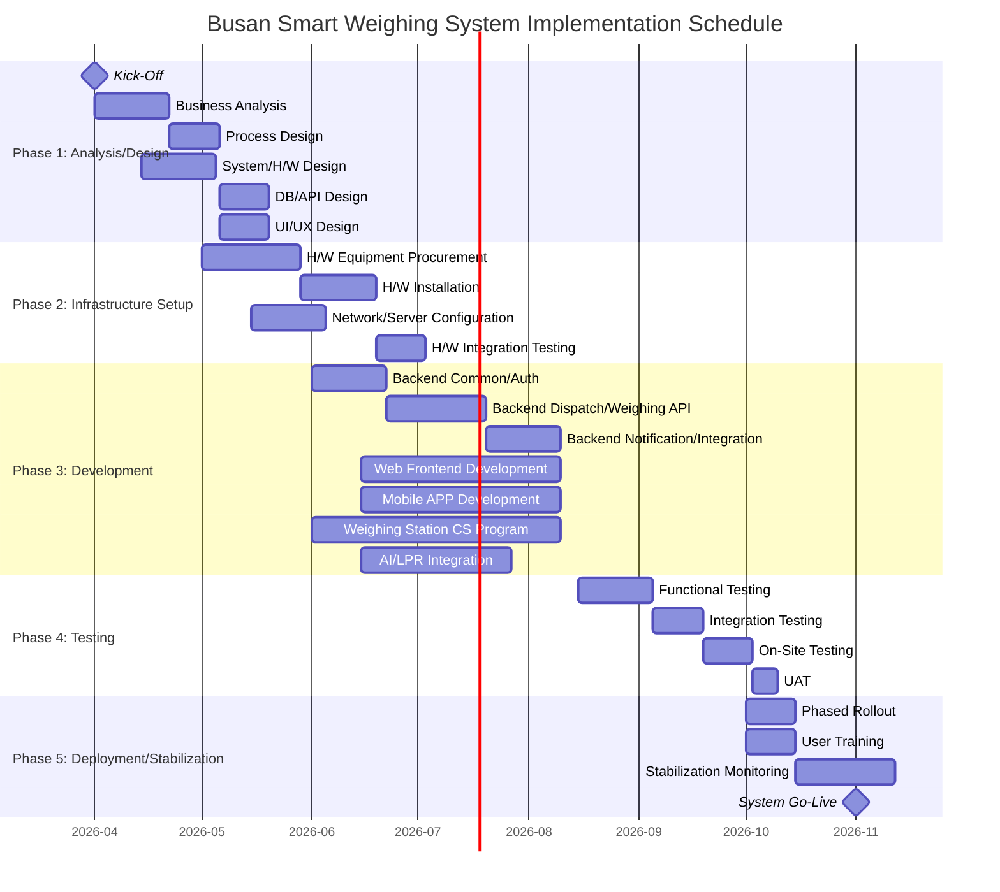

# Busan Smart Weighing System WBS (Work Breakdown Structure)

**Version**: 1.0
**Date**: 2026-01-27
**Base Documents**: PRD-20260127-154446, TRD-20260127-155235
**Status**: Draft

---

## Project Summary

| Item | Value |
|------|-------|
| Total Duration | 32 weeks (8 months: Apr 2026 ~ Nov 2026) |
| Total Effort | 498 Man-Days (24.9 Man-Months) |
| Total Effort (incl. buffer) | 598 Man-Days (29.9 Man-Months) |
| Team Size | 9 members (6 full-time + 3 part-time) |
| Methodology | Hybrid (Waterfall-based + Agile development sprints) |
| Sprint Cycle | 2 weeks |
| Buffer Ratio | 20% |
| Development Review Meeting | Monthly (PMO/Dev Team) |

---

## 1. Project Phases



### Phase 1: Analysis and Design (2026.04.01 ~ 2026.05.31, 9 weeks)
- **Duration**: 9 weeks
- **Objective**: Analyze smart weighing processes, complete system/H/W design, finalize DB/API/UI design
- **Deliverables**: Business analysis document, process design document, H/W configuration design, DB design (ERD), API specification, UI/UX wireframes

### Phase 2: Infrastructure Setup (2026.05.01 ~ 2026.07.15, 11 weeks)
- **Duration**: 11 weeks (partially overlapping with Phase 1)
- **Objective**: Install H/W equipment, configure server/network, verify H/W integration
- **Deliverables**: H/W installation completion report, network topology diagram, server environment setup, H/W integration test results

### Phase 3: Software Development (2026.06.01 ~ 2026.09.15, 15 weeks)
- **Duration**: 15 weeks
- **Objective**: Complete development of weighing WEB/CS/APP programs
- **Deliverables**: Web management system, mobile API, weighing station CS program, weighing management mobile APP, AI/LPR integration module

### Phase 4: Testing (2026.08.15 ~ 2026.09.30, 7 weeks)
- **Duration**: 7 weeks (overlapping with latter part of Phase 3)
- **Objective**: Complete functional/integration/on-site testing and UAT
- **Deliverables**: Test plan, test result report, defect report, UAT sign-off

### Phase 5: Deployment and Stabilization (2026.10.01 ~ 2026.11.30, 9 weeks)
- **Duration**: 9 weeks
- **Objective**: System deployment, user training, stabilization operations, system go-live
- **Deliverables**: Deployment result report, training materials, stabilization monitoring report, system go-live report

---

## 2. Work Packages

### WP-1: Project Management
| ID | Task | Assigned Role | Est. Effort | Predecessor | Priority |
|----|------|---------------|-------------|-------------|----------|
| WP-1.1 | Kick-Off and project plan development | PM/PL | 5MD | - | HIGH |
| WP-1.2 | Monthly review meetings (8 sessions) | PM/PL | 8MD | WP-1.1 | HIGH |
| WP-1.3 | Stakeholder communication | PM/PL | 10MD | WP-1.1 | HIGH |
| WP-1.4 | Risk management and issue tracking | PM/PL | 8MD | WP-1.1 | HIGH |
| WP-1.5 | Quality management (deliverable review/approval) | PM/PL | 5MD | WP-1.1 | MEDIUM |
| WP-1.6 | Project closure report | PM/PL | 3MD | - | HIGH |

**Subtotal**: 39 Man-Days

---

### WP-2: Analysis and Design
| ID | Task | Assigned Role | Est. Effort | Predecessor | Priority |
|----|------|---------------|-------------|-------------|----------|
| WP-2.1 | Current weighing process analysis | BA/PM | 5MD | WP-1.1 | HIGH |
| WP-2.2 | Process design by item type (by-products/waste/sub-materials/outbound/general) | BA/PM | 8MD | WP-2.1 | HIGH |
| WP-2.3 | H/W configuration design (LPR, sensors, display board, barrier) | Infra | 5MD | WP-2.1 | HIGH |
| WP-2.4 | DB design (ERD, tables, indexes) | Backend | 5MD | WP-2.2 | HIGH |
| WP-2.5 | API design (specification, authentication/authorization design) | Backend | 5MD | WP-2.4 | HIGH |
| WP-2.6 | System architecture design | Backend/Infra | 3MD | WP-2.1 | HIGH |
| WP-2.7 | UI/UX design (web wireframes) | Designer | 8MD | WP-2.2 | HIGH |
| WP-2.8 | UI/UX design (mobile wireframes) | Designer | 6MD | WP-2.2 | HIGH |
| WP-2.9 | Data migration design | BA/Backend | 3MD | WP-2.4 | MEDIUM |
| WP-2.10 | Design review and approval | PM/Business | 2MD | WP-2.5, WP-2.7 | HIGH |

**Subtotal**: 50 Man-Days

---

### WP-3: Infrastructure Setup
| ID | Task | Assigned Role | Est. Effort | Predecessor | Priority |
|----|------|---------------|-------------|-------------|----------|
| WP-3.1 | H/W equipment procurement and delivery management | Infra/PM | 5MD | WP-2.3 | HIGH |
| WP-3.2 | LPR equipment installation and construction | Infra/Vendor | 8MD | WP-3.1 | HIGH |
| WP-3.3 | Display board/barrier/sensor installation | Infra/Vendor | 5MD | WP-3.1 | HIGH |
| WP-3.4 | Intercom installation (master/slave units) | Infra/Vendor | 2MD | WP-3.1 | MEDIUM |
| WP-3.5 | Server environment setup (Dev/Staging/Production) | Infra | 5MD | WP-2.6 | HIGH |
| WP-3.6 | DB server setup (PostgreSQL Primary + Standby) | Infra/DBA | 3MD | WP-3.5 | HIGH |
| WP-3.7 | Redis server setup | Infra | 2MD | WP-3.5 | HIGH |
| WP-3.8 | Nginx/Docker/CI/CD configuration | Infra | 5MD | WP-3.5 | HIGH |
| WP-3.9 | Network/VPN configuration (weighing station <-> server) | Infra | 3MD | WP-3.5 | HIGH |
| WP-3.10 | Monitoring environment setup (Prometheus/Grafana/ELK) | Infra | 5MD | WP-3.5 | MEDIUM |
| WP-3.11 | H/W integration testing (LPR, sensors, display board, barrier) | Infra/CS Dev | 5MD | WP-3.2, WP-3.3 | HIGH |

**Subtotal**: 48 Man-Days

---

### WP-4: Backend Development (Spring Boot)
| ID | Task | Assigned Role | Est. Effort | Predecessor | Priority |
|----|------|---------------|-------------|-------------|----------|
| WP-4.1 | Project setup (Spring Boot, common modules) | Backend | 3MD | WP-3.5 | HIGH |
| WP-4.2 | DB schema creation and migration | Backend | 3MD | WP-2.4, WP-3.6 | HIGH |
| WP-4.3 | Authentication/authorization module (JWT, RBAC, OTP) | Backend | 8MD | WP-4.1 | HIGH |
| WP-4.4 | Dispatch management API (CRUD, status management) | Backend | 8MD | WP-4.2 | HIGH |
| WP-4.5 | Weighing management API (start/complete/re-weigh) | Backend | 10MD | WP-4.4 | HIGH |
| WP-4.6 | LPR/AI integration API (license plate recognition) | Backend | 8MD | WP-4.5 | HIGH |
| WP-4.7 | OTP generation/verification API | Backend | 5MD | WP-4.3 | HIGH |
| WP-4.8 | Electronic weighing slip API (create, query, share) | Backend | 5MD | WP-4.5 | HIGH |
| WP-4.9 | Notification service (Push, KakaoTalk, SMS) | Backend | 8MD | WP-4.5 | MEDIUM |
| WP-4.10 | Master data management API (carriers, vehicles, codes) | Backend | 5MD | WP-4.2 | HIGH |
| WP-4.11 | Gate pass management API | Backend | 3MD | WP-4.5 | MEDIUM |
| WP-4.12 | WebSocket real-time weighing status | Backend | 5MD | WP-4.5 | HIGH |
| WP-4.13 | Kakao API/SMS integration (weighing slip sharing) | Backend | 5MD | WP-4.8 | MEDIUM |
| WP-4.14 | Statistics/dashboard API | Backend | 5MD | WP-4.5 | MEDIUM |
| WP-4.15 | Data migration development | Backend/BA | 5MD | WP-2.9, WP-4.2 | MEDIUM |
| WP-4.16 | Backend unit testing | Backend | 8MD | WP-4.5 | HIGH |

**Subtotal**: 94 Man-Days

---

### WP-5: Web Frontend Development (React)
| ID | Task | Assigned Role | Est. Effort | Predecessor | Priority |
|----|------|---------------|-------------|-------------|----------|
| WP-5.1 | Project setup (React + Vite + TypeScript) | Frontend | 2MD | WP-3.8 | HIGH |
| WP-5.2 | Common layout/components (Ant Design) | Frontend | 5MD | WP-5.1 | HIGH |
| WP-5.3 | Login/authentication screens | Frontend | 3MD | WP-5.2, WP-4.3 | HIGH |
| WP-5.4 | Dispatch management screens (register/query/edit) | Frontend | 8MD | WP-5.2, WP-4.4 | HIGH |
| WP-5.5 | Weighing management screens (status/query/detail) | Frontend | 8MD | WP-5.2, WP-4.5 | HIGH |
| WP-5.6 | Real-time weighing dashboard (WebSocket + ECharts) | Frontend | 8MD | WP-5.5, WP-4.12 | HIGH |
| WP-5.7 | Master data management screens (carriers/vehicles/codes) | Frontend | 5MD | WP-5.2, WP-4.10 | MEDIUM |
| WP-5.8 | Gate pass management screens | Frontend | 3MD | WP-5.2, WP-4.11 | MEDIUM |
| WP-5.9 | Statistics/report screens | Frontend | 5MD | WP-5.2, WP-4.14 | MEDIUM |
| WP-5.10 | Frontend unit/integration testing | Frontend | 5MD | WP-5.6 | HIGH |

**Subtotal**: 52 Man-Days

---

### WP-6: Mobile APP Development (Flutter)
| ID | Task | Assigned Role | Est. Effort | Predecessor | Priority |
|----|------|---------------|-------------|-------------|----------|
| WP-6.1 | Project setup (Flutter + Riverpod) | Mobile | 2MD | WP-3.8 | HIGH |
| WP-6.2 | Login screen (staff/driver, secure login) | Mobile | 5MD | WP-6.1, WP-4.3 | HIGH |
| WP-6.3 | Dispatch inquiry screen (dispatch status, multi-dispatch selection) | Mobile | 5MD | WP-6.2, WP-4.4 | HIGH |
| WP-6.4 | Weighing progress screen (mobile weighing) | Mobile | 8MD | WP-6.3, WP-4.5 | HIGH |
| WP-6.5 | Mobile OTP screen (OTP input, secure weighing) | Mobile | 5MD | WP-6.4, WP-4.7 | HIGH |
| WP-6.6 | Electronic weighing slip screen (query, share) | Mobile | 5MD | WP-6.4, WP-4.8 | HIGH |
| WP-6.7 | Dispatch performance inquiry screen (monthly/daily, period selection) | Mobile | 5MD | WP-6.3 | MEDIUM |
| WP-6.8 | Notices/inquiry call feature | Mobile | 3MD | WP-6.2 | MEDIUM |
| WP-6.9 | Push notification integration (FCM) | Mobile | 3MD | WP-6.1, WP-4.9 | HIGH |
| WP-6.10 | KakaoTalk/SMS sharing integration | Mobile | 3MD | WP-6.6, WP-4.13 | MEDIUM |
| WP-6.11 | Offline caching (Hive) | Mobile | 3MD | WP-6.4 | MEDIUM |
| WP-6.12 | Mobile unit/integration testing | Mobile | 5MD | WP-6.6 | HIGH |

**Subtotal**: 52 Man-Days

---

### WP-7: Weighing Station CS Program Development (C# .NET)
| ID | Task | Assigned Role | Est. Effort | Predecessor | Priority |
|----|------|---------------|-------------|-------------|----------|
| WP-7.1 | Project setup (C# .NET, WinForms/WPF) | CS Dev | 2MD | - | HIGH |
| WP-7.2 | RS-232C indicator communication module | CS Dev | 8MD | WP-7.1 | HIGH |
| WP-7.3 | LPR camera integration module (TCP/UDP) | CS Dev | 8MD | WP-7.1, WP-3.11 | HIGH |
| WP-7.4 | LiDAR/radar sensor integration | CS Dev | 5MD | WP-7.1, WP-3.11 | HIGH |
| WP-7.5 | Vehicle detector integration | CS Dev | 3MD | WP-7.1, WP-3.11 | HIGH |
| WP-7.6 | Display board control module (OTP display) | CS Dev | 5MD | WP-7.1, WP-3.11 | HIGH |
| WP-7.7 | Automatic barrier control module | CS Dev | 3MD | WP-7.1, WP-3.11 | HIGH |
| WP-7.8 | Weighing main screen (touchscreen UI) | CS Dev | 8MD | WP-7.2 | HIGH |
| WP-7.9 | LPR automatic weighing process | CS Dev | 8MD | WP-7.3, WP-7.8, WP-4.6 | HIGH |
| WP-7.10 | Mobile OTP weighing process | CS Dev | 5MD | WP-7.6, WP-7.8, WP-4.7 | HIGH |
| WP-7.11 | Manual weighing process (legacy mode) | CS Dev | 3MD | WP-7.8 | HIGH |
| WP-7.12 | Reset/re-weigh functionality | CS Dev | 3MD | WP-7.8 | HIGH |
| WP-7.13 | API server integration (weighing data sync, dispatch query) | CS Dev | 5MD | WP-7.8, WP-4.5 | HIGH |
| WP-7.14 | Local caching/offline mode | CS Dev | 5MD | WP-7.13 | MEDIUM |
| WP-7.15 | CS program testing | CS Dev | 5MD | WP-7.9, WP-7.10 | HIGH |

**Subtotal**: 76 Man-Days

---

### WP-8: Testing
| ID | Task | Assigned Role | Est. Effort | Predecessor | Priority |
|----|------|---------------|-------------|-------------|----------|
| WP-8.1 | Test plan development | QA | 3MD | WP-2.10 | HIGH |
| WP-8.2 | Functional testing (web) | QA/Frontend | 5MD | WP-5.10 | HIGH |
| WP-8.3 | Functional testing (mobile APP) | QA/Mobile | 5MD | WP-6.12 | HIGH |
| WP-8.4 | Functional testing (CS program) | QA/CS Dev | 5MD | WP-7.15 | HIGH |
| WP-8.5 | API integration testing | QA/Backend | 5MD | WP-4.16 | HIGH |
| WP-8.6 | E2E integration testing (full process) | QA/All | 8MD | WP-8.2~WP-8.5 | HIGH |
| WP-8.7 | On-site testing (live vehicle testing at weighing station) | QA/Infra/Business | 8MD | WP-8.6 | HIGH |
| WP-8.8 | Performance testing (LPR recognition rate, API response) | QA/Infra | 5MD | WP-8.6 | HIGH |
| WP-8.9 | Security testing (OTP, authentication, vulnerability) | QA/Backend | 3MD | WP-8.6 | HIGH |
| WP-8.10 | UAT (User Acceptance Testing) | PM/Business | 5MD | WP-8.7 | HIGH |
| WP-8.11 | Defect resolution and re-testing | All Dev Team | 10MD | WP-8.7 | HIGH |

**Subtotal**: 62 Man-Days

---

### WP-9: Deployment and Stabilization
| ID | Task | Assigned Role | Est. Effort | Predecessor | Priority |
|----|------|---------------|-------------|-------------|----------|
| WP-9.1 | Data migration execution | Backend/BA | 5MD | WP-4.15, WP-8.10 | HIGH |
| WP-9.2 | Phased system rollout (sequential by item type) | All Team | 8MD | WP-9.1 | HIGH |
| WP-9.3 | User training material development | PM/BA | 5MD | WP-8.10 | HIGH |
| WP-9.4 | User classroom training (drivers/carriers/operators) | PM/BA | 5MD | WP-9.3 | HIGH |
| WP-9.5 | Stabilization monitoring (1 month) | All Team | 15MD | WP-9.2 | HIGH |
| WP-9.6 | Stabilization period defect response | All Dev Team | 10MD | WP-9.2 | HIGH |
| WP-9.7 | Operations handover (manuals, operations guide) | PM/Infra | 5MD | WP-9.5 | HIGH |
| WP-9.8 | System go-live and project closure | PM/PL | 2MD | WP-9.7 | HIGH |

**Subtotal**: 55 Man-Days

---

## 3. Detailed Task List

### 3.1 Phase 1: Analysis/Design Phase (W1~W9)

| ID | Task | Description | Assigned | Effort | Start | End | Dependencies |
|----|------|-------------|----------|--------|-------|-----|--------------|
| T-001 | Kick-Off and project planning | Project initiation, team formation, schedule confirmation | PM/PL | 5MD | W1 | W1 | - |
| T-002 | Current weighing process analysis | AS-IS business analysis, site visits, stakeholder interviews | BA/PM | 5MD | W1 | W3 | T-001 |
| T-003 | Process design by item type | By-products/waste/sub-materials/outbound/general TO-BE processes | BA/PM | 8MD | W3 | W5 | T-002 |
| T-004 | H/W configuration design | LPR, sensors, display board, barrier, intercom configuration design | Infra | 5MD | W2 | W4 | T-002 |
| T-005 | System architecture design | Overall system topology, communication methods, server configuration | Backend/Infra | 3MD | W3 | W4 | T-002 |
| T-006 | DB design | ERD, table specifications, index strategy (13 tables) | Backend | 5MD | W5 | W6 | T-003 |
| T-007 | API design | API specification (30+ endpoints, 10 domains) | Backend | 5MD | W6 | W7 | T-006 |
| T-008 | Web UI/UX design | Web wireframes (dispatch, weighing, master data, gate pass, dashboard) | Designer | 8MD | W5 | W7 | T-003 |
| T-009 | Mobile UI/UX design | Mobile APP wireframes (login, dispatch, weighing, OTP, weighing slip) | Designer | 6MD | W5 | W7 | T-003 |
| T-010 | Data migration design | Legacy system data analysis, mapping design | BA/Backend | 3MD | W7 | W8 | T-006 |
| T-011 | Design review and approval | Full design document PMO/business review and approval | PM/Business | 2MD | W8 | W9 | T-007, T-008 |

### 3.2 Phase 2: Infrastructure Setup Phase (W5~W15)

| ID | Task | Description | Assigned | Effort | Start | End | Dependencies |
|----|------|-------------|----------|--------|-------|-----|--------------|
| T-101 | H/W equipment procurement/delivery | LPR, display board, barrier, sensor, intercom ordering and delivery management | Infra/PM | 5MD | W5 | W8 | T-004 |
| T-102 | LPR equipment installation | LPR camera installation, electrical/communication construction | Infra/Vendor | 8MD | W9 | W12 | T-101 |
| T-103 | Display board/barrier/sensor installation | Large display board, automatic barrier, radar sensor, vehicle detector installation | Infra/Vendor | 5MD | W9 | W11 | T-101 |
| T-104 | Intercom installation | Intercom master/slave unit installation (1 each) | Infra/Vendor | 2MD | W9 | W10 | T-101 |
| T-105 | Server environment setup | Dev/Staging/Production servers, Docker environment | Infra | 5MD | W6 | W8 | T-005 |
| T-106 | DB server setup | PostgreSQL Primary+Standby, initial schema deployment | Infra/DBA | 3MD | W8 | W9 | T-105 |
| T-107 | Redis server setup | Redis installation, OTP/cache/session configuration | Infra | 2MD | W8 | W9 | T-105 |
| T-108 | Nginx/Docker/CI/CD configuration | Reverse Proxy, SSL, Jenkins pipeline | Infra | 5MD | W8 | W10 | T-105 |
| T-109 | Network/VPN configuration | Weighing station <-> server VPN, firewall, port configuration | Infra | 3MD | W7 | W9 | T-105 |
| T-110 | Monitoring environment setup | Prometheus, Grafana, ELK Stack installation and configuration | Infra | 5MD | W10 | W12 | T-105 |
| T-111 | H/W integration testing | LPR, sensor, display board, barrier device communication testing | Infra/CS Dev | 5MD | W13 | W15 | T-102, T-103 |

### 3.3 Phase 3: Development Phase (W9~W24)

| ID | Task | Description | Assigned | Effort | Start | End | Dependencies |
|----|------|-------------|----------|--------|-------|-----|--------------|
| T-201 | Backend project setup | Spring Boot 3.2, common modules, package structure | Backend | 3MD | W9 | W9 | T-105 |
| T-202 | DB schema creation/migration | JPA Entity, Flyway migration | Backend | 3MD | W9 | W10 | T-006, T-106 |
| T-203 | Authentication/authorization module | JWT, Spring Security, RBAC, OTP logic | Backend | 8MD | W10 | W12 | T-201 |
| T-204 | Dispatch management API | Dispatch CRUD, status management, search | Backend | 8MD | W10 | W13 | T-202 |
| T-205 | Weighing management API | Weighing start/complete/re-weigh, status management | Backend | 10MD | W13 | W16 | T-204 |
| T-206 | LPR/AI integration API | AI vehicle recognition engine HTTP integration, confidence scoring | Backend | 8MD | W14 | W17 | T-205 |
| T-207 | OTP generation/verification API | Redis TTL-based OTP, display board integration | Backend | 5MD | W12 | W14 | T-203 |
| T-208 | Electronic weighing slip API | Weighing slip creation, query, sharing | Backend | 5MD | W16 | W18 | T-205 |
| T-209 | Notification service | FCM Push, KakaoTalk notification, SMS delivery | Backend | 8MD | W17 | W20 | T-205 |
| T-210 | Master data management API | Carriers, vehicles, common codes, weighing station management | Backend | 5MD | W10 | W12 | T-202 |
| T-211 | Gate pass management API | Gate pass processing, status management | Backend | 3MD | W16 | W17 | T-205 |
| T-212 | WebSocket real-time weighing | STOMP-based real-time weighing status transmission | Backend | 5MD | W17 | W19 | T-205 |
| T-213 | Kakao/SMS integration | Kakao Biz API, SMS Gateway integration | Backend | 5MD | W18 | W20 | T-208 |
| T-214 | Statistics/dashboard API | Daily/monthly/item-based weighing statistics | Backend | 5MD | W18 | W20 | T-205 |
| T-215 | Data migration development | ETL scripts, validation logic | Backend/BA | 5MD | W18 | W20 | T-010, T-202 |
| T-216 | Backend unit testing | JUnit, Mockito-based unit tests | Backend | 8MD | W20 | W22 | T-205 |
| T-301 | Web project setup | React + Vite + TypeScript + Ant Design | Frontend | 2MD | W10 | W10 | T-108 |
| T-302 | Common layout/components | GNB, menus, common table, form, chart components | Frontend | 5MD | W10 | W12 | T-301 |
| T-303 | Login/authentication screens | Login page, token management, permission-based routing | Frontend | 3MD | W12 | W13 | T-302, T-203 |
| T-304 | Dispatch management screens | Dispatch registration/query/edit, data tables | Frontend | 8MD | W13 | W16 | T-302, T-204 |
| T-305 | Weighing management screens | Weighing status/query/detail, status display | Frontend | 8MD | W15 | W19 | T-302, T-205 |
| T-306 | Real-time weighing dashboard | WebSocket + ECharts dashboard | Frontend | 8MD | W19 | W22 | T-305, T-212 |
| T-307 | Master data management screens | Carrier/vehicle/code management | Frontend | 5MD | W14 | W16 | T-302, T-210 |
| T-308 | Gate pass management screens | Gate pass list/processing | Frontend | 3MD | W17 | W18 | T-302, T-211 |
| T-309 | Statistics/report screens | Period-based statistics, charts, Excel export | Frontend | 5MD | W20 | W22 | T-302, T-214 |
| T-310 | Web frontend testing | Vitest, React Testing Library | Frontend | 5MD | W22 | W24 | T-306 |
| T-401 | Mobile project setup | Flutter + Riverpod + Hive | Mobile | 2MD | W10 | W10 | T-108 |
| T-402 | Login screen | Staff/driver distinction, secure login, verification code | Mobile | 5MD | W10 | W12 | T-401, T-203 |
| T-403 | Dispatch inquiry screen | Dispatch order status, multi-dispatch selection | Mobile | 5MD | W12 | W14 | T-402, T-204 |
| T-404 | Weighing progress screen | Mobile weighing process | Mobile | 8MD | W14 | W18 | T-403, T-205 |
| T-405 | Mobile OTP screen | OTP input, security authentication, mobile weighing | Mobile | 5MD | W16 | W18 | T-404, T-207 |
| T-406 | Electronic weighing slip screen | Weighing slip query, detail view | Mobile | 5MD | W18 | W20 | T-404, T-208 |
| T-407 | Dispatch performance inquiry screen | Monthly/daily performance, period selection | Mobile | 5MD | W16 | W18 | T-403 |
| T-408 | Notices/inquiry call feature | Notices display, inquiry type-based phone connection | Mobile | 3MD | W14 | W15 | T-402 |
| T-409 | Push notification integration | FCM token registration, notification receive/display | Mobile | 3MD | W18 | W19 | T-401, T-209 |
| T-410 | KakaoTalk/SMS sharing | Electronic weighing slip external sharing | Mobile | 3MD | W20 | W21 | T-406, T-213 |
| T-411 | Offline caching | Hive-based local data caching | Mobile | 3MD | W18 | W19 | T-404 |
| T-412 | Mobile testing | iOS/Android functional testing, device compatibility | Mobile | 5MD | W21 | W23 | T-406 |
| T-501 | CS project setup | C# .NET, WinForms/WPF, project structure | CS Dev | 2MD | W9 | W9 | - |
| T-502 | RS-232C indicator communication | Serial port communication, weight value reception/stabilization detection | CS Dev | 8MD | W9 | W12 | T-501 |
| T-503 | LPR camera integration | TCP/UDP communication, license plate number reception | CS Dev | 8MD | W10 | W14 | T-501, T-111 |
| T-504 | LiDAR/radar sensor integration | Sensor data reception, vehicle entry detection | CS Dev | 5MD | W12 | W14 | T-501, T-111 |
| T-505 | Vehicle detector integration | Vehicle positioning confirmation sensor | CS Dev | 3MD | W12 | W13 | T-501, T-111 |
| T-506 | Display board control | OTP number display, guidance message output | CS Dev | 5MD | W14 | W16 | T-501, T-111 |
| T-507 | Automatic barrier control | Open/close control, manual switch integration | CS Dev | 3MD | W14 | W15 | T-501, T-111 |
| T-508 | Weighing main screen | Touchscreen UI, weight display, status display | CS Dev | 8MD | W13 | W16 | T-502 |
| T-509 | LPR automatic weighing process | LiDAR -> LPR -> AI -> auto weighing -> data save full process | CS Dev | 8MD | W16 | W19 | T-503, T-508, T-206 |
| T-510 | Mobile OTP weighing process | Misrecognition -> display board OTP -> mobile auth -> weighing | CS Dev | 5MD | W18 | W20 | T-506, T-508, T-207 |
| T-511 | Manual weighing process | Legacy touchscreen mode parallel operation | CS Dev | 3MD | W16 | W17 | T-508 |
| T-512 | Reset/re-weigh functionality | Weighing data reset, re-weigh process | CS Dev | 3MD | W17 | W18 | T-508 |
| T-513 | API server integration | Weighing data transmission, dispatch info query, authentication | CS Dev | 5MD | W18 | W20 | T-508, T-205 |
| T-514 | Local caching/offline mode | Local storage on network disconnection, sync on recovery | CS Dev | 5MD | W20 | W22 | T-513 |
| T-515 | CS program testing | Equipment integration testing, process testing | CS Dev | 5MD | W22 | W24 | T-509, T-510 |

### 3.4 Phase 4: Testing Phase (W20~W26)

| ID | Task | Description | Assigned | Effort | Start | End | Dependencies |
|----|------|-------------|----------|--------|-------|-----|--------------|
| T-601 | Test plan development | Test strategy, scenarios, environment preparation | QA | 3MD | W14 | W15 | T-011 |
| T-602 | Web functional testing | Dispatch/weighing/master data/gate pass/dashboard verification | QA/Frontend | 5MD | W22 | W23 | T-310 |
| T-603 | Mobile APP functional testing | Login/dispatch/weighing/OTP/slip/performance query verification | QA/Mobile | 5MD | W22 | W23 | T-412 |
| T-604 | CS program functional testing | LPR/manual/mobile weighing, H/W integration verification | QA/CS Dev | 5MD | W22 | W23 | T-515 |
| T-605 | API integration testing | Full API endpoint integration verification | QA/Backend | 5MD | W22 | W23 | T-216 |
| T-606 | E2E integration testing | Vehicle entry -> LPR -> AI -> weighing -> slip -> Push full flow | QA/All | 8MD | W23 | W25 | T-602~T-605 |
| T-607 | On-site testing | Live vehicle testing at weighing station, business participation | QA/Infra/Business | 8MD | W24 | W26 | T-606 |
| T-608 | Performance testing | LPR recognition rate, API p95, concurrent users | QA/Infra | 5MD | W24 | W25 | T-606 |
| T-609 | Security testing | OTP security, authentication bypass, vulnerability assessment | QA/Backend | 3MD | W24 | W25 | T-606 |
| T-610 | UAT | User (drivers/carriers/operators) acceptance testing | PM/Business | 5MD | W26 | W27 | T-607 |
| T-611 | Defect resolution/re-testing | Fix discovered defects and re-verify | All Dev Team | 10MD | W24 | W27 | T-607 |

### 3.5 Phase 5: Deployment/Stabilization Phase (W27~W35)

| ID | Task | Description | Assigned | Effort | Start | End | Dependencies |
|----|------|-------------|----------|--------|-------|-----|--------------|
| T-701 | Data migration execution | Legacy system data transfer, verification | Backend/BA | 5MD | W27 | W28 | T-215, T-610 |
| T-702 | Phased system rollout | Sequential rollout by item type (by-products -> waste -> sub-materials -> outbound -> general) | All Team | 8MD | W28 | W30 | T-701 |
| T-703 | User training material development | Web/mobile/CS user manuals, training presentations | PM/BA | 5MD | W27 | W28 | T-610 |
| T-704 | User classroom training | Training for drivers, carriers, weighing operators | PM/BA | 5MD | W28 | W30 | T-703 |
| T-705 | Stabilization monitoring | System monitoring, issue tracking, performance analysis (4 weeks) | All Team | 15MD | W30 | W34 | T-702 |
| T-706 | Stabilization defect response | Immediate response to defects found during operations | All Dev Team | 10MD | W30 | W34 | T-702 |
| T-707 | Operations handover | Operations manual, operations guide, incident response procedures | PM/Infra | 5MD | W33 | W34 | T-705 |
| T-708 | System go-live/project closure | System go-live, project closure report | PM/PL | 2MD | W35 | W35 | T-707 |

---

## 4. Critical Path

The task path with the greatest impact on the project schedule:

```
T-001 → T-002 → T-003 → T-006 → T-202 → T-204 → T-205 → T-509 → T-606 → T-607 → T-610 → T-701 → T-702 → T-705 → T-708
(PM)    (Analysis)(Design) (DB)    (Schema) (Dispatch)(Weighing)(LPR Auto)(E2E)  (On-Site)(UAT)  (Migration)(Rollout)(Stabilize)(Go-Live)
```

| Phase | Task ID | Task | Effort | Cumulative |
|-------|---------|------|--------|------------|
| 1 | T-001 | Kick-Off and project planning | 5MD | 5MD |
| 2 | T-002 | Current weighing process analysis | 5MD | 10MD |
| 3 | T-003 | Process design by item type | 8MD | 18MD |
| 4 | T-006 | DB design | 5MD | 23MD |
| 5 | T-202 | DB schema creation/migration | 3MD | 26MD |
| 6 | T-204 | Dispatch management API | 8MD | 34MD |
| 7 | T-205 | Weighing management API | 10MD | 44MD |
| 8 | T-509 | LPR automatic weighing process (CS) | 8MD | 52MD |
| 9 | T-606 | E2E integration testing | 8MD | 60MD |
| 10 | T-607 | On-site testing | 8MD | 68MD |
| 11 | T-610 | UAT | 5MD | 73MD |
| 12 | T-701 | Data migration execution | 5MD | 78MD |
| 13 | T-702 | Phased system rollout | 8MD | 86MD |
| 14 | T-705 | Stabilization monitoring | 15MD | 101MD |
| 15 | T-708 | System go-live | 2MD | 103MD |

**Total Critical Path Length**: 103 Man-Days

> Delays on critical path tasks directly impact the overall project schedule. In particular, **Weighing Management API (T-205)**, **LPR Automatic Weighing Process (T-509)**, **On-Site Testing (T-607)**, and **Stabilization Monitoring (T-705)** are the longest individual tasks and require focused management attention.

---

## 5. Resource Allocation

### 5.1 Role-Based Staffing Plan

| Role | Headcount | Primary Tasks | Effort | Utilization |
|------|-----------|---------------|--------|-------------|
| PM/PL | 1 | Project management, stakeholder communication, review meetings, UAT | 39MD | 100% (entire duration) |
| BA (Business Analyst) | 1 | Current state analysis, process design, migration, training | 34MD | 100% (Phase 1, 5), 50% (Phase 3, 4) |
| Backend Developer | 2 | Spring Boot API, DB, WebSocket, external integrations | 94MD | 100% (Phase 2~4) |
| Frontend Developer | 1 | React web system development, UI/UX implementation | 52MD | 100% (Phase 3~4) |
| Mobile Developer | 1 | Flutter APP development, Push/sharing integration | 52MD | 100% (Phase 3~4) |
| CS Developer | 1 | C# weighing station program, H/W integration | 76MD | 100% (Phase 2~4) |
| Infrastructure Engineer | 1 | H/W installation, server/network, CI/CD, monitoring | 48MD | 100% (Phase 2), 50% (Phase 1, 3, 4, 5) |
| QA Engineer | 0.5 | Test planning/execution, defect management | 62MD | 100% (Phase 4), 30% (Phase 3) |
| UI/UX Designer | 0.5 | Web/mobile wireframes, design guide | 14MD | 100% (Phase 1), - (thereafter) |

### 5.2 Weekly Staffing Overview

| Week | PM/PL | BA | Backend(2) | Frontend | Mobile | CS | Infra | QA | Design |
|------|-------|----|------------|----------|--------|----|-------|----|--------|
| W1~W4 (Analysis) | ● | ● | ○ | - | - | - | ○ | - | ● |
| W5~W8 (Design) | ● | ● | ● | - | - | - | ● | - | ● |
| W9~W12 (Infra/Dev Start) | ● | ○ | ●● | ● | ● | ● | ● | - | - |
| W13~W16 (Dev Focus) | ● | ○ | ●● | ● | ● | ● | ○ | ○ | - |
| W17~W20 (Dev Focus) | ● | ○ | ●● | ● | ● | ● | ○ | ○ | - |
| W21~W24 (Dev/Test) | ● | ○ | ●● | ● | ● | ● | ○ | ● | - |
| W25~W27 (Testing) | ● | ○ | ● | ○ | ○ | ○ | ○ | ● | - |
| W28~W30 (Rollout/Training) | ● | ● | ○ | ○ | ○ | ○ | ○ | ○ | - |
| W31~W35 (Stabilization) | ● | ○ | ○ | ○ | ○ | ○ | ○ | ○ | - |

(● Full-time, ○ Part-time, - Not assigned, ●● 2 members full-time)

---

## 6. Effort Summary

### 6.1 Effort by Phase

| Phase | Effort (MD) | Ratio |
|-------|-------------|-------|
| WP-1: Project Management | 39 | 7.8% |
| WP-2: Analysis/Design | 50 | 10.0% |
| WP-3: Infrastructure Setup | 48 | 9.6% |
| WP-4: Backend Development | 94 | 18.9% |
| WP-5: Web Frontend Development | 52 | 10.4% |
| WP-6: Mobile APP Development | 52 | 10.4% |
| WP-7: Weighing Station CS Development | 76 | 15.3% |
| WP-8: Testing | 62 | 12.5% |
| WP-9: Deployment/Stabilization | 55 | 11.0% |
| **Subtotal** | **498** | **100%** |
| Buffer (20%) | 100 | - |
| **Grand Total** | **598** | - |

### 6.2 Effort by Role

| Role | Effort (MD) | Ratio |
|------|-------------|-------|
| PM/PL | 39 | 7.8% |
| BA (Business Analyst) | 34 | 6.8% |
| Backend Developer (2) | 94 | 18.9% |
| Frontend Developer | 52 | 10.4% |
| Mobile Developer | 52 | 10.4% |
| CS Developer | 76 | 15.3% |
| Infrastructure Engineer | 48 | 9.6% |
| QA Engineer | 62 | 12.5% |
| UI/UX Designer | 14 | 2.8% |
| Shared (Defect Resolution/Stabilization) | 27 | 5.4% |
| **Total** | **498** | **100%** |

### 6.3 Man-Month Conversion

- 1 Man-Month = 20 Man-Days (based on 5-day work week)
- **Net Effort**: 498 Man-Days = **24.9 Man-Months**
- **Including Buffer**: 598 Man-Days = **29.9 Man-Months**

---

## 7. Risks and Assumptions

### Assumptions
- Team member utilization rates are maintained as planned (full-time 100%, part-time 50%)
- LPR equipment and AI recognition engine are selected and delivered within the M2 (Infrastructure Setup) period
- Legacy dispatch/weighing system data structure analysis is completed during the analysis phase
- H/W equipment delivery requires 4 weeks after procurement order
- Kakao API and SMS service contracts are completed before development starts
- Active support from business/PMO (monthly review meetings, design approval, UAT participation)
- Development environment (server, DB, CI/CD) is set up before development starts

### Schedule Risks

| Risk | Impact | Mitigation Strategy |
|------|--------|---------------------|
| LPR equipment delivery delay | HIGH | Early procurement, alternative vendor identification, CS development proceeds with simulator |
| AI recognition engine selection delay | HIGH | Accelerate benchmark schedule, evaluate multiple candidates in parallel |
| Legacy system migration complexity exceeds expectations | MEDIUM | Early migration PoC execution, secure parallel operation period |
| Requirements changes | HIGH | Establish change management process, utilize buffer (20%), monthly review meetings |
| H/W integration issues (RS-232C, LPR, sensors) | MEDIUM | Allocate H/W integration testing period, spare equipment, manufacturer technical support |
| Staff attrition | HIGH | Strengthen documentation, knowledge sharing, cross-training, key personnel retention |
| On-site testing environment constraints (live vehicle operation) | MEDIUM | Secure business cooperation schedule in advance, plan for evening/weekend testing |
| Flutter iOS/Android compatibility issues | LOW | CI automated build testing, advance beta testing |

---

## 8. Reference Documents

- Base PRD: `workspace/outputs/prd/PRD-20260127-154446.md`
- Base TRD: `workspace/outputs/trd/TRD-20260127-155235.md`
- Original Input: `workspace/inputs/projects/부산 스마트 계량 시스템 구축 - 수행계획서.pptx`

---
*This document was generated by the WBS auto-generation system.*
