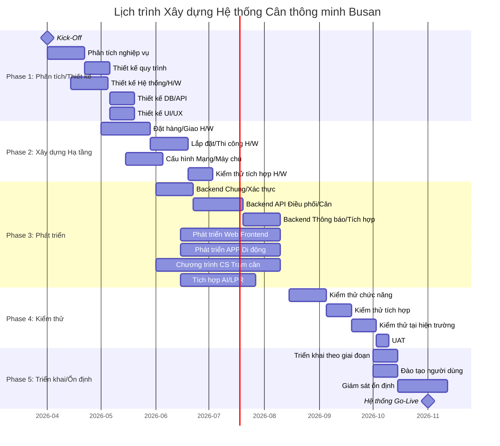

# WBS (Work Breakdown Structure) Xay dựng Hệ thống Cân thông minh Busan

**Phiên bản**: 1.0
**Ngày lập**: 2026-01-27
**Tài liệu cơ sở**: PRD-20260127-154446, TRD-20260127-155235
**Trạng thái**: Draft

---

## Tổng quan Dự án

| Hạng mục | Giá trị |
|----------|---------|
| Tổng thời gian thực hiện | 32 tuần (8 tháng: 04/2026 ~ 11/2026) |
| Tổng công sức | 498 Man-Days (24,9 Man-Months) |
| Tổng công sức (bao gồm dự phòng) | 598 Man-Days (29,9 Man-Months) |
| Quy mô nhóm | 9 người (6 toàn thời gian + 3 bán thời gian) |
| Phương pháp luận | Hybrid (nền tảng Waterfall + Sprint phát triển Agile) |
| Chu kỳ Sprint | 2 tuần |
| Tỷ lệ dự phòng | 20% |
| Họp kiểm tra phát triển | Hàng tháng (PMO/Nhóm phát triển) |

---

## 1. Các Giai đoạn Dự án (Phases)



### Phase 1: Phân tích và Thiết kế (2026.04.01 ~ 2026.05.31, 9 tuần)
- **Thời gian**: 9 tuần
- **Mục tiêu**: Phân tích quy trình cân thông minh, hoàn thành thiết kế hệ thống/H/W, hoàn thiện thiết kế DB/API/UI
- **Sản phẩm bàn giao**: Tài liệu phân tích nghiệp vụ, tài liệu thiết kế quy trình, tài liệu thiết kế cấu hình H/W, thiết kế DB (ERD), đặc tả API, wireframe UI/UX

### Phase 2: Xây dựng Hạ tầng (2026.05.01 ~ 2026.07.15, 11 tuần)
- **Thời gian**: 11 tuần (thực hiện song song một phần với Phase 1)
- **Mục tiêu**: Lắp đặt thiết bị H/W, cấu hình máy chủ/mạng, xác minh tích hợp H/W
- **Sản phẩm bàn giao**: Báo cáo hoàn thành lắp đặt H/W, sơ đồ cấu hình mạng, thiết lập môi trường máy chủ, kết quả kiểm thử tích hợp H/W

### Phase 3: Phát triển Phần mềm (2026.06.01 ~ 2026.09.15, 15 tuần)
- **Thời gian**: 15 tuần
- **Mục tiêu**: Hoàn thành phát triển chương trình cân WEB/CS/APP
- **Sản phẩm bàn giao**: Hệ thống quản lý web, API di động, chương trình CS trạm cân, APP di động quản lý cân, module tích hợp AI/LPR

### Phase 4: Kiểm thử (2026.08.15 ~ 2026.09.30, 7 tuần)
- **Thời gian**: 7 tuần (thực hiện song song với giai đoạn cuối Phase 3)
- **Mục tiêu**: Hoàn thành kiểm thử chức năng/tích hợp/tại hiện trường và UAT
- **Sản phẩm bàn giao**: Kế hoạch kiểm thử, báo cáo kết quả kiểm thử, báo cáo lỗi, biên bản nghiệm thu UAT

### Phase 5: Triển khai và Ổn định (2026.10.01 ~ 2026.11.30, 9 tuần)
- **Thời gian**: 9 tuần
- **Mục tiêu**: Triển khai hệ thống, đào tạo người dùng, vận hành ổn định, Go-Live hệ thống
- **Sản phẩm bàn giao**: Báo cáo kết quả triển khai, tài liệu đào tạo, báo cáo giám sát ổn định, báo cáo Go-Live hệ thống

---

## 2. Gói Công việc (Work Packages)

### WP-1: Quản lý Dự án
| ID | Công việc | Vai trò phụ trách | Công sức dự kiến | Công việc tiên quyết | Ưu tiên |
|----|-----------|-------------------|------------------|---------------------|---------|
| WP-1.1 | Kick-Off và lập kế hoạch dự án | PM/PL | 5MD | - | HIGH |
| WP-1.2 | Họp kiểm tra hàng tháng (8 lần) | PM/PL | 8MD | WP-1.1 | HIGH |
| WP-1.3 | Giao tiếp với các bên liên quan | PM/PL | 10MD | WP-1.1 | HIGH |
| WP-1.4 | Quản lý rủi ro và theo dõi vấn đề | PM/PL | 8MD | WP-1.1 | HIGH |
| WP-1.5 | Quản lý chất lượng (kiểm tra/phê duyệt sản phẩm) | PM/PL | 5MD | WP-1.1 | MEDIUM |
| WP-1.6 | Báo cáo kết thúc dự án | PM/PL | 3MD | - | HIGH |

**Tổng phụ**: 39 Man-Days

---

### WP-2: Phân tích và Thiết kế
| ID | Công việc | Vai trò phụ trách | Công sức dự kiến | Công việc tiên quyết | Ưu tiên |
|----|-----------|-------------------|------------------|---------------------|---------|
| WP-2.1 | Phân tích quy trình cân hiện tại | BA/PM | 5MD | WP-1.1 | HIGH |
| WP-2.2 | Thiết kế quy trình theo loại hàng (phụ phẩm/phế liệu/phụ liệu/xuất kho/thông thường) | BA/PM | 8MD | WP-2.1 | HIGH |
| WP-2.3 | Thiết kế cấu hình H/W (LPR, cảm biến, bảng hiển thị, barrier) | Hạ tầng | 5MD | WP-2.1 | HIGH |
| WP-2.4 | Thiết kế DB (ERD, bảng, chỉ mục) | Backend | 5MD | WP-2.2 | HIGH |
| WP-2.5 | Thiết kế API (đặc tả, thiết kế xác thực/phân quyền) | Backend | 5MD | WP-2.4 | HIGH |
| WP-2.6 | Thiết kế kiến trúc hệ thống | Backend/Hạ tầng | 3MD | WP-2.1 | HIGH |
| WP-2.7 | Thiết kế UI/UX (wireframe web) | Designer | 8MD | WP-2.2 | HIGH |
| WP-2.8 | Thiết kế UI/UX (wireframe di động) | Designer | 6MD | WP-2.2 | HIGH |
| WP-2.9 | Thiết kế di trú dữ liệu | BA/Backend | 3MD | WP-2.4 | MEDIUM |
| WP-2.10 | Xem xét và phê duyệt thiết kế | PM/Nghiệp vụ | 2MD | WP-2.5, WP-2.7 | HIGH |

**Tổng phụ**: 50 Man-Days

---

### WP-3: Xây dựng Hạ tầng
| ID | Công việc | Vai trò phụ trách | Công sức dự kiến | Công việc tiên quyết | Ưu tiên |
|----|-----------|-------------------|------------------|---------------------|---------|
| WP-3.1 | Đặt hàng và quản lý giao thiết bị H/W | Hạ tầng/PM | 5MD | WP-2.3 | HIGH |
| WP-3.2 | Lắp đặt và thi công thiết bị LPR | Hạ tầng/Nhà thầu | 8MD | WP-3.1 | HIGH |
| WP-3.3 | Lắp đặt bảng hiển thị/barrier/cảm biến | Hạ tầng/Nhà thầu | 5MD | WP-3.1 | HIGH |
| WP-3.4 | Lắp đặt intercom (thiết bị chính/phụ) | Hạ tầng/Nhà thầu | 2MD | WP-3.1 | MEDIUM |
| WP-3.5 | Thiết lập môi trường máy chủ (Dev/Staging/Production) | Hạ tầng | 5MD | WP-2.6 | HIGH |
| WP-3.6 | Thiết lập máy chủ DB (PostgreSQL Primary + Standby) | Hạ tầng/DBA | 3MD | WP-3.5 | HIGH |
| WP-3.7 | Thiết lập máy chủ Redis | Hạ tầng | 2MD | WP-3.5 | HIGH |
| WP-3.8 | Cấu hình Nginx/Docker/CI/CD | Hạ tầng | 5MD | WP-3.5 | HIGH |
| WP-3.9 | Cấu hình Mạng/VPN (trạm cân <-> máy chủ) | Hạ tầng | 3MD | WP-3.5 | HIGH |
| WP-3.10 | Thiết lập môi trường giám sát (Prometheus/Grafana/ELK) | Hạ tầng | 5MD | WP-3.5 | MEDIUM |
| WP-3.11 | Kiểm thử tích hợp H/W (LPR, cảm biến, bảng hiển thị, barrier) | Hạ tầng/CS Dev | 5MD | WP-3.2, WP-3.3 | HIGH |

**Tổng phụ**: 48 Man-Days

---

### WP-4: Phát triển Backend (Spring Boot)
| ID | Công việc | Vai trò phụ trách | Công sức dự kiến | Công việc tiên quyết | Ưu tiên |
|----|-----------|-------------------|------------------|---------------------|---------|
| WP-4.1 | Thiết lập dự án (Spring Boot, module chung) | Backend | 3MD | WP-3.5 | HIGH |
| WP-4.2 | Tạo schema DB và di trú | Backend | 3MD | WP-2.4, WP-3.6 | HIGH |
| WP-4.3 | Module xác thực/phân quyền (JWT, RBAC, OTP) | Backend | 8MD | WP-4.1 | HIGH |
| WP-4.4 | API quản lý điều phối (CRUD, quản lý trạng thái) | Backend | 8MD | WP-4.2 | HIGH |
| WP-4.5 | API quản lý cân (bắt đầu/hoàn thành/cân lại) | Backend | 10MD | WP-4.4 | HIGH |
| WP-4.6 | API tích hợp LPR/AI (nhận diện biển số xe) | Backend | 8MD | WP-4.5 | HIGH |
| WP-4.7 | API tạo/xác minh OTP | Backend | 5MD | WP-4.3 | HIGH |
| WP-4.8 | API phiếu cân điện tử (tạo, truy vấn, chia sẻ) | Backend | 5MD | WP-4.5 | HIGH |
| WP-4.9 | Dịch vụ thông báo (Push, KakaoTalk, SMS) | Backend | 8MD | WP-4.5 | MEDIUM |
| WP-4.10 | API quản lý dữ liệu chủ (đơn vị vận chuyển, phương tiện, mã) | Backend | 5MD | WP-4.2 | HIGH |
| WP-4.11 | API quản lý xuất cổng | Backend | 3MD | WP-4.5 | MEDIUM |
| WP-4.12 | WebSocket trạng thái cân thời gian thực | Backend | 5MD | WP-4.5 | HIGH |
| WP-4.13 | Tích hợp Kakao API/SMS (chia sẻ phiếu cân) | Backend | 5MD | WP-4.8 | MEDIUM |
| WP-4.14 | API thống kê/bảng điều khiển | Backend | 5MD | WP-4.5 | MEDIUM |
| WP-4.15 | Phát triển di trú dữ liệu | Backend/BA | 5MD | WP-2.9, WP-4.2 | MEDIUM |
| WP-4.16 | Kiểm thử đơn vị Backend | Backend | 8MD | WP-4.5 | HIGH |

**Tổng phụ**: 94 Man-Days

---

### WP-5: Phát triển Web Frontend (React)
| ID | Công việc | Vai trò phụ trách | Công sức dự kiến | Công việc tiên quyết | Ưu tiên |
|----|-----------|-------------------|------------------|---------------------|---------|
| WP-5.1 | Thiết lập dự án (React + Vite + TypeScript) | Frontend | 2MD | WP-3.8 | HIGH |
| WP-5.2 | Layout/component chung (Ant Design) | Frontend | 5MD | WP-5.1 | HIGH |
| WP-5.3 | Màn hình đăng nhập/xác thực | Frontend | 3MD | WP-5.2, WP-4.3 | HIGH |
| WP-5.4 | Màn hình quản lý điều phối (đăng ký/truy vấn/chỉnh sửa) | Frontend | 8MD | WP-5.2, WP-4.4 | HIGH |
| WP-5.5 | Màn hình quản lý cân (trạng thái/truy vấn/chi tiết) | Frontend | 8MD | WP-5.2, WP-4.5 | HIGH |
| WP-5.6 | Bảng điều khiển cân thời gian thực (WebSocket + ECharts) | Frontend | 8MD | WP-5.5, WP-4.12 | HIGH |
| WP-5.7 | Màn hình quản lý dữ liệu chủ (đơn vị vận chuyển/phương tiện/mã) | Frontend | 5MD | WP-5.2, WP-4.10 | MEDIUM |
| WP-5.8 | Màn hình quản lý xuất cổng | Frontend | 3MD | WP-5.2, WP-4.11 | MEDIUM |
| WP-5.9 | Màn hình thống kê/báo cáo | Frontend | 5MD | WP-5.2, WP-4.14 | MEDIUM |
| WP-5.10 | Kiểm thử đơn vị/tích hợp Frontend | Frontend | 5MD | WP-5.6 | HIGH |

**Tổng phụ**: 52 Man-Days

---

### WP-6: Phát triển APP Di động (Flutter)
| ID | Công việc | Vai trò phụ trách | Công sức dự kiến | Công việc tiên quyết | Ưu tiên |
|----|-----------|-------------------|------------------|---------------------|---------|
| WP-6.1 | Thiết lập dự án (Flutter + Riverpod) | Di động | 2MD | WP-3.8 | HIGH |
| WP-6.2 | Màn hình đăng nhập (nhân viên/tài xế, đăng nhập bảo mật) | Di động | 5MD | WP-6.1, WP-4.3 | HIGH |
| WP-6.3 | Màn hình tra cứu điều phối (trạng thái lệnh điều phối, chọn nhiều lệnh) | Di động | 5MD | WP-6.2, WP-4.4 | HIGH |
| WP-6.4 | Màn hình tiến trình cân (cân trên di động) | Di động | 8MD | WP-6.3, WP-4.5 | HIGH |
| WP-6.5 | Màn hình OTP di động (nhập OTP, cân bảo mật) | Di động | 5MD | WP-6.4, WP-4.7 | HIGH |
| WP-6.6 | Màn hình phiếu cân điện tử (truy vấn, chia sẻ) | Di động | 5MD | WP-6.4, WP-4.8 | HIGH |
| WP-6.7 | Màn hình tra cứu thực tích điều phối (theo tháng/ngày, chọn khoảng thời gian) | Di động | 5MD | WP-6.3 | MEDIUM |
| WP-6.8 | Chức năng thông báo/gọi hỏi đáp | Di động | 3MD | WP-6.2 | MEDIUM |
| WP-6.9 | Tích hợp thông báo Push (FCM) | Di động | 3MD | WP-6.1, WP-4.9 | HIGH |
| WP-6.10 | Tích hợp chia sẻ KakaoTalk/SMS | Di động | 3MD | WP-6.6, WP-4.13 | MEDIUM |
| WP-6.11 | Bộ nhớ đệm offline (Hive) | Di động | 3MD | WP-6.4 | MEDIUM |
| WP-6.12 | Kiểm thử đơn vị/tích hợp di động | Di động | 5MD | WP-6.6 | HIGH |

**Tổng phụ**: 52 Man-Days

---

### WP-7: Phát triển Chương trình CS Trạm cân (C# .NET)
| ID | Công việc | Vai trò phụ trách | Công sức dự kiến | Công việc tiên quyết | Ưu tiên |
|----|-----------|-------------------|------------------|---------------------|---------|
| WP-7.1 | Thiết lập dự án (C# .NET, WinForms/WPF) | CS Dev | 2MD | - | HIGH |
| WP-7.2 | Module giao tiếp đầu cân RS-232C | CS Dev | 8MD | WP-7.1 | HIGH |
| WP-7.3 | Module tích hợp camera LPR (TCP/UDP) | CS Dev | 8MD | WP-7.1, WP-3.11 | HIGH |
| WP-7.4 | Tích hợp cảm biến LiDAR/radar | CS Dev | 5MD | WP-7.1, WP-3.11 | HIGH |
| WP-7.5 | Tích hợp thiết bị phát hiện phương tiện | CS Dev | 3MD | WP-7.1, WP-3.11 | HIGH |
| WP-7.6 | Module điều khiển bảng hiển thị (hiển thị OTP) | CS Dev | 5MD | WP-7.1, WP-3.11 | HIGH |
| WP-7.7 | Module điều khiển barrier tự động | CS Dev | 3MD | WP-7.1, WP-3.11 | HIGH |
| WP-7.8 | Màn hình chính cân (giao diện màn hình cảm ứng) | CS Dev | 8MD | WP-7.2 | HIGH |
| WP-7.9 | Quy trình cân tự động LPR | CS Dev | 8MD | WP-7.3, WP-7.8, WP-4.6 | HIGH |
| WP-7.10 | Quy trình cân OTP di động | CS Dev | 5MD | WP-7.6, WP-7.8, WP-4.7 | HIGH |
| WP-7.11 | Quy trình cân thủ công (chế độ kế thừa) | CS Dev | 3MD | WP-7.8 | HIGH |
| WP-7.12 | Chức năng khởi tạo lại/cân lại | CS Dev | 3MD | WP-7.8 | HIGH |
| WP-7.13 | Tích hợp máy chủ API (đồng bộ dữ liệu cân, truy vấn điều phối) | CS Dev | 5MD | WP-7.8, WP-4.5 | HIGH |
| WP-7.14 | Bộ nhớ đệm cục bộ/chế độ offline | CS Dev | 5MD | WP-7.13 | MEDIUM |
| WP-7.15 | Kiểm thử chương trình CS | CS Dev | 5MD | WP-7.9, WP-7.10 | HIGH |

**Tổng phụ**: 76 Man-Days

---

### WP-8: Kiểm thử
| ID | Công việc | Vai trò phụ trách | Công sức dự kiến | Công việc tiên quyết | Ưu tiên |
|----|-----------|-------------------|------------------|---------------------|---------|
| WP-8.1 | Lập kế hoạch kiểm thử | QA | 3MD | WP-2.10 | HIGH |
| WP-8.2 | Kiểm thử chức năng (web) | QA/Frontend | 5MD | WP-5.10 | HIGH |
| WP-8.3 | Kiểm thử chức năng (APP di động) | QA/Di động | 5MD | WP-6.12 | HIGH |
| WP-8.4 | Kiểm thử chức năng (chương trình CS) | QA/CS Dev | 5MD | WP-7.15 | HIGH |
| WP-8.5 | Kiểm thử tích hợp API | QA/Backend | 5MD | WP-4.16 | HIGH |
| WP-8.6 | Kiểm thử tích hợp E2E (toàn bộ quy trình) | QA/Toàn bộ | 8MD | WP-8.2~WP-8.5 | HIGH |
| WP-8.7 | Kiểm thử tại hiện trường (kiểm thử xe thực tại trạm cân) | QA/Hạ tầng/Nghiệp vụ | 8MD | WP-8.6 | HIGH |
| WP-8.8 | Kiểm thử hiệu năng (tỷ lệ nhận dạng LPR, phản hồi API) | QA/Hạ tầng | 5MD | WP-8.6 | HIGH |
| WP-8.9 | Kiểm thử bảo mật (OTP, xác thực, lỗ hổng) | QA/Backend | 3MD | WP-8.6 | HIGH |
| WP-8.10 | UAT (Kiểm thử Nghiệm thu Người dùng) | PM/Nghiệp vụ | 5MD | WP-8.7 | HIGH |
| WP-8.11 | Sửa lỗi và kiểm thử lại | Toàn bộ nhóm phát triển | 10MD | WP-8.7 | HIGH |

**Tổng phụ**: 62 Man-Days

---

### WP-9: Triển khai và Ổn định
| ID | Công việc | Vai trò phụ trách | Công sức dự kiến | Công việc tiên quyết | Ưu tiên |
|----|-----------|-------------------|------------------|---------------------|---------|
| WP-9.1 | Thực hiện di trú dữ liệu | Backend/BA | 5MD | WP-4.15, WP-8.10 | HIGH |
| WP-9.2 | Triển khai hệ thống theo giai đoạn (tuần tự theo loại hàng) | Toàn bộ nhóm | 8MD | WP-9.1 | HIGH |
| WP-9.3 | Biên soạn tài liệu đào tạo người dùng | PM/BA | 5MD | WP-8.10 | HIGH |
| WP-9.4 | Đào tạo tập trung người dùng (tài xế/đơn vị vận chuyển/nhân viên vận hành) | PM/BA | 5MD | WP-9.3 | HIGH |
| WP-9.5 | Giám sát ổn định (1 tháng) | Toàn bộ nhóm | 15MD | WP-9.2 | HIGH |
| WP-9.6 | Xử lý lỗi trong giai đoạn ổn định | Toàn bộ nhóm phát triển | 10MD | WP-9.2 | HIGH |
| WP-9.7 | Bàn giao vận hành (tài liệu hướng dẫn, quy trình vận hành) | PM/Hạ tầng | 5MD | WP-9.5 | HIGH |
| WP-9.8 | Go-Live hệ thống và kết thúc dự án | PM/PL | 2MD | WP-9.7 | HIGH |

**Tổng phụ**: 55 Man-Days

---

## 3. Danh sách Công việc Chi tiết (Task List)

### 3.1 Phase 1: Giai đoạn Phân tích/Thiết kế (W1~W9)

| ID | Công việc | Mô tả | Phụ trách | Công sức | Bắt đầu | Kết thúc | Phụ thuộc |
|----|-----------|-------|-----------|----------|----------|----------|-----------|
| T-001 | Kick-Off và lập kế hoạch dự án | Khởi động dự án, thành lập nhóm, xác nhận lịch trình | PM/PL | 5MD | W1 | W1 | - |
| T-002 | Phân tích quy trình cân hiện tại | Phân tích nghiệp vụ AS-IS, khảo sát hiện trường, phỏng vấn các bên liên quan | BA/PM | 5MD | W1 | W3 | T-001 |
| T-003 | Thiết kế quy trình theo loại hàng | Quy trình TO-BE cho phụ phẩm/phế liệu/phụ liệu/xuất kho/thông thường | BA/PM | 8MD | W3 | W5 | T-002 |
| T-004 | Thiết kế cấu hình H/W | Thiết kế cấu hình LPR, cảm biến, bảng hiển thị, barrier, intercom | Hạ tầng | 5MD | W2 | W4 | T-002 |
| T-005 | Thiết kế kiến trúc hệ thống | Sơ đồ cấu trúc tổng thể hệ thống, phương thức giao tiếp, cấu hình máy chủ | Backend/Hạ tầng | 3MD | W3 | W4 | T-002 |
| T-006 | Thiết kế DB | ERD, đặc tả bảng, chiến lược chỉ mục (13 bảng) | Backend | 5MD | W5 | W6 | T-003 |
| T-007 | Thiết kế API | Lập đặc tả API (30+ endpoint, 10 domain) | Backend | 5MD | W6 | W7 | T-006 |
| T-008 | Thiết kế UI/UX Web | Wireframe web (điều phối, cân, dữ liệu chủ, xuất cổng, bảng điều khiển) | Designer | 8MD | W5 | W7 | T-003 |
| T-009 | Thiết kế UI/UX Di động | Wireframe APP di động (đăng nhập, điều phối, cân, OTP, phiếu cân) | Designer | 6MD | W5 | W7 | T-003 |
| T-010 | Thiết kế di trú dữ liệu | Phân tích dữ liệu hệ thống cũ, thiết kế ánh xạ | BA/Backend | 3MD | W7 | W8 | T-006 |
| T-011 | Xem xét và phê duyệt thiết kế | PMO/Nghiệp vụ xem xét và phê duyệt toàn bộ tài liệu thiết kế | PM/Nghiệp vụ | 2MD | W8 | W9 | T-007, T-008 |

### 3.2 Phase 2: Giai đoạn Xây dựng Hạ tầng (W5~W15)

| ID | Công việc | Mô tả | Phụ trách | Công sức | Bắt đầu | Kết thúc | Phụ thuộc |
|----|-----------|-------|-----------|----------|----------|----------|-----------|
| T-101 | Đặt hàng/giao thiết bị H/W | Đặt hàng và quản lý giao LPR, bảng hiển thị, barrier, cảm biến, intercom | Hạ tầng/PM | 5MD | W5 | W8 | T-004 |
| T-102 | Lắp đặt thiết bị LPR | Lắp đặt camera LPR, thi công điện/truyền thông liên quan | Hạ tầng/Nhà thầu | 8MD | W9 | W12 | T-101 |
| T-103 | Lắp đặt bảng hiển thị/barrier/cảm biến | Lắp đặt bảng hiển thị lớn, barrier tự động, cảm biến radar, thiết bị phát hiện xe | Hạ tầng/Nhà thầu | 5MD | W9 | W11 | T-101 |
| T-104 | Lắp đặt intercom | Lắp đặt mỗi loại 1 thiết bị intercom chính/phụ | Hạ tầng/Nhà thầu | 2MD | W9 | W10 | T-101 |
| T-105 | Thiết lập môi trường máy chủ | Máy chủ Dev/Staging/Production, môi trường Docker | Hạ tầng | 5MD | W6 | W8 | T-005 |
| T-106 | Thiết lập máy chủ DB | PostgreSQL Primary+Standby, triển khai schema ban đầu | Hạ tầng/DBA | 3MD | W8 | W9 | T-105 |
| T-107 | Thiết lập máy chủ Redis | Cài đặt Redis, cấu hình OTP/bộ nhớ đệm/phiên | Hạ tầng | 2MD | W8 | W9 | T-105 |
| T-108 | Cấu hình Nginx/Docker/CI/CD | Reverse Proxy, SSL, pipeline Jenkins | Hạ tầng | 5MD | W8 | W10 | T-105 |
| T-109 | Cấu hình Mạng/VPN | VPN trạm cân <-> máy chủ, tường lửa, cấu hình cổng | Hạ tầng | 3MD | W7 | W9 | T-105 |
| T-110 | Thiết lập môi trường giám sát | Cài đặt và cấu hình Prometheus, Grafana, ELK Stack | Hạ tầng | 5MD | W10 | W12 | T-105 |
| T-111 | Kiểm thử tích hợp H/W | Kiểm thử giao tiếp thiết bị LPR, cảm biến, bảng hiển thị, barrier | Hạ tầng/CS Dev | 5MD | W13 | W15 | T-102, T-103 |

### 3.3 Phase 3: Giai đoạn Phát triển (W9~W24)

| ID | Công việc | Mô tả | Phụ trách | Công sức | Bắt đầu | Kết thúc | Phụ thuộc |
|----|-----------|-------|-----------|----------|----------|----------|-----------|
| T-201 | Thiết lập dự án Backend | Spring Boot 3.2, module chung, cấu trúc package | Backend | 3MD | W9 | W9 | T-105 |
| T-202 | Tạo schema DB/di trú | JPA Entity, Flyway migration | Backend | 3MD | W9 | W10 | T-006, T-106 |
| T-203 | Module xác thực/phân quyền | JWT, Spring Security, RBAC, logic OTP | Backend | 8MD | W10 | W12 | T-201 |
| T-204 | API quản lý điều phối | CRUD điều phối, quản lý trạng thái, tìm kiếm | Backend | 8MD | W10 | W13 | T-202 |
| T-205 | API quản lý cân | Bắt đầu/hoàn thành/cân lại, quản lý trạng thái | Backend | 10MD | W13 | W16 | T-204 |
| T-206 | API tích hợp LPR/AI | Tích hợp HTTP engine nhận dạng xe AI, đánh giá độ tin cậy | Backend | 8MD | W14 | W17 | T-205 |
| T-207 | API tạo/xác minh OTP | OTP dựa trên Redis TTL, tích hợp bảng hiển thị | Backend | 5MD | W12 | W14 | T-203 |
| T-208 | API phiếu cân điện tử | Tạo, truy vấn, chia sẻ phiếu cân | Backend | 5MD | W16 | W18 | T-205 |
| T-209 | Dịch vụ thông báo | FCM Push, thông báo KakaoTalk, gửi SMS | Backend | 8MD | W17 | W20 | T-205 |
| T-210 | API quản lý dữ liệu chủ | Đơn vị vận chuyển, phương tiện, mã chung, quản lý trạm cân | Backend | 5MD | W10 | W12 | T-202 |
| T-211 | API quản lý xuất cổng | Xử lý xuất cổng, quản lý trạng thái | Backend | 3MD | W16 | W17 | T-205 |
| T-212 | WebSocket cân thời gian thực | Truyền trạng thái cân thời gian thực dựa trên STOMP | Backend | 5MD | W17 | W19 | T-205 |
| T-213 | Tích hợp Kakao/SMS | Tích hợp Kakao Biz API, SMS Gateway | Backend | 5MD | W18 | W20 | T-208 |
| T-214 | API thống kê/bảng điều khiển | Thống kê cân theo ngày/tháng/loại hàng | Backend | 5MD | W18 | W20 | T-205 |
| T-215 | Phát triển di trú dữ liệu | Script ETL, logic xác minh | Backend/BA | 5MD | W18 | W20 | T-010, T-202 |
| T-216 | Kiểm thử đơn vị Backend | Kiểm thử đơn vị dựa trên JUnit, Mockito | Backend | 8MD | W20 | W22 | T-205 |
| T-301 | Thiết lập dự án Web | React + Vite + TypeScript + Ant Design | Frontend | 2MD | W10 | W10 | T-108 |
| T-302 | Layout/component chung | GNB, menu, bảng chung, form, component biểu đồ | Frontend | 5MD | W10 | W12 | T-301 |
| T-303 | Màn hình đăng nhập/xác thực | Trang đăng nhập, quản lý token, định tuyến dựa trên quyền | Frontend | 3MD | W12 | W13 | T-302, T-203 |
| T-304 | Màn hình quản lý điều phối | Đăng ký/truy vấn/chỉnh sửa điều phối, bảng dữ liệu | Frontend | 8MD | W13 | W16 | T-302, T-204 |
| T-305 | Màn hình quản lý cân | Trạng thái/truy vấn/chi tiết cân, hiển thị trạng thái | Frontend | 8MD | W15 | W19 | T-302, T-205 |
| T-306 | Bảng điều khiển cân thời gian thực | Bảng điều khiển WebSocket + ECharts | Frontend | 8MD | W19 | W22 | T-305, T-212 |
| T-307 | Màn hình quản lý dữ liệu chủ | Quản lý đơn vị vận chuyển/phương tiện/mã | Frontend | 5MD | W14 | W16 | T-302, T-210 |
| T-308 | Màn hình quản lý xuất cổng | Danh sách/xử lý xuất cổng | Frontend | 3MD | W17 | W18 | T-302, T-211 |
| T-309 | Màn hình thống kê/báo cáo | Thống kê theo kỳ, biểu đồ, xuất Excel | Frontend | 5MD | W20 | W22 | T-302, T-214 |
| T-310 | Kiểm thử Web Frontend | Vitest, React Testing Library | Frontend | 5MD | W22 | W24 | T-306 |
| T-401 | Thiết lập dự án Di động | Flutter + Riverpod + Hive | Di động | 2MD | W10 | W10 | T-108 |
| T-402 | Màn hình đăng nhập | Phân biệt nhân viên/tài xế, đăng nhập bảo mật, mã xác minh | Di động | 5MD | W10 | W12 | T-401, T-203 |
| T-403 | Màn hình tra cứu điều phối | Trạng thái lệnh điều phối, chọn nhiều lệnh | Di động | 5MD | W12 | W14 | T-402, T-204 |
| T-404 | Màn hình tiến trình cân | Quy trình cân trên di động | Di động | 8MD | W14 | W18 | T-403, T-205 |
| T-405 | Màn hình OTP di động | Nhập OTP, xác thực bảo mật, cân trên di động | Di động | 5MD | W16 | W18 | T-404, T-207 |
| T-406 | Màn hình phiếu cân điện tử | Truy vấn phiếu cân, xem chi tiết | Di động | 5MD | W18 | W20 | T-404, T-208 |
| T-407 | Màn hình tra cứu thực tích điều phối | Thực tích theo tháng/ngày, chọn khoảng thời gian | Di động | 5MD | W16 | W18 | T-403 |
| T-408 | Chức năng thông báo/gọi hỏi đáp | Hiển thị thông báo, kết nối điện thoại theo loại hỏi đáp | Di động | 3MD | W14 | W15 | T-402 |
| T-409 | Tích hợp thông báo Push | Đăng ký token FCM, nhận/hiển thị thông báo | Di động | 3MD | W18 | W19 | T-401, T-209 |
| T-410 | Chia sẻ KakaoTalk/SMS | Chia sẻ phiếu cân điện tử ra bên ngoài | Di động | 3MD | W20 | W21 | T-406, T-213 |
| T-411 | Bộ nhớ đệm offline | Bộ nhớ đệm dữ liệu cục bộ dựa trên Hive | Di động | 3MD | W18 | W19 | T-404 |
| T-412 | Kiểm thử di động | Kiểm thử chức năng iOS/Android, tương thích thiết bị | Di động | 5MD | W21 | W23 | T-406 |
| T-501 | Thiết lập dự án CS | C# .NET, WinForms/WPF, cấu trúc dự án | CS Dev | 2MD | W9 | W9 | - |
| T-502 | Giao tiếp đầu cân RS-232C | Giao tiếp cổng nối tiếp, nhận giá trị trọng lượng/phán đoán ổn định | CS Dev | 8MD | W9 | W12 | T-501 |
| T-503 | Tích hợp camera LPR | Giao tiếp TCP/UDP, nhận biển số xe | CS Dev | 8MD | W10 | W14 | T-501, T-111 |
| T-504 | Tích hợp cảm biến LiDAR/radar | Nhận dữ liệu cảm biến, phát hiện xe vào | CS Dev | 5MD | W12 | W14 | T-501, T-111 |
| T-505 | Tích hợp thiết bị phát hiện xe | Cảm biến xác nhận vị trí chính xác của xe | CS Dev | 3MD | W12 | W13 | T-501, T-111 |
| T-506 | Điều khiển bảng hiển thị | Hiển thị số OTP, xuất thông báo hướng dẫn | CS Dev | 5MD | W14 | W16 | T-501, T-111 |
| T-507 | Điều khiển barrier tự động | Điều khiển đóng/mở, tích hợp công tắc thủ công | CS Dev | 3MD | W14 | W15 | T-501, T-111 |
| T-508 | Màn hình chính cân | Giao diện màn hình cảm ứng, hiển thị trọng lượng, hiển thị trạng thái | CS Dev | 8MD | W13 | W16 | T-502 |
| T-509 | Quy trình cân tự động LPR | Quy trình đầy đủ LiDAR -> LPR -> AI -> cân tự động -> lưu thực tích | CS Dev | 8MD | W16 | W19 | T-503, T-508, T-206 |
| T-510 | Quy trình cân OTP di động | Nhận dạng sai -> bảng hiển thị OTP -> xác thực di động -> cân | CS Dev | 5MD | W18 | W20 | T-506, T-508, T-207 |
| T-511 | Quy trình cân thủ công | Vận hành song song chế độ màn hình cảm ứng truyền thống | CS Dev | 3MD | W16 | W17 | T-508 |
| T-512 | Chức năng khởi tạo lại/cân lại | Khởi tạo lại dữ liệu cân, quy trình cân lại | CS Dev | 3MD | W17 | W18 | T-508 |
| T-513 | Tích hợp máy chủ API | Truyền thực tích cân, truy vấn thông tin điều phối, xác thực | CS Dev | 5MD | W18 | W20 | T-508, T-205 |
| T-514 | Bộ nhớ đệm cục bộ/chế độ offline | Lưu trữ cục bộ khi mất mạng, đồng bộ khi khôi phục | CS Dev | 5MD | W20 | W22 | T-513 |
| T-515 | Kiểm thử chương trình CS | Kiểm thử tích hợp thiết bị, kiểm thử quy trình | CS Dev | 5MD | W22 | W24 | T-509, T-510 |

### 3.4 Phase 4: Giai đoạn Kiểm thử (W20~W26)

| ID | Công việc | Mô tả | Phụ trách | Công sức | Bắt đầu | Kết thúc | Phụ thuộc |
|----|-----------|-------|-----------|----------|----------|----------|-----------|
| T-601 | Lập kế hoạch kiểm thử | Chiến lược kiểm thử, kịch bản, chuẩn bị môi trường | QA | 3MD | W14 | W15 | T-011 |
| T-602 | Kiểm thử chức năng Web | Xác minh chức năng điều phối/cân/dữ liệu chủ/xuất cổng/bảng điều khiển | QA/Frontend | 5MD | W22 | W23 | T-310 |
| T-603 | Kiểm thử chức năng APP Di động | Xác minh đăng nhập/điều phối/cân/OTP/phiếu cân/tra cứu thực tích | QA/Di động | 5MD | W22 | W23 | T-412 |
| T-604 | Kiểm thử chức năng Chương trình CS | Xác minh cân LPR/thủ công/di động, tích hợp H/W | QA/CS Dev | 5MD | W22 | W23 | T-515 |
| T-605 | Kiểm thử tích hợp API | Xác minh tích hợp toàn bộ endpoint API | QA/Backend | 5MD | W22 | W23 | T-216 |
| T-606 | Kiểm thử tích hợp E2E | Toàn bộ luồng: xe vào -> LPR -> AI -> cân -> phiếu cân -> Push | QA/Toàn bộ | 8MD | W23 | W25 | T-602~T-605 |
| T-607 | Kiểm thử tại hiện trường | Kiểm thử xe thực tại trạm cân, nghiệp vụ tham gia | QA/Hạ tầng/Nghiệp vụ | 8MD | W24 | W26 | T-606 |
| T-608 | Kiểm thử hiệu năng | Tỷ lệ nhận dạng LPR, API p95, truy cập đồng thời | QA/Hạ tầng | 5MD | W24 | W25 | T-606 |
| T-609 | Kiểm thử bảo mật | Bảo mật OTP, bỏ qua xác thực, kiểm tra lỗ hổng | QA/Backend | 3MD | W24 | W25 | T-606 |
| T-610 | UAT | Kiểm thử nghiệm thu người dùng (tài xế/đơn vị vận chuyển/nhân viên) | PM/Nghiệp vụ | 5MD | W26 | W27 | T-607 |
| T-611 | Sửa lỗi/kiểm thử lại | Sửa lỗi phát hiện được và xác minh lại | Toàn bộ nhóm phát triển | 10MD | W24 | W27 | T-607 |

### 3.5 Phase 5: Giai đoạn Triển khai/Ổn định (W27~W35)

| ID | Công việc | Mô tả | Phụ trách | Công sức | Bắt đầu | Kết thúc | Phụ thuộc |
|----|-----------|-------|-----------|----------|----------|----------|-----------|
| T-701 | Thực hiện di trú dữ liệu | Chuyển dữ liệu hệ thống cũ, xác minh | Backend/BA | 5MD | W27 | W28 | T-215, T-610 |
| T-702 | Triển khai hệ thống theo giai đoạn | Triển khai tuần tự theo loại hàng (phụ phẩm -> phế liệu -> phụ liệu -> xuất kho -> thông thường) | Toàn bộ nhóm | 8MD | W28 | W30 | T-701 |
| T-703 | Biên soạn tài liệu đào tạo | Hướng dẫn sử dụng Web/Di động/CS, bài trình bày đào tạo | PM/BA | 5MD | W27 | W28 | T-610 |
| T-704 | Đào tạo tập trung người dùng | Đào tạo cho tài xế, đơn vị vận chuyển, nhân viên vận hành cân | PM/BA | 5MD | W28 | W30 | T-703 |
| T-705 | Giám sát ổn định | Giám sát hệ thống, theo dõi vấn đề, phân tích hiệu năng (4 tuần) | Toàn bộ nhóm | 15MD | W30 | W34 | T-702 |
| T-706 | Xử lý lỗi giai đoạn ổn định | Xử lý ngay lỗi phát hiện trong quá trình vận hành | Toàn bộ nhóm phát triển | 10MD | W30 | W34 | T-702 |
| T-707 | Bàn giao vận hành | Tài liệu vận hành, hướng dẫn vận hành, quy trình xử lý sự cố | PM/Hạ tầng | 5MD | W33 | W34 | T-705 |
| T-708 | Go-Live hệ thống/kết thúc dự án | Go-Live hệ thống, báo cáo kết thúc dự án | PM/PL | 2MD | W35 | W35 | T-707 |

---

## 4. Đường Tới hạn (Critical Path)

Chuỗi công việc có ảnh hưởng lớn nhất đến lịch trình dự án:

```
T-001 → T-002 → T-003 → T-006 → T-202 → T-204 → T-205 → T-509 → T-606 → T-607 → T-610 → T-701 → T-702 → T-705 → T-708
(PM)    (Phân tích)(Thiết kế)(DB)  (Schema)(Điều phối)(Cân)    (LPR tự động)(E2E) (Hiện trường)(UAT)(Di trú) (Triển khai)(Ổn định)(Go-Live)
```

| Giai đoạn | Mã công việc | Công việc | Công sức | Tích lũy |
|-----------|-------------|-----------|----------|----------|
| 1 | T-001 | Kick-Off và lập kế hoạch dự án | 5MD | 5MD |
| 2 | T-002 | Phân tích quy trình cân hiện tại | 5MD | 10MD |
| 3 | T-003 | Thiết kế quy trình theo loại hàng | 8MD | 18MD |
| 4 | T-006 | Thiết kế DB | 5MD | 23MD |
| 5 | T-202 | Tạo schema DB/di trú | 3MD | 26MD |
| 6 | T-204 | API quản lý điều phối | 8MD | 34MD |
| 7 | T-205 | API quản lý cân | 10MD | 44MD |
| 8 | T-509 | Quy trình cân tự động LPR (CS) | 8MD | 52MD |
| 9 | T-606 | Kiểm thử tích hợp E2E | 8MD | 60MD |
| 10 | T-607 | Kiểm thử tại hiện trường | 8MD | 68MD |
| 11 | T-610 | UAT | 5MD | 73MD |
| 12 | T-701 | Thực hiện di trú dữ liệu | 5MD | 78MD |
| 13 | T-702 | Triển khai hệ thống theo giai đoạn | 8MD | 86MD |
| 14 | T-705 | Giám sát ổn định | 15MD | 101MD |
| 15 | T-708 | Go-Live hệ thống | 2MD | 103MD |

**Tổng chiều dài Đường tới hạn**: 103 Man-Days

> Việc chậm trễ các công việc trên đường tới hạn sẽ ảnh hưởng trực tiếp đến toàn bộ lịch trình dự án. Đặc biệt, **API quản lý cân (T-205)**, **Quy trình cân tự động LPR (T-509)**, **Kiểm thử tại hiện trường (T-607)** và **Giám sát ổn định (T-705)** là các công việc đơn lẻ dài nhất, cần được quản lý tập trung.

---

## 5. Phân bổ Nguồn lực (Resource Allocation)

### 5.1 Kế hoạch phân công theo Vai trò

| Vai trò | Số người | Công việc phụ trách chính | Công sức | Tỷ lệ huy động |
|---------|----------|--------------------------|----------|----------------|
| PM/PL | 1 | Quản lý dự án, giao tiếp bên liên quan, họp kiểm tra, UAT | 39MD | 100% (toàn bộ thời gian) |
| BA (Chuyên viên phân tích nghiệp vụ) | 1 | Phân tích hiện trạng, thiết kế quy trình, di trú, đào tạo | 34MD | 100% (Phase 1, 5), 50% (Phase 3, 4) |
| Lập trình viên Backend | 2 | Spring Boot API, DB, WebSocket, tích hợp bên ngoài | 94MD | 100% (Phase 2~4) |
| Lập trình viên Frontend | 1 | Phát triển hệ thống web React, triển khai UI/UX | 52MD | 100% (Phase 3~4) |
| Lập trình viên Di động | 1 | Phát triển APP Flutter, tích hợp Push/chia sẻ | 52MD | 100% (Phase 3~4) |
| Lập trình viên CS | 1 | Chương trình C# trạm cân, tích hợp H/W | 76MD | 100% (Phase 2~4) |
| Kỹ sư Hạ tầng | 1 | Lắp đặt H/W, máy chủ/mạng, CI/CD, giám sát | 48MD | 100% (Phase 2), 50% (Phase 1, 3, 4, 5) |
| Kỹ sư QA | 0,5 | Lập kế hoạch/thực hiện kiểm thử, quản lý lỗi | 62MD | 100% (Phase 4), 30% (Phase 3) |
| Thiết kế UI/UX | 0,5 | Wireframe web/di động, hướng dẫn thiết kế | 14MD | 100% (Phase 1), - (sau đó) |

### 5.2 Tổng quan Phân công theo Tuần

| Tuần | PM/PL | BA | Backend(2) | Frontend | Di động | CS | Hạ tầng | QA | Thiết kế |
|------|-------|----|------------|----------|---------|----|---------|----|----------|
| W1~W4 (Phân tích) | ● | ● | ○ | - | - | - | ○ | - | ● |
| W5~W8 (Thiết kế) | ● | ● | ● | - | - | - | ● | - | ● |
| W9~W12 (Hạ tầng/Bắt đầu phát triển) | ● | ○ | ●● | ● | ● | ● | ● | - | - |
| W13~W16 (Phát triển tập trung) | ● | ○ | ●● | ● | ● | ● | ○ | ○ | - |
| W17~W20 (Phát triển tập trung) | ● | ○ | ●● | ● | ● | ● | ○ | ○ | - |
| W21~W24 (Phát triển/Kiểm thử) | ● | ○ | ●● | ● | ● | ● | ○ | ● | - |
| W25~W27 (Kiểm thử) | ● | ○ | ● | ○ | ○ | ○ | ○ | ● | - |
| W28~W30 (Triển khai/Đào tạo) | ● | ● | ○ | ○ | ○ | ○ | ○ | ○ | - |
| W31~W35 (Ổn định) | ● | ○ | ○ | ○ | ○ | ○ | ○ | ○ | - |

(● Toàn thời gian, ○ Bán thời gian, - Không phân công, ●● 2 người toàn thời gian)

---

## 6. Tổng hợp Công sức (Effort Summary)

### 6.1 Công sức theo Giai đoạn

| Giai đoạn | Công sức (MD) | Tỷ lệ |
|-----------|---------------|-------|
| WP-1: Quản lý Dự án | 39 | 7,8% |
| WP-2: Phân tích/Thiết kế | 50 | 10,0% |
| WP-3: Xây dựng Hạ tầng | 48 | 9,6% |
| WP-4: Phát triển Backend | 94 | 18,9% |
| WP-5: Phát triển Web Frontend | 52 | 10,4% |
| WP-6: Phát triển APP Di động | 52 | 10,4% |
| WP-7: Phát triển CS Trạm cân | 76 | 15,3% |
| WP-8: Kiểm thử | 62 | 12,5% |
| WP-9: Triển khai/Ổn định | 55 | 11,0% |
| **Tổng phụ** | **498** | **100%** |
| Dự phòng (20%) | 100 | - |
| **Tổng cộng** | **598** | - |

### 6.2 Công sức theo Vai trò

| Vai trò | Công sức (MD) | Tỷ lệ |
|---------|---------------|-------|
| PM/PL | 39 | 7,8% |
| BA (Chuyên viên phân tích nghiệp vụ) | 34 | 6,8% |
| Lập trình viên Backend (2 người) | 94 | 18,9% |
| Lập trình viên Frontend | 52 | 10,4% |
| Lập trình viên Di động | 52 | 10,4% |
| Lập trình viên CS | 76 | 15,3% |
| Kỹ sư Hạ tầng | 48 | 9,6% |
| Kỹ sư QA | 62 | 12,5% |
| Thiết kế UI/UX | 14 | 2,8% |
| Chung (Sửa lỗi/Ổn định) | 27 | 5,4% |
| **Tổng cộng** | **498** | **100%** |

### 6.3 Quy đổi Man-Month

- 1 Man-Month = 20 Man-Days (dựa trên tuần làm việc 5 ngày)
- **Công sức ròng**: 498 Man-Days = **24,9 Man-Months**
- **Bao gồm dự phòng**: 598 Man-Days = **29,9 Man-Months**

---

## 7. Rủi ro và Giả định

### Giả định
- Tỷ lệ huy động nhân sự được duy trì theo kế hoạch (toàn thời gian 100%, bán thời gian 50%)
- Thiết bị LPR và engine nhận dạng AI được lựa chọn và giao trong giai đoạn M2 (Xây dựng Hạ tầng)
- Việc phân tích cấu trúc dữ liệu hệ thống điều phối/cân hiện tại được hoàn thành trong giai đoạn phân tích
- Thời gian giao hàng sau khi đặt thiết bị H/W dự kiến 4 tuần
- Hợp đồng Kakao API và dịch vụ SMS được hoàn tất trước khi bắt đầu phát triển
- Sự hỗ trợ tích cực từ nghiệp vụ/PMO (họp kiểm tra hàng tháng, phê duyệt thiết kế, tham gia UAT)
- Môi trường phát triển (máy chủ, DB, CI/CD) được thiết lập hoàn tất trước khi bắt đầu phát triển

### Rủi ro Lịch trình

| Rủi ro | Ảnh hưởng | Phương án Ứng phó |
|--------|-----------|-------------------|
| Chậm giao thiết bị LPR | HIGH | Đặt hàng sớm, xác định nhà cung cấp thay thế, phát triển CS tiến hành với simulator |
| Chậm lựa chọn engine nhận dạng AI | HIGH | Đẩy nhanh lịch trình benchmark, đánh giá song song nhiều ứng viên |
| Độ phức tạp di trú hệ thống cũ vượt dự kiến | MEDIUM | Thực hiện PoC di trú sớm, đảm bảo thời gian vận hành song song |
| Thay đổi yêu cầu | HIGH | Thiết lập quy trình quản lý thay đổi, sử dụng dự phòng (20%), họp kiểm tra hàng tháng |
| Vấn đề tích hợp H/W (RS-232C, LPR, cảm biến) | MEDIUM | Phân bổ thời gian kiểm thử tích hợp H/W, thiết bị dự phòng, hỗ trợ kỹ thuật từ nhà sản xuất |
| Nhân sự nghỉ việc | HIGH | Tăng cường tài liệu hóa, chia sẻ kiến thức, đào tạo chéo, giữ chân nhân sự chủ chốt |
| Hạn chế môi trường kiểm thử tại hiện trường (vận hành xe thực) | MEDIUM | Đảm bảo lịch hợp tác với nghiệp vụ trước, lập kế hoạch kiểm thử buổi tối/cuối tuần |
| Vấn đề tương thích Flutter iOS/Android | LOW | Kiểm thử build tự động CI, thực hiện beta test trước |

---

## 8. Tài liệu Tham khảo

- PRD cơ sở: `workspace/outputs/prd/PRD-20260127-154446.md`
- TRD cơ sở: `workspace/outputs/trd/TRD-20260127-155235.md`
- Đầu vào gốc: `workspace/inputs/projects/부산 스마트 계량 시스템 구축 - 수행계획서.pptx`

---
*Tài liệu này được tạo bởi hệ thống tự động sinh WBS.*
